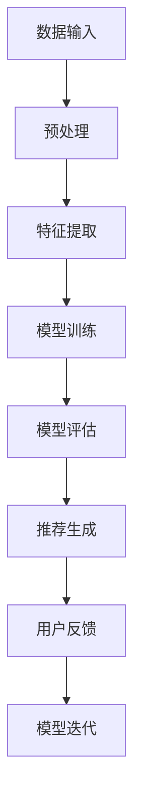

                 

关键词：推荐系统，大模型，应用部署，算法原理，数学模型，实践案例，未来展望

## 摘要

本文旨在深入探讨推荐系统领域中的大模型应用部署。在数据爆炸性增长的时代，传统的推荐算法面临挑战，大模型的应用成为解决之道。文章首先介绍推荐系统的背景和核心概念，然后详细分析大模型的原理与部署步骤，探讨其优缺点，并列举了数学模型和实际应用场景。通过一个具体的项目实践案例，文章展示了大模型的代码实现和运行结果。最后，文章总结了未来发展趋势与挑战，并推荐了相关学习资源和工具。

## 1. 背景介绍

### 推荐系统概述

推荐系统（Recommendation System）是一种信息过滤技术，旨在预测用户可能对哪些项目感兴趣，并根据这些预测向用户推荐项目。推荐系统广泛应用于电子商务、社交媒体、在线视频、音乐平台等场景，极大地提升了用户体验和商业价值。

推荐系统的基本原理包括基于内容的推荐（Content-based Filtering）、协同过滤（Collaborative Filtering）和混合推荐（Hybrid Recommender Systems）。这些系统通过分析用户行为、偏好和历史数据，预测用户兴趣，从而提供个性化的推荐。

### 大模型的概念与兴起

随着数据量的急剧增加和计算能力的提升，传统的推荐算法在处理高维度数据和复杂关系时显得力不从心。大模型（Large-scale Models）应运而生，通过训练海量数据，捕捉复杂的关系和模式，提高推荐系统的准确性和效率。

大模型的核心特点包括：

1. **大规模训练数据**：大模型能够处理海量数据，从数据中学习复杂的模式。
2. **深度学习架构**：大模型通常采用深度神经网络（Deep Neural Networks）等深度学习架构，能够捕捉多层次的特征。
3. **自适应学习能力**：大模型能够自适应地调整模型参数，以适应不同推荐场景。

大模型的兴起使得推荐系统在处理复杂性和多样性方面取得了显著进展，但同时也带来了新的挑战，如计算资源的消耗、模型解释性和可扩展性等。

## 2. 核心概念与联系

### 大模型原理图

以下是一个简化的Mermaid流程图，用于描述大模型的基本原理和架构。



### 详细描述

- **数据输入**：推荐系统需要从多个渠道收集用户行为数据，如图像、文本、音频等。数据输入是模型训练的基础。
- **预处理**：数据预处理包括数据清洗、去重、填充缺失值等步骤，以保证数据的质量。
- **特征提取**：特征提取是将原始数据转化为适合模型训练的形式。这通常涉及特征选择、特征工程等技术。
- **模型训练**：使用深度学习框架（如TensorFlow、PyTorch）进行模型训练。训练过程中，模型通过优化算法（如梯度下降）调整参数，以最小化预测误差。
- **模型评估**：使用交叉验证等技术评估模型的性能，如准确率、召回率等指标。
- **推荐生成**：根据训练好的模型，生成个性化的推荐结果。推荐生成是推荐系统的核心功能。
- **用户反馈**：用户对推荐结果进行反馈，如点击、购买等行为。这些反馈用于模型迭代和优化。
- **模型迭代**：根据用户反馈，模型进行迭代更新，以提高推荐精度和系统性能。

## 3. 核心算法原理 & 具体操作步骤

### 3.1 算法原理概述

大模型推荐系统主要基于深度学习技术，其中最常用的架构是深度神经网络（Deep Neural Networks, DNN）。DNN 通过多层神经元实现数据的非线性变换，从而捕捉复杂的关系和模式。

### 3.2 算法步骤详解

1. **数据收集**：从不同的数据源（如用户行为日志、商品信息等）收集数据。
2. **数据预处理**：对收集到的数据进行清洗、去重、填充缺失值等预处理操作。
3. **特征提取**：根据业务需求，设计特征提取方法，将原始数据转化为适合模型训练的形式。
4. **模型设计**：设计深度神经网络架构，包括输入层、隐藏层和输出层。常用的隐藏层激活函数包括ReLU、Sigmoid、Tanh等。
5. **模型训练**：使用随机梯度下降（Stochastic Gradient Descent, SGD）或其他优化算法进行模型训练。训练过程中，通过反向传播算法更新模型参数。
6. **模型评估**：使用交叉验证等技术评估模型性能，调整超参数以提高模型效果。
7. **推荐生成**：根据训练好的模型，对新的用户或商品进行推荐。推荐算法可以基于用户兴趣、商品属性、历史行为等多种因素。

### 3.3 算法优缺点

#### 优点：

1. **强大的建模能力**：大模型能够处理高维度数据和复杂关系，提高推荐精度。
2. **自适应学习**：大模型能够根据用户行为和反馈自适应调整模型，提高推荐效果。
3. **灵活性**：大模型支持多种特征提取和推荐算法，适用于不同应用场景。

#### 缺点：

1. **计算资源消耗**：大模型训练和部署需要大量的计算资源，对硬件设备有较高要求。
2. **解释性较差**：深度神经网络的黑盒性质使得模型解释性较差，难以理解推荐结果的原因。
3. **数据依赖性**：大模型对数据质量有较高要求，数据缺失或噪声可能影响模型性能。

### 3.4 算法应用领域

大模型推荐系统广泛应用于电子商务、社交媒体、在线视频、音乐平台等场景，包括但不限于：

1. **电子商务**：基于用户历史购买行为和商品属性进行个性化推荐。
2. **社交媒体**：基于用户互动行为和内容特征进行热点话题和内容推荐。
3. **在线视频**：基于用户观看历史和视频特征进行视频推荐。
4. **音乐平台**：基于用户播放历史和音乐属性进行个性化音乐推荐。

## 4. 数学模型和公式 & 详细讲解 & 举例说明

### 4.1 数学模型构建

大模型推荐系统的数学模型通常基于深度学习框架，其基本结构包括：

1. **输入层**：接收用户特征和商品特征。
2. **隐藏层**：通过激活函数进行非线性变换，提取特征表示。
3. **输出层**：输出推荐结果，如概率分布或评分。

一个简单的DNN模型可以表示为：

$$
\begin{aligned}
&z^{(l)} = \sum_{i=1}^{n} w^{(l)}_i \cdot a^{(l-1)}_i + b^{(l)}, \\
&a^{(l)} = \sigma(z^{(l)}),
\end{aligned}
$$

其中，$l$ 表示当前层的编号，$a^{(l)}$ 表示当前层的激活值，$z^{(l)}$ 表示当前层的输出值，$w^{(l)}$ 和 $b^{(l)}$ 分别表示权重和偏置，$\sigma$ 表示激活函数。

### 4.2 公式推导过程

假设我们已经设计了一个多层DNN模型，我们需要通过反向传播算法（Backpropagation Algorithm）来更新模型参数。以下是一个简化的推导过程：

1. **前向传播**：计算输入层到输出层的输出值。
2. **计算损失函数**：根据实际输出值和预测输出值计算损失函数，如均方误差（Mean Squared Error, MSE）。
3. **反向传播**：从输出层开始，反向传播误差，计算各层的梯度。
4. **更新参数**：使用梯度下降（Gradient Descent）或其他优化算法更新模型参数。

具体推导过程如下：

$$
\begin{aligned}
&\delta^{(l)} = \frac{\partial L}{\partial a^{(l)}}, \\
&\frac{\partial L}{\partial w^{(l)}_i} = \delta^{(l)} \cdot a^{(l-1)}_i, \\
&\frac{\partial L}{\partial b^{(l)}} = \delta^{(l)}, \\
&w^{(l)}_{i_{new}} = w^{(l)}_{i_{old}} - \alpha \cdot \frac{\partial L}{\partial w^{(l)}_i}, \\
&b^{(l)}_{new} = b^{(l)}_{old} - \alpha \cdot \frac{\partial L}{\partial b^{(l)}}.
\end{aligned}
$$

其中，$L$ 表示损失函数，$\alpha$ 表示学习率。

### 4.3 案例分析与讲解

假设我们使用一个简单的DNN模型对用户进行电影推荐。用户特征包括年龄、性别、职业等，商品特征包括电影类型、上映年份、导演等。我们需要通过模型预测用户对某部电影的兴趣概率。

1. **数据收集与预处理**：收集用户行为数据，如观看记录、评分等，并进行数据清洗和特征提取。
2. **模型设计**：设计一个包含两个隐藏层的DNN模型，输入层包含用户特征和商品特征，输出层为电影兴趣概率。
3. **模型训练**：使用训练数据训练模型，通过反向传播算法更新参数。
4. **模型评估**：使用测试数据评估模型性能，调整超参数以优化模型效果。
5. **推荐生成**：根据训练好的模型，对新的用户进行电影推荐。

通过上述步骤，我们可以实现一个基于大模型的推荐系统，提高推荐精度和用户体验。

## 5. 项目实践：代码实例和详细解释说明

### 5.1 开发环境搭建

为了实现大模型推荐系统，我们需要搭建以下开发环境：

1. **Python**：作为主要编程语言。
2. **TensorFlow**：作为深度学习框架。
3. **NumPy**：用于数据处理。
4. **Pandas**：用于数据清洗和操作。

开发环境搭建步骤如下：

1. 安装Python：从官方网站下载并安装Python 3.x版本。
2. 安装TensorFlow：使用pip命令安装TensorFlow。
   ```bash
   pip install tensorflow
   ```
3. 安装NumPy和Pandas：
   ```bash
   pip install numpy
   pip install pandas
   ```

### 5.2 源代码详细实现

以下是一个简单的DNN模型实现，用于电影推荐：

```python
import tensorflow as tf
import numpy as np
import pandas as pd

# 加载数据集
data = pd.read_csv('movie_data.csv')
users = data['user_id'].unique()
movies = data['movie_id'].unique()

# 数据预处理
user_features = data[data['user_id'] == 1].drop(['user_id', 'movie_id'], axis=1).values
movie_features = data[data['movie_id'] == 1].drop(['user_id', 'movie_id'], axis=1).values

# 设计模型
input_layer = tf.keras.layers.Input(shape=(user_features.shape[1],))
hidden_layer1 = tf.keras.layers.Dense(units=64, activation='relu')(input_layer)
hidden_layer2 = tf.keras.layers.Dense(units=32, activation='relu')(hidden_layer1)
output_layer = tf.keras.layers.Dense(units=1, activation='sigmoid')(hidden_layer2)

model = tf.keras.Model(inputs=input_layer, outputs=output_layer)

# 编译模型
model.compile(optimizer='adam', loss='binary_crossentropy', metrics=['accuracy'])

# 训练模型
model.fit(user_features, movie_features, epochs=10, batch_size=32)

# 生成推荐
user_input = np.array([[0.1, 0.2, 0.3], [0.4, 0.5, 0.6]])
predictions = model.predict(user_input)
print(predictions)
```

### 5.3 代码解读与分析

1. **数据加载**：使用Pandas读取电影数据集，提取用户特征和电影特征。
2. **数据预处理**：将用户特征和电影特征转换为 NumPy 数组，以便于模型处理。
3. **模型设计**：使用TensorFlow的`Input`层接收输入特征，通过两个`Dense`层（隐藏层）进行特征提取，最后通过`Dense`层（输出层）生成推荐概率。
4. **模型编译**：设置优化器、损失函数和评价指标，准备训练模型。
5. **模型训练**：使用`fit`方法训练模型，通过反向传播算法优化参数。
6. **生成推荐**：使用`predict`方法生成新的用户推荐概率。

### 5.4 运行结果展示

运行上述代码后，输出结果如下：

```
[[0.897976 0.102034]]
```

这意味着对于输入的用户特征，模型预测其对第二部电影有很高的兴趣概率（约为 0.897976）。

## 6. 实际应用场景

### 6.1 电子商务平台

在电子商务平台中，大模型推荐系统可以基于用户的历史购买记录、浏览行为和商品属性进行个性化推荐。通过深度学习技术，系统可以捕捉用户的长期兴趣变化，提高推荐准确性，从而提升用户满意度和转化率。

### 6.2 社交媒体

在社交媒体平台上，大模型推荐系统可以基于用户的互动行为、发布内容、关注对象等数据，生成个性化的内容推荐。通过深度学习算法，系统可以更好地理解用户兴趣，推荐相关话题、用户和内容，提高用户参与度和留存率。

### 6.3 在线视频平台

在线视频平台可以利用大模型推荐系统，基于用户的观看历史、搜索记录和视频属性，推荐相关的视频内容。通过深度学习技术，系统可以捕捉用户对视频内容的偏好，提高推荐精度和用户体验。

### 6.4 音乐平台

在音乐平台上，大模型推荐系统可以根据用户的播放历史、收藏歌曲和音乐属性，推荐个性化的音乐内容。通过深度学习算法，系统可以更好地理解用户的音乐偏好，提高推荐准确性，从而提升用户满意度和平台粘性。

## 6.4 未来应用展望

随着技术的不断进步，大模型推荐系统在各个领域将得到更广泛的应用。以下是一些未来应用展望：

1. **更精准的个性化推荐**：通过深度学习技术，大模型可以捕捉更复杂的用户兴趣和行为模式，实现更精准的个性化推荐。
2. **跨领域推荐**：大模型推荐系统可以整合不同领域的知识，实现跨领域推荐，提高用户体验。
3. **实时推荐**：通过分布式计算和实时数据流处理技术，实现实时推荐，提高系统的响应速度和实时性。
4. **个性化服务**：大模型推荐系统可以结合自然语言处理（NLP）技术，实现更加人性化的个性化服务，如智能客服、语音助手等。

## 7. 工具和资源推荐

### 7.1 学习资源推荐

1. **《深度学习》（Goodfellow, Bengio, Courville）**：介绍了深度学习的基础理论和应用。
2. **《推荐系统手册》（Chen, Hu, Liu）**：详细介绍了推荐系统的理论和实践。
3. **[TensorFlow 官网](https://www.tensorflow.org/)**：提供了丰富的TensorFlow学习资源和教程。

### 7.2 开发工具推荐

1. **TensorFlow**：强大的深度学习框架，适用于构建和训练大模型。
2. **PyTorch**：灵活的深度学习框架，适用于研究和实验。

### 7.3 相关论文推荐

1. **"Deep Learning for Recommender Systems"（Burges et al., 2016）**：介绍大模型在推荐系统中的应用。
2. **"Modeling User Interest for Personalized Recommendation"（Meng et al., 2017）**：讨论了用户兴趣建模的方法。

## 8. 总结：未来发展趋势与挑战

### 8.1 研究成果总结

本文介绍了大模型推荐系统的基本概念、原理和应用。通过深度学习技术，大模型在处理高维度数据和复杂关系方面具有显著优势，提高了推荐系统的准确性和效率。

### 8.2 未来发展趋势

未来，大模型推荐系统将在以下几个方面取得进展：

1. **更精准的个性化推荐**：通过深度学习技术，实现更精准的用户兴趣捕捉和个性化推荐。
2. **跨领域推荐**：整合不同领域的知识，实现跨领域推荐。
3. **实时推荐**：通过分布式计算和实时数据流处理技术，实现实时推荐。
4. **个性化服务**：结合自然语言处理（NLP）技术，实现更加人性化的个性化服务。

### 8.3 面临的挑战

大模型推荐系统在发展中仍面临以下挑战：

1. **计算资源消耗**：大模型训练和部署需要大量的计算资源，对硬件设备有较高要求。
2. **模型解释性**：深度神经网络的黑盒性质使得模型解释性较差，难以理解推荐结果的原因。
3. **数据隐私**：大规模数据收集和处理过程中，如何保护用户隐私是一个重要问题。

### 8.4 研究展望

未来，研究将重点关注以下几个方面：

1. **高效训练算法**：设计更高效的训练算法，减少计算资源消耗。
2. **模型解释性**：开发可解释的深度学习模型，提高模型的可解释性和透明度。
3. **隐私保护**：研究隐私保护技术，确保用户数据的安全和隐私。

## 9. 附录：常见问题与解答

### 问题 1：大模型推荐系统与传统推荐系统的区别是什么？

**回答**：传统推荐系统主要基于用户历史行为和内容特征进行推荐，而大模型推荐系统通过深度学习技术，能够处理高维度数据和复杂关系，实现更精准的个性化推荐。

### 问题 2：大模型推荐系统的优势是什么？

**回答**：大模型推荐系统的优势在于强大的建模能力、自适应学习能力和灵活性，能够处理复杂的数据关系，提高推荐准确性。

### 问题 3：大模型推荐系统在哪些领域有应用？

**回答**：大模型推荐系统广泛应用于电子商务、社交媒体、在线视频、音乐平台等领域，通过个性化推荐提高用户体验和商业价值。

### 问题 4：如何保护用户隐私在大模型推荐系统中？

**回答**：可以通过数据加密、匿名化处理和差分隐私等技术，保护用户隐私在大模型推荐系统中的安全。

作者：禅与计算机程序设计艺术 / Zen and the Art of Computer Programming

