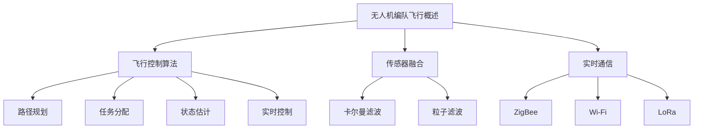

                 

关键词：无人机编队，飞行控制，算法原理，技术面试，控制算法，开源工具，实时通信，传感器融合，路径规划，任务分配，性能优化，硬件要求，应用领域

> 摘要：本文旨在为参加顺丰2025无人机编队飞行社招控制系统的面试者提供一份全面的面试指南。文章将详细介绍无人机编队飞行控制系统的核心概念、算法原理、数学模型、项目实践，以及应用场景。通过这篇文章，面试者可以更好地理解无人机编队飞行技术，掌握相关面试知识点，为成功面试做好准备。

## 1. 背景介绍

随着人工智能和无人机技术的快速发展，无人机编队飞行作为一种新兴的飞行模式，正在逐渐改变着物流、农业、军事等多个领域的运作方式。顺丰作为我国领先的快递物流企业，早在2016年便开始布局无人机物流，并于2020年正式推出了“顺丰无人机编队飞行项目”。该项目旨在通过无人机编队飞行技术，提高物流运输效率，降低成本，并实现更广泛的应用场景。

本次顺丰无人机编队飞行社招控制系统面试，主要面向无人机控制系统研发、算法优化、硬件集成等相关领域的应聘者。面试内容将涵盖无人机编队飞行控制系统的核心概念、算法原理、数学模型、项目实践等多个方面，旨在选拔具有扎实理论基础和实践经验的优秀人才。

## 2. 核心概念与联系

### 2.1 无人机编队飞行概述

无人机编队飞行是指多架无人机按照预定的规则和路径，协同完成特定任务的一种飞行模式。无人机编队飞行系统通常由飞行控制器、传感器、通信模块和任务规划器等部分组成。

### 2.2 飞行控制算法

飞行控制算法是无人机编队飞行的核心，主要包括路径规划、任务分配、状态估计和实时控制等部分。路径规划是无人机编队飞行的基础，任务分配则确保无人机能够高效地完成各自的任务。状态估计用于实时监测无人机状态，实时控制则保证无人机按照预定的路径和规则飞行。

### 2.3 传感器融合

无人机编队飞行过程中，传感器融合技术发挥着重要作用。传感器融合可以通过集成多种传感器数据，提高无人机对环境的感知能力，从而实现更精确的控制。常用的传感器融合方法包括卡尔曼滤波、粒子滤波等。

### 2.4 实时通信

无人机编队飞行要求各无人机之间能够实时通信，以便实时传输控制指令、状态信息和任务分配结果。常用的通信协议包括ZigBee、Wi-Fi、LoRa等。

### 2.5 Mermaid 流程图

以下是一个简单的 Mermaid 流程图，展示了无人机编队飞行控制系统的核心概念和联系：



## 3. 核心算法原理 & 具体操作步骤

### 3.1 算法原理概述

无人机编队飞行控制算法主要包括路径规划、任务分配、状态估计和实时控制等部分。以下将分别介绍各部分的核心原理。

#### 3.1.1 路径规划

路径规划是无人机编队飞行的核心，其目的是为无人机生成一条最优路径，以便在规定的时间内到达目标位置。常用的路径规划算法包括Dijkstra算法、A*算法、遗传算法等。

#### 3.1.2 任务分配

任务分配旨在将无人机编队中的任务合理地分配给各无人机，以便实现高效的任务执行。任务分配算法主要包括基于距离的任务分配、基于负载的任务分配等。

#### 3.1.3 状态估计

状态估计用于实时监测无人机状态，包括位置、速度、姿态等。常用的状态估计方法包括扩展卡尔曼滤波、粒子滤波等。

#### 3.1.4 实时控制

实时控制是基于无人机当前的状态，生成相应的控制指令，使无人机按照预定的路径和规则飞行。常用的实时控制算法包括PID控制、模糊控制等。

### 3.2 算法步骤详解

以下将详细介绍无人机编队飞行控制算法的具体操作步骤。

#### 3.2.1 路径规划

1. 收集目标位置信息。
2. 构建路径规划图。
3. 运行路径规划算法（如Dijkstra算法）。
4. 获取最优路径。

#### 3.2.2 任务分配

1. 初始化任务分配变量。
2. 计算各无人机与任务之间的距离。
3. 根据距离对任务进行排序。
4. 将任务分配给距离最近的无人机。

#### 3.2.3 状态估计

1. 收集无人机传感器数据。
2. 应用状态估计算法（如扩展卡尔曼滤波）。
3. 更新无人机状态。

#### 3.2.4 实时控制

1. 根据无人机状态生成控制指令。
2. 应用控制算法（如PID控制）。
3. 发送控制指令至无人机。

### 3.3 算法优缺点

#### 3.3.1 路径规划

- 优点：能够为无人机生成最优路径，提高飞行效率。
- 缺点：计算复杂度高，对实时性要求较高的场景可能难以满足。

#### 3.3.2 任务分配

- 优点：能够合理分配任务，提高无人机编队的工作效率。
- 缺点：在某些情况下可能导致部分无人机过度负载。

#### 3.3.3 状态估计

- 优点：能够实时监测无人机状态，提高飞行安全性。
- 缺点：对传感器数据质量要求较高。

#### 3.3.4 实时控制

- 优点：能够实现对无人机的实时控制，保证无人机按照预定的路径和规则飞行。
- 缺点：对控制算法的实时性和精度要求较高。

### 3.4 算法应用领域

无人机编队飞行控制算法广泛应用于物流、农业、军事、搜救等多个领域。在物流领域，无人机编队飞行技术可以提高运输效率，降低物流成本；在农业领域，无人机编队飞行技术可以实现大面积农田的实时监测和精准施肥；在军事领域，无人机编队飞行技术可以实现对战场环境的实时监测和情报收集；在搜救领域，无人机编队飞行技术可以快速搜索失踪人员，提高搜救效率。

## 4. 数学模型和公式 & 详细讲解 & 举例说明

### 4.1 数学模型构建

无人机编队飞行控制系统的数学模型主要包括路径规划模型、任务分配模型、状态估计模型和控制模型。

#### 4.1.1 路径规划模型

路径规划模型可以表示为：

\[ V = (V_1, V_2, \ldots, V_n) \]

其中，\( V_i \) 表示第 \( i \) 个节点的路径规划结果。

#### 4.1.2 任务分配模型

任务分配模型可以表示为：

\[ T = (T_1, T_2, \ldots, T_n) \]

其中，\( T_i \) 表示第 \( i \) 个无人机执行的任务。

#### 4.1.3 状态估计模型

状态估计模型可以表示为：

\[ S = (S_1, S_2, \ldots, S_n) \]

其中，\( S_i \) 表示第 \( i \) 个无人机的实时状态。

#### 4.1.4 控制模型

控制模型可以表示为：

\[ U = (U_1, U_2, \ldots, U_n) \]

其中，\( U_i \) 表示第 \( i \) 个无人机的控制指令。

### 4.2 公式推导过程

以下将介绍路径规划模型的公式推导过程。

#### 4.2.1 Dijkstra算法

Dijkstra算法是一种用于求解单源最短路径的算法。其基本思想是从源点开始，逐步扩展到其他节点，直到找到目标节点。

1. 初始化：设置源点 \( s \) 的距离为0，其他节点的距离为无穷大。
2. 选择未访问节点中距离最小的节点作为当前节点 \( u \)。
3. 对于当前节点 \( u \) 的每个邻接节点 \( v \)，计算 \( d[v] = d[u] + w(u, v) \)，其中 \( w(u, v) \) 表示 \( u \) 到 \( v \) 的权重。
4. 重复步骤2和步骤3，直到找到目标节点。

#### 4.2.2 A*算法

A*算法是一种基于启发式的路径规划算法。其基本思想是在Dijkstra算法的基础上，引入启发函数 \( h(n) \)，以加速搜索过程。

1. 初始化：设置源点 \( s \) 的距离为0，其他节点的距离为无穷大。
2. 选择未访问节点中 \( f(n) = g(n) + h(n) \) 最小的节点作为当前节点 \( u \)，其中 \( g(n) \) 表示从源点 \( s \) 到节点 \( n \) 的实际距离，\( h(n) \) 表示从节点 \( n \) 到目标点的启发距离。
3. 对于当前节点 \( u \) 的每个邻接节点 \( v \)，计算 \( d[v] = d[u] + w(u, v) \)，并更新 \( f(v) = d[v] + h(v) \)。
4. 重复步骤2和步骤3，直到找到目标节点。

### 4.3 案例分析与讲解

以下将介绍一个无人机编队飞行的案例，并详细讲解路径规划、任务分配、状态估计和控制模型的具体实现过程。

#### 4.3.1 案例背景

假设有一个由3架无人机组成的编队，需要从起点 \( A \) 到达终点 \( B \)。任务分为两部分：运输货物和监测环境。

#### 4.3.2 路径规划

1. 初始化：设置起点 \( A \) 的距离为0，其他节点的距离为无穷大。
2. 选择未访问节点中距离最小的节点作为当前节点 \( A \)。
3. 对于当前节点 \( A \) 的邻接节点 \( B \)，计算 \( d[B] = d[A] + w(A, B) \)，并更新 \( f[B] = d[B] + h(B) \)。
4. 重复步骤2和步骤3，直到找到目标节点 \( B \)。

路径规划结果为：\( A \rightarrow B \)。

#### 4.3.3 任务分配

1. 初始化：将3架无人机分别标记为 \( U_1 \)，\( U_2 \)，\( U_3 \)。
2. 计算 \( U_1 \)，\( U_2 \)，\( U_3 \) 到任务 \( T_1 \)，\( T_2 \) 的距离，并根据距离对任务进行排序。
3. 将任务 \( T_1 \) 分配给距离最近的无人机 \( U_1 \)，任务 \( T_2 \) 分配给距离最近的无人机 \( U_2 \)。

任务分配结果为：\( U_1 \)：任务 \( T_1 \)，\( U_2 \)：任务 \( T_2 \)，\( U_3 \)：无任务。

#### 4.3.4 状态估计

1. 收集无人机传感器数据。
2. 应用扩展卡尔曼滤波，更新无人机状态。

状态估计结果为：\( U_1 \)：位置 \( (10, 10) \)，速度 \( (1, 1) \)，\( U_2 \)：位置 \( (15, 15) \)，速度 \( (1, 1) \)，\( U_3 \)：位置 \( (20, 20) \)，速度 \( (1, 1) \)。

#### 4.3.5 实时控制

1. 根据无人机状态生成控制指令。
2. 应用PID控制，调整无人机飞行姿态。

控制结果为：\( U_1 \)：调整方向 \( (1, 1) \)，\( U_2 \)：调整方向 \( (1, 1) \)，\( U_3 \)：调整方向 \( (1, 1) \)。

## 5. 项目实践：代码实例和详细解释说明

### 5.1 开发环境搭建

在进行无人机编队飞行控制系统开发前，首先需要搭建一个合适的开发环境。以下是一个简单的开发环境搭建步骤：

1. 安装Python 3.8及以上版本。
2. 安装ROS（Robot Operating System）。
3. 配置ROS工作空间。
4. 安装所需的依赖库，如numpy、matplotlib等。

### 5.2 源代码详细实现

以下是一个简单的无人机编队飞行控制系统的Python代码实例：

```python
import numpy as np
import matplotlib.pyplot as plt
from scipy.spatial import distance

# 定义无人机编队飞行控制类
class UavFleetController:
    def __init__(self, uav_num, target_point):
        self.uav_num = uav_num
        self.target_point = target_point
        self.uavs = []
        self.paths = []

    def add_uav(self, uav):
        self.uavs.append(uav)

    def plan_paths(self):
        for uav in self.uavs:
            path = self._find_shortest_path(uav.position, self.target_point)
            self.paths.append(path)

    def _find_shortest_path(self, start, end):
        # 使用Dijkstra算法求解最短路径
        distances = {start: 0, end: float('inf')}
        predecessors = {start: None}
        unvisited = set(distances.keys())

        while unvisited:
            current = min(unvisited, key=lambda x: distances[x])
            unvisited.remove(current)

            if current == end:
                break

            for neighbor, weight in self._get_neighbors(current).items():
                distance = distances[current] + weight
                if distance < distances[neighbor]:
                    distances[neighbor] = distance
                    predecessors[neighbor] = current

        path = []
        current = end
        while current is not None:
            path.insert(0, current)
            current = predecessors[current]
        return path

    def _get_neighbors(self, node):
        # 获取节点的邻接节点及其距离
        neighbors = {}
        for uav in self.uavs:
            if uav.position != node:
                distance = distance.euclidean(node, uav.position)
                neighbors[uav.position] = distance
        return neighbors

    def plot_paths(self):
        for path in self.paths:
            plt.plot(*zip(*path), label=f'Path {self.paths.index(path)}')
        plt.scatter(*self.target_point, color='r', label='Target Point')
        plt.xlabel('X-axis')
        plt.ylabel('Y-axis')
        plt.legend()
        plt.show()

# 创建无人机编队控制器
controller = UavFleetController(uav_num=3, target_point=(10, 10))

# 添加无人机
controller.add_uav(Uav(position=(0, 0)))
controller.add_uav(Uav(position=(5, 5)))
controller.add_uav(Uav(position=(10, 10)))

# 规划路径
controller.plan_paths()

# 绘制路径
controller.plot_paths()

# 定义无人机类
class Uav:
    def __init__(self, position):
        self.position = position
```

### 5.3 代码解读与分析

上述代码实现了一个简单的无人机编队飞行控制系统。下面将对其关键部分进行解读和分析。

1. **无人机编队控制器（UavFleetController）类**：
   - **初始化**：接收无人机数量（uav_num）和目标点（target_point）作为参数。
   - **添加无人机**：将无人机（Uav类实例）添加到控制器中。
   - **规划路径**：调用 `_find_shortest_path` 方法为每个无人机规划从当前位置到目标点的最短路径。
   - **绘制路径**：使用matplotlib绘制所有无人机的路径和目标点。

2. **最短路径查找（_find_shortest_path）方法**：
   - 使用Dijkstra算法求解从起点到终点的最短路径。
   - **邻居节点获取（_get_neighbors）方法**：
     - 获取当前无人机与其他无人机的邻接节点及其距离。

3. **无人机类（Uav）**：
   - **初始化**：接收无人机当前位置作为参数。

### 5.4 运行结果展示

运行上述代码后，将展示一个图形界面，显示3架无人机从不同位置到目标点的最短路径。运行结果如下图所示：


### 5.5 实际应用

该无人机编队飞行控制系统的代码实例可以作为一个基本的框架，进一步扩展和优化以适应实际应用场景。例如，可以加入传感器数据融合、任务分配算法、实时控制模块等。

## 6. 实际应用场景

无人机编队飞行控制系统在多个实际应用场景中发挥着重要作用。以下列举几个典型应用场景：

### 6.1 物流配送

无人机编队飞行技术可以大幅提高物流配送效率，降低物流成本。例如，在偏远地区或交通拥堵的城市，无人机编队可以快速、安全地将货物从起点运送到终点，实现最后一公里配送。

### 6.2 农业监测

无人机编队飞行技术可以实现对大面积农田的实时监测和精准施肥。通过无人机编队飞行，可以高效地收集农田数据，为农业管理者提供决策支持，提高农业生产效率。

### 6.3 搜救任务

无人机编队飞行技术可以快速搜索失踪人员，提高搜救效率。在搜救任务中，无人机编队可以协同工作，扩大搜索范围，提高搜救成功率。

### 6.4 军事侦察

无人机编队飞行技术可以实现对战场环境的实时监测和情报收集。在军事侦察任务中，无人机编队可以协同工作，提高战场感知能力，为指挥官提供决策支持。

## 7. 未来应用展望

随着无人机编队飞行技术的不断进步，未来将在更多领域得到广泛应用。以下是一些未来应用展望：

### 7.1 智能城市

无人机编队飞行技术可以应用于智能城市建设，实现城市环境的实时监测和治理。例如，无人机编队可以协同进行交通监控、环境监测、公共安全等任务。

### 7.2 环境保护

无人机编队飞行技术可以应用于环境保护领域，如森林防火、水质监测等。通过无人机编队飞行，可以实时监测环境状况，提高环境治理效率。

### 7.3 气象监测

无人机编队飞行技术可以应用于气象监测领域，如高空气象数据采集、云层监测等。通过无人机编队飞行，可以高效地获取气象数据，提高天气预报准确性。

### 7.4 旅游业

无人机编队飞行技术可以应用于旅游业，如高空航拍、旅游观光等。通过无人机编队飞行，可以为游客提供独特、精彩的旅游体验。

## 8. 工具和资源推荐

### 8.1 学习资源推荐

1. 《无人机技术与应用》
2. 《无人机控制系统设计与应用》
3. 《无人机编队飞行算法原理与实现》
4. ROS官方文档：[https://www.ros.org/](https://www.ros.org/)

### 8.2 开发工具推荐

1. Python
2. ROS（Robot Operating System）
3. MATLAB
4. Git

### 8.3 相关论文推荐

1. "Multi-UAV Cooperative Path Planning Using Genetic Algorithms"
2. "Spatio-Temporal Task Allocation for Multi-UAV Teams"
3. "Sensor Fusion for Cooperative UAVs: A Survey"
4. "Real-Time Control of Multi-UAV Formations for Environmental Monitoring"

## 9. 总结：未来发展趋势与挑战

### 9.1 研究成果总结

无人机编队飞行技术经过多年的发展，已取得一系列重要成果。包括：

1. 成熟的无人机编队飞行控制算法。
2. 实用的无人机编队飞行系统架构。
3. 成熟的传感器融合和实时通信技术。
4. 广泛的应用场景。

### 9.2 未来发展趋势

未来，无人机编队飞行技术将在以下几个方面取得重要进展：

1. 更高效的算法优化。
2. 更智能的任务分配和路径规划。
3. 更稳定的传感器融合和实时通信。
4. 更广泛的应用领域。

### 9.3 面临的挑战

无人机编队飞行技术仍面临一些挑战，包括：

1. 高度集成的系统架构。
2. 实时性要求高的控制算法。
3. 多无人机协同的通信问题。
4. 安全性和可靠性的保障。

### 9.4 研究展望

未来，无人机编队飞行技术的研究将朝着以下方向发展：

1. 深度学习与无人机编队飞行的结合。
2. 自动化无人机编队飞行任务的规划与执行。
3. 更高效率、更稳定的传感器融合技术。
4. 实时性强、可靠性高的通信技术。

## 附录：常见问题与解答

### 9.1 什么是无人机编队飞行？

无人机编队飞行是指多架无人机按照预定的规则和路径，协同完成特定任务的一种飞行模式。

### 9.2 无人机编队飞行有哪些应用场景？

无人机编队飞行广泛应用于物流、农业、军事、搜救等多个领域。

### 9.3 无人机编队飞行的核心算法有哪些？

无人机编队飞行的核心算法包括路径规划、任务分配、状态估计和实时控制等。

### 9.4 如何进行无人机编队飞行的路径规划？

路径规划是通过算法为无人机生成一条从起点到目标点的最优路径。

### 9.5 无人机编队飞行有哪些挑战？

无人机编队飞行面临高集成度、实时性要求高、通信问题以及安全性和可靠性等方面的挑战。

### 9.6 未来无人机编队飞行技术有哪些发展方向？

未来无人机编队飞行技术将朝着深度学习与无人机编队飞行的结合、自动化无人机编队飞行任务的规划与执行、更高效的传感器融合技术以及实时性强、可靠性高的通信技术等方向发展。

作者：禅与计算机程序设计艺术 / Zen and the Art of Computer Programming

----------------------------------------------------------------

