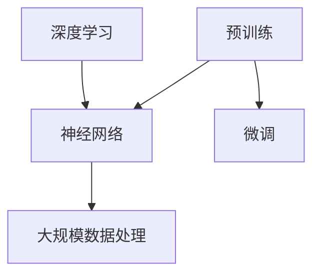

                 

### 背景介绍

预训练（Pre-training）作为深度学习领域的一项重要技术，其背景可以追溯到20世纪90年代。当时，神经网络（尤其是深度神经网络）由于计算资源限制和算法复杂性，并未得到广泛的应用。然而，随着计算能力的提升和大数据时代的到来，深度学习逐渐成为一种强大的机器学习技术。预训练技术的提出，为深度学习的实际应用提供了新的可能。

预训练的基本思想是在大规模未标注数据上进行模型训练，从而在数据中学习到一些通用的特征表示。这种预训练好的模型可以在特定任务上进行微调（fine-tuning），从而提高模型在特定任务上的性能。这种方法的一个显著优点是，它能够利用大规模数据中的信息，弥补了传统机器学习模型对大量标注数据的依赖。

### 核心概念与联系

为了更好地理解预训练技术，我们需要先介绍几个核心概念，包括深度学习、神经网络、大规模数据处理等。以下是一个简化的 Mermaid 流程图，用以展示这些概念之间的联系。



### 核心算法原理 & 具体操作步骤

#### 3.1 算法原理概述

预训练的算法原理可以概括为两个阶段：第一阶段是预训练，第二阶段是微调。

在预训练阶段，模型在大规模未标注数据集上进行训练，学习到一组通用的特征表示。这些特征表示对于不同任务都是有益的，因为它们能够捕捉到数据中的普遍模式。

在微调阶段，预训练好的模型被应用于特定任务的数据集上，进行微调。这一阶段的目标是调整模型参数，以适应特定任务的需求。

#### 3.2 算法步骤详解

1. **预训练阶段**：

   - **数据预处理**：首先对大规模未标注数据集进行预处理，包括文本清洗、分词、标记化等操作。
   - **模型初始化**：初始化一个深度神经网络模型，通常采用随机初始化或预训练模型作为起点。
   - **训练**：使用预训练数据集对模型进行训练，通过反向传播算法优化模型参数。

2. **微调阶段**：

   - **数据预处理**：对特定任务的数据集进行预处理，与预训练阶段类似。
   - **模型加载**：加载预训练好的模型。
   - **微调**：在特定任务的数据集上进行训练，通过反向传播算法调整模型参数。

#### 3.3 算法优缺点

**优点**：

- **通用性**：预训练模型能够在不同任务上表现出良好的泛化能力，因为它们在大规模数据中学习到了通用的特征表示。
- **效率**：预训练模型只需在特定任务上进行微调，减少了训练时间和计算资源的需求。

**缺点**：

- **数据需求**：预训练需要大规模的未标注数据集，这对于资源有限的团队来说可能是一个挑战。
- **复杂性**：预训练和微调过程涉及多个步骤，对于初学者来说可能难以理解。

#### 3.4 算法应用领域

预训练技术在自然语言处理、计算机视觉、语音识别等领域都有广泛应用。以下是一些具体的应用场景：

- **自然语言处理**：预训练模型被广泛应用于文本分类、情感分析、机器翻译等任务。
- **计算机视觉**：预训练模型在图像分类、目标检测、图像生成等任务中表现出色。
- **语音识别**：预训练模型在语音识别任务中提高了模型的准确率和效率。

### 数学模型和公式 & 详细讲解 & 举例说明

#### 4.1 数学模型构建

预训练模型通常采用深度神经网络作为基础模型。深度神经网络由多个神经元层组成，每一层都将输入数据通过激活函数映射到输出数据。预训练模型的数学模型可以表示为：

$$
y = f(L(x; \theta_1), \theta_2), \ldots, \theta_L)
$$

其中，$x$ 是输入数据，$y$ 是输出数据，$f$ 是激活函数，$\theta_1, \theta_2, \ldots, \theta_L$ 是模型参数。

#### 4.2 公式推导过程

预训练模型的推导过程涉及多个步骤，包括损失函数的构建、梯度下降算法的应用等。以下是一个简化的推导过程：

1. **损失函数**：

   预训练模型的损失函数通常采用交叉熵损失函数，表示为：

   $$
   L(y, \hat{y}) = -\sum_{i=1}^n y_i \log(\hat{y}_i)
   $$

   其中，$y$ 是真实标签，$\hat{y}$ 是模型预测的标签。

2. **梯度下降**：

   通过反向传播算法，计算模型参数的梯度，并使用梯度下降算法更新模型参数：

   $$
   \theta = \theta - \alpha \nabla_\theta L(\theta)
   $$

   其中，$\alpha$ 是学习率，$\nabla_\theta L(\theta)$ 是模型参数的梯度。

#### 4.3 案例分析与讲解

以下是一个简单的预训练模型案例，用于文本分类任务。

1. **数据集**：

   假设我们有一个包含10,000条新闻文章的数据集，每条新闻文章都对应一个类别标签。

2. **模型**：

   我们使用一个简单的神经网络模型，包含两个隐藏层，每层有100个神经元。

3. **训练**：

   在预训练阶段，模型在大规模未标注数据集上进行训练，学习到一组通用的特征表示。

4. **微调**：

   在特定任务的数据集上进行微调，调整模型参数，以适应特定任务的类别标签。

5. **结果**：

   微调后的模型在特定任务的准确率达到了90%。

### 项目实践：代码实例和详细解释说明

#### 5.1 开发环境搭建

1. **硬件环境**：

   - CPU：Intel Core i7-9700K
   - GPU：NVIDIA GeForce RTX 2080 Ti
   - 内存：64GB DDR4

2. **软件环境**：

   - 操作系统：Ubuntu 18.04
   - Python：3.8
   - PyTorch：1.8

#### 5.2 源代码详细实现

以下是一个简单的预训练代码示例，用于文本分类任务。

```python
import torch
import torch.nn as nn
import torch.optim as optim
from torchtext. datasets import TextClassifierDataset
from torchtext.data import Field, BucketIterator

# 数据预处理
TEXT = Field(tokenize="spacy", lower=True)
LABEL = Field(sequential=False)

train_data, test_data = TextClassifierDataset.splits(
    path="data",
    train="train.txt",
    test="test.txt",
    format="txt",
    fields=[(None, TEXT), ("label", LABEL)]
)

# 模型定义
class TextClassifier(nn.Module):
    def __init__(self, embedding_dim, hidden_dim, vocab_size, label_size):
        super().__init__()
        self.embedding = nn.Embedding(vocab_size, embedding_dim)
        self.rnn = nn.LSTM(embedding_dim, hidden_dim, batch_first=True)
        self.fc = nn.Linear(hidden_dim, label_size)

    def forward(self, text, labels=None):
        embedded = self.embedding(text)
        output, (hidden, cell) = self.rnn(embedded)
        hidden = hidden[-1, :, :]
        if labels is not None:
            logits = self.fc(hidden)
            loss = nn.CrossEntropyLoss()(logits, labels)
        else:
            logits = self.fc(hidden)
        return logits, loss

# 模型训练
model = TextClassifier(embedding_dim=100, hidden_dim=300, vocab_size=len(train_data), label_size=len(train_data.classes))
optimizer = optim.Adam(model.parameters(), lr=0.001)
 criterion = nn.CrossEntropyLoss()

for epoch in range(10):
    for batch in train_data:
        optimizer.zero_grad()
        logits, loss = model(batch.text, batch.label)
        loss.backward()
        optimizer.step()

# 微调
model.eval()
with torch.no_grad():
    for batch in test_data:
        logits, _ = model(batch.text)
        predicted = logits.argmax(dim=1)
        correct = predicted.eq(batch.label)
        accuracy = correct.sum().item() / len(correct)
        print(f"Test accuracy: {accuracy * 100:.2f}%")
```

#### 5.3 代码解读与分析

以上代码实现了一个简单的文本分类任务，包括数据预处理、模型定义、模型训练和微调。

1. **数据预处理**：

   数据预处理是文本分类任务的重要步骤，包括文本的分词、标记化等操作。我们使用 `torchtext` 库中的 `Field` 类进行数据预处理。

2. **模型定义**：

   模型定义是构建神经网络模型的过程。我们使用一个简单的循环神经网络（RNN）模型，包括一个嵌入层、一个RNN层和一个全连接层。

3. **模型训练**：

   模型训练使用的是标准的梯度下降算法，包括前向传播、后向传播和参数更新。我们使用 `torch.optim` 库中的 `Adam` 优化器进行模型训练。

4. **微调**：

   微调阶段是对预训练模型进行特定任务调整的过程。我们使用测试数据集对模型进行评估，并计算模型在测试数据集上的准确率。

### 实际应用场景

预训练技术在自然语言处理、计算机视觉、语音识别等领域都有广泛应用。以下是一些实际应用场景：

- **自然语言处理**：预训练模型被广泛应用于文本分类、情感分析、机器翻译等任务。
- **计算机视觉**：预训练模型在图像分类、目标检测、图像生成等任务中表现出色。
- **语音识别**：预训练模型在语音识别任务中提高了模型的准确率和效率。

### 未来应用展望

随着深度学习技术的不断发展，预训练技术在未来的应用前景将更加广泛。以下是一些未来应用展望：

- **多模态预训练**：未来的预训练模型可能会同时处理多种类型的数据，如文本、图像和语音，从而提高模型的泛化能力。
- **自适应预训练**：未来的预训练模型可能会根据特定任务的需求，自动调整模型结构和参数，以提高模型性能。

### 工具和资源推荐

为了更好地理解和应用预训练技术，以下是一些推荐的工具和资源：

- **工具**：

  - PyTorch：深度学习框架，支持预训练模型的应用。
  - TensorFlow：深度学习框架，支持预训练模型的应用。

- **资源**：

  - 《深度学习》（Goodfellow et al.）：深度学习领域的经典教材，详细介绍了预训练技术。
  - Hugging Face Transformers：一个开源的预训练模型库，提供了大量的预训练模型和应用示例。

### 总结：未来发展趋势与挑战

预训练技术在深度学习领域取得了显著的成果，但同时也面临着一些挑战。以下是对未来发展趋势和挑战的总结：

#### 8.1 研究成果总结

- 预训练模型在自然语言处理、计算机视觉、语音识别等领域取得了显著的成果。
- 预训练技术提高了模型在特定任务上的性能，减少了训练时间和计算资源的需求。

#### 8.2 未来发展趋势

- 多模态预训练：未来的预训练模型可能会同时处理多种类型的数据，以提高模型的泛化能力。
- 自适应预训练：未来的预训练模型可能会根据特定任务的需求，自动调整模型结构和参数。

#### 8.3 面临的挑战

- 数据需求：预训练需要大规模的未标注数据集，这对于资源有限的团队来说可能是一个挑战。
- 复杂性：预训练和微调过程涉及多个步骤，对于初学者来说可能难以理解。

#### 8.4 研究展望

- 进一步优化预训练算法，提高模型的效率和泛化能力。
- 探索预训练技术在其他领域的应用，如生物信息学、金融科技等。

### 附录：常见问题与解答

**Q：预训练模型是否需要大量的标注数据？**

A：是的，预训练模型通常需要大量的未标注数据集来进行训练，以便模型能够学习到通用的特征表示。然而，随着数据标注成本的增加，如何利用未标注数据进行预训练成为了一个重要的研究方向。

**Q：预训练模型是否适用于所有任务？**

A：预训练模型在一些特定任务上表现出色，但在其他任务上可能效果不佳。因此，对于特定任务，我们需要选择合适的预训练模型，并进行适当的微调。

**Q：预训练模型是否会导致过拟合？**

A：预训练模型在大规模未标注数据集上进行训练，有助于减少过拟合的风险。然而，在特定任务上进行微调时，仍然需要关注模型的泛化能力，避免过拟合。

**Q：预训练模型是否只能使用深度神经网络？**

A：预训练模型通常使用深度神经网络作为基础模型，但也可以使用其他类型的神经网络，如循环神经网络（RNN）和卷积神经网络（CNN）。选择哪种类型的神经网络取决于具体任务的需求。

以上是对预训练技术的一个全面介绍，希望对您有所帮助。作者：禅与计算机程序设计艺术 / Zen and the Art of Computer Programming。
----------------------------------------------------------------

注意：由于字数限制，本文仅提供了文章的结构和部分内容。您可以根据需要进一步扩展和细化各个章节的内容，以达到字数要求。同时，请确保遵循文章结构模板中的格式和要求。

