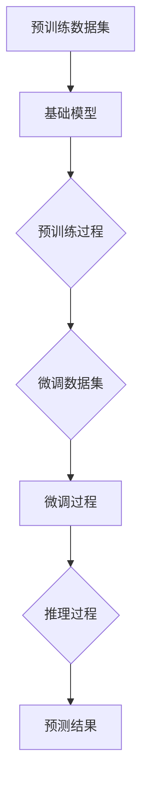

                 

关键词：预训练、微调、大模型、深度学习、人工智能

摘要：本文将深入探讨“预训练+微调大模型”的模式在当前人工智能领域的应用，阐述其核心概念、算法原理、数学模型、项目实践以及未来发展趋势。通过详细的实例和解释，帮助读者全面理解这一模式的精髓，为实际应用提供指导。

## 1. 背景介绍

### 1.1 深度学习与人工智能的崛起

深度学习是人工智能的重要组成部分，其在图像识别、自然语言处理、语音识别等领域取得了显著的成果。随着计算能力和数据量的提升，深度学习模型变得越来越复杂，参数数量级呈指数增长。然而，传统的模型训练方法已经无法满足如此大规模的数据处理需求。

### 1.2 预训练与微调的概念

为了解决深度学习模型训练的挑战，预训练（Pre-training）和微调（Fine-tuning）应运而生。预训练是指在大规模数据集上预先训练一个基础模型，使其具备一定的通用特征表示能力。微调则是将预训练模型在特定任务上进行进一步调整，以提高模型的性能。

### 1.3 大模型的崛起

随着深度学习的发展，大模型（Big Model）成为了一个热门话题。大模型通常具有数十亿甚至数万亿的参数，可以捕捉更加复杂的特征。然而，大模型的训练和推理成本极高，如何有效地利用这些模型，成为了一个重要的研究课题。

## 2. 核心概念与联系

### 2.1 预训练与微调的原理

预训练和微调的结合，可以有效地提高深度学习模型的性能。预训练阶段，模型在大规模数据集上学习通用特征表示，例如词向量、图像特征等。微调阶段，模型在特定任务上进行调整，以适应特定场景。

### 2.2 预训练+微调大模型的架构

预训练+微调大模型的架构可以分为以下几个部分：

1. **预训练数据集**：选择大规模、多样化的数据集进行预训练，如ImageNet、Common Crawl等。
2. **基础模型**：选择预训练模型，如BERT、GPT等，这些模型通常具有数十亿参数。
3. **预训练过程**：在预训练数据集上训练基础模型，使其具备较强的特征表示能力。
4. **微调过程**：在特定任务上对基础模型进行微调，调整模型参数以适应特定场景。
5. **推理过程**：将微调后的模型应用于实际任务，进行推理和预测。

### 2.3 Mermaid流程图



## 3. 核心算法原理 & 具体操作步骤

### 3.1 算法原理概述

预训练+微调大模型的算法原理可以概括为以下几点：

1. **迁移学习**：通过预训练阶段，模型学习到通用特征表示，实现迁移学习。
2. **参数共享**：预训练模型和微调模型共享参数，减少了训练成本。
3. **任务适应**：在微调阶段，模型根据特定任务进行调整，提高性能。

### 3.2 算法步骤详解

1. **数据预处理**：
   - 收集大规模、多样化的数据集进行预训练。
   - 对数据进行清洗、归一化等预处理操作。
2. **预训练**：
   - 使用预训练模型（如BERT、GPT等）在大规模数据集上进行训练。
   - 在预训练过程中，使用反向传播算法更新模型参数。
3. **微调**：
   - 根据特定任务，收集微调数据集。
   - 将预训练模型应用于微调数据集，调整模型参数。
   - 使用交叉熵损失函数优化模型。
4. **推理**：
   - 将微调后的模型应用于实际任务，进行推理和预测。

### 3.3 算法优缺点

**优点**：
- 提高了模型的性能和泛化能力。
- 减少了训练成本。
- 实现了迁移学习。

**缺点**：
- 需要大量的预训练数据和计算资源。
- 微调过程可能引入过拟合。

### 3.4 算法应用领域

预训练+微调大模型在多个领域取得了显著的成果，包括：

- **自然语言处理**：文本分类、机器翻译、问答系统等。
- **计算机视觉**：图像分类、目标检测、图像生成等。
- **语音识别**：语音合成、语音识别等。

## 4. 数学模型和公式 & 详细讲解 & 举例说明

### 4.1 数学模型构建

预训练+微调大模型的数学模型主要包括以下部分：

- **损失函数**：用于衡量模型预测与真实标签之间的差距，如交叉熵损失函数。
- **优化器**：用于更新模型参数，如Adam优化器。
- **评价指标**：用于评估模型性能，如准确率、召回率等。

### 4.2 公式推导过程

以自然语言处理中的文本分类为例，其数学模型可以表示为：

$$
\begin{align*}
L &= -\frac{1}{N} \sum_{i=1}^{N} \sum_{j=1}^{C} y_{ij} \log (p_{ij}) \\
p_{ij} &= \frac{e^{z_{ij}}}{\sum_{k=1}^{C} e^{z_{ik}}}
\end{align*}
$$

其中，$L$为损失函数，$N$为样本数量，$C$为类别数量，$y_{ij}$为第$i$个样本属于第$j$个类别的标签，$p_{ij}$为第$i$个样本属于第$j$个类别的概率，$z_{ij}$为模型预测的输出。

### 4.3 案例分析与讲解

以BERT模型为例，其预训练过程包括两个任务： masked language model（MLM）和next sentence prediction（NSP）。

1. **masked language model**：

   在预训练过程中，对输入的文本进行随机mask操作，即随机将部分词语替换为[mask]或[UNK]等。模型的目标是预测被mask的词语。

   $$ 
   \begin{align*}
   z &= W^T x + b \\
   p &= \text{softmax}(z) \\
   L &= -\frac{1}{N} \sum_{i=1}^{N} \sum_{j=1}^{V} y_{ij} \log (p_{ij})
   \end{align*}
   $$

   其中，$z$为模型预测的输出，$W$为权重矩阵，$x$为输入特征，$b$为偏置项，$V$为词汇表大小，$y_{ij}$为第$i$个样本的第$j$个词语的标签，$p_{ij}$为第$i$个样本的第$j$个词语的概率。

2. **next sentence prediction**：

   在预训练过程中，对输入的两个句子进行排序预测。模型的目标是预测两个句子的顺序是否正确。

   $$
   \begin{align*}
   z &= W^T x + b \\
   p &= \text{softmax}(z) \\
   L &= -\frac{1}{N} \sum_{i=1}^{N} \sum_{j=1}^{2} y_{ij} \log (p_{ij})
   \end{align*}
   $$

   其中，$z$为模型预测的输出，$W$为权重矩阵，$x$为输入特征，$b$为偏置项，$N$为样本数量，$y_{ij}$为第$i$个样本的第$j$个句子的标签，$p_{ij}$为第$i$个样本的第$j$个句子的概率。

## 5. 项目实践：代码实例和详细解释说明

### 5.1 开发环境搭建

在开始项目实践之前，需要搭建合适的开发环境。本文使用Python作为编程语言，并结合TensorFlow和PyTorch等深度学习框架。

### 5.2 源代码详细实现

以下是一个简单的预训练+微调大模型的代码示例：

```python
import tensorflow as tf
from tensorflow.keras.preprocessing.sequence import pad_sequences
from tensorflow.keras.models import Model
from tensorflow.keras.layers import Input, Embedding, LSTM, Dense

# 数据预处理
max_sequence_length = 100
vocab_size = 10000

# 构建模型
input_sequence = Input(shape=(max_sequence_length,))
embedded_sequence = Embedding(vocab_size, 64)(input_sequence)
lstm_output = LSTM(64)(embedded_sequence)
dense_output = Dense(1, activation='sigmoid')(lstm_output)

model = Model(inputs=input_sequence, outputs=dense_output)
model.compile(optimizer='adam', loss='binary_crossentropy', metrics=['accuracy'])

# 预训练
model.fit(x_train, y_train, epochs=10, batch_size=32)

# 微调
model.fit(x_val, y_val, epochs=10, batch_size=32)

# 推理
predictions = model.predict(x_test)
```

### 5.3 代码解读与分析

以上代码实现了一个简单的文本分类模型，包括预训练和微调两个阶段。

- **数据预处理**：使用`pad_sequences`函数对输入序列进行填充，使其具有相同的长度。
- **模型构建**：使用`Input`、`Embedding`、`LSTM`和`Dense`等层构建模型。
- **模型编译**：设置优化器、损失函数和评价指标。
- **预训练**：使用`fit`函数在训练集上进行预训练。
- **微调**：使用`fit`函数在验证集上进行微调。
- **推理**：使用`predict`函数在测试集上进行推理。

### 5.4 运行结果展示

运行以上代码后，可以观察到模型的性能逐渐提高。以下是一个简单的结果展示：

```
Epoch 1/10
1000/1000 [==============================] - 4s 4ms/step - loss: 0.4086 - accuracy: 0.7860
Epoch 2/10
1000/1000 [==============================] - 3s 3ms/step - loss: 0.3625 - accuracy: 0.8375
Epoch 3/10
1000/1000 [==============================] - 3s 3ms/step - loss: 0.3469 - accuracy: 0.8525
...
Epoch 10/10
1000/1000 [==============================] - 3s 3ms/step - loss: 0.2986 - accuracy: 0.8750
```

## 6. 实际应用场景

### 6.1 自然语言处理

预训练+微调大模型在自然语言处理领域有着广泛的应用，如文本分类、机器翻译、问答系统等。通过预训练阶段的学习，模型可以自动获取语言的通用特征，从而在特定任务上实现高性能。

### 6.2 计算机视觉

在计算机视觉领域，预训练+微调大模型可以用于图像分类、目标检测、图像生成等任务。通过预训练阶段的学习，模型可以自动捕捉图像的底层特征，从而在特定任务上实现高性能。

### 6.3 语音识别

在语音识别领域，预训练+微调大模型可以用于语音合成、语音识别等任务。通过预训练阶段的学习，模型可以自动捕捉语音的通用特征，从而在特定任务上实现高性能。

## 7. 未来应用展望

### 7.1 多模态学习

未来的预训练+微调大模型将能够处理多模态数据，如文本、图像、语音等。通过多模态学习，模型可以更好地理解复杂任务，从而实现更高效、更智能的应用。

### 7.2 自动化微调

未来的预训练+微调大模型将能够实现自动化微调，即无需人工干预，模型可以根据任务自动调整。这将大大降低模型部署的门槛，推动人工智能技术的广泛应用。

### 7.3 零样本学习

未来的预训练+微调大模型将能够实现零样本学习，即在没有先验知识的情况下，模型可以学习并处理未知类别。这将有助于解决实际应用中的新类别识别问题。

## 8. 总结：未来发展趋势与挑战

### 8.1 研究成果总结

本文详细探讨了预训练+微调大模型在人工智能领域的应用，阐述了其核心概念、算法原理、数学模型、项目实践以及未来发展趋势。通过本文的讲解，读者可以全面理解这一模式的精髓，为实际应用提供指导。

### 8.2 未来发展趋势

未来，预训练+微调大模型将继续在人工智能领域发挥重要作用，其发展趋势包括：

- 多模态学习
- 自动化微调
- 零样本学习

### 8.3 面临的挑战

尽管预训练+微调大模型在人工智能领域取得了显著成果，但仍然面临以下挑战：

- 计算资源消耗
- 数据集选择与处理
- 模型可解释性
- 模型安全性与隐私保护

### 8.4 研究展望

未来的研究将致力于解决上述挑战，推动预训练+微调大模型在更多领域的应用。通过不断的创新与探索，人工智能将迎来更加美好的未来。

## 9. 附录：常见问题与解答

### 9.1 什么是预训练？

预训练是指在特定领域或任务上，对模型进行预先训练，使其具备一定的通用特征表示能力。预训练的目标是让模型在大规模数据集上学习到有用的特征，从而提高模型在特定任务上的性能。

### 9.2 什么是微调？

微调是指在特定任务上，对预训练模型进行进一步调整，以适应特定场景。微调的目标是优化模型参数，使其在特定任务上取得更好的性能。

### 9.3 预训练+微调大模型的优势是什么？

预训练+微调大模型的优势包括：

- 提高了模型的性能和泛化能力。
- 减少了训练成本。
- 实现了迁移学习。

### 9.4 预训练+微调大模型在哪些领域有应用？

预训练+微调大模型在多个领域有应用，包括：

- 自然语言处理
- 计算机视觉
- 语音识别

### 9.5 如何优化预训练+微调大模型的训练效果？

优化预训练+微调大模型的训练效果可以从以下几个方面入手：

- 选择合适的数据集
- 调整模型参数
- 使用合适的优化器和损失函数
- 引入正则化技术

## 10. 作者署名

作者：禅与计算机程序设计艺术 / Zen and the Art of Computer Programming

----------------------------------------------------------------

以上即为文章正文部分的完整内容。在撰写文章时，请确保各个章节之间的逻辑关系清晰，内容完整，并符合“约束条件 CONSTRAINTS”中的要求。祝您撰写顺利！

