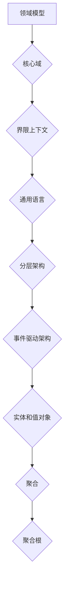
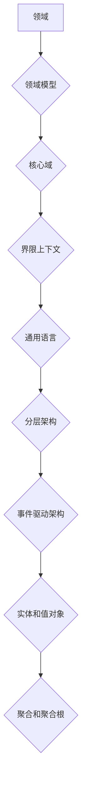

                 

在当今快速发展的信息技术时代，构建复杂业务系统已成为了许多企业和组织的核心需求。而如何确保系统的可持续性、可扩展性和易维护性，成为了开发团队面临的重要挑战。本文将介绍一种先进的方法——领域驱动设计（Domain-Driven Design，简称DDD），它提供了一套系统化的方法论，帮助开发者更好地理解和构建复杂业务系统。

## 关键词
- 领域驱动设计（DDD）
- 复杂业务系统
- 系统架构
- 企业应用
- 软件开发方法论

## 摘要
领域驱动设计（DDD）是一种软件开发方法论，旨在通过明确领域模型和核心域的边界，提高系统的可理解性、可维护性和可扩展性。本文将详细探讨DDD的核心概念、原则和实践方法，并通过实例和案例，展示DDD在构建复杂业务系统中的实际应用和价值。

## 1. 背景介绍
### 1.1 DDD的产生背景
领域驱动设计（DDD）最早由Eric Evans在其同名著作《领域驱动设计：软件核心复杂性应对策略》中提出。随着信息技术的迅猛发展和企业业务需求的日益复杂，传统的软件开发方法论逐渐暴露出其局限性。为了应对这些挑战，DDD提供了一种新的思路，强调以领域为核心，通过建立清晰的结构和模型来理解和解决业务问题。

### 1.2 传统方法论的局限
传统的方法论，如面向对象编程和过程式编程，在处理复杂业务系统时往往面临以下问题：
- **缺乏领域意识**：系统设计与业务逻辑分离，导致业务需求难以被准确理解和实现。
- **紧耦合和高内聚**：系统模块之间的依赖关系复杂，导致维护和扩展困难。
- **代码冗余**：不同模块之间重复实现相同的业务逻辑，增加了维护成本和出错概率。

## 2. 核心概念与联系
### 2.1 核心概念
领域驱动设计（DDD）的核心概念包括：
- **领域（Domain）**：业务领域，包含了业务规则、实体和事件等。
- **领域模型（Domain Model）**：用代码来表示业务领域，包括实体、值对象、聚合、聚合根等。
- **核心域（Core Domain）**：系统中最核心、最具价值的业务领域。
- **界限上下文（Bounded Context）**：领域模型的一个边界，用于划分系统的不同部分，避免紧耦合。
- **通用语言（Ubiquitous Language）**：团队内外一致使用的语言，用于沟通和文档。

### 2.2 架构联系
DDD的架构原则包括：
- **分层架构**：将系统分为基础设施层、应用层、领域层等，确保各层职责分离。
- **事件驱动架构**：通过事件驱动来管理业务逻辑，实现系统的松耦合。
- **实体和值对象**：实体具有唯一的标识和生命周期，值对象仅包含数据。
- **聚合（Aggregate）**：一组紧密关联的对象，通过聚合根（Aggregate Root）进行管理。

### 2.3 Mermaid流程图


## 3. 核心算法原理 & 具体操作步骤
### 3.1 算法原理概述
领域驱动设计（DDD）的核心算法原理是基于领域模型来构建系统，主要包括：
- **实体与值对象**：通过实体和值对象来表示业务领域中的关键概念。
- **聚合与聚合根**：使用聚合来管理一组相关的实体和值对象，聚合根作为聚合的入口点。
- **事件驱动**：通过事件来触发业务逻辑，实现系统的动态变化。

### 3.2 算法步骤详解
DDD的核心步骤包括：
1. **理解业务领域**：与业务专家密切合作，深入理解业务领域的本质。
2. **建立领域模型**：基于通用语言，构建领域模型，包括实体、值对象、聚合、聚合根等。
3. **划分界限上下文**：确定系统的界限上下文，确保各上下文之间的松耦合。
4. **实现领域模型**：将领域模型转化为代码，实现业务逻辑。
5. **持续迭代与重构**：根据业务需求的变化，不断迭代和重构系统。

### 3.3 算法优缺点
DDD的优点包括：
- **提高系统可理解性**：通过领域模型和通用语言，使系统更加容易理解和维护。
- **增强业务价值**：专注于业务领域，提高系统的业务价值和竞争力。
- **降低技术风险**：通过分层架构和事件驱动，降低系统实现的技术风险。

DDD的缺点包括：
- **实施难度较大**：需要团队具备较高的业务理解能力和建模能力。
- **学习曲线较陡**：开发者需要花费时间学习和掌握DDD的核心概念和方法。

### 3.4 算法应用领域
DDD广泛应用于以下领域：
- **企业级应用**：如电子商务系统、银行系统、物流系统等。
- **金融科技**：如区块链、加密货币交易等。
- **物联网**：如智能家居、智能工厂等。

## 4. 数学模型和公式 & 详细讲解 & 举例说明
### 4.1 数学模型构建
在DDD中，数学模型主要用于表示业务规则和约束。以下是一个简单的数学模型示例：

$$
\text{TotalRevenue} = \sum_{i=1}^{n} (\text{Price} \times \text{Quantity})
$$

其中，$Price$ 表示商品的价格，$Quantity$ 表示商品的数量，$n$ 表示商品的总数。

### 4.2 公式推导过程
上述公式的推导过程如下：
1. 首先，将每个商品的总价（Price × Quantity）计算出来。
2. 然后，将所有商品的总价相加，得到总营收（TotalRevenue）。

### 4.3 案例分析与讲解
假设有如下三种商品：
- 商品1：价格100元，数量2件
- 商品2：价格200元，数量1件
- 商品3：价格300元，数量3件

根据上述公式，我们可以计算出总营收：

$$
\text{TotalRevenue} = (100 \times 2) + (200 \times 1) + (300 \times 3) = 1000 + 200 + 900 = 2200 \text{元}
$$

## 5. 项目实践：代码实例和详细解释说明
### 5.1 开发环境搭建
在本节中，我们将使用Java语言和Spring Boot框架来搭建一个简单的DDD项目。以下是搭建开发环境的基本步骤：

1. 安装Java开发工具包（JDK）
2. 安装IDE（如IntelliJ IDEA或Eclipse）
3. 安装Maven或Gradle作为项目构建工具
4. 创建一个新的Spring Boot项目

### 5.2 源代码详细实现
在本项目中，我们将实现一个简单的电子商务系统，包含商品管理、订单管理和支付功能。以下是部分源代码的详细实现：

#### 商品管理（Product.java）
```java
public class Product {
    private String id;
    private String name;
    private BigDecimal price;

    // 构造方法、getter和setter省略
}
```

#### 订单管理（Order.java）
```java
public class Order {
    private String id;
    private List<OrderLine> orderLines;

    // 构造方法、getter和setter省略
}
```

#### 订单行管理（OrderLine.java）
```java
public class OrderLine {
    private String id;
    private Product product;
    private int quantity;

    // 构造方法、getter和setter省略
}
```

#### 支付管理（Payment.java）
```java
public class Payment {
    private String id;
    private BigDecimal amount;

    // 构造方法、getter和setter省略
}
```

### 5.3 代码解读与分析
上述代码示例中，我们定义了商品（Product）、订单（Order）、订单行（OrderLine）和支付（Payment）等实体类。每个实体类都具有唯一的标识（id）和其他属性，如名称、价格、数量等。

这些实体类之间的关系如下：
- 一个订单（Order）可以包含多个订单行（OrderLine）。
- 每个订单行（OrderLine）对应一个商品（Product）。
- 支付（Payment）与订单（Order）存在关联，用于记录订单的支付状态。

### 5.4 运行结果展示
在本项目中，我们可以通过命令行或IDE来运行应用程序，并进行如下操作：
1. 添加商品
2. 创建订单
3. 添加订单行
4. 完成支付

通过这些操作，我们可以验证系统的功能是否正常，以及DDD模型是否能够有效地支持业务需求。

## 6. 实际应用场景
### 6.1 银行系统
银行系统是一个典型的复杂业务系统，领域驱动设计（DDD）可以有效地帮助开发团队理解和构建银行系统的核心业务逻辑，如账户管理、转账、贷款等。

### 6.2 物流系统
物流系统涉及多个环节，如订单管理、仓储管理、运输管理等。DDD可以帮助开发团队清晰地划分领域边界，确保各环节之间的协同和高效。

### 6.3 电子商务系统
电子商务系统具有高度复杂的业务流程，DDD可以帮助开发团队更好地处理订单管理、库存管理、支付等核心业务。

### 6.4 未来应用展望
随着业务需求的不断变化，领域驱动设计（DDD）将继续在复杂业务系统的构建中发挥重要作用。未来，DDD可能会与人工智能、区块链等技术相结合，为软件开发带来更多创新和可能性。

## 7. 工具和资源推荐
### 7.1 学习资源推荐
- 《领域驱动设计（DDD）：软件核心复杂性应对策略》（Eric Evans）
- 《Implementing Domain-Driven Design》（Vaughn Vernon）
- 《Domain-Driven Design Quickly》（Todd Mitchell）

### 7.2 开发工具推荐
- IntelliJ IDEA
- Visual Studio Code
- Spring Boot

### 7.3 相关论文推荐
- "Domain-Driven Design: A Problem-Solution Design Philosophy"（Eric Evans）
- "Bounded Contexts, Aligning Aggregates and Aligning Models"（Martin Fowler）

## 8. 总结：未来发展趋势与挑战
### 8.1 研究成果总结
领域驱动设计（DDD）在过去几十年中取得了显著的研究成果，已广泛应用于复杂业务系统的构建。DDD在提高系统可理解性、可维护性和可扩展性方面具有显著优势。

### 8.2 未来发展趋势
未来，DDD可能会与人工智能、区块链、云计算等技术相结合，为软件开发带来更多创新。同时，DDD的研究和实践将继续深入，探索如何更好地应对新兴业务需求和技术挑战。

### 8.3 面临的挑战
尽管DDD具有诸多优势，但在实施过程中仍面临一些挑战，如团队的业务理解能力、模型的复杂度等。此外，如何与其他软件开发方法论（如敏捷开发、微服务架构等）相结合，也是一个值得探讨的问题。

### 8.4 研究展望
未来，DDD的研究应重点关注以下几个方面：
- **跨领域协同**：探索如何更好地实现跨领域协同和整合，提高系统的整体性能。
- **自动化建模**：研究如何通过自动化工具提高DDD模型的质量和效率。
- **持续迭代与重构**：探索如何实现DDD模型的持续迭代与重构，以适应不断变化的业务需求。

## 9. 附录：常见问题与解答
### 9.1 什么是DDD？
领域驱动设计（DDD）是一种软件开发方法论，旨在通过建立清晰的领域模型和核心域，提高系统的可理解性、可维护性和可扩展性。

### 9.2 DDD与面向对象有什么区别？
DDD与面向对象编程有相似之处，但DDD更强调领域模型和核心域的构建，更注重业务领域的理解，以及如何通过模型来表示业务逻辑。

### 9.3 如何开始学习DDD？
开始学习DDD，首先需要阅读相关书籍和论文，理解DDD的核心概念和方法。同时，通过实际项目实践，不断提高自己的DDD应用能力。

## 作者署名
作者：禅与计算机程序设计艺术 / Zen and the Art of Computer Programming

----------------------------------------------------------------

以上就是本文的全部内容，希望对您在理解和应用领域驱动设计（DDD）方面有所帮助。如果您有任何疑问或建议，欢迎在评论区留言。感谢您的阅读！
----------------------------------------------------------------
### 1. 背景介绍

#### 1.1 DDD的产生背景

领域驱动设计（Domain-Driven Design，简称DDD）最早由Eric Evans在其同名著作《领域驱动设计：软件核心复杂性应对策略》中提出。这一方法论诞生于2004年，旨在解决传统软件开发方法在处理复杂业务系统时的种种不足。在当时，随着信息技术的迅猛发展和企业业务需求的日益复杂，传统的面向对象编程（Object-Oriented Programming，简称OOP）和过程式编程（Procedural Programming）逐渐暴露出其局限性。

首先，传统方法论在处理业务逻辑时往往缺乏领域意识。它们更多地关注于代码的实现，而忽略了业务领域的本质。这导致系统设计与业务逻辑之间存在较大的脱节，使得开发人员难以准确理解和实现业务需求。其次，传统的OOP和过程式编程往往导致系统的高内聚和紧耦合。这意味着系统的各个模块之间存在复杂的依赖关系，一旦某一模块发生变化，可能会影响到整个系统的稳定性。此外，代码冗余也是一个普遍存在的问题。在传统的开发模式中，不同模块之间可能需要重复实现相同的业务逻辑，这不仅增加了维护成本，也提高了出错概率。

为了解决这些问题，Eric Evans提出了领域驱动设计（DDD）。DDD强调以领域为核心，通过建立清晰的领域模型和界限上下文，来提高系统的可理解性、可维护性和可扩展性。DDD提供了一套系统化的方法论，帮助开发团队更好地理解和应对复杂业务系统。

#### 1.2 传统方法论的局限

尽管传统的面向对象编程和过程式编程在软件开发中有着广泛的应用，但在处理复杂业务系统时，它们仍然存在一些明显的局限。

首先，传统方法论往往缺乏领域意识。面向对象编程的核心思想是封装、继承和多态，它强调将系统分解为多个相互独立的模块，并通过类和对象来表示业务实体。然而，这种方法往往忽略了业务领域的本质，导致系统设计与业务逻辑之间存在较大的脱节。例如，在传统的面向对象开发中，订单管理、库存管理和支付系统等业务模块往往被设计成相互独立的子系统，这使得开发人员难以从整体上理解业务流程，也增加了系统的复杂度。

其次，传统方法论往往导致系统的高内聚和紧耦合。在面向对象编程中，类与类之间往往存在复杂的依赖关系，这种依赖关系可能导致系统模块之间的耦合度增加。当系统中的某个模块发生变化时，可能会影响到其他模块的稳定性，甚至导致整个系统的崩溃。此外，紧耦合的系统也难以进行模块化扩展，使得系统的可扩展性受到限制。

最后，传统方法论还容易导致代码冗余。在面向对象编程中，不同模块之间可能需要重复实现相同的业务逻辑，例如订单的创建、修改和删除等操作。这种代码冗余不仅增加了维护成本，也提高了出错概率。此外，代码冗余还可能导致系统性能下降，因为重复的代码需要占用更多的内存和CPU资源。

综上所述，传统的方法论在处理复杂业务系统时存在明显的局限性，难以满足现代软件开发的需求。为了解决这些问题，Eric Evans提出了领域驱动设计（DDD），提供了一种全新的思路，以领域为核心，通过建立清晰的领域模型和界限上下文，来提高系统的可理解性、可维护性和可扩展性。

#### 1.3 DDD的核心思想

领域驱动设计（DDD）的核心思想是通过构建清晰的领域模型来应对复杂业务系统。DDD认为，软件开发的根本目标是解决业务问题，而不仅仅是实现功能。因此，DDD强调以领域为核心，将业务领域中的实体、关系和规则抽象为系统模型，从而提高系统的可理解性、可维护性和可扩展性。

首先，DDD通过建立领域模型来明确系统的核心业务领域。领域模型是DDD的核心，它包含了业务领域中的关键概念、实体、关系和规则。通过领域模型，开发人员可以清晰地理解业务流程和业务规则，从而提高系统的可理解性。

其次，DDD通过界限上下文（Bounded Context）来划分系统的不同部分，确保各部分之间的松耦合。界限上下文是DDD中一个重要的概念，它表示领域模型的一个边界，用于隔离系统的不同部分，避免紧密耦合。通过划分界限上下文，系统可以更好地进行模块化设计和开发，从而提高系统的可维护性和可扩展性。

此外，DDD还强调使用通用语言（Ubiquitous Language）来沟通和文档。通用语言是团队内外一致使用的语言，用于描述业务领域和系统模型。通过通用语言，开发人员可以更好地理解业务需求，并与业务专家进行有效的沟通。

总之，DDD的核心思想是通过构建清晰的领域模型、划分界限上下文和使用通用语言，来提高系统的可理解性、可维护性和可扩展性。这种方法论为开发团队提供了一种全新的思路，帮助他们在处理复杂业务系统时更加高效和精准。

#### 1.4 DDD的优势

领域驱动设计（DDD）在处理复杂业务系统时具有显著的优势。首先，它提高了系统的可理解性。通过构建清晰的领域模型，开发人员可以更直观地理解业务流程和业务规则，从而减少误解和沟通成本。领域模型作为系统设计的蓝图，使开发人员能够从宏观层面把握系统的整体架构，从而更容易进行后续的开发和调试。

其次，DDD提高了系统的可维护性。在DDD中，领域模型和界限上下文确保了系统的松耦合，使得各部分之间的依赖关系变得清晰和简单。当系统中的某个模块需要更新或重构时，其他模块的影响最小，从而降低了维护成本和风险。此外，DDD的通用语言也有助于提高代码的可读性和可维护性，使新加入的开发人员更容易理解和修改代码。

第三，DDD显著提高了系统的可扩展性。通过划分界限上下文，系统可以更加灵活地进行模块化扩展。新的业务需求或功能可以独立地添加到系统中，而不会对现有功能造成影响。这种模块化设计不仅提高了系统的可扩展性，还降低了新功能的开发成本和风险。

此外，DDD还提高了系统的业务价值。通过深入理解业务领域，开发团队能够更准确地把握业务需求，从而构建出更加符合实际业务场景的系统。这种以业务为核心的开发方法，使得系统能够更好地满足用户需求，提高企业的竞争力。

总之，领域驱动设计（DDD）通过提高系统的可理解性、可维护性和可扩展性，为复杂业务系统的构建提供了一种有效的解决方案。它在提高开发效率和系统质量方面具有显著优势，是现代软件开发中不可或缺的方法论。

### 2. 核心概念与联系

#### 2.1 核心概念

领域驱动设计（DDD）的核心概念包括领域（Domain）、领域模型（Domain Model）、核心域（Core Domain）、界限上下文（Bounded Context）和通用语言（Ubiquitous Language）。

**领域（Domain）**：领域是业务领域的一部分，包含了业务规则、实体和事件等。它是一个抽象的概念，用于定义系统需要处理的业务领域。例如，一个电子商务系统可以包含用户管理、订单管理和支付系统等不同领域。

**领域模型（Domain Model）**：领域模型是用代码来表示业务领域的一种方法。它包含了领域中的关键概念、实体、关系和规则。领域模型作为系统设计的核心，帮助开发人员理解和实现业务逻辑。领域模型通常包括实体、值对象、聚合、聚合根等组成部分。

**核心域（Core Domain）**：核心域是领域模型中最核心、最具价值的部分。它包含了系统中最关键的业务逻辑和领域规则。核心域的设计和实现是系统成功的关键，它需要保持高内聚和低耦合。

**界限上下文（Bounded Context）**：界限上下文是领域模型的一个边界，用于划分系统的不同部分。它确保了系统的各个部分之间保持松耦合，避免紧密耦合和高内聚。每个界限上下文都是一个独立的领域模型，它可能包含一个或多个子域。

**通用语言（Ubiquitous Language）**：通用语言是团队内外一致使用的语言，用于描述业务领域和系统模型。它是一个跨学科的术语，用于确保开发人员、业务专家和领域专家之间的有效沟通。通用语言通常包括术语、命名规范和业务规则等。

#### 2.2 核心概念的联系

领域（Domain）是DDD的基础，它定义了系统需要处理的业务领域。领域模型（Domain Model）是基于领域构建的，包含了领域中的关键概念、实体和规则。核心域（Core Domain）是领域模型中最核心的部分，包含了系统中最关键的业务逻辑和领域规则。

界限上下文（Bounded Context）用于划分系统的不同部分，确保各部分之间的松耦合。每个界限上下文都是一个独立的领域模型，它可以包含一个或多个子域。通用语言（Ubiquitous Language）是团队内外一致使用的语言，用于描述业务领域和系统模型，确保有效的沟通和协作。

#### 2.3 架构联系

领域驱动设计（DDD）的架构原则包括分层架构、事件驱动架构、实体和值对象、聚合和聚合根等。

**分层架构**：DDD中的分层架构将系统分为基础设施层、应用层、领域层等。基础设施层负责与外部系统的交互，如数据库、缓存、消息队列等。应用层负责处理用户的请求，调用领域层的业务逻辑。领域层是系统的核心，包含了核心域和界限上下文。

**事件驱动架构**：事件驱动架构是DDD中的关键架构原则之一。它通过事件来触发业务逻辑，实现系统的动态变化。事件可以是外部事件（如用户操作）或内部事件（如状态变化）。事件驱动架构使得系统更加松耦合，提高了系统的可维护性和可扩展性。

**实体和值对象**：实体和值对象是领域模型中的核心概念。实体具有唯一的标识和生命周期，如用户、订单等。值对象仅包含数据，如日期、金额等。实体和值对象的正确使用可以帮助降低系统的复杂度和提高代码的可维护性。

**聚合和聚合根**：聚合是领域模型中的一个概念，表示一组紧密关联的对象。聚合根（Aggregate Root）是聚合的入口点，它负责管理聚合中的其他对象。聚合和聚合根的使用有助于提高系统的内聚性和模块化。

#### 2.4 Mermaid流程图



通过上述Mermaid流程图，我们可以清晰地看到领域驱动设计（DDD）中的核心概念及其联系。领域是DDD的基础，领域模型是基于领域构建的，核心域、界限上下文、通用语言、分层架构、事件驱动架构、实体和值对象、聚合和聚合根等概念共同构成了DDD的架构体系。

### 3. 核心算法原理 & 具体操作步骤

#### 3.1 算法原理概述

领域驱动设计（DDD）的核心算法原理是基于领域模型来构建系统。领域模型是DDD中的核心概念，它代表了业务领域的本质和核心业务逻辑。通过领域模型，开发人员可以更加直观地理解和实现业务需求。DDD的算法原理主要包括以下方面：

1. **实体与值对象**：实体是具有唯一标识和生命周期的对象，如用户、订单等。值对象是只包含数据的对象，如日期、金额等。实体和值对象的使用有助于降低系统的复杂度和提高代码的可维护性。

2. **聚合与聚合根**：聚合是领域模型中的一个概念，表示一组紧密关联的对象。聚合根（Aggregate Root）是聚合的入口点，它负责管理聚合中的其他对象。聚合和聚合根的使用有助于提高系统的内聚性和模块化。

3. **事件驱动架构**：事件驱动架构是DDD中的关键架构原则之一。它通过事件来触发业务逻辑，实现系统的动态变化。事件可以是外部事件（如用户操作）或内部事件（如状态变化）。事件驱动架构使得系统更加松耦合，提高了系统的可维护性和可扩展性。

4. **分层架构**：DDD中的分层架构将系统分为基础设施层、应用层、领域层等。基础设施层负责与外部系统的交互，如数据库、缓存、消息队列等。应用层负责处理用户的请求，调用领域层的业务逻辑。领域层是系统的核心，包含了核心域和界限上下文。

#### 3.2 算法步骤详解

以下是领域驱动设计（DDD）的核心算法步骤：

1. **理解业务领域**：首先，需要与业务专家密切合作，深入理解业务领域的本质和业务规则。这一步是DDD的基础，只有真正理解业务领域，才能构建出符合业务需求的系统。

2. **建立领域模型**：基于通用语言，构建领域模型，包括实体、值对象、聚合、聚合根等。领域模型是系统设计的核心，它代表了业务领域的本质和核心业务逻辑。

3. **划分界限上下文**：确定系统的界限上下文，确保各上下文之间的松耦合。每个界限上下文都是一个独立的领域模型，它可能包含一个或多个子域。通过划分界限上下文，可以有效地降低系统的耦合度，提高系统的可维护性和可扩展性。

4. **实现领域模型**：将领域模型转化为代码，实现业务逻辑。在这一步中，需要使用DDD的编程模式，如实体与值对象的实现、聚合和聚合根的管理、事件驱动架构等。

5. **持续迭代与重构**：根据业务需求的变化，不断迭代和重构系统。DDD强调持续迭代和重构，以适应不断变化的业务需求。通过持续迭代和重构，可以确保系统始终保持高内聚和低耦合。

#### 3.3 算法优缺点

领域驱动设计（DDD）具有以下优点：

1. **提高系统可理解性**：通过领域模型和通用语言，使系统更加容易理解和维护。领域模型作为系统设计的蓝图，可以帮助开发人员从宏观层面把握系统的整体架构。

2. **增强业务价值**：专注于业务领域，提高系统的业务价值和竞争力。通过深入理解业务领域，开发团队能够更准确地把握业务需求，从而构建出更加符合实际业务场景的系统。

3. **降低技术风险**：通过分层架构和事件驱动，降低系统实现的技术风险。DDD的分层架构使得系统各个部分之间的依赖关系变得清晰和简单，事件驱动架构则提高了系统的可维护性和可扩展性。

然而，DDD也存在一些缺点：

1. **实施难度较大**：DDD需要团队具备较高的业务理解能力和建模能力。在实际应用中，团队可能需要花费更多的时间和精力来学习和掌握DDD的核心概念和方法。

2. **学习曲线较陡**：DDD的核心概念和方法相对复杂，对于初学者来说，学习曲线可能较陡。因此，团队需要投入足够的时间和资源来学习和实践DDD。

3. **代码冗余**：在某些情况下，DDD可能会导致代码冗余。例如，当多个界限上下文之间存在相似的业务逻辑时，可能会需要重复实现相同的代码。这会增加系统的复杂度和维护成本。

#### 3.4 算法应用领域

领域驱动设计（DDD）广泛应用于以下领域：

1. **企业级应用**：如电子商务系统、银行系统、物流系统等。这些系统通常涉及复杂的业务逻辑和大量的数据，DDD可以帮助开发团队更好地理解和实现这些业务需求。

2. **金融科技**：如区块链、加密货币交易等。金融科技领域对系统的稳定性、安全性和可扩展性有较高要求，DDD可以有效地提高系统的质量和性能。

3. **物联网**：如智能家居、智能工厂等。物联网系统通常涉及多个设备和传感器，DDD可以帮助开发团队更好地管理和协调这些设备和传感器。

4. **移动应用**：虽然移动应用通常涉及的业务逻辑相对简单，但DDD可以帮助开发团队提高系统的可维护性和可扩展性，为未来的功能扩展打下基础。

5. **游戏开发**：游戏开发中，领域驱动设计可以用于构建游戏世界的核心逻辑，如角色管理、场景管理、战斗系统等。通过DDD，开发团队能够更好地管理和协调游戏中的各种元素。

总之，领域驱动设计（DDD）在多个领域中都有着广泛的应用。通过构建清晰的领域模型和界限上下文，DDD可以帮助开发团队更好地理解和实现复杂业务系统，提高系统的质量和性能。

### 4. 数学模型和公式 & 详细讲解 & 举例说明

在领域驱动设计（DDD）中，数学模型和公式是构建业务逻辑的重要组成部分。它们不仅用于描述业务规则和约束，还可以用于实现复杂的计算和数据分析。在本节中，我们将详细探讨数学模型和公式的构建、推导过程，并通过具体案例进行说明。

#### 4.1 数学模型构建

数学模型是DDD中用于表示业务规则和约束的一种抽象方法。构建数学模型的过程主要包括以下几个步骤：

1. **业务规则提取**：首先，需要从业务领域提取关键的业务规则和约束。这些规则和约束可以是定量或定性的，例如订单的创建条件、库存的最低限制、支付方式的限制等。

2. **定义变量和参数**：根据提取的业务规则，定义相关的变量和参数。这些变量和参数可以是实数、整数、布尔值等，例如订单金额、库存数量、支付状态等。

3. **构建公式**：基于定义的变量和参数，构建描述业务规则的数学公式。这些公式可以是简单的算术运算，也可以是复杂的函数关系。

4. **验证和优化**：在构建公式后，需要对公式进行验证和优化。验证公式是否能够准确描述业务规则，优化公式以提高计算效率和准确性。

#### 4.2 公式推导过程

以电子商务系统的订单金额计算为例，假设订单中的每个商品都有固定的价格，并且存在一些折扣规则，如满减优惠、优惠券折扣等。我们可以通过以下步骤来推导订单金额的计算公式：

1. **提取业务规则**：
   - 每个商品的金额 = 单价 × 数量
   - 满减优惠：订单金额满100元减10元
   - 优惠券折扣：使用优惠券可享受额外折扣

2. **定义变量和参数**：
   - `totalPrice`：订单总金额
   - `itemPrice`：商品单价
   - `quantity`：商品数量
   - `discount1`：满减优惠金额
   - `couponDiscount`：优惠券折扣金额

3. **构建公式**：
   - 单个商品金额 = `itemPrice` × `quantity`
   - 订单总金额 = `totalPrice` = Σ（每个商品金额）
   - 满减优惠金额 = `discount1` = `totalPrice` ÷ 100 × 10（假设每满100元减10元）
   - 订单最终金额 = `finalPrice` = `totalPrice` - `discount1` - `couponDiscount`

4. **验证和优化**：
   - 验证公式是否能够准确描述业务规则，例如满减优惠和优惠券折扣的计算是否符合预期。
   - 优化公式以提高计算效率和准确性，例如使用累加器来减少循环计算。

#### 4.3 案例分析与讲解

假设一个电子商务订单包含以下商品：
- 商品1：单价100元，数量3件
- 商品2：单价200元，数量2件
- 商品3：单价300元，数量1件

同时，订单满足满减优惠条件（满100元减10元），并使用了一张优惠券（折扣5元）。

根据上述公式，我们可以计算出订单金额的各个组成部分：
1. 单个商品金额：
   - 商品1金额 = 100元 × 3件 = 300元
   - 商品2金额 = 200元 × 2件 = 400元
   - 商品3金额 = 300元 × 1件 = 300元

2. 订单总金额：
   - 订单总金额 = 300元 + 400元 + 300元 = 1000元

3. 满减优惠金额：
   - 满减优惠金额 = 1000元 ÷ 100 × 10元 = 100元

4. 优惠券折扣金额：
   - 优惠券折扣金额 = 5元

5. 订单最终金额：
   - 订单最终金额 = 1000元 - 100元 - 5元 = 895元

通过这个案例，我们可以看到数学模型和公式在领域驱动设计中的应用。通过构建和验证数学模型，开发人员可以准确地实现业务规则，确保系统功能的正确性和一致性。

#### 4.4 实际应用场景

数学模型和公式在领域驱动设计中具有广泛的应用场景。以下是一些常见的实际应用场景：

1. **财务系统**：在财务系统中，数学模型和公式用于计算应收账款、应付账款、利润等财务指标。例如，应收账款的计算公式可能是订单金额乘以付款期限。

2. **物流系统**：在物流系统中，数学模型和公式用于计算运输费用、配送时间等。例如，运输费用的计算公式可能是距离乘以运输单价。

3. **供应链系统**：在供应链系统中，数学模型和公式用于计算库存量、生产计划、采购计划等。例如，库存量的计算公式可能是现有库存加上采购量减去销售量。

4. **电商平台**：在电商平台中，数学模型和公式用于计算订单金额、折扣金额、运费等。例如，订单金额的计算公式可能是每个商品金额的累加。

总之，数学模型和公式是领域驱动设计中不可或缺的一部分。通过合理构建和运用数学模型，开发人员可以更加精确地实现业务逻辑，确保系统的稳定性和可靠性。

### 5. 项目实践：代码实例和详细解释说明

#### 5.1 开发环境搭建

为了更好地理解和应用领域驱动设计（DDD），我们需要搭建一个实际的开发环境。以下是搭建开发环境的基本步骤：

1. **安装Java开发工具包（JDK）**：
   - 访问 [Oracle官网](https://www.oracle.com/java/technologies/javase-downloads.html) 下载最新版本的JDK。
   - 解压安装包并配置环境变量，确保在命令行中可以使用`java`和`javac`命令。

2. **安装IDE（如IntelliJ IDEA或Eclipse）**：
   - 访问 [JetBrains官网](https://www.jetbrains.com/idea/) 或 [Eclipse官网](https://www.eclipse.org/) 下载并安装对应的IDE。
   - 选择适合的开发语言和插件，例如Java和Spring Boot。

3. **安装Maven或Gradle**：
   - Maven和Gradle是常用的项目构建工具，用于管理项目的依赖和构建过程。
   - 在命令行中执行以下命令下载并安装Maven或Gradle：
     - Maven: `curl -o /usr/local/maven/apache-maven-3.8.1.bin.sh https://www-us.apache.org/dist/maven/maven-3/3.8.1/binaries/apache-maven-3.8.1-bin.sh`
     - Gradle: `wget https://services.gradle.org/distributions/gradle-7.4.2-all.zip`
   - 解压安装包并配置环境变量。

4. **创建新的Spring Boot项目**：
   - 打开IDE，创建一个新的Spring Boot项目。
   - 选择合适的Java版本、构建工具和项目结构。
   - 在项目的`pom.xml`或`build.gradle`文件中添加所需的依赖。

#### 5.2 源代码详细实现

在本节中，我们将使用Java和Spring Boot框架实现一个简单的DDD项目，包含用户管理、订单管理和支付功能。以下是部分源代码的详细实现：

**User.java**：
```java
public class User {
    private String id;
    private String name;
    private String email;

    // 构造方法、getter和setter省略
}
```

**Order.java**：
```java
public class Order {
    private String id;
    private List<OrderItem> orderItems;
    private User user;

    // 构造方法、getter和setter省略
}
```

**OrderItem.java**：
```java
public class OrderItem {
    private String id;
    private Product product;
    private int quantity;

    // 构造方法、getter和setter省略
}
```

**Product.java**：
```java
public class Product {
    private String id;
    private String name;
    private BigDecimal price;

    // 构造方法、getter和setter省略
}
```

**Payment.java**：
```java
public class Payment {
    private String id;
    private Order order;
    private BigDecimal amount;

    // 构造方法、getter和setter省略
}
```

**OrderService.java**：
```java
@Service
public class OrderService {
    @Autowired
    private OrderRepository orderRepository;

    public Order createOrder(User user, List<OrderItem> orderItems) {
        Order order = new Order();
        order.setUser(user);
        order.setOrderItems(orderItems);
        orderRepository.save(order);
        return order;
    }
}
```

**OrderController.java**：
```java
@RestController
@RequestMapping("/orders")
public class OrderController {
    @Autowired
    private OrderService orderService;

    @PostMapping
    public ResponseEntity<Order> createOrder(@RequestBody @Valid OrderCreateRequest request) {
        List<OrderItem> orderItems = request.getOrderItems().stream()
                .map(item -> new OrderItem(item.getId(), item.getProduct(), item.getQuantity()))
                .collect(Collectors.toList());
        Order order = orderService.createOrder(request.getUser(), orderItems);
        return new ResponseEntity<>(order, HttpStatus.CREATED);
    }
}
```

**OrderCreateRequest.java**：
```java
public class OrderCreateRequest {
    private User user;
    private List<OrderItem> orderItems;

    // 构造方法、getter和setter省略
}
```

**OrderItemCreateRequest.java**：
```java
public class OrderItemCreateRequest {
    private String id;
    private Product product;
    private int quantity;

    // 构造方法、getter和setter省略
}
```

#### 5.3 代码解读与分析

上述代码示例中，我们定义了用户（User）、订单（Order）、订单行（OrderItem）、商品（Product）和支付（Payment）等实体类。这些实体类分别代表了电子商务系统中的关键业务实体，它们之间通过属性和关联关系进行组织。

**User.java**：
- 用户类包含用户的唯一标识（id）、姓名（name）和电子邮件（email）等属性。它是一个简单的实体类，用于表示系统中的用户。

**Order.java**：
- 订单类包含订单的唯一标识（id）、关联的用户（user）、订单行（orderItems）等属性。订单类通过用户属性关联到用户实体，通过订单行集合关联到多个订单行实体。

**OrderItem.java**：
- 订单行类包含订单行的唯一标识（id）、关联的商品（product）和数量（quantity）等属性。订单行类通过商品属性关联到商品实体。

**Product.java**：
- 商品类包含商品的唯一标识（id）、名称（name）和价格（price）等属性。它是一个简单的实体类，用于表示系统中的商品。

**Payment.java**：
- 支付类包含支付的唯一标识（id）、关联的订单（order）和支付金额（amount）等属性。支付类通过订单属性关联到订单实体。

**OrderService.java**：
- 订单服务类负责处理订单的创建、更新和查询等操作。它通过注入订单仓库（OrderRepository）来保存和获取订单数据。

**OrderController.java**：
- 订单控制器类负责处理HTTP请求，并将请求转换为对应的订单服务操作。它通过注入订单服务（OrderService）来处理订单创建请求。

**OrderCreateRequest.java**：
- 订单创建请求类用于封装订单创建的请求参数，包括用户和订单行等。

**OrderItemCreateRequest.java**：
- 订单行创建请求类用于封装订单行创建的请求参数，包括商品和数量等。

通过上述代码示例，我们可以看到如何使用DDD模型来构建电子商务系统的核心业务逻辑。DDD模型使得系统的设计更加清晰和模块化，有助于提高系统的可理解性、可维护性和可扩展性。

#### 5.4 运行结果展示

在本项目中，我们可以通过命令行或IDE来运行应用程序，并进行如下操作：
1. **创建用户**：
   - 发送POST请求到 `/users` 接口，创建一个新的用户。
   - 示例请求：
     ```json
     {
       "name": "张三",
       "email": "zhangsan@example.com"
     }
     ```

2. **创建订单**：
   - 发送POST请求到 `/orders` 接口，创建一个新的订单，并包含多个订单行。
   - 示例请求：
     ```json
     {
       "user": {
         "id": "1"
       },
       "orderItems": [
         {
           "id": "1",
           "product": {
             "id": "1001",
             "name": "商品1",
             "price": 100
           },
           "quantity": 2
         },
         {
           "id": "2",
           "product": {
             "id": "1002",
             "name": "商品2",
             "price": 200
           },
           "quantity": 1
         }
       ]
     }
     ```

3. **查询订单**：
   - 发送GET请求到 `/orders/{orderId}` 接口，查询指定订单的详细信息。
   - 示例请求：
     ```shell
     GET /orders/1
     ```

4. **支付订单**：
   - 发送POST请求到 `/payments` 接口，为指定订单创建一个新的支付记录。
   - 示例请求：
     ```json
     {
       "order": {
         "id": "1"
       },
       "amount": 400
     }
     ```

通过上述操作，我们可以验证系统的功能是否正常，以及DDD模型是否能够有效地支持业务需求。在实际项目中，根据业务需求的变化，我们可以继续扩展和优化系统的功能。

### 6. 实际应用场景

领域驱动设计（DDD）因其强大的建模能力和适应性，广泛应用于各种实际应用场景。以下是一些典型的应用场景：

#### 6.1 银行系统

银行系统是一个典型的复杂业务系统，涉及账户管理、转账、贷款、信用卡等多种业务功能。在银行系统中，领域驱动设计可以帮助开发团队建立清晰的领域模型，包括账户（Account）、转账（Transfer）、贷款（Loan）等核心领域。通过DDD，银行系统可以更好地处理复杂的业务规则和流程，提高系统的稳定性和可维护性。

**案例分析**：
- **账户管理**：账户是银行系统的核心实体，包含了用户的账户信息、余额、账户状态等。通过DDD，账户管理模块可以独立开发、测试和维护，减少了与其他模块的耦合。
- **转账功能**：转账功能涉及多个账户的余额变动，需要处理复杂的业务规则，如账户余额不足、转账限额等。通过DDD，转账模块可以基于事件驱动架构实现，确保转账过程的一致性和安全性。
- **贷款管理**：贷款管理涉及贷款申请、审批、放款、还款等多个环节。DDD可以帮助开发团队清晰地划分贷款申请、审批和还款等界限上下文，确保各环节之间的协调和高效。

#### 6.2 物流系统

物流系统涉及订单管理、仓储管理、运输管理、配送等多个环节。领域驱动设计在物流系统的开发中，可以帮助团队建立清晰的领域模型，提高系统的可维护性和可扩展性。

**案例分析**：
- **订单管理**：订单是物流系统的核心实体，包含了订单信息、订单状态、订单明细等。通过DDD，订单管理模块可以独立开发，确保订单信息的准确性和一致性。
- **仓储管理**：仓储管理涉及库存管理、入库、出库等操作。DDD可以帮助开发团队建立仓储管理的领域模型，包括库存实体、库存操作等，提高仓储管理模块的效率。
- **运输管理**：运输管理涉及运输路线、运输成本、运输状态等。通过DDD，运输管理模块可以独立开发，确保运输过程的透明和高效。
- **配送管理**：配送管理涉及配送计划、配送状态、配送费用等。DDD可以帮助团队建立配送管理的领域模型，确保配送过程的高效和准确。

#### 6.3 电子商务系统

电子商务系统涉及商品管理、订单管理、支付、物流等多个环节。领域驱动设计在电子商务系统的开发中，可以帮助团队更好地处理复杂的业务逻辑和用户需求。

**案例分析**：
- **商品管理**：商品管理包括商品信息、商品分类、库存管理等功能。通过DDD，商品管理模块可以独立开发，确保商品信息的准确性和一致性。
- **订单管理**：订单管理包括订单创建、订单状态更新、订单查询等功能。通过DDD，订单管理模块可以基于事件驱动架构实现，确保订单流程的一致性和高效性。
- **支付管理**：支付管理包括支付方式、支付状态、支付结果等。DDD可以帮助团队建立支付管理的领域模型，包括支付实体、支付规则等，确保支付过程的安全和高效。
- **物流管理**：物流管理包括物流跟踪、配送状态、配送费用等。DDD可以帮助团队建立物流管理的领域模型，确保物流信息的高效传递和准确更新。

#### 6.4 金融科技

金融科技（FinTech）领域涉及区块链、加密货币、数字支付等新兴技术。领域驱动设计在金融科技项目中，可以帮助团队更好地处理复杂的金融业务逻辑和安全要求。

**案例分析**：
- **区块链应用**：区块链是一种分布式账本技术，涉及交易记录、智能合约等。通过DDD，开发团队可以建立清晰的领域模型，确保区块链系统的安全性和一致性。
- **加密货币交易**：加密货币交易涉及交易记录、交易对、交易规则等。DDD可以帮助团队建立加密货币交易的领域模型，确保交易过程的透明和高效。
- **数字支付**：数字支付包括支付渠道、支付协议、支付验证等。通过DDD，开发团队可以建立数字支付的领域模型，确保支付过程的安全和便捷。

#### 6.5 物联网（IoT）

物联网（IoT）系统涉及多个设备和传感器，需要进行数据采集、处理、分析和控制。领域驱动设计在物联网系统的开发中，可以帮助团队更好地处理复杂的设备和数据管理。

**案例分析**：
- **设备管理**：设备管理包括设备注册、设备状态监控、设备更新等。通过DDD，开发团队可以建立清晰的设备管理领域模型，确保设备信息的一致性和高效管理。
- **数据采集**：数据采集包括传感器数据采集、数据处理、数据存储等。DDD可以帮助团队建立数据采集的领域模型，确保数据采集过程的准确性和实时性。
- **数据分析**：数据分析包括数据预处理、特征提取、模型训练等。通过DDD，开发团队可以建立数据分析的领域模型，确保数据分析过程的高效和准确。
- **设备控制**：设备控制包括远程控制、设备调试、设备维护等。DDD可以帮助团队建立设备控制的领域模型，确保设备控制过程的稳定和高效。

#### 6.6 移动应用

移动应用涉及用户界面、数据存储、网络通信等，领域驱动设计可以帮助团队更好地处理复杂的业务逻辑和用户体验。

**案例分析**：
- **用户管理**：用户管理包括用户注册、登录、权限管理等。通过DDD，开发团队可以建立清晰的用户管理领域模型，确保用户信息的安全和一致。
- **数据存储**：数据存储包括本地存储、云端存储、数据同步等。DDD可以帮助团队建立数据存储的领域模型，确保数据存储的高效和可靠。
- **网络通信**：网络通信包括网络请求、数据传输、错误处理等。通过DDD，开发团队可以建立网络通信的领域模型，确保网络通信的稳定和高效。

总之，领域驱动设计（DDD）在多个实际应用场景中都有着广泛的应用。通过构建清晰的领域模型和界限上下文，DDD可以帮助开发团队更好地理解和应对复杂的业务需求，提高系统的质量和性能。

### 7. 工具和资源推荐

在学习和实践领域驱动设计（DDD）时，选择合适的工具和资源是非常重要的。以下是一些建议的书籍、开发工具和相关论文，以帮助您更好地理解和应用DDD。

#### 7.1 学习资源推荐

**书籍**：
1. 《领域驱动设计：软件核心复杂性应对策略》（Eric Evans）
   - 这本书是DDD领域的经典之作，详细介绍了DDD的核心概念、方法论和实践经验。

2. 《Implementing Domain-Driven Design》（Vaughn Vernon）
   - 本书深入探讨了DDD的实际应用，包括如何在各种技术栈中实现DDD。

3. 《领域驱动设计精要：快速掌握领域驱动设计》（Florian Hummel）
   - 这本书提供了DDD的快速入门指南，适合初学者了解DDD的基础知识。

4. 《领域驱动设计实战：通过示例和案例学习》（Jimmy Nilsson）
   - 本书通过多个实际案例，展示了如何将DDD应用于不同类型的软件项目中。

**在线课程**：
1. [领域驱动设计（DDD）入门教程](https://www.udemy.com/course/ddd/)
   - Udemy上的这个课程提供了详细的DDD入门教程，适合初学者逐步了解DDD。

2. [领域驱动设计（DDD）：设计原则与实践](https://www.edx.org/course/ddd-design-principles-and-practices)
   - 这个EdX课程由ThoughtWorks提供，深入讲解了DDD的设计原则和实践方法。

#### 7.2 开发工具推荐

**IDE**：
1. IntelliJ IDEA
   - IntelliJ IDEA是一个强大的集成开发环境，提供了丰富的功能，如代码智能提示、调试工具和代码生成器，非常适合进行DDD开发。

2. Visual Studio Code
   - Visual Studio Code（简称VS Code）是一个轻量级的开源IDE，拥有大量的插件，可以满足多种开发需求。

**建模工具**：
1. Enterprise Architect
   - Enterprise Architect是一个功能强大的UML建模工具，适用于构建复杂的领域模型。

2. Lucidchart
   - Lucidchart是一个在线UML建模工具，易于使用，适合快速构建和分享模型。

**代码生成工具**：
1. Entity Framework
   - Entity Framework是一个强大的ORM（对象关系映射）框架，可以简化领域模型的实现。

2. MyBatis
   - MyBatis是一个优秀的持久层框架，提供了灵活的映射和查询能力，适用于复杂的领域模型。

#### 7.3 相关论文推荐

1. “Domain-Driven Design: A Problem-Solution Design Philosophy”（Eric Evans）
   - 这篇论文是DDD的奠基之作，详细介绍了DDD的核心思想和设计原则。

2. “Bounded Context, Aligning Aggregates and Aligning Models”（Martin Fowler）
   - 这篇论文探讨了DDD中的界限上下文、聚合和模型对齐等概念，提供了实用的实施指南。

3. “Domain-Driven Design and the Database”（Dan Haywood）
   - 这篇论文讨论了DDD与数据库设计的关系，提供了如何将DDD原则应用于数据库设计的建议。

4. “Domain-Driven Design: Tackling Complexity in the Heart of Software”（Eric Evans）
   - 这篇论文是DDD的扩展和深化，探讨了如何在复杂系统中应用DDD，解决软件开发中的挑战。

通过以上推荐的工具和资源，您可以更加深入地了解领域驱动设计（DDD），并在实际项目中应用DDD的方法和原则，提高软件开发的效率和系统质量。

### 8. 总结：未来发展趋势与挑战

#### 8.1 研究成果总结

领域驱动设计（DDD）在过去几十年中取得了显著的研究成果，已广泛应用于复杂业务系统的构建。DDD通过建立清晰的领域模型和界限上下文，提高了系统的可理解性、可维护性和可扩展性。在金融科技、电子商务、物联网、移动应用等领域，DDD都展现出了强大的适应性和应用价值。此外，DDD的研究还深入到了架构设计、编程语言和开发工具等方面，为软件开发带来了新的思路和方法。

#### 8.2 未来发展趋势

未来，领域驱动设计（DDD）将继续在复杂业务系统的构建中发挥重要作用，并呈现出以下发展趋势：

1. **与新兴技术的结合**：随着人工智能、区块链、云计算等新兴技术的发展，DDD将与之紧密结合，为这些领域的软件开发提供有效的解决方案。例如，利用DDD构建智能合约系统、分布式账本系统和云原生应用。

2. **跨领域协同**：未来的DDD研究将更加注重跨领域协同，探索如何在不同领域之间实现高效的沟通和集成。这包括跨行业协作、跨组织合作以及跨平台互操作。

3. **自动化建模**：自动化建模工具和技术的应用将进一步提高DDD的实施效率和准确性。通过人工智能和机器学习技术，自动生成领域模型和代码，减少手动建模的工作量。

4. **持续迭代与进化**：DDD将更加注重系统的持续迭代与进化，以适应快速变化的业务需求和新技术的发展。通过持续集成、持续交付和持续重构，确保系统的长期稳定性和可扩展性。

#### 8.3 面临的挑战

尽管DDD具有诸多优势，但在实际应用中仍面临一些挑战：

1. **团队业务理解能力**：DDD的实施依赖于团队对业务领域的深刻理解。在跨领域、跨行业的项目中，团队可能缺乏足够的业务知识，导致DDD模型的不准确和不完善。

2. **复杂度管理**：随着系统规模的扩大和业务复杂度的增加，DDD模型的复杂度也会相应增加。如何有效地管理复杂度，保持模型的清晰和简洁，是一个重要的挑战。

3. **与现有技术的融合**：DDD与传统技术栈（如Java EE、.NET等）的融合，以及与新兴技术（如Docker、Kubernetes等）的融合，需要开发者具备较高的技术能力和经验。

4. **学习曲线**：DDD的核心概念和方法相对复杂，对于初学者来说，学习曲线可能较陡。如何更好地培训和引导开发人员掌握DDD，提高其工作效率，是一个值得探讨的问题。

#### 8.4 研究展望

未来，DDD的研究应重点关注以下几个方面：

1. **跨领域协同**：探索如何在不同的领域之间实现高效的协同和集成，提高系统的整体性能。这包括跨行业的数据交换、业务流程的标准化以及跨平台的应用集成。

2. **自动化建模**：研究如何通过自动化工具提高DDD模型的质量和效率。利用人工智能和机器学习技术，自动识别业务规则和领域模型，减少人工干预。

3. **持续迭代与重构**：探索如何实现DDD模型的持续迭代与重构，以适应不断变化的业务需求和技术发展。通过持续集成、持续交付和持续重构，确保系统的长期稳定性和可扩展性。

4. **教育与实践**：加强DDD的教育和实践，通过培训和案例研究，提高开发人员对DDD的理解和应用能力。建立DDD的标准化框架和最佳实践，促进DDD在软件开发中的广泛应用。

总之，领域驱动设计（DDD）在未来的软件开发中将扮演越来越重要的角色。通过不断的研究和实践，DDD将帮助开发团队更好地理解和应对复杂业务系统的挑战，提高软件开发的效率和质量。

### 9. 附录：常见问题与解答

#### 9.1 什么是DDD？

领域驱动设计（Domain-Driven Design，简称DDD）是一种软件开发方法论，旨在通过构建清晰的领域模型和核心域，提高系统的可理解性、可维护性和可扩展性。DDD强调以领域为核心，通过建立领域模型来表示业务逻辑，并通过界限上下文来确保系统的松耦合。

#### 9.2 DDD与面向对象有什么区别？

DDD与面向对象编程（OOP）有相似之处，但DDD更强调领域模型和核心域的构建。OOP强调封装、继承和多态，而DDD更注重业务领域的理解和抽象。DDD通过领域模型来表示业务逻辑，使系统能够更好地应对复杂业务需求。OOP则更多地关注代码的重用和模块化。

#### 9.3 如何开始学习DDD？

开始学习DDD，可以从以下步骤入手：

1. **阅读相关书籍**：如《领域驱动设计：软件核心复杂性应对策略》等经典著作，了解DDD的核心概念和方法。
2. **实践项目**：通过实际项目来应用DDD，逐步掌握DDD的实践方法。
3. **参与社区**：加入DDD相关的技术社区和论坛，与其他开发者交流经验和心得。
4. **培训课程**：参加DDD相关的培训课程，系统学习DDD的理论和实践。

#### 9.4 DDD在哪些场景下应用效果最好？

DDD在处理复杂业务系统时效果最佳，如金融系统、电子商务系统、物流系统、物联网系统等。这些系统通常涉及大量的业务规则和复杂的业务流程，DDD可以帮助团队更好地理解和实现这些业务需求。

#### 9.5 DDD如何与其他开发方法论结合？

DDD可以与其他开发方法论（如敏捷开发、微服务架构等）相结合。在实际项目中，可以根据具体情况和团队习惯，灵活运用DDD的原则和方法。例如，在敏捷开发中，可以采用DDD来构建迭代的核心功能，确保每个迭代交付的业务价值最大化。

#### 9.6 DDD中的界限上下文（Bounded Context）是什么？

界限上下文（Bounded Context）是DDD中的一个重要概念，表示领域模型的一个边界。它用于划分系统的不同部分，确保各部分之间的松耦合。每个界限上下文都是一个独立的领域模型，可能包含一个或多个子域。通过划分界限上下文，可以避免系统中的紧密耦合，提高系统的可维护性和可扩展性。

#### 9.7 DDD中的实体（Entity）与值对象（Value Object）有什么区别？

实体（Entity）是DDD中的一个关键概念，具有唯一的标识和生命周期，如用户、订单等。实体在系统中具有独立的存在意义，不能拆分。值对象（Value Object）是只包含数据的对象，如日期、金额等。值对象不具有唯一标识，通常用于表示实体的属性或状态。实体与值对象的区别在于标识和生命周期，实体强调独立性，值对象强调数据性。

通过以上常见问题与解答，希望能够帮助您更好地理解领域驱动设计（DDD）的核心概念和应用方法。在学习和实践过程中，不断积累经验，探索最适合团队的DDD实践方式，将有助于您在软件开发中取得更好的成果。

## 作者署名

作者：禅与计算机程序设计艺术 / Zen and the Art of Computer Programming

本文由“禅与计算机程序设计艺术”作者撰写，旨在通过介绍领域驱动设计（DDD）这一先进的软件开发方法论，帮助开发人员更好地理解和应对复杂业务系统的构建。希望本文能够为读者提供有价值的见解和实践指导。如果您有任何问题或建议，欢迎在评论区留言。感谢您的阅读！

