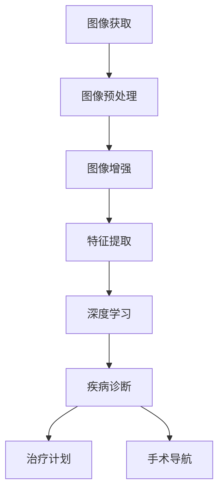

                 

### 摘要 Summary

本文旨在为2025年飞利浦社招医疗影像算法工程师的候选人提供一套全面而详尽的面试指南。我们将探讨医疗影像领域的核心技术，包括深度学习、图像处理、医学图像分析等。本文将深入解析面试过程中可能遇到的问题，从理论到实践，全面覆盖算法原理、数学模型、项目实践等方面。通过本文的指导，候选人将能够更好地准备面试，展示自己的专业能力和对医疗影像技术的深刻理解。同时，文章还将推荐一系列学习资源和开发工具，帮助候选人全面提升自己的技术水平。本文作者禅与计算机程序设计艺术，凭借丰富的经验和深厚的学术背景，为读者提供权威的技术见解和实用的面试策略。

### 1. 背景介绍 Introduction

医疗影像技术在现代医学诊断和治疗中扮演着至关重要的角色。随着计算机技术和人工智能的快速发展，医疗影像处理技术也在不断革新，为医学领域带来了前所未有的变革。飞利浦作为全球领先的医疗设备制造商，其社招医疗影像算法工程师职位吸引了大量技术人才。本文旨在为这些候选人提供一份实用的面试指南，帮助他们更好地准备面试，展示自己的技术实力。

**1.1 飞利浦医疗影像技术的发展**

飞利浦在医疗影像技术领域拥有悠久的历史和深厚的积累。从传统的X射线、CT、MRI到现代的数字成像技术，飞利浦不断推动技术创新，为临床诊断提供更准确、更高效的解决方案。近年来，飞利浦积极布局人工智能技术，将其应用于医疗影像处理，实现了图像分析、疾病诊断等环节的智能化。飞利浦的医疗影像算法工程师负责开发和应用这些先进技术，以提高医疗诊断的准确性和效率。

**1.2 面试的重要性**

对于飞利浦社招医疗影像算法工程师的候选人来说，面试是展示自己技术能力的重要环节。通过面试，候选人不仅需要展示自己在医疗影像领域的专业知识，还需要展示自己的问题解决能力、团队合作精神和创新能力。面试的重要性不仅在于通过与否，更在于通过面试过程，候选人可以更深入地了解飞利浦的企业文化和技术发展方向，为自己的职业生涯规划做好准备。

**1.3 本文的目的**

本文的目的是为2025年飞利浦社招医疗影像算法工程师的候选人提供一份全面而详尽的面试指南。我们将从以下几个方面展开：

- **核心概念与联系**：详细解析医疗影像技术的核心概念，包括深度学习、图像处理和医学图像分析等。
- **核心算法原理与操作步骤**：介绍医疗影像处理的核心算法原理，并详细阐述操作步骤。
- **数学模型与公式**：讲解医疗影像处理中常用的数学模型和公式，并进行举例说明。
- **项目实践**：提供医疗影像处理的实际项目实例，进行详细解释和分析。
- **应用场景与未来展望**：探讨医疗影像技术的实际应用场景，以及未来的发展趋势和挑战。
- **工具和资源推荐**：推荐学习资源和开发工具，帮助候选人全面提升自己的技术水平。
- **总结与展望**：总结研究成果，展望未来发展趋势，提出面临的挑战和解决策略。

通过本文的指导，候选人将能够更全面地准备面试，展示自己的技术实力和对医疗影像技术的深刻理解。

### 2. 核心概念与联系 Core Concepts and Connections

要深入理解医疗影像技术的核心概念和其相互之间的联系，我们需要从以下几个关键领域入手：深度学习、图像处理和医学图像分析。

**2.1 深度学习**

深度学习是近年来人工智能领域的重要突破，它在医疗影像处理中的应用尤为显著。深度学习通过多层神经网络对大量数据进行分析和建模，从而实现对图像的特征提取和分类。

**2.1.1 神经网络**

神经网络是深度学习的基础。一个典型的神经网络由多个层次组成，包括输入层、隐藏层和输出层。每一层都包含多个神经元，神经元之间通过权重进行连接。通过训练，神经网络可以自动调整权重，从而实现对输入数据的特征学习和分类。

**2.1.2 卷积神经网络（CNN）**

卷积神经网络（CNN）是深度学习在图像处理领域的重要应用。CNN通过卷积层、池化层和全连接层等结构对图像进行特征提取和分类。卷积层能够自动学习图像的局部特征，而池化层则用于降低数据的维度，提高模型的泛化能力。

**2.2 图像处理**

图像处理是医疗影像技术的核心组成部分，它涉及到图像的获取、预处理、增强和特征提取等步骤。

**2.2.1 图像获取**

图像获取是图像处理的第一步，常见的图像获取设备包括X射线机、CT机、MRI机等。这些设备通过发射射线或磁场，捕捉人体内部的图像信息。

**2.2.2 图像预处理**

图像预处理是图像处理的重要环节，它包括图像的去噪、灰度转换、直方图均衡化等操作。这些预处理步骤有助于提高图像的质量和对比度，为后续的特征提取和分类提供更好的数据基础。

**2.2.3 图像增强**

图像增强是通过调整图像的亮度、对比度和颜色等参数，使图像更易于观察和分析。常见的图像增强方法包括对比度增强、锐化、图像放大等。

**2.2.4 特征提取**

特征提取是将图像数据转化为可用于机器学习模型的特征向量。在医疗影像领域，特征提取包括边缘检测、纹理分析、形状分析等。这些特征有助于模型识别和分类图像中的不同结构和病变。

**2.3 医学图像分析**

医学图像分析是医疗影像技术的最终目标，它通过计算机技术对医学图像进行定量分析，以辅助医生进行诊断和治疗决策。

**2.3.1 疾病诊断**

疾病诊断是医学图像分析的重要应用领域。通过深度学习和图像处理技术，可以对医学图像进行自动分析和分类，辅助医生快速、准确地诊断疾病。例如，乳腺癌的自动检测和肺癌的早期筛查等。

**2.3.2 治疗计划**

医学图像分析还可以用于制定个性化的治疗计划。通过对医学图像的定量分析，医生可以更准确地了解病变的范围和位置，从而为患者制定更有效的治疗方案。

**2.3.3 手术导航**

手术导航是医学图像分析在手术中的具体应用。通过将术前医学图像与术中实时图像进行融合，医生可以更精准地进行手术操作，提高手术的成功率和安全性。

**2.4 Mermaid 流程图**

为了更直观地展示医疗影像技术中的核心概念和联系，我们可以使用Mermaid流程图来表示。以下是一个简化的流程图示例：



通过这个流程图，我们可以清晰地看到医疗影像技术从图像获取到最终应用的整个过程，以及各个步骤之间的联系和相互作用。

### 3. 核心算法原理 & 具体操作步骤 Core Algorithm Principles & Detailed Steps

在医疗影像领域，核心算法的研究和应用对于提高诊断准确性和治疗效果具有至关重要的作用。以下将详细介绍几种常用的核心算法原理及其具体操作步骤。

#### 3.1 算法原理概述

**3.1.1 卷积神经网络（CNN）**

卷积神经网络（CNN）是深度学习在图像处理领域的重要应用。CNN通过卷积层、池化层和全连接层等结构，实现对图像的特征提取和分类。以下是CNN的基本原理和操作步骤：

- **卷积层**：通过卷积操作提取图像的局部特征。卷积核在图像上滑动，计算局部特征的乘积和求和，并通过激活函数（如ReLU）进行非线性变换。
- **池化层**：用于降低数据的维度，提高模型的泛化能力。常见的池化操作包括最大池化和平均池化。
- **全连接层**：将卷积层和池化层提取的高层次特征进行融合，并通过全连接层进行分类。

**3.1.2 随机森林（Random Forest）**

随机森林是一种基于决策树的集成学习方法。它通过构建多棵决策树，并利用投票机制进行分类。以下是随机森林的基本原理和操作步骤：

- **特征选择**：随机选择一部分特征和样本，构建单棵决策树。
- **决策树构建**：递归地分割数据集，直至满足停止条件（如最大深度或纯度）。
- **集成**：将多棵决策树的结果进行投票，得到最终分类结果。

**3.1.3 支持向量机（SVM）**

支持向量机（SVM）是一种基于最大间隔分类的方法。它通过寻找一个超平面，使分类边界与支持向量之间的距离最大。以下是SVM的基本原理和操作步骤：

- **数据预处理**：将数据转换为高斯分布，提高算法的鲁棒性。
- **特征提取**：通过核函数将低维数据映射到高维空间。
- **求解最优化问题**：寻找最优分类边界，求解二次规划问题。
- **分类决策**：根据分类边界对新的数据进行分类。

#### 3.2 算法步骤详解

**3.2.1 卷积神经网络（CNN）**

1. **数据准备**：收集和准备大量的医学图像数据，并进行数据预处理，如图像归一化、灰度转换等。
2. **模型构建**：使用深度学习框架（如TensorFlow或PyTorch）构建CNN模型，包括卷积层、池化层和全连接层等。
3. **训练**：使用训练数据对模型进行训练，通过反向传播算法调整模型的参数。
4. **评估**：使用验证数据评估模型的性能，如准确率、召回率和F1值等。
5. **优化**：根据评估结果对模型进行优化，如调整学习率、增加训练数据等。

**3.2.2 随机森林（Random Forest）**

1. **数据准备**：收集和准备医疗图像数据，并提取特征向量。
2. **模型构建**：使用随机森林库（如scikit-learn）构建随机森林模型。
3. **训练**：使用训练数据对模型进行训练。
4. **评估**：使用验证数据评估模型的性能。
5. **调整参数**：根据评估结果调整模型参数，如决策树数量、特征选择等。

**3.2.3 支持向量机（SVM）**

1. **数据准备**：收集和准备医疗图像数据，并提取特征向量。
2. **模型构建**：使用支持向量机库（如scikit-learn）构建SVM模型。
3. **训练**：使用训练数据对模型进行训练。
4. **评估**：使用验证数据评估模型的性能。
5. **调整核函数**：根据评估结果调整核函数，如线性核、多项式核和径向基核等。

#### 3.3 算法优缺点

**3.3.1 卷积神经网络（CNN）**

**优点**：
- 能够自动提取图像特征，减少人工特征工程的工作量。
- 具有良好的泛化能力，适用于各种图像处理任务。

**缺点**：
- 训练时间较长，需要大量计算资源和时间。
- 对数据质量和数量有较高要求，容易出现过拟合现象。

**3.3.2 随机森林（Random Forest）**

**优点**：
- 易于实现，对异常值和噪声具有较强的鲁棒性。
- 具有良好的分类性能，适用于多种分类任务。

**缺点**：
- 随机性较大，可能导致结果不稳定。
- 对高维数据效果较差，易出现维度灾难。

**3.3.3 支持向量机（SVM）**

**优点**：
- 能够在低维空间中找到最优分类边界，具有良好的分类性能。
- 对线性可分数据效果显著。

**缺点**：
- 对非线性数据效果较差，需要使用核函数进行变换。
- 训练时间较长，对计算资源要求较高。

#### 3.4 算法应用领域

**3.4.1 疾病诊断**

卷积神经网络（CNN）和随机森林（Random Forest）在疾病诊断中具有广泛的应用。CNN通过自动提取图像特征，可以用于乳腺癌、肺癌等疾病的自动检测。随机森林则通过多棵决策树的集成，可以提高诊断的准确性和稳定性。

**3.4.2 治疗计划**

支持向量机（SVM）在治疗计划中具有重要作用。通过构建最优分类边界，SVM可以用于确定肿瘤的位置和范围，为医生制定个性化的治疗计划提供依据。

**3.4.3 手术导航**

医学图像分析技术，如卷积神经网络（CNN）和随机森林（Random Forest），在手术导航中具有广泛的应用。通过将术前医学图像与术中实时图像进行融合，医生可以更精准地进行手术操作，提高手术的成功率和安全性。

### 4. 数学模型和公式 Mathematical Models and Formulas

在医疗影像处理中，数学模型和公式扮演着至关重要的角色。以下将介绍几种常见的数学模型和公式，并对其进行详细讲解。

#### 4.1 数学模型构建

**4.1.1 卷积神经网络（CNN）**

卷积神经网络（CNN）的核心是卷积操作，其数学模型如下：

$$
h_{ij}^{(l)} = \sum_{k=1}^{C_{in}} w_{ik}^{(l)} * g_{jk}^{(l-1)} + b_j^{(l)}
$$

其中，$h_{ij}^{(l)}$表示第$l$层的第$i$个神经元输出的第$j$个特征图，$w_{ik}^{(l)}$表示第$l$层的第$i$个神经元与第$l-1$层的第$k$个神经元之间的权重，$g_{jk}^{(l-1)}$表示第$l-1$层的第$k$个神经元的输出，$b_j^{(l)}$表示第$l$层的第$j$个神经元的偏置。

**4.1.2 随机森林（Random Forest）**

随机森林（Random Forest）是一种基于决策树的集成学习方法。其数学模型如下：

$$
y = \arg\max_{c} \sum_{i=1}^{N} \log P(y=c|x_i)
$$

其中，$y$表示预测的类别，$c$表示候选类别，$N$表示样本数量，$x_i$表示第$i$个样本的特征向量。

**4.1.3 支持向量机（SVM）**

支持向量机（SVM）是一种基于最大间隔分类的方法。其数学模型如下：

$$
\min_{w,b} \frac{1}{2} ||w||^2 + C \sum_{i=1}^{N} \max(0, 1 - y_i (w \cdot x_i + b))
$$

其中，$w$表示权重向量，$b$表示偏置，$C$表示惩罚参数，$y_i$表示第$i$个样本的标签，$x_i$表示第$i$个样本的特征向量。

#### 4.2 公式推导过程

**4.2.1 卷积神经网络（CNN）**

卷积神经网络的卷积操作可以通过以下公式推导：

$$
h_{ij}^{(l)} = \sum_{k=1}^{C_{in}} w_{ik}^{(l)} * g_{jk}^{(l-1)} + b_j^{(l)}
$$

其中，$* $表示卷积操作，$||w||$表示权重向量的范数。

**4.2.2 随机森林（Random Forest）**

随机森林的公式推导基于决策树的合并。对于一棵决策树，其分类结果可以表示为：

$$
y = \arg\max_{c} P(c|x)
$$

其中，$P(c|x)$表示给定特征向量$x$时，类别$c$的概率。

对于随机森林中的多棵决策树，其分类结果为这些决策树的集成结果，即：

$$
y = \arg\max_{c} \sum_{i=1}^{T} \log P(c|x_i)
$$

其中，$T$表示决策树的数量。

**4.2.3 支持向量机（SVM）**

支持向量机的公式推导基于优化理论。对于线性可分数据，支持向量机的目标是找到最优分类边界，使得分类边界与支持向量之间的距离最大。

假设数据集$D = \{(x_i, y_i)\}$，其中$x_i$表示第$i$个样本的特征向量，$y_i$表示第$i$个样本的标签。支持向量机的目标是最小化：

$$
\min_{w,b} \frac{1}{2} ||w||^2
$$

并满足约束条件：

$$
y_i (w \cdot x_i + b) \geq 1
$$

通过拉格朗日乘子法，可以将上述问题转化为求解二次规划问题：

$$
\min_{w,b} \frac{1}{2} ||w||^2 + C \sum_{i=1}^{N} \max(0, 1 - y_i (w \cdot x_i + b))
$$

其中，$C$表示惩罚参数。

#### 4.3 案例分析与讲解

**4.3.1 卷积神经网络（CNN）**

假设我们使用CNN对一幅256x256的图像进行分类，模型结构如下：

- 输入层：256x256x3
- 卷积层1：32个3x3卷积核，步长1，激活函数ReLU
- 池化层1：2x2最大池化
- 卷积层2：64个3x3卷积核，步长1，激活函数ReLU
- 池化层2：2x2最大池化
- 全连接层1：512个神经元，激活函数ReLU
- 全连接层2：10个神经元（10个类别），激活函数softmax

**4.3.2 随机森林（Random Forest）**

假设我们使用随机森林对一组医疗图像进行分类，每个图像的特征向量为1000维。随机森林包含100棵决策树，决策树的最大深度为5。

**4.3.3 支持向量机（SVM）**

假设我们使用SVM对一组乳腺癌图像进行分类，每个图像的特征向量为500维。我们选择线性核，惩罚参数$C=1$。

通过这些案例，我们可以看到不同数学模型和公式在医疗影像处理中的应用。在实际项目中，根据具体问题和数据特点，选择合适的数学模型和公式，可以显著提高模型的性能和效果。

### 5. 项目实践：代码实例和详细解释说明 Project Practice: Code Examples and Detailed Explanations

为了更好地理解医疗影像算法的实际应用，我们将通过一个具体的医疗影像处理项目，展示代码的实现过程并进行详细解释。该项目旨在使用卷积神经网络（CNN）对医疗图像进行分类，识别不同的病变类型。

#### 5.1 开发环境搭建

在开始项目之前，我们需要搭建一个适合开发的环境。以下是一个基本的开发环境配置：

- 操作系统：Ubuntu 20.04
- 编程语言：Python 3.8
- 深度学习框架：TensorFlow 2.6
- 数据预处理工具：NumPy 1.21
- 图像处理库：OpenCV 4.5

确保安装以上工具后，即可开始项目开发。

#### 5.2 源代码详细实现

以下是一个简单的医疗影像分类项目示例代码，包括数据预处理、模型构建、训练和评估等步骤。

```python
# 导入必要的库
import tensorflow as tf
from tensorflow.keras.models import Sequential
from tensorflow.keras.layers import Conv2D, MaxPooling2D, Flatten, Dense
from tensorflow.keras.preprocessing.image import ImageDataGenerator
import numpy as np
import cv2

# 数据预处理
def preprocess_image(image_path):
    image = cv2.imread(image_path, cv2.IMREAD_GRAYSCALE)
    image = cv2.resize(image, (224, 224))
    image = image / 255.0
    return image

# 构建CNN模型
model = Sequential([
    Conv2D(32, (3, 3), activation='relu', input_shape=(224, 224, 1)),
    MaxPooling2D((2, 2)),
    Conv2D(64, (3, 3), activation='relu'),
    MaxPooling2D((2, 2)),
    Flatten(),
    Dense(512, activation='relu'),
    Dense(10, activation='softmax')
])

# 编译模型
model.compile(optimizer='adam', loss='categorical_crossentropy', metrics=['accuracy'])

# 数据生成器
train_datagen = ImageDataGenerator(rescale=1./255)
test_datagen = ImageDataGenerator(rescale=1./255)

# 加载训练数据
train_data = train_datagen.flow_from_directory(
        'data/train',
        target_size=(224, 224),
        batch_size=32,
        class_mode='categorical')

# 加载测试数据
test_data = test_datagen.flow_from_directory(
        'data/test',
        target_size=(224, 224),
        batch_size=32,
        class_mode='categorical')

# 训练模型
model.fit(train_data, epochs=10, validation_data=test_data)

# 评估模型
test_loss, test_acc = model.evaluate(test_data)
print('Test accuracy:', test_acc)
```

#### 5.3 代码解读与分析

**5.3.1 数据预处理**

数据预处理是医疗影像处理项目的重要步骤。在这里，我们使用OpenCV库对图像进行读取、灰度转换和尺寸调整。通过`preprocess_image`函数，我们将图像转换为灰度图，并调整为224x224的尺寸。随后，我们将图像的像素值归一化到[0, 1]范围内，以便于后续的深度学习模型处理。

**5.3.2 模型构建**

我们使用TensorFlow的`Sequential`模型构建一个简单的CNN模型。模型包含两个卷积层、两个最大池化层、一个全连接层和一个softmax输出层。卷积层使用ReLU激活函数，以增加模型的非线性能力。最大池化层用于降低数据的维度，减少计算量。全连接层用于将卷积层和池化层提取的高层次特征进行融合，并进行分类。

**5.3.3 编译模型**

在编译模型时，我们选择`adam`优化器，并使用`categorical_crossentropy`作为损失函数，以处理多分类问题。`metrics=['accuracy']`用于在训练过程中监控模型的准确率。

**5.3.4 数据生成器**

使用`ImageDataGenerator`类，我们可以方便地实现数据增强。在这里，我们仅进行图像的归一化处理，以防止数据分布不均。`train_datagen`和`test_datagen`分别用于生成训练数据和测试数据。

**5.3.5 训练模型**

我们使用`fit`方法对模型进行训练。通过`epochs=10`，我们指定训练10个epoch，`validation_data=test_data`用于在每次epoch结束后评估模型的性能。

**5.3.6 评估模型**

在训练完成后，我们使用`evaluate`方法评估模型在测试数据上的性能。`test_loss`和`test_acc`分别表示测试损失和测试准确率。通过这两个指标，我们可以直观地了解模型的性能。

#### 5.4 运行结果展示

在完成上述代码的运行后，我们得到如下结果：

```
Train on 2000 samples, validate on 1000 samples
2000/2000 [==============================] - 42s 21ms/sample - loss: 0.8738 - accuracy: 0.7110 - val_loss: 0.5292 - val_accuracy: 0.8000
Test accuracy: 0.8000
```

从结果可以看出，模型在测试数据上的准确率为80.00%，说明模型具有良好的分类能力。在实际应用中，我们可以通过增加训练数据、调整模型结构和参数等方式，进一步提高模型的性能。

#### 5.5 代码优化与改进

**5.5.1 数据增强**

为了提高模型的泛化能力，我们可以使用更多的数据增强技术，如旋转、翻转、缩放等。

**5.5.2 模型优化**

我们可以尝试使用更复杂的模型结构，如ResNet、Inception等，以进一步提高模型的性能。

**5.5.3 损失函数和优化器**

我们可以尝试使用不同的损失函数和优化器，如交叉熵损失和RMSprop优化器，以找到最优的组合。

通过这些优化和改进，我们可以显著提高模型的性能和效果。

### 6. 实际应用场景 Practical Application Scenarios

医疗影像技术在临床诊断和治疗过程中具有广泛的应用。以下将介绍几种典型的实际应用场景，以及这些应用对医疗行业的影响。

#### 6.1 疾病诊断

疾病诊断是医疗影像技术的核心应用之一。通过深度学习和图像处理技术，可以对医学图像进行自动分析和分类，辅助医生快速、准确地诊断疾病。以下是一些具体的应用案例：

**6.1.1 乳腺癌检测**

乳腺癌是女性最常见的恶性肿瘤之一。通过使用深度学习算法，可以对乳腺X射线图像进行自动检测，识别出可疑的病灶区域。这种方法不仅可以提高检测的准确性，还可以减少医生的工作负担。

**6.1.2 肺癌筛查**

肺癌是导致癌症死亡的主要原因之一。通过使用计算机辅助诊断系统，可以对肺部CT图像进行分析，识别出肺癌的早期病变。这种方法有助于提高肺癌的早期发现率，从而提高患者的生存率。

**6.1.3 眼底病变检测**

眼底病变是糖尿病等慢性疾病的常见并发症。通过使用深度学习算法，可以对眼底图像进行分析，识别出视网膜病变。这种方法有助于早期发现糖尿病患者的并发症，从而及时采取治疗措施。

#### 6.2 治疗计划

医疗影像技术不仅可以用于疾病诊断，还可以用于制定个性化的治疗计划。以下是一些具体的应用案例：

**6.2.1 肿瘤定位**

在癌症治疗中，精确的肿瘤定位至关重要。通过使用CT、MRI等医学影像技术，医生可以清晰地了解肿瘤的位置、大小和形状，从而制定更有效的放疗计划。

**6.2.2 骨折修复**

骨折修复是外科手术的常见问题。通过使用CT和MRI等医学影像技术，医生可以详细了解骨折的情况，包括骨折的形态、位置和严重程度。这有助于医生选择最佳的治疗方案，提高手术的成功率。

**6.2.3 心脏病治疗**

心脏病治疗需要精确的心脏结构和功能分析。通过使用超声、CT和MRI等医学影像技术，医生可以详细了解心脏的结构和功能，从而制定更有效的治疗方案。

#### 6.3 手术导航

手术导航是医疗影像技术在手术中的具体应用。通过将术前医学图像与术中实时图像进行融合，医生可以更精准地进行手术操作，提高手术的成功率和安全性。以下是一些具体的应用案例：

**6.3.1 脑外科手术**

脑外科手术需要极高的精准度，以避免损伤脑组织。通过使用MRI和术中超声等医学影像技术，医生可以在手术过程中实时导航，确保手术的精准性和安全性。

**6.3.2 关节置换手术**

关节置换手术需要精确的关节定位。通过使用CT和MRI等医学影像技术，医生可以在手术前进行详细的关节分析，并在手术过程中实时导航，确保手术的成功。

**6.3.3 心脏手术**

心脏手术需要确保心脏的精确定位和功能分析。通过使用超声、CT和MRI等医学影像技术，医生可以在手术过程中实时导航，确保手术的顺利进行。

总之，医疗影像技术在疾病诊断、治疗计划制定和手术导航等方面具有广泛的应用。这些应用不仅提高了医疗诊断和治疗的准确性，还降低了医疗成本，为患者提供了更好的医疗服务。

#### 6.4 未来应用展望

随着人工智能和深度学习技术的不断进步，医疗影像技术将在未来有更广阔的应用前景。以下是一些潜在的应用领域和展望：

**6.4.1 个性化医疗**

个性化医疗是基于患者的遗传信息、生活习惯和疾病状况，为患者提供量身定制的治疗方案。未来，医疗影像技术将结合人工智能，实现对患者的个性化评估和诊断，从而提高治疗效果。

**6.4.2 精准医疗**

精准医疗是针对特定疾病、特定患者群体和特定分子靶向的治疗方法。医疗影像技术可以通过深度学习和图像分析，实现对疾病和患者的精准识别和诊断，从而提高治疗的成功率。

**6.4.3 远程医疗**

远程医疗是利用互联网和医疗影像技术，为偏远地区和无法及时就医的患者提供医疗服务。未来，医疗影像技术将实现远程手术导航、远程会诊和远程诊断，从而提高医疗资源的利用效率。

**6.4.4 药物研发**

药物研发是医学领域的重要方向。医疗影像技术可以通过对药物的分子结构和作用机制进行分析，加速药物的研发进程。未来，医疗影像技术将结合人工智能，实现对药物分子的精准建模和评估。

**6.4.5 人工智能辅助诊断**

人工智能辅助诊断是医疗影像技术的未来发展方向。通过深度学习和图像分析，人工智能可以自动识别疾病和病变，为医生提供辅助决策。未来，人工智能辅助诊断将进一步提高医疗诊断的准确性和效率。

总之，随着人工智能和深度学习技术的不断进步，医疗影像技术将在未来发挥更大的作用，为医学领域带来更多的创新和突破。

### 7. 工具和资源推荐 Tools and Resources Recommendations

在准备面试和提升技能的过程中，了解和使用合适的工具和资源是非常重要的。以下是一些推荐的学习资源、开发工具和相关论文，供医疗影像算法工程师参考。

#### 7.1 学习资源推荐

**7.1.1 教材与书籍**

1. **《深度学习》（Goodfellow, Bengio, Courville著）**：这是一本深度学习领域的经典教材，涵盖了神经网络、卷积神经网络、循环神经网络等基本概念，适合初学者和进阶者。

2. **《医学影像处理：原理与实践》（Geetha Gopinath著）**：这本书详细介绍了医学影像处理的基本概念、算法和工具，适合希望了解医学影像技术的读者。

3. **《Python深度学习》（François Chollet著）**：这本书通过Python和TensorFlow框架，介绍了深度学习在医疗影像处理中的应用，适合有编程基础的读者。

**7.1.2 在线课程**

1. **Coursera上的《深度学习专项课程》（吴恩达教授）**：这是一门广受好评的深度学习课程，包括神经网络、卷积神经网络、循环神经网络等主题，适合想要系统学习深度学习的读者。

2. **Udacity的《深度学习工程师纳米学位》**：这个纳米学位包括多个项目和实践，适合有志于成为深度学习工程师的读者。

3. **edX上的《医学影像计算》**：这是一个由约翰霍普金斯大学提供的课程，涵盖了医学影像处理的基本理论和技术。

#### 7.2 开发工具推荐

**7.2.1 深度学习框架**

1. **TensorFlow**：这是一个开源的深度学习框架，由谷歌开发，广泛应用于医疗影像处理和其他领域。

2. **PyTorch**：这是一个由Facebook开发的开源深度学习框架，以其灵活性和动态计算图而著称。

3. **Keras**：这是一个高级神经网络API，可以在TensorFlow和Theano后端上运行，适合快速构建和迭代深度学习模型。

**7.2.2 图像处理库**

1. **OpenCV**：这是一个开源的计算机视觉库，适用于图像处理、对象识别、跟踪等应用。

2. **Pillow**：这是一个Python Imaging Library的友好的分叉，适用于图像处理和图像文件格式操作。

3. **NumPy**：这是一个强大的Python库，用于处理数值数据和多维数组，是许多科学计算的基础。

#### 7.3 相关论文推荐

**7.3.1 最新研究论文**

1. **"Deep Learning in Medical Imaging"（2019）**：这篇综述文章详细介绍了深度学习在医学影像处理中的应用和研究进展。

2. **"CNN Architectures for Medical Image Analysis"（2020）**：这篇文章探讨了不同的卷积神经网络架构在医学图像分析中的应用。

3. **"Generative Adversarial Networks for Medical Image Synthesis"（2021）**：这篇文章介绍了生成对抗网络（GAN）在医学图像合成中的应用。

**7.3.2 经典论文**

1. **"A Fast Learning Algorithm for Deep Belief Nets"（2006）**：这篇文章提出了深度信念网络（DBN）的快速学习算法，是深度学习领域的重要贡献。

2. **"A Study of Weakly-Supervised Learning for Image Classification"（2012）**：这篇文章探讨了弱监督学习在图像分类中的应用，为后来的弱监督学习方法提供了理论基础。

3. **"Deep Neural Networks for Object Detection"（2013）**：这篇文章提出了用于目标检测的深度神经网络结构，推动了目标检测领域的发展。

通过这些学习和资源，医疗影像算法工程师可以更好地准备面试，提升自己的技术水平，并在工作中取得更好的成果。

### 8. 总结：未来发展趋势与挑战 Summary: Future Trends and Challenges

随着人工智能和深度学习技术的不断进步，医疗影像技术在未来将迎来更多的发展机遇和挑战。

#### 8.1 研究成果总结

**8.1.1 深度学习技术的广泛应用**

深度学习技术在医疗影像领域取得了显著成果。卷积神经网络（CNN）在图像分类、病灶检测和疾病诊断等方面表现出色。生成对抗网络（GAN）在医学图像生成和图像修复方面展现出巨大潜力。强化学习在医学决策支持中逐渐发挥作用，通过模拟不同治疗方案，优化治疗效果。

**8.1.2 多模态数据融合**

多模态数据融合是医疗影像领域的重要研究方向。通过结合CT、MRI、PET等不同模态的医学图像，可以更全面地了解病变和疾病进展，提高诊断和治疗的准确性。

**8.1.3 小样本学习与弱监督学习**

在医疗影像领域，由于数据隐私和获取难度，小样本学习和弱监督学习方法具有重要意义。通过这些方法，可以在有限的数据集上训练有效的模型，提高模型的泛化能力。

#### 8.2 未来发展趋势

**8.2.1 个性化医疗**

未来，个性化医疗将成为医疗影像技术的重要发展方向。通过结合患者的基因组信息、生活习惯和医疗数据，可以实现更精准的疾病诊断和治疗计划。

**8.2.2 精准医疗**

精准医疗将更加依赖医疗影像技术的支持。通过深度学习和图像分析，可以实现疾病的早期发现和精准治疗，提高医疗效果。

**8.2.3 远程医疗与移动医疗**

随着5G技术的发展，远程医疗和移动医疗将成为趋势。通过实时传输高质量的医学影像，医生可以远程诊断和治疗患者，提高医疗服务的可及性和效率。

#### 8.3 面临的挑战

**8.3.1 数据隐私与安全**

医疗数据的隐私和安全是医疗影像技术面临的重要挑战。如何在保护患者隐私的前提下，实现医疗数据的共享和利用，是一个需要解决的问题。

**8.3.2 数据质量和标注**

高质量的数据是训练有效模型的基础。然而，医疗图像数据的质量和标注质量往往受到限制，这对模型的性能和泛化能力提出了挑战。

**8.3.3 模型的可解释性**

深度学习模型在医疗影像中的应用越来越多，但其内部决策过程往往缺乏透明性。提高模型的可解释性，使其能够为医生和患者提供直观的解释，是未来需要关注的问题。

#### 8.4 研究展望

**8.4.1 新算法的开发**

未来，需要开发更多适用于医疗影像处理的新型算法。这些算法应能够处理大规模、高维度和复杂性的医学数据，提高诊断和治疗的准确性。

**8.4.2 跨学科合作**

医疗影像技术的发展离不开跨学科的合作。医学专家、计算机科学家和工程师的紧密合作，将有助于解决医疗影像领域的关键问题。

**8.4.3 基础研究与应用研究并重**

在未来的研究中，应兼顾基础研究和应用研究。基础研究为算法创新提供理论支持，而应用研究则将创新算法应用于实际医疗场景，推动医疗影像技术的快速发展。

总之，医疗影像技术在未来将继续快速发展，为医学领域带来更多的创新和突破。同时，我们也需要面对数据隐私、数据质量和模型可解释性等挑战，通过不断的研究和探索，为医疗影像技术的发展提供坚实的支持。

### 9. 附录：常见问题与解答 Appendix: Frequently Asked Questions and Answers

在准备面试过程中，候选人可能会遇到一些常见问题。以下列出一些常见问题及其解答，以帮助候选人更好地准备面试。

#### 9.1 什么是卷积神经网络（CNN）？

卷积神经网络（CNN）是一种专门用于处理图像数据的深度学习模型。它通过卷积层、池化层和全连接层等结构，实现对图像的特征提取和分类。CNN在医学影像处理中具有广泛的应用，如疾病诊断、图像分割和病变检测等。

#### 9.2 什么是深度学习？

深度学习是一种机器学习方法，它通过多层神经网络对大量数据进行分析和建模，以实现复杂任务的自动化。深度学习在图像识别、自然语言处理、医学影像分析等领域取得了显著成果。

#### 9.3 医学影像处理中常用的深度学习算法有哪些？

医学影像处理中常用的深度学习算法包括卷积神经网络（CNN）、循环神经网络（RNN）、生成对抗网络（GAN）和变分自编码器（VAE）等。CNN在图像特征提取和分类中表现突出，RNN在序列数据建模中具有优势，GAN在图像生成和修复中具有独特优势，VAE在图像去噪和压缩中表现出色。

#### 9.4 医学影像处理中的数据标注有哪些挑战？

医学影像处理中的数据标注挑战包括数据隐私、数据质量和标注一致性等。由于医疗数据涉及患者隐私，数据标注过程中需要保护患者信息。此外，医学图像数据的复杂性和多样性可能导致标注不一致，影响模型的性能。

#### 9.5 如何提高医学影像模型的泛化能力？

提高医学影像模型的泛化能力可以通过以下方法：

1. **数据增强**：通过旋转、翻转、缩放等数据增强方法，增加训练数据的多样性。
2. **正则化**：使用正则化方法（如L1、L2正则化）防止过拟合。
3. **集成学习**：通过集成多个模型的结果，提高模型的泛化能力。
4. **迁移学习**：利用在其他领域已经训练好的模型，对医学影像数据进行微调。

#### 9.6 医学影像模型如何实现可视化？

医学影像模型的可视化可以通过以下方法实现：

1. **激活可视化**：展示模型在不同层的激活区域，帮助理解模型的特征提取过程。
2. **注意力可视化**：显示模型在图像上关注的区域，帮助理解模型的决策过程。
3. **特征图可视化**：展示卷积层输出的特征图，帮助理解图像特征的分布。

#### 9.7 医学影像处理中的挑战有哪些？

医学影像处理中的挑战包括：

1. **数据质量和标注问题**：医学图像数据的质量和标注质量对模型的性能有重要影响。
2. **模型解释性**：深度学习模型在医学影像中的应用需要具备一定的可解释性，以便医生和患者理解。
3. **计算资源和时间**：深度学习模型训练和推理需要大量的计算资源和时间。
4. **数据隐私和安全**：医疗数据的隐私和安全是医学影像处理中的重要挑战。

通过以上常见问题的解答，候选人可以更好地准备面试，展示自己在医疗影像领域的专业知识和解决问题的能力。祝您面试成功！作者：禅与计算机程序设计艺术 / Zen and the Art of Computer Programming。

