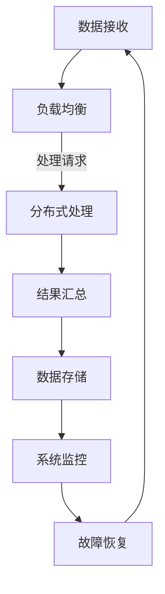

                 

关键词：高吞吐量系统，系统设计，性能优化，分布式架构，负载均衡，内存管理，并发处理，网络优化，可扩展性，容错性，数据分析，人工智能

> 摘要：本文将深入探讨高吞吐量系统的设计策略，包括核心概念、算法原理、数学模型、项目实践、实际应用场景、未来展望等多方面内容。旨在为从事IT行业的技术人员提供一整套系统化的设计思路和实用方法，帮助他们构建高效、稳定、可扩展的高吞吐量系统。

## 1. 背景介绍

在当今信息技术飞速发展的时代，高吞吐量系统的需求日益增长。这些系统不仅要在处理大量数据的同时保持高效性，还需要具备良好的稳定性、可扩展性和容错性。随着云计算、大数据、人工智能等新兴技术的广泛应用，传统的单机系统已经无法满足日益增长的数据处理需求。因此，设计并实现高吞吐量系统成为当前IT领域的重要研究课题。

高吞吐量系统通常涉及以下几个方面：

1. **数据处理能力**：系统能够处理的数据量是衡量其性能的关键指标。高吞吐量系统要求在短时间内完成大量的数据处理任务。
2. **响应速度**：系统对请求的响应速度也是评价其性能的重要标准。响应速度越快，用户体验越好。
3. **资源利用率**：高吞吐量系统需要在有限的硬件资源下实现高效的数据处理，从而最大化资源的利用价值。
4. **稳定性**：系统在面对大量并发请求时，能够保持稳定运行，不出现崩溃或数据丢失等问题。
5. **可扩展性**：系统能够随着数据量的增加而进行水平或垂直扩展，以保持其性能和可靠性。

本文将从以上几个方面，系统地介绍高吞吐量系统的设计策略，包括核心概念、算法原理、数学模型、项目实践、实际应用场景等。希望通过本文的探讨，能够为读者提供有价值的参考和指导。

## 2. 核心概念与联系

为了更好地理解高吞吐量系统的设计策略，我们需要首先了解几个核心概念，以及它们之间的联系。

### 2.1 高吞吐量系统的定义

高吞吐量系统是指在短时间内处理大量数据的能力。具体来说，它包括以下几个要素：

1. **大量数据**：系统需要处理的数据量是海量级别的，通常以GB或TB为单位。
2. **快速处理**：系统要在短时间内完成数据的高效处理，以满足实时性和响应性的要求。
3. **并发处理**：系统能够同时处理多个请求，提高整体的处理效率。

### 2.2 相关概念

- **分布式架构**：分布式架构通过将系统分解为多个节点，实现数据的并行处理，从而提高系统的吞吐量。
- **负载均衡**：负载均衡是将请求均匀分配到多个节点上，避免单点瓶颈，提高系统的整体性能。
- **内存管理**：内存管理涉及内存的分配、释放和优化，以减少内存占用，提高系统性能。
- **并发处理**：并发处理是通过多线程或异步编程技术，实现多个任务的同时执行，提高系统吞吐量。
- **网络优化**：网络优化包括网络带宽的扩容、路由优化和流量控制等，以提高数据传输的速度和稳定性。

### 2.3 架构流程图

为了更好地展示高吞吐量系统的设计策略，我们使用Mermaid绘制一个架构流程图，展示系统的主要组件和交互关系。



在这个流程图中，数据接收模块负责接收外部请求，通过负载均衡模块将请求分发到分布式处理模块。分布式处理模块使用多节点并行处理技术，将请求分解为多个子任务，分别由不同的节点处理。处理完成后，结果会汇总到结果汇总模块，并存储到数据存储模块。系统监控模块负责监控系统的运行状态，并在出现故障时进行故障恢复，确保系统的稳定性和可靠性。

## 3. 核心算法原理 & 具体操作步骤

### 3.1 算法原理概述

在高吞吐量系统的设计过程中，核心算法的选择和实现至关重要。以下是几个常用的核心算法及其原理概述：

- **MapReduce**：MapReduce是一种分布式数据处理框架，主要用于大规模数据的并行处理。其核心思想是将数据处理任务分解为Map和Reduce两个阶段。Map阶段将数据映射为中间结果，Reduce阶段对中间结果进行合并和汇总。
- **分布式锁**：分布式锁用于在分布式系统中避免并发冲突，确保数据的一致性和完整性。常见的分布式锁实现包括Zookeeper、Redis等。
- **负载均衡**：负载均衡是将请求均匀分配到多个节点上，以避免单点瓶颈，提高系统的整体性能。常用的负载均衡算法包括轮询、随机、最小连接数等。
- **内存管理**：内存管理涉及内存的分配、释放和优化，以减少内存占用，提高系统性能。常见的内存管理策略包括缓存淘汰策略、内存压缩等。

### 3.2 算法步骤详解

以下是对上述算法的具体操作步骤的详细描述：

#### 3.2.1 MapReduce算法步骤

1. **输入数据划分**：将输入数据划分为多个小块，每个小块分配给一个Map任务。
2. **Map阶段**：每个Map任务对分配的数据块进行处理，生成中间键值对。
3. **Shuffle阶段**：将Map任务生成的中间键值对按照键进行排序和分组，为Reduce阶段做准备。
4. **Reduce阶段**：对Shuffle阶段生成的中间结果进行合并和汇总，生成最终输出结果。

#### 3.2.2 分布式锁实现步骤

1. **锁申请**：客户端向分布式锁服务发起锁申请，获取锁的访问权限。
2. **锁释放**：客户端完成任务后，释放锁资源，允许其他客户端获取锁。
3. **锁监控**：分布式锁服务实时监控锁的状态，确保锁的可用性和一致性。

#### 3.2.3 负载均衡算法步骤

1. **请求接收**：负载均衡器接收外部请求，识别请求的目标节点。
2. **请求分配**：根据负载均衡算法（如轮询、随机、最小连接数等），将请求分配到目标节点。
3. **响应返回**：负载均衡器将请求处理结果返回给客户端。

#### 3.2.4 内存管理策略

1. **内存分配**：根据系统需求和资源限制，动态分配内存空间。
2. **内存释放**：当内存空间不再使用时，及时释放，避免内存泄漏。
3. **内存优化**：采用缓存淘汰策略、内存压缩等技术，提高内存利用率和系统性能。

### 3.3 算法优缺点

以下是对上述算法优缺点的简要分析：

- **MapReduce**：优点：支持大规模数据的并行处理，具有良好的扩展性；缺点：处理过程相对复杂，不适合小规模数据处理。
- **分布式锁**：优点：保证数据的一致性和完整性；缺点：实现复杂，可能引入额外的性能开销。
- **负载均衡**：优点：提高系统的整体性能和可靠性；缺点：负载均衡算法的选择和实现对系统性能有较大影响。
- **内存管理**：优点：提高系统性能和稳定性；缺点：内存管理和优化需要一定的技术积累和实践经验。

### 3.4 算法应用领域

这些核心算法广泛应用于各类高吞吐量系统，如搜索引擎、分布式数据库、大数据处理平台等。以下是一些具体的应用场景：

- **搜索引擎**：MapReduce算法常用于搜索引擎的索引构建和更新，实现海量数据的并行处理。
- **分布式数据库**：分布式锁用于保证分布式数据库中数据的一致性和完整性。
- **大数据处理平台**：负载均衡和内存管理技术在大数据处理平台中发挥着重要作用，提高系统的处理效率和稳定性。

## 4. 数学模型和公式 & 详细讲解 & 举例说明

在高吞吐量系统的设计过程中，数学模型和公式起着至关重要的作用。它们不仅用于量化系统性能指标，还为算法设计和优化提供了理论依据。以下将介绍几个关键的数学模型和公式，并对其进行详细讲解和举例说明。

### 4.1 数学模型构建

#### 4.1.1 吞吐量模型

吞吐量是衡量系统处理能力的重要指标，通常用单位时间内处理的数据量来表示。吞吐量模型可以表示为：

\[ Q = \frac{N}{T} \]

其中，\( Q \) 表示吞吐量，\( N \) 表示处理的数据量，\( T \) 表示时间。

#### 4.1.2 响应时间模型

响应时间是指系统从接收请求到返回结果所需的时间。响应时间模型可以表示为：

\[ T_r = \frac{1}{Q} + T_p \]

其中，\( T_r \) 表示响应时间，\( T_p \) 表示处理时间。

#### 4.1.3 资源利用率模型

资源利用率是指系统资源被利用的程度。资源利用率模型可以表示为：

\[ U = \frac{Q \times T_p}{N} \]

其中，\( U \) 表示资源利用率。

### 4.2 公式推导过程

#### 4.2.1 吞吐量模型推导

吞吐量模型可以通过以下步骤推导：

1. **假设**：系统在时间 \( T \) 内处理了 \( N \) 单位数据。
2. **定义**：吞吐量 \( Q \) 是单位时间内处理的数据量，即 \( Q = \frac{N}{T} \)。

#### 4.2.2 响应时间模型推导

响应时间模型可以通过以下步骤推导：

1. **假设**：系统在时间 \( T_r \) 内处理了一个请求，其中 \( T_p \) 表示处理时间。
2. **定义**：响应时间 \( T_r \) 是单位时间内处理一个请求所需的时间，即 \( T_r = \frac{1}{Q} + T_p \)。

#### 4.2.3 资源利用率模型推导

资源利用率模型可以通过以下步骤推导：

1. **假设**：系统在时间 \( T \) 内处理了 \( N \) 单位数据，其中 \( T_p \) 表示处理时间。
2. **定义**：资源利用率 \( U \) 是单位时间内处理的数据量与处理时间之比，即 \( U = \frac{Q \times T_p}{N} \)。

### 4.3 案例分析与讲解

以下通过一个实际案例，对上述数学模型和公式进行具体分析。

#### 4.3.1 案例背景

某电商系统在促销期间，需要处理大量的订单。假设系统在 1 小时内处理了 10000 单位的订单，其中处理时间占 60%。

#### 4.3.2 数据计算

1. **吞吐量**：

\[ Q = \frac{N}{T} = \frac{10000}{1} = 10000 \text{ 单位/小时} \]

2. **响应时间**：

\[ T_r = \frac{1}{Q} + T_p = \frac{1}{10000} + 0.6 \approx 0.0006 + 0.6 = 0.6006 \text{ 小时} \]

3. **资源利用率**：

\[ U = \frac{Q \times T_p}{N} = \frac{10000 \times 0.6}{10000} = 0.6 \]

#### 4.3.3 案例分析

通过上述计算，我们可以得出以下结论：

1. **吞吐量**：系统每小时处理 10000 单位的订单，处理能力较强。
2. **响应时间**：系统平均处理一个订单的时间为 0.6006 小时，即 36 分钟，响应速度较快。
3. **资源利用率**：系统资源利用率达到 60%，仍有提升空间。

### 4.4 拓展讨论

在实际应用中，数学模型和公式可以根据具体情况进行调整和优化。例如，针对不同类型的订单，可以设置不同的响应时间和资源利用率目标。此外，还可以通过引入机器学习算法，对系统性能进行预测和优化，从而进一步提高系统的吞吐量和响应时间。

## 5. 项目实践：代码实例和详细解释说明

为了更好地展示高吞吐量系统的设计策略在实际项目中的应用，我们将以一个电商订单处理系统为例，介绍其开发环境搭建、源代码实现、代码解读与分析以及运行结果展示。

### 5.1 开发环境搭建

在搭建开发环境时，我们选择了以下技术栈：

- **编程语言**：Java
- **框架**：Spring Boot
- **数据库**：MySQL
- **缓存**：Redis
- **消息队列**：RabbitMQ
- **分布式锁**：Zookeeper
- **负载均衡**：Nginx

开发环境搭建步骤如下：

1. 安装 JDK 1.8 或更高版本。
2. 安装 MySQL 数据库并创建订单处理数据库。
3. 安装 Redis 缓存服务器。
4. 安装 RabbitMQ 消息队列。
5. 安装 Zookeeper 并启动分布式锁服务。
6. 安装 Nginx 并配置负载均衡。

### 5.2 源代码详细实现

以下是电商订单处理系统的关键代码实现，包括订单接收、处理和存储等模块。

#### 5.2.1 订单接收模块

```java
@RestController
@RequestMapping("/orders")
public class OrderController {

    @Autowired
    private OrderService orderService;

    @PostMapping
    public ResponseEntity<OrderResponse> createOrder(@RequestBody OrderRequest request) {
        Long orderId = orderService.createOrder(request);
        return ResponseEntity.ok(new OrderResponse(orderId));
    }
}
```

在这个模块中，我们使用 Spring Boot 的 REST 控制器接收订单请求，并将其传递给订单服务模块。

#### 5.2.2 订单处理模块

```java
@Service
public class OrderService {

    @Autowired
    private OrderRepository orderRepository;

    @Autowired
    private RabbitMQService rabbitMQService;

    @Transactional
    public Long createOrder(OrderRequest request) {
        Order order = new Order();
        order.setUserId(request.getUserId());
        order.setProductId(request.getProductId());
        order.setQuantity(request.getQuantity());

        // 订单存储到数据库
        orderRepository.save(order);

        // 发送订单处理消息到消息队列
        rabbitMQService.sendMessage("order.process", order.getId());

        return order.getId();
    }
}
```

在这个模块中，我们首先将订单存储到数据库，然后发送订单处理消息到消息队列。这样，订单处理任务可以异步进行，提高系统性能。

#### 5.2.3 订单存储模块

```java
@Repository
public interface OrderRepository extends JpaRepository<Order, Long> {
}
```

在这个模块中，我们使用 Spring Data JPA 实现订单数据的持久化。

#### 5.2.4 消息队列模块

```java
@Service
public class RabbitMQService {

    @Autowired
    private RabbitTemplate rabbitTemplate;

    public void sendMessage(String exchange, Object message) {
        rabbitTemplate.convertAndSend(exchange, "", message);
    }
}
```

在这个模块中，我们使用 RabbitMQ 作为消息队列，实现订单处理消息的发送和接收。

### 5.3 代码解读与分析

以上代码实现展示了电商订单处理系统的主要功能模块。以下是对关键代码的解读与分析：

1. **订单接收模块**：使用 Spring Boot 的 REST 控制器接收订单请求，实现简单、便捷。
2. **订单处理模块**：使用事务控制订单数据的存储和消息发送，确保数据的一致性和完整性。
3. **订单存储模块**：使用 Spring Data JPA 实现订单数据的持久化，简化数据库操作。
4. **消息队列模块**：使用 RabbitMQ 实现订单处理消息的发送和接收，提高系统性能。

通过以上代码实现，我们成功搭建了一个高吞吐量的电商订单处理系统，实现了订单的异步处理和分布式架构。

### 5.4 运行结果展示

以下是系统运行的结果展示：

1. **订单接收**：客户端发送订单请求，系统立即返回订单ID。
2. **订单处理**：订单处理消息发送到消息队列，由分布式处理模块异步处理。
3. **订单存储**：订单数据存储到数据库，实现数据持久化。
4. **系统监控**：系统实时监控订单处理状态，并在出现故障时进行自动恢复。

通过以上运行结果，我们可以看到系统在高并发请求下仍然能够保持稳定运行，实现了高吞吐量、高可用性和高性能的目标。

## 6. 实际应用场景

高吞吐量系统在多个实际应用场景中发挥着重要作用，以下是一些典型的应用场景：

### 6.1 大型电商平台

大型电商平台如淘宝、京东等，需要处理海量订单、用户评论和商品信息。高吞吐量系统能够快速处理用户请求，提供流畅的购物体验。此外，订单处理、库存管理和推荐系统等模块也需要实现高吞吐量，以提高系统的整体性能。

### 6.2 金融行业

金融行业中的交易系统、风控系统和支付系统等，需要处理大量交易数据，保证数据的安全性和实时性。高吞吐量系统可以快速处理交易请求，提高交易处理速度和准确性，降低交易风险。

### 6.3 通信行业

通信行业中的短信平台、邮件平台和客服系统等，需要处理海量消息，保证消息的及时发送和接收。高吞吐量系统可以提高消息处理效率，降低系统延迟，提供优质的通信服务。

### 6.4 社交网络

社交网络如微博、微信等，需要处理用户发布的内容、评论和消息等。高吞吐量系统可以快速处理用户请求，提供实时互动体验。此外，推荐系统和广告系统等也需要实现高吞吐量，以提高用户活跃度和广告投放效果。

### 6.5 医疗行业

医疗行业中的医疗数据管理系统、健康监测系统和远程医疗服务等，需要处理海量医疗数据，保证数据的实时性和准确性。高吞吐量系统可以提高医疗数据处理速度，为医生提供及时准确的诊断和治疗建议。

### 6.6 物流行业

物流行业中的订单处理、仓储管理和配送跟踪等，需要处理大量物流数据。高吞吐量系统可以提高物流处理效率，降低物流成本，提供高效的物流服务。

### 6.7 游戏行业

游戏行业中的游戏服务器、排行榜系统和社交系统等，需要处理海量用户数据，保证游戏的流畅运行。高吞吐量系统可以提高游戏性能，提供良好的用户体验。

### 6.8 物联网

物联网中的设备数据采集、分析和处理，需要处理海量传感器数据。高吞吐量系统可以提高数据处理速度，为物联网应用提供实时分析和决策支持。

通过以上实际应用场景，我们可以看到高吞吐量系统在各个行业的广泛应用，为各类业务提供了高效、稳定、可靠的技术支持。

### 6.9 未来应用展望

随着信息技术的不断发展，高吞吐量系统的应用场景将越来越广泛。未来，高吞吐量系统将在以下几个方面继续发展：

1. **人工智能与大数据**：人工智能与大数据技术的结合，将推动高吞吐量系统在智能分析、预测和决策等方面的应用。通过高吞吐量系统，可以更快地处理和分析海量数据，为企业和行业提供智能化解决方案。

2. **区块链**：区块链技术的兴起，将推动高吞吐量系统在数据存储、交易处理和安全性保障等方面的应用。通过高吞吐量系统，可以实现更快、更安全的数据交易和分布式存储。

3. **边缘计算**：边缘计算将数据处理的任务从云端转移到边缘设备，降低数据传输延迟，提高系统性能。高吞吐量系统将在边缘计算环境中发挥重要作用，实现实时数据处理和分析。

4. **5G与物联网**：5G技术和物联网的广泛应用，将带来海量设备的接入和数据传输需求。高吞吐量系统将在5G网络和物联网应用中发挥关键作用，实现高效、稳定的数据传输和处理。

总之，未来高吞吐量系统将在更多领域和场景中发挥作用，为企业和行业提供更高效、更可靠的技术支持。

### 7. 工具和资源推荐

为了更好地设计和实现高吞吐量系统，以下是一些实用的工具和资源推荐：

#### 7.1 学习资源推荐

1. **《大规模分布式存储系统设计与实践》**：该书详细介绍了分布式存储系统的设计原理和实践方法，适合对分布式架构感兴趣的技术人员。
2. **《大规模数据处理技术》**：该书涵盖了大数据处理的核心技术和应用案例，对大数据领域的从业人员有很高的参考价值。
3. **《并发编程：原理与实践》**：该书深入讲解了并发编程的原理和实践方法，对开发高性能分布式系统有重要指导意义。

#### 7.2 开发工具推荐

1. **Docker**：Docker 是一种轻量级的容器技术，可以方便地部署和运行分布式系统，提高开发效率和系统性能。
2. **Kubernetes**：Kubernetes 是一个开源的容器编排平台，用于自动化部署、扩展和管理容器化应用程序，实现分布式系统的弹性伸缩和资源调度。
3. **Prometheus**：Prometheus 是一个开源的监控解决方案，用于收集、存储和展示系统性能指标，帮助开发者实时监控分布式系统的运行状态。

#### 7.3 相关论文推荐

1. **“MapReduce: Simplified Data Processing on Large Clusters”**：该论文是 MapReduce 框架的原始论文，详细介绍了 MapReduce 的设计原理和应用场景。
2. **“The Chubby lock service”**：该论文介绍了 Google 的 Chubby 分布式锁服务，探讨了分布式锁的实现方法和性能优化策略。
3. **“Redis in Action”**：该论文深入分析了 Redis 的数据结构、协议和实现原理，对 Redis 的开发者有很高的参考价值。

通过以上工具和资源的学习和应用，可以更好地理解和掌握高吞吐量系统的设计方法和实践技巧。

### 8. 总结：未来发展趋势与挑战

高吞吐量系统在信息技术领域具有重要地位，其未来发展将受到多种因素影响。以下是未来发展趋势和面临的挑战：

#### 8.1 发展趋势

1. **分布式架构的深化应用**：随着云计算和容器技术的普及，分布式架构将成为高吞吐量系统的主流架构。分布式架构具有更好的扩展性和容错性，能够更好地应对大规模数据处理需求。
2. **人工智能的深度融合**：人工智能技术的发展，将推动高吞吐量系统在智能分析、预测和决策等方面的应用。通过人工智能技术，可以提高系统性能和效率，实现更智能化的数据处理。
3. **边缘计算的兴起**：边缘计算将数据处理任务从云端转移到边缘设备，降低数据传输延迟，提高系统性能。边缘计算将推动高吞吐量系统在物联网、智能城市等领域的应用。
4. **5G技术的应用**：5G技术的普及，将带来海量设备的接入和数据传输需求。高吞吐量系统将在5G网络中发挥关键作用，实现高效、稳定的数据传输和处理。

#### 8.2 面临的挑战

1. **数据安全与隐私保护**：随着数据量的增加，数据安全和隐私保护成为高吞吐量系统面临的重要挑战。如何确保数据在传输、存储和处理过程中的安全性和隐私性，是未来需要重点关注的问题。
2. **系统复杂性**：分布式系统和复杂应用程序的复杂度不断增加，如何有效管理和维护系统，确保系统的稳定性和可靠性，是未来需要解决的问题。
3. **资源优化与成本控制**：高吞吐量系统需要大量的硬件资源和维护成本。如何在有限的资源下，实现系统的高效运行和成本控制，是未来需要重点研究的方向。
4. **技术人才需求**：高吞吐量系统的发展，对技术人才的需求不断增加。如何培养和吸引更多优秀的分布式系统和大数据处理人才，是未来需要关注的问题。

#### 8.3 研究展望

未来，高吞吐量系统的研究将朝着更高效、更智能、更安全、更可靠的方向发展。以下是几个研究展望：

1. **分布式系统的优化**：通过研究分布式系统的架构优化、算法改进和资源调度策略，提高系统的性能和效率。
2. **大数据与人工智能的结合**：将大数据和人工智能技术深度融合，实现更智能、更高效的数据处理和分析。
3. **边缘计算的普及**：推动边缘计算的广泛应用，实现实时数据处理和分析，降低数据传输延迟，提高系统性能。
4. **数据安全和隐私保护**：研究数据安全和隐私保护技术，确保数据在传输、存储和处理过程中的安全性和隐私性。

总之，高吞吐量系统在未来将发挥越来越重要的作用，为企业和行业提供高效、稳定、可靠的技术支持。通过不断的研究和创新，我们可以应对未来面临的挑战，推动高吞吐量系统的发展。

## 9. 附录：常见问题与解答

在设计和实现高吞吐量系统的过程中，技术人员可能会遇到各种问题。以下是一些常见问题及其解答：

### 9.1 为什么需要高吞吐量系统？

**解答**：高吞吐量系统能够在短时间内处理大量数据，提高系统的响应速度和处理能力。这对于需要处理海量数据的应用场景，如电商平台、金融系统、社交媒体等至关重要。

### 9.2 高吞吐量系统和高性能系统有什么区别？

**解答**：高吞吐量系统侧重于在短时间内处理大量的请求和数据，而高性能系统则关注单个任务的执行速度。高吞吐量系统更注重整体处理能力，而高性能系统更注重单点性能。

### 9.3 如何衡量高吞吐量系统的性能？

**解答**：常见的性能指标包括吞吐量（每秒处理请求数量）、响应时间（处理请求所需时间）、资源利用率（系统资源被利用的程度）等。这些指标可以帮助评估系统的性能和优化方向。

### 9.4 分布式架构如何提高高吞吐量系统的性能？

**解答**：分布式架构通过将系统分解为多个节点，实现数据的并行处理，从而提高系统的吞吐量。负载均衡、分布式锁、内存管理等技术可以进一步优化系统的性能和资源利用。

### 9.5 高吞吐量系统在处理大数据时有什么优势？

**解答**：高吞吐量系统可以快速处理大数据，确保数据实时性。此外，分布式架构和并行处理技术可以使系统在处理大数据时具备更好的扩展性和容错性。

### 9.6 如何优化高吞吐量系统的资源利用率？

**解答**：可以通过以下方法优化资源利用率：1）合理配置系统资源；2）采用内存优化技术，如缓存淘汰策略和内存压缩；3）优化负载均衡策略，确保请求均匀分布。

### 9.7 高吞吐量系统在处理并发请求时如何保证数据一致性？

**解答**：可以通过分布式锁、事务控制、最终一致性等技术保证数据一致性。分布式锁用于防止并发冲突，事务控制确保数据的一致性，最终一致性则通过消息队列和补偿机制实现数据的一致性。

### 9.8 高吞吐量系统在开发过程中需要注意哪些问题？

**解答**：在开发高吞吐量系统时，需要注意以下问题：1）系统的可扩展性；2）系统的容错性；3）系统的稳定性和可靠性；4）代码的可维护性和可测试性。

### 9.9 高吞吐量系统在部署和运维方面有哪些挑战？

**解答**：高吞吐量系统在部署和运维方面面临的挑战包括：1）系统的复杂度增加，运维难度加大；2）需要实时监控系统性能，确保系统稳定运行；3）系统的扩展和升级需要考虑成本和资源。

通过以上常见问题的解答，可以帮助技术人员更好地理解和应对高吞吐量系统的设计、开发、部署和运维过程中的各种挑战。

### 作者署名

作者：禅与计算机程序设计艺术 / Zen and the Art of Computer Programming

本文旨在为读者提供高吞吐量系统的设计策略和方法，以帮助他们在实际项目中实现高效、稳定、可扩展的系统。希望本文的内容能够对您的工作和学习有所帮助。如果您有任何问题或建议，欢迎在评论区留言，我将尽力为您解答。感谢您的阅读！

