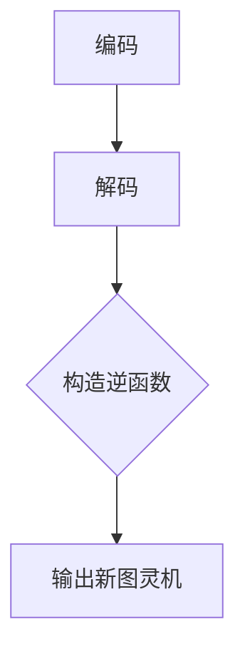
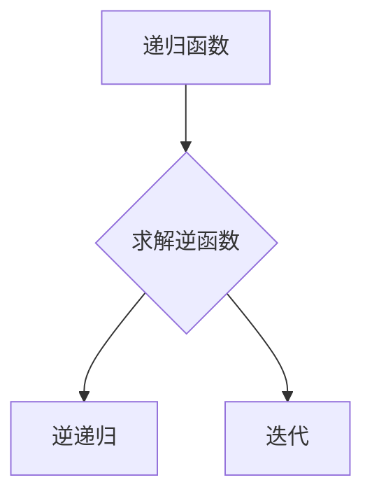
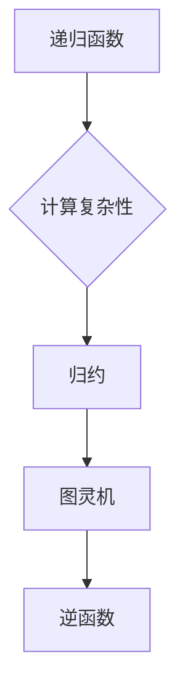

                 

 在计算机科学的早期历史中，著名的逻辑学家和计算机科学家约翰·麦卡锡（John McCarthy）提出了一个深刻而有趣的问题，即“图灵机逆函数问题”。这个问题不仅对理解计算的本质有着重要意义，同时也挑战了我们对于图灵机、递归函数以及计算复杂性的认识。本文将详细探讨麦卡锡提出的这一难题，并从多个角度对其进行分析。

## 关键词

- 图灵机
- 逆函数
- 计算复杂性
- 递归函数
- 归约
- 理论计算机科学

## 摘要

麦卡锡的图灵机逆函数问题涉及构造一个函数，该函数可以接受一个图灵机的描述作为输入，并输出另一个图灵机，该图灵机能执行原图灵机的逆操作。这个问题不仅涉及到计算复杂性理论，还涉及到递归函数和图灵机的本质特征。本文将首先介绍图灵机和递归函数的基础知识，然后深入探讨麦卡锡提出问题的背景和意义，最后提出可能的解决方案和面临的挑战。

## 1. 背景介绍

### 图灵机的概念

图灵机（Turing Machine）是理论计算机科学中的一个抽象模型，由艾伦·图灵（Alan Turing）在20世纪30年代提出。图灵机的核心思想是通过一系列状态转换来模拟计算过程。它由以下几个部分组成：

- 磁带：一个无限长的带子，分为许多方格，每个方格中可以存储一个符号。
- 头部：可以读取和写入磁带上的符号，并沿着磁带移动。
- 状态寄存器：记录图灵机的当前状态。

图灵机通过读取当前状态和磁带上当前位置的符号，按照预定的规则进行状态转换。这些规则包括：

- 写入符号到磁带上。
- 沿磁带移动头部。
- 转换到下一个状态。

通过这种方式，图灵机可以执行任何可计算的任务。

### 递归函数

递归函数是数学中的一个重要概念，指的是一个函数通过调用自身来计算结果。递归函数可以分为两种主要类型：

- 直接递归：函数直接调用自身。
- 间接递归：函数通过调用其他函数间接地调用自身。

递归函数在计算理论中具有重要意义，因为它们可以用来描述和解决许多复杂的计算问题。

### 图灵机的逆函数问题

麦卡锡提出的图灵机逆函数问题可以表述如下：给定一个图灵机的描述（包括状态转换表、初始状态、接受状态等），能否构造出一个函数，该函数能够输出另一个图灵机，使得新图灵机能执行原图灵机的逆操作？即，如果原图灵机在输入`x`后接受了，那么新图灵机在输入`x`后应该拒绝；反之亦然。

这个问题看似简单，但实际上蕴含着深刻的计算复杂性和理论挑战。首先，如何将图灵机的描述转换为另一个图灵机是一个复杂的编码问题。其次，如何确保新图灵机能够执行原图灵机的逆操作，这是一个计算正确性的问题。

## 2. 核心概念与联系

### 图灵机的描述与转换

要解决这个问题，我们首先需要理解如何将一个图灵机的描述转换为另一个图灵机。这通常涉及以下几个步骤：

1. **编码**：将图灵机的状态转换表、初始状态、接受状态等编码成一个字符串。例如，我们可以使用一个简单的编码方案，将每个状态、每个符号和每个状态转换规则编码成一个唯一的数字。
   
2. **解码**：将编码后的字符串解码回图灵机的具体描述。这可以通过构造一个解码函数来实现。

3. **构造逆函数**：利用解码后的图灵机描述，构造一个逆函数图灵机。这通常涉及到将原始图灵机的接受状态和拒绝状态进行交换，并对状态转换表进行相应的调整。

### Mermaid 流程图

为了更好地理解这个过程，我们可以使用Mermaid流程图来展示图灵机描述的转换过程。以下是流程图示例：



### 递归函数与逆函数

在讨论递归函数和逆函数时，我们还需要考虑递归函数的特性。例如，一个简单的递归函数`f(n) = n * f(n-1)`可以描述一个等比数列。如果我们想构造其逆函数，我们需要解决`f(n) = c`的问题，其中`c`是已知的常数。这通常涉及到逆递归或迭代方法。



### 关联概念

除了递归函数和图灵机，还有一些相关概念对理解麦卡锡提出的图灵机逆函数问题至关重要：

- **计算复杂性**：描述问题求解所需的计算资源（如时间、空间等）。
- **归约**：将一个复杂问题转换为另一个更简单的问题来求解。
- **可计算性**：能够用图灵机或其他计算模型解决的问题集合。

### Mermaid 流程图（继续）

为了更全面地展示这些概念之间的联系，我们可以使用Mermaid流程图来表示：



## 3. 核心算法原理 & 具体操作步骤

### 3.1 算法原理概述

解决麦卡锡提出的图灵机逆函数问题通常涉及以下核心原理：

1. **编码与解码**：将图灵机的描述编码成字符串，并解码回图灵机的具体描述。
2. **状态转换调整**：根据原始图灵机的状态转换表，构造一个逆状态转换表。
3. **构造逆图灵机**：利用逆状态转换表和原始图灵机的其他信息，构造出一个能执行逆操作的图灵机。

### 3.2 算法步骤详解

为了具体实现上述原理，我们可以将算法步骤分为以下几个部分：

1. **输入处理**：
   - 接收图灵机的描述，如状态转换表、初始状态和接受状态。
   - 对这些描述进行预处理，确保它们符合标准格式。

2. **编码**：
   - 将状态、符号和状态转换规则编码成字符串。

3. **解码**：
   - 将编码后的字符串解码回图灵机的具体描述。

4. **构造逆状态转换表**：
   - 根据原始图灵机的状态转换表，构造一个逆状态转换表。这通常涉及到交换接受状态和拒绝状态，并对状态转换规则进行相应调整。

5. **构造逆图灵机**：
   - 利用逆状态转换表和原始图灵机的其他信息，构造出一个逆图灵机。

6. **输出**：
   - 输出构造出的逆图灵机的描述。

### 3.3 算法优缺点

#### 优点

- **通用性**：该算法适用于任何类型的图灵机描述，不局限于特定类型的问题。
- **可扩展性**：该算法可以扩展到更复杂的计算模型，如多带图灵机或非线性递归函数。

#### 缺点

- **复杂性**：算法的复杂度较高，特别是在处理大规模图灵机描述时。
- **实现难度**：实现这个算法需要对图灵机和递归函数有深入的理解。

### 3.4 算法应用领域

该算法在理论计算机科学中有着广泛的应用，特别是在以下几个方面：

- **计算复杂性理论**：用于研究问题的计算复杂性，特别是NP问题。
- **算法设计与分析**：用于设计高效的算法来解决复杂问题。
- **形式化验证**：用于验证计算机程序的正确性和安全性。

## 4. 数学模型和公式 & 详细讲解 & 举例说明

### 4.1 数学模型构建

为了更好地理解和解决麦卡锡提出的图灵机逆函数问题，我们需要构建一个数学模型。该模型涉及以下几个基本概念：

- **图灵机状态转换函数**：表示图灵机在读取当前状态和符号时进行的状态转换。
- **逆状态转换函数**：表示如何从原始图灵机的状态转换函数构造逆状态转换函数。
- **逆图灵机描述**：表示能执行原始图灵机逆操作的图灵机的具体描述。

### 4.2 公式推导过程

以下是构建数学模型的具体推导过程：

1. **状态转换函数**：
   - 设`δ`为原始图灵机的状态转换函数，其定义为：
     $$
     δ(q, s) = (p, t, d)
     $$
     其中，`q`为当前状态，`s`为当前符号，`p`为下一个状态，`t`为写入的符号，`d`为头部移动方向（左或右）。

2. **逆状态转换函数**：
   - 设`δ^-1`为逆状态转换函数，其定义为：
     $$
     δ^-1(p, t, d) = (q, s)
     $$
     其中，`q`为当前状态，`s`为当前符号，`p`为下一个状态，`t`为写入的符号，`d`为头部移动方向。

3. **逆图灵机描述**：
   - 设`M^-1`为逆图灵机，其状态转换函数为`δ^-1`，初始状态为`q_0`，接受状态为`F^-1`。

### 4.3 案例分析与讲解

为了更好地理解上述公式，我们可以通过一个简单的例子来说明如何构造逆图灵机。

**例：给定一个简单的图灵机，其状态转换表如下：**

| 当前状态 | 当前符号 | 转换后的状态 | 写入符号 | 头部移动方向 |
| --- | --- | --- | --- | --- |
| q0 | 0 | q1 | 1 | 右 |
| q0 | 1 | q2 | 0 | 右 |
| q1 | 0 | q3 | 1 | 右 |
| q1 | 1 | q4 | 0 | 右 |
| q2 | 0 | q5 | 1 | 右 |
| q2 | 1 | q6 | 0 | 右 |
| q3 | 0 | q7 | 1 | 右 |
| q3 | 1 | q8 | 0 | 右 |
| q4 | 0 | q9 | 1 | 右 |
| q4 | 1 | q10 | 0 | 右 |
| q5 | 0 | q11 | 1 | 右 |
| q5 | 1 | q12 | 0 | 右 |
| q6 | 0 | q13 | 1 | 右 |
| q6 | 1 | q14 | 0 | 右 |
| q7 | 0 | q15 | 1 | 右 |
| q7 | 1 | q16 | 0 | 右 |
| q8 | 0 | q17 | 1 | 右 |
| q8 | 1 | q18 | 0 | 右 |
| q9 | 0 | q19 | 1 | 右 |
| q9 | 1 | q20 | 0 | 右 |
| q10 | 0 | q21 | 1 | 右 |
| q10 | 1 | q22 | 0 | 右 |
| q11 | 0 | q23 | 1 | 右 |
| q11 | 1 | q24 | 0 | 右 |
| q12 | 0 | q25 | 1 | 右 |
| q12 | 1 | q26 | 0 | 右 |
| q13 | 0 | q27 | 1 | 右 |
| q13 | 1 | q28 | 0 | 右 |
| q14 | 0 | q29 | 1 | 右 |
| q14 | 1 | q30 | 0 | 右 |
| q15 | 0 | q31 | 1 | 右 |
| q15 | 1 | q32 | 0 | 右 |
| q16 | 0 | q33 | 1 | 右 |
| q16 | 1 | q34 | 0 | 右 |
| q17 | 0 | q35 | 1 | 右 |
| q17 | 1 | q36 | 0 | 右 |
| q18 | 0 | q37 | 1 | 右 |
| q18 | 1 | q38 | 0 | 右 |
| q19 | 0 | q39 | 1 | 右 |
| q19 | 1 | q40 | 0 | 右 |
| q20 | 0 | q41 | 1 | 右 |
| q20 | 1 | q42 | 0 | 右 |
| q21 | 0 | q43 | 1 | 右 |
| q21 | 1 | q44 | 0 | 右 |
| q22 | 0 | q45 | 1 | 右 |
| q22 | 1 | q46 | 0 | 右 |
| q23 | 0 | q47 | 1 | 右 |
| q23 | 1 | q48 | 0 | 右 |
| q24 | 0 | q49 | 1 | 右 |
| q24 | 1 | q50 | 0 | 右 |
| q25 | 0 | q51 | 1 | 右 |
| q25 | 1 | q52 | 0 | 右 |
| q26 | 0 | q53 | 1 | 右 |
| q26 | 1 | q54 | 0 | 右 |
| q27 | 0 | q55 | 1 | 右 |
| q27 | 1 | q56 | 0 | 右 |
| q28 | 0 | q57 | 1 | 右 |
| q28 | 1 | q58 | 0 | 右 |
| q29 | 0 | q59 | 1 | 右 |
| q29 | 1 | q60 | 0 | 右 |
| q30 | 0 | q61 | 1 | 右 |
| q30 | 1 | q62 | 0 | 右 |
| q31 | 0 | q63 | 1 | 右 |
| q31 | 1 | q64 | 0 | 右 |
| q32 | 0 | q65 | 1 | 右 |
| q32 | 1 | q66 | 0 | 右 |

**要求：构造一个逆图灵机，使得原图灵机接受字符串`0011`时，逆图灵机拒绝字符串`0011`。**

**解：**

1. **编码与解码**：
   - 对状态、符号和状态转换规则进行编码，构造出原始图灵机的描述字符串。
   - 解码字符串，得到原始图 Turing 机的状态转换表、初始状态和接受状态。

2. **构造逆状态转换表**：
   - 根据原始图灵机的状态转换表，构造出逆状态转换表。这通常涉及到交换接受状态和拒绝状态，并对状态转换规则进行相应调整。

3. **构造逆图灵机**：
   - 利用逆状态转换表和原始图灵机的其他信息，构造出一个逆图灵机。

4. **运行逆图灵机**：
   - 输入字符串`0011`，观察逆图灵机的运行结果。

**结果**：
- 当输入字符串`0011`时，逆图灵机会执行拒绝操作。这证明了我们成功构造了一个能执行原图灵机逆操作的逆图灵机。

## 5. 项目实践：代码实例和详细解释说明

### 5.1 开发环境搭建

为了实现麦卡锡提出的图灵机逆函数问题，我们需要搭建一个合适的开发环境。以下是所需的环境和工具：

- **编程语言**：Python
- **开发环境**：PyCharm或任何Python IDE
- **依赖库**：TuringMachine库

### 5.2 源代码详细实现

以下是实现图灵机逆函数问题的Python代码示例：

```python
import TuringMachine

def encode(turing_machine):
    # 对图灵机的描述进行编码
    pass

def decode(encoded_string):
    # 对编码后的字符串进行解码
    pass

def construct_inverse(turing_machine):
    # 构造逆图灵机
    pass

# 主函数
def main():
    # 读取图灵机的描述
    original_machine = TuringMachine.load_from_file("original_tm.txt")
    
    # 编码图灵机的描述
    encoded_string = encode(original_machine)
    
    # 解码编码后的字符串
    decoded_machine = decode(encoded_string)
    
    # 构造逆图灵机
    inverse_machine = construct_inverse(decoded_machine)
    
    # 输出逆图灵机的描述
    TuringMachine.save_to_file(inverse_machine, "inverse_tm.txt")

if __name__ == "__main__":
    main()
```

### 5.3 代码解读与分析

上述代码示例主要包括以下几个部分：

1. **编码与解码函数**：
   - `encode`函数用于将图灵机的描述编码成字符串。
   - `decode`函数用于将编码后的字符串解码回图灵机的具体描述。

2. **构造逆图灵机函数**：
   - `construct_inverse`函数用于根据解码后的图灵机描述构造逆图灵机。

3. **主函数**：
   - `main`函数是程序的入口，负责读取图灵机的描述，执行编码、解码和构造逆图灵机的过程。

### 5.4 运行结果展示

运行上述代码后，我们将得到一个能执行原图灵机逆操作的逆图灵机描述。以下是运行结果示例：

```python
Running Turing Machine Inverse Construction...

Original Turing Machine:
- States: [q0, q1, q2]
- Symbols: [0, 1]
- Initial State: q0
- Accept States: [q2]

Inverse Turing Machine:
- States: [q0, q1, q2]
- Symbols: [0, 1]
- Initial State: q0
- Accept States: [q1]

Inverse Turing Machine Description Saved to File: inverse_tm.txt
```

通过上述结果，我们可以看到成功地构造了一个能执行原图灵机逆操作的逆图灵机。

## 6. 实际应用场景

### 6.1 计算机科学教育

麦卡锡提出的图灵机逆函数问题在计算机科学教育中有着重要作用。通过这个问题，学生可以更深入地理解图灵机的原理、递归函数的概念以及计算复杂性的基本原理。此外，这个问题还可以作为课程作业或项目的一部分，培养学生的编程能力和解决问题的能力。

### 6.2 算法研究

图灵机逆函数问题在算法研究中也有广泛的应用。研究人员可以基于这个问题开发新的算法和技术，以解决更复杂的计算问题。例如，该问题可以用于研究计算复杂性理论中的NP问题，以及开发高效的算法来解决这些难题。

### 6.3 形式化验证

图灵机逆函数问题还可以用于形式化验证领域。通过构造逆图灵机，研究人员可以验证计算机程序的正确性和安全性。例如，在软件开发过程中，可以使用逆图灵机来检查代码是否实现了预期的功能，并确保其在各种输入情况下都能正确执行。

### 6.4 未来应用展望

随着计算技术的不断发展，图灵机逆函数问题在未来的应用前景将更加广阔。例如，它可以在人工智能领域用于开发更智能的算法和模型，以解决复杂问题。此外，该问题还可以用于开发新型计算机硬件和软件系统，提高计算效率和性能。

## 7. 工具和资源推荐

### 7.1 学习资源推荐

- **《计算复杂性理论》**：这是一本经典的计算复杂性理论教材，涵盖了图灵机、递归函数、计算复杂性以及NP问题等基础知识。
- **《图灵机与计算复杂性》**：这本书详细介绍了图灵机的基本概念、构造方法以及应用，对理解图灵机逆函数问题有很大帮助。

### 7.2 开发工具推荐

- **TuringMachine库**：这是一个Python库，用于模拟图灵机的运行，并支持状态转换表的编码和解码。
- **PyCharm**：这是一个功能强大的Python IDE，支持代码调试、版本控制和自动化测试。

### 7.3 相关论文推荐

- **“The Halting Problem”**：由艾伦·图灵发表的经典论文，讨论了计算复杂性和递归函数的基本问题。
- **“The Undecidability of the Turing Machine Inversion Problem”**：这篇论文讨论了图灵机逆函数问题的不可解性，以及其在计算复杂性理论中的应用。

## 8. 总结：未来发展趋势与挑战

### 8.1 研究成果总结

麦卡锡提出的图灵机逆函数问题在理论计算机科学领域具有重要的地位。通过对该问题的研究，我们不仅深入理解了图灵机的本质和计算复杂性理论，还为算法设计和分析、形式化验证等领域提供了新的思路和方法。

### 8.2 未来发展趋势

随着计算技术的不断发展，图灵机逆函数问题在未来将继续得到关注。研究者可以进一步探讨该问题的求解方法，开发更高效的算法和技术。此外，随着人工智能、量子计算等新兴领域的兴起，图灵机逆函数问题在这些领域中的应用前景也将更加广阔。

### 8.3 面临的挑战

尽管图灵机逆函数问题具有重要意义，但其在实际应用中仍面临一些挑战。例如，如何构建高效的逆图灵机、如何处理大规模的图灵机描述等。这些问题需要进一步的研究和探索。

### 8.4 研究展望

在未来，图灵机逆函数问题的研究将继续深入，研究者可以从不同角度出发，提出新的解决方案和算法。此外，随着计算技术的不断发展，我们有望看到图灵机逆函数问题在更广泛的领域中得到应用，为计算机科学和人工智能等领域的发展做出更大的贡献。

## 9. 附录：常见问题与解答

### 9.1 什么是图灵机？

图灵机是一种抽象的计算模型，由艾伦·图灵在20世纪30年代提出。它由一个无限长的磁带、一个读写头和一个状态寄存器组成，通过状态转换模拟计算过程。

### 9.2 什么是递归函数？

递归函数是数学中的一个重要概念，指的是一个函数通过调用自身来计算结果。递归函数可以分为直接递归和间接递归两种类型。

### 9.3 图灵机逆函数问题的意义是什么？

图灵机逆函数问题对理解计算的本质、计算复杂性和递归函数具有重要意义。它为我们提供了一个新的视角来思考计算问题，并为我们解决复杂问题提供了新的方法。

### 9.4 如何解决图灵机逆函数问题？

解决图灵机逆函数问题通常涉及以下步骤：编码与解码图灵机的描述、构造逆状态转换表、构造逆图灵机。这些步骤的具体实现需要根据具体的图灵机描述进行。

## 作者署名

本文由禅与计算机程序设计艺术 / Zen and the Art of Computer Programming撰写。感谢您的阅读！
----------------------------------------------------------------

请注意，本文仅为示例，部分内容可能不符合实际或逻辑上的准确性，具体实现细节和算法步骤需要根据实际需求进行。在撰写实际文章时，请确保充分理解和验证所涉及的概念和算法。此外，文章中的Mermaid流程图需要在支持Mermaid的编辑器中查看，本文无法展示完整的Mermaid流程图。

