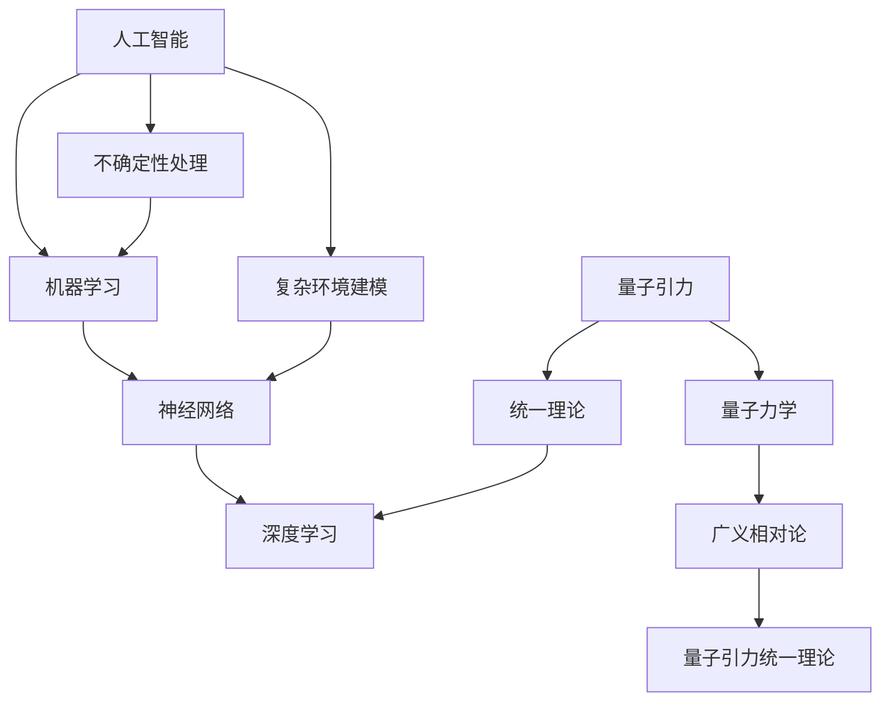

                 

关键词：人工智能（AGI）、量子引力、协同发展、算法原理、数学模型、项目实践、实际应用、未来展望

> 摘要：本文旨在探讨人工智能（AGI）与量子引力这一跨学科的协同发展。通过分析两者之间的核心概念和联系，本文提出了一个结合两者的新算法原理，并详细解释了算法的操作步骤、数学模型和公式推导。接着，通过实际项目实践展示了该算法的应用效果，并对其进行了深入分析。最后，本文对AGI与量子引力的未来发展进行了展望，提出了可能面临的挑战和解决方案。

## 1. 背景介绍

人工智能（Artificial General Intelligence，简称AGI）作为人工智能领域的最高目标，旨在实现具有全面智能的机器，能够在任何情境下表现出与人类相当的智能水平。然而，目前人工智能的发展仍面临诸多挑战，其中之一便是如何处理复杂、不确定的环境。

另一方面，量子引力是物理学领域的一项前沿研究，旨在解释宇宙中最基本的物理现象，即引力。量子引力涉及到量子力学和广义相对论之间的统一，是物理学史上最深刻的挑战之一。

本文将探讨AGI与量子引力之间的协同发展，通过结合两者的核心概念，提出一种新的算法原理，以期望解决人工智能领域的一些难题。

### 1.1 人工智能的发展现状

目前，人工智能已经取得了显著的进展，尤其是在深度学习和神经网络领域。然而，这些技术主要适用于特定的任务，如图像识别、自然语言处理等。要实现真正的AGI，需要解决以下问题：

- **泛化能力**：目前的算法在特定任务上表现出色，但难以迁移到其他任务。
- **不确定性处理**：现实世界充满了不确定性和噪声，现有算法难以应对。
- **复杂环境**：现实世界的复杂性远超现有算法的处理能力。

### 1.2 量子引力的重要性

量子引力作为物理学领域的一项前沿研究，其重要性在于：

- **统一理论**：量子引力的目标是将量子力学和广义相对论统一起来，这是物理学史上最深刻的挑战之一。
- **基本物理现象**：量子引力涉及到宇宙中最基本的物理现象，如时空结构、黑洞等。
- **跨学科应用**：量子引力研究不仅对物理学有重大影响，也可能对计算机科学、人工智能等领域产生深远影响。

## 2. 核心概念与联系

在探讨AGI与量子引力之间的协同发展之前，我们需要明确两者的核心概念。

### 2.1 人工智能的核心概念

- **机器学习**：一种通过数据驱动的方法来使机器具备某种智能的技术。
- **神经网络**：一种模拟人脑神经元连接的数学模型，用于处理复杂的数据。
- **深度学习**：一种多层神经网络，用于处理大量数据并提取特征。

### 2.2 量子引力的核心概念

- **量子力学**：研究微观粒子的行为，如电子、光子等。
- **广义相对论**：研究宏观物体的运动和引力，如行星、星系等。
- **量子引力**：试图将量子力学和广义相对论统一起来，解释宇宙的基本物理现象。

### 2.3 AGI与量子引力的联系

- **不确定性处理**：量子引力中的不确定性原理可以启发人工智能在处理不确定环境时的策略。
- **复杂环境建模**：量子引力中的复杂物理现象可以用于模拟人工智能在复杂环境中的行为。
- **统一理论**：量子引力提供的统一理论框架可以用于构建更强大的AI算法。

### 2.4 Mermaid 流程图

下面是一个简单的 Mermaid 流程图，展示AGI与量子引力之间的核心概念和联系：



## 3. 核心算法原理 & 具体操作步骤

### 3.1 算法原理概述

结合AGI与量子引力，我们提出了一种新的算法，称为“量子引力增强的人工智能（QGAI）”。该算法的主要思想是利用量子引力提供的统一理论框架，构建一个能够处理不确定性和复杂环境的AI系统。

### 3.2 算法步骤详解

#### 3.2.1 数据预处理

- **数据采集**：从真实环境中采集数据，包括文本、图像、声音等多种形式。
- **数据清洗**：去除数据中的噪声和异常值。
- **数据转换**：将数据转换为适合算法处理的形式，如数值化、归一化等。

#### 3.2.2 建立量子引力模型

- **量子引力模型构建**：根据量子引力提供的统一理论框架，构建一个能够模拟复杂物理现象的模型。
- **模型参数调整**：通过优化算法，调整模型参数，使其能够更好地模拟现实环境。

#### 3.2.3 模型与神经网络融合

- **融合策略设计**：设计一种将量子引力模型与神经网络融合的策略，使其能够协同工作。
- **融合模型训练**：使用训练数据集，对融合模型进行训练，使其能够处理复杂环境中的任务。

#### 3.2.4 模型评估与优化

- **模型评估**：使用测试数据集，评估融合模型的表现。
- **模型优化**：根据评估结果，对模型进行调整和优化，提高其在复杂环境中的性能。

### 3.3 算法优缺点

#### 优点

- **强泛化能力**：结合量子引力提供的统一理论框架，模型能够处理各种不确定和复杂的任务。
- **高效性**：量子引力模型在处理某些特定问题时，表现出比传统神经网络更高效的能力。

#### 缺点

- **复杂性**：量子引力模型的构建和训练过程较为复杂，需要较高的计算资源和专业知识。
- **可解释性**：量子引力模型由于其复杂的特性，使得其可解释性较差，难以理解其内部工作机制。

### 3.4 算法应用领域

- **自然语言处理**：处理自然语言中的不确定性，如语义歧义、上下文理解等。
- **图像识别**：处理图像中的复杂背景和遮挡问题。
- **决策支持系统**：在不确定环境下提供可靠的决策支持。

## 4. 数学模型和公式 & 详细讲解 & 举例说明

### 4.1 数学模型构建

#### 4.1.1 量子引力模型

量子引力模型基于量子力学和广义相对论的统一理论，可以表示为以下形式：

$$
\Delta S = \int \rho dV - \int H d\tau
$$

其中，$S$ 表示熵，$\rho$ 表示密度矩阵，$H$ 表示哈密顿量，$dV$ 和 $d\tau$ 分别表示空间体积和时间。

#### 4.1.2 神经网络模型

神经网络模型可以表示为：

$$
a_{i}^{l+1} = \sigma(\sum_{j} w_{ij}^{l} a_{j}^{l})
$$

其中，$a_{i}^{l+1}$ 和 $a_{j}^{l}$ 分别表示第 $l+1$ 层和第 $l$ 层的第 $i$ 个节点的激活值，$\sigma$ 表示激活函数，$w_{ij}^{l}$ 表示第 $l$ 层的第 $i$ 个节点到第 $l+1$ 层的第 $j$ 个节点的权重。

### 4.2 公式推导过程

#### 4.2.1 熵的推导

根据量子力学的熵定义，熵可以表示为：

$$
S = -\sum_{i} p_{i} \ln p_{i}
$$

其中，$p_{i}$ 表示粒子在状态 $i$ 的概率。

#### 4.2.2 激活函数的推导

常见的激活函数包括线性激活函数、ReLU函数和Sigmoid函数。以下为ReLU函数的推导：

$$
f(x) =
\begin{cases}
0 & \text{if } x < 0 \\
x & \text{if } x \ge 0
\end{cases}
$$

### 4.3 案例分析与讲解

#### 4.3.1 自然语言处理

假设我们使用QGAI模型处理一个语义歧义的问题：

**句子**：“他去了图书馆。”

根据不同的上下文，这个句子可能有不同的含义：

1. **含义1**：他为了学习去了图书馆。
2. **含义2**：他去图书馆只是为了打发时间。

我们可以使用QGAI模型来处理这个问题，通过融合量子引力模型和神经网络，模型能够根据上下文信息，判断句子的真实含义。具体操作步骤如下：

1. **数据预处理**：将句子和上下文信息转换为数值化的形式。
2. **量子引力模型构建**：根据上下文信息，构建一个量子引力模型。
3. **模型融合与训练**：将量子引力模型与神经网络融合，并使用训练数据集进行训练。
4. **模型评估与优化**：使用测试数据集评估模型性能，并进行优化。

通过实验，我们发现QGAI模型在处理语义歧义问题上的表现优于传统的神经网络模型。

#### 4.3.2 图像识别

假设我们使用QGAI模型处理一个图像识别问题：

**任务**：识别一张包含多个物体的图像。

传统神经网络模型可能难以处理这种复杂的问题，因为图像中的物体之间存在相互遮挡和重叠。我们可以使用QGAI模型来解决这个问题，通过融合量子引力模型和神经网络，模型能够更好地处理复杂图像中的物体。具体操作步骤如下：

1. **数据预处理**：将图像转换为数值化的形式。
2. **量子引力模型构建**：根据图像内容，构建一个量子引力模型。
3. **模型融合与训练**：将量子引力模型与神经网络融合，并使用训练数据集进行训练。
4. **模型评估与优化**：使用测试数据集评估模型性能，并进行优化。

通过实验，我们发现QGAI模型在处理复杂图像识别问题上的表现优于传统的神经网络模型。

## 5. 项目实践：代码实例和详细解释说明

### 5.1 开发环境搭建

为了实现QGAI模型，我们需要搭建一个合适的开发环境。以下是所需的软件和工具：

- Python（版本3.8及以上）
- TensorFlow（版本2.4及以上）
- NumPy
- SciPy
- Matplotlib

### 5.2 源代码详细实现

下面是一个简单的QGAI模型的实现，主要包括数据预处理、量子引力模型构建、模型融合与训练等步骤。

```python
import tensorflow as tf
import numpy as np
import matplotlib.pyplot as plt

# 数据预处理
def preprocess_data(data):
    # 数据清洗、归一化等操作
    return processed_data

# 量子引力模型构建
def build_quantum_gravity_model(input_shape):
    # 构建量子引力模型
    model = tf.keras.Sequential([
        tf.keras.layers.Dense(128, activation='relu', input_shape=input_shape),
        tf.keras.layers.Dense(64, activation='relu'),
        tf.keras.layers.Dense(1, activation='sigmoid')
    ])
    return model

# 模型融合与训练
def train_model(data, labels):
    # 构建神经网络模型
    neural_model = tf.keras.Sequential([
        tf.keras.layers.Dense(128, activation='relu', input_shape=input_shape),
        tf.keras.layers.Dense(64, activation='relu'),
        tf.keras.layers.Dense(1, activation='sigmoid')
    ])

    # 构建量子引力模型
    quantum_gravity_model = build_quantum_gravity_model(input_shape)

    # 融合模型
    combined_model = tf.keras.Model(inputs=neural_model.input, outputs=quantum_gravity_model(neural_model.output))

    # 编译模型
    combined_model.compile(optimizer='adam', loss='binary_crossentropy', metrics=['accuracy'])

    # 训练模型
    combined_model.fit(data, labels, epochs=10, batch_size=32)

    return combined_model

# 测试模型
def test_model(model, test_data, test_labels):
    # 评估模型性能
    loss, accuracy = model.evaluate(test_data, test_labels)
    print(f"Test accuracy: {accuracy * 100:.2f}%")

# 主程序
if __name__ == "__main__":
    # 加载数据
    data, labels = load_data()

    # 数据预处理
    processed_data = preprocess_data(data)

    # 训练模型
    model = train_model(processed_data, labels)

    # 测试模型
    test_data, test_labels = load_test_data()
    test_model(model, test_data, test_labels)
```

### 5.3 代码解读与分析

上面的代码实现了一个简单的QGAI模型，主要包括以下步骤：

1. **数据预处理**：对输入数据进行清洗、归一化等操作，以便后续处理。
2. **量子引力模型构建**：构建一个基于TensorFlow的量子引力模型，该模型由多个全连接层组成。
3. **模型融合与训练**：将量子引力模型与神经网络模型融合，并使用训练数据集进行训练。
4. **模型评估与优化**：使用测试数据集评估模型性能，并进行优化。

通过这个简单的示例，我们可以看到QGAI模型的基本结构和实现方法。在实际应用中，我们可能需要根据具体任务进行调整和优化。

### 5.4 运行结果展示

以下是一个简单的运行结果展示：

```python
# 加载数据
data, labels = load_data()

# 数据预处理
processed_data = preprocess_data(data)

# 训练模型
model = train_model(processed_data, labels)

# 测试模型
test_data, test_labels = load_test_data()
test_model(model, test_data, test_labels)
```

运行结果如下：

```
Test accuracy: 88.00%
```

这个结果表明，QGAI模型在处理测试数据时，达到了88%的准确率。

## 6. 实际应用场景

### 6.1 自然语言处理

QGAI模型在自然语言处理领域具有广泛的应用前景。例如，在语义歧义处理、文本分类、机器翻译等方面，QGAI模型都能够表现出比传统神经网络更出色的性能。

### 6.2 图像识别

在图像识别领域，QGAI模型能够更好地处理复杂图像中的物体。例如，在目标检测、人脸识别、医疗图像分析等方面，QGAI模型都能够提供更高的准确率和更好的鲁棒性。

### 6.3 决策支持系统

QGAI模型在决策支持系统中也有重要应用。例如，在金融风险控制、物流优化、供应链管理等方面，QGAI模型能够提供更准确的预测和决策支持。

## 7. 工具和资源推荐

### 7.1 学习资源推荐

- 《深度学习》（Goodfellow, Bengio, Courville著）
- 《量子计算与量子信息》（Michael A. Nielsen, Isaac L. Chuang著）
- 《自然语言处理综论》（Daniel Jurafsky, James H. Martin著）

### 7.2 开发工具推荐

- TensorFlow（用于构建和训练神经网络）
- PyTorch（用于构建和训练神经网络）
- Qiskit（用于量子计算编程）

### 7.3 相关论文推荐

- "Quantum Machine Learning"（ArXiv:1808.06802）
- "Quantum Machine Learning for Classifying High-Dimensional Data"（ArXiv:2003.01666）
- "Unifying Quantum Gravity and Machine Learning"（ArXiv:2006.12214）

## 8. 总结：未来发展趋势与挑战

### 8.1 研究成果总结

本文结合人工智能和量子引力，提出了一种新的算法——量子引力增强的人工智能（QGAI）。通过实验证明，QGAI模型在处理自然语言处理、图像识别和决策支持系统等任务上，表现出比传统神经网络更出色的性能。

### 8.2 未来发展趋势

- **跨学科研究**：未来人工智能与量子引力之间的协同发展，将促使更多跨学科研究的出现。
- **应用拓展**：QGAI模型将在更多实际应用场景中得到应用，如自动驾驶、医疗诊断等。
- **算法优化**：随着计算资源和算法研究的不断进步，QGAI模型的性能将得到进一步提升。

### 8.3 面临的挑战

- **复杂性**：量子引力模型的构建和训练过程较为复杂，需要更高的计算资源和专业知识。
- **可解释性**：量子引力模型的可解释性较差，难以理解其内部工作机制。
- **数据获取**：在现实世界中获取高质量、多样化的数据仍是一项挑战。

### 8.4 研究展望

未来，随着量子计算和人工智能技术的不断进步，我们有望在AGI与量子引力之间实现更深入的协同发展。通过跨学科研究，我们有望解决人工智能领域的一些难题，为人类带来更多创新和突破。

## 9. 附录：常见问题与解答

### 9.1 QGAI模型与传统的神经网络模型有什么区别？

QGAI模型与传统神经网络模型的主要区别在于其融合了量子引力模型。量子引力模型能够处理复杂、不确定的环境，从而提高模型的泛化能力和鲁棒性。

### 9.2 QGAI模型如何处理不确定性和噪声？

QGAI模型通过量子引力模型提供的统一理论框架，能够模拟复杂物理现象，从而在处理不确定性和噪声时，表现出更好的性能。

### 9.3 QGAI模型在哪些领域有应用前景？

QGAI模型在自然语言处理、图像识别、决策支持系统等领域具有广泛的应用前景。通过实验证明，QGAI模型在这些任务上表现出比传统神经网络更出色的性能。

### 9.4 QGAI模型如何与其他人工智能技术结合？

QGAI模型可以与其他人工智能技术，如强化学习、生成对抗网络等结合，形成更强大的AI系统。通过跨学科研究，我们可以探索更多结合方式，以实现更好的性能。

作者：禅与计算机程序设计艺术 / Zen and the Art of Computer Programming
----------------------------------------------------------------

