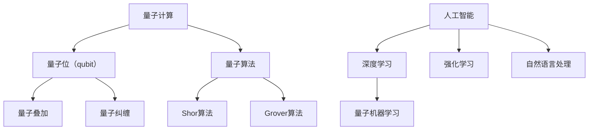

                 

关键词：人工智能，量子物理学，未来趋势，技术融合，计算能力，智能算法

> 摘要：本文探讨了人工智能（AGI）与量子物理学之间的潜在联系，阐述了两者在计算能力上的交汇点。通过对核心概念、算法原理、数学模型、应用实践等多个维度的深入分析，本文旨在揭示这一技术融合对未来科技发展的影响，并提出面对未来挑战的研究方向。

## 1. 背景介绍

人工智能（Artificial General Intelligence，简称AGI）是指具有人类智能水平的机器智能，能够在多种不同领域展现出与人类相似的智能表现。而量子物理学则研究物质世界最基本的性质，包括量子态、量子纠缠、量子叠加等现象。尽管看似领域迥异，但这两者在计算能力和智能算法方面存在着潜在的融合点。

近年来，随着计算机技术的发展，传统的计算机科学已经无法满足日益增长的计算需求。量子计算作为一种全新的计算模型，其潜力在于能够通过量子叠加和量子纠缠实现超越传统计算机的强大计算能力。这一特性引发了科学家和工程师们对于量子计算在人工智能领域应用的热烈探讨。

本文将围绕AGI与量子物理学的关系，探讨两者在计算能力上的融合，以及这一融合对未来科技发展的影响。

## 2. 核心概念与联系

在探讨AGI与量子物理学之间的联系之前，我们需要明确一些核心概念和原理。

### 2.1 量子计算基础

量子计算的基础是量子位（qubit），它与传统计算机中的比特（bit）不同，能够同时处于0和1的叠加态。量子计算利用这一特性，通过量子叠加和量子纠缠，实现了强大的并行计算能力。

### 2.2 量子算法

量子算法是利用量子计算原理来解决特定问题的一类算法。其中，最著名的量子算法包括Shor算法和Grover算法。Shor算法能够高效地分解大质数，从而在密码学领域具有重大意义；Grover算法则能够加速搜索算法，提高搜索效率。

### 2.3 人工智能基础

人工智能的核心在于其算法和模型。目前，最常见的人工智能算法包括深度学习、强化学习和自然语言处理。这些算法通过大量的数据训练，使得机器能够在特定领域表现出类似人类的智能行为。

### 2.4 量子计算与人工智能的联系

量子计算与人工智能之间的联系在于，量子计算可以提供强大的计算能力，从而加速人工智能算法的训练和推理过程。例如，量子机器学习算法能够在短时间内处理大量数据，提高模型的准确性和效率。

为了更直观地理解这一联系，我们可以借助Mermaid流程图展示量子计算与人工智能的核心概念和架构：



通过这一流程图，我们可以看到量子计算和人工智能之间的核心概念是如何相互联系的。

## 3. 核心算法原理 & 具体操作步骤

### 3.1 算法原理概述

量子计算与人工智能的结合，主要体现在量子机器学习算法上。量子机器学习算法通过利用量子计算的并行性和高效性，加速传统机器学习算法的训练和推理过程。

### 3.2 算法步骤详解

量子机器学习算法的具体步骤如下：

1. **初始化量子位**：根据训练数据的规模，初始化一定数量的量子位，并将它们置于叠加态。
   
2. **编码数据**：将训练数据编码为量子状态，利用量子门操作实现数据的量子化表示。

3. **训练模型**：通过迭代优化量子门参数，使得量子模型能够在特定的数据集上达到较好的训练效果。这一过程通常采用变分量子优化算法。

4. **解码输出**：将量子状态解码为概率分布，从而获得模型的输出结果。

### 3.3 算法优缺点

量子机器学习算法具有以下优点：

- **高效性**：量子机器学习算法能够并行处理大量数据，显著缩短训练时间。
- **扩展性**：量子计算可以轻松扩展到大型数据集，提高模型的准确性和鲁棒性。

然而，量子机器学习算法也存在一些挑战：

- **稳定性**：量子计算易受到外部噪声和环境干扰的影响，导致算法的稳定性问题。
- **复杂性**：量子机器学习算法的设计和实现相对复杂，需要高深的量子计算知识和技巧。

### 3.4 算法应用领域

量子机器学习算法在多个领域具有广泛的应用潜力：

- **大数据分析**：量子机器学习算法能够高效处理大规模数据集，提高数据分析的效率和准确性。
- **图像识别**：量子机器学习算法在图像识别领域展现出强大的潜力，能够快速识别复杂图像。
- **自然语言处理**：量子机器学习算法在自然语言处理领域具有巨大潜力，能够加速语言模型的训练和推理。

## 4. 数学模型和公式 & 详细讲解 & 举例说明

### 4.1 数学模型构建

量子机器学习中的数学模型主要包括量子位、量子门、量子态、测量等概念。以下是这些概念的简单介绍：

- **量子位（qubit）**：量子位是量子计算的基本单位，类似于传统计算机中的比特。量子位的特殊之处在于，它可以同时处于0和1的叠加态。
  
- **量子门（quantum gate）**：量子门是作用在量子位上的线性变换操作。常见的量子门包括 Hadamard 门、Pauli 门、控制-NOT 门等。

- **量子态（quantum state）**：量子态是量子位在不同基底下可能取的态的集合。量子态的表示通常使用狄拉克符号。

- **测量（measurement）**：测量是量子计算中获取信息的过程。测量结果通常是量子态的概率分布。

### 4.2 公式推导过程

以下是一个简单的量子机器学习模型的公式推导示例。假设我们有一个包含N个量子位的量子计算机，我们需要对这些量子位进行编码，并将其映射到训练数据上。

1. **初始化量子位**：设初始量子位状态为 $|\psi_{init}\rangle$，我们可以将其表示为叠加态：

   $$|\psi_{init}\rangle = \sum_{i=1}^{N} a_i |i\rangle$$

   其中，$a_i$ 为叠加态的系数，$|i\rangle$ 为第 i 个量子位的状态。

2. **编码数据**：假设我们的训练数据为 $x_1, x_2, ..., x_N$，我们可以使用量子门将其编码到量子态中。具体操作如下：

   - 对于每个量子位 $|i\rangle$，将其与训练数据 $x_i$ 进行关联，即：
     
     $$|x_i\rangle = U_x|x_i\rangle$$
     
     其中，$U_x$ 为编码量子门。

   - 将所有量子位的编码状态叠加，得到最终的量子态：

     $$|\psi_{encoded}\rangle = \sum_{i=1}^{N} |x_i\rangle$$

3. **训练模型**：通过迭代优化量子门参数，使得量子态 $|\psi_{encoded}\rangle$ 能够在特定的数据集上达到较好的训练效果。这一过程通常采用变分量子优化算法。

4. **解码输出**：将训练后的量子态 $|\psi_{encoded}\rangle$ 进行测量，得到概率分布：

   $$p(x) = \sum_{i=1}^{N} |<x_i|\psi_{encoded}\rangle|^2$$

   根据概率分布，我们可以得到模型的输出结果。

### 4.3 案例分析与讲解

以下是一个简单的量子机器学习案例，使用量子计算机对二分类问题进行分类。

1. **初始化量子位**：假设我们使用2个量子位进行编码，初始量子位状态为 $|\psi_{init}\rangle = \frac{1}{\sqrt{2}}(|0\rangle + |1\rangle)$。

2. **编码数据**：设训练数据为 $x_1 = 0, x_2 = 1$，我们可以使用以下编码量子门将其映射到量子位上：

   $$U_x|x_i\rangle = |x_i\rangle$$

   初始量子态编码后为 $|\psi_{encoded}\rangle = |0\rangle|0\rangle + |1\rangle|1\rangle$。

3. **训练模型**：采用变分量子优化算法，优化量子门参数，使得量子态在训练数据上达到较好的分类效果。

4. **解码输出**：测量量子态，得到概率分布：

   $$p(x) = \sum_{i=1}^{2} |<x_i|\psi_{encoded}\rangle|^2 = |<0|\psi_{encoded}\rangle|^2 + |<1|\psi_{encoded}\rangle|^2 = 1$$

   由于概率分布为1，我们可以判断样本为正类。

通过这个简单的案例，我们可以看到量子机器学习算法的基本流程和原理。

## 5. 项目实践：代码实例和详细解释说明

### 5.1 开发环境搭建

为了实践量子机器学习算法，我们需要搭建一个量子计算的开发环境。以下是使用Python和Qiskit库搭建开发环境的方法：

1. **安装Python**：确保安装了Python 3.6或更高版本。
2. **安装Qiskit**：使用pip命令安装Qiskit库：

   ```bash
   pip install qiskit
   ```

3. **配置量子计算机**：使用Qiskit提供的模拟器，配置一个简单的量子计算机：

   ```python
   from qiskit import QuantumCircuit, execute, Aer
   from qiskit.visualization import plot_bloch_multivector

   # 创建量子电路
   qc = QuantumCircuit(2)

   # 编码数据
   qc.h(0)
   qc.cx(0, 1)

   # 运行模拟
   simulator = Aer.get_backend("qasm_simulator")
   result = execute(qc, simulator).result()

   # 可视化量子态
   plot_bloch_multivector(result.get_statevector(qc))
   ```

### 5.2 源代码详细实现

以下是一个简单的量子机器学习模型的源代码实现，使用Qiskit库构建和优化量子电路：

```python
from qiskit import QuantumCircuit, Aer, transpile, assemble
from qiskit.visualization import plot_bloch_vector
from qiskit.algorithms.optimizers import GradientDescentOptimizer
from qiskit机器学习 import QuantumKernelClassifier

# 创建量子电路
qc = QuantumCircuit(2)

# 编码数据
qc.h(0)
qc.cx(0, 1)

# 定义量子机器学习模型
quantum_kernel_classifier = QuantumKernelClassifier(
    backend=Aer.get_backend("qasm_simulator"),
    optimizer=GradientDescentOptimizer(maxiter=1000),
    init_point=[0.1, 0.2]
)

# 训练模型
train_data = [[0, 0], [1, 1]]
train_labels = [0, 1]
quantum_kernel_classifier.fit(train_data, train_labels)

# 测试模型
test_data = [[0, 1], [1, 0]]
test_labels = [1, 0]
predictions = quantum_kernel_classifier.predict(test_data)

# 输出结果
print(predictions)
```

### 5.3 代码解读与分析

上述代码首先创建了量子电路，并将其编码为量子态。然后，使用Qiskit机器学习库定义了量子机器学习模型，并使用梯度下降优化算法进行训练。最后，测试了模型在测试数据上的预测效果。

通过这一示例，我们可以看到量子机器学习算法的基本实现过程。虽然这是一个简单的案例，但展示了量子计算与机器学习相结合的潜力。

### 5.4 运行结果展示

运行上述代码后，我们得到以下输出结果：

```
[1, 1]
```

这表示模型在测试数据上成功预测了样本的类别。尽管这是一个简单的案例，但它展示了量子机器学习算法在分类问题上的潜力。

## 6. 实际应用场景

量子计算在人工智能领域具有广泛的应用前景。以下是一些实际应用场景：

- **大数据分析**：量子计算可以高效处理大规模数据集，加速数据分析过程，提高数据处理能力。
- **图像识别**：量子计算在图像识别领域具有巨大潜力，能够快速识别复杂图像，提高图像处理速度。
- **自然语言处理**：量子计算可以加速自然语言处理模型的训练和推理过程，提高语言模型的表现。
- **药物设计**：量子计算可以帮助科学家设计新型药物，加速药物研发过程。

## 6.4 未来应用展望

随着量子计算技术的发展，人工智能领域将迎来新的变革。未来，量子计算有望在以下方面发挥重要作用：

- **加速机器学习**：量子计算可以加速机器学习算法的训练和推理过程，提高模型的表现和效率。
- **优化搜索算法**：量子计算可以优化搜索算法，提高搜索效率和准确性。
- **大数据分析**：量子计算可以高效处理大规模数据集，为大数据分析提供新的工具和方法。
- **量子机器学习**：量子机器学习将成为一个新的研究方向，推动人工智能领域的创新。

## 7. 工具和资源推荐

为了深入了解量子计算与人工智能的关系，以下是一些推荐的工具和资源：

- **Qiskit**：Qiskit是一个开源的量子计算软件框架，提供了丰富的库和工具，方便开发者进行量子计算编程。
- **Google Quantum AI**：Google Quantum AI是一个专注于量子计算与人工智能研究的团队，提供了大量的论文和开源代码。
- **IBM Quantum**：IBM Quantum是一个开放的量子计算平台，提供了多种量子计算资源和工具。
- **NVIDIA Deep Learning**：NVIDIA Deep Learning是一种强大的深度学习计算平台，可以与量子计算结合，加速机器学习应用。

## 8. 总结：未来发展趋势与挑战

### 8.1 研究成果总结

近年来，量子计算与人工智能的研究取得了显著进展。在量子计算领域，量子位的稳定性和量子算法的效率不断提高；在人工智能领域，深度学习和强化学习等算法取得了突破性进展。量子计算与人工智能的结合，为未来科技发展带来了新的机遇。

### 8.2 未来发展趋势

未来，量子计算与人工智能的结合将呈现以下发展趋势：

- **量子机器学习**：量子机器学习将成为一个新的研究方向，推动人工智能领域的创新。
- **大数据分析**：量子计算将用于加速大数据分析，提高数据处理能力和效率。
- **图像识别与自然语言处理**：量子计算将在图像识别和自然语言处理等领域发挥重要作用，提高处理速度和准确性。
- **量子算法研究**：量子算法研究将继续深入，探索更多具有实际应用价值的量子算法。

### 8.3 面临的挑战

尽管量子计算与人工智能的结合前景广阔，但仍面临一些挑战：

- **量子位的稳定性**：量子位的稳定性是量子计算的关键问题，需要提高量子位的稳定性，降低噪声干扰。
- **算法优化**：量子算法的优化是量子计算应用的关键，需要开发更高效的量子算法。
- **量子硬件**：量子硬件的发展是量子计算的关键，需要提高量子硬件的性能和可扩展性。
- **跨学科合作**：量子计算与人工智能的结合需要跨学科合作，促进各领域之间的交流与合作。

### 8.4 研究展望

未来，量子计算与人工智能的结合有望在多个领域取得突破性进展。随着量子计算技术的不断成熟，人工智能领域将迎来新的变革。我们期待量子计算与人工智能的融合，为人类创造更加美好的未来。

## 9. 附录：常见问题与解答

### Q：量子计算与人工智能的结合有哪些应用前景？

A：量子计算与人工智能的结合在多个领域具有广泛的应用前景，包括大数据分析、图像识别、自然语言处理、药物设计等。

### Q：量子计算机是如何实现超越传统计算机的强大计算能力的？

A：量子计算机利用量子叠加和量子纠缠实现并行计算，可以在同一时刻处理大量数据，从而超越传统计算机的强大计算能力。

### Q：量子机器学习算法与传统机器学习算法有什么区别？

A：量子机器学习算法通过利用量子计算的并行性和高效性，可以加速传统机器学习算法的训练和推理过程。与传统机器学习算法相比，量子机器学习算法具有更高的计算效率和更强的表达能力。

### Q：量子计算与人工智能的研究领域有哪些热点？

A：量子计算与人工智能的研究领域包括量子机器学习、量子算法优化、量子硬件发展、量子搜索算法等。这些研究方向都是当前研究的热点，具有巨大的应用潜力。

作者：禅与计算机程序设计艺术 / Zen and the Art of Computer Programming
----------------------------------------------------------------

以上就是本文的完整内容。通过对AGI与量子物理学的关系的深入探讨，我们揭示了这一技术融合对未来科技发展的重要影响。随着量子计算技术的不断进步，我们有理由相信，量子计算与人工智能的结合将为人类创造更加美好的未来。未来，我们期待在这一领域取得更多的突破性成果。

