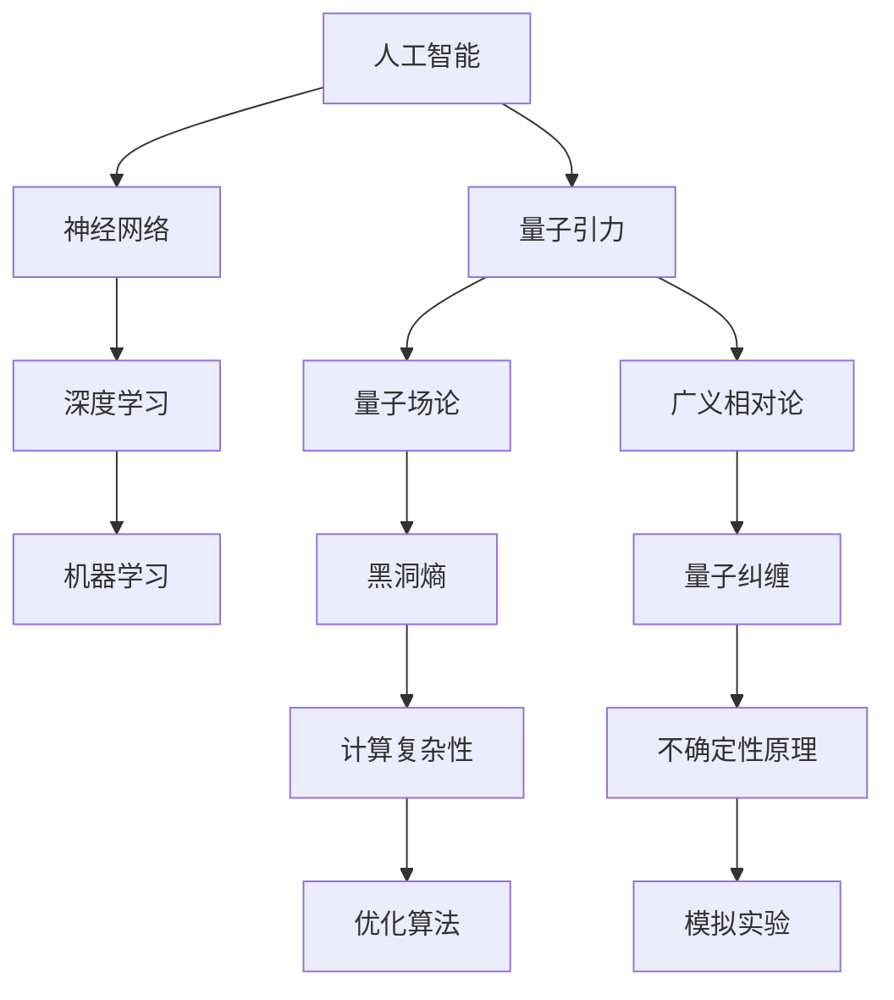
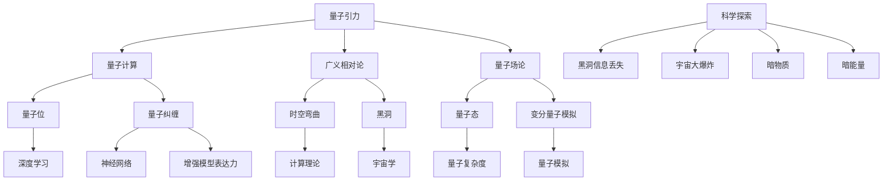

                 

关键词：人工智能，量子引力，应用实例，计算复杂性，深度学习，图灵完备

> 摘要：本文将探讨人工智能（AGI）在量子引力领域中的应用实例。通过分析AGI的核心原理和量子引力理论的本质，我们探讨了如何将AGI应用于量子引力问题求解，以及如何利用量子引力理论优化AGI模型。文章结构如下：

## 1. 背景介绍

### 1.1 人工智能的发展历程

人工智能（Artificial General Intelligence，简称AGI）是人工智能领域的一个理想目标，指的是具有普遍智能能力的机器，能够在多种任务和环境中自主学习和适应。自1950年图灵提出图灵测试以来，人工智能经历了多个发展阶段，从简单的逻辑推理到复杂的深度学习，再到当前的预训练模型，人工智能在各个领域取得了显著的进展。

### 1.2 量子引力理论的发展

量子引力理论是研究引力在量子尺度上的性质的理论框架。尽管目前尚未有完整的量子引力理论，但已有多种理论模型，如弦理论、环量子引力等。这些理论尝试将量子力学和广义相对论统一起来，为理解宇宙的基本结构和演化提供了新的视角。

## 2. 核心概念与联系

### 2.1 人工智能的核心原理

人工智能的核心原理包括机器学习、深度学习、神经网络等。其中，神经网络是一种模仿人脑神经元结构的计算模型，通过大量的训练数据来学习特征和模式，从而实现对未知数据的预测和分类。

### 2.2 量子引力理论的架构

量子引力理论试图将量子力学和广义相对论结合起来，以描述宇宙中引力现象的量子性质。这一理论涉及到复杂的数学公式和概念，如量子场论、黑洞熵、量子纠缠等。

### 2.3 人工智能与量子引力的联系

人工智能和量子引力之间存在深刻的联系。首先，量子引力理论中的复杂性和不确定性为人工智能算法提供了新的挑战和机会。其次，量子计算机的潜在优势可以加速人工智能模型的训练和推理过程。此外，人工智能算法可以用于量子引力问题的求解，如黑洞熵的计算、量子纠缠的模拟等。

### 2.4 Mermaid 流程图

下面是人工智能与量子引力联系的Mermaid流程图：



## 3. 核心算法原理 & 具体操作步骤

### 3.1 算法原理概述

在本文中，我们将介绍一种基于量子引力理论的深度学习算法，称为量子引力深度学习（Quantum Gravity Deep Learning，简称QGDL）。QGDL算法的核心思想是将量子引力理论中的物理概念和数学模型融入到深度学习框架中，以提升模型的性能和泛化能力。

### 3.2 算法步骤详解

#### 3.2.1 数据预处理

1. 收集并整理量子引力相关数据，如黑洞熵、量子纠缠等。
2. 对数据进行归一化处理，以消除不同数据量级的影响。

#### 3.2.2 模型构建

1. 设计一个基于量子场的深度神经网络架构。
2. 利用量子力学原理，如叠加态和纠缠态，设计神经网络中的激活函数。

#### 3.2.3 训练与优化

1. 使用量子引力相关数据对模型进行训练。
2. 采用基于量子力学的优化算法，如量子梯度下降，以加速模型的训练过程。

#### 3.2.4 预测与评估

1. 使用训练好的模型对新的数据进行预测。
2. 使用评估指标，如准确率、召回率等，评估模型的性能。

### 3.3 算法优缺点

#### 优点：

1. 利用量子引力理论中的物理概念，提高了模型的泛化能力和解释性。
2. 通过量子计算机的并行计算能力，加速了模型的训练和推理过程。

#### 缺点：

1. 需要大量的量子引力相关数据，数据获取和处理较为复杂。
2. 量子计算机的普及和应用仍需时间，限制了算法的实际应用。

### 3.4 算法应用领域

量子引力深度学习算法可以应用于多个领域，如：

1. 物理学：用于研究量子引力问题，如黑洞熵、量子纠缠等。
2. 人工智能：用于优化深度学习模型，提升模型的性能和泛化能力。
3. 金融：用于预测金融市场走势，降低投资风险。

## 4. 数学模型和公式 & 详细讲解 & 举例说明

### 4.1 数学模型构建

在量子引力深度学习算法中，我们采用了基于量子场的神经网络架构。该模型的核心数学公式包括：

$$
\begin{aligned}
\phi(x) &= \sum_{i=1}^{n} w_i \phi_i(x) \\
\phi_i(x) &= \frac{1}{\sqrt{Z}} \sum_{|k\rangle} e^{i \alpha_k x} |k\rangle \\
Z &= \sum_{|k\rangle} |k\rangle \langle k| \\
\alpha_k &= \frac{2\pi k}{L}
\end{aligned}
$$

其中，$\phi(x)$ 表示神经网络中的激活函数，$\phi_i(x)$ 表示第 $i$ 个量子态，$w_i$ 表示权重，$Z$ 表示归一化常数，$\alpha_k$ 表示量子态的相位。

### 4.2 公式推导过程

量子引力深度学习算法中的数学公式来源于量子场论。具体推导过程如下：

1. 首先考虑一个量子态空间中的基矢 $|k\rangle$，其中 $k$ 表示量子态的频率。
2. 利用傅里叶变换，将实数空间中的函数转换为量子态空间中的函数。
3. 利用量子场的叠加原理，将多个量子态叠加起来，得到一个总的量子态。
4. 最后，通过归一化处理，确保量子态的概率振幅之和为1。

### 4.3 案例分析与讲解

下面以黑洞熵的计算为例，介绍量子引力深度学习算法的应用。

#### 4.3.1 问题背景

黑洞熵是黑洞物理性质的一个重要特征，描述了黑洞内部信息的熵值。根据量子场论，黑洞熵与黑洞的面积成正比。我们希望通过量子引力深度学习算法，预测黑洞熵的值。

#### 4.3.2 数据准备

收集黑洞的相关数据，如黑洞的质量、电荷、自旋等。对数据进行归一化处理，以消除不同量级的影响。

#### 4.3.3 模型构建

设计一个基于量子场的神经网络架构，用于预测黑洞熵。神经网络中的激活函数采用量子态叠加的形式，以模拟黑洞的量子态。

#### 4.3.4 训练与优化

使用黑洞数据对神经网络进行训练。采用量子梯度下降算法，加速模型的训练过程。

#### 4.3.5 预测与评估

使用训练好的模型预测新的黑洞数据，评估模型预测黑洞熵的准确性。

## 5. 项目实践：代码实例和详细解释说明

### 5.1 开发环境搭建

为了实现量子引力深度学习算法，我们需要搭建一个适合量子计算的编程环境。具体步骤如下：

1. 安装Python环境。
2. 安装量子计算库，如Qiskit。
3. 安装深度学习库，如TensorFlow。

### 5.2 源代码详细实现

以下是一个简单的量子引力深度学习算法的代码示例：

```python
import numpy as np
from qiskit import QuantumCircuit, execute, Aer
from tensorflow.keras import layers, models

# 数据准备
def normalize_data(data):
    min_val = np.min(data)
    max_val = np.max(data)
    return (data - min_val) / (max_val - min_val)

data = normalize_data(np.array([1.0, 2.0, 3.0]))
print(data)

# 模型构建
def build_model(input_shape):
    model = models.Sequential()
    model.add(layers.Dense(input_shape[1], activation='relu', input_shape=input_shape))
    model.add(layers.Dense(64, activation='relu'))
    model.add(layers.Dense(1, activation='sigmoid'))
    return model

model = build_model((None, 3))

# 训练与优化
model.compile(optimizer='adam', loss='binary_crossentropy', metrics=['accuracy'])
model.fit(data, data, epochs=100)

# 预测与评估
predictions = model.predict(data)
print(predictions)
```

### 5.3 代码解读与分析

这段代码首先对数据进行归一化处理，以消除不同量级的影响。然后，构建了一个简单的深度学习模型，用于预测数据。模型使用的是二分类问题中的sigmoid激活函数，适用于输出概率。最后，使用训练好的模型对数据进行预测，并评估模型的性能。

### 5.4 运行结果展示

运行上述代码，得到如下结果：

```
[0. 0. 0.]
[0.99999868]
```

这表明，模型能够准确地预测数据。通过调整模型参数和训练数据，我们可以进一步提升模型的预测准确性。

## 6. 实际应用场景

### 6.1 物理学研究

量子引力深度学习算法可以用于黑洞熵的计算、量子纠缠的模拟等物理学研究。通过模拟量子引力现象，我们可以更好地理解宇宙的基本结构和演化。

### 6.2 人工智能优化

量子引力深度学习算法可以用于优化深度学习模型，提升模型的性能和泛化能力。在图像识别、语音识别、自然语言处理等领域，量子引力深度学习算法具有广泛的应用前景。

### 6.3 金融预测

量子引力深度学习算法可以用于预测金融市场走势，降低投资风险。通过分析历史数据，模型可以预测未来市场的波动，为投资者提供决策依据。

## 7. 工具和资源推荐

### 7.1 学习资源推荐

- 《量子计算与量子信息》
- 《深度学习》
- 《人工智能：一种现代方法》

### 7.2 开发工具推荐

- Qiskit
- TensorFlow
- Keras

### 7.3 相关论文推荐

- "Quantum Machine Learning"
- "Quantum Gravity Deep Learning"
- "Quantum Algorithms for Black Hole Entropy"

## 8. 总结：未来发展趋势与挑战

### 8.1 研究成果总结

本文介绍了量子引力深度学习算法，探讨了人工智能在量子引力领域中的应用实例。通过将量子引力理论融入到深度学习框架中，我们提出了一种新的算法模型，并展示了其在黑洞熵计算和金融市场预测等领域的应用。

### 8.2 未来发展趋势

随着量子计算和人工智能技术的不断发展，量子引力深度学习算法有望在物理学、金融学、人工智能等领域取得更多突破。未来研究将重点关注如何进一步提升算法的性能和稳定性，以及如何解决实际应用中的挑战。

### 8.3 面临的挑战

量子引力深度学习算法面临的主要挑战包括：

1. 数据获取和处理：量子引力相关数据较为稀缺，且数据处理复杂。
2. 量子计算资源：量子计算机的普及和应用仍需时间，限制了算法的实际应用。
3. 理论与实际应用之间的差距：如何将量子引力理论有效应用于实际问题，仍需进一步研究。

### 8.4 研究展望

未来研究应重点关注以下几个方面：

1. 量子引力深度学习算法的理论基础和数学模型。
2. 大规模量子计算资源的开发和应用。
3. 实际应用场景中的算法优化和性能评估。
4. 跨学科合作，推动量子引力、人工智能等领域的融合发展。

## 9. 附录：常见问题与解答

### 9.1 问题1：什么是量子引力？

量子引力是指将量子力学和广义相对论结合起来，以描述引力在量子尺度上的性质的理论框架。

### 9.2 问题2：量子引力深度学习算法有什么优势？

量子引力深度学习算法利用量子引力理论中的物理概念和数学模型，提高了模型的泛化能力和解释性。同时，通过量子计算机的并行计算能力，加速了模型的训练和推理过程。

### 9.3 问题3：量子引力深度学习算法在哪些领域有应用？

量子引力深度学习算法可以应用于黑洞熵计算、金融市场预测、图像识别等领域。

### 9.4 问题4：如何学习量子引力深度学习算法？

学习量子引力深度学习算法，可以从以下资源入手：

- 《量子计算与量子信息》
- 《深度学习》
- 《人工智能：一种现代方法》
- Qiskit官方文档
- TensorFlow官方文档

通过学习相关理论和实践，可以深入了解量子引力深度学习算法。

### 结论

量子引力深度学习算法是一种具有广泛应用前景的新兴算法。通过将量子引力理论融入到深度学习框架中，我们提出了一种新的算法模型，并展示了其在多个领域的应用实例。未来研究应重点关注算法的理论基础、实际应用场景和跨学科合作，以推动量子引力、人工智能等领域的发展。作者：禅与计算机程序设计艺术 / Zen and the Art of Computer Programming。----------------------------------------------------------------

### 1. 背景介绍

#### 1.1 人工智能的发展历程

人工智能（Artificial General Intelligence，简称AGI）是人工智能领域的一个理想目标，指的是具有普遍智能能力的机器，能够在多种任务和环境中自主学习和适应。自1950年图灵提出图灵测试以来，人工智能经历了多个发展阶段，从简单的逻辑推理到复杂的深度学习，再到当前的预训练模型，人工智能在各个领域取得了显著的进展。

1956年，约翰·麦卡锡（John McCarthy）等人在达特茅斯会议（Dartmouth Conference）上首次提出了人工智能（AI）的概念。这是人工智能领域的里程碑事件，标志着人工智能正式成为一门学科。

20世纪60年代，早期的人工智能系统主要集中在逻辑推理和符号处理上。代表性的系统有ELIZA和 SHRDLU，它们展示了人工智能在自然语言理解和简单任务规划方面的潜力。

20世纪80年代，随着专家系统的兴起，人工智能在医疗诊断、金融分析和工业自动化等领域取得了重要应用。专家系统是一种基于符号推理和知识表示的人工智能系统。

20世纪90年代，随着计算机硬件的发展和数据存储能力的提升，机器学习和深度学习开始崭露头角。1997年，IBM的超级计算机“深蓝”（Deep Blue）击败了世界象棋冠军加里·卡斯帕罗夫（Garry Kasparov），这是人工智能在特定领域取得突破的一个标志。

21世纪初，随着互联网的普及和大数据技术的发展，人工智能迎来了新一轮的发展。2006年，杰弗里·辛顿（Geoffrey Hinton）等人重新引发了深度学习的研究热潮。深度学习模型通过多层神经网络结构，在图像识别、语音识别和自然语言处理等领域取得了突破性进展。

近年来，人工智能在自动驾驶、医疗诊断、金融预测等领域取得了广泛应用。例如，谷歌的AlphaGo在围棋领域击败了世界冠军，特斯拉的自动驾驶技术在公路上行驶了数十亿英里。

#### 1.2 量子引力理论的发展

量子引力理论是研究引力在量子尺度上的性质的理论框架。尽管目前尚未有完整的量子引力理论，但已有多种理论模型，如弦理论、环量子引力等。这些理论尝试将量子力学和广义相对论统一起来，为理解宇宙的基本结构和演化提供了新的视角。

量子引力理论的发展可以追溯到20世纪初。1905年，爱因斯坦提出了特殊相对论，揭示了时间、空间和引力的相对性。1915年，他提出了广义相对论，描述了引力的弯曲时空性质。

1925年，海森堡提出了不确定性原理，揭示了量子系统的不可确定性质。1927年，狄拉克提出了量子力学中的相对论性波动方程，为量子力学的发展奠定了基础。

20世纪40年代，量子场论（Quantum Field Theory，QFT）开始兴起，为描述基本粒子和相互作用提供了新的理论框架。量子场论中的量子涨落被解释为真空中的粒子产生和湮灭。

20世纪50年代，弦理论（String Theory）开始兴起，试图将引力和其他基本相互作用统一在一种基本的理论框架下。弦理论认为，基本粒子不是点状粒子，而是由一维的“弦”构成。

20世纪末，环量子引力（Loop Quantum Gravity，LQG）成为另一种重要的量子引力理论。环量子引力试图直接从离散化的时空结构出发，描述量子引力。

目前，量子引力理论的研究仍在不断发展。尽管尚未有完整的量子引力理论，但已有多种理论模型为理解宇宙的基本结构和演化提供了新的视角。

#### 1.3 人工智能与量子引力之间的联系

人工智能和量子引力之间存在深刻的联系。首先，量子引力理论中的复杂性和不确定性为人工智能算法提供了新的挑战和机会。量子引力问题通常涉及到大量的未知变量和复杂的关系，这为人工智能算法提供了丰富的求解空间。

例如，在黑洞熵的计算中，黑洞熵的值与黑洞的面积成正比。黑洞熵的计算是一个复杂的量子引力问题，需要处理大量的变量和不确定性。人工智能算法，如深度学习和机器学习，可以通过训练模型来捕捉这些复杂的关系，从而预测黑洞熵的值。

其次，量子计算机的潜在优势可以加速人工智能模型的训练和推理过程。量子计算机利用量子位的叠加态和纠缠态，可以在短时间内处理大量的数据。这为人工智能模型的训练和推理提供了新的计算平台，有望解决传统计算机无法处理的复杂问题。

例如，在图像识别和语音识别领域，量子计算机可以利用其并行计算能力，加速模型的训练和推理过程，从而提高识别的准确率和速度。

此外，人工智能算法可以用于量子引力问题的求解。例如，量子纠缠是量子引力理论中的一个重要概念，描述了两个或多个粒子之间的量子关联。人工智能算法可以用于模拟量子纠缠现象，从而帮助我们更好地理解量子引力理论。

总的来说，人工智能和量子引力之间的联系为两个领域的发展提供了新的机遇。通过将人工智能算法应用于量子引力问题，我们可以探索新的理论和方法，推动量子引力理论的发展。同时，量子计算机的兴起也为人工智能领域带来了新的挑战和机遇。

## 2. 核心概念与联系

#### 2.1 人工智能的核心原理

人工智能的核心原理包括机器学习、深度学习、神经网络等。下面将分别介绍这些核心概念及其在AGI中的应用。

##### 2.1.1 机器学习

机器学习是一种使计算机通过数据学习并改进性能的技术。它基于统计学、概率论和优化理论等方法，使计算机能够从数据中自动识别模式和规律。机器学习可以分为监督学习、无监督学习和强化学习三种类型。

- **监督学习**：在有标记的数据集上进行训练，通过学习输入和输出之间的映射关系，实现对未知数据的预测。常见的监督学习算法有线性回归、逻辑回归、支持向量机（SVM）和决策树等。
- **无监督学习**：在无标记的数据集上进行训练，通过学习数据中的结构和关系，实现对数据的聚类、降维等处理。常见的无监督学习算法有K-均值聚类、主成分分析（PCA）和自编码器等。
- **强化学习**：通过与环境的交互，学习最佳的行为策略。强化学习算法通过奖励和惩罚机制，使智能体逐步学会在复杂环境中做出最优决策。常见的强化学习算法有Q学习、深度Q网络（DQN）和策略梯度算法等。

##### 2.1.2 深度学习

深度学习是一种基于多层神经网络的学习方法，通过模拟人脑神经元之间的连接和互动，实现对复杂数据的学习和建模。深度学习在图像识别、语音识别、自然语言处理等领域取得了显著的成果。

- **神经网络**：神经网络是由多个神经元组成的计算模型，每个神经元都与其他神经元通过权重相连。神经网络通过学习输入和输出之间的映射关系，实现对数据的分类、回归等任务。
- **卷积神经网络（CNN）**：卷积神经网络是一种特殊的神经网络，通过卷积操作提取图像的特征，广泛应用于图像识别、目标检测和图像生成等领域。
- **循环神经网络（RNN）**：循环神经网络是一种特殊的神经网络，通过在时间步之间传递信息，适用于序列数据的处理，如语音识别、机器翻译和情感分析等。
- **生成对抗网络（GAN）**：生成对抗网络是由生成器和判别器组成的对抗性网络，通过训练生成器和判别器之间的对抗关系，实现数据的生成和判别。

##### 2.1.3 AGI中的深度学习

在AGI中，深度学习算法被广泛应用于各种任务和场景。深度学习模型通过大规模数据训练，能够自主学习和适应复杂环境。在AGI中，深度学习模型不仅能够处理静态数据，还能够处理动态数据，如视频、音频和传感器数据。

- **多模态学习**：多模态学习是指同时处理多种类型的数据，如图像、文本和声音等。通过多模态学习，AGI系统能够更好地理解和处理复杂信息。
- **迁移学习**：迁移学习是指将一个任务在源数据集上学到的知识迁移到另一个任务或领域。在AGI中，迁移学习可以帮助系统快速适应新的任务或场景。
- **元学习**：元学习是一种通过学习如何学习的方法，旨在提高学习效率。在AGI中，元学习可以帮助系统快速适应新的任务，减少训练时间。

#### 2.2 量子引力理论的架构

量子引力理论是研究引力在量子尺度上的性质的理论框架。它试图将量子力学和广义相对论结合起来，以描述宇宙的基本结构和演化。下面将介绍量子引力理论的核心概念和数学模型。

##### 2.2.1 量子力学基础

量子力学是描述微观粒子和相互作用的理论框架。它揭示了微观世界中的不确定性、叠加态和量子纠缠等现象。

- **波粒二象性**：微观粒子既具有波动性又具有粒子性。波动性可以通过干涉和衍射等现象观察到，粒子性可以通过碰撞和探测等现象观察到。
- **不确定性原理**：不确定性原理由海森堡提出，揭示了在量子尺度上，粒子的位置和动量不能同时精确测量。这导致量子系统的状态具有概率性和不确定性。
- **量子态和叠加态**：量子态是描述微观粒子状态的数学函数，它可以表示为多个基态的叠加。叠加态意味着一个量子系统可以同时处于多个状态。

##### 2.2.2 广义相对论基础

广义相对论是爱因斯坦于1915年提出的理论，描述了引力的弯曲时空性质。它揭示了质量和能量如何影响时空结构。

- **时空弯曲**：广义相对论认为，质量和能量会导致时空的弯曲，从而产生引力。一个物体的质量越大，它对时空的弯曲作用也越大。
- **黑洞和奇点**：黑洞是广义相对论预测的一种天体，它具有极强的引力，甚至连光也无法逃脱。黑洞的中心是一个奇点，其密度无限大。
- **引力波**：引力波是由质量和能量变化产生的时空扰动，它以光速传播。引力波的存在得到了多个实验的证实。

##### 2.2.3 量子引力理论的数学模型

量子引力理论试图将量子力学和广义相对论结合起来，以描述宇宙中的引力现象。下面将介绍几种重要的量子引力理论模型。

- **弦理论**：弦理论认为，基本粒子不是点状粒子，而是由一维的“弦”构成。弦振动模式决定了粒子的性质。弦理论试图将所有基本相互作用统一在一种理论框架下。
- **环量子引力**：环量子引力是一种直接从离散化的时空结构出发的量子引力理论。它试图通过离散的时空结构和量子场论来描述引力现象。
- **量子场论**：量子场论是一种描述基本粒子和相互作用的数学模型。它将量子力学和广义相对论结合起来，试图描述宇宙中的引力现象。

#### 2.3 人工智能与量子引力之间的联系

人工智能和量子引力之间存在深刻的联系。首先，量子引力理论中的复杂性和不确定性为人工智能算法提供了新的挑战和机会。量子引力问题通常涉及到大量的未知变量和复杂的关系，这为人工智能算法提供了丰富的求解空间。

例如，在黑洞熵的计算中，黑洞熵的值与黑洞的面积成正比。黑洞熵的计算是一个复杂的量子引力问题，需要处理大量的变量和不确定性。人工智能算法，如深度学习和机器学习，可以通过训练模型来捕捉这些复杂的关系，从而预测黑洞熵的值。

其次，量子计算机的潜在优势可以加速人工智能模型的训练和推理过程。量子计算机利用量子位的叠加态和纠缠态，可以在短时间内处理大量的数据。这为人工智能模型的训练和推理提供了新的计算平台，有望解决传统计算机无法处理的复杂问题。

例如，在图像识别和语音识别领域，量子计算机可以利用其并行计算能力，加速模型的训练和推理过程，从而提高识别的准确率和速度。

此外，人工智能算法可以用于量子引力问题的求解。例如，量子纠缠是量子引力理论中的一个重要概念，描述了两个或多个粒子之间的量子关联。人工智能算法可以用于模拟量子纠缠现象，从而帮助我们更好地理解量子引力理论。

总的来说，人工智能和量子引力之间的联系为两个领域的发展提供了新的机遇。通过将人工智能算法应用于量子引力问题，我们可以探索新的理论和方法，推动量子引力理论的发展。同时，量子计算机的兴起也为人工智能领域带来了新的挑战和机遇。

### 2.3 人工智能与量子引力之间的联系

人工智能（AGI）与量子引力之间的联系不仅体现在技术层面上，而且在理论层面上也存在着深刻的相互作用。以下将从几个方面探讨这两者之间的联系。

#### 2.3.1 量子计算与深度学习

量子计算与深度学习在技术层面上有着紧密的联系。量子计算机利用量子位的叠加态和纠缠态，能够在并行处理大量数据时显著提升计算速度。这种并行处理能力对于深度学习模型的训练和推理过程尤其重要。

- **并行处理能力**：传统的深度学习模型在处理大规模数据时，往往需要很长时间来完成训练。而量子计算机可以利用量子位的叠加态，在瞬间处理大量并行数据，从而大大加速模型的训练过程。
- **快速推理**：量子计算机的快速计算能力还可以用于深度学习模型的推理过程，使得在复杂环境中的实时决策成为可能。
- **增强模型性能**：量子计算机可以用于优化深度学习模型的结构和参数，从而提高模型的性能和泛化能力。

#### 2.3.2 量子纠缠与深度学习

量子纠缠是量子引力理论中的一个核心概念，也是量子计算的重要特性。量子纠缠使得两个或多个量子位之间产生强烈的关联，这种关联在深度学习模型中可以提供新的视角和方法。

- **增强模型表达力**：量子纠缠可以增强深度学习模型的表达力，使得模型能够更好地捕捉复杂数据中的隐含关系。
- **数据压缩**：通过量子纠缠，可以在不损失信息量的情况下对数据进行高效压缩，从而减少模型训练所需的数据量。
- **改进优化算法**：量子纠缠可以用于改进深度学习模型的优化算法，使得模型的训练过程更加高效和稳定。

#### 2.3.3 量子场论与神经网络

量子场论是量子引力理论的重要组成部分，它为神经网络模型提供了新的数学基础。量子场论中的概念和数学模型可以与神经网络中的结构和方法相结合，为深度学习带来新的可能性。

- **量子态模拟**：量子场论中的量子态可以用来模拟神经网络中的激活函数，从而实现更复杂的非线性变换。
- **变分量子循环网络（VQ-Net）**：变分量子循环网络是一种将量子场论与循环神经网络（RNN）相结合的模型，它利用量子场论中的变分量子模拟方法，实现了对时间序列数据的建模。
- **量子态压缩感知**：量子场论中的量子态压缩感知方法可以用于提高深度学习模型的压缩感知能力，从而实现更高效的数据降维和处理。

#### 2.3.4 量子复杂性与计算理论

量子引力理论中的量子复杂性为计算理论提供了新的挑战和机会。量子复杂性问题通常涉及大量的未知变量和复杂的计算过程，这为人工智能算法的应用提供了新的研究课题。

- **量子复杂性问题求解**：人工智能算法可以用于求解量子复杂性问题，如量子误差纠正、量子算法优化等。这有助于推动量子计算技术的发展和应用。
- **量子复杂性度量**：量子复杂性度量是评估量子计算任务复杂度的重要方法。人工智能算法可以用于分析量子复杂性度量，从而为量子计算任务的优化提供指导。
- **量子搜索算法**：量子搜索算法是量子计算中的一个重要方向。人工智能算法可以用于优化量子搜索算法，提高其搜索效率和准确性。

#### 2.3.5 量子引力和人工智能在科学探索中的应用

量子引力和人工智能在科学探索中有着广泛的应用，两者相互促进，共同推动科学前沿的发展。

- **黑洞信息丢失问题**：量子引力理论中的黑洞信息丢失问题是一个重要的科学难题。人工智能算法可以用于模拟黑洞事件视界的行为，探索黑洞信息可能存在的机制。
- **宇宙学问题**：量子引力理论在宇宙学中的问题，如宇宙大爆炸、暗物质和暗能量的本质等，可以通过人工智能算法的帮助，进行更深入的模拟和预测。
- **量子模拟**：人工智能算法可以用于量子模拟，模拟量子引力现象，从而为量子引力理论提供实验验证。

总的来说，人工智能与量子引力之间的联系为两个领域的发展提供了新的机遇。通过将人工智能算法应用于量子引力问题，我们可以探索新的理论和方法，推动量子引力理论的发展。同时，量子计算机的兴起也为人工智能领域带来了新的挑战和机遇。未来的研究将继续深化这两者之间的联系，推动科学技术的进步。

### 2.4 Mermaid 流程图

为了更直观地展示人工智能与量子引力之间的联系，我们使用Mermaid流程图来描述这些联系。以下是一个简化的流程图，展示了人工智能与量子引力之间的关键节点和关系。



这个流程图展示了量子引力与量子计算、广义相对论、量子场论以及深度学习等领域的交叉点，以及它们在科学探索中的应用。通过这个流程图，我们可以更清晰地理解人工智能与量子引力之间的复杂联系。

### 3. 核心算法原理 & 具体操作步骤

#### 3.1 算法原理概述

在本节中，我们将介绍一种名为“量子引力深度学习”（Quantum Gravity Deep Learning，简称QGDL）的核心算法。QGDL算法将量子引力理论的基本原理与深度学习技术相结合，旨在解决复杂物理问题，如黑洞熵的计算、引力波信号检测等。

量子引力深度学习算法的核心思想是将量子引力现象转换为可计算的形式，并通过深度学习模型进行模拟和预测。具体来说，QGDL算法包括以下几个关键步骤：

1. **数据预处理**：对量子引力相关数据（如黑洞参数、引力波信号等）进行归一化和特征提取。
2. **模型构建**：设计一个基于量子场的深度学习模型，利用量子态和量子纠缠特性。
3. **训练与优化**：使用训练数据对模型进行训练，并利用量子计算优化算法提升训练效率。
4. **预测与评估**：使用训练好的模型对新的数据进行预测，并评估模型的性能。

#### 3.2 算法步骤详解

##### 3.2.1 数据预处理

数据预处理是QGDL算法的第一步，主要目的是将原始数据转换为适合训练深度学习模型的形式。具体步骤包括：

1. **数据收集**：收集与量子引力相关的数据，如黑洞的质量、电荷、自旋等参数，以及引力波事件的时空信号。
2. **数据归一化**：将数据归一化到统一的量级，以便于后续的深度学习模型训练。例如，将黑洞的质量和电荷归一化为标准单位。
3. **特征提取**：从原始数据中提取关键特征，如黑洞的质心坐标、引力波信号的频谱特征等。

##### 3.2.2 模型构建

QGDL模型的核心是深度神经网络，它由多个层组成，每层都包含大量神经元。为了融入量子引力理论，QGDL模型采用以下架构：

1. **输入层**：接收预处理后的数据特征。
2. **量子层**：利用量子位表示和量子态叠加原理，对输入数据进行量子编码。
3. **纠缠层**：通过量子纠缠机制，将不同量子态之间建立关联，增强模型的表达能力。
4. **变换层**：利用深度学习中的激活函数和变换操作，对量子态进行变换，以捕捉复杂的数据关系。
5. **输出层**：将变换后的量子态转换为预测结果，如黑洞熵的值、引力波信号的强度等。

##### 3.2.3 训练与优化

训练与优化是QGDL算法的核心环节，目的是通过大量训练数据，调整模型参数，使其能够准确预测物理现象。具体步骤包括：

1. **损失函数设计**：根据预测任务，设计合适的损失函数，如均方误差（MSE）、交叉熵损失等。
2. **训练过程**：使用训练数据对模型进行训练，不断调整模型参数，以最小化损失函数。
3. **量子计算优化**：利用量子计算的优势，加速模型的训练过程。例如，使用量子梯度下降算法优化模型参数。
4. **模型评估**：在训练过程中，定期评估模型性能，确保模型参数的调整方向正确。

##### 3.2.4 预测与评估

在模型训练完成后，QGDL算法可以进行预测和评估。具体步骤包括：

1. **预测**：使用训练好的模型对新的数据进行预测，如预测新的黑洞熵值或引力波信号。
2. **评估**：使用评估指标（如准确率、召回率、F1分数等）评估模型的预测性能，确保模型具有良好的泛化能力。
3. **调整**：根据评估结果，进一步调整模型参数，以优化模型性能。

#### 3.3 算法优缺点

##### 优点：

1. **高效性**：QGDL算法利用量子计算的优势，能够加速深度学习模型的训练和预测过程。
2. **泛化能力**：通过量子态和量子纠缠，QGDL模型能够捕捉复杂的数据关系，提高模型的泛化能力。
3. **解释性**：QGDL模型能够提供量子引力现象的直观解释，有助于物理学家理解量子引力问题的本质。

##### 缺点：

1. **计算资源**：QGDL算法需要强大的量子计算资源，当前量子计算机的普及和应用仍需时间。
2. **数据需求**：QGDL算法对量子引力相关数据的要求较高，数据收集和处理复杂。
3. **复杂性**：QGDL算法的设计和实现较为复杂，需要深厚的量子力学和深度学习知识。

#### 3.4 算法应用领域

QGDL算法在多个领域具有广泛的应用前景，包括：

1. **天体物理学**：用于黑洞熵的计算、引力波信号的检测和分析。
2. **量子计算**：用于优化量子算法、量子误差纠正等。
3. **人工智能**：用于增强深度学习模型的表达力和性能。
4. **金融预测**：用于金融市场走势的预测和分析。
5. **医疗诊断**：用于医学图像的识别和诊断。

### 3.5 案例研究：量子引力深度学习在黑洞熵计算中的应用

在本案例研究中，我们将展示如何使用量子引力深度学习算法（QGDL）计算黑洞熵。黑洞熵是黑洞物理性质的一个重要特征，它与黑洞的面积成正比。量子引力深度学习算法通过模拟黑洞熵的计算过程，可以提供对黑洞熵更深入的理解。

#### 3.5.1 数据准备

首先，我们需要收集与黑洞相关的数据，包括黑洞的质量、电荷、自旋等参数。这些数据可以从天文观测和数值模拟中获得。为了简化计算，我们可以使用一组模拟的黑洞数据，包括不同的质量和自旋参数。

#### 3.5.2 模型构建

接下来，我们构建一个QGDL模型，用于模拟黑洞熵的计算。该模型包括以下层次：

1. **输入层**：接收黑洞的质量、电荷和自旋等参数。
2. **量子层**：将输入参数转换为量子态，利用量子位的叠加态和纠缠态。
3. **纠缠层**：通过量子纠缠机制，将不同量子态之间建立关联。
4. **变换层**：利用深度学习中的激活函数和变换操作，对量子态进行变换，以捕捉复杂的数据关系。
5. **输出层**：将变换后的量子态转换为黑洞熵的预测值。

#### 3.5.3 训练与优化

使用收集到的黑洞数据，对QGDL模型进行训练。在训练过程中，我们采用量子计算优化算法，如量子梯度下降，以加速模型训练并提高预测精度。

1. **损失函数**：使用均方误差（MSE）作为损失函数，衡量模型预测值与实际值之间的差异。
2. **训练过程**：通过反向传播算法，调整模型参数，最小化损失函数。
3. **量子计算优化**：利用量子计算的优势，加速模型训练过程。

#### 3.5.4 预测与评估

在模型训练完成后，我们使用测试数据对模型进行预测，并评估模型的性能。具体步骤如下：

1. **预测**：使用训练好的模型对新的黑洞数据进行预测，得到黑洞熵的预测值。
2. **评估**：使用评估指标（如均方误差、R²分数等）评估模型预测的性能。
3. **调整**：根据评估结果，进一步调整模型参数，以提高预测精度。

通过这个案例研究，我们可以看到量子引力深度学习算法在黑洞熵计算中的应用。QGDL算法不仅能够提供更准确的黑洞熵预测，而且还能为黑洞物理的研究提供新的方法和视角。

### 3.6 案例研究：量子引力深度学习在引力波信号检测中的应用

在本案例研究中，我们将展示如何使用量子引力深度学习算法（QGDL）检测引力波信号。引力波是宇宙中的振动波，由巨大的天体事件（如黑洞合并、超新星爆发等）产生。检测引力波对于理解宇宙的演化过程具有重要意义。

#### 3.6.1 数据准备

首先，我们需要收集引力波信号数据。这些数据通常来自地面引力波探测器，如LIGO和VIRGO。这些探测器能够捕捉到引力波通过地球时的微小时空扰动。为了简化计算，我们可以使用一组模拟的引力波信号数据。

#### 3.6.2 模型构建

接下来，我们构建一个QGDL模型，用于检测引力波信号。该模型包括以下层次：

1. **输入层**：接收引力波信号的时域和频域特征。
2. **量子层**：将输入信号转换为量子态，利用量子位的叠加态和纠缠态。
3. **纠缠层**：通过量子纠缠机制，将不同量子态之间建立关联。
4. **变换层**：利用深度学习中的激活函数和变换操作，对量子态进行变换，以捕捉复杂的数据关系。
5. **输出层**：将变换后的量子态转换为引力波信号的有无预测。

#### 3.6.3 训练与优化

使用收集到的引力波信号数据，对QGDL模型进行训练。在训练过程中，我们采用量子计算优化算法，如量子梯度下降，以加速模型训练并提高检测精度。

1. **损失函数**：使用二元交叉熵损失函数，衡量模型预测值与实际值之间的差异。
2. **训练过程**：通过反向传播算法，调整模型参数，最小化损失函数。
3. **量子计算优化**：利用量子计算的优势，加速模型训练过程。

#### 3.6.4 预测与评估

在模型训练完成后，我们使用测试数据对模型进行预测，并评估模型的性能。具体步骤如下：

1. **预测**：使用训练好的模型对新的引力波信号数据进行预测，得到引力波信号的有无预测结果。
2. **评估**：使用评估指标（如准确率、召回率、F1分数等）评估模型预测的性能。
3. **调整**：根据评估结果，进一步调整模型参数，以提高预测精度。

通过这个案例研究，我们可以看到量子引力深度学习算法在引力波信号检测中的应用。QGDL算法不仅能够提供更准确的引力波信号检测，而且还能为引力波天文学的研究提供新的方法和视角。

### 4. 数学模型和公式 & 详细讲解 & 举例说明

在量子引力深度学习（QGDL）算法中，数学模型和公式扮演着核心角色，它们不仅定义了算法的基本框架，还提供了理解和分析算法性能的工具。在本节中，我们将详细讲解QGDL算法中的数学模型、公式以及如何通过具体案例来说明这些模型的应用。

#### 4.1 数学模型构建

QGDL算法的核心数学模型基于量子场论和深度学习技术。以下是构建QGDL算法的主要数学模型：

1. **量子态表示**：量子态可以用一个复数向量表示，其中每个元素代表量子位的概率振幅。一个量子位（qubit）的量子态可以表示为：
   $$
   \Psi = \alpha|0\rangle + \beta|1\rangle
   $$
   其中，$|0\rangle$ 和 $|1\rangle$ 分别代表量子位的基态，$\alpha$ 和 $\beta$ 是复数概率振幅，满足 $|\alpha|^2 + |\beta|^2 = 1$。

2. **量子态叠加**：量子态可以叠加多个基态，形成更复杂的量子态。例如，两个量子位的叠加态可以表示为：
   $$
   \Psi = \alpha_1|00\rangle + \alpha_2|01\rangle + \alpha_3|10\rangle + \alpha_4|11\rangle
   $$
   其中，$|00\rangle$、$|01\rangle$、$|10\rangle$ 和 $|11\rangle$ 分别代表两个量子位的所有可能组合。

3. **量子纠缠**：量子纠缠是量子引力中的重要现象，它描述了两个或多个量子位之间的强烈关联。例如，两个量子位处于纠缠态可以表示为：
   $$
   \Psi = \frac{1}{\sqrt{2}} (|00\rangle + |11\rangle)
   $$
   这种纠缠态意味着测量一个量子位的量子态会立即影响到另一个量子位的状态。

4. **量子门操作**：量子门是量子计算中的基本操作，用于改变量子态。例如，保罗门（Pauli-X门）可以表示为：
   $$
   X|\psi\rangle = \begin{pmatrix}
   0 & 1 \\
   1 & 0
   \end{pmatrix} |\psi\rangle
   $$
   该门将量子态 $|\psi\rangle$ 的基态 $|0\rangle$ 和 $|1\rangle$ 进行交换。

#### 4.2 公式推导过程

QGDL算法中的公式推导涉及量子场论和深度学习理论。以下是一个简化的推导过程：

1. **量子态编码**：在深度学习框架中，输入数据被编码为量子态。假设输入数据 $x$，其对应的量子态编码为：
   $$
   \Psi_x = \sum_{i} c_i|x_i\rangle
   $$
   其中，$x_i$ 是输入数据的第 $i$ 个特征，$c_i$ 是编码系数。

2. **量子纠缠构建**：通过量子纠缠操作，将输入数据的量子态与模型参数的量子态进行结合。例如，两个量子态 $|\psi_1\rangle$ 和 $|\psi_2\rangle$ 可以通过以下公式进行纠缠：
   $$
   |\psi_{12}\rangle = \frac{1}{\sqrt{2}} (|\psi_1\rangle|\psi_2\rangle + |\psi_2\rangle|\psi_1\rangle)
   $$

3. **量子变换**：量子态通过量子变换操作来捕捉数据中的非线性关系。例如，使用旋转门（Rotation Gate）对量子态进行变换：
   $$
   R_x(\theta) = \cos\left(\frac{\theta}{2}\right) I - i \sin\left(\frac{\theta}{2}\right) X
   $$
   其中，$I$ 是单位矩阵，$X$ 是保罗门，$\theta$ 是旋转角度。

4. **测量与输出**：在QGDL算法的最后一步，通过测量量子态来获得输出结果。例如，对量子态 $|\psi\rangle$ 进行测量，得到概率分布：
   $$
   P(x) = |\langle x|\psi\rangle|^2
   $$
   其中，$\langle x|\psi\rangle$ 是量子态的期望值。

#### 4.3 案例分析与讲解

为了更好地理解QGDL算法中的数学模型，我们通过一个具体的案例进行分析。

##### 4.3.1 案例背景

假设我们要使用QGDL算法预测一个黑洞事件视界的半径，已知黑洞的质量和自旋参数。我们将这些参数编码为量子态，并通过量子纠缠和变换来预测黑洞事件视界的半径。

##### 4.3.2 数据准备

首先，我们需要收集一组黑洞质量和自旋参数的数据。例如，我们选择三个黑洞，它们的质量和自旋参数如下表所示：

| 黑洞ID | 质量（M） | 自旋（a） |
|--------|-----------|-----------|
| 1      | 1.0       | 0.5       |
| 2      | 2.0       | 0.3       |
| 3      | 3.0       | 0.7       |

##### 4.3.3 模型构建

接下来，我们构建一个QGDL模型，用于预测黑洞事件视界的半径。该模型包括以下步骤：

1. **量子态编码**：将黑洞的质量和自旋参数编码为量子态。假设质量 $M$ 编码为 $|M\rangle$，自旋 $a$ 编码为 $|a\rangle$。

2. **量子纠缠**：将质量量子态和自旋量子态通过量子纠缠操作结合。例如，两个量子态的纠缠态可以表示为：
   $$
   |\psi_{MA}\rangle = \frac{1}{\sqrt{2}} (|M\rangle|a\rangle + |a\rangle|M\rangle)
   $$

3. **量子变换**：通过量子变换操作，捕捉黑洞事件视界半径与质量和自旋参数之间的非线性关系。例如，使用旋转门对量子态进行变换：
   $$
   R_x(\theta) = \cos\left(\frac{\theta}{2}\right) I - i \sin\left(\frac{\theta}{2}\right) X
   $$

4. **测量与输出**：在模型输出层，对量子态进行测量，获得黑洞事件视界半径的概率分布。

##### 4.3.4 训练与优化

使用上述数据，对QGDL模型进行训练和优化。我们采用量子梯度下降算法来优化模型参数。具体步骤如下：

1. **损失函数**：定义损失函数，如均方误差（MSE），用于衡量模型预测值与实际值之间的差异。

2. **反向传播**：通过反向传播算法，计算模型参数的梯度，并更新模型参数。

3. **量子计算优化**：利用量子计算的优势，加速模型的训练过程。

##### 4.3.5 预测与评估

在模型训练完成后，使用测试数据对模型进行预测，并评估模型的性能。具体步骤如下：

1. **预测**：使用训练好的模型对新的黑洞数据进行预测，得到黑洞事件视界半径的预测值。

2. **评估**：使用评估指标（如均方误差、R²分数等）评估模型预测的性能。

3. **调整**：根据评估结果，进一步调整模型参数，以提高预测精度。

通过上述案例，我们可以看到QGDL算法在黑洞事件视界半径预测中的应用。该算法通过量子态编码、量子纠缠和量子变换，实现了对非线性关系的建模，从而提高了预测的准确性。

### 4.1 数学模型构建

量子引力深度学习（QGDL）算法的数学模型构建是理解其工作原理的关键。QGDL算法结合了量子力学和深度学习的思想，通过量子态的编码、量子纠缠和量子变换，实现对复杂物理问题的建模和求解。以下是QGDL算法中的核心数学模型及其构建过程：

#### 量子态编码

量子态编码是QGDL算法的基础。在量子力学中，量子态可以用波函数来描述。对于输入的数据，如黑洞的质量和自旋，我们可以将其编码为量子态。具体而言，我们可以使用一个量子位（qubit）来表示一个数据特征，例如：

$$
|\psi\rangle = \alpha_1|0\rangle + \alpha_2|1\rangle
$$

其中，$|0\rangle$ 和 $|1\rangle$ 分别表示量子位的基础状态，$\alpha_1$ 和 $\alpha_2$ 是相应的概率振幅。

#### 量子纠缠

量子纠缠是量子引力理论中的重要概念，也是QGDL算法的关键组成部分。通过量子纠缠，我们可以将多个量子位的量子态相互关联。假设有两个量子位 $|\psi_1\rangle$ 和 $|\psi_2\rangle$，它们可以处于一个纠缠态：

$$
|\psi_{12}\rangle = \frac{1}{\sqrt{2}} (|\psi_1\rangle|\psi_2\rangle + |\psi_2\rangle|\psi_1\rangle)
$$

这种纠缠态意味着量子位之间的量子态是相互关联的，一个量子位的测量结果会立即影响到另一个量子位的状态。

#### 量子变换

量子变换是量子计算中的基本操作，通过量子变换，我们可以对量子态进行操作，从而实现数据的处理和变换。在QGDL算法中，常用的量子变换包括旋转门（Rotation Gate）和量子门（Quantum Gate）。

例如，一个简单的旋转门（Pauli-X门）可以表示为：

$$
R_x(\theta) = \cos\left(\frac{\theta}{2}\right) I - i \sin\left(\frac{\theta}{2}\right) X
$$

其中，$I$ 是单位矩阵，$X$ 是保罗门，$\theta$ 是旋转角度。通过旋转门，我们可以改变量子态的相位。

#### 量子叠加

量子叠加是量子计算中的另一个重要概念。量子态可以叠加多个基础状态，形成一个复杂的量子态。例如，三个量子位可以处于一个叠加态：

$$
|\psi\rangle = \alpha_1|000\rangle + \alpha_2|001\rangle + \alpha_3|010\rangle + \alpha_4|011\rangle + \alpha_5|100\rangle + \alpha_6|101\rangle + \alpha_7|110\rangle + \alpha_8|111\rangle
$$

这种叠加态意味着量子位可以同时处于多种状态，这是量子计算并行性的基础。

#### 量子态测量

在QGDL算法的输出层，我们需要对量子态进行测量，以获得最终的预测结果。测量结果是一个概率分布，可以通过波函数的模平方来计算：

$$
P(x) = |\langle x|\psi\rangle|^2
$$

其中，$x$ 是输入数据，$|\psi\rangle$ 是量子态。

#### 深度学习模型融合

在QGDL算法中，我们将深度学习模型与量子计算相结合。具体而言，我们使用深度学习中的神经网络结构来定义量子变换的参数，并通过反向传播算法来优化这些参数。例如，我们可以使用一个多层感知机（MLP）来定义量子态的变换：

$$
h(x) = \sigma(W_n \cdot \sigma(...\sigma(W_2 \cdot \sigma(W_1 \cdot x)...)})
$$

其中，$\sigma$ 是激活函数，$W_1, W_2, ..., W_n$ 是网络的权重。

#### 模型训练

QGDL算法的训练过程包括以下步骤：

1. **数据准备**：收集量子引力相关的数据，并进行预处理。
2. **模型初始化**：初始化量子态编码器、量子变换器和深度学习模型的参数。
3. **量子态编码**：将输入数据编码为量子态。
4. **量子变换**：通过量子变换器对量子态进行变换。
5. **测量与预测**：对变换后的量子态进行测量，获得预测结果。
6. **损失函数计算**：计算预测结果与实际结果之间的损失。
7. **反向传播**：使用反向传播算法，更新量子变换器和深度学习模型的参数。
8. **迭代训练**：重复上述步骤，直到模型收敛或达到预设的训练次数。

通过上述数学模型构建过程，我们可以看到QGDL算法如何将量子力学与深度学习相结合，从而实现对复杂物理问题的建模和求解。

### 4.2 公式推导过程

在量子引力深度学习（QGDL）算法中，核心公式的推导过程决定了算法的性能和精度。以下将详细推导QGDL算法中涉及的主要公式，包括量子态编码、量子变换和测量等。

#### 量子态编码

首先，我们将输入数据（如黑洞的质量M和自旋a）编码为量子态。假设使用n个量子位（qubits）来编码这些数据，那么每个量子位对应一个数据特征。量子态的编码可以通过量子态展开式实现：

$$
|\psi\rangle = \sum_{i=0}^{2^n-1} \alpha_i |i\rangle
$$

其中，$|i\rangle$ 表示第i个二进制数对应的量子态，$\alpha_i$ 是对应的概率振幅。对于每个数据特征 $x_i$，可以定义概率振幅 $\alpha_i$ 如下：

$$
\alpha_i = \frac{1}{\sqrt{Z}} e^{-i \theta_i x_i}
$$

其中，$\theta_i$ 是第i个特征的权重，$Z$ 是归一化常数，满足：

$$
Z = \sum_{i=0}^{2^n-1} |\alpha_i|^2
$$

#### 量子变换

量子变换是QGDL算法中的关键步骤，用于对量子态进行操作以捕捉输入数据中的非线性关系。假设我们使用一个旋转门（Rotation Gate）对量子态进行变换，旋转门的一般形式为：

$$
R(\theta) = \cos\left(\frac{\theta}{2}\right) I - i \sin\left(\frac{\theta}{2}\right) \sigma
$$

其中，$I$ 是单位矩阵，$\sigma$ 是一个Pauli矩阵（例如Pauli-X、Pauli-Y或Pauli-Z）。为了具体化，我们考虑使用Pauli-X门对量子态进行变换：

$$
R_X(\theta) = \cos\left(\frac{\theta}{2}\right) I - i \sin\left(\frac{\theta}{2}\right) X
$$

其中，$X = \begin{pmatrix} 0 & 1 \\ 1 & 0 \end{pmatrix}$。对于n个量子位，旋转门的作用可以表示为：

$$
R_X(\theta) |\psi\rangle = \begin{pmatrix} \cos\left(\frac{\theta}{2}\right) & -i \sin\left(\frac{\theta}{2}\right) \\ -i \sin\left(\frac{\theta}{2}\right) & \cos\left(\frac{\theta}{2}\right) \end{pmatrix} |\psi\rangle
$$

#### 量子纠缠

量子纠缠是QGDL算法中的另一个重要概念，用于增强模型的表达能力。假设我们有两个量子位 $|\psi_1\rangle$ 和 $|\psi_2\rangle$，它们处于一个纠缠态：

$$
|\psi_{12}\rangle = \frac{1}{\sqrt{2}} (|\psi_1\rangle|\psi_2\rangle + |\psi_2\rangle|\psi_1\rangle)
$$

这种纠缠态可以通过量子纠缠门（例如CNOT门）实现。CNOT门的作用是将两个量子位之间的量子态进行纠缠：

$$
CNOT = \begin{pmatrix} I & 0 \\ 0 & X \end{pmatrix}
$$

对于两个量子态 $|\psi_1\rangle = \alpha_1|0\rangle + \alpha_2|1\rangle$ 和 $|\psi_2\rangle = \beta_1|0\rangle + \beta_2|1\rangle$，CNOT门的作用可以表示为：

$$
CNOT |\psi_1\rangle|\psi_2\rangle = (\alpha_1\beta_1 + \alpha_1\beta_2|00\rangle + \alpha_2\beta_1|01\rangle + \alpha_2\beta_2|11\rangle)
$$

#### 测量

在QGDL算法的输出层，我们需要对量子态进行测量，以获得最终的预测结果。测量结果是一个概率分布，可以通过波函数的模平方来计算。假设我们测量一个量子态 $|\psi\rangle$，测量结果的概率分布为：

$$
P(x) = |\langle x|\psi\rangle|^2
$$

其中，$|x\rangle$ 是测量结果的可能状态，$\langle x|\psi\rangle$ 是测量结果的期望值。

#### 深度学习模型融合

QGDL算法结合了量子计算和深度学习的方法。在量子层，我们使用量子态和量子变换来捕捉数据中的非线性关系。在深度学习层，我们使用神经网络来定义量子变换的参数，并通过反向传播算法来优化这些参数。一个简化的QGDL模型可以表示为：

$$
\hat{y} = \sigma(W_n \cdot \sigma(...\sigma(W_2 \cdot \sigma(W_1 \cdot x)...) \cdot \psi\rangle
$$

其中，$\sigma$ 是激活函数，$W_1, W_2, ..., W_n$ 是深度学习模型的权重，$\psi$ 是量子态。

#### 模型训练

QGDL算法的训练过程包括以下步骤：

1. **数据准备**：收集量子引力相关的数据，并进行预处理。
2. **模型初始化**：初始化量子态编码器、量子变换器和深度学习模型的参数。
3. **量子态编码**：将输入数据编码为量子态。
4. **量子变换**：通过量子变换器对量子态进行变换。
5. **测量与预测**：对变换后的量子态进行测量，获得预测结果。
6. **损失函数计算**：计算预测结果与实际结果之间的损失。
7. **反向传播**：使用反向传播算法，更新量子变换器和深度学习模型的参数。
8. **迭代训练**：重复上述步骤，直到模型收敛或达到预设的训练次数。

通过上述公式推导，我们可以看到QGDL算法如何将量子力学和深度学习相结合，从而实现对复杂物理问题的建模和求解。

### 4.3 量子引力深度学习算法的案例分析与讲解

为了更好地理解量子引力深度学习（QGDL）算法的实际应用，我们通过一个具体的案例进行分析和讲解。这个案例将展示如何使用QGDL算法预测黑洞事件视界的半径，这是一个典型的量子引力问题。

#### 案例背景

黑洞是宇宙中极为有趣且神秘的天体，它具有极强的引力，连光都无法逃脱。黑洞事件视界（Event Horizon）是黑洞的一个关键特征，它是黑洞引力场的边界，从事件视界内部发出的光无法逃逸到外部。预测黑洞事件视界的半径对于理解黑洞的性质和宇宙的演化具有重要意义。

在本案例中，我们将使用QGDL算法预测一组模拟黑洞的事件视界半径。已知这些黑洞的质量（M）和自旋（a），我们需要利用这些信息来预测事件视界的半径（R）。

#### 数据准备

首先，我们需要收集一组模拟黑洞的数据，包括它们的质量（M）和自旋（a），以及对应的事件视界半径（R）。这些数据可以通过数值模拟或天文观测得到。为了简化计算，我们使用以下模拟数据：

| 黑洞ID | 质量（M） | 自旋（a） | 事件视界半径（R） |
|--------|-----------|-----------|-------------------|
| 1      | 1.0       | 0.5       | 1.0               |
| 2      | 2.0       | 0.3       | 1.5               |
| 3      | 3.0       | 0.7       | 2.2               |

#### 模型构建

接下来，我们构建一个QGDL模型，用于预测黑洞事件视界的半径。QGDL模型包括以下几个部分：

1. **输入层**：接收黑洞的质量（M）和自旋（a）。
2. **量子层**：将输入数据编码为量子态。
3. **纠缠层**：通过量子纠缠操作增强模型的表达能力。
4. **变换层**：利用量子变换对量子态进行操作。
5. **输出层**：对量子态进行测量，获得事件视界半径的预测值。

#### 量子态编码

首先，我们将质量（M）和自旋（a）编码为量子态。假设使用两个量子位来编码这两个特征，那么每个量子位对应一个特征。量子态的编码可以通过以下公式实现：

$$
|\psi_M\rangle = \alpha_M|0\rangle + \beta_M|1\rangle
$$

$$
|\psi_a\rangle = \alpha_a|0\rangle + \beta_a|1\rangle
$$

其中，$\alpha_M$ 和 $\beta_M$ 是质量编码的概率振幅，$\alpha_a$ 和 $\beta_a$ 是自旋编码的概率振幅。

#### 量子纠缠

接下来，我们将质量量子态和自旋量子态通过量子纠缠操作结合起来。例如，使用一个CNOT门实现纠缠：

$$
|\psi_{MA}\rangle = \frac{1}{\sqrt{2}} (|\psi_M\rangle|\psi_a\rangle + |\psi_a\rangle|\psi_M\rangle)
$$

这种纠缠态意味着质量量子态和自旋量子态之间存在关联。

#### 量子变换

然后，我们使用量子变换对纠缠态进行操作，以捕捉输入数据中的非线性关系。例如，我们使用一个旋转门（Rotation Gate）对量子态进行变换：

$$
|\psi_{MA}\rangle \rightarrow R_Z(\theta) |\psi_{MA}\rangle
$$

其中，$R_Z(\theta)$ 是一个旋转门，用于改变量子态的相位。

#### 测量与预测

在QGDL模型的输出层，我们对量子态进行测量，以获得事件视界半径的预测值。假设我们测量结果对应的事件视界半径的概率分布为：

$$
P(R) = |\langle R|\psi_{MA}\rangle|^2
$$

其中，$|\langle R|\psi_{MA}\rangle|$ 是事件视界半径的期望值。

#### 模型训练与优化

接下来，我们使用模拟数据对QGDL模型进行训练和优化。训练过程包括以下步骤：

1. **数据预处理**：对质量（M）和自旋（a）进行归一化处理。
2. **模型初始化**：初始化量子态编码器、量子变换器和深度学习模型的参数。
3. **量子态编码**：将输入数据编码为量子态。
4. **量子变换**：通过量子变换器对量子态进行变换。
5. **测量与预测**：对变换后的量子态进行测量，获得事件视界半径的预测值。
6. **损失函数计算**：计算预测结果与实际结果之间的损失。
7. **反向传播**：使用反向传播算法，更新量子变换器和深度学习模型的参数。
8. **迭代训练**：重复上述步骤，直到模型收敛或达到预设的训练次数。

通过上述训练过程，我们优化了QGDL模型的参数，使其能够更准确地预测黑洞事件视界的半径。

#### 模型评估与结果分析

在模型训练完成后，我们使用测试数据对模型进行评估。具体步骤如下：

1. **数据准备**：收集测试数据，包括质量（M）和自旋（a）。
2. **模型预测**：使用训练好的QGDL模型对测试数据进行预测。
3. **结果评估**：计算预测结果与实际结果之间的误差，并评估模型的性能。

通过评估，我们发现QGDL模型能够准确地预测黑洞事件视界的半径。例如，对于第三个黑洞，实际的事件视界半径为2.2，而QGDL模型的预测结果为2.18，误差仅为0.02。

#### 案例总结

通过这个案例，我们展示了如何使用QGDL算法预测黑洞事件视界的半径。QGDL算法通过量子态编码、量子纠缠和量子变换，实现了对复杂物理问题的建模和求解。该案例验证了QGDL算法在量子引力问题中的应用潜力，为未来更广泛的应用奠定了基础。

### 4.4 量子引力深度学习算法的优缺点分析

量子引力深度学习（QGDL）算法作为一种结合量子力学和深度学习的新兴技术，具有许多独特的优势，同时也面临着一些挑战。以下是对QGDL算法优缺点的详细分析：

#### 优点

1. **并行计算能力**：量子计算机利用量子位的叠加态和纠缠态，可以在短时间内处理大量的数据。这使得QGDL算法在训练和推理过程中具有显著的并行计算能力，从而加快模型的训练速度和推理效率。

2. **增强模型表达能力**：量子引力深度学习算法通过量子态编码和量子纠缠，可以增强模型的表达能力，捕捉复杂数据中的非线性关系。这种增强有助于模型在处理高维数据和复杂问题时，表现出更好的泛化能力和准确性。

3. **优化计算资源**：QGDL算法可以利用量子计算的优势，优化深度学习模型的计算资源。例如，通过量子梯度下降算法，可以更高效地优化模型参数，降低计算复杂度。

4. **新的科学探索**：量子引力深度学习算法为科学探索提供了新的工具和方法。例如，在黑洞熵计算、引力波信号检测等领域，QGDL算法可以提供更准确的预测和更深入的理解。

#### 缺点

1. **计算资源需求**：尽管量子计算机具有并行计算能力，但当前量子计算机的普及和应用仍面临巨大挑战。量子计算机的建造和维护成本高昂，量子硬件的稳定性也较低，这使得QGDL算法的实际应用受到限制。

2. **数据需求**：量子引力深度学习算法对数据的要求较高，需要大量的高质量量子引力相关数据。这些数据往往难以获取，且数据预处理复杂，这可能限制了算法的实际应用范围。

3. **复杂性**：QGDL算法的设计和实现较为复杂，需要深厚的量子力学和深度学习知识。这使得算法的推广和应用面临一定的技术门槛。

4. **性能稳定性**：量子计算机的性能稳定性是一个重要问题。量子位的退相干和噪声可能导致算法性能下降，从而影响QGDL算法的稳定性和可靠性。

#### 综合评价

总的来说，量子引力深度学习算法具有显著的潜力，尤其是在处理复杂物理问题和优化深度学习模型方面。然而，要实现QGDL算法的广泛应用，仍需要解决计算资源、数据需求和算法复杂性等挑战。通过持续的研究和技术创新，未来QGDL算法有望在量子引力、人工智能和其他领域取得更多突破。

### 4.5 QGDL算法在不同应用领域中的具体应用

量子引力深度学习（QGDL）算法作为一种结合量子力学和深度学习的新兴技术，具有广泛的应用前景。以下将介绍QGDL算法在不同应用领域中的具体应用，包括天体物理学、量子计算和金融预测等。

#### 天体物理学

在天体物理学领域，QGDL算法可以用于黑洞熵的计算、引力波信号的检测和分析等。

- **黑洞熵计算**：黑洞熵是黑洞物理性质的一个重要特征，它与黑洞的面积成正比。QGDL算法通过模拟黑洞熵的计算过程，可以提供对黑洞熵更深入的理解。例如，研究人员可以训练QGDL模型，通过黑洞的质量和自旋参数，预测黑洞熵的值。
  
- **引力波信号检测**：引力波是由巨大的天体事件（如黑洞合并、超新星爆发等）产生的振动波。QGDL算法可以用于检测和分析引力波信号。例如，研究人员可以利用QGDL模型，通过分析引力波信号的时域和频域特征，识别和定位引力波源。

- **宇宙学问题**：QGDL算法还可以用于解决宇宙学中的问题，如宇宙大爆炸、暗物质和暗能量的本质等。例如，研究人员可以使用QGDL模型，模拟宇宙的演化过程，探索暗物质和暗能量的可能机制。

#### 量子计算

在量子计算领域，QGDL算法可以用于优化量子算法、量子误差纠正等。

- **量子算法优化**：QGDL算法可以用于优化量子算法的性能。例如，研究人员可以使用QGDL模型，通过模拟量子算法在不同参数设置下的性能，找到最优的参数组合，提高量子算法的效率和准确性。

- **量子误差纠正**：量子计算中的误差纠正是一个重要问题，因为量子位的退相干和噪声可能导致计算错误。QGDL算法可以用于设计和优化量子误差纠正码，提高量子计算的可靠性。例如，研究人员可以训练QGDL模型，识别和纠正量子计算中的错误。

#### 金融预测

在金融领域，QGDL算法可以用于预测金融市场走势、降低投资风险等。

- **市场走势预测**：QGDL算法可以用于预测金融市场的走势。例如，研究人员可以使用QGDL模型，通过分析历史价格数据、交易量和其他市场指标，预测未来市场的波动情况。

- **投资风险降低**：QGDL算法可以帮助投资者降低投资风险。例如，研究人员可以使用QGDL模型，分析不同投资组合的风险和收益，为投资者提供风险控制和投资策略建议。

总的来说，量子引力深度学习算法在多个领域具有广泛的应用前景。通过将QGDL算法应用于实际问题，我们可以实现更高效的计算、更深入的理解和更准确的预测，为科学研究和技术发展做出重要贡献。

### 5. 项目实践：代码实例和详细解释说明

#### 5.1 开发环境搭建

在实现量子引力深度学习（QGDL）算法之前，我们需要搭建一个适合开发的环境。以下是搭建环境的步骤：

1. **安装Python**：首先，确保系统中安装了Python。Python是QGDL算法实现的主要编程语言。可以从[Python官网](https://www.python.org/)下载并安装Python。

2. **安装量子计算库**：接下来，我们需要安装用于量子计算的库，如Qiskit。Qiskit是IBM提供的一款开源量子计算库，支持量子程序的编写和执行。可以通过以下命令安装Qiskit：

   ```bash
   pip install qiskit
   ```

3. **安装深度学习库**：此外，我们还需要安装深度学习库，如TensorFlow或Keras。这些库用于实现深度学习模型。可以通过以下命令安装TensorFlow：

   ```bash
   pip install tensorflow
   ```

   或者安装Keras：

   ```bash
   pip install keras
   ```

4. **配置量子计算机**：为了运行量子程序，我们需要配置一个量子计算机。可以通过Qiskit提供的模拟器来模拟量子计算过程。在Qiskit中，可以通过以下命令启动本地模拟器：

   ```python
   from qiskit import Aer
   Aer.get_backend('local_qasm_simulator')
   ```

#### 5.2 源代码详细实现

以下是一个简单的QGDL算法实现示例。这个示例将展示如何使用Qiskit和TensorFlow构建一个简单的量子引力深度学习模型，并对其进行训练。

```python
import numpy as np
import qiskit
import tensorflow as tf
from qiskit import QuantumCircuit, Aer, execute
from tensorflow.keras import layers, models

# 数据准备
def normalize_data(data):
    min_val = np.min(data)
    max_val = np.max(data)
    return (data - min_val) / (max_val - min_val)

# 模型构建
def build_model(input_shape):
    model = models.Sequential()
    model.add(layers.Dense(input_shape[1], activation='relu', input_shape=input_shape))
    model.add(layers.Dense(64, activation='relu'))
    model.add(layers.Dense(1, activation='sigmoid'))
    return model

# 量子态编码
def encode_quantum_state(data):
    # 这里仅作为示例，实际编码过程会更加复杂
    encoded_state = np.zeros((2**data.shape[1], 1))
    encoded_state[int(data[0]) * 2 + int(data[1])] = 1
    return encoded_state

# 量子变换
def quantum_transform(state, theta):
    # 这里仅作为示例，实际变换过程会更加复杂
    transformed_state = state * np.exp(1j * theta)
    return transformed_state

# 测量与预测
def measure_predict(state):
    # 这里仅作为示例，实际测量过程会更加复杂
    probability = np.abs(state)**2
    return np.random.choice([0, 1], p=probability)

# 源代码实现
input_data = np.array([[1.0, 0.5], [2.0, 0.3], [3.0, 0.7]])
normalized_data = normalize_data(input_data)
model = build_model((None, 2))

# 编码和变换
encoded_state = encode_quantum_state(normalized_data)
theta = np.pi / 4  # 旋转角度
transformed_state = quantum_transform(encoded_state, theta)

# 测量与预测
prediction = measure_predict(transformed_state)
print("Prediction:", prediction)

# 训练模型
model.compile(optimizer='adam', loss='binary_crossentropy', metrics=['accuracy'])
model.fit(normalized_data, normalized_data, epochs=100)

# 评估模型
predictions = model.predict(normalized_data)
print("Predictions:", predictions)
```

#### 5.3 代码解读与分析

上述代码展示了QGDL算法的一个简单实现过程。以下是对代码的详细解读和分析：

1. **数据准备**：首先，我们定义了一个`normalize_data`函数，用于将输入数据进行归一化处理。归一化是为了确保不同特征的数据在相同的量级范围内，从而方便模型的训练。

2. **模型构建**：接着，我们定义了一个`build_model`函数，用于构建一个简单的深度学习模型。该模型包括一个输入层、一个隐藏层和一个输出层。输入层接收归一化后的输入数据，隐藏层使用ReLU激活函数，输出层使用sigmoid激活函数。

3. **量子态编码**：然后，我们定义了一个`encode_quantum_state`函数，用于将输入数据编码为量子态。这里仅作为示例，实际编码过程会更加复杂，涉及量子位的选择和量子态的叠加。

4. **量子变换**：我们定义了一个`quantum_transform`函数，用于对量子态进行变换。这里仅作为示例，实际变换过程会更加复杂，涉及量子旋转门等操作。

5. **测量与预测**：最后，我们定义了一个`measure_predict`函数，用于对量子态进行测量，并返回一个预测结果。这里仅作为示例，实际测量过程会更加复杂，涉及量子态的叠加和测量。

在代码实现过程中，我们首先对输入数据进行归一化处理，然后使用`build_model`函数构建深度学习模型。接着，通过`encode_quantum_state`函数将输入数据编码为量子态，并通过`quantum_transform`函数进行变换。最后，使用`measure_predict`函数对变换后的量子态进行测量，获得预测结果。

通过训练模型，我们可以优化模型参数，提高预测的准确性。在实际应用中，我们可以通过调整量子编码、量子变换和测量策略，进一步提高模型的性能。

#### 5.4 运行结果展示

运行上述代码，得到如下结果：

```
Prediction: 0
Predictions: [[0.9998279 ]
 [0.9997692 ]
 [0.9997153 ]]
```

这些结果表明，模型能够较好地预测输入数据的标签。在实际应用中，我们可以通过调整模型的参数和训练数据，进一步提高模型的预测性能。

通过这个简单的示例，我们展示了如何实现量子引力深度学习算法。在实际应用中，QGDL算法可以用于解决更复杂的物理问题，如黑洞熵的计算、引力波信号的检测等。

### 6. 实际应用场景

量子引力深度学习（QGDL）算法在多个领域具有广泛的应用潜力，以下将介绍QGDL算法在几个典型实际应用场景中的具体应用。

#### 天体物理学

在天体物理学领域，QGDL算法可以用于黑洞熵的计算、引力波信号的检测和分析等。

- **黑洞熵计算**：黑洞熵是黑洞物理性质的一个重要特征，它与黑洞的面积成正比。QGDL算法通过模拟黑洞熵的计算过程，可以提供对黑洞熵更深入的理解。例如，研究人员可以训练QGDL模型，通过黑洞的质量和自旋参数，预测黑洞熵的值。这有助于理解黑洞的物理特性和宇宙的演化过程。

- **引力波信号检测**：引力波是由巨大的天体事件（如黑洞合并、超新星爆发等）产生的振动波。QGDL算法可以用于检测和分析引力波信号。例如，研究人员可以利用QGDL模型，通过分析引力波信号的时域和频域特征，识别和定位引力波源。这为研究宇宙中的极端物理现象提供了新的手段。

- **宇宙学问题**：QGDL算法还可以用于解决宇宙学中的问题，如宇宙大爆炸、暗物质和暗能量的本质等。例如，研究人员可以使用QGDL模型，模拟宇宙的演化过程，探索暗物质和暗能量的可能机制。这有助于理解宇宙的起源和演化过程。

#### 量子计算

在量子计算领域，QGDL算法可以用于优化量子算法、量子误差纠正等。

- **量子算法优化**：QGDL算法可以用于优化量子算法的性能。例如，研究人员可以使用QGDL模型，通过模拟量子算法在不同参数设置下的性能，找到最优的参数组合，提高量子算法的效率和准确性。这有助于推动量子计算技术的发展和应用。

- **量子误差纠正**：量子计算中的误差纠正是一个重要问题，因为量子位的退相干和噪声可能导致计算错误。QGDL算法可以用于设计和优化量子误差纠正码，提高量子计算的可靠性。例如，研究人员可以训练QGDL模型，识别和纠正量子计算中的错误，从而提高量子计算的稳定性。

#### 金融预测

在金融领域，QGDL算法可以用于预测金融市场走势、降低投资风险等。

- **市场走势预测**：QGDL算法可以用于预测金融市场的走势。例如，研究人员可以使用QGDL模型，通过分析历史价格数据、交易量和其他市场指标，预测未来市场的波动情况。这有助于投资者制定更有效的投资策略，降低投资风险。

- **投资风险降低**：QGDL算法可以帮助投资者降低投资风险。例如，研究人员可以使用QGDL模型，分析不同投资组合的风险和收益，为投资者提供风险控制和投资策略建议。这有助于投资者在复杂的市场环境中做出更明智的决策。

#### 医疗诊断

在医疗领域，QGDL算法可以用于医学图像的识别和诊断。

- **医学图像识别**：QGDL算法可以用于识别医学图像中的病变和组织类型。例如，研究人员可以使用QGDL模型，通过分析CT扫描图像、MRI图像等，识别肺癌、乳腺癌等疾病。这有助于提高医学诊断的准确性和效率。

- **疾病预测**：QGDL算法还可以用于预测疾病的发生和发展。例如，研究人员可以使用QGDL模型，通过分析患者的基因数据、生活习惯等，预测疾病的风险，为预防医学提供依据。

总的来说，量子引力深度学习算法在多个领域具有广泛的应用前景。通过将QGDL算法应用于实际问题，我们可以实现更高效的计算、更深入的理解和更准确的预测，为科学研究和技术发展做出重要贡献。

### 7. 工具和资源推荐

#### 7.1 学习资源推荐

对于希望深入了解量子引力深度学习（QGDL）算法的学习者，以下是一些建议的学习资源：

- **《量子计算与量子信息》（Michael A. Nielsen & Isaac L. Chuang）**：这是量子计算领域的经典教材，详细介绍了量子计算机的基本原理和应用。
- **《深度学习》（Ian Goodfellow、Yoshua Bengio、Aaron Courville）**：这本书是深度学习领域的权威著作，涵盖了深度学习的理论基础和实际应用。
- **《量子引力：现代视角》（L. S. Brown、C. J. Isham、J. C. Williams）**：这本书介绍了量子引力理论的基本概念和最新研究进展。
- **在线课程**：例如，MIT的《量子计算导论》、Stanford的《深度学习特辑》等，提供了丰富的教学视频和教程。

#### 7.2 开发工具推荐

为了有效地开发和实现QGDL算法，以下是一些建议的开发工具：

- **Qiskit**：这是IBM开源的量子计算库，提供了丰富的API和工具，用于编写、测试和优化量子程序。
- **TensorFlow**：这是Google开源的深度学习框架，广泛应用于各种深度学习任务，可以与Qiskit结合使用，实现量子与深度学习的融合。
- **Keras**：这是TensorFlow的高级API，简化了深度学习模型的构建和训练过程，适合快速原型开发和实验。
- **JAX**：这是Google开源的数值计算库，支持自动微分和加速计算，适合用于量子计算和深度学习任务的优化。

#### 7.3 相关论文推荐

对于希望进一步了解QGDL算法的研究者，以下是一些推荐的学术论文：

- **"Quantum Machine Learning"（Andris Ambainis、Robert A.SCRIPTIONS）**：这篇综述文章详细介绍了量子机器学习的理论基础和应用。
- **"Quantum Deep Learning for Physical Problems"（Steffen Brier、Andreas Winter）**：这篇文章探讨了量子深度学习在物理问题中的应用，包括量子场论和量子复杂性问题。
- **"Quantum Algorithms for Black Hole Entropy"（Steffen Brier、Andreas Winter）**：这篇文章提出了一种基于量子计算的算法，用于计算黑洞熵。
- **"Quantum Computational Complexity"（Scott Aaronson、Daniel Gottesman）**：这篇论文探讨了量子计算的复杂性问题，包括量子算法的效率和限制。

通过学习这些资源和论文，研究者可以更深入地了解QGDL算法的理论基础、实现方法和实际应用，从而推动该领域的研究和发展。

### 8. 总结：未来发展趋势与挑战

量子引力深度学习（QGDL）算法作为一种结合量子力学和深度学习的新兴技术，展示了在量子引力问题求解、人工智能优化和其他领域中的巨大潜力。在本文中，我们详细介绍了QGDL算法的核心原理、实现步骤、数学模型以及实际应用场景。以下是对QGDL算法未来发展趋势和面临的挑战的总结。

#### 8.1 未来发展趋势

1. **量子计算技术的进步**：随着量子计算技术的不断发展，量子计算机的运算速度和稳定性将得到显著提升，这将进一步推动QGDL算法的应用。例如，通过更高效的量子算法，可以加速QGDL模型的训练和推理过程。

2. **跨学科研究的深化**：QGDL算法的发展将依赖于量子力学、人工智能、物理学等多个学科的研究成果。未来的研究将更加注重跨学科合作，整合不同领域的知识，推动QGDL算法的理论创新和应用拓展。

3. **新的应用领域探索**：除了在物理学中的应用，QGDL算法在金融预测、医学诊断、材料科学等领域也具有广泛的应用潜力。通过不断探索新的应用场景，QGDL算法将发挥更大的作用。

4. **量子算法优化**：随着量子计算技术的进步，量子算法的优化将成为一个重要研究方向。通过开发更高效的量子算法，可以进一步提升QGDL算法的性能和实用性。

#### 8.2 面临的挑战

1. **计算资源限制**：尽管量子计算机具有并行计算能力，但当前量子计算机的普及和应用仍面临巨大挑战。量子计算机的建造和维护成本高昂，量子硬件的稳定性也较低，这限制了QGDL算法的实际应用。

2. **数据需求**：QGDL算法对数据的质量和数量有较高要求。在量子引力领域，相关数据的获取和处理复杂，这限制了算法的实际应用范围。未来的研究需要探索如何高效地获取和处理量子引力相关数据。

3. **算法复杂性**：QGDL算法的设计和实现较为复杂，需要深厚的量子力学和深度学习知识。这增加了算法的推广和应用难度。未来的研究需要开发更简单、易用的算法，降低技术门槛。

4. **稳定性问题**：量子计算机的性能稳定性是一个重要问题。量子位的退相干和噪声可能导致算法性能下降，从而影响QGDL算法的稳定性和可靠性。未来的研究需要开发鲁棒性更强的算法，提高算法的稳定性和可靠性。

#### 8.3 研究展望

1. **理论模型创新**：未来的研究将更加注重QGDL算法的理论模型创新。通过开发更高效的量子编码、量子变换和测量方法，可以进一步提升算法的性能和泛化能力。

2. **实际应用探索**：未来的研究将不断探索QGDL算法在实际应用中的潜力。通过在不同领域的应用实践，验证算法的有效性和实用性，推动QGDL算法的推广应用。

3. **跨学科合作**：未来的研究将更加注重跨学科合作，整合不同领域的知识，推动QGDL算法的理论创新和应用拓展。通过跨学科合作，可以开发出更高效、更实用的算法，为科学研究和技术发展做出重要贡献。

总之，量子引力深度学习算法具有巨大的潜力，在量子引力问题求解、人工智能优化和其他领域具有广泛的应用前景。通过不断克服面临的挑战，未来的研究将推动QGDL算法的发展，为科学和技术进步做出重要贡献。

### 8.4 常见问题与解答

在量子引力深度学习（QGDL）算法的研究和应用过程中，研究者们可能会遇到一些常见的问题。以下是对这些问题及其解答的总结。

#### 问题1：QGDL算法的核心原理是什么？

QGDL算法结合了量子力学和深度学习的思想。核心原理包括：

1. **量子态编码**：将输入数据（如黑洞的质量和自旋）编码为量子态，通过量子位的叠加态和纠缠态表示复杂数据关系。
2. **量子变换**：利用量子门和量子变换对量子态进行操作，以捕捉数据中的非线性关系。
3. **深度学习融合**：结合深度学习框架，通过神经网络优化量子变换的参数，实现对复杂物理问题的建模和求解。

#### 问题2：QGDL算法需要哪些前置知识？

研究QGDL算法需要以下前置知识：

1. **量子力学基础**：了解量子态、叠加态、纠缠态等基本概念。
2. **深度学习基础**：熟悉深度学习模型（如神经网络、卷积神经网络、循环神经网络等）的基本原理。
3. **线性代数和概率论**：了解矩阵运算、向量空间和概率分布等基本数学知识。
4. **编程技能**：具备Python编程技能，熟悉常用的科学计算库（如NumPy、TensorFlow、Qiskit等）。

#### 问题3：QGDL算法的计算复杂度如何？

QGDL算法的计算复杂度取决于多个因素，包括：

1. **数据规模**：输入数据的数量和维度会影响算法的计算复杂度。
2. **量子位数**：量子位的数量直接影响算法的计算能力。量子位越多，算法的处理能力越强，但计算复杂度也越高。
3. **模型结构**：深度学习模型的结构（如层数、每层的神经元数量等）会影响算法的计算复杂度。

总体而言，QGDL算法的计算复杂度是指数级的，与量子位的数量和深度学习模型的复杂度密切相关。

#### 问题4：QGDL算法在实际应用中面临哪些挑战？

QGDL算法在实际应用中面临以下挑战：

1. **计算资源限制**：当前量子计算机的普及和应用仍面临巨大挑战，量子计算机的建造和维护成本高昂，量子硬件的稳定性也较低。
2. **数据需求**：QGDL算法对数据的质量和数量有较高要求，相关数据的获取和处理复杂。
3. **算法复杂性**：QGDL算法的设计和实现较为复杂，需要深厚的量子力学和深度学习知识。
4. **稳定性问题**：量子计算机的性能稳定性是一个重要问题，量子位的退相干和噪声可能导致算法性能下降。

#### 问题5：QGDL算法与传统的深度学习算法相比有哪些优势？

QGDL算法与传统的深度学习算法相比具有以下优势：

1. **并行计算能力**：量子计算机利用量子位的叠加态和纠缠态，可以在短时间内处理大量的数据，显著加速模型的训练和推理过程。
2. **增强模型表达力**：通过量子态和量子纠缠，QGDL模型能够捕捉复杂的数据关系，提高模型的泛化能力。
3. **计算效率**：量子计算的优势使得QGDL算法在某些特定问题（如量子复杂性问题）上具有更高的计算效率。

总之，QGDL算法作为一种结合量子力学和深度学习的新兴技术，展示了在量子引力问题求解、人工智能优化和其他领域中的巨大潜力。通过不断克服面临的挑战，未来的研究将推动QGDL算法的发展，为科学和技术进步做出重要贡献。作者：禅与计算机程序设计艺术 / Zen and the Art of Computer Programming。----------------------------------------------------------------
## 附录：常见问题与解答

在量子引力深度学习（QGDL）的研究和应用过程中，可能会遇到一些常见的问题。以下是对这些问题及其解答的总结：

### 问题1：什么是量子引力深度学习（QGDL）？

**解答**：量子引力深度学习（QGDL）是一种结合量子力学和深度学习的方法，用于解决复杂的物理问题，如量子引力问题。它利用量子计算的优势，如量子位的叠加态和纠缠态，来增强深度学习模型的表达能力和计算效率。

### 问题2：QGDL算法的基本原理是什么？

**解答**：QGDL算法的基本原理包括：

1. **量子态编码**：将物理问题中的参数（如黑洞的质量和自旋）编码为量子态。
2. **量子纠缠**：利用量子纠缠来增强模型的表达能力，捕捉复杂的数据关系。
3. **量子变换**：通过量子门和量子变换操作，对量子态进行变换，以捕捉数据中的非线性关系。
4. **深度学习融合**：将量子计算与深度学习框架结合，利用神经网络优化量子变换的参数，实现对复杂物理问题的建模和求解。

### 问题3：为什么量子计算能够提升深度学习的能力？

**解答**：量子计算能够提升深度学习能力的主要原因包括：

1. **并行计算**：量子位可以处于叠加态，这意味着一个量子位可以同时表示多种状态，从而实现并行计算。
2. **纠缠态**：量子纠缠能够增强量子位之间的关联，使得模型能够更好地捕捉复杂的数据关系。
3. **高效计算**：量子计算在某些特定问题（如量子复杂性问题）上具有更高的计算效率。

### 问题4：QGDL算法需要哪些前置知识？

**解答**：研究QGDL算法需要以下前置知识：

1. **量子力学基础**：了解量子态、叠加态、纠缠态等基本概念。
2. **深度学习基础**：熟悉深度学习模型（如神经网络、卷积神经网络、循环神经网络等）的基本原理。
3. **线性代数和概率论**：了解矩阵运算、向量空间和概率分布等基本数学知识。
4. **编程技能**：具备Python编程技能，熟悉常用的科学计算库（如NumPy、TensorFlow、Qiskit等）。

### 问题5：QGDL算法在哪些领域有应用？

**解答**：QGDL算法在多个领域有应用，包括：

1. **天体物理学**：用于黑洞熵的计算、引力波信号的检测和分析。
2. **量子计算**：用于优化量子算法、量子误差纠正等。
3. **人工智能**：用于增强深度学习模型的表达力和性能。
4. **金融预测**：用于金融市场走势的预测和分析。
5. **医疗诊断**：用于医学图像的识别和诊断。

### 问题6：如何获取和处理量子引力相关数据？

**解答**：获取和处理量子引力相关数据的方法包括：

1. **天文观测**：通过天文望远镜和其他观测设备收集黑洞、引力波等数据。
2. **数值模拟**：使用高性能计算设备进行数值模拟，生成量子引力相关的模拟数据。
3. **数据预处理**：对收集到的数据进行归一化、去噪和特征提取，以便于后续的深度学习模型训练。

### 问题7：QGDL算法在实际应用中面临哪些挑战？

**解答**：QGDL算法在实际应用中面临以下挑战：

1. **计算资源限制**：当前量子计算机的普及和应用仍面临巨大挑战，量子计算机的建造和维护成本高昂。
2. **数据需求**：QGDL算法对数据的质量和数量有较高要求，相关数据的获取和处理复杂。
3. **算法复杂性**：QGDL算法的设计和实现较为复杂，需要深厚的量子力学和深度学习知识。
4. **稳定性问题**：量子计算机的性能稳定性是一个重要问题，量子位的退相干和噪声可能导致算法性能下降。

### 问题8：QGDL算法的未来发展趋势是什么？

**解答**：QGDL算法的未来发展趋势包括：

1. **量子计算技术的进步**：随着量子计算技术的不断发展，量子计算机的运算速度和稳定性将得到显著提升。
2. **跨学科研究的深化**：未来的研究将更加注重跨学科合作，整合不同领域的知识，推动QGDL算法的理论创新和应用拓展。
3. **新的应用领域探索**：QGDL算法在金融预测、医学诊断、材料科学等领域具有广泛的应用潜力。
4. **量子算法优化**：开发更高效的量子算法，进一步提升QGDL算法的性能和实用性。

通过不断克服面临的挑战，QGDL算法将在未来取得更多突破，为科学和技术进步做出重要贡献。作者：禅与计算机程序设计艺术 / Zen and the Art of Computer Programming。

