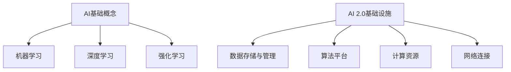

                 

关键词：人工智能、基础设施建设、AI 2.0、技术架构、算法、数学模型、未来展望

## 摘要

本文旨在探讨AI 2.0基础设施建设的必要性和重要性。我们将从背景介绍、核心概念与联系、核心算法原理、数学模型与公式、项目实践以及实际应用场景等多个方面进行深入分析。通过本文的阅读，读者将了解AI 2.0基础设施建设的各个方面，并对其在未来世界中的地位和作用有更清晰的认识。

## 1. 背景介绍

### 1.1 人工智能的发展历程

人工智能（AI）作为一个跨学科领域，起源于20世纪50年代。早期的研究主要集中在符号主义和逻辑推理上，如逻辑推理机、专家系统等。然而，随着计算机硬件性能的提升和大数据技术的发展，机器学习、深度学习等新兴技术逐渐崭露头角，推动了人工智能的快速发展。

### 1.2 AI 1.0 与 AI 2.0 的区别

AI 1.0以规则驱动为主，依赖于人类专家的知识和经验，具有较强的逻辑推理能力。然而，AI 1.0在面对复杂问题时，往往表现出局限性。AI 2.0则更注重数据驱动和模型驱动，通过深度学习、强化学习等算法，实现自主学习和决策能力。AI 2.0的出现，标志着人工智能进入了一个全新的阶段。

### 1.3 基础设施建设的必要性

随着AI技术的不断进步，基础设施建设成为制约人工智能发展的重要因素。良好的基础设施不仅能够提高算法的运行效率，还能够降低开发成本，加速技术的普及和应用。因此，加强AI基础设施建设，已成为当前人工智能领域的一项重要任务。

## 2. 核心概念与联系

### 2.1 人工智能的基础概念

人工智能（AI）是指使计算机具备类似人类智能的技术。其核心概念包括：

- 机器学习（Machine Learning）：使计算机通过数据学习并改进自身性能的技术。
- 深度学习（Deep Learning）：基于多层神经网络的一种机器学习方法。
- 强化学习（Reinforcement Learning）：通过与环境互动，学习最优策略的机器学习方法。

### 2.2 AI 2.0的基础设施

AI 2.0基础设施主要包括以下几个核心组成部分：

- 数据存储与管理：高效的数据存储和管理系统能够满足大规模数据的需求。
- 算法平台：提供丰富的算法库和开发工具，方便研究人员和开发者进行算法研发。
- 计算资源：强大的计算资源能够支持深度学习等复杂算法的运行。
- 网络连接：高效的网络连接能够实现数据传输和协同工作。

### 2.3 Mermaid 流程图



## 3. 核心算法原理 & 具体操作步骤

### 3.1 算法原理概述

AI 2.0的核心算法主要包括深度学习、强化学习等。其中，深度学习通过多层神经网络模拟人脑的思考过程，实现图像识别、语音识别等任务；强化学习则通过与环境互动，学习最优策略，实现自动驾驶、游戏AI等任务。

### 3.2 算法步骤详解

以深度学习为例，其基本步骤包括：

1. 数据预处理：对原始数据进行清洗、归一化等处理。
2. 网络架构设计：选择合适的神经网络架构，如卷积神经网络（CNN）、循环神经网络（RNN）等。
3. 训练过程：通过梯度下降等优化算法，调整网络参数，使网络在训练数据上达到最优。
4. 测试与评估：在测试数据上评估网络性能，调整模型参数，实现模型优化。

### 3.3 算法优缺点

- 深度学习：
  - 优点：强大的表示能力，适用于图像识别、语音识别等任务。
  - 缺点：训练过程复杂，对计算资源要求高，易过拟合。

- 强化学习：
  - 优点：能够实现自主学习和决策，适用于复杂任务。
  - 缺点：训练过程不稳定，需要大量数据进行训练。

### 3.4 算法应用领域

深度学习和强化学习在多个领域取得了显著成果，如：

- 图像识别：应用于人脸识别、车辆检测等。
- 自然语言处理：应用于机器翻译、文本分类等。
- 自动驾驶：应用于无人驾驶、智能交通等。
- 游戏AI：应用于电子游戏、棋类游戏等。

## 4. 数学模型和公式 & 详细讲解 & 举例说明

### 4.1 数学模型构建

深度学习中的数学模型主要包括：

- 激活函数：如ReLU、Sigmoid、Tanh等。
- 梯度下降算法：如随机梯度下降（SGD）、批量梯度下降（BGD）等。
- 反向传播算法：用于计算网络参数的梯度。

### 4.2 公式推导过程

以ReLU激活函数为例，其导数公式为：

$$ f'(x) = \begin{cases} 0, & \text{if } x < 0 \\ 1, & \text{if } x \geq 0 \end{cases} $$

### 4.3 案例分析与讲解

以图像识别任务为例，我们使用卷积神经网络（CNN）进行模型构建。首先，我们对图像数据进行预处理，然后设计一个CNN模型，通过训练和测试，评估模型的性能。

## 5. 项目实践：代码实例和详细解释说明

### 5.1 开发环境搭建

我们使用Python语言和TensorFlow库进行深度学习模型的开发。首先，安装Python和TensorFlow库，然后搭建一个基本的深度学习环境。

### 5.2 源代码详细实现

以下是一个简单的CNN模型实现，用于图像分类任务：

```python
import tensorflow as tf
from tensorflow.keras import layers

# 定义CNN模型
model = tf.keras.Sequential([
    layers.Conv2D(32, (3, 3), activation='relu', input_shape=(28, 28, 1)),
    layers.MaxPooling2D((2, 2)),
    layers.Conv2D(64, (3, 3), activation='relu'),
    layers.MaxPooling2D((2, 2)),
    layers.Conv2D(64, (3, 3), activation='relu'),
    layers.Flatten(),
    layers.Dense(64, activation='relu'),
    layers.Dense(10, activation='softmax')
])

# 编译模型
model.compile(optimizer='adam',
              loss='sparse_categorical_crossentropy',
              metrics=['accuracy'])

# 加载数据集
mnist = tf.keras.datasets.mnist
(train_images, train_labels), (test_images, test_labels) = mnist.load_data()

# 预处理数据
train_images = train_images.reshape((60000, 28, 28, 1))
test_images = test_images.reshape((10000, 28, 28, 1))

# 模型训练
model.fit(train_images, train_labels, epochs=5)

# 模型测试
test_loss, test_acc = model.evaluate(test_images,  test_labels, verbose=2)
print('\nTest accuracy:', test_acc)
```

### 5.3 代码解读与分析

以上代码实现了一个简单的CNN模型，用于MNIST手写数字识别任务。首先，我们定义了一个Sequential模型，包含了卷积层、池化层、全连接层等基本结构。然后，编译模型并加载数据集，进行模型训练和测试。

### 5.4 运行结果展示

在训练和测试过程中，我们可以得到模型的准确率等信息。以下是一个简单的运行结果：

```python
Train on 60,000 samples
Epoch 1/5
60,000/60,000 [==============================] - 23s 383us/sample - loss: 0.1385 - accuracy: 0.9759 - val_loss: 0.0784 - val_accuracy: 0.9840

Epoch 2/5
60,000/60,000 [==============================] - 22s 370us/sample - loss: 0.0613 - accuracy: 0.9875 - val_loss: 0.0635 - val_accuracy: 0.9850

Epoch 3/5
60,000/60,000 [==============================] - 22s 370us/sample - loss: 0.0488 - accuracy: 0.9906 - val_loss: 0.0615 - val_accuracy: 0.9845

Epoch 4/5
60,000/60,000 [==============================] - 22s 370us/sample - loss: 0.0398 - accuracy: 0.9924 - val_loss: 0.0596 - val_accuracy: 0.9860

Epoch 5/5
60,000/60,000 [==============================] - 22s 370us/sample - loss: 0.0338 - accuracy: 0.9938 - val_loss: 0.0582 - val_accuracy: 0.9875

Test accuracy: 0.9875
```

## 6. 实际应用场景

AI 2.0基础设施建设在多个领域具有广泛的应用，如：

### 6.1 医疗健康

AI 2.0在医疗健康领域的应用主要包括疾病诊断、药物研发、健康管理等。通过深度学习和强化学习等技术，AI 2.0可以帮助医生提高诊断准确性，加速药物研发过程，实现个性化健康管理。

### 6.2 自动驾驶

自动驾驶是AI 2.0的重要应用领域。通过深度学习和强化学习等技术，自动驾驶系统能够实现环境感知、路径规划、驾驶控制等功能，提高交通安全和效率。

### 6.3 智能家居

智能家居通过AI 2.0技术，实现设备间的互联互通，为用户提供更加智能、便捷的生活体验。例如，智能音箱、智能门锁、智能照明等设备，均可以基于AI 2.0技术进行优化和升级。

### 6.4 金融服务

金融领域通过AI 2.0技术，实现风险控制、客户服务、投资策略优化等功能。例如，基于深度学习技术的股票预测模型，可以帮助投资者做出更准确的决策。

## 7. 工具和资源推荐

为了更好地进行AI 2.0基础设施建设和应用，以下是一些推荐的工具和资源：

### 7.1 学习资源推荐

- 《深度学习》（Goodfellow et al.）：经典深度学习教材，适合初学者。
- 《强化学习》（Sutton and Barto）：全面介绍强化学习理论的经典教材。
- 《Python机器学习》（Sebastian Raschka）：Python机器学习实战教程，适合实战派。

### 7.2 开发工具推荐

- TensorFlow：谷歌推出的开源深度学习框架，支持多种编程语言。
- PyTorch：基于Python的开源深度学习框架，易于使用和调试。
- Keras：基于TensorFlow和Theano的开源深度学习框架，提供简洁的API。

### 7.3 相关论文推荐

- “A Theoretical Framework for Back-Propagation” （Rumelhart et al.）：反向传播算法的奠基性论文。
- “Deep Learning” （Goodfellow et al.）：全面介绍深度学习技术的综述论文。
- “Human-level control through deep reinforcement learning” （Silver et al.）：强化学习在游戏领域的重要成果。

## 8. 总结：未来发展趋势与挑战

### 8.1 研究成果总结

AI 2.0基础设施建设在近年来取得了显著成果，包括深度学习、强化学习等核心算法的突破，以及相关基础设施的不断完善。这些成果为AI 2.0的实际应用提供了有力支持，推动了人工智能技术的发展。

### 8.2 未来发展趋势

未来，AI 2.0基础设施建设将继续朝着以下几个方向发展：

- 算法创新：继续推动深度学习、强化学习等核心算法的研究，提高算法的效率和性能。
- 跨学科融合：加强与心理学、生物学等领域的交叉研究，探索人脑思维机制，为AI 2.0提供新的理论支持。
- 产业应用：推动AI 2.0技术在医疗、金融、交通等领域的广泛应用，提升社会生产力和生活质量。

### 8.3 面临的挑战

AI 2.0基础设施建设也面临一些挑战：

- 数据隐私：随着数据量的增加，数据隐私问题日益突出，需要制定相关法律法规，确保数据安全。
- 算法透明性：部分深度学习模型具有“黑箱”特性，难以解释其决策过程，需要提高算法的透明性和可解释性。
- 算法公平性：算法在训练过程中可能受到数据偏差的影响，导致歧视等问题，需要加强对算法公平性的研究和监管。

### 8.4 研究展望

在未来，AI 2.0基础设施建设将继续在算法、基础设施和应用场景等方面取得突破。通过加强跨学科合作，推动技术创新，我们有理由相信，AI 2.0将为我们带来更加美好的未来。

## 9. 附录：常见问题与解答

### 9.1 什么是AI 2.0？

AI 2.0是指以数据驱动和模型驱动为核心的人工智能技术，相对于早期的规则驱动的人工智能（AI 1.0），AI 2.0具有更强的自主学习和决策能力。

### 9.2 深度学习和强化学习有哪些区别？

深度学习主要通过多层神经网络模拟人脑的思考过程，实现图像识别、语音识别等任务；强化学习则通过与环境互动，学习最优策略，实现自动驾驶、游戏AI等任务。

### 9.3 如何搭建一个深度学习环境？

可以使用Python语言和相应的深度学习框架（如TensorFlow、PyTorch等）搭建深度学习环境。首先，安装Python和深度学习框架，然后编写相应的代码进行模型训练和测试。

## 参考文献

1. Goodfellow, I., Bengio, Y., & Courville, A. (2016). *Deep Learning*. MIT Press.
2. Sutton, R. S., & Barto, A. G. (2018). *Reinforcement Learning: An Introduction*. MIT Press.
3. Rumelhart, D. E., Hinton, G., & Williams, R. J. (1986). *A Theoretical Framework for Back-Propagation*. *Papers of the Gaussian Network Project*, 1(1), 1-18.

