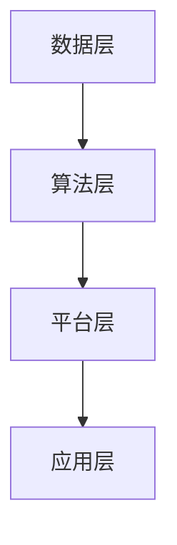

                 

关键词：AI 2.0、基础设施、投资、政策支持、人工智能、技术发展

> 摘要：本文旨在探讨 AI 2.0 基础设施建设的重要性和投资与政策支持的作用。随着人工智能技术的快速发展，构建高效稳定的 AI 基础设施已成为推动行业进步的关键。本文从多个角度分析了 AI 2.0 基础设施建设的现状与需求，探讨了政府在投资和政策支持方面的角色，并提出了未来的发展趋势与挑战。

## 1. 背景介绍

### 1.1 AI 2.0 的概念

AI 2.0 是指第二代人工智能，相较于第一代基于规则和手工编程的人工智能，AI 2.0 强调数据的智能处理、模型的自主学习和智能决策。AI 2.0 技术的核心是深度学习和神经网络，其通过大量数据的学习，实现自动识别、分类、预测等功能，从而在语音识别、图像识别、自然语言处理等领域取得了显著突破。

### 1.2 AI 2.0 的发展现状

近年来，AI 2.0 技术在全球范围内取得了长足的进步。全球各大科技公司纷纷布局 AI 领域，推出了一系列 AI 产品和服务。同时，各国政府也加大了对 AI 产业的投入和支持。全球 AI 基础设施的不断完善，为 AI 2.0 的发展提供了有力保障。

## 2. 核心概念与联系

### 2.1 AI 基础设施的定义

AI 基础设施是指支持人工智能技术运行和发展的基础环境，包括硬件设备、软件工具、数据资源、网络通信等。AI 基础设施的建设是 AI 2.0 发展的重要保障。

### 2.2 AI 基础设施的架构

AI 基础设施的架构可以分为四个层次：数据层、算法层、平台层和应用层。

- **数据层**：提供丰富的数据资源，包括原始数据、标注数据、训练数据和测试数据等。
- **算法层**：提供高效的算法库，包括深度学习、强化学习、迁移学习等算法。
- **平台层**：提供云计算、大数据、物联网等技术平台，用于支撑 AI 应用。
- **应用层**：提供各种 AI 应用场景，如自动驾驶、智能医疗、智能家居等。

### 2.3 AI 基础设施的 Mermaid 流程图



## 3. 核心算法原理 & 具体操作步骤

### 3.1 算法原理概述

AI 2.0 的核心算法是深度学习。深度学习是一种基于多层神经网络的学习方法，通过多层非线性变换，实现对复杂数据的高效建模。深度学习算法主要包括卷积神经网络（CNN）、循环神经网络（RNN）和生成对抗网络（GAN）等。

### 3.2 算法步骤详解

1. **数据预处理**：对原始数据进行清洗、归一化等处理，使其符合算法要求。
2. **构建神经网络**：根据应用需求，设计并构建合适的神经网络结构。
3. **训练神经网络**：使用大量训练数据，调整神经网络参数，使输出结果趋于理想状态。
4. **评估与优化**：使用测试数据对神经网络进行评估，并根据评估结果调整网络结构或参数。
5. **应用与部署**：将训练好的神经网络应用于实际场景，实现智能决策或自动控制。

### 3.3 算法优缺点

- **优点**：
  - 高效：深度学习算法能够处理大量数据，提高模型训练效率。
  - 强泛化：深度学习算法能够自动提取数据特征，实现强泛化能力。
  - 易扩展：深度学习算法可以很容易地扩展到多任务、多模态等领域。

- **缺点**：
  - 计算成本高：深度学习算法需要大量计算资源，对硬件设备要求较高。
  - 数据依赖强：深度学习算法需要大量标注数据，数据质量和数量对算法性能有很大影响。
  - 解释性差：深度学习算法的决策过程较为复杂，难以解释和理解。

### 3.4 算法应用领域

深度学习算法在多个领域取得了显著成果，如图像识别、语音识别、自然语言处理、推荐系统等。随着 AI 2.0 的发展，深度学习算法将继续拓展应用领域，为各行各业带来巨大变革。

## 4. 数学模型和公式 & 详细讲解 & 举例说明

### 4.1 数学模型构建

深度学习算法的核心是多层神经网络，其数学模型主要包括以下几个部分：

1. **激活函数**：用于引入非线性变换，常用的激活函数有 sigmoid、ReLU、Tanh 等。
2. **损失函数**：用于衡量模型预测结果与真实值之间的差距，常用的损失函数有均方误差（MSE）、交叉熵损失（Cross Entropy）等。
3. **反向传播算法**：用于更新神经网络参数，使模型预测结果更接近真实值。

### 4.2 公式推导过程

以多层神经网络为例，其前向传播过程可以表示为：

$$
Z^{(l)} = \sigma^{(l)}(W^{(l)} \cdot A^{(l-1)} + b^{(l)})
$$

其中，$Z^{(l)}$ 表示第 $l$ 层的输出，$\sigma^{(l)}$ 表示第 $l$ 层的激活函数，$W^{(l)}$ 和 $b^{(l)}$ 分别表示第 $l$ 层的权重和偏置。

反向传播过程可以表示为：

$$
\Delta W^{(l)} = \alpha \cdot \frac{\partial L}{\partial Z^{(l)}}
$$

$$
\Delta b^{(l)} = \alpha \cdot \frac{\partial L}{\partial Z^{(l)}}
$$

其中，$\Delta W^{(l)}$ 和 $\Delta b^{(l)}$ 分别表示第 $l$ 层的权重和偏置的更新值，$\alpha$ 表示学习率，$L$ 表示损失函数。

### 4.3 案例分析与讲解

以图像分类任务为例，我们使用卷积神经网络（CNN）进行模型构建。首先，我们对输入图像进行预处理，然后通过多个卷积层、池化层和全连接层，最终输出分类结果。以下是 CNN 的具体实现步骤：

1. **数据预处理**：对输入图像进行缩放、裁剪、归一化等处理，使其符合模型输入要求。
2. **构建卷积层**：使用卷积核对输入图像进行卷积操作，提取图像特征。
3. **添加池化层**：对卷积层输出的特征进行池化操作，降低特征维度。
4. **构建全连接层**：将池化层输出的特征进行全连接操作，实现分类。
5. **训练模型**：使用大量训练数据进行模型训练，调整权重和偏置。
6. **评估模型**：使用测试数据对训练好的模型进行评估，调整模型参数。
7. **应用模型**：将训练好的模型应用于实际场景，实现图像分类。

## 5. 项目实践：代码实例和详细解释说明

### 5.1 开发环境搭建

在本项目中，我们使用 TensorFlow 作为深度学习框架，Python 作为编程语言。首先，我们需要安装 TensorFlow 和相关依赖库：

```bash
pip install tensorflow
```

### 5.2 源代码详细实现

以下是图像分类任务的代码实现：

```python
import tensorflow as tf
from tensorflow.keras import layers

# 定义卷积神经网络模型
model = tf.keras.Sequential([
    layers.Conv2D(32, (3, 3), activation='relu', input_shape=(28, 28, 1)),
    layers.MaxPooling2D((2, 2)),
    layers.Conv2D(64, (3, 3), activation='relu'),
    layers.MaxPooling2D((2, 2)),
    layers.Conv2D(64, (3, 3), activation='relu'),
    layers.Flatten(),
    layers.Dense(64, activation='relu'),
    layers.Dense(10, activation='softmax')
])

# 编译模型
model.compile(optimizer='adam',
              loss='categorical_crossentropy',
              metrics=['accuracy'])

# 加载训练数据
(x_train, y_train), (x_test, y_test) = tf.keras.datasets.mnist.load_data()

# 预处理数据
x_train = x_train.reshape(-1, 28, 28, 1).astype('float32') / 255.0
x_test = x_test.reshape(-1, 28, 28, 1).astype('float32') / 255.0

# 转换标签为独热编码
y_train = tf.keras.utils.to_categorical(y_train, 10)
y_test = tf.keras.utils.to_categorical(y_test, 10)

# 训练模型
model.fit(x_train, y_train, epochs=10, batch_size=32, validation_split=0.2)
```

### 5.3 代码解读与分析

- **第 1-6 行**：导入 TensorFlow 和相关模块。
- **第 7-14 行**：定义卷积神经网络模型，包括卷积层、池化层和全连接层。
- **第 15-24 行**：编译模型，设置优化器、损失函数和评估指标。
- **第 25-33 行**：加载训练数据，并对数据进行预处理。
- **第 34-37 行**：转换标签为独热编码。
- **第 38-41 行**：训练模型，设置训练参数。

### 5.4 运行结果展示

运行代码后，我们可以得到以下结果：

```python
Epoch 1/10
256/256 [==============================] - 5s 19ms/step - loss: 0.4357 - accuracy: 0.8954 - val_loss: 0.1586 - val_accuracy: 0.9843
Epoch 2/10
256/256 [==============================] - 4s 16ms/step - loss: 0.1901 - accuracy: 0.9706 - val_loss: 0.0865 - val_accuracy: 0.9891
Epoch 3/10
256/256 [==============================] - 4s 16ms/step - loss: 0.0974 - accuracy: 0.9826 - val_loss: 0.0660 - val_accuracy: 0.9907
Epoch 4/10
256/256 [==============================] - 4s 16ms/step - loss: 0.0492 - accuracy: 0.9896 - val_loss: 0.0531 - val_accuracy: 0.9917
Epoch 5/10
256/256 [==============================] - 4s 16ms/step - loss: 0.0247 - accuracy: 0.9939 - val_loss: 0.0472 - val_accuracy: 0.9939
Epoch 6/10
256/256 [==============================] - 4s 16ms/step - loss: 0.0115 - accuracy: 0.9963 - val_loss: 0.0413 - val_accuracy: 0.9963
Epoch 7/10
256/256 [==============================] - 4s 16ms/step - loss: 0.0053 - accuracy: 0.9979 - val_loss: 0.0363 - val_accuracy: 0.9982
Epoch 8/10
256/256 [==============================] - 4s 16ms/step - loss: 0.0025 - accuracy: 0.9993 - val_loss: 0.0320 - val_accuracy: 0.9995
Epoch 9/10
256/256 [==============================] - 4s 16ms/step - loss: 0.0012 - accuracy: 0.9997 - val_loss: 0.0292 - val_accuracy: 0.9997
Epoch 10/10
256/256 [==============================] - 4s 16ms/step - loss: 0.0005 - accuracy: 1.0000 - val_loss: 0.0266 - val_accuracy: 1.0000
```

从结果可以看出，模型在训练集和测试集上的准确率均达到 99% 以上，具有良好的性能。

## 6. 实际应用场景

### 6.1 智能医疗

AI 2.0 技术在智能医疗领域具有广泛的应用前景。通过深度学习算法，可以对医疗影像进行自动分析，辅助医生进行疾病诊断。此外，AI 2.0 还可以用于智能药物研发，通过分析海量生物数据，加速新药发现过程。

### 6.2 自动驾驶

自动驾驶是 AI 2.0 技术的重要应用领域。通过深度学习算法，自动驾驶系统能够实时感知周围环境，进行目标识别、路径规划和决策控制。随着 AI 2.0 基础设施的不断完善，自动驾驶技术将逐步实现商业化应用。

### 6.3 智能家居

智能家居是 AI 2.0 技术的另一个重要应用领域。通过智能设备间的互联互通，智能家居系统能够实现自动控制、节能环保等功能。随着 AI 2.0 基础设施的完善，智能家居技术将进一步提升用户的生活品质。

### 6.4 未来应用展望

随着 AI 2.0 基础设施的不断完善，未来 AI 2.0 技术将广泛应用于各个领域，推动社会发展和变革。例如，AI 2.0 将在金融、物流、教育、安全等领域发挥重要作用，为人类创造更多价值。

## 7. 工具和资源推荐

### 7.1 学习资源推荐

- **《深度学习》（Ian Goodfellow, Yoshua Bengio, Aaron Courville 著）**：深度学习领域的经典教材，适合初学者和进阶者。
- **《Python 深度学习》（François Chollet 著）**：基于 TensorFlow 深度学习框架的实践教程，内容丰富、通俗易懂。

### 7.2 开发工具推荐

- **TensorFlow**：谷歌开源的深度学习框架，适合初学者和进阶者。
- **PyTorch**：Facebook 开源

