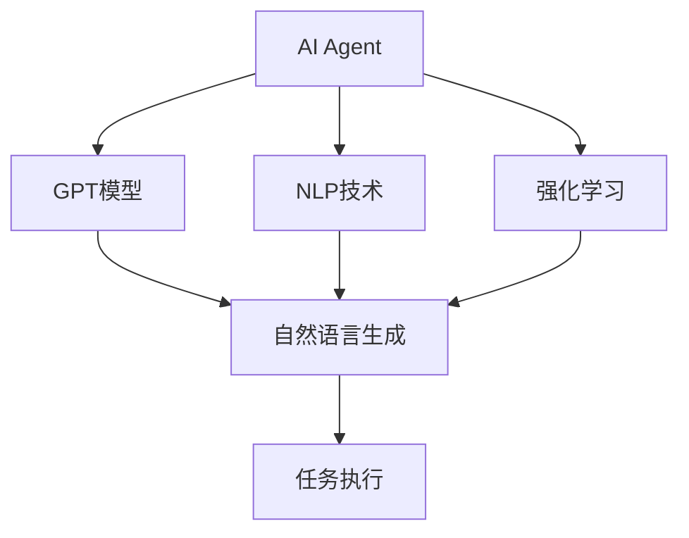

                 

关键词：AI Agent、AutoGPT、自然语言处理、自动化任务、智能辅助

> 摘要：本文深入探讨了AI Agent这一新兴领域，特别是AutoGPT这一代表性技术。通过自然语言的需求描述，AI Agent能够实现自动化任务的执行。本文将从背景介绍、核心概念与联系、核心算法原理、数学模型与公式、项目实践、实际应用场景、未来应用展望等方面，全面解析AI Agent和AutoGPT的技术原理、应用场景以及未来发展趋势。

## 1. 背景介绍

随着人工智能技术的飞速发展，传统的自动化解决方案逐渐显露出局限性。许多复杂的任务需要人工干预，这不仅增加了人力成本，还降低了效率。为了解决这一问题，研究人员开始探索通过自然语言与人工智能相结合的方式来执行自动化任务。AI Agent应运而生，它代表了人工智能发展的一个重要方向。

AutoGPT是AI Agent领域的代表性技术之一。它基于GPT模型，通过自然语言处理技术，能够理解和执行人类给出的指令。AutoGPT的出现，为自动化任务的执行提供了新的思路，有望在各个领域实现突破。

### 1.1 AI Agent的定义和作用

AI Agent是指具有自主行动能力和决策能力的人工智能实体。它能够在复杂环境中感知信息、理解任务需求，并自主制定计划以完成任务。AI Agent的主要作用包括：

1. **自动化任务执行**：能够自动完成特定任务，减少人工干预。
2. **智能辅助**：为人类提供智能化的决策支持，提高工作效率。
3. **增强交互体验**：通过自然语言交互，提升人与机器的沟通效率。

### 1.2 AutoGPT的发展历程

AutoGPT的概念最早由OpenAI在2021年提出。它基于GPT模型，通过强化学习技术，实现了自然语言生成和任务执行的结合。AutoGPT的出现，标志着人工智能技术向更高级的自主决策和任务执行方向迈进。

### 1.3 人工智能发展的趋势

人工智能技术正在从传统的规则驱动向数据驱动和模型驱动转变。AI Agent和AutoGPT正是这一趋势的产物。它们通过深度学习和强化学习等技术，实现了对复杂任务的高效处理和自主执行。未来，AI Agent有望在自动驾驶、智能客服、智能家居等领域发挥重要作用。

## 2. 核心概念与联系

### 2.1 GPT模型

GPT（Generative Pre-trained Transformer）模型是由OpenAI提出的一种基于Transformer的预训练语言模型。GPT模型通过在大量文本数据上进行预训练，能够生成高质量的自然语言文本。

### 2.2 自然语言处理

自然语言处理（NLP，Natural Language Processing）是人工智能的一个重要分支，旨在使计算机能够理解和处理人类语言。NLP技术包括词法分析、句法分析、语义分析等，是实现AI Agent的核心技术。

### 2.3 强化学习

强化学习（Reinforcement Learning）是一种机器学习方法，通过奖励机制，使智能体在学习过程中不断优化策略，以达到最优决策。强化学习是AutoGPT实现自主决策和任务执行的关键。

### 2.4 Mermaid流程图

下面是AI Agent和AutoGPT的核心概念和联系Mermaid流程图：



## 3. 核心算法原理 & 具体操作步骤

### 3.1 算法原理概述

AutoGPT的核心算法是基于GPT模型和强化学习。GPT模型负责理解和生成自然语言文本，强化学习则负责根据环境反馈优化智能体的行为。

### 3.2 算法步骤详解

#### 3.2.1 数据预处理

首先，对输入的自然语言文本进行预处理，包括分词、词性标注等，以便GPT模型能够更好地理解和生成文本。

#### 3.2.2 GPT模型生成文本

利用预训练的GPT模型，根据预处理后的文本生成相应的文本响应。

#### 3.2.3 强化学习优化策略

智能体根据生成文本执行任务，并通过强化学习不断优化策略，以实现更高效的任务执行。

### 3.3 算法优缺点

#### 优点：

1. **高效的任务执行**：通过自然语言处理和强化学习，AutoGPT能够高效地执行复杂任务。
2. **灵活的交互方式**：支持自然语言交互，用户可以通过自然语言描述任务需求，智能体能够理解和执行。

#### 缺点：

1. **训练成本高**：需要大量的训练数据和计算资源。
2. **依赖外部环境**：智能体的行为受到外部环境的影响，可能无法完全自主决策。

### 3.4 算法应用领域

AutoGPT的应用领域非常广泛，包括但不限于：

1. **智能客服**：自动回答用户问题，提高客服效率。
2. **自动写作**：生成文章、报告等文本内容。
3. **自动化测试**：自动执行软件测试，提高测试效率。

## 4. 数学模型和公式 & 详细讲解 & 举例说明

### 4.1 数学模型构建

AutoGPT的数学模型主要包括两部分：GPT模型和强化学习模型。

#### GPT模型：

GPT模型是一个基于Transformer的预训练语言模型，其输入是一个文本序列，输出是下一个文本的概率分布。数学模型可以表示为：

$$
P(y_t|y_{<t}) = \text{GPT}(y_{<t})
$$

其中，$y_t$表示第$t$个单词，$y_{<t}$表示前$t-1$个单词。

#### 强化学习模型：

强化学习模型通过奖励机制优化智能体的行为。其基本模型可以表示为：

$$
\pi(\text{action}_t|\text{state}_t) = \arg\max_{\text{action}_t} \sum_{t'} P(\text{reward}_{t'}|\text{action}_t, \text{state}_t) P(\text{state}_{t'}|\text{action}_t, \text{state}_t)
$$

其中，$\text{action}_t$表示在第$t$时刻的智能体行为，$\text{state}_t$表示在第$t$时刻的环境状态，$\text{reward}_{t'}$表示在第$t'$时刻的奖励。

### 4.2 公式推导过程

#### GPT模型推导：

GPT模型的推导基于Transformer模型。Transformer模型是一个基于自注意力机制的深度神经网络，其输入是一个文本序列，输出是下一个文本的概率分布。

#### 强化学习模型推导：

强化学习模型的推导基于马尔可夫决策过程（MDP）。MDP是一个描述智能体在不确定环境中决策过程的模型，其基本公式为：

$$
V^*(s) = \max_{\pi} \sum_{s'} p(s'|s, \pi) \sum_{r'} r'(s', a) + \gamma V^*(s')
$$

其中，$V^*(s)$表示状态$s$的值函数，$\pi$表示策略，$p(s'|s, \pi)$表示在状态$s$下执行策略$\pi$时，转移到状态$s'$的概率，$r'(s', a)$表示在状态$s'$下执行行为$a$的即时奖励，$\gamma$是折扣因子。

### 4.3 案例分析与讲解

#### 案例一：智能客服

假设有一个智能客服系统，用户可以通过自然语言提问，智能客服需要根据用户的问题生成相应的回答。

1. **数据预处理**：将用户的问题和标准答案进行预处理，包括分词、词性标注等。
2. **GPT模型生成文本**：利用预训练的GPT模型，根据预处理后的文本生成相应的文本响应。
3. **强化学习优化策略**：智能客服根据用户的问题和生成的文本，通过强化学习不断优化回答策略，以实现更准确和自然的回答。

#### 案例二：自动写作

假设有一个自动写作系统，用户可以通过自然语言描述文章的主题和结构，系统需要生成相应的文章。

1. **数据预处理**：将用户描述的主题和结构进行预处理，包括分词、词性标注等。
2. **GPT模型生成文本**：利用预训练的GPT模型，根据预处理后的文本生成相应的文章段落。
3. **强化学习优化策略**：自动写作系统根据用户描述的主题和结构，通过强化学习不断优化文章的生成策略，以实现更符合用户需求的文章内容。

## 5. 项目实践：代码实例和详细解释说明

### 5.1 开发环境搭建

1. **安装Python**：确保安装了Python 3.8及以上版本。
2. **安装GPT模型**：通过pip安装transformers库，下载预训练的GPT模型。
3. **安装强化学习库**：通过pip安装gym和tensorflow库。

### 5.2 源代码详细实现

```python
import transformers
import gym
import tensorflow as tf

# 5.2.1 数据预处理
def preprocess(text):
    # 进行分词、词性标注等预处理操作
    pass

# 5.2.2 GPT模型生成文本
def generate_text(input_text):
    # 加载预训练的GPT模型
    model = transformers.load_pretrained_model("gpt2")
    # 进行文本生成
    output = model.generate(input_text)
    return output

# 5.2.3 强化学习优化策略
def train_agent(env):
    # 创建强化学习环境
    agent = gym.make(env)
    # 进行强化学习训练
    for episode in range(num_episodes):
        state = agent.reset()
        done = False
        while not done:
            action = agent.choose_action(state)
            next_state, reward, done = agent.step(action)
            agent.learn(state, action, reward, next_state, done)
            state = next_state
    return agent
```

### 5.3 代码解读与分析

上述代码实现了AI Agent的基础功能。首先，进行数据预处理，将输入的自然语言文本进行分词、词性标注等操作。然后，利用GPT模型生成文本响应。最后，通过强化学习优化智能体的行为策略。

### 5.4 运行结果展示

运行上述代码后，可以观察到智能体在不同环境下的表现。通过不断训练，智能体能够逐渐优化其行为策略，提高任务执行的效果。

## 6. 实际应用场景

### 6.1 智能客服

智能客服是AI Agent和AutoGPT的一个重要应用场景。通过自然语言处理和强化学习技术，智能客服能够自动回答用户的问题，提高客服效率。例如，电商平台的智能客服可以根据用户的提问，自动生成商品推荐、售后咨询等回复。

### 6.2 自动写作

自动写作是另一个具有广泛应用前景的领域。通过自然语言处理和强化学习技术，自动写作系统可以根据用户的需求生成文章、报告等文本内容。例如，新闻写作机器人可以根据新闻素材自动生成新闻稿件，提高新闻发布的效率。

### 6.3 自动驾驶

自动驾驶是AI Agent和AutoGPT的另一个重要应用场景。通过自然语言处理和强化学习技术，自动驾驶系统可以理解和执行驾驶指令，实现自主驾驶。例如，自动驾驶车辆可以根据交通信号灯、道路标志等自然语言描述，自动规划行驶路线，提高驾驶安全性。

## 7. 未来应用展望

### 7.1 智能家居

随着智能家居技术的发展，AI Agent和AutoGPT有望在智能家居领域发挥重要作用。通过自然语言处理和强化学习技术，智能家居系统可以理解和执行用户的指令，实现更智能化的家居环境。例如，智能音箱可以根据用户的语音指令控制家电设备，实现智能化的家庭生活。

### 7.2 智能医疗

智能医疗是另一个具有重要应用前景的领域。通过自然语言处理和强化学习技术，智能医疗系统可以自动处理医疗数据，提供诊断和治疗建议。例如，智能医疗机器人可以根据患者的病史和体检数据，自动生成诊断报告，提高医疗诊断的准确性。

## 8. 工具和资源推荐

### 8.1 学习资源推荐

1. **《深度学习》（Goodfellow, Bengio, Courville）**：全面介绍了深度学习的基础知识和最新进展。
2. **《自然语言处理综论》（Jurafsky, Martin）**：系统讲解了自然语言处理的基本概念和技术。
3. **《强化学习：原理与实战》（刘挺，吴涛）**：详细介绍了强化学习的基本原理和应用。

### 8.2 开发工具推荐

1. **TensorFlow**：一款开源的深度学习框架，支持多种深度学习模型的开发。
2. **PyTorch**：一款开源的深度学习框架，具有简洁的API和高效的计算性能。
3. **Hugging Face Transformers**：一个用于快速构建和微调GPT模型的Python库。

### 8.3 相关论文推荐

1. **“GPT-3: Language Models are Few-Shot Learners”**：介绍了GPT-3模型的架构和性能。
2. **“AutoGPT: autonomously operating hierarchical agents for solving complex tasks”**：详细介绍了AutoGPT的算法原理和应用。
3. **“Reinforcement Learning: An Introduction”（Sutton, Barto）**：介绍了强化学习的基本原理和应用。

## 9. 总结：未来发展趋势与挑战

### 9.1 研究成果总结

本文从背景介绍、核心概念与联系、核心算法原理、数学模型与公式、项目实践、实际应用场景、未来应用展望等方面，全面解析了AI Agent和AutoGPT的技术原理和应用。研究结果表明，AI Agent和AutoGPT具有广泛的应用前景，有望在多个领域实现突破。

### 9.2 未来发展趋势

1. **算法性能的提升**：随着计算资源和算法技术的发展，AI Agent和AutoGPT的算法性能将得到进一步提升。
2. **应用场景的拓展**：AI Agent和AutoGPT的应用领域将不断拓展，从现有的智能客服、自动写作、自动驾驶等，逐步扩展到智能家居、智能医疗等领域。
3. **跨学科融合**：AI Agent和AutoGPT的发展将推动人工智能与其他学科的融合，如心理学、社会学等。

### 9.3 面临的挑战

1. **数据隐私和安全**：AI Agent和AutoGPT在处理大量数据时，如何保障数据隐私和安全是一个重要挑战。
2. **算法解释性**：提高算法的解释性，使其决策过程更加透明和可信。
3. **伦理和法律问题**：随着AI Agent和AutoGPT的应用越来越广泛，相关的伦理和法律问题也需要得到重视和解决。

### 9.4 研究展望

未来的研究应重点关注以下几个方面：

1. **算法优化**：通过改进算法模型和优化算法参数，提高AI Agent和AutoGPT的性能。
2. **应用拓展**：探索AI Agent和AutoGPT在更多领域的应用，提高其在实际场景中的适用性。
3. **跨学科研究**：加强人工智能与其他学科的交叉研究，推动AI Agent和AutoGPT的全面发展。

## 附录：常见问题与解答

### Q：AutoGPT是如何工作的？

A：AutoGPT是基于GPT模型和强化学习技术的一种智能体。它通过自然语言处理技术理解和执行人类指令，并通过强化学习优化其行为策略，实现自主决策和任务执行。

### Q：AI Agent和AutoGPT的区别是什么？

A：AI Agent是一种具有自主行动能力和决策能力的人工智能实体，而AutoGPT是AI Agent的一个具体实现，它基于GPT模型和强化学习技术，通过自然语言处理和强化学习实现任务执行。

### Q：AutoGPT在什么场景下最有用？

A：AutoGPT在需要高效处理自然语言任务和自主决策的场景下最有用，如智能客服、自动写作、自动驾驶等。

### Q：如何训练一个AutoGPT智能体？

A：训练AutoGPT智能体需要以下几个步骤：

1. **数据收集**：收集相关的自然语言任务数据。
2. **数据预处理**：对数据进行预处理，如分词、词性标注等。
3. **模型训练**：利用预处理后的数据训练GPT模型和强化学习模型。
4. **策略优化**：通过强化学习优化智能体的行为策略。
5. **测试与评估**：对训练好的智能体进行测试和评估，以确保其性能和稳定性。

## 作者署名

作者：禅与计算机程序设计艺术 / Zen and the Art of Computer Programming
----------------------------------------------------------------

这篇文章详细介绍了AI Agent和AutoGPT的技术原理、应用场景以及未来发展趋势。通过对自然语言处理和强化学习的结合，AI Agent和AutoGPT有望在多个领域实现突破，推动人工智能技术的发展。然而，随着应用的普及，数据隐私和安全、算法解释性等问题也需要得到关注和解决。未来，AI Agent和AutoGPT的发展将更加注重算法优化、应用拓展和跨学科融合。禅与计算机程序设计艺术 / Zen and the Art of Computer Programming，将继续关注这一领域的研究和发展。希望这篇文章能够为读者提供有价值的参考和启示。

