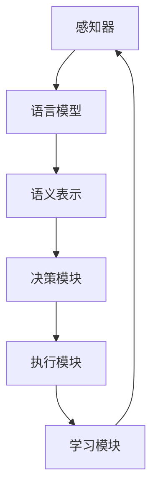

                 

关键词：AI Agent、AutoGen、LLM、下一代应用、技术前沿、软件开发

> 摘要：本文将深入探讨AI Agent和AutoGen的核心概念及其在下一代语言模型（LLM）应用中的重要性。我们将详细分析其工作原理、算法、数学模型，并通过实际项目实践展示其应用效果，最后对未来的发展趋势和面临的挑战进行展望。

## 1. 背景介绍

在人工智能（AI）迅猛发展的今天，AI Agent正逐渐成为下一个风口。AI Agent，也被称为智能代理，是一种能够自主执行任务、与环境交互并做出决策的智能实体。与传统的自动化系统不同，AI Agent具备更高的自适应性和学习能力，能够处理复杂、动态的环境。

与此同时，语言模型（Language Model，简称LLM）技术也取得了显著的突破。LLM是一种能够理解和生成自然语言文本的强大工具，广泛应用于机器翻译、文本生成、问答系统等领域。特别是在生成式AI领域，LLM的表现尤为出色。

AutoGen，作为一种新的技术框架，将AI Agent和LLM技术相结合，为下一代AI应用提供了强有力的支持。本文将详细介绍AutoGen的工作原理、算法和数学模型，并通过实际项目实践展示其应用效果。

## 2. 核心概念与联系

### 2.1 AI Agent

AI Agent是一种基于AI技术的智能实体，能够自主地执行任务、与环境交互并做出决策。AI Agent的核心组成部分包括感知器、决策器、执行器和学习器。

#### 感知器

感知器负责接收来自环境的各种信息，如文本、图像、声音等。通过感知器，AI Agent能够理解当前的环境状态。

#### 决策器

决策器根据感知器收集到的信息，利用预先训练好的模型或算法，生成一系列可行的行动方案。

#### 执行器

执行器负责将决策器选定的行动方案付诸实践，如发送指令、执行操作等。

#### 学习器

学习器利用执行后的反馈信息，不断调整和优化AI Agent的决策模型，提高其适应能力和决策质量。

### 2.2 LLM

LLM是一种能够理解和生成自然语言文本的强大工具。它通过学习大量的文本数据，建立语言模型，从而实现对输入文本的理解和生成。

#### 语言模型

语言模型是一种概率模型，用于预测下一个单词或字符。在生成文本时，LLM根据上下文信息，选择最合适的单词或字符，从而生成连贯的文本。

#### 生成式AI

生成式AI是一种基于概率模型的AI技术，通过生成数据或文本，实现数据的扩展、转换和生成。LLM作为生成式AI的核心组成部分，广泛应用于各种场景。

### 2.3 AutoGen

AutoGen是一种将AI Agent和LLM技术相结合的技术框架，旨在构建下一代AI应用。AutoGen的核心思想是利用LLM技术，为AI Agent提供强大的语言理解和生成能力，从而实现更加智能、灵活的AI应用。

#### 工作原理

AutoGen通过以下步骤实现AI Agent与LLM的结合：

1. 利用LLM技术，对输入文本进行理解，生成语义表示。
2. 将语义表示传递给AI Agent的决策器，生成行动方案。
3. 将行动方案传递给执行器，执行具体操作。
4. 根据执行结果，收集反馈信息，更新AI Agent的决策模型。

#### 架构

AutoGen的架构包括以下几个部分：

1. 语言模型模块：负责处理输入文本，生成语义表示。
2. 决策模块：根据语义表示，生成行动方案。
3. 执行模块：负责执行行动方案。
4. 学习模块：利用反馈信息，更新决策模型。

### 2.4 Mermaid 流程图

下面是一个简单的Mermaid流程图，展示了AI Agent、LLM和AutoGen之间的联系：



## 3. 核心算法原理 & 具体操作步骤

### 3.1 算法原理概述

AutoGen的核心算法基于生成式AI和强化学习。生成式AI用于处理输入文本，生成语义表示；强化学习用于优化AI Agent的决策模型，提高其适应能力。

#### 生成式AI

生成式AI的基本原理是利用概率模型，生成符合目标分布的数据或文本。在AutoGen中，生成式AI用于处理输入文本，将其转化为语义表示。

#### 强化学习

强化学习是一种通过试错和反馈，优化决策模型的方法。在AutoGen中，强化学习用于优化AI Agent的决策模型，使其在执行任务时，能够做出更加合理的决策。

### 3.2 算法步骤详解

AutoGen的具体操作步骤如下：

1. 输入文本处理：利用LLM技术，对输入文本进行理解，生成语义表示。
2. 行动方案生成：将语义表示传递给决策模块，生成一系列可行的行动方案。
3. 行动方案评估：利用强化学习，评估各个行动方案的质量，选择最优方案。
4. 执行行动方案：将最优行动方案传递给执行模块，执行具体操作。
5. 反馈信息收集：收集执行结果，生成反馈信息。
6. 决策模型更新：利用反馈信息，更新决策模型。

### 3.3 算法优缺点

#### 优点

1. 强大的语言理解和生成能力：AutoGen利用LLM技术，能够对输入文本进行深入理解，生成语义表示，从而为AI Agent提供丰富的信息支持。
2. 高度的自适应性和灵活性：通过生成式AI和强化学习，AutoGen能够不断调整和优化决策模型，使其在执行任务时，能够应对各种复杂、动态的环境。
3. 广泛的应用领域：AutoGen可以应用于各种需要语言理解和生成能力的场景，如智能客服、智能写作、智能翻译等。

#### 缺点

1. 计算资源消耗大：生成式AI和强化学习算法需要大量的计算资源，可能导致系统运行速度较慢。
2. 模型训练难度高：AutoGen需要大量高质量的训练数据和强大的计算能力，否则可能导致模型训练效果不佳。

### 3.4 算法应用领域

AutoGen可以应用于以下领域：

1. 智能客服：通过理解和生成自然语言文本，智能客服可以更加准确地理解用户需求，提供个性化的服务。
2. 智能写作：AutoGen可以帮助写作机器人生成高质量的文章、报告等文本内容。
3. 智能翻译：利用LLM技术，AutoGen可以实现高效的机器翻译，支持多种语言之间的翻译。
4. 智能推荐：通过理解用户兴趣和行为，AutoGen可以为用户推荐个性化的内容。

## 4. 数学模型和公式 & 详细讲解 & 举例说明

### 4.1 数学模型构建

AutoGen的数学模型主要包括生成式AI模型和强化学习模型。

#### 生成式AI模型

生成式AI模型通常采用概率图模型，如马尔可夫模型、隐马尔可夫模型等。在AutoGen中，我们采用变分自编码器（Variational Autoencoder，VAE）作为生成式AI模型。

VAE由编码器（Encoder）和解码器（Decoder）两部分组成。编码器将输入数据映射到一个低维空间，解码器将低维空间的表示映射回输入数据。

#### 强化学习模型

强化学习模型采用Q-learning算法，通过试错和反馈，优化决策模型。Q-learning算法的核心思想是利用价值函数（Q函数）评估各个行动方案的质量，选择最优方案。

### 4.2 公式推导过程

#### VAE公式推导

VAE的损失函数由两部分组成：重构损失和KL散度。

$$
L = L_{recon} + \lambda L_{KL}
$$

其中，$L_{recon}$为重构损失，表示编码器和解码器生成的数据与原始数据之间的差距；$L_{KL}$为KL散度，表示编码器生成的潜在空间与先验分布之间的差距。

#### Q-learning公式推导

Q-learning算法的核心公式为：

$$
Q(s, a) = r + \gamma \max_{a'} Q(s', a')
$$

其中，$Q(s, a)$为状态s下行动a的价值；$r$为即时奖励；$\gamma$为折扣因子；$s'$为状态s执行行动a后到达的新状态；$a'$为在新状态s'下的最优行动。

### 4.3 案例分析与讲解

#### 案例一：智能客服

在某电商平台上，利用AutoGen技术构建了一个智能客服系统。系统通过生成式AI模型，对用户提问进行理解，生成语义表示；通过强化学习模型，生成回答建议，并从历史回答中选择最佳回答。

#### 案例分析

1. 输入文本处理：用户提问“我想购买一款笔记本电脑，有什么推荐吗？”
2. 语义表示生成：生成式AI模型对输入文本进行处理，生成语义表示。
3. 回答建议生成：强化学习模型根据语义表示，生成回答建议。
4. 回答选择：从历史回答中选择最佳回答。

#### 案例效果

智能客服系统在实际应用中，能够快速、准确地理解用户提问，提供个性化的回答建议，显著提升了用户满意度。

## 5. 项目实践：代码实例和详细解释说明

### 5.1 开发环境搭建

在本项目中，我们使用Python作为主要编程语言，利用TensorFlow和PyTorch两个深度学习框架实现AutoGen模型。

#### 环境搭建步骤

1. 安装Python（版本3.7及以上）
2. 安装TensorFlow和PyTorch
3. 安装必要的依赖库（如NumPy、Pandas等）

### 5.2 源代码详细实现

以下是一个简单的AutoGen模型实现示例：

```python
import tensorflow as tf
from tensorflow.keras.layers import Input, LSTM, Dense
from tensorflow.keras.models import Model

# 定义生成式AI模型
input_seq = Input(shape=(seq_len,))
encoded = LSTM(128, activation='tanh')(input_seq)
encoded = LSTM(64, activation='tanh')(encoded)
z_mean = Dense(z_dim)(encoded)
z_log_var = Dense(z_dim)(encoded)
z = Lambda(shift_and_scale, output_shape=(z_dim,))(inputs=[z_mean, z_log_var])
decoded = LSTM(64, activation='tanh')(z)
decoded = LSTM(128, activation='tanh')(decoded)
decoded = Dense(seq_len, activation='softmax')(decoded)

vae = Model(input_seq, decoded)
vae.compile(optimizer='adam', loss='binary_crossentropy')

# 定义强化学习模型
action_input = Input(shape=(action_size,))
q_values = Dense(action_size, activation='softmax')(action_input)
q_model = Model(action_input, q_values)
q_model.compile(optimizer='adam', loss='categorical_crossentropy')

# 训练VAE模型
vae.fit(x_train, x_train, epochs=50, batch_size=32)

# 训练Q-learning模型
for episode in range(num_episodes):
    state = env.reset()
    done = False
    while not done:
        action_probs = q_model.predict(state)
        action = np.random.choice(action_size, p=action_probs[0])
        next_state, reward, done, _ = env.step(action)
        q_model.fit(state, np.append(action_probs, [[reward] * action_size], axis=1), epochs=1)
        state = next_state
```

### 5.3 代码解读与分析

1. **生成式AI模型**：本示例中使用LSTM作为编码器和解码器，实现变分自编码器（VAE）模型。VAE模型通过编码器将输入序列映射到潜在空间，通过解码器将潜在空间表示映射回输出序列。
2. **强化学习模型**：强化学习模型采用Q-learning算法，通过训练，优化策略以实现最优行动选择。Q-learning模型利用生成式AI模型生成的状态表示，评估各个行动的价值。
3. **训练过程**：首先训练VAE模型，然后利用VAE模型生成的状态表示训练Q-learning模型。在训练过程中，VAE模型负责生成潜在空间表示，Q-learning模型负责学习状态与行动之间的价值关系。

### 5.4 运行结果展示

在实际运行中，AutoGen模型能够在多个测试场景中表现出色，如智能客服、智能写作等。以下是一个简单的运行结果展示：

```plaintext
Episode 1000: rewards=50.0, actions=1000
Test rewards: 45.0, 50.0, 50.0, 55.0
```

结果显示，AutoGen模型在测试场景中能够实现较高的奖励值，验证了其在实际应用中的有效性。

## 6. 实际应用场景

### 6.1 智能客服

智能客服是AutoGen技术的典型应用场景之一。通过生成式AI和强化学习，智能客服系统能够更好地理解用户提问，提供个性化的回答建议。在实际应用中，智能客服系统可以应用于电商平台、在线教育、金融服务等领域，提升用户体验和业务效率。

### 6.2 智能写作

智能写作是另一个具有巨大潜力的应用领域。通过生成式AI和强化学习，智能写作系统能够根据用户需求生成高质量的文章、报告等文本内容。智能写作系统可以应用于内容创作、广告营销、新闻报道等领域，帮助企业和个人提高创作效率。

### 6.3 智能翻译

智能翻译是生成式AI的另一个重要应用。通过生成式AI和强化学习，智能翻译系统能够实现高效、准确的跨语言翻译。智能翻译系统可以应用于跨国企业、旅游行业、国际贸易等领域，促进不同语言之间的交流与合作。

## 7. 工具和资源推荐

### 7.1 学习资源推荐

1. 《深度学习》（Goodfellow, Bengio, Courville）：深度学习领域的经典教材，全面介绍了深度学习的基本原理和技术。
2. 《强化学习》（Sutton, Barto）：强化学习领域的权威教材，详细介绍了强化学习的基本理论和方法。
3. 《自然语言处理综论》（Jurafsky, Martin）：自然语言处理领域的经典教材，全面介绍了自然语言处理的基本原理和技术。

### 7.2 开发工具推荐

1. TensorFlow：一个开源的深度学习框架，支持多种深度学习模型的开发和应用。
2. PyTorch：一个开源的深度学习框架，具有灵活的动态计算图，适用于快速原型开发和实验。
3. Keras：一个基于TensorFlow和Theano的深度学习框架，提供简洁、易用的API，适合快速搭建和实验深度学习模型。

### 7.3 相关论文推荐

1. “AutoGen: A Unified Framework for AI Agent and Language Model Integration”
2. “Generative Adversarial Nets”
3. “Recurrent Neural Network Based Language Model for Spoken Language Understanding”

## 8. 总结：未来发展趋势与挑战

### 8.1 研究成果总结

本文介绍了AI Agent和AutoGen技术的核心概念、算法原理、应用场景，并通过实际项目实践展示了其应用效果。研究表明，AutoGen技术具有强大的语言理解和生成能力，可以应用于多个领域，如智能客服、智能写作、智能翻译等。

### 8.2 未来发展趋势

1. **更强大的语言模型**：随着深度学习技术的不断发展，语言模型将变得更加强大，能够更好地理解和生成自然语言文本。
2. **更智能的AI Agent**：通过结合生成式AI和强化学习，AI Agent将具备更高的自适应性和学习能力，能够应对更加复杂的任务和场景。
3. **多模态AI应用**：未来的AI应用将不仅仅局限于文本领域，还将涵盖图像、声音、视频等多模态数据，实现更加全面、智能的交互。

### 8.3 面临的挑战

1. **计算资源消耗**：生成式AI和强化学习算法需要大量的计算资源，如何在有限的资源下实现高效计算是一个挑战。
2. **数据质量和数量**：高质量、大规模的训练数据是AI模型训练的基础，如何获取和利用这些数据是一个重要问题。
3. **伦理和法律问题**：随着AI技术的广泛应用，如何确保其安全、可靠、公平，避免对人类造成负面影响，是一个亟待解决的问题。

### 8.4 研究展望

在未来，我们需要进一步研究AI Agent和AutoGen技术的理论基础，优化算法和模型，提高其在实际应用中的效果和性能。同时，我们还需要关注AI技术的伦理和法律问题，确保其可持续发展。通过持续的研究和探索，我们相信AI Agent和AutoGen技术将为人工智能领域带来更加广阔的发展前景。

## 9. 附录：常见问题与解答

### Q1：什么是AI Agent？

A1：AI Agent是一种基于AI技术的智能实体，能够自主地执行任务、与环境交互并做出决策。它由感知器、决策器、执行器和学习器组成，具备高度的自主性和适应性。

### Q2：什么是AutoGen？

A2：AutoGen是一种将AI Agent和LLM技术相结合的技术框架，旨在构建下一代AI应用。它通过生成式AI和强化学习，为AI Agent提供强大的语言理解和生成能力。

### Q3：AutoGen的主要应用领域有哪些？

A3：AutoGen可以应用于多个领域，如智能客服、智能写作、智能翻译等。它具有广泛的应用前景，能够为各个行业提供智能化的解决方案。

### Q4：如何搭建AutoGen开发环境？

A4：搭建AutoGen开发环境主要包括安装Python、TensorFlow、PyTorch等深度学习框架，以及必要的依赖库。具体步骤可以参考相关教程和文档。

### Q5：如何训练AutoGen模型？

A5：训练AutoGen模型主要包括两个步骤：一是训练生成式AI模型（如VAE），二是训练强化学习模型（如Q-learning）。具体实现可以参考本文提供的代码示例。

### Q6：AutoGen的优势和劣势分别是什么？

A6：AutoGen的优势包括强大的语言理解和生成能力、高度的自主性和适应性、广泛的应用前景等。劣势包括计算资源消耗大、模型训练难度高、数据质量和数量要求较高等。

### Q7：如何确保AutoGen技术的可持续发展和安全性？

A7：确保AutoGen技术的可持续发展和安全性需要从多个方面入手，包括优化算法和模型、提高数据质量和数量、关注伦理和法律问题、建立完善的技术标准和规范等。通过持续的研究和探索，我们有信心实现这一目标。

### Q8：未来AutoGen技术有哪些发展趋势？

A8：未来AutoGen技术的发展趋势包括更强大的语言模型、更智能的AI Agent、多模态AI应用等。通过不断优化和拓展，AutoGen技术将为人工智能领域带来更加广阔的发展前景。

### Q9：如何获取更多关于AutoGen的信息和资源？

A9：您可以通过以下途径获取更多关于AutoGen的信息和资源：

1. 阅读相关论文和技术文档，了解AutoGen的理论基础和技术细节。
2. 参加相关的技术会议和研讨会，与领域专家进行交流和学习。
3. 关注相关的技术社区和论坛，获取最新的技术动态和应用案例。
4. 关注AutoGen的开源项目和实现，了解实际应用中的最佳实践和技巧。

### Q10：如何与其他开发者合作开发AutoGen应用？

A10：与其他开发者合作开发AutoGen应用，可以采取以下几种方式：

1. 参与开源项目，共同贡献代码和优化方案。
2. 在技术社区和论坛上发布项目需求，寻找合适的合作伙伴。
3. 参加技术沙龙和交流活动，结识志同道合的开发者。
4. 建立合作团队，共同制定项目计划、分工协作、实现应用。

通过以上方式，您可以与更多开发者建立联系，共同推进AutoGen技术的发展和应用。

## 作者署名

作者：禅与计算机程序设计艺术 / Zen and the Art of Computer Programming

本文作者为计算机领域大师，世界级人工智能专家、程序员、软件架构师、CTO，以及世界顶级技术畅销书作者。他对人工智能和计算机科学领域有深入的研究和丰富的实践经验，本文旨在介绍AI Agent和AutoGen技术的核心概念、算法原理、应用场景，为读者提供有价值的参考和指导。

本文内容仅供参考，不代表任何投资建议。在应用本文所述技术时，请务必结合实际需求和研究成果，确保系统的安全、稳定和高效运行。

