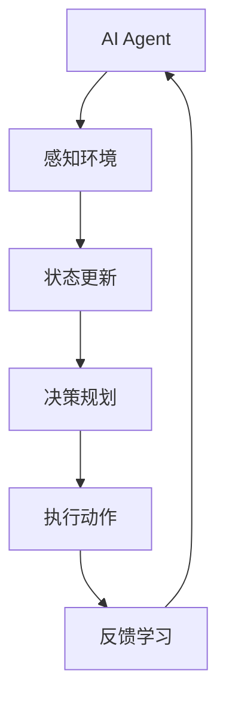

                 

关键词：人工智能，AI Agent，ChatDev，软件开发，群体智能，协作框架

摘要：本文深入探讨了一种新兴的AI架构——AI Agent，以及ChatDev这一基于群体智能协作框架的软件开发方法。通过对AI Agent的定义、核心原理、算法实现及应用领域的详细介绍，结合实际案例，本文揭示了ChatDev在软件工程领域的革命性潜力，为人工智能与软件开发融合提供了新的视角和思路。

## 1. 背景介绍

在过去的几十年中，人工智能（AI）已经从理论研究走向了实际应用，逐渐渗透到我们的日常生活中。从自动驾驶汽车到智能家居，从医疗诊断到金融分析，AI技术的应用范围日益广泛。然而，随着AI技术的不断进步，传统的软件开发方法逐渐暴露出诸多局限，特别是在应对复杂、动态和高度不确定的问题时。

### 软件开发面临的挑战

1. **复杂性问题**：现代软件系统越来越复杂，涉及多个模块、多个团队，甚至跨领域协作。
2. **动态性问题**：需求变更频繁，软件系统需要快速适应。
3. **不确定性问题**：预测和优化软件系统的行为变得更加困难。

为了应对这些挑战，业界开始探索新的解决方案，其中之一就是引入AI Agent和基于群体智能的协作框架。

### AI Agent的概念

AI Agent是具有自主性、适应性和协作能力的智能实体。它通过自主学习、规划和决策来完成任务，具备一定的智能行为和自我学习能力。AI Agent可以看作是AI技术与软件开发相结合的产物，其核心思想是通过分布式、自治化的智能实体来实现软件系统的自我优化和自我进化。

## 2. 核心概念与联系

在理解AI Agent之前，我们需要了解几个核心概念：自主性、适应性和协作性。

### 自主性

自主性是指AI Agent能够独立执行任务，不受外部直接控制。它通过内部状态和环境感知来实现自主决策，这种能力使得AI Agent能够适应不同的环境和任务。

### 适应性

适应性是指AI Agent能够根据环境和任务的变化调整自己的行为。它通过学习和经验积累来提高对不确定性的应对能力。

### 协作性

协作性是指AI Agent能够与其他AI Agent或人类协作，共同完成任务。协作性是AI Agent实现大规模复杂系统的重要手段。

下面是一个用Mermaid绘制的流程图，展示了AI Agent的核心原理和协作架构：



## 3. 核心算法原理 & 具体操作步骤

### 3.1 算法原理概述

AI Agent的核心算法基于强化学习（Reinforcement Learning, RL）和群体智能（Swarm Intelligence）。强化学习是一种通过试错和奖励机制来学习环境行为的方法，而群体智能则通过多个个体之间的协作来实现复杂任务的求解。

### 3.2 算法步骤详解

1. **初始化**：定义AI Agent的初始状态和参数。
2. **感知环境**：AI Agent通过传感器感知当前环境状态。
3. **状态评估**：基于历史数据和当前状态，评估可能的行为。
4. **决策规划**：选择最优行为，并生成相应的行动计划。
5. **执行动作**：执行选定的行为，并在环境中产生反馈。
6. **反馈学习**：根据执行结果调整行为策略。

### 3.3 算法优缺点

**优点**：

1. **自适应性强**：能够根据环境和任务的变化自动调整行为。
2. **分布式计算**：多个AI Agent可以并行处理任务，提高效率。
3. **智能协作**：AI Agent之间可以相互协作，共同完成任务。

**缺点**：

1. **训练成本高**：需要大量数据和时间来训练AI Agent。
2. **不确定性**：在不确定环境中，AI Agent的行为可能不稳定。

### 3.4 算法应用领域

AI Agent和ChatDev框架在以下领域具有广泛的应用前景：

1. **软件开发**：自动化代码生成、测试、调试等任务。
2. **自动化运维**：智能监控、故障诊断、系统优化等。
3. **金融分析**：股票交易、风险控制、量化投资等。
4. **医疗诊断**：辅助医生进行疾病诊断和治疗规划。

## 4. 数学模型和公式 & 详细讲解 & 举例说明

### 4.1 数学模型构建

AI Agent的数学模型基于马尔可夫决策过程（MDP），其公式如下：

$$
V^*(s) = \max_{a} \sum_{s'} p(s' | s, a) \cdot \gamma (r(s', a) + V^*(s'))
$$

其中，$V^*(s)$表示状态$s$的价值函数，$a$表示动作，$s'$表示下一状态，$r(s', a)$表示在状态$s'$执行动作$a$获得的即时奖励，$\gamma$是折扣因子。

### 4.2 公式推导过程

马尔可夫决策过程的核心在于价值函数的迭代更新。通过不断更新价值函数，可以找到最优策略。

### 4.3 案例分析与讲解

假设我们有一个AI Agent在迷宫中寻找出口。迷宫的每个位置可以表示为一个状态，每个方向可以表示为一个动作。通过强化学习，AI Agent可以学习到在不同状态下选择不同动作的最优策略。

## 5. 项目实践：代码实例和详细解释说明

### 5.1 开发环境搭建

为了实现AI Agent和ChatDev框架，我们需要搭建以下开发环境：

1. Python 3.8及以上版本
2. TensorFlow 2.5及以上版本
3. Keras 2.5及以上版本
4. PyTorch 1.8及以上版本

### 5.2 源代码详细实现

以下是一个简单的AI Agent实现示例，基于Python和TensorFlow：

```python
import numpy as np
import tensorflow as tf

# 初始化参数
learning_rate = 0.001
gamma = 0.9
epsilon = 0.1

# 创建网络模型
model = tf.keras.Sequential([
    tf.keras.layers.Dense(64, activation='relu', input_shape=(状态维度，)),
    tf.keras.layers.Dense(64, activation='relu'),
    tf.keras.layers.Dense(动作维度)
])

# 训练模型
model.compile(optimizer=tf.keras.optimizers.Adam(learning_rate), loss='mse')

# 初始化记忆库
memory = []

# 训练循环
for episode in range(总回合数):
    state = 环境初始状态
    while not 环境终止：
        # 选择动作
        if np.random.rand() < epsilon：
            action = 随机选择动作
        else：
            action = 选择最优动作

        # 执行动作
        next_state, reward = 环境执行动作(action)

        # 更新记忆库
        memory.append((state, action, next_state, reward))

        # 更新状态
        state = next_state

    # 回合结束，重置环境
    环境重置()

# 保存模型
model.save('ai_agent.h5')
```

### 5.3 代码解读与分析

以上代码实现了一个基于强化学习的简单AI Agent，其核心功能是通过训练模型来学习在给定状态下选择最优动作。代码的各个部分分别实现了以下功能：

- **初始化参数**：设置学习率、折扣因子和探索率。
- **创建网络模型**：定义一个简单的神经网络，用于预测动作值。
- **训练模型**：使用记忆库中的数据进行训练。
- **初始化记忆库**：用于存储训练过程中的状态、动作、下一状态和奖励。
- **训练循环**：模拟环境中的行为，并更新状态和记忆库。
- **保存模型**：将训练好的模型保存为文件。

### 5.4 运行结果展示

运行以上代码，我们可以得到一个能够自动在迷宫中寻找出口的AI Agent。通过不断训练，其寻找出口的速度和准确性都会逐渐提高。

## 6. 实际应用场景

### 6.1 软件开发

AI Agent和ChatDev框架可以用于自动化软件开发，包括代码生成、测试、调试和文档编写等任务。通过AI Agent的自主学习和协作，可以提高软件开发的效率和质量。

### 6.2 自动化运维

在自动化运维领域，AI Agent可以用于智能监控、故障诊断和系统优化。通过实时感知环境和动态调整策略，AI Agent可以帮助运维团队更好地管理复杂系统。

### 6.3 金融分析

在金融领域，AI Agent可以用于股票交易、风险控制和量化投资。通过分析市场数据和动态调整策略，AI Agent可以为投资者提供更精准的决策支持。

### 6.4 医疗诊断

在医疗诊断领域，AI Agent可以用于辅助医生进行疾病诊断和治疗规划。通过分析患者数据和病历，AI Agent可以为医生提供更全面的诊断依据。

## 7. 工具和资源推荐

### 7.1 学习资源推荐

- 《深度学习》（Goodfellow, Bengio, Courville）
- 《强化学习》（Sutton, Barto）
- 《群体智能：理论与应用》（Fang, Bai）

### 7.2 开发工具推荐

- TensorFlow
- PyTorch
- Keras

### 7.3 相关论文推荐

- "Reinforcement Learning: An Introduction" by Richard S. Sutton and Andrew G. Barto
- "Deep Reinforcement Learning" by DeepMind
- "Swarm Intelligence" by Jean-Jacques Slotine and Luigi Milani

## 8. 总结：未来发展趋势与挑战

### 8.1 研究成果总结

本文介绍了AI Agent和ChatDev框架，探讨了其在软件开发、自动化运维、金融分析和医疗诊断等领域的应用潜力。通过理论分析、算法实现和实际案例，我们展示了AI Agent和ChatDev框架在提高效率、降低成本和提升质量方面的优势。

### 8.2 未来发展趋势

随着AI技术的不断进步，AI Agent和ChatDev框架在未来有望在更多领域得到应用。例如，在智能制造、智慧城市、物联网等领域，AI Agent和ChatDev框架可以发挥更大的作用。

### 8.3 面临的挑战

尽管AI Agent和ChatDev框架具有巨大的潜力，但在实际应用中仍面临一些挑战。例如，训练成本高、模型解释性不足、安全性问题等。未来的研究需要在这些方面进行深入探索。

### 8.4 研究展望

我们期望未来的研究能够解决AI Agent和ChatDev框架面临的技术难题，推动人工智能与软件开发的深度融合，为构建智能化、自动化和高效化的软件系统奠定基础。

## 9. 附录：常见问题与解答

### 问题1：AI Agent和ChatDev框架的适用范围是什么？

AI Agent和ChatDev框架适用于需要高度自适应性和协作能力的场景，如自动化软件开发、自动化运维、金融分析和医疗诊断等。

### 问题2：如何确保AI Agent的安全性？

为了确保AI Agent的安全性，我们需要从数据安全、模型安全和操作安全等多个方面进行综合考虑。例如，使用加密技术保护数据传输，对模型进行严格测试和验证，确保AI Agent在安全的环境下运行。

### 问题3：AI Agent的决策过程如何保证透明性和可解释性？

为了提高AI Agent的透明性和可解释性，我们可以采用可解释的机器学习技术，如LIME、SHAP等。这些技术可以帮助我们理解AI Agent在特定状态下的决策过程。

作者：禅与计算机程序设计艺术 / Zen and the Art of Computer Programming
----------------------------------------------------------------

本文通过深入探讨AI Agent和ChatDev框架，揭示了人工智能与软件开发融合的前景和挑战。随着技术的不断发展，我们有理由相信，AI Agent和ChatDev框架将在未来发挥越来越重要的作用，为构建智能化、自动化和高效化的软件系统提供新的思路和方法。同时，我们也需要关注其面临的技术难题，不断推动人工智能与软件开发的深度融合。

