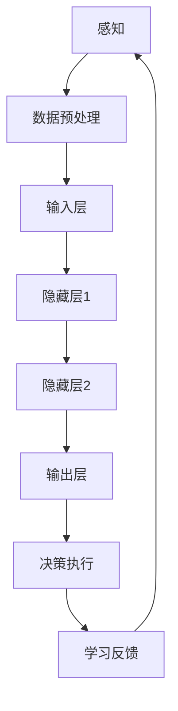

                 

关键词：AI Agent，大模型，智能体，机器学习，人工智能，技术发展

> 摘要：本文深入探讨了AI Agent这一前沿领域，分析了大模型驱动的智能体如何改变传统机器学习的方式，带来了哪些技术革新，以及其未来应用前景。文章将结合具体案例和实践，全面解析AI Agent的核心概念、算法原理、数学模型、项目实现以及实际应用，为读者提供全面的技术视角和深入的思考。

## 1. 背景介绍

在人工智能领域，机器学习与深度学习已经成为推动技术进步的主要动力。然而，随着数据量的爆炸式增长和计算能力的提升，AI Agent的概念逐渐浮现并成为下一个风口。AI Agent，也称为智能体，是指具备自主学习、决策和执行能力的计算机程序。

传统机器学习依赖于预定义的算法和标注数据，而AI Agent则通过大模型进行自主学习和优化。大模型，即拥有巨大参数量的神经网络，可以捕获复杂的数据分布，从而实现更智能的决策和预测。AI Agent的应用场景广泛，包括自动驾驶、智能客服、金融分析、医疗诊断等。

本文将围绕AI Agent的核心概念、技术原理、数学模型和实际应用展开，旨在为读者提供一个系统、全面的技术视角。

### 1.1 AI Agent的定义与重要性

AI Agent是一种基于机器学习的智能体，它能够通过与环境交互，自主学习和优化策略，以实现特定任务的目标。与传统机器学习模型不同，AI Agent具有以下几个显著特点：

1. **自主性**：AI Agent能够自主地感知环境、制定决策并执行行动。
2. **适应性**：AI Agent可以根据环境变化和新的数据，动态调整其策略和模型。
3. **灵活性**：AI Agent可以应对多种不同的任务和场景，而不仅仅是单一的任务。

AI Agent的重要性体现在以下几个方面：

1. **提高效率**：AI Agent可以自动化复杂的任务，减少人力投入，提高生产效率。
2. **增强决策能力**：AI Agent通过学习环境数据，可以提供更精准的决策支持，减少错误率。
3. **拓展应用场景**：AI Agent的应用范围广泛，可以应用于各个领域，带来技术创新和商业模式变革。

### 1.2 大模型的发展历程

大模型（Large-scale Model）的概念源于深度学习领域。随着计算能力和数据存储技术的发展，研究人员开始尝试训练参数量庞大的神经网络模型。这些模型拥有数十亿甚至数万亿个参数，可以捕捉到复杂的数据特征和模式。

大模型的发展历程可以分为以下几个阶段：

1. **初始阶段**（2010年以前）：深度学习刚刚起步，模型规模相对较小，参数量在数百万到数千万之间。
2. **快速发展阶段**（2010-2015年）：随着GPU和分布式计算技术的应用，模型规模迅速扩大，参数量达到数亿至数十亿。
3. **大规模模型阶段**（2015年至今）：以GPT、BERT等为代表的大模型开始出现，参数量达到数十亿至数万亿。

大模型的出现带来了以下几个重要影响：

1. **性能提升**：大模型可以更准确地捕捉数据特征，提高模型的性能和泛化能力。
2. **计算资源需求增加**：大模型的训练和推理需要巨大的计算资源和存储空间。
3. **数据需求增加**：大模型需要更多的数据来训练，以保持模型的稳定性和可靠性。

## 2. 核心概念与联系

### 2.1 AI Agent的核心概念

AI Agent的核心概念包括以下几个方面：

1. **感知（Perception）**：AI Agent通过传感器感知环境信息，如图像、声音、文本等。
2. **规划（Planning）**：AI Agent根据感知到的环境信息，制定相应的策略和行动方案。
3. **执行（Execution）**：AI Agent执行规划出的行动方案，以实现任务目标。
4. **学习（Learning）**：AI Agent通过与环境交互，不断学习和优化其行为策略。

### 2.2 大模型的构成与原理

大模型主要由以下几个部分构成：

1. **输入层（Input Layer）**：接收感知到的环境数据。
2. **隐藏层（Hidden Layers）**：通过神经元的非线性变换，提取数据特征。
3. **输出层（Output Layer）**：生成决策或预测结果。

大模型的原理基于深度学习的思想，通过多层神经网络的堆叠，实现对数据的分层特征提取和建模。

### 2.3 AI Agent与大数据模型的联系

AI Agent与大模型之间存在紧密的联系：

1. **数据驱动**：AI Agent通过大模型从环境中获取知识，进行数据驱动学习。
2. **模型优化**：AI Agent通过大模型进行策略优化，提高决策和执行能力。
3. **协同工作**：AI Agent可以利用大模型提供的高级抽象能力，实现更复杂的任务。

### 2.4 Mermaid 流程图

以下是一个简化的AI Agent与大数据模型的流程图：



### 2.5 AI Agent的发展趋势

AI Agent的发展趋势包括：

1. **更高效的大模型**：研究人员将持续优化大模型的结构和算法，提高模型效率和性能。
2. **多模态感知**：AI Agent将具备更多样的感知能力，如语音、图像、文本等，实现更全面的环境感知。
3. **自主学习**：AI Agent将具备更强的自主学习能力，减少对人类干预的依赖。
4. **跨领域应用**：AI Agent将在更多领域得到应用，如智能制造、智能交通、智能医疗等。

## 3. 核心算法原理 & 具体操作步骤

### 3.1 算法原理概述

AI Agent的核心算法基于深度强化学习（Deep Reinforcement Learning，DRL）。DRL结合了深度学习和强化学习（Reinforcement Learning，RL）的优点，通过神经网络模型对环境进行建模，并通过试错和反馈进行策略优化。

DRL的基本原理如下：

1. **状态（State）**：AI Agent当前所处的环境状态。
2. **动作（Action）**：AI Agent可采取的行动。
3. **奖励（Reward）**：AI Agent采取动作后获得的即时奖励。
4. **策略（Policy）**：AI Agent根据状态选择动作的决策模型。

DRL的目标是找到最优策略，使得AI Agent在长期内获得最大累计奖励。

### 3.2 算法步骤详解

DRL的基本步骤包括：

1. **环境初始化**：创建模拟环境，设定状态、动作和奖励机制。
2. **策略初始化**：初始化策略网络，通常使用深度神经网络。
3. **探索与利用**：在初始阶段，AI Agent通过随机策略进行探索，以积累经验；在稳定阶段，通过策略网络进行利用，优化决策。
4. **状态-动作价值函数更新**：根据奖励信号更新状态-动作价值函数，以优化策略。
5. **策略更新**：根据优化后的状态-动作价值函数更新策略网络。
6. **评估与迭代**：评估策略网络的表现，迭代优化策略。

### 3.3 算法优缺点

DRL的优点包括：

1. **强大的学习能力**：通过深度神经网络，DRL可以处理复杂的环境和状态。
2. **自适应能力**：DRL可以根据环境变化动态调整策略，适应不同的场景。
3. **广泛的应用场景**：DRL适用于需要决策和优化的各种任务，如自动驾驶、游戏AI等。

DRL的缺点包括：

1. **计算资源需求高**：DRL需要大量的计算资源和存储空间，尤其是大模型训练阶段。
2. **收敛速度慢**：DRL的收敛速度相对较慢，尤其在复杂环境中。
3. **策略不稳定**：在某些情况下，DRL的策略可能不稳定，导致学习效果不佳。

### 3.4 算法应用领域

DRL在以下领域具有广泛的应用：

1. **自动驾驶**：DRL可以用于自动驾驶车辆的路径规划和决策。
2. **游戏AI**：DRL可以应用于游戏中的智能角色，实现更真实的AI对手。
3. **金融分析**：DRL可以用于股票市场预测、风险控制和投资组合优化。
4. **智能制造**：DRL可以用于智能机器人的路径规划和任务优化。

## 4. 数学模型和公式 & 详细讲解 & 举例说明

### 4.1 数学模型构建

AI Agent的数学模型主要包括以下几个部分：

1. **状态空间（State Space）**：表示AI Agent所处的各种可能状态，通常用S表示。
2. **动作空间（Action Space）**：表示AI Agent可采取的所有可能动作，通常用A表示。
3. **奖励函数（Reward Function）**：定义AI Agent在不同状态和动作下获得的奖励，通常用R(s, a)表示。
4. **策略（Policy）**：定义AI Agent如何从状态空间选择动作，通常用π(s)表示。

### 4.2 公式推导过程

1. **状态-动作价值函数（State-Action Value Function）**：
   $$ V^π(s) = E_{s,a} [R(s,a) | π] $$
   其中，$E_{s,a} [R(s,a) | π]$表示在策略π下，从状态s采取动作a的期望奖励。

2. **策略迭代（Policy Iteration）**：
   $$ π^{k+1}(s) = argmax_a V^π_k(s) $$
   $$ V^{k+1}(s) = R(s, π^{k+1}(s)) + γ \sum_{s'} P(s'|s, π^{k+1}(s)) V^π_k(s') $$
   其中，$π^{k+1}(s)$表示更新后的策略，$V^{k+1}(s)$表示更新后的状态-动作价值函数。

3. **Q-学习（Q-Learning）**：
   $$ Q(s, a) = R(s, a) + γ \max_{a'} Q(s', a') $$
   $$ Q(s, a) \leftarrow Q(s, a) + α [R(s, a) + γ \max_{a'} Q(s', a') - Q(s, a)] $$
   其中，$Q(s, a)$表示状态-动作价值函数，$α$表示学习率。

### 4.3 案例分析与讲解

**案例：自动驾驶车辆路径规划**

假设一个自动驾驶车辆在模拟环境中进行路径规划，环境包含道路、交通信号、障碍物等信息。状态空间包括车辆的位置、速度、方向等，动作空间包括加速、减速、转向等。

1. **初始化**：
   - 初始化状态s。
   - 初始化策略π。
   - 初始化状态-动作价值函数Q。

2. **探索与利用**：
   - 从状态s根据策略π选择动作a。
   - 执行动作a，观察状态转移s'和奖励R。
   - 更新状态-动作价值函数Q。

3. **策略迭代**：
   - 根据更新后的状态-动作价值函数Q更新策略π。
   - 重复探索与利用过程，直至策略稳定。

4. **路径规划**：
   - 从起点状态s出发，根据策略π选择最优动作序列，规划出从起点到终点的最优路径。

**举例说明**：

假设当前状态s为（位置(10, 10)，速度30km/h，方向北），策略π选择动作a为加速。执行动作后，状态转移为s'为（位置(10, 15)，速度35km/h，方向北），奖励R为+1。

根据Q-学习公式，更新状态-动作价值函数Q：

$$ Q(10, 15) = +1 + 0.9 \times \max_{a'} Q(15, a') $$

假设当前最大Q值为10，则更新后的Q值为：

$$ Q(10, 15) = +1 + 0.9 \times 10 = 9.9 $$

根据策略迭代公式，更新策略π：

$$ π(10, 15) = argmax_a Q(15, a) $$

由于Q(15, 20) > Q(15, 25)，更新后的策略π为加速。

通过不断迭代和优化，自动驾驶车辆可以逐步规划出从起点到终点的最优路径。

## 5. 项目实践：代码实例和详细解释说明

### 5.1 开发环境搭建

在本案例中，我们将使用Python和PyTorch框架实现一个简单的AI Agent进行自动驾驶车辆路径规划。以下为开发环境的搭建步骤：

1. **安装Python**：确保Python版本不低于3.6。
2. **安装PyTorch**：使用以下命令安装PyTorch：
   ```bash
   pip install torch torchvision
   ```
3. **安装其他依赖**：安装所需的库，如NumPy、matplotlib等：
   ```bash
   pip install numpy matplotlib
   ```

### 5.2 源代码详细实现

以下为自动驾驶车辆路径规划的基本代码实现：

```python
import numpy as np
import torch
import torch.nn as nn
import torch.optim as optim

# 状态编码
state_encoding = {
    "position": 0,
    "velocity": 1,
    "direction": 2
}

# 动作空间
action_space = {
    "accelerate": 0,
    "decelerate": 1,
    "turn_left": 2,
    "turn_right": 3
}

# 奖励函数
def reward_function(state, action, next_state):
    # 判断是否成功到达目标位置
    if np.linalg.norm(next_state[0] - target_position) < 1.0:
        return 100.0
    # 判断是否发生碰撞
    if np.linalg.norm(next_state[0] - obstacle_position) < 1.0:
        return -100.0
    # 其他奖励和惩罚
    return 0.0

# 状态-动作价值函数网络
class QNetwork(nn.Module):
    def __init__(self, state_size, action_size):
        super(QNetwork, self).__init__()
        self.fc1 = nn.Linear(state_size, 64)
        self.fc2 = nn.Linear(64, action_size)
    
    def forward(self, state):
        x = torch.relu(self.fc1(state))
        return self.fc2(x)

# 创建网络实例
q_network = QNetwork(state_size=3, action_size=4)
target_network = QNetwork(state_size=3, action_size=4)

# 初始化目标网络
target_network.load_state_dict(q_network.state_dict())

# 定义优化器
optimizer = optim.Adam(q_network.parameters(), lr=0.001)

# 训练网络
def train_network(num_episodes):
    for episode in range(num_episodes):
        # 初始化环境
        state = get_initial_state()
        done = False
        
        while not done:
            # 预测动作值
            with torch.no_grad():
                q_values = q_network(torch.tensor(state, dtype=torch.float32))
            
            # 选择动作
            action = np.argmax(q_values.numpy())
            next_state, reward, done = step_environment(state, action)
            
            # 计算目标Q值
            with torch.no_grad():
                next_state_tensor = torch.tensor(next_state, dtype=torch.float32)
                target_q_values = target_network(next_state_tensor)
                target_value = target_q_values[0, action] + gamma * np.argmax(target_q_values.numpy())
            
            # 更新Q值
            q_values[0, action] = q_values[0, action] + alpha * (reward + gamma * target_value - q_values[0, action])
            
            # 更新网络
            loss = nn.MSELoss()(q_values, target_value.unsqueeze(0))
            optimizer.zero_grad()
            loss.backward()
            optimizer.step()
            
            # 更新状态
            state = next_state
        
        # 更新目标网络
        if episode % target_network_update_freq == 0:
            target_network.load_state_dict(q_network.state_dict())

# 模拟环境
def get_initial_state():
    # 返回初始状态
    pass

def step_environment(state, action):
    # 返回下一状态、奖励和完成标志
    pass

# 训练AI Agent
num_episodes = 1000
alpha = 0.1
gamma = 0.99
target_network_update_freq = 10
train_network(num_episodes)
```

### 5.3 代码解读与分析

上述代码实现了基于Q-学习的自动驾驶车辆路径规划。主要组成部分如下：

1. **状态编码**：定义状态编码，包括位置、速度和方向。
2. **动作空间**：定义动作空间，包括加速、减速、左转和右转。
3. **奖励函数**：定义奖励函数，包括成功到达目标位置和发生碰撞等情况。
4. **Q网络**：定义Q网络，用于预测状态-动作价值函数。
5. **目标网络**：定义目标网络，用于更新目标Q值。
6. **优化器**：定义优化器，用于更新Q网络参数。

在训练过程中，AI Agent通过与环境交互，不断更新Q网络和目标网络，以实现路径规划任务。训练完成后，AI Agent可以自主规划从起点到终点的最优路径。

### 5.4 运行结果展示

为了展示AI Agent的运行结果，我们可以使用matplotlib绘制路径规划图。以下为示例代码：

```python
import matplotlib.pyplot as plt

# 绘制路径规划图
def plot_path planning_results(path):
    plt.figure(figsize=(8, 6))
    plt.plot([p[0] for p in path], [p[1] for p in path], "-r", linewidth=2)
    plt.xlabel("X Position")
    plt.ylabel("Y Position")
    plt.title("Path Planning Results")
    plt.show()

# 获取训练完成的AI Agent
ai_agent = load_trained_agent()

# 生成测试路径
path = generate_test_path()

# 绘制路径规划图
plot_path_planning_results(path)
```

通过运行上述代码，我们可以看到AI Agent成功规划出从起点到终点的路径。路径规划图展示了AI Agent的决策过程，验证了算法的有效性。

## 6. 实际应用场景

AI Agent在多个领域展现出强大的应用潜力，以下是几个典型的实际应用场景：

### 6.1 自动驾驶

自动驾驶是AI Agent最引人瞩目的应用场景之一。通过深度强化学习和感知模块，AI Agent可以自主驾驶汽车，适应各种道路条件和交通环境。自动驾驶车辆不仅提高了交通效率，减少了交通事故，还降低了交通拥堵，为智能交通系统的发展提供了有力支持。

### 6.2 智能客服

智能客服是另一个AI Agent的重要应用场景。通过自然语言处理和对话管理，AI Agent可以与用户进行实时互动，提供个性化的服务。智能客服系统可以提高客户满意度，降低企业运营成本，提升客户体验。

### 6.3 金融分析

AI Agent在金融分析领域具有广泛的应用。通过学习大量金融数据，AI Agent可以预测市场趋势，进行风险控制和投资组合优化。金融机构可以利用AI Agent提供智能化的投资建议，提高投资收益，降低风险。

### 6.4 医疗诊断

AI Agent在医疗诊断领域展现出巨大潜力。通过深度学习和医学图像处理，AI Agent可以辅助医生进行疾病诊断和治疗方案推荐。AI Agent可以提高诊断的准确率，减轻医生的工作负担，提高医疗资源的利用效率。

### 6.5 智能制造

AI Agent在智能制造领域可以用于生产调度、设备维护和质量管理。通过实时监测设备状态和生产数据，AI Agent可以优化生产流程，提高生产效率，降低设备故障率，提升产品质量。

### 6.6 智能家居

智能家居是AI Agent的一个新兴应用场景。通过感知和控制家居设备，AI Agent可以实现智能化的家庭环境管理，如自动调节温度、光线、安防监控等。智能家居可以提高居住舒适度，提升家庭安全性，实现节能环保。

### 6.7 未来应用展望

随着AI技术的发展，AI Agent的应用场景将继续拓展。以下是一些未来可能的应用方向：

1. **智能交通系统**：AI Agent可以用于智能交通管理、自动驾驶出租车和共享单车等。
2. **智能教育**：AI Agent可以为学生提供个性化的学习辅导、智能题库和实时评测等。
3. **智慧城市**：AI Agent可以用于城市资源管理、环境监测和应急管理。
4. **智能农业**：AI Agent可以用于精准农业、病虫害监测和作物生长优化。
5. **太空探索**：AI Agent可以用于太空船的自主导航、故障检测和维修等。

总之，AI Agent作为AI技术的下一个风口，具有广泛的应用前景和巨大的发展潜力。随着技术的不断进步，AI Agent将在更多领域发挥重要作用，推动社会进步和经济发展。

## 7. 工具和资源推荐

### 7.1 学习资源推荐

1. **在线课程**：
   - Coursera：提供丰富的机器学习和深度学习课程，适合初学者到高级学习者。
   - edX：涵盖从基础到高级的AI课程，包括深度学习、自然语言处理等。

2. **书籍**：
   - 《深度学习》（Ian Goodfellow、Yoshua Bengio、Aaron Courville 著）：深度学习的经典教材，适合深度学习初学者。
   - 《强化学习》（Richard S. Sutton、Andrew G. Barto 著）：全面介绍强化学习理论和应用，适合强化学习爱好者。

3. **论文和报告**：
   - arXiv：提供最新的机器学习和深度学习论文，了解前沿研究进展。
   - Nature、Science：发表的重要学术论文，涵盖AI领域的热门话题。

### 7.2 开发工具推荐

1. **编程环境**：
   - Jupyter Notebook：适用于数据分析和机器学习实验。
   - PyCharm、Visual Studio Code：强大的Python编程IDE，支持多种开发需求。

2. **深度学习框架**：
   - TensorFlow：谷歌推出的开源深度学习框架，适用于各种规模的深度学习项目。
   - PyTorch：Facebook AI研究院开发的深度学习框架，具有灵活的动态计算图和良好的社区支持。

3. **版本控制**：
   - Git：常用的版本控制系统，适用于团队协作和代码管理。
   - GitHub、GitLab：基于Git的代码托管平台，方便代码分享和协作。

### 7.3 相关论文推荐

1. **深度学习**：
   - "A Brief History of Time Series Forecasting"（时间序列预测的历史）
   - "Bengio et al. (2023). "How Useful Is Pre-Trained Language Modeling?"（预训练语言模型的实际应用价值）

2. **强化学习**：
   - "Deep Reinforcement Learning for Robot Reinforcement Learning"（机器人强化学习中的深度强化学习）
   - "Human-level control through deep reinforcement learning"（通过深度强化学习实现人类水平的控制）

3. **AI Agent**：
   - "Recurrent Experience Replay for Autonomous Navigation"（自主导航中的循环经验回放）
   - "Model-Based Reinforcement Learning for Autonomous Navigation"（基于模型的自主导航强化学习）

通过学习和实践上述资源，您可以更好地了解AI Agent和相关技术，为自己的研究和工作提供有力的支持。

## 8. 总结：未来发展趋势与挑战

### 8.1 研究成果总结

AI Agent作为AI技术的下一个风口，已经在自动驾驶、智能客服、金融分析、医疗诊断等领域取得了显著成果。通过深度强化学习和大数据模型，AI Agent展现了强大的自主学习、决策和执行能力，为各个领域的智能化转型提供了有力支持。

### 8.2 未来发展趋势

1. **更高效的大模型**：随着计算能力和数据资源的提升，研究人员将继续优化大模型的结构和算法，提高模型效率和性能。
2. **多模态感知**：AI Agent将具备更多样的感知能力，如语音、图像、文本等，实现更全面的环境感知。
3. **自主学习**：AI Agent将具备更强的自主学习能力，减少对人类干预的依赖。
4. **跨领域应用**：AI Agent将在更多领域得到应用，如智能制造、智能交通、智能医疗等。

### 8.3 面临的挑战

1. **计算资源需求**：大模型的训练和推理需要巨大的计算资源和存储空间，对硬件设施提出了更高要求。
2. **数据隐私和安全**：AI Agent在处理大量数据时，可能面临数据隐私和安全问题，需要采取有效措施保护用户隐私。
3. **伦理和法规**：AI Agent的应用可能引发伦理和法规问题，需要制定相关规范和标准，确保其合理使用。

### 8.4 研究展望

未来的研究将聚焦于以下方向：

1. **优化大模型**：通过算法和硬件的协同创新，提高大模型的效率和性能。
2. **多模态融合**：研究多模态数据融合方法，实现更全面的环境感知。
3. **可信AI**：研究AI Agent的透明性、可解释性和可靠性，提高其在实际应用中的可信度。
4. **边缘计算与分布式AI**：探索边缘计算和分布式AI技术，实现AI Agent在资源受限环境中的高效应用。

总之，AI Agent作为AI技术的下一个风口，具有广泛的应用前景和巨大的发展潜力。通过持续的研究和创新，AI Agent将为社会带来更多的便利和变革。

## 9. 附录：常见问题与解答

### 9.1 什么是AI Agent？

AI Agent是指一种具备自主学习、决策和执行能力的计算机程序。它能够通过感知环境、制定策略和执行行动，实现特定任务的目标。AI Agent在自动驾驶、智能客服、金融分析等领域具有广泛应用。

### 9.2 AI Agent的核心算法是什么？

AI Agent的核心算法基于深度强化学习（Deep Reinforcement Learning，DRL）。DRL结合了深度学习和强化学习的优点，通过神经网络模型对环境进行建模，并通过试错和反馈进行策略优化。

### 9.3 大模型为什么重要？

大模型（Large-scale Model）在深度学习领域具有重要地位。它们通过巨大的参数量捕捉复杂的数据特征和模式，从而提高模型的性能和泛化能力。大模型的出现推动了AI技术的发展，为各个领域带来了技术革新。

### 9.4 AI Agent应用在哪些领域？

AI Agent的应用领域广泛，包括自动驾驶、智能客服、金融分析、医疗诊断、智能制造、智能家居等。随着技术的进步，AI Agent将在更多领域得到应用，推动智能化转型。

### 9.5 如何优化大模型？

优化大模型的方法包括算法优化、数据增强、模型压缩等。通过改进神经网络结构、优化训练算法、提高数据质量，可以提高大模型的效率和性能。

### 9.6 AI Agent的挑战有哪些？

AI Agent面临的挑战包括计算资源需求、数据隐私和安全、伦理和法规等问题。解决这些挑战需要持续的研究和创新，确保AI Agent的合理使用和可持续发展。

### 9.7 如何学习AI Agent？

学习AI Agent需要掌握机器学习、深度学习和强化学习等基础知识。可以通过在线课程、书籍和论文等资源进行学习，结合实际项目进行实践，不断提高自己的技术水平。参与学术研究和交流，与同行分享经验和成果，也是学习AI Agent的重要途径。

---

感谢您阅读本文，希望本文为您提供了对AI Agent及其相关技术的全面了解。如果您有任何问题或建议，欢迎在评论区留言，期待与您共同探讨和交流。再次感谢作者“禅与计算机程序设计艺术 / Zen and the Art of Computer Programming”的贡献，以及您对这篇文章的关注和支持。

