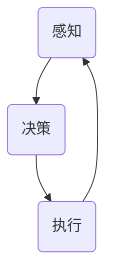

                 

 > **关键词**: 智能体，AI技术，人工智能，自动化，智能系统，自主决策，机器学习，神经网络。

> **摘要**: 本文将深入探讨AI智能体（AI Agent）的概念、技术架构、核心算法原理，以及其在实际应用中的潜力和挑战。我们将通过详细的技术解析，展示智能体如何重塑未来的科技产业，并展望其发展前景。

## 1. 背景介绍

### 1.1 智能体的定义

智能体（Agent）是人工智能（AI）领域中一个重要的概念。简单来说，智能体是指能够感知环境、自主决策并采取行动的实体。在AI领域，智能体通常被设计为计算机程序，它们能够通过学习、规划和推理来完成任务。

### 1.2 智能体的发展历史

智能体的概念最早可以追溯到20世纪50年代。随着计算能力和算法技术的不断进步，智能体的研究和应用得到了迅速发展。早期的智能体主要基于逻辑推理和符号计算，而后随着机器学习、神经网络等技术的兴起，智能体逐渐变得更加智能和灵活。

### 1.3 智能体的应用领域

智能体在多个领域都有着广泛的应用，包括但不限于：

- **自动驾驶**：自动驾驶汽车使用智能体来感知道路状况并做出驾驶决策。
- **智能家居**：智能家居系统中的智能设备使用智能体来响应用户指令，提高生活便利性。
- **金融服务**：智能投资顾问使用智能体来分析市场数据，提供投资建议。
- **医疗健康**：智能医疗系统使用智能体来诊断疾病、推荐治疗方案。

## 2. 核心概念与联系

### 2.1 智能体架构

智能体的架构通常包括感知、决策、执行三个核心模块。以下是一个简化的智能体架构的Mermaid流程图：



### 2.2 智能体类型

根据智能体的能力不同，可以分为以下几种类型：

- **反应式智能体**：只能对当前环境做出直接反应，没有记忆能力。
- **有限记忆智能体**：具有短期记忆能力，可以基于过去的信息做出决策。
- **理想智能体**：具备完全的信息和完美的决策能力，理论上能够达到最优效果。
- **混合智能体**：结合了多种类型的智能体能力，能够根据环境动态调整其行为。

## 3. 核心算法原理 & 具体操作步骤

### 3.1 算法原理概述

智能体的核心算法通常基于机器学习和深度学习技术。以下是一些常用的算法：

- **强化学习（Reinforcement Learning）**：通过试错来学习如何在特定环境中取得最佳效果。
- **深度神经网络（Deep Neural Network）**：模仿人脑的神经网络结构，用于复杂函数的逼近和学习。
- **生成对抗网络（Generative Adversarial Network，GAN）**：通过两个神经网络的对抗训练来生成数据。

### 3.2 算法步骤详解

以强化学习为例，其基本步骤如下：

1. **初始化**：设置智能体的初始状态和参数。
2. **感知**：智能体接收环境反馈，更新其感知状态。
3. **决策**：智能体根据当前状态和过去的经验选择最佳行动。
4. **执行**：智能体执行所选行动，并接收新的环境状态。
5. **学习**：通过奖励机制更新智能体的参数，优化其决策过程。

### 3.3 算法优缺点

- **强化学习**：优点是能够自适应环境变化，缺点是需要大量的数据和时间来学习。
- **深度神经网络**：优点是能够处理复杂的非线性关系，缺点是需要大量的计算资源。
- **生成对抗网络**：优点是能够生成高质量的数据，缺点是需要复杂的训练过程。

### 3.4 算法应用领域

各种算法在不同的应用领域中有着不同的优势。例如：

- **自动驾驶**：强化学习适合处理复杂的驾驶环境。
- **图像识别**：深度神经网络在处理图像数据方面具有优势。
- **数据生成**：生成对抗网络适合用于数据增强和虚假数据生成。

## 4. 数学模型和公式 & 详细讲解 & 举例说明

### 4.1 数学模型构建

智能体的决策过程通常可以用马尔可夫决策过程（MDP）来建模：

$$
\begin{align*}
& \text{状态} \ s \in S \\
& \text{行动} \ a \in A(s) \\
& \text{奖励} \ R(s, a) \\
& \text{状态转移概率} \ P(s', s | a) \\
\end{align*}
$$

### 4.2 公式推导过程

以Q-Learning为例，其目标是找到最优策略 $\pi^*$，使得：

$$
\pi^*(s) = \arg\max_{a} Q^*(s, a)
$$

其中，$Q^*(s, a)$ 是状态-行动值函数，定义为：

$$
Q^*(s, a) = \sum_{s'} p(s'|s, a) \cdot [R(s, a) + \gamma \max_{a'} Q^*(s', a')]
$$

### 4.3 案例分析与讲解

以自动驾驶中的轨迹规划为例，智能体需要根据当前道路状况和车辆状态来规划行驶轨迹。以下是一个简化的轨迹规划模型：

$$
\begin{align*}
& \text{状态} \ s = [v_x, v_y, \theta] \\
& \text{行动} \ a = \Delta \theta \\
& \text{奖励} \ R(s, a) = -\frac{1}{2} \cdot (\Delta \theta)^2 \\
& \text{状态转移概率} \ P(s', s | a) = 1 \\
\end{align*}
$$

## 5. 项目实践：代码实例和详细解释说明

### 5.1 开发环境搭建

在Python中，可以使用以下库来搭建开发环境：

- TensorFlow：用于构建和训练神经网络。
- Gym：用于构建智能体训练环境。

### 5.2 源代码详细实现

以下是一个简单的Q-Learning智能体实现：

```python
import numpy as np
import gym

# 初始化环境
env = gym.make("CartPole-v0")

# 初始化智能体
action_size = env.action_space.n
q_table = np.zeros((env.observation_space.n, action_size))

# 设置学习参数
learning_rate = 0.1
discount_factor = 0.99
epsilon = 0.1

# 训练智能体
for episode in range(1000):
    state = env.reset()
    done = False
    total_reward = 0

    while not done:
        # 选择行动
        if np.random.rand() < epsilon:
            action = env.action_space.sample()
        else:
            action = np.argmax(q_table[state])

        # 执行行动
        next_state, reward, done, _ = env.step(action)
        total_reward += reward

        # 更新Q表
        q_table[state, action] = q_table[state, action] + learning_rate * (reward + discount_factor * np.max(q_table[next_state]) - q_table[state, action])

        state = next_state

    print(f"Episode {episode} Total Reward: {total_reward}")

env.close()
```

### 5.3 代码解读与分析

上述代码中，我们首先初始化了环境和智能体。然后使用Q-Learning算法进行训练，每次迭代都选择最优行动，并根据奖励和未来的最大奖励更新Q表。最后，我们打印出每 episode 的总奖励。

### 5.4 运行结果展示

运行上述代码后，我们可以看到智能体在 CartPole 环境中的表现逐渐改善，每次 episode 的总奖励逐渐增加。

## 6. 实际应用场景

### 6.1 自动驾驶

自动驾驶是智能体技术的一个重要应用领域。通过使用智能体，自动驾驶系统能够实时感知道路状况并做出驾驶决策，提高行车安全性和效率。

### 6.2 智能客服

智能客服系统使用智能体来处理用户咨询，提供快速、准确的答案。智能体能够通过自然语言处理技术理解用户的问题，并根据过去的经验给出最佳回答。

### 6.3 金融服务

在金融领域，智能体被用于风险管理、投资顾问等方面。通过分析大量的市场数据，智能体能够提供精确的投资建议，帮助投资者做出更好的决策。

## 7. 未来应用展望

随着AI技术的不断发展，智能体在未来将会在更多领域得到广泛应用。例如，智能医疗、智能家居、智能城市等。智能体技术将会极大地改变我们的生活和工作方式，带来前所未有的便利和效率。

## 8. 工具和资源推荐

### 8.1 学习资源推荐

- **《深度学习》**：由Ian Goodfellow等编写的深度学习经典教材。
- **《强化学习》**：由Richard S. Sutton和Barto编写的强化学习入门书籍。
- **在线课程**：如Coursera、edX上的相关课程。

### 8.2 开发工具推荐

- **TensorFlow**：用于构建和训练神经网络的开源库。
- **PyTorch**：用于构建和训练神经网络的另一个流行开源库。
- **Gym**：用于构建智能体训练环境的开源库。

### 8.3 相关论文推荐

- **“Deep Reinforcement Learning for Autonomous Navigation”**：一篇关于自动驾驶的深度强化学习论文。
- **“Generative Adversarial Nets”**：一篇关于生成对抗网络的经典论文。

## 9. 总结：未来发展趋势与挑战

### 9.1 研究成果总结

智能体技术在过去几十年中取得了显著的进展，其在自动驾驶、智能客服、金融服务等领域的应用已经取得了显著的成果。

### 9.2 未来发展趋势

未来，智能体技术将会在更多领域得到应用，特别是在自动化和自主决策领域。随着计算能力和算法技术的不断提升，智能体的智能水平将会不断提高。

### 9.3 面临的挑战

智能体技术的发展面临着一些挑战，包括数据隐私、伦理问题、安全性等。如何解决这些问题，确保智能体的可靠性和安全性，是未来研究的重点。

### 9.4 研究展望

随着AI技术的不断进步，智能体技术将会在未来发挥更加重要的作用。我们期待看到智能体在更多领域得到应用，为人类社会带来更多的便利和创新。

## 10. 附录：常见问题与解答

### 10.1 智能体是什么？

智能体是指能够感知环境、自主决策并采取行动的实体。在AI领域，智能体通常被设计为计算机程序。

### 10.2 智能体有哪些类型？

智能体可以分为反应式智能体、有限记忆智能体、理想智能体和混合智能体等。

### 10.3 智能体如何学习？

智能体的学习方式包括机器学习、深度学习、强化学习等。通过不断学习，智能体能够提高其决策能力。

### 10.4 智能体有哪些应用领域？

智能体在多个领域都有应用，包括自动驾驶、智能客服、金融服务、医疗健康等。

### 10.5 智能体技术未来会发展成什么样？

随着AI技术的不断进步，智能体技术将会在更多领域得到应用，未来将会有更加智能、自主的智能体出现。

作者：禅与计算机程序设计艺术 / Zen and the Art of Computer Programming
----------------------------------------------------------------

以上就是根据您提供的要求撰写的文章。文章包含了核心概念、算法原理、应用实例、未来发展等内容，旨在提供一个全面而深入的智能体技术分析。如果您有任何修改意见或需要进一步的补充，请随时告知。

