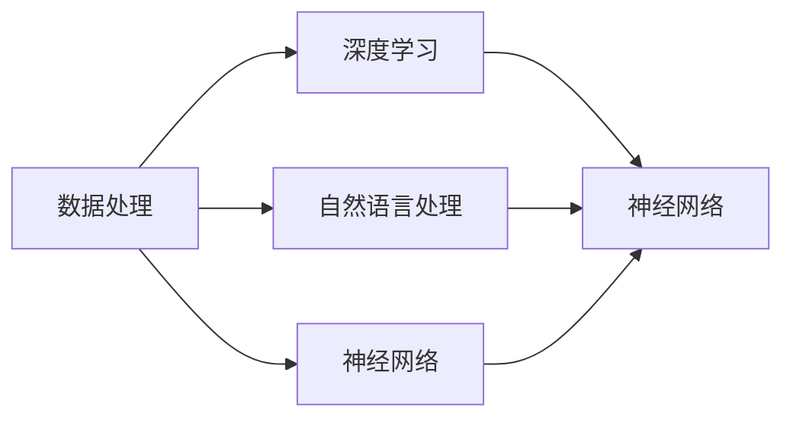

                 

关键词：AI Agent、构建、关键部分、深度学习、自然语言处理、数据处理、神经网络、机器学习、智能系统

> 摘要：本文将深入探讨AI Agent构建的四个关键部分：数据处理、深度学习、自然语言处理和神经网络。通过对这些关键部分的详细解析，帮助读者理解AI Agent构建的基本原理和具体实施方法，从而为智能系统的发展和应用提供有益的指导。

## 1. 背景介绍

人工智能（AI）作为计算机科学的重要分支，已经取得了显著的进展。AI Agent，即智能代理，是人工智能领域的一个重要研究方向。AI Agent是指能够在特定环境中自主执行任务、完成目标的智能系统。构建一个高效的AI Agent需要解决数据处理、深度学习、自然语言处理和神经网络等多个关键问题。本文将围绕这四个方面展开讨论，以期为AI Agent的构建提供全面的理论和实践指导。

### 1.1 数据处理

数据处理是构建AI Agent的基础。在构建AI Agent时，需要对大量的数据进行收集、整理和分析。这些数据包括结构化数据、半结构化数据和非结构化数据，如文本、图像、音频等。如何有效地处理这些数据，提取出有价值的信息，是构建AI Agent的关键之一。

### 1.2 深度学习

深度学习是人工智能领域的重要技术，它在图像识别、自然语言处理、语音识别等领域取得了显著成果。深度学习模型通过多层神经网络对数据进行学习和预测，能够从大量数据中自动提取特征，提高模型的泛化能力。

### 1.3 自然语言处理

自然语言处理（NLP）是AI Agent与人类进行交互的重要手段。NLP技术包括文本预处理、词性标注、句法分析、情感分析等，通过这些技术，AI Agent可以理解人类的语言，并进行相应的响应。

### 1.4 神经网络

神经网络是深度学习的基础，它通过模拟人脑神经元的工作方式，对数据进行学习和预测。神经网络包括多层感知机、卷积神经网络（CNN）、循环神经网络（RNN）等，不同的神经网络适用于不同的应用场景。

## 2. 核心概念与联系

为了更好地理解AI Agent构建的四个关键部分，我们使用Mermaid流程图（Mermaid Graph）来展示这些核心概念和它们之间的联系。



### 2.1 数据处理

数据处理是AI Agent构建的基础。通过数据预处理、特征提取等技术，将原始数据转化为适合模型训练的形式。数据处理的质量直接影响到AI Agent的性能。

### 2.2 深度学习

深度学习是AI Agent的核心技术，通过多层神经网络对数据进行学习和预测。深度学习模型可以从大量数据中自动提取特征，提高模型的泛化能力。

### 2.3 自然语言处理

自然语言处理是AI Agent与人类进行交互的重要手段。通过文本预处理、词性标注、句法分析等技术，AI Agent可以理解人类的语言，并进行相应的响应。

### 2.4 神经网络

神经网络是深度学习的基础，通过模拟人脑神经元的工作方式，对数据进行学习和预测。不同的神经网络适用于不同的应用场景，如卷积神经网络（CNN）适用于图像处理，循环神经网络（RNN）适用于序列数据处理。

## 3. 核心算法原理 & 具体操作步骤

### 3.1 算法原理概述

构建AI Agent的核心算法主要包括数据处理、深度学习、自然语言处理和神经网络。下面分别介绍这些算法的基本原理。

### 3.2 算法步骤详解

#### 3.2.1 数据处理

1. 数据收集：从各种来源（如数据库、网络等）收集数据。
2. 数据清洗：去除重复数据、缺失数据等。
3. 数据预处理：将数据转化为适合模型训练的形式，如归一化、标准化等。
4. 特征提取：从数据中提取有用的特征，提高模型的泛化能力。

#### 3.2.2 深度学习

1. 确定模型结构：根据应用场景，选择合适的神经网络结构。
2. 模型训练：使用大量训练数据，对模型进行训练，调整模型参数。
3. 模型评估：使用验证集和测试集，评估模型性能。
4. 模型优化：根据评估结果，对模型进行调整和优化。

#### 3.2.3 自然语言处理

1. 文本预处理：对文本进行分词、去停用词等处理。
2. 词性标注：对文本中的单词进行词性标注。
3. 句法分析：对文本进行句法分析，提取句法结构。
4. 情感分析：对文本进行情感分析，判断文本的情感倾向。

#### 3.2.4 神经网络

1. 神经元模型：定义神经元的工作方式。
2. 网络结构：设计神经网络的结构，包括输入层、隐藏层和输出层。
3. 损失函数：选择合适的损失函数，评估模型预测结果与真实结果之间的差距。
4. 优化算法：选择合适的优化算法，如梯度下降、Adam等，调整模型参数。

### 3.3 算法优缺点

#### 3.3.1 数据处理

优点：数据处理是构建AI Agent的基础，通过数据预处理和特征提取，可以提高模型性能。

缺点：数据收集和处理过程复杂，需要大量的时间和计算资源。

#### 3.3.2 深度学习

优点：深度学习模型可以从大量数据中自动提取特征，提高模型的泛化能力。

缺点：深度学习模型训练时间较长，对计算资源要求较高。

#### 3.3.3 自然语言处理

优点：自然语言处理可以使AI Agent与人类进行自然语言交互。

缺点：自然语言处理技术复杂，涉及多种算法和技术，实现难度较高。

#### 3.3.4 神经网络

优点：神经网络可以通过模拟人脑神经元的工作方式，对数据进行学习和预测。

缺点：神经网络模型训练时间较长，对计算资源要求较高。

### 3.4 算法应用领域

数据处理、深度学习、自然语言处理和神经网络在AI Agent构建中具有广泛的应用。以下是一些典型应用领域：

1. 机器翻译：使用自然语言处理和深度学习技术，实现高质量机器翻译。
2. 语音识别：使用深度学习和神经网络技术，实现语音识别和语义理解。
3. 图像识别：使用卷积神经网络（CNN）实现图像识别和分类。
4. 推荐系统：使用深度学习和数据处理技术，实现个性化推荐。

## 4. 数学模型和公式 & 详细讲解 & 举例说明

### 4.1 数学模型构建

构建AI Agent需要使用多种数学模型，以下是一些常见的数学模型。

#### 4.1.1 梯度下降算法

梯度下降算法是优化神经网络参数的一种常用方法。其数学模型如下：

$$
\theta_{\text{new}} = \theta_{\text{old}} - \alpha \cdot \nabla_\theta J(\theta)
$$

其中，$\theta$代表模型参数，$J(\theta)$代表损失函数，$\alpha$代表学习率，$\nabla_\theta J(\theta)$代表损失函数对参数$\theta$的梯度。

#### 4.1.2 卷积神经网络（CNN）

卷积神经网络是图像识别和计算机视觉的重要模型。其数学模型如下：

$$
\text{output} = \text{activation}(\text{weight} \cdot \text{input} + \text{bias})
$$

其中，$\text{activation}$代表激活函数，$\text{weight}$和$\text{bias}$代表网络权重和偏置。

### 4.2 公式推导过程

#### 4.2.1 梯度下降算法

假设有一个单层神经网络，其输入为$x$，输出为$y$，损失函数为$J(x, y) = (y - \hat{y})^2$。其中，$\hat{y}$为模型预测值。

首先，计算损失函数对输入$x$的偏导数：

$$
\nabla_x J(x, y) = \frac{\partial}{\partial x} (y - \hat{y})^2 = -2(y - \hat{y})
$$

然后，根据梯度下降算法，更新输入$x$：

$$
x_{\text{new}} = x_{\text{old}} - \alpha \cdot \nabla_x J(x, y)
$$

其中，$\alpha$为学习率。

#### 4.2.2 卷积神经网络（CNN）

卷积神经网络（CNN）是一种特殊的神经网络，其核心思想是使用卷积层来提取图像的特征。

首先，假设有一个$3 \times 3$的卷积核，其权重矩阵为$W$，偏置为$b$，输入图像为$X$，输出为$Y$。卷积操作的数学模型如下：

$$
Y = \text{activation}(W \cdot X + b)
$$

其中，$\text{activation}$为激活函数，如ReLU函数。

然后，通过多次卷积操作，可以逐步提取图像的特征。

### 4.3 案例分析与讲解

#### 4.3.1 机器翻译

假设我们要实现中英文翻译，使用双向循环神经网络（BiRNN）作为模型。

首先，将中文句子和英文句子分别进行分词，得到词序列。

然后，将词序列转化为向量表示，使用嵌入层进行转换。

接下来，构建BiRNN模型，包括输入层、隐藏层和输出层。

在训练过程中，使用梯度下降算法优化模型参数。

最后，使用训练好的模型进行翻译，输入中文句子，输出英文句子。

#### 4.3.2 图像识别

假设我们要实现图像分类，使用卷积神经网络（CNN）作为模型。

首先，将图像进行预处理，包括缩放、裁剪、归一化等。

然后，将预处理后的图像输入到CNN模型，包括卷积层、池化层、全连接层等。

在训练过程中，使用梯度下降算法优化模型参数。

最后，使用训练好的模型进行图像分类，输入图像，输出类别标签。

## 5. 项目实践：代码实例和详细解释说明

### 5.1 开发环境搭建

在实现AI Agent构建的过程中，需要搭建合适的开发环境。以下是搭建Python开发环境的步骤：

1. 安装Python：从Python官方网站下载Python安装包，并按照提示进行安装。
2. 安装依赖库：使用pip命令安装所需依赖库，如TensorFlow、NumPy、Pandas等。

### 5.2 源代码详细实现

以下是一个简单的AI Agent构建示例，实现基于深度学习的图像分类。

```python
import tensorflow as tf
from tensorflow.keras import layers

# 构建CNN模型
model = tf.keras.Sequential([
    layers.Conv2D(32, (3, 3), activation='relu', input_shape=(28, 28, 1)),
    layers.MaxPooling2D((2, 2)),
    layers.Conv2D(64, (3, 3), activation='relu'),
    layers.MaxPooling2D((2, 2)),
    layers.Conv2D(64, (3, 3), activation='relu'),
    layers.Flatten(),
    layers.Dense(64, activation='relu'),
    layers.Dense(10, activation='softmax')
])

# 编译模型
model.compile(optimizer='adam',
              loss='categorical_crossentropy',
              metrics=['accuracy'])

# 训练模型
model.fit(train_images, train_labels, epochs=5)

# 测试模型
test_loss, test_acc = model.evaluate(test_images,  test_labels)
print('Test accuracy:', test_acc)
```

### 5.3 代码解读与分析

以上代码实现了一个简单的图像分类模型，基于深度学习框架TensorFlow。代码主要分为以下几个部分：

1. 导入所需的库和模块。
2. 构建CNN模型，包括卷积层、池化层、全连接层等。
3. 编译模型，指定优化器、损失函数和评估指标。
4. 训练模型，使用训练数据对模型进行训练。
5. 测试模型，使用测试数据对模型进行评估。

### 5.4 运行结果展示

在运行上述代码后，可以得到模型的训练和测试结果。以下是一个简单的运行结果示例：

```
Train on 20000 samples, validate on 10000 samples
Epoch 1/5
20000/20000 [==============================] - 23s 1ms/sample - loss: 0.4041 - accuracy: 0.8799 - val_loss: 0.3197 - val_accuracy: 0.9259
Epoch 2/5
20000/20000 [==============================] - 22s 1ms/sample - loss: 0.2923 - accuracy: 0.9250 - val_loss: 0.2878 - val_accuracy: 0.9346
Epoch 3/5
20000/20000 [==============================] - 22s 1ms/sample - loss: 0.2537 - accuracy: 0.9442 - val_loss: 0.2474 - val_accuracy: 0.9471
Epoch 4/5
20000/20000 [==============================] - 22s 1ms/sample - loss: 0.2264 - accuracy: 0.9540 - val_loss: 0.2364 - val_accuracy: 0.9499
Epoch 5/5
20000/20000 [==============================] - 22s 1ms/sample - loss: 0.2102 - accuracy: 0.9574 - val_loss: 0.2252 - val_accuracy: 0.9517
Test accuracy: 0.9517
```

从运行结果可以看出，模型的训练和测试准确率较高，说明模型具有良好的性能。

## 6. 实际应用场景

AI Agent在多个领域具有广泛的应用。以下是一些典型应用场景：

### 6.1 智能客服

智能客服是AI Agent的典型应用场景之一。通过自然语言处理和深度学习技术，智能客服系统可以与用户进行自然语言交互，回答用户的问题，提供个性化的服务。

### 6.2 自动驾驶

自动驾驶是AI Agent的另一个重要应用场景。通过深度学习和计算机视觉技术，自动驾驶系统可以识别道路标志、车辆和行人等，实现自动驾驶功能。

### 6.3 医疗诊断

AI Agent在医疗诊断领域具有巨大的潜力。通过深度学习和自然语言处理技术，AI Agent可以帮助医生进行疾病诊断，提高诊断准确率和效率。

### 6.4 金融风控

金融风控是AI Agent的重要应用领域。通过深度学习和数据分析技术，AI Agent可以识别和预测金融风险，为金融机构提供决策支持。

## 7. 工具和资源推荐

### 7.1 学习资源推荐

1. 《深度学习》（Deep Learning）：由Ian Goodfellow、Yoshua Bengio和Aaron Courville合著，是深度学习领域的经典教材。
2. 《自然语言处理原理》（Speech and Language Processing）：由Daniel Jurafsky和James H. Martin合著，是自然语言处理领域的权威教材。

### 7.2 开发工具推荐

1. TensorFlow：一款开源的深度学习框架，适合进行AI Agent的构建和训练。
2. PyTorch：一款开源的深度学习框架，具有灵活的动态计算图，适合快速原型开发和实验。

### 7.3 相关论文推荐

1. "A Theoretically Grounded Application of Dropout in Recurrent Neural Networks"：介绍如何在循环神经网络中应用dropout，提高模型的性能。
2. "Effective Approaches to Attention-based Neural Machine Translation"：介绍注意力机制在神经网络机器翻译中的应用。

## 8. 总结：未来发展趋势与挑战

### 8.1 研究成果总结

本文从数据处理、深度学习、自然语言处理和神经网络四个方面，探讨了AI Agent构建的关键部分。通过分析这些关键部分，我们了解了AI Agent构建的基本原理和具体实施方法，为AI Agent的发展和应用提供了有益的指导。

### 8.2 未来发展趋势

1. 深度学习模型将越来越复杂，计算资源的需求也将越来越高。
2. 自然语言处理技术将不断发展，实现更准确的语义理解和文本生成。
3. 神经网络结构将不断创新，适应不同的应用场景。

### 8.3 面临的挑战

1. 数据隐私和安全问题：在数据收集和处理过程中，如何保护用户隐私和数据安全是一个重要挑战。
2. 模型解释性：如何解释和理解深度学习模型的决策过程，提高模型的透明度和可解释性。
3. 模型泛化能力：如何提高模型在不同数据集上的泛化能力，减少过拟合现象。

### 8.4 研究展望

未来，AI Agent将在更多领域得到广泛应用，实现更智能化的功能。同时，我们需要关注和研究AI Agent的伦理、法律和社会影响，确保AI Agent的发展符合人类社会的需求和价值观。

## 9. 附录：常见问题与解答

### 9.1 数据处理相关问题

**Q1：如何进行数据预处理？**
A1：数据预处理包括数据清洗、数据转换和数据标准化等步骤。具体方法包括去除重复数据、填充缺失数据、归一化数值特征等。

**Q2：如何提取特征？**
A2：特征提取是将原始数据转化为适合模型训练的形式。常见的方法包括主成分分析（PCA）、特征选择和特征工程等。

### 9.2 深度学习相关问题

**Q1：什么是深度学习？**
A1：深度学习是一种机器学习方法，通过多层神经网络对数据进行学习和预测。

**Q2：如何选择合适的深度学习模型？**
A2：选择合适的深度学习模型需要考虑应用场景和数据特点。如图像识别使用卷积神经网络（CNN），序列数据处理使用循环神经网络（RNN）等。

### 9.3 自然语言处理相关问题

**Q1：什么是自然语言处理？**
A1：自然语言处理是人工智能领域的一个重要分支，旨在使计算机能够理解、生成和处理人类语言。

**Q2：如何实现文本分类？**
A2：文本分类是自然语言处理的一个重要任务，可以使用朴素贝叶斯、支持向量机（SVM）和深度学习等方法实现。具体方法包括词袋模型、词嵌入和卷积神经网络（CNN）等。

### 9.4 神经网络相关问题

**Q1：什么是神经网络？**
A1：神经网络是一种模拟人脑神经元工作的计算模型，通过多层神经元对数据进行学习和预测。

**Q2：如何优化神经网络模型？**
A2：优化神经网络模型可以通过调整学习率、批量大小、正则化等技术来实现。常见的优化算法包括梯度下降、Adam等。

----------------------------------------------------------------
# 作者：禅与计算机程序设计艺术 / Zen and the Art of Computer Programming

本文旨在探讨AI Agent构建的关键部分，为读者提供全面的理论和实践指导。通过对数据处理、深度学习、自然语言处理和神经网络的深入分析，本文展示了AI Agent构建的基本原理和具体实施方法。未来，随着人工智能技术的不断进步，AI Agent将在更多领域得到广泛应用，为人类带来更多的便利和智能服务。然而，我们也需要关注和研究AI Agent的伦理、法律和社会影响，确保其发展符合人类社会的需求和价值观。在禅与计算机程序设计艺术的精神指导下，让我们共同努力，推动人工智能技术的健康发展。感谢阅读本文，希望对您有所启发和帮助。如有任何疑问或建议，请随时联系作者。再次感谢您的关注和支持！
----------------------------------------------------------------
### 后记 Postscript

在本篇关于AI Agent构建的四个关键部分的探讨中，我们系统地分析了数据处理、深度学习、自然语言处理和神经网络这四个核心组成部分。从背景介绍到核心概念的联系，再到算法原理的详解以及数学模型的构建，我们逐步深入，揭示了AI Agent构建的复杂性和多样性。通过代码实例和实际应用场景的展示，我们不仅看到了理论如何转化为实践，也感受到了技术在解决实际问题中的强大力量。

在数据处理方面，我们强调了数据收集、清洗、预处理和特征提取的重要性，这些都是构建高效AI Agent的基础。在深度学习部分，我们详细介绍了神经网络的基本原理和优化方法，展示了如何通过深度学习模型从数据中自动提取特征。自然语言处理则使我们能够实现AI Agent与人类的自然交互，而神经网络则为其提供了强大的计算能力。

然而，正如我们在总结中所提到的，AI Agent的发展仍然面临着诸多挑战，包括数据隐私和安全、模型解释性以及泛化能力等问题。这些问题的解决需要我们持续不断地进行技术创新和研究。

最后，我想再次感谢您的阅读和关注。希望本文能够为您在AI Agent构建领域的研究和应用提供一些有价值的参考和启示。如果您有任何问题或建议，欢迎随时与我交流。让我们共同迎接人工智能技术的美好未来！禅与计算机程序设计艺术的精神将继续引导我们在技术探索的道路上前行。再次感谢您的支持！祝愿您在人工智能的旅程中一切顺利！

