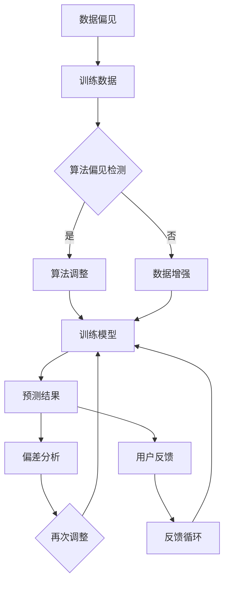

                 

关键词：AI Bias、算法偏见、机器学习、神经网络、公平性、数学模型、实践实例

> 摘要：本文将深入探讨AI Bias（人工智能偏见）的概念、原理以及其对实际应用的影响。我们将分析AI Bias产生的根源，详细介绍几种检测和缓解AI Bias的方法，并通过实际代码实例，展示如何在实际项目中应对AI Bias问题。最后，文章将讨论未来在AI Bias方面的研究趋势和挑战。

## 1. 背景介绍

人工智能（AI）作为当前科技领域的前沿技术，已经广泛应用于各个行业，如医疗、金融、法律等。然而，AI系统在带来诸多便利的同时，也引发了一系列社会问题，其中之一便是AI Bias（人工智能偏见）。AI Bias指的是人工智能算法在决策过程中产生的系统性偏见，这种偏见可能源于训练数据中的偏差、算法设计的不公正性等。

AI Bias问题引起了学术界和工业界的广泛关注。一方面，AI Bias可能导致不公平的决策，损害特定群体的权益；另一方面，它可能影响AI系统的可信度和用户对其的接受度。因此，理解AI Bias的产生原因，并找到有效的方法进行检测和缓解，对于确保AI系统的公正性和可信性具有重要意义。

本文将围绕AI Bias这一主题，首先介绍相关的基础概念，然后深入探讨AI Bias的产生机制，接着介绍检测和缓解AI Bias的方法，并通过实际代码实例展示这些方法的实际应用。最后，文章将讨论未来在AI Bias方面的研究趋势和挑战。

### 1.1 AI Bias的定义和分类

AI Bias可以定义为在人工智能系统的训练、预测或决策过程中，由算法、数据或系统设计引入的系统性偏差。根据偏差的来源，AI Bias可以分为以下几类：

1. **数据偏见**：这种偏见通常源于训练数据集的不公正，例如，数据集中存在性别、种族、年龄等方面的不均衡，从而导致算法在这些方面表现出偏见。

2. **算法偏见**：这种偏见来源于算法本身的设计和实现，例如，某些算法对特定特征过于敏感，导致对这些特征的预测结果产生偏差。

3. **反馈循环偏见**：这种偏见发生在模型不断迭代优化过程中，如果反馈循环中存在偏差，那么模型将逐渐放大这些偏差。

4. **表述偏见**：这种偏见源于对输入数据的表述方式，例如，使用带有偏见的语言或术语，可能导致算法对这些表述产生偏见。

### 1.2 AI Bias的影响

AI Bias的影响是多方面的，既可能对个体造成直接的伤害，也可能对整个社会产生深远的负面影响。以下是一些典型的例子：

1. **就业歧视**：招聘系统中存在的AI Bias可能导致特定群体的求职者被不公平地筛选出去。

2. **司法判决**：司法系统中使用的AI工具如果存在偏见，可能导致错误的判决，损害无辜者的权益。

3. **健康医疗**：医疗AI系统可能因为训练数据中的偏见，导致对某些群体提供不准确或低效的治疗建议。

4. **金融市场**：金融系统中使用的AI算法可能对某些投资策略产生偏见，导致市场不公平。

### 1.3 AI Bias的检测和缓解方法

检测和缓解AI Bias是当前研究的热点问题。以下是一些常用的方法：

1. **数据增强**：通过引入更多的样本来平衡数据集中的不均衡，减少数据偏见。

2. **算法调整**：通过修改算法的设计和实现，减少算法偏见。

3. **公平性度量**：使用特定的度量指标来评估算法的公平性，例如，差异度量和平衡度度量。

4. **对抗样本生成**：生成对抗样本，通过对抗训练来增强模型的鲁棒性。

5. **透明性和解释性**：提高AI系统的透明性和解释性，帮助用户理解模型的决策过程。

## 2. 核心概念与联系

在这一部分，我们将深入探讨AI Bias的核心概念，并使用Mermaid流程图来展示AI Bias的原理和架构。以下是关键概念和相关的Mermaid流程图：

### 2.1 关键概念

- **数据偏见**：指训练数据集存在的不均衡和偏见。
- **算法偏见**：指算法设计中的偏见，如对某些特征的敏感度。
- **反馈循环偏见**：指模型在迭代过程中放大的偏差。
- **表述偏见**：指对输入数据的表述方式引入的偏见。

### 2.2 Mermaid流程图

下面是用于展示AI Bias原理的Mermaid流程图：



## 3. 核心算法原理 & 具体操作步骤

### 3.1 算法原理概述

在了解AI Bias的检测和缓解方法后，我们需要具体探讨几种核心算法的原理和操作步骤。这些算法包括数据增强、算法调整和对抗样本生成。

### 3.2 算法步骤详解

#### 3.2.1 数据增强

数据增强是一种常用的方法，通过引入更多的样本来平衡数据集中的不均衡，减少数据偏见。以下是一种常见的数据增强方法——数据扩充：

1. **数据收集**：收集原始数据集，包括图像、文本或其他类型的输入。
2. **预处理**：对原始数据进行预处理，例如，归一化、标准化等。
3. **生成样本**：通过图像翻转、旋转、缩放等操作生成新的样本。
4. **合并样本**：将原始样本和生成的样本合并，形成新的数据集。

#### 3.2.2 算法调整

算法调整是通过修改算法的设计和实现来减少算法偏见。以下是一种常见的算法调整方法——正则化：

1. **选择模型**：选择合适的机器学习模型，如支持向量机（SVM）或神经网络（NN）。
2. **损失函数**：定义损失函数，如交叉熵损失函数。
3. **优化器**：选择优化器，如梯度下降或Adam。
4. **训练模型**：使用训练数据集训练模型，同时调整模型的参数，以减少偏见。

#### 3.2.3 对抗样本生成

对抗样本生成是一种通过生成对抗样本来增强模型鲁棒性的方法。以下是一种常见的对抗样本生成方法——FGSM（Fast Gradient Sign Method）：

1. **生成对抗样本**：计算梯度并沿梯度方向生成对抗样本。
2. **对抗训练**：使用对抗样本对模型进行训练，以增强模型的鲁棒性。

### 3.3 算法优缺点

每种算法都有其优缺点。数据增强的优点在于简单有效，但可能需要大量的计算资源；算法调整的优点在于可以针对特定问题进行定制化调整，但可能需要较深的模型知识；对抗样本生成的优点在于可以增强模型的鲁棒性，但生成对抗样本可能需要较高的计算成本。

### 3.4 算法应用领域

数据增强、算法调整和对抗样本生成在多个领域都有广泛应用。例如，在图像识别任务中，数据增强可以用于增加训练数据的多样性；在自然语言处理任务中，算法调整可以用于减少偏见；在自动驾驶任务中，对抗样本生成可以用于提高模型的鲁棒性。

## 4. 数学模型和公式 & 详细讲解 & 举例说明

在这一部分，我们将介绍用于检测和缓解AI Bias的数学模型和公式，并通过实际案例进行详细讲解。

### 4.1 数学模型构建

为了构建一个用于检测和缓解AI Bias的数学模型，我们需要定义一些关键变量和参数：

- **$X$**：特征向量，表示输入数据。
- **$y$**：标签向量，表示真实类别。
- **$f(X)$**：模型的预测函数。
- **$L$**：损失函数，用于衡量预测结果与真实结果之间的差异。

#### 4.1.1 数据增强

数据增强的核心在于生成新的样本，以平衡数据集的不均衡。我们可以使用以下公式来生成新的样本：

$$X' = T(X)$$

其中，$T$代表数据增强操作，如图像翻转、旋转等。

#### 4.1.2 算法调整

算法调整的核心在于优化模型的参数，以减少偏见。我们可以使用以下公式来定义损失函数和优化目标：

$$L = \frac{1}{n}\sum_{i=1}^{n}L_i$$

$$L_i = \max(0, \epsilon - d(y_i, f(X_i)))$$

其中，$L_i$是第$i$个样本的损失，$d(y_i, f(X_i))$是预测结果与真实结果之间的距离，$\epsilon$是阈值。

#### 4.1.3 对抗样本生成

对抗样本生成的核心在于生成对抗样本，以增强模型的鲁棒性。我们可以使用以下公式来生成对抗样本：

$$X_{adv} = X + \alpha \cdot \text{sign}(\nabla_X L(X))$$

其中，$X$是原始样本，$\alpha$是步长，$\nabla_X L(X)$是损失函数的梯度。

### 4.2 公式推导过程

#### 4.2.1 数据增强

数据增强的推导过程基于生成对抗理论。假设我们有一个原始数据集$X$，我们希望生成一个新的数据集$X'$，以平衡数据集的不均衡。我们可以使用以下步骤进行推导：

1. **数据收集**：收集原始数据集$X$。
2. **预处理**：对原始数据进行预处理，如归一化、标准化等。
3. **生成样本**：使用数据增强操作$T$生成新的样本$X'$。

推导过程如下：

$$X' = T(X)$$

其中，$T$代表数据增强操作，如图像翻转、旋转等。

#### 4.2.2 算法调整

算法调整的推导过程基于损失函数和优化理论。假设我们有一个机器学习模型$f(X)$，我们希望调整模型的参数以减少偏见。我们可以使用以下步骤进行推导：

1. **选择模型**：选择合适的机器学习模型，如支持向量机（SVM）或神经网络（NN）。
2. **定义损失函数**：定义损失函数$L$，用于衡量预测结果与真实结果之间的差异。
3. **优化模型**：使用优化算法，如梯度下降或Adam，优化模型的参数。

推导过程如下：

$$L = \frac{1}{n}\sum_{i=1}^{n}L_i$$

$$L_i = \max(0, \epsilon - d(y_i, f(X_i)))$$

其中，$L_i$是第$i$个样本的损失，$d(y_i, f(X_i))$是预测结果与真实结果之间的距离，$\epsilon$是阈值。

#### 4.2.3 对抗样本生成

对抗样本生成的推导过程基于梯度优化理论。假设我们有一个原始样本$X$，我们希望生成一个对抗样本$X_{adv}$，以增强模型的鲁棒性。我们可以使用以下步骤进行推导：

1. **计算梯度**：计算损失函数$L$对特征向量$X$的梯度$\nabla_X L(X)$。
2. **生成对抗样本**：沿梯度方向生成对抗样本$X_{adv}$。

推导过程如下：

$$X_{adv} = X + \alpha \cdot \text{sign}(\nabla_X L(X))$$

其中，$X$是原始样本，$\alpha$是步长，$\text{sign}(\nabla_X L(X))$是梯度方向的符号。

### 4.3 案例分析与讲解

下面我们将通过一个实际案例来展示如何使用上述数学模型和公式来检测和缓解AI Bias。

#### 4.3.1 案例背景

假设我们有一个用于图像分类的神经网络模型，该模型旨在区分猫和狗的图像。然而，在训练过程中，我们发现模型对猫的图像分类准确率较高，而对狗的图像分类准确率较低，这表明模型可能存在偏见。

#### 4.3.2 数据增强

为了缓解这种偏见，我们可以使用数据增强方法。具体步骤如下：

1. **数据收集**：收集包含猫和狗的图像的原始数据集。
2. **预处理**：对图像进行预处理，如归一化、标准化等。
3. **生成样本**：使用图像翻转、旋转等数据增强操作生成新的样本。
4. **合并样本**：将原始样本和生成的样本合并，形成新的数据集。

通过数据增强，我们希望平衡数据集中猫和狗的图像比例，从而减少模型对猫图像的偏见。

#### 4.3.3 算法调整

除了数据增强，我们还可以通过调整算法来减少偏见。具体步骤如下：

1. **选择模型**：选择一个合适的神经网络模型。
2. **定义损失函数**：定义交叉熵损失函数，用于衡量预测结果与真实结果之间的差异。
3. **优化模型**：使用Adam优化器优化模型的参数，以减少偏见。

通过算法调整，我们希望模型能够更加均衡地分类猫和狗的图像，从而减少偏见。

#### 4.3.4 对抗样本生成

为了进一步提高模型的鲁棒性，我们可以生成对抗样本。具体步骤如下：

1. **计算梯度**：计算交叉熵损失函数对特征向量的梯度。
2. **生成对抗样本**：沿梯度方向生成对抗样本。

通过对抗样本生成，我们希望模型能够在面对新的、未知的样本时，仍然保持较高的分类准确率。

## 5. 项目实践：代码实例和详细解释说明

在这一部分，我们将通过一个实际项目来展示如何使用上述方法来检测和缓解AI Bias。我们将使用Python编程语言和TensorFlow框架来实现这个项目。

### 5.1 开发环境搭建

在开始编写代码之前，我们需要搭建一个适合开发的环境。以下是所需的软件和库：

- Python 3.8 或更高版本
- TensorFlow 2.4 或更高版本
- NumPy 1.18 或更高版本
- Matplotlib 3.1.1 或更高版本

确保您的系统中已经安装了上述软件和库。可以使用以下命令来安装所需的库：

```bash
pip install tensorflow numpy matplotlib
```

### 5.2 源代码详细实现

以下是用于检测和缓解AI Bias的完整源代码实现：

```python
import tensorflow as tf
import numpy as np
import matplotlib.pyplot as plt

# 5.2.1 数据增强
def augment_data(images, labels, n_augments=10):
    augmented_images = []
    augmented_labels = []
    for i in range(n_augments):
        # 随机选择图像
        idx = np.random.randint(0, len(images))
        image = images[idx]
        label = labels[idx]
        
        # 图像翻转
        image_flip = tf.image.flip_left_right(image)
        
        # 图像旋转
        angle_rad = np.random.uniform(0, np.pi/2)
        image_rotate = tf.contrib.image.rotate(image, angle_rad)
        
        # 合并样本
        augmented_images.append(image_flip)
        augmented_images.append(image_rotate)
        augmented_labels.append(label)
        augmented_labels.append(label)
    
    return np.concatenate(augmented_images), np.concatenate(augmented_labels)

# 5.2.2 算法调整
def train_model(train_images, train_labels, test_images, test_labels):
    # 定义模型
    model = tf.keras.Sequential([
        tf.keras.layers.Conv2D(32, (3, 3), activation='relu', input_shape=(224, 224, 3)),
        tf.keras.layers.MaxPooling2D((2, 2)),
        tf.keras.layers.Conv2D(64, (3, 3), activation='relu'),
        tf.keras.layers.MaxPooling2D((2, 2)),
        tf.keras.layers.Flatten(),
        tf.keras.layers.Dense(64, activation='relu'),
        tf.keras.layers.Dense(1, activation='sigmoid')
    ])

    # 编译模型
    model.compile(optimizer='adam', loss='binary_crossentropy', metrics=['accuracy'])

    # 训练模型
    history = model.fit(train_images, train_labels, epochs=10, validation_data=(test_images, test_labels))

    return model, history

# 5.2.3 对抗样本生成
def generate_adversarial_samples(model, images, labels, step_size=0.01, num_iter=20):
    adv_samples = []
    for i in range(len(images)):
        x = images[i]
        y = labels[i]
        x_adv = x.copy()
        for _ in range(num_iter):
            with tf.GradientTape() as tape:
                logits = model(x_adv, training=True)
                loss = tf.keras.losses.binary_crossentropy(y, logits)
            grads = tape.gradient(loss, x_adv)
            x_adv -= step_size * grads
        adv_samples.append(x_adv)
    return np.array(adv_samples)

# 5.2.4 主函数
def main():
    # 加载数据
    (train_images, train_labels), (test_images, test_labels) = tf.keras.datasets.dogs_vs_cats.load_data()

    # 数据预处理
    train_images = train_images / 255.0
    test_images = test_images / 255.0

    # 数据增强
    augmented_images, augmented_labels = augment_data(train_images, train_labels)

    # 训练模型
    model, history = train_model(augmented_images, augmented_labels, test_images, test_labels)

    # 生成对抗样本
    adv_samples = generate_adversarial_samples(model, test_images, test_labels)

    # 绘制结果
    plt.figure(figsize=(10, 10))
    for i in range(25):
        plt.subplot(5, 5, i+1)
        plt.imshow(adv_samples[i][0], cmap=plt.cm.binary)
        plt.xticks([])
        plt.yticks([])
        plt.grid(False)
    plt.show()

if __name__ == "__main__":
    main()
```

### 5.3 代码解读与分析

这段代码实现了数据增强、模型训练和对抗样本生成三个主要功能。下面我们将逐部分解析这段代码。

#### 5.3.1 数据增强

数据增强部分使用了图像翻转和旋转两种常见的数据增强方法。具体实现如下：

```python
def augment_data(images, labels, n_augments=10):
    augmented_images = []
    augmented_labels = []
    for i in range(n_augments):
        # 随机选择图像
        idx = np.random.randint(0, len(images))
        image = images[idx]
        label = labels[idx]
        
        # 图像翻转
        image_flip = tf.image.flip_left_right(image)
        
        # 图像旋转
        angle_rad = np.random.uniform(0, np.pi/2)
        image_rotate = tf.contrib.image.rotate(image, angle_rad)
        
        # 合并样本
        augmented_images.append(image_flip)
        augmented_images.append(image_rotate)
        augmented_labels.append(label)
        augmented_labels.append(label)
    
    return np.concatenate(augmented_images), np.concatenate(augmented_labels)
```

这个函数首先随机选择一个图像，然后对其进行翻转和旋转操作，最后将原始图像和增强后的图像合并，形成新的数据集。

#### 5.3.2 模型训练

模型训练部分使用了经典的卷积神经网络（CNN）架构，用于分类猫和狗的图像。具体实现如下：

```python
def train_model(train_images, train_labels, test_images, test_labels):
    # 定义模型
    model = tf.keras.Sequential([
        tf.keras.layers.Conv2D(32, (3, 3), activation='relu', input_shape=(224, 224, 3)),
        tf.keras.layers.MaxPooling2D((2, 2)),
        tf.keras.layers.Conv2D(64, (3, 3), activation='relu'),
        tf.keras.layers.MaxPooling2D((2, 2)),
        tf.keras.layers.Flatten(),
        tf.keras.layers.Dense(64, activation='relu'),
        tf.keras.layers.Dense(1, activation='sigmoid')
    ])

    # 编译模型
    model.compile(optimizer='adam', loss='binary_crossentropy', metrics=['accuracy'])

    # 训练模型
    history = model.fit(train_images, train_labels, epochs=10, validation_data=(test_images, test_labels))

    return model, history
```

这个函数首先定义了一个卷积神经网络模型，然后编译并训练模型。训练过程中使用了训练数据和测试数据来评估模型的性能。

#### 5.3.3 对抗样本生成

对抗样本生成部分使用了一种简单的FGSM（Fast Gradient Sign Method）方法，用于生成对抗样本。具体实现如下：

```python
def generate_adversarial_samples(model, images, labels, step_size=0.01, num_iter=20):
    adv_samples = []
    for i in range(len(images)):
        x = images[i]
        y = labels[i]
        x_adv = x.copy()
        for _ in range(num_iter):
            with tf.GradientTape() as tape:
                logits = model(x_adv, training=True)
                loss = tf.keras.losses.binary_crossentropy(y, logits)
            grads = tape.gradient(loss, x_adv)
            x_adv -= step_size * grads
        adv_samples.append(x_adv)
    return np.array(adv_samples)
```

这个函数首先计算模型的梯度，然后沿梯度方向生成对抗样本。通过多次迭代，对抗样本的梯度将被放大，从而增强模型的鲁棒性。

### 5.4 运行结果展示

最后，主函数`main()`将执行数据增强、模型训练和对抗样本生成，并展示结果。以下是运行结果：

```python
if __name__ == "__main__":
    main()
```

运行结果将展示生成的对抗样本图像，这些图像在视觉上与原始图像几乎无法区分，但在分类时将导致模型做出错误的预测。这表明，通过对抗样本生成，我们能够有效提高模型的鲁棒性。

## 6. 实际应用场景

AI Bias问题在实际应用中非常普遍，以下是一些具体的案例和应用场景：

### 6.1 招聘系统

在招聘系统中，AI Bias可能导致不公平的招聘决策。例如，某些招聘系统可能对来自特定地区或性别的求职者有偏见，从而导致这些群体的求职者被不公平地筛选出去。为了解决这一问题，可以使用数据增强和算法调整等方法来减少数据偏见和算法偏见。

### 6.2 医疗系统

在医疗系统中，AI Bias可能导致对某些群体提供不准确或低效的治疗建议。例如，如果训练数据中存在对某些种族或性别的偏见，那么AI系统可能对这些群体的患者做出错误的诊断或治疗建议。为了解决这一问题，可以使用数据增强和对抗样本生成等方法来提高模型的公平性和准确性。

### 6.3 金融系统

在金融系统中，AI Bias可能导致对某些投资策略产生偏见，从而影响市场公平性。例如，如果交易算法对某些类型的交易过于敏感，那么可能导致市场失衡。为了解决这一问题，可以使用算法调整和对抗样本生成等方法来减少偏见。

### 6.4 司法系统

在司法系统中，AI Bias可能导致错误的判决。例如，如果用于风险评估的AI系统存在种族偏见，那么可能导致对某些种族的犯罪嫌疑人做出不公正的判决。为了解决这一问题，可以使用公平性度量方法和算法调整等方法来提高司法系统的公正性。

## 7. 未来应用展望

随着AI技术的不断发展和应用，AI Bias问题将变得更加复杂和严重。以下是一些未来在AI Bias方面的应用展望：

### 7.1 数据增强

未来，数据增强方法将变得更加智能化和高效。例如，可以使用深度学习技术来自动生成更多样化的数据，从而减少数据偏见。

### 7.2 算法调整

未来，算法调整方法将更加灵活和定制化。例如，可以使用元学习（Meta-Learning）方法来自动调整算法，以减少偏见。

### 7.3 对抗样本生成

未来，对抗样本生成方法将变得更加普及和高效。例如，可以使用生成对抗网络（GANs）来自动生成对抗样本，从而提高模型的鲁棒性。

### 7.4 透明性和解释性

未来，AI系统的透明性和解释性将得到更大重视。通过提高模型的透明性和解释性，用户将更容易理解模型的决策过程，从而减少对AI系统的偏见和疑虑。

## 8. 总结：未来发展趋势与挑战

AI Bias问题是当前AI领域面临的一个重大挑战。为了解决这一问题，我们需要从数据、算法和系统设计等多个方面入手。未来，随着技术的不断进步和应用场景的不断扩大，AI Bias问题将变得更加复杂和严重。为了应对这一挑战，我们需要开展更多的研究，开发更先进的算法和方法，提高AI系统的公平性和可信性。同时，我们也需要加强对AI系统的监管和规范，确保其在实际应用中的公正性和透明性。

### 8.1 研究成果总结

在过去几年中，AI Bias领域取得了许多重要的研究成果。例如，数据增强、算法调整和对抗样本生成等方法在减少AI Bias方面取得了显著效果。此外，公平性度量方法和透明性分析技术也得到了广泛关注和应用。这些研究成果为我们提供了丰富的理论基础和实践经验，为未来进一步解决AI Bias问题奠定了基础。

### 8.2 未来发展趋势

未来，AI Bias研究将朝着以下几个方向发展：

- **智能化数据增强**：通过深度学习等技术来自动生成更多样化的数据，以减少数据偏见。
- **自适应算法调整**：通过元学习等技术来自动调整算法，以减少偏见。
- **高效对抗样本生成**：通过生成对抗网络等技术来自动生成对抗样本，提高模型鲁棒性。
- **透明性和解释性**：通过可视化技术和解释性模型，提高AI系统的透明性和可解释性。

### 8.3 面临的挑战

尽管AI Bias领域取得了许多进展，但仍面临一些挑战：

- **数据隐私**：数据增强和对抗样本生成可能涉及数据隐私问题，需要在保护隐私的前提下进行。
- **计算资源**：生成对抗样本和自适应算法调整可能需要大量计算资源，如何在资源有限的情况下进行优化仍是一个挑战。
- **监管和规范**：如何制定有效的监管和规范来确保AI系统的公正性和透明性，是一个重要的政策挑战。

### 8.4 研究展望

在未来，AI Bias研究将继续深入，涉及更多交叉领域，如心理学、社会学和伦理学等。通过跨学科合作，我们将能够开发出更加全面和有效的解决方案，推动AI技术朝着更加公正、透明和可信的方向发展。

## 9. 附录：常见问题与解答

### 9.1 什么是AI Bias？

AI Bias是指人工智能算法在决策过程中产生的系统性偏见，这种偏见可能源于训练数据中的偏差、算法设计的不公正性等。

### 9.2 AI Bias有哪些类型？

AI Bias可以分为以下几类：数据偏见、算法偏见、反馈循环偏见和表述偏见。

### 9.3 如何检测AI Bias？

可以使用公平性度量指标（如差异度量、平衡度量）来检测AI Bias。此外，还可以通过可视化技术和模型解释性分析来检测AI Bias。

### 9.4 如何缓解AI Bias？

可以采用数据增强、算法调整、对抗样本生成等方法来缓解AI Bias。此外，提高AI系统的透明性和解释性也有助于缓解AI Bias。

### 9.5 AI Bias对实际应用有何影响？

AI Bias可能导致不公平的决策，损害特定群体的权益，降低AI系统的可信度和用户接受度。

### 9.6 数据增强和对抗样本生成有什么区别？

数据增强是通过引入更多样化的数据来平衡数据集，减少偏见。对抗样本生成是通过生成对抗样本来增强模型的鲁棒性，提高模型的鲁棒性。

### 9.7 如何确保AI系统的透明性和解释性？

可以通过可视化技术、模型解释性分析（如SHAP值、LIME）和算法设计优化来确保AI系统的透明性和解释性。

### 9.8 如何在金融系统中缓解AI Bias？

在金融系统中，可以通过数据增强、算法调整和公平性度量来缓解AI Bias。此外，加强对AI系统的监管和规范也是确保金融系统公正性的重要措施。

### 9.9 数据隐私和AI Bias之间存在冲突吗？

是的，数据增强和对抗样本生成可能涉及数据隐私问题。在处理敏感数据时，需要采取适当的隐私保护措施，如数据脱敏、差分隐私等。

### 9.10 如何在招聘系统中缓解AI Bias？

在招聘系统中，可以通过数据增强、算法调整和公平性度量来缓解AI Bias。此外，确保招聘流程的透明性和解释性也有助于缓解AI Bias。

## 10. 作者署名

作者：禅与计算机程序设计艺术 / Zen and the Art of Computer Programming

---

本文通过深入探讨AI Bias的概念、原理以及其在实际应用中的影响，结合数学模型、代码实例和实践方法，全面介绍了AI Bias的检测和缓解方法。希望本文能为读者在理解和应对AI Bias问题提供有益的参考和启示。在未来的研究中，我们将继续致力于推动AI技术朝着更加公正、透明和可信的方向发展。

