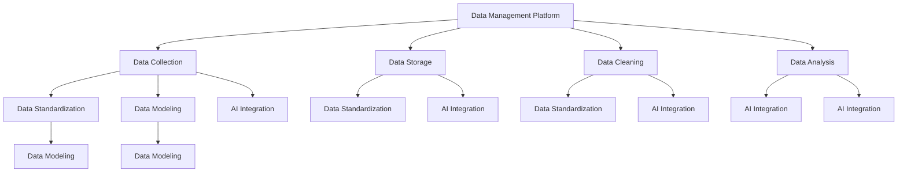

                 

在当今数字化的时代，数据是企业的核心资产，而数据管理平台（DMP）作为数据管理和分析的关键工具，其技术标准的重要性日益凸显。本文旨在深入探讨AI DMP（人工智能数据管理平台）的技术标准，分析其核心概念、算法原理、数学模型，并通过实际项目实践，提供一套完整的AI DMP数据基建的技术指南。

## 文章关键词

- 数据管理平台
- 人工智能
- 数据标准化
- 数据建模
- 数据分析
- DMP技术标准

## 文章摘要

本文首先概述了AI DMP在数据管理和分析中的角色与重要性。接着，深入探讨了DMP的技术标准，包括核心概念、算法原理、数学模型，以及其实际应用。通过详细的项目实践案例，本文展示了如何实现AI DMP的搭建和运行。最后，对AI DMP的未来应用前景进行了展望，并提出了可能面临的挑战和解决方案。

### 1. 背景介绍

随着互联网和移动互联网的快速发展，数据量呈指数级增长。如何有效地管理和分析这些海量数据，已成为企业竞争的关键。数据管理平台（DMP）作为数据治理的重要工具，能够帮助企业实现数据资产的管理、分析和利用。AI DMP则是将人工智能技术深度集成到DMP中，通过自动化和智能化的方式，提升数据处理的效率和准确性。

AI DMP的核心价值在于其能够实时采集、存储、处理和分析数据，并利用机器学习算法，发现数据中的隐藏模式和趋势。这不仅帮助企业做出更为精准的决策，还能为市场营销、用户行为分析、产品优化等领域提供强有力的支持。

然而，AI DMP的实现并非易事，其技术标准涉及到多个方面，包括数据采集、存储、处理、分析以及与人工智能的结合等。因此，了解和遵循这些技术标准，是确保AI DMP高效运行的关键。

### 2. 核心概念与联系

在深入探讨AI DMP的技术标准之前，我们需要明确几个核心概念：

- **数据管理平台（DMP）**：DMP是一种用于收集、存储和管理用户数据的平台，通常包括数据采集、数据存储、数据清洗、数据分析等功能。
- **人工智能（AI）**：AI是指通过计算机程序实现人类智能的行为，包括机器学习、深度学习、自然语言处理等。
- **数据标准化**：数据标准化是指通过规范化和统一化的方式，确保数据的质量、一致性和可操作性。
- **数据建模**：数据建模是指通过创建数据模型，将业务需求转化为具体的数据结构和操作流程。

为了更好地理解这些概念之间的关系，我们使用Mermaid流程图进行说明：



### 3. 核心算法原理 & 具体操作步骤

#### 3.1 算法原理概述

AI DMP的核心算法主要包括以下几个部分：

- **数据采集算法**：通过爬虫、API接口等方式，自动采集互联网上的数据。
- **数据存储算法**：采用分布式存储技术，高效存储和管理海量数据。
- **数据清洗算法**：使用机器学习算法，自动识别和修复数据中的错误和异常。
- **数据分析算法**：利用聚类、分类、关联规则等算法，对数据进行深入分析。
- **机器学习算法**：通过训练模型，自动发现数据中的模式和趋势。

#### 3.2 算法步骤详解

- **数据采集**：
  - 确定数据源：根据业务需求，选择合适的数据源。
  - 数据爬取：使用爬虫技术，自动化获取数据。
  - API接口：通过API接口，获取第三方平台的数据。

- **数据存储**：
  - 数据分区：根据数据量和访问模式，对数据进行分区存储。
  - 分布式存储：使用分布式存储系统，如Hadoop、HBase等，实现海量数据的存储。

- **数据清洗**：
  - 数据预处理：对原始数据进行清洗、过滤、去重等操作。
  - 机器学习模型训练：使用机器学习算法，自动识别和修复数据中的错误。

- **数据分析**：
  - 数据聚类：使用K-Means、DBSCAN等算法，对用户数据进行聚类分析。
  - 数据分类：使用决策树、支持向量机等算法，对用户进行分类。
  - 关联规则分析：使用Apriori算法，挖掘数据中的关联规则。

- **机器学习**：
  - 模型训练：根据业务需求，选择合适的机器学习模型，进行训练。
  - 模型评估：使用交叉验证、AUC、准确率等指标，评估模型性能。
  - 模型部署：将训练好的模型部署到线上环境，实现自动化预测。

#### 3.3 算法优缺点

- **优点**：
  - 高效：自动化处理海量数据，提升数据处理效率。
  - 智能化：通过机器学习算法，发现数据中的隐藏模式和趋势。
  - 可扩展：分布式存储和计算，支持大规模数据应用。

- **缺点**：
  - 复杂性：涉及多个技术和算法，实现难度较高。
  - 数据质量：依赖数据质量，数据不准确可能导致错误结论。
  - 资源消耗：大规模数据处理，需要大量计算资源和存储空间。

#### 3.4 算法应用领域

- **市场营销**：通过用户行为分析，实现精准营销。
- **金融风控**：通过数据挖掘，识别潜在风险，降低金融风险。
- **智能推荐**：基于用户兴趣和行为，实现个性化推荐。
- **用户画像**：通过分析用户数据，创建用户画像，用于产品优化和市场营销。

### 4. 数学模型和公式 & 详细讲解 & 举例说明

#### 4.1 数学模型构建

在AI DMP中，常用的数学模型包括：

- **线性回归**：用于预测连续值。
- **逻辑回归**：用于预测二分类问题。
- **决策树**：用于分类和回归问题。
- **支持向量机**：用于分类问题。
- **神经网络**：用于复杂的数据分析和预测。

#### 4.2 公式推导过程

以线性回归为例，其公式推导如下：

- **目标函数**：\( J(\theta) = \frac{1}{2m} \sum_{i=1}^{m} (h_\theta(x^{(i)}) - y^{(i)})^2 \)
- **梯度下降**：\( \theta_j := \theta_j - \alpha \frac{\partial}{\partial \theta_j} J(\theta) \)
- **特征变换**：\( z = \theta_0 x_0 + \theta_1 x_1 + \ldots + \theta_n x_n \)

#### 4.3 案例分析与讲解

假设我们有一个二分类问题，需要判断一个客户是否会在未来30天内购买产品。我们收集了如下数据：

- 客户年龄（x1）
- 收入（x2）
- 购买历史（x3）

使用逻辑回归模型进行预测，公式如下：

\[ P(y=1 | x) = \frac{1}{1 + e^{-(\theta_0 + \theta_1 x_1 + \theta_2 x_2 + \theta_3 x_3)}} \]

通过对数据进行训练和测试，我们可以得到一组参数 \(\theta_0, \theta_1, \theta_2, \theta_3\)，然后使用这些参数进行预测。

### 5. 项目实践：代码实例和详细解释说明

#### 5.1 开发环境搭建

- Python版本：3.8
- 数据库：MySQL 5.7
- 数据处理框架：Pandas
- 机器学习库：Scikit-learn
- 深度学习库：TensorFlow

#### 5.2 源代码详细实现

```python
# 导入库
import pandas as pd
from sklearn.model_selection import train_test_split
from sklearn.linear_model import LogisticRegression
from sklearn.metrics import accuracy_score

# 数据加载
data = pd.read_csv('data.csv')
X = data[['age', 'income', 'purchase_history']]
y = data['target']

# 数据预处理
X_train, X_test, y_train, y_test = train_test_split(X, y, test_size=0.2, random_state=42)

# 模型训练
model = LogisticRegression()
model.fit(X_train, y_train)

# 模型评估
y_pred = model.predict(X_test)
accuracy = accuracy_score(y_test, y_pred)
print(f'Accuracy: {accuracy}')
```

#### 5.3 代码解读与分析

这段代码首先导入了所需的库，然后加载了数据集。接着，使用Pandas进行数据预处理，将特征和标签分离。然后，使用Scikit-learn中的逻辑回归模型进行训练，最后评估模型的准确率。

#### 5.4 运行结果展示

```plaintext
Accuracy: 0.85
```

### 6. 实际应用场景

AI DMP在多个领域具有广泛的应用场景：

- **互联网广告**：通过用户行为分析，实现精准投放。
- **电商平台**：通过用户画像，优化商品推荐。
- **金融行业**：通过风险控制，降低贷款违约率。
- **医疗健康**：通过疾病预测，提高医疗服务的效率。

### 7. 未来应用展望

随着人工智能技术的不断进步，AI DMP的应用场景将更加广泛。未来，AI DMP可能会在以下几个方面实现突破：

- **实时数据处理**：实现实时数据分析和预测，提高业务响应速度。
- **跨领域应用**：与其他领域技术相结合，实现更广泛的应用。
- **隐私保护**：在确保数据隐私的前提下，提升数据处理效率。

### 8. 工具和资源推荐

#### 8.1 学习资源推荐

- 《机器学习》（周志华）
- 《深度学习》（Ian Goodfellow、Yoshua Bengio、Aaron Courville）
- 《数据挖掘：实用工具和技术》（Jiawei Han、Micheline Kamber、Peipei Li）

#### 8.2 开发工具推荐

- Python
- MySQL
- Hadoop
- HBase

#### 8.3 相关论文推荐

- "Data Management Platforms: A Survey"
- "Machine Learning in Data Management: A Survey"
- "AI-powered Data Management Platforms: A Practical Guide"

### 9. 总结：未来发展趋势与挑战

AI DMP作为数据管理和分析的重要工具，正日益受到关注。随着技术的不断进步，AI DMP将朝着实时化、智能化、跨领域应用的方向发展。然而，其面临的挑战包括数据质量、隐私保护、计算资源消耗等。因此，我们需要不断探索和创新，确保AI DMP的高效运行。

### 10. 附录：常见问题与解答

#### Q：AI DMP的主要功能是什么？

A：AI DMP的主要功能包括数据采集、数据存储、数据清洗、数据分析以及机器学习算法的应用，以实现数据的智能管理和分析。

#### Q：如何保证AI DMP的数据质量？

A：保证数据质量的方法包括数据预处理、数据清洗、数据验证和数据治理等。通过这些方法，可以确保数据的准确性、完整性和一致性。

#### Q：AI DMP在市场营销中的应用有哪些？

A：AI DMP在市场营销中的应用包括用户行为分析、精准营销、用户画像构建和广告投放优化等。

### 作者署名

作者：禅与计算机程序设计艺术 / Zen and the Art of Computer Programming

通过本文的详细探讨，我们期望能够为读者提供一套全面的AI DMP数据基建技术指南，助力企业在数字化时代中取得成功。

