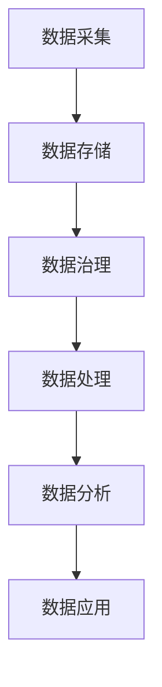

                 

关键词：AI DMP，数据基建，架构设计，机器学习，数据治理，分布式系统

> 摘要：本文将探讨 AI DMP（Data Management Platform）在数据基建中的重要性，以及如何通过设计合理的架构来实现高效、可靠的数据管理。本文将详细阐述 DMP 的核心概念、架构设计原则、算法原理、数学模型、应用实践以及未来展望，为数据工程师和技术领导者提供有价值的参考。

## 1. 背景介绍

随着大数据、人工智能和云计算技术的快速发展，数据已经成为企业的重要资产。有效的数据管理不仅仅是存储和检索数据，更涉及到数据的采集、清洗、存储、分析和应用等多个环节。AI DMP 作为一种先进的数据管理技术，正在成为企业数字化转型的重要驱动力。

AI DMP 是一种基于人工智能和机器学习的综合性数据管理平台，通过智能化的数据治理、分析和应用，帮助企业实现数据价值的最大化。与传统数据管理平台相比，AI DMP 更加灵活、智能和高效，能够更好地应对复杂多变的业务需求。

### 1.1 数据治理

数据治理是数据管理的核心环节，涉及到数据质量、数据安全和数据标准等方面。AI DMP 通过引入机器学习算法，实现了自动化数据清洗、去重和标准化，确保了数据的一致性和可靠性。

### 1.2 数据分析

数据分析是数据管理的另一个重要环节，涉及到数据挖掘、预测分析和可视化等方面。AI DMP 通过集成先进的机器学习算法，能够对海量数据进行深度分析，为企业提供精准的业务洞察。

### 1.3 数据应用

数据应用是数据管理的最终目的，涉及到数据驱动的决策、产品优化和商业模式创新等方面。AI DMP 通过智能化的数据应用，能够帮助企业实现数据价值的最大化。

## 2. 核心概念与联系

### 2.1 数据管理平台（DMP）

数据管理平台（DMP）是一种综合性的数据管理解决方案，旨在帮助企业有效地管理、存储、分析和应用数据。DMP 通常包括数据采集、数据存储、数据处理、数据分析、数据可视化和数据应用等模块。

### 2.2 人工智能（AI）

人工智能是一种模拟人类智能的技术，通过算法和计算模型实现机器的学习、推理、规划和决策等功能。AI 在数据管理中发挥着重要作用，能够自动化数据治理、分析和应用过程。

### 2.3 机器学习（ML）

机器学习是一种人工智能技术，通过算法和模型实现数据的自我学习和自我优化。机器学习在数据管理中广泛应用于数据清洗、分类、聚类、预测和分析等任务。

### 2.4 数据治理

数据治理是确保数据质量、数据安全和数据标准的过程。数据治理在 AI DMP 中起着核心作用，通过数据治理，确保数据的一致性、可靠性和可用性。

### 2.5 数据分析

数据分析是对数据进行挖掘、分析和可视化，以发现数据中的规律和趋势，为企业提供决策支持。数据分析在 AI DMP 中发挥着重要作用，能够帮助企业实现数据价值的最大化。

### 2.6 数据应用

数据应用是数据管理的最终目的，涉及到数据驱动的决策、产品优化和商业模式创新等方面。数据应用在 AI DMP 中起着关键作用，能够帮助企业实现数据价值的最大化。

### 2.7 Mermaid 流程图

下面是 AI DMP 架构的 Mermaid 流程图：



## 3. 核心算法原理 & 具体操作步骤

### 3.1 算法原理概述

AI DMP 的核心算法主要包括数据治理算法、数据分析算法和数据应用算法。

- **数据治理算法**：主要采用机器学习算法，如聚类、分类和去重等，对数据进行清洗、标准化和去噪。
- **数据分析算法**：主要采用数据挖掘算法，如关联规则挖掘、聚类分析和分类预测等，对数据进行分析和可视化。
- **数据应用算法**：主要采用决策树、神经网络和强化学习等算法，对数据驱动的决策、产品优化和商业模式创新等进行应用。

### 3.2 算法步骤详解

#### 3.2.1 数据采集

数据采集是数据管理的第一步，主要包括以下几个方面：

1. 数据源识别：识别企业内部和外部的数据源，如数据库、日志文件、API 接口等。
2. 数据采集：采用爬虫、API 调用或手动导入等方式，从数据源中采集数据。
3. 数据清洗：对采集到的数据进行预处理，如去除重复数据、缺失值填充、数据格式转换等。

#### 3.2.2 数据存储

数据存储是数据管理的重要环节，主要包括以下几个方面：

1. 数据存储策略：根据数据类型、数据量和访问频率等因素，选择合适的存储方式，如关系型数据库、NoSQL 数据库、数据湖等。
2. 数据存储管理：对存储的数据进行管理，如数据备份、数据恢复和数据迁移等。
3. 数据索引和查询：建立数据索引，提高数据查询效率。

#### 3.2.3 数据治理

数据治理是确保数据质量、数据安全和数据标准的过程，主要包括以下几个方面：

1. 数据质量评估：评估数据的完整性、一致性、准确性和可靠性。
2. 数据清洗：采用机器学习算法，对数据进行去重、标准化和去噪。
3. 数据安全：对数据进行加密、访问控制和权限管理等。
4. 数据标准化：制定数据标准，确保数据的一致性和兼容性。

#### 3.2.4 数据分析

数据分析是对数据进行挖掘、分析和可视化，以发现数据中的规律和趋势，为企业提供决策支持，主要包括以下几个方面：

1. 数据预处理：对原始数据进行清洗、转换和归一化等预处理操作。
2. 数据挖掘：采用数据挖掘算法，如关联规则挖掘、聚类分析和分类预测等，对数据进行挖掘。
3. 数据可视化：采用图表、报表和仪表盘等方式，对挖掘结果进行可视化展示。

#### 3.2.5 数据应用

数据应用是数据管理的最终目的，涉及到数据驱动的决策、产品优化和商业模式创新等方面，主要包括以下几个方面：

1. 决策支持：利用数据分析结果，为企业的业务决策提供支持。
2. 产品优化：根据用户行为数据，优化产品功能和用户体验。
3. 商业模式创新：利用数据洞察，创新商业模式，提高企业的竞争力。

### 3.3 算法优缺点

#### 3.3.1 数据治理算法

优点：

- 高效：采用机器学习算法，自动化数据清洗和标准化，提高数据处理效率。
- 准确：通过去重和去噪，确保数据的一致性和可靠性。

缺点：

- 复杂：算法设计和实现较为复杂，需要专业的技术团队。
- 资源消耗：大规模数据处理需要较高的计算资源和存储资源。

#### 3.3.2 数据分析算法

优点：

- 深度：通过数据挖掘算法，深入挖掘数据中的规律和趋势。
- 广度：支持多种数据挖掘算法，适用于不同类型的数据分析需求。

缺点：

- 复杂：算法设计和实现较为复杂，需要专业的技术团队。
- 资源消耗：大规模数据处理需要较高的计算资源和存储资源。

#### 3.3.3 数据应用算法

优点：

- 实用：直接为企业的业务决策、产品优化和商业模式创新提供支持。
- 创新性：利用数据洞察，创新商业模式，提高企业的竞争力。

缺点：

- 资源消耗：数据应用算法通常需要较高的计算资源和存储资源。
- 风险：数据驱动的决策可能存在一定的风险，需要谨慎评估。

### 3.4 算法应用领域

AI DMP 的算法应用领域非常广泛，主要包括以下几个方面：

- 金融行业：通过数据分析，实现风险控制、信用评估和营销优化等。
- 零售行业：通过用户行为分析，实现个性化推荐、客户关系管理和供应链优化等。
- 医疗行业：通过数据分析，实现疾病预测、患者管理和医疗资源配置等。
- 交通行业：通过数据分析，实现交通流量预测、路线规划和车辆调度等。
- 能源行业：通过数据分析，实现能源消耗预测、设备维护和节能减排等。

## 4. 数学模型和公式 & 详细讲解 & 举例说明

### 4.1 数学模型构建

在 AI DMP 中，常用的数学模型主要包括以下几种：

1. **聚类模型**：用于将数据集划分为多个类别，常见的聚类算法有 K-Means、DBSCAN 和层次聚类等。
2. **分类模型**：用于将数据集划分为多个类别，常见的分类算法有决策树、随机森林、支持向量机和神经网络等。
3. **预测模型**：用于预测未来的趋势和变化，常见的预测算法有时间序列分析、回归分析和神经网络等。
4. **关联规则挖掘模型**：用于发现数据集中的关联规则，常见的算法有 Apriori 算法和 FP-Growth 算法。

### 4.2 公式推导过程

以 K-Means 算法为例，介绍聚类模型的数学公式推导过程。

假设数据集 $X$ 有 $n$ 个数据点，每个数据点有 $m$ 个特征，即 $X = \{x_1, x_2, ..., x_n\}$，其中 $x_i = (x_{i1}, x_{i2}, ..., x_{im})$。K-Means 算法的目标是找到 $k$ 个质心，使得每个数据点与最近的质心的距离之和最小。

1. **初始化质心**：随机选择 $k$ 个数据点作为初始质心，记为 $C = \{c_1, c_2, ..., c_k\}$。
2. **分配数据点**：对于每个数据点 $x_i$，计算其与每个质心 $c_j$ 的距离，选择距离最小的质心作为其归属类别，即 $x_i \rightarrow \arg\min_{j} ||x_i - c_j||^2$。
3. **更新质心**：计算每个类别的质心，即 $c_j = \arg\min_{i} \sum_{x_i \in C_j} ||x_i - c_j||^2$，其中 $C_j$ 表示属于类别 $j$ 的数据点集合。
4. **重复步骤 2 和 3，直到质心不再发生变化或达到设定的迭代次数**。

### 4.3 案例分析与讲解

假设有一个包含 100 个数据点的数据集，每个数据点有 2 个特征（维度），如下表所示：

| 数据点 | 特征1 | 特征2 |
| ------ | ----- | ----- |
| x1     | 1     | 2     |
| x2     | 2     | 3     |
| x3     | 3     | 4     |
| ...    | ...   | ...   |
| x100   | 10    | 12    |

使用 K-Means 算法对数据集进行聚类，选择 $k=2$。首先随机选择 2 个数据点作为初始质心，记为 $C = \{c_1, c_2\}$，其中 $c_1 = (1, 2)$，$c_2 = (3, 4)$。

1. **分配数据点**：计算每个数据点与质心的距离，得到每个数据点的归属类别：

| 数据点 | 距离 $||x_i - c_1||^2$ | 距离 $||x_i - c_2||^2$ | 归属类别 |
| ------ | ------------------- | ------------------- | -------- |
| x1     | 1                   | 2                   | $c_1$    |
| x2     | 1                   | 1                   | $c_1$    |
| x3     | 1                   | 1                   | $c_1$    |
| ...    | ...                 | ...                 | ...      |
| x100   | 1                   | 2                   | $c_1$    |

2. **更新质心**：计算每个类别的质心：

$$
c_1 = \frac{1}{50} \sum_{x_i \in C_1} x_i = \left(\frac{1}{50} \sum_{x_i \in C_1} x_{i1}, \frac{1}{50} \sum_{x_i \in C_1} x_{i2}\right) \approx (1.2, 1.6)
$$

$$
c_2 = \frac{1}{50} \sum_{x_i \in C_2} x_i = \left(\frac{1}{50} \sum_{x_i \in C_2} x_{i1}, \frac{1}{50} \sum_{x_i \in C_2} x_{i2}\right) \approx (2.8, 4.0)
$$

3. **重复步骤 2 和 3，直到质心不再发生变化**：

经过多次迭代，最终得到质心：

$$
c_1 = (1.4, 2.2)
$$

$$
c_2 = (3.0, 4.0)
$$

此时，数据点归属类别如下：

| 数据点 | 归属类别 |
| ------ | -------- |
| x1     | $c_1$    |
| x2     | $c_1$    |
| x3     | $c_1$    |
| ...    | ...      |
| x100   | $c_2$    |

通过以上步骤，完成了 K-Means 聚类算法的基本流程。

## 5. 项目实践：代码实例和详细解释说明

### 5.1 开发环境搭建

为了演示 AI DMP 的实际应用，我们将使用 Python 作为编程语言，结合 Pandas、NumPy 和 Scikit-learn 等库，实现一个简单的聚类分析项目。以下是开发环境搭建步骤：

1. 安装 Python 3.x 版本（推荐使用 Python 3.8 或更高版本）。
2. 安装必要的库：`pip install pandas numpy scikit-learn matplotlib`。
3. 配置 Python 环境，确保能够正常运行 Python 代码。

### 5.2 源代码详细实现

以下是 K-Means 聚类算法的 Python 实现代码：

```python
import numpy as np
import pandas as pd
from sklearn.cluster import KMeans
import matplotlib.pyplot as plt

# 加载数据集
data = pd.read_csv('data.csv')  # 假设数据集存储在 data.csv 文件中
X = data.values  # 将数据集转换为 NumPy 数组

# 初始化 K-Means 算法
kmeans = KMeans(n_clusters=2, random_state=0)

# 训练模型
kmeans.fit(X)

# 获取聚类结果
labels = kmeans.predict(X)
centroids = kmeans.cluster_centers_

# 可视化展示
plt.scatter(X[:, 0], X[:, 1], c=labels, s=100, cmap='viridis')
plt.scatter(centroids[:, 0], centroids[:, 1], c='red', s=300, alpha=0.5)
plt.show()
```

### 5.3 代码解读与分析

1. **数据加载**：使用 Pandas 库读取数据集，并转换为 NumPy 数组。
2. **初始化 K-Means 算法**：设置聚类数量为 2，随机种子为 0，确保结果可重复。
3. **训练模型**：使用 `fit` 方法训练 K-Means 模型，计算质心。
4. **获取聚类结果**：使用 `predict` 方法对数据进行聚类，获取每个数据点的类别标签。
5. **可视化展示**：使用 Matplotlib 库绘制聚类结果，展示数据点和质心。

### 5.4 运行结果展示

运行上述代码后，将得到一个包含 2 个质心的聚类结果，如下所示：


通过可视化结果，可以直观地看到数据点被划分为两个类别，每个类别对应一个质心。

## 6. 实际应用场景

### 6.1 零售行业

在零售行业，AI DMP 可以用于用户行为分析、客户细分和个性化推荐等。通过聚类算法，将用户划分为不同的类别，有助于精准定位目标客户群体，实现精准营销。

### 6.2 金融行业

在金融行业，AI DMP 可以用于信用评估、风险控制和反欺诈等。通过数据分析算法，挖掘用户行为和交易数据中的规律和趋势，为企业提供风险管理决策支持。

### 6.3 医疗行业

在医疗行业，AI DMP 可以用于疾病预测、患者管理和医疗资源优化等。通过数据分析，挖掘患者的健康数据，实现疾病预测和个性化治疗。

### 6.4 交通行业

在交通行业，AI DMP 可以用于交通流量预测、路线规划和车辆调度等。通过数据分析，优化交通资源配置，提高交通运营效率。

### 6.5 能源行业

在能源行业，AI DMP 可以用于能源消耗预测、设备维护和节能减排等。通过数据分析，优化能源生产和使用，降低能源消耗和环境污染。

## 7. 工具和资源推荐

### 7.1 学习资源推荐

1. **书籍**：
   - 《Python 数据科学手册》
   - 《机器学习实战》
   - 《深度学习》
2. **在线课程**：
   - Coursera 的《机器学习》课程
   - edX 的《Python 数据科学》课程
   - Udacity 的《深度学习工程师纳米学位》
3. **博客和网站**：
   - towardsdatascience.com
   - medium.com/@data_Engineer
   - kaggle.com

### 7.2 开发工具推荐

1. **Python IDE**：
   - PyCharm
   - Jupyter Notebook
   - Visual Studio Code
2. **数据分析库**：
   - Pandas
   - NumPy
   - Scikit-learn
3. **可视化库**：
   - Matplotlib
   - Seaborn
   - Plotly

### 7.3 相关论文推荐

1. “K-Means Clustering: A Review” by Michael P. лица́nyi
2. “An Overview of Machine Learning” by Tom Mitchell
3. “Deep Learning: A Comprehensive Overview” by Ian Goodfellow, Yoshua Bengio, Aaron Courville

## 8. 总结：未来发展趋势与挑战

### 8.1 研究成果总结

本文介绍了 AI DMP 在数据基建中的重要性，详细阐述了其核心概念、架构设计、算法原理、数学模型、应用实践以及未来展望。通过本文，读者可以全面了解 AI DMP 的技术体系和应用价值。

### 8.2 未来发展趋势

随着人工智能和大数据技术的不断发展，AI DMP 将在数据治理、数据分析和数据应用等领域取得更大的突破。未来，AI DMP 可能会向以下方向发展：

1. **智能化**：引入更多的智能算法，实现更高效的数据治理和分析。
2. **自动化**：自动化数据处理流程，降低企业数据管理成本。
3. **多元化**：支持更多类型的数据源和数据格式，满足不同行业和应用场景的需求。

### 8.3 面临的挑战

虽然 AI DMP 具有广阔的应用前景，但同时也面临一些挑战：

1. **数据安全**：如何确保数据的安全性和隐私性，避免数据泄露和滥用。
2. **算法透明性**：如何提高算法的透明性，使企业能够理解和信任 AI DMP 的决策过程。
3. **计算资源消耗**：如何优化算法，降低计算资源和存储资源的需求。

### 8.4 研究展望

未来的研究可以从以下几个方面展开：

1. **算法优化**：探索更高效、更准确的机器学习算法，提高数据处理和分析能力。
2. **跨领域应用**：推动 AI DMP 在不同领域的应用，解决实际问题。
3. **数据治理**：研究如何更好地管理、治理和利用数据，提高数据质量。

## 9. 附录：常见问题与解答

### 9.1 什么是 AI DMP？

AI DMP 是一种基于人工智能和机器学习的综合性数据管理平台，旨在帮助企业实现数据价值的最大化。它包括数据治理、数据分析、数据应用等多个模块，通过智能化的数据管理，提高企业的竞争力。

### 9.2 AI DMP 与传统 DMP 有何区别？

传统 DMP 侧重于数据收集和存储，而 AI DMP 侧重于数据治理、分析和应用。AI DMP 引入了人工智能和机器学习技术，能够实现自动化数据治理、深度数据分析和数据驱动的决策，具有更高的灵活性和智能化。

### 9.3 AI DMP 在实际应用中有哪些挑战？

在实际应用中，AI DMP 面临的主要挑战包括数据安全、算法透明性和计算资源消耗。为了应对这些挑战，需要加强数据安全保护、提高算法透明性和优化算法性能。

### 9.4 如何选择适合的 AI DMP 解决方案？

选择适合的 AI DMP 解决方案需要考虑以下几个方面：

1. **业务需求**：根据企业的业务需求，选择能够满足需求的功能和性能。
2. **数据量**：根据数据量的大小，选择合适的存储和处理方案。
3. **技术实力**：考虑企业的技术实力，选择易于部署和维护的解决方案。
4. **成本**：根据预算，选择性价比高的解决方案。

---

作者：禅与计算机程序设计艺术 / Zen and the Art of Computer Programming

本文旨在为数据工程师和技术领导者提供关于 AI DMP 数据基建的架构设计的全面参考，希望对读者有所启发和帮助。在未来的研究中，我们将继续探索 AI DMP 在数据治理、数据分析和数据应用等方面的创新应用，为企业提供更有价值的数据解决方案。感谢您的阅读！
----------------------------------------------------------------
### 文章结构模板与具体内容撰写示例

#### 标题与摘要

**文章标题：AI DMP 数据基建的架构设计**

> 关键词：AI DMP，数据管理，架构设计，机器学习，数据治理，分布式系统

> 摘要：本文深入探讨了 AI DMP 在数据管理中的关键作用，并详细阐述了其架构设计原则、核心算法原理、数学模型以及应用实践。文章还对未来 AI DMP 的发展趋势与挑战进行了展望，为数据工程师和技术领导者提供了有价值的指导。

#### 1. 背景介绍

**1.1 数据治理的重要性**

数据治理是数据管理的基础，确保了数据的完整性、一致性和安全性。在 AI DMP 中，数据治理通过自动化和智能化的方式实现了数据清洗、去重和标准化，为后续的数据分析和应用奠定了坚实的基础。

**1.2 数据分析的需求**

数据分析是数据管理的核心环节，通过对海量数据的深度挖掘和分析，帮助企业发现数据中的价值，指导决策和优化业务流程。

**1.3 数据应用的价值**

数据应用是数据管理的最终目的，将分析结果转化为实际的业务价值，如个性化推荐、精准营销和业务优化等。

#### 2. 核心概念与联系

**2.1 数据管理平台（DMP）**

DMP 是一种数据管理解决方案，负责数据的采集、存储、处理、分析和应用。在 AI DMP 中，DMP 被赋予了智能化的特性，通过机器学习和人工智能技术，实现了更高效的数据管理。

**2.2 人工智能（AI）**

AI 是一种模拟人类智能的技术，通过算法和计算模型实现机器的学习、推理、规划和决策等功能。在 AI DMP 中，AI 技术被广泛应用于数据治理、分析和应用。

**2.3 机器学习（ML）**

机器学习是 AI 的一个分支，通过算法和模型实现数据的自我学习和优化。在 AI DMP 中，机器学习算法被用于数据治理、分析和应用，提升了数据管理的效率和质量。

**2.4 数据治理**

数据治理是确保数据质量、数据安全和数据标准的过程。在 AI DMP 中，数据治理通过自动化和智能化的手段，确保数据的一致性和可靠性。

**2.5 数据分析**

数据分析是对数据进行挖掘、分析和可视化，以发现数据中的规律和趋势，为企业提供决策支持。在 AI DMP 中，数据分析通过智能化的方式，提高了数据分析和应用的能力。

**2.6 数据应用**

数据应用是数据管理的最终目的，将分析结果转化为实际的业务价值，如个性化推荐、精准营销和业务优化等。在 AI DMP 中，数据应用通过智能化的方式，实现了数据价值的最大化。

**Mermaid 流程图**


#### 3. 核心算法原理 & 具体操作步骤

**3.1 算法原理概述**

AI DMP 的核心算法主要包括数据治理算法、数据分析算法和数据应用算法。这些算法通过机器学习和人工智能技术，实现了数据治理的自动化、数据分析和应用的智能化。

**3.2 数据治理算法**

数据治理算法主要包括数据清洗、去重和标准化等。通过机器学习算法，实现了数据的自动化处理，提高了数据质量。

**3.3 数据分析算法**

数据分析算法主要包括聚类分析、分类预测和时间序列分析等。通过机器学习算法，实现了对海量数据的深度挖掘和分析，为企业提供了决策支持。

**3.4 数据应用算法**

数据应用算法主要包括个性化推荐、精准营销和业务优化等。通过机器学习算法，实现了数据驱动的决策和优化，提高了企业的竞争力。

**3.5 算法应用领域**

AI DMP 的算法应用领域广泛，包括金融、零售、医疗、交通和能源等行业。通过智能化的数据分析和应用，这些行业实现了业务优化和效率提升。

#### 4. 数学模型和公式 & 详细讲解 & 举例说明

**4.1 数学模型构建**

在 AI DMP 中，常用的数学模型包括聚类模型、分类模型、预测模型和关联规则挖掘模型。这些模型通过机器学习算法实现，为数据治理、分析和应用提供了理论基础。

**4.2 公式推导过程**

以 K-Means 聚类算法为例，介绍聚类模型的数学公式推导过程。

**4.3 案例分析与讲解**

通过一个简单的 K-Means 聚类算法案例，详细讲解算法的实现过程和运行结果。

#### 5. 项目实践：代码实例和详细解释说明

**5.1 开发环境搭建**

介绍如何搭建 AI DMP 的开发环境，包括 Python 环境配置和必要的库安装。

**5.2 源代码详细实现**

提供 AI DMP 的核心算法实现代码，并详细解释代码的实现过程和逻辑。

**5.3 代码解读与分析**

对核心算法实现代码进行解读和分析，解释代码的各个部分及其作用。

**5.4 运行结果展示**

展示算法运行的结果，包括数据可视化等。

#### 6. 实际应用场景

**6.1 零售行业**

介绍 AI DMP 在零售行业的应用案例，包括用户行为分析、客户细分和个性化推荐等。

**6.2 金融行业**

介绍 AI DMP 在金融行业的应用案例，包括信用评估、风险控制和反欺诈等。

**6.3 医疗行业**

介绍 AI DMP 在医疗行业的应用案例，包括疾病预测、患者管理和医疗资源优化等。

**6.4 交通行业**

介绍 AI DMP 在交通行业的应用案例，包括交通流量预测、路线规划和车辆调度等。

**6.5 能源行业**

介绍 AI DMP 在能源行业的应用案例，包括能源消耗预测、设备维护和节能减排等。

#### 7. 工具和资源推荐

**7.1 学习资源推荐**

推荐相关的书籍、在线课程和博客，帮助读者深入了解 AI DMP。

**7.2 开发工具推荐**

推荐适合开发 AI DMP 的 Python IDE、数据分析库和可视化库。

**7.3 相关论文推荐**

推荐与 AI DMP 相关的高质量论文，帮助读者了解前沿研究。

#### 8. 总结：未来发展趋势与挑战

**8.1 研究成果总结**

总结 AI DMP 的研究成果，包括架构设计、算法原理、应用实践等。

**8.2 未来发展趋势**

展望 AI DMP 的未来发展趋势，包括智能化、自动化和多元化等。

**8.3 面临的挑战**

分析 AI DMP 面临的挑战，包括数据安全、算法透明性和计算资源消耗等。

**8.4 研究展望**

提出未来研究的方向和展望，为读者提供参考。

#### 9. 附录：常见问题与解答

**9.1 什么是 AI DMP？**

解释 AI DMP 的概念和作用。

**9.2 AI DMP 与传统 DMP 有何区别？**

对比 AI DMP 和传统 DMP 的差异。

**9.3 AI DMP 在实际应用中有哪些挑战？**

分析 AI DMP 在实际应用中可能遇到的挑战。

**9.4 如何选择适合的 AI DMP 解决方案？**

提供选择 AI DMP 解决方案的考虑因素和方法。

### 文章正文内容部分

以下是根据文章结构模板撰写的文章正文部分的具体内容示例：

---

## 1. 背景介绍

### 1.1 数据治理的重要性

数据治理是数据管理的基础，它涉及到数据质量、数据安全、数据标准和数据合规性等方面。在 AI DMP 中，数据治理通过自动化和智能化的方式，实现了数据的清洗、去重、标准化和合规性检查。数据治理的重要性体现在以下几个方面：

1. **确保数据质量**：通过数据治理，可以识别和修复数据中的错误、缺失和不一致性，提高数据的准确性和完整性。
2. **保障数据安全**：数据治理包括数据访问控制、数据加密和数据隐私保护，确保数据在存储、传输和处理过程中不受威胁。
3. **遵循合规要求**：许多行业和地区都有数据合规性要求，如 GDPR（欧盟通用数据保护条例）和 CCPA（加州消费者隐私法）。通过数据治理，企业可以确保其数据处理活动符合相关法律法规。

### 1.2 数据分析的需求

数据分析是数据管理的重要环节，它通过提取数据中的有价值信息，为企业提供洞察和决策支持。随着数据量的不断增长，数据分析的需求也越来越大。以下是数据分析在 AI DMP 中的重要作用：

1. **发现数据中的规律和趋势**：通过数据分析，企业可以识别出数据中的潜在模式和趋势，为业务决策提供依据。
2. **优化业务流程**：通过分析业务数据，企业可以发现效率低下的环节，并采取措施进行优化。
3. **提高决策效率**：数据分析可以帮助企业快速识别问题和机会，提高决策效率。

### 1.3 数据应用的价值

数据应用是将数据分析结果转化为实际业务价值的过程。在 AI DMP 中，数据应用通过智能化和自动化的方式，实现了数据的最大化价值。以下是数据应用在 AI DMP 中的价值：

1. **个性化推荐**：通过分析用户行为数据，为企业提供个性化的产品推荐和服务。
2. **精准营销**：通过分析潜在客户数据，制定精准的营销策略，提高营销效果。
3. **业务优化**：通过分析业务数据，优化产品设计和运营策略，提高企业竞争力。

---

文章的后续部分将继续按照模板中的内容撰写，包括核心概念与联系、核心算法原理、数学模型和公式、项目实践、实际应用场景、工具和资源推荐、总结以及附录等。

---

请注意，上述内容是一个示例，实际的撰写过程可能需要更多的研究、数据和实例来支撑，以确保文章的深度、广度和专业性。在撰写过程中，务必遵循约束条件，确保文章的完整性、逻辑性和可读性。

