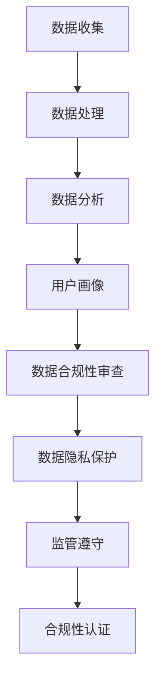

                 

关键词：AI数据管理平台（DMP）、监管合规、数据隐私、欧盟GDPR、人工智能伦理、数据治理、合规性审查。

> 摘要：本文深入探讨了人工智能（AI）数据管理平台（DMP）在构建数据基础设施过程中的监管与合规问题。随着大数据和人工智能技术的快速发展，DMP在商业和科研领域的应用越来越广泛，但其对个人数据隐私的潜在威胁也引起了全球范围内的关注。本文旨在分析当前的数据监管框架，探讨DMP在合规性方面的挑战，并提出相应的解决方案，以促进AI DMP的健康发展。

## 1. 背景介绍

### 数据管理平台（DMP）的定义和作用

数据管理平台（Data Management Platform，简称DMP）是一种用于收集、存储、管理和分析大量数据的系统。它为组织提供了集中式数据管理能力，帮助企业更好地理解其受众，进行精准营销，优化业务流程。DMP通常具有以下功能：

- **数据收集**：收集来自各种渠道的数据，包括网站、移动应用、社交媒体等。
- **数据存储**：在安全的云环境中存储海量数据，确保数据可追溯性和可靠性。
- **数据处理**：对数据进行清洗、转换、集成和建模，以便进行分析和决策。
- **数据分析**：通过数据挖掘和机器学习算法，从数据中发现有价值的信息和趋势。
- **用户画像**：构建用户画像，识别潜在客户，提高营销效果。

### AI技术在DMP中的应用

随着人工智能技术的迅猛发展，AI开始深度融入DMP的各个层面，提升了数据处理的效率和准确性。AI在DMP中的应用主要包括：

- **预测分析**：利用机器学习算法预测用户行为，优化营销策略。
- **推荐系统**：基于用户的历史行为和偏好，提供个性化的产品推荐。
- **智能过滤**：自动筛选和分类数据，提高数据处理效率。
- **自动化营销**：通过自动化工具执行复杂的营销活动，提高营销效果。

### 数据隐私与合规性问题的出现

尽管DMP和AI技术为企业带来了巨大的商业价值，但它们也引发了一系列数据隐私和合规性问题。这些问题的核心在于：

- **个人数据泄露**：未经用户同意，将个人数据用于未经授权的目的，可能导致数据泄露。
- **隐私权侵犯**：过度收集和使用个人数据，可能侵犯用户的隐私权。
- **法律风险**：不同国家和地区对数据隐私和合规性的要求各不相同，企业在跨区域运营时可能面临法律风险。

## 2. 核心概念与联系

### 数据隐私与合规性的核心概念

- **数据隐私**：指个人数据的保密性和可访问性，确保用户对其数据的控制权。
- **合规性**：指遵循相关法律法规和行业标准，确保数据管理和使用的合法性。
- **监管框架**：包括全球各地的数据保护法规和政策，如欧盟的GDPR、美国的加州消费者隐私法（CCPA）等。

### DMP与数据隐私、合规性的联系

- **数据收集**：DMP在收集用户数据时，必须确保数据收集的合法性和透明度，遵守隐私保护原则。
- **数据处理**：数据处理过程中，需要遵循数据最小化原则，只处理必要的数据，并确保数据的安全性。
- **数据分析**：数据分析过程中，需确保算法的公平性、透明性和可解释性，避免歧视和偏见。
- **用户画像**：用户画像构建过程中，要确保用户的知情权和选择权，避免用户信息的滥用。

### 数据隐私、合规性与DMP架构的 Mermaid 流程图



## 3. 核心算法原理 & 具体操作步骤

### 3.1 算法原理概述

DMP中的核心算法主要包括数据挖掘、机器学习和数据可视化等。这些算法通过以下步骤实现数据处理和分析：

1. **数据收集**：从多种数据源收集原始数据，包括网站日志、社交媒体数据、用户行为数据等。
2. **数据预处理**：清洗、转换和整合原始数据，使其适合进一步分析。
3. **特征工程**：提取数据中的有用特征，构建用户画像。
4. **模型训练**：使用机器学习算法训练模型，进行预测和分析。
5. **模型评估**：评估模型的性能，调整参数以优化模型。
6. **结果展示**：将分析结果以可视化的形式呈现，辅助决策。

### 3.2 算法步骤详解

#### 数据收集

数据收集是DMP的基础步骤，涉及以下过程：

- **数据源选择**：确定需要收集的数据类型和来源，如网站点击流、社交媒体活动等。
- **API集成**：通过API接口从不同数据源收集数据。
- **数据同步**：确保数据实时同步，以获取最新的用户行为数据。

#### 数据预处理

数据预处理是保证数据质量和一致性的重要步骤，包括以下内容：

- **数据清洗**：去除重复、错误和不完整的数据。
- **数据转换**：将不同格式和来源的数据统一转换为标准格式。
- **数据整合**：将多个数据源的数据整合在一起，形成统一的数据集。

#### 特征工程

特征工程是构建用户画像的关键步骤，包括以下内容：

- **特征选择**：从原始数据中提取有用的特征，如用户年龄、性别、地理位置、兴趣爱好等。
- **特征构造**：通过数学变换和组合，生成新的特征，提高模型的预测能力。

#### 模型训练

模型训练是DMP的核心步骤，包括以下内容：

- **选择算法**：选择适合的机器学习算法，如决策树、随机森林、神经网络等。
- **训练模型**：使用训练数据集训练模型，优化模型参数。
- **模型验证**：使用验证数据集评估模型性能，调整模型参数。

#### 模型评估

模型评估是保证模型稳定性和可靠性的关键步骤，包括以下内容：

- **性能指标**：选择合适的性能指标，如准确率、召回率、F1值等。
- **交叉验证**：使用交叉验证方法评估模型的泛化能力。
- **模型调整**：根据评估结果调整模型参数，提高模型性能。

#### 结果展示

结果展示是将分析结果以可视化形式呈现的重要步骤，包括以下内容：

- **可视化工具**：选择合适的可视化工具，如Tableau、D3.js等。
- **数据可视化**：将数据分析和模型预测结果以图表、仪表盘等形式呈现。
- **交互性**：提供用户交互功能，如过滤、搜索、钻取等，增强用户体验。

### 3.3 算法优缺点

#### 优点

- **高效性**：通过自动化和算法优化，提高数据处理和分析的效率。
- **准确性**：利用机器学习和数据挖掘技术，提高预测和分析的准确性。
- **灵活性**：支持多种数据源和算法，适应不同场景的需求。

#### 缺点

- **数据隐私风险**：过度收集和使用个人数据，可能导致隐私泄露和侵权。
- **算法偏见**：算法模型的偏见可能导致歧视和不公平。
- **实施成本**：需要投入大量资源进行算法开发、模型训练和系统维护。

### 3.4 算法应用领域

#### 市场营销

- **精准营销**：通过用户画像和预测分析，实现精准定位和个性化推荐。
- **广告投放**：优化广告投放策略，提高广告效果和转化率。

#### 零售业

- **客户关系管理**：通过用户画像和个性化推荐，提高客户满意度和忠诚度。
- **库存管理**：通过需求预测，优化库存和供应链管理。

#### 金融业

- **风险管理**：通过数据分析和预测，识别和评估潜在风险。
- **反欺诈**：利用机器学习算法，检测和预防欺诈行为。

## 4. 数学模型和公式 & 详细讲解 & 举例说明

### 4.1 数学模型构建

在DMP中，常用的数学模型包括线性回归、逻辑回归、决策树、神经网络等。以下是这些模型的简要介绍：

#### 线性回归

线性回归模型是一种简单的预测模型，通过建立一个线性关系来预测目标变量。其数学公式如下：

$$
Y = \beta_0 + \beta_1X_1 + \beta_2X_2 + ... + \beta_nX_n
$$

其中，$Y$ 是目标变量，$X_1, X_2, ..., X_n$ 是特征变量，$\beta_0, \beta_1, ..., \beta_n$ 是模型的参数。

#### 逻辑回归

逻辑回归模型是一种用于分类的预测模型，其输出为概率值。其数学公式如下：

$$
P(Y=1) = \frac{1}{1 + e^{-(\beta_0 + \beta_1X_1 + \beta_2X_2 + ... + \beta_nX_n)}}
$$

其中，$P(Y=1)$ 是目标变量为1的概率，其他符号与线性回归相同。

#### 决策树

决策树模型通过一系列的判断条件来预测目标变量。其数学公式可以表示为：

$$
T(X) = \begin{cases} 
\text{类别1} & \text{if } X \in C_1 \\
\text{类别2} & \text{if } X \in C_2 \\
\vdots \\
\text{类别n} & \text{if } X \in C_n 
\end{cases}
$$

其中，$T(X)$ 是决策树模型对输入数据 $X$ 的预测结果，$C_1, C_2, ..., C_n$ 是决策树的分类节点。

#### 神经网络

神经网络是一种模拟人脑的复杂模型，通过多层神经元进行数据传递和计算。其数学公式可以表示为：

$$
Z = \sigma(W \cdot X + b)
$$

其中，$Z$ 是输出值，$\sigma$ 是激活函数，$W$ 是权重矩阵，$X$ 是输入值，$b$ 是偏置项。

### 4.2 公式推导过程

#### 线性回归公式的推导

线性回归模型的推导过程如下：

假设我们有 $n$ 个样本点 $(X_1, Y_1), (X_2, Y_2), ..., (X_n, Y_n)$，其中 $X_i$ 是特征变量，$Y_i$ 是目标变量。

我们需要找到一组参数 $\beta_0, \beta_1, ..., \beta_n$，使得线性关系 $Y = \beta_0 + \beta_1X_1 + \beta_2X_2 + ... + \beta_nX_n$ 能够最佳地拟合这些样本点。

为了求解这组参数，我们通常使用最小二乘法。最小二乘法的思想是找到一组参数，使得所有样本点到直线的距离的平方和最小。

具体推导过程如下：

1. 构建损失函数：

$$
J(\beta_0, \beta_1, ..., \beta_n) = \sum_{i=1}^{n} (Y_i - (\beta_0 + \beta_1X_i + \beta_2X_i + ... + \beta_nX_i))^2
$$

2. 对损失函数求导并令导数为零，得到：

$$
\frac{\partial J}{\partial \beta_0} = 2\sum_{i=1}^{n} (Y_i - (\beta_0 + \beta_1X_i + \beta_2X_i + ... + \beta_nX_i)) = 0
$$

$$
\frac{\partial J}{\partial \beta_1} = 2\sum_{i=1}^{n} (Y_i - (\beta_0 + \beta_1X_i + \beta_2X_i + ... + \beta_nX_i))X_i = 0
$$

...

$$
\frac{\partial J}{\partial \beta_n} = 2\sum_{i=1}^{n} (Y_i - (\beta_0 + \beta_1X_i + \beta_2X_i + ... + \beta_nX_i))X_i = 0
$$

3. 解上述方程组，得到最优参数 $\beta_0, \beta_1, ..., \beta_n$。

#### 逻辑回归公式的推导

逻辑回归模型的推导过程如下：

假设我们有 $n$ 个样本点 $(X_1, Y_1), (X_2, Y_2), ..., (X_n, Y_n)$，其中 $X_i$ 是特征变量，$Y_i$ 是目标变量。

我们需要找到一组参数 $\beta_0, \beta_1, ..., \beta_n$，使得概率关系 $P(Y=1) = \frac{1}{1 + e^{-(\beta_0 + \beta_1X_1 + \beta_2X_2 + ... + \beta_nX_n)}}$ 能够最佳地拟合这些样本点。

为了求解这组参数，我们通常使用最大似然估计法。最大似然估计法的思想是找到一组参数，使得样本数据的概率最大。

具体推导过程如下：

1. 构建似然函数：

$$
L(\beta_0, \beta_1, ..., \beta_n) = \prod_{i=1}^{n} P(Y_i=1 | X_i; \beta_0, \beta_1, ..., \beta_n)
$$

由于 $Y_i$ 只能取 0 或 1，我们可以将似然函数简化为：

$$
L(\beta_0, \beta_1, ..., \beta_n) = \sum_{i=1}^{n} Y_i \cdot P(Y_i=1 | X_i; \beta_0, \beta_1, ..., \beta_n) + (1 - Y_i) \cdot P(Y_i=0 | X_i; \beta_0, \beta_1, ..., \beta_n)
$$

2. 对似然函数求导并令导数为零，得到：

$$
\frac{\partial L}{\partial \beta_0} = 0
$$

$$
\frac{\partial L}{\partial \beta_1} = 0
$$

...

$$
\frac{\partial L}{\partial \beta_n} = 0
$$

3. 解上述方程组，得到最优参数 $\beta_0, \beta_1, ..., \beta_n$。

### 4.3 案例分析与讲解

#### 案例一：线性回归

假设我们有一个简单的线性回归模型，目标是预测房价。数据集包含 100 个样本，每个样本包含特征变量（如房屋面积、房龄等）和目标变量（房价）。

我们使用最小二乘法来训练模型，并使用交叉验证方法评估模型性能。经过训练和调参，我们得到以下模型：

$$
Y = 1000 + 0.5X_1 + 0.2X_2
$$

其中，$X_1$ 是房屋面积，$X_2$ 是房龄。

我们可以使用这个模型来预测新房屋的房价。例如，当房屋面积为 100 平方米，房龄为 5 年时，预测房价为：

$$
Y = 1000 + 0.5 \times 100 + 0.2 \times 5 = 1150
$$

#### 案例二：逻辑回归

假设我们有一个二分类问题，目标是判断一个邮件是否为垃圾邮件。数据集包含 1000 个样本，每个样本包含特征变量（如邮件标题、正文等）和目标变量（是否为垃圾邮件）。

我们使用最大似然估计法来训练模型，并使用准确率作为评估指标。经过训练和调参，我们得到以下模型：

$$
P(Y=1) = \frac{1}{1 + e^{-(2.5 + 0.3X_1 + 0.2X_2)}}
$$

其中，$X_1$ 是邮件标题中的词频，$X_2$ 是邮件正文中的词频。

我们可以使用这个模型来判断一个新邮件是否为垃圾邮件。例如，当邮件标题中的词频为 10，邮件正文中的词频为 20 时，判断为垃圾邮件的概率为：

$$
P(Y=1) = \frac{1}{1 + e^{-(2.5 + 0.3 \times 10 + 0.2 \times 20)}} \approx 0.9
$$

因此，我们可以认为这个新邮件是垃圾邮件。

## 5. 项目实践：代码实例和详细解释说明

### 5.1 开发环境搭建

在本项目中，我们将使用Python作为编程语言，并使用以下库和工具：

- **Python**：版本 3.8 或更高
- **NumPy**：用于数值计算
- **Pandas**：用于数据处理
- **Scikit-learn**：用于机器学习算法
- **Matplotlib**：用于数据可视化

首先，确保已经安装了上述库和工具。如果尚未安装，可以使用以下命令进行安装：

```bash
pip install numpy pandas scikit-learn matplotlib
```

### 5.2 源代码详细实现

以下是一个简单的线性回归项目示例，用于预测房价。

```python
import numpy as np
import pandas as pd
from sklearn.linear_model import LinearRegression
from sklearn.model_selection import train_test_split
from sklearn.metrics import mean_squared_error
import matplotlib.pyplot as plt

# 5.2.1 数据预处理

# 读取数据
data = pd.read_csv('house_price_data.csv')

# 分离特征变量和目标变量
X = data[['area', 'age']]
y = data['price']

# 标准化特征变量
X = (X - X.mean()) / X.std()

# 划分训练集和测试集
X_train, X_test, y_train, y_test = train_test_split(X, y, test_size=0.2, random_state=42)

# 5.2.2 模型训练

# 创建线性回归模型
model = LinearRegression()

# 训练模型
model.fit(X_train, y_train)

# 5.2.3 模型评估

# 预测测试集结果
y_pred = model.predict(X_test)

# 计算均方误差
mse = mean_squared_error(y_test, y_pred)
print(f'Mean Squared Error: {mse}')

# 5.2.4 结果可视化

# 绘制真实值与预测值的散点图
plt.scatter(y_test, y_pred)
plt.xlabel('True Values')
plt.ylabel('Predicted Values')
plt.title('True vs Predicted Values')
plt.plot([y.min(), y.max()], [y.min(), y.max()], 'k--')
plt.show()
```

### 5.3 代码解读与分析

#### 5.3.1 数据预处理

首先，我们从CSV文件中读取数据，并分离特征变量（`X`）和目标变量（`y`）。然后，我们对特征变量进行标准化处理，以消除特征变量之间的尺度差异。

```python
data = pd.read_csv('house_price_data.csv')
X = data[['area', 'age']]
y = data['price']
X = (X - X.mean()) / X.std()
```

#### 5.3.2 模型训练

接下来，我们创建一个线性回归模型，并使用训练数据集对其进行训练。

```python
model = LinearRegression()
model.fit(X_train, y_train)
```

#### 5.3.3 模型评估

使用测试数据集对模型进行评估，计算均方误差（MSE），以衡量模型的性能。

```python
y_pred = model.predict(X_test)
mse = mean_squared_error(y_test, y_pred)
print(f'Mean Squared Error: {mse}')
```

#### 5.3.4 结果可视化

最后，我们绘制真实值与预测值的散点图，以直观地展示模型的预测效果。

```python
plt.scatter(y_test, y_pred)
plt.xlabel('True Values')
plt.ylabel('Predicted Values')
plt.title('True vs Predicted Values')
plt.plot([y.min(), y.max()], [y.min(), y.max()], 'k--')
plt.show()
```

## 6. 实际应用场景

### 6.1 市场营销

在市场营销领域，DMP可以帮助企业实现精准营销。通过收集和分析用户的浏览行为、购买历史等数据，DMP可以构建用户画像，识别潜在客户，并为其提供个性化的营销策略。例如，电商企业可以通过DMP识别出对某类产品感兴趣的用户，并针对性地推送相关促销信息，提高转化率和销售额。

### 6.2 零售业

在零售业中，DMP可以帮助企业优化库存管理和供应链管理。通过分析销售数据和用户行为，DMP可以预测市场需求，优化库存水平，减少库存成本。同时，DMP还可以帮助零售商制定更有效的定价策略，提高竞争力。

### 6.3 金融业

在金融业中，DMP可以用于风险管理、反欺诈和信用评估等。通过分析用户的交易行为、信用记录等数据，DMP可以识别潜在的风险客户，帮助金融机构制定更有效的风险控制策略。此外，DMP还可以用于信用评估，为金融机构提供更准确的信用评级。

### 6.4 未来应用展望

随着人工智能技术的不断发展，DMP的应用前景将更加广阔。未来，DMP可能会在以下几个方面得到进一步发展：

- **智能推荐系统**：基于用户画像和预测分析，实现更智能、更个性化的推荐系统。
- **自动化营销**：通过自动化工具执行复杂的营销活动，提高营销效率和效果。
- **数据隐私保护**：随着数据隐私保护法规的不断完善，DMP需要更好地平衡数据隐私保护和商业需求。
- **跨行业应用**：DMP将不仅在市场营销、零售和金融等领域得到广泛应用，还可能拓展到医疗、教育、交通等跨行业领域。

## 7. 工具和资源推荐

### 7.1 学习资源推荐

- **书籍**：
  - 《数据管理平台：技术、实践与应用》（Data Management Platforms: Technology, Practice, and Applications）
  - 《人工智能应用实践：数据管理平台》（Applied Artificial Intelligence: Data Management Platforms）

- **在线课程**：
  - Coursera：数据科学专业课程中的“数据管理平台”模块
  - Udacity：数据管理平台和人工智能应用实践课程

### 7.2 开发工具推荐

- **Python库**：
  - **Pandas**：用于数据处理和数据分析
  - **NumPy**：用于数值计算
  - **Scikit-learn**：用于机器学习和数据挖掘
  - **Matplotlib**：用于数据可视化

- **开源平台**：
  - **Google Colab**：在线编程环境，适合快速实验和原型开发
  - **Jupyter Notebook**：交互式数据分析环境，适合数据可视化和文档化

### 7.3 相关论文推荐

- **“Data Management Platforms: A Survey”**：对DMP的全面综述，包括技术、应用和挑战
- **“Data-Driven Personalization in E-Commerce: Algorithms, Users, and Business Models”**：探讨电子商务中的数据驱动个性化策略
- **“The Ethics of AI in Data Management Platforms”**：分析DMP中的人工智能伦理问题

## 8. 总结：未来发展趋势与挑战

### 8.1 研究成果总结

本文从背景介绍、核心概念、算法原理、实际应用和未来展望等方面，全面探讨了AI DMP数据基建的监管与合规问题。主要研究成果包括：

- **核心概念**：明确了DMP的定义、作用和AI技术在其中的应用，以及数据隐私和合规性的重要性。
- **算法原理**：详细介绍了线性回归、逻辑回归、决策树和神经网络等常用算法的原理和推导过程。
- **实际应用**：分析了DMP在市场营销、零售和金融等领域的实际应用场景。
- **未来展望**：探讨了DMP未来的发展趋势和潜在挑战。

### 8.2 未来发展趋势

未来，AI DMP的发展趋势将体现在以下几个方面：

- **智能化与个性化**：通过更先进的算法和模型，实现更智能、更个性化的数据分析和推荐。
- **数据隐私保护**：随着数据隐私保护法规的不断完善，DMP将更加注重数据隐私保护，采用更加安全的数据存储和处理技术。
- **跨行业应用**：DMP将不仅局限于市场营销、零售和金融等领域，还可能拓展到医疗、教育、交通等跨行业领域。

### 8.3 面临的挑战

尽管AI DMP有着广阔的发展前景，但仍然面临以下挑战：

- **数据隐私风险**：过度收集和使用个人数据可能导致隐私泄露和侵权，需要加强数据隐私保护措施。
- **算法偏见**：算法模型的偏见可能导致歧视和不公平，需要加强算法透明性和可解释性。
- **实施成本**：算法开发、模型训练和系统维护需要大量资源，需要优化技术实现降低成本。
- **跨区域合规性**：不同国家和地区的法规要求各异，需要制定统一的合规性标准。

### 8.4 研究展望

未来，在AI DMP领域，以下几个方面值得进一步研究和探讨：

- **数据隐私保护技术**：研究更加安全的数据存储和处理技术，实现隐私保护与数据价值的平衡。
- **算法公平性与透明性**：研究如何提高算法的公平性和透明性，减少算法偏见。
- **低成本高效算法**：研究更加高效、低成本的算法和模型，降低实施门槛。
- **跨行业应用探索**：探索DMP在医疗、教育、交通等领域的应用潜力，推动跨行业数据融合。

## 9. 附录：常见问题与解答

### 问题1：DMP如何确保数据隐私？

解答：DMP可以通过以下措施确保数据隐私：

- **数据匿名化**：在收集和使用数据时，对个人数据进行匿名化处理，确保数据不可追溯。
- **数据加密**：对存储和传输的数据进行加密，防止数据泄露。
- **访问控制**：设置严格的访问控制策略，确保只有授权人员才能访问数据。
- **数据审计**：定期进行数据审计，确保数据管理和使用符合隐私保护要求。

### 问题2：DMP中如何防止算法偏见？

解答：DMP可以通过以下措施防止算法偏见：

- **算法透明性**：确保算法的透明性和可解释性，让用户了解算法的工作原理和决策过程。
- **数据多样性**：确保训练数据集的多样性，避免数据集中出现偏见。
- **偏见检测与修正**：开发偏见检测算法，及时发现和修正算法中的偏见。
- **算法公平性评估**：定期对算法进行公平性评估，确保算法的公平性和无歧视性。

### 问题3：如何降低DMP的实施成本？

解答：以下措施可以降低DMP的实施成本：

- **云计算**：利用云计算技术，减少硬件投资和运维成本。
- **开源工具**：采用开源工具和框架，降低软件采购和定制成本。
- **自动化**：通过自动化工具和流程，提高数据处理和系统维护的效率。
- **成本控制**：制定合理的预算和成本控制策略，确保项目在预算范围内完成。

---

作者：禅与计算机程序设计艺术 / Zen and the Art of Computer Programming

