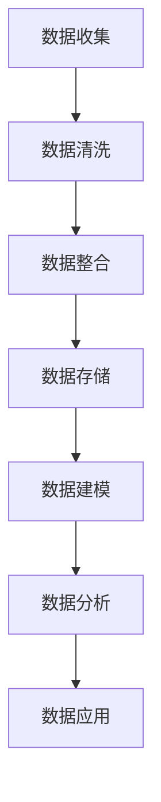
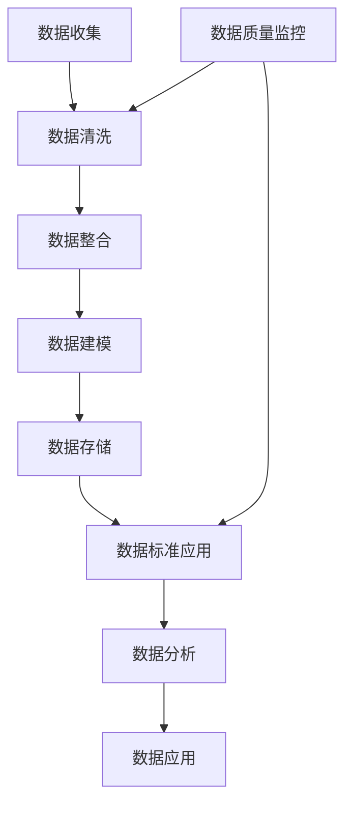

                 

关键词：人工智能，数据管理平台，数据质量，数据标准，数据治理

> 摘要：本文旨在探讨人工智能（AI）数据管理平台（DMP）的数据质量与数据标准的重要性。首先，我们将介绍DMP的概念与背景，接着深入分析数据质量与数据标准的核心概念。文章将进一步探讨AI在数据治理中的作用，详细说明数据质量与数据标准的构建方法。最后，我们将分享实际应用场景，展望未来的发展趋势与面临的挑战。

## 1. 背景介绍

在当今数字化时代，数据已成为企业最具价值的资产。数据管理平台（DMP）作为一种集成化的数据管理工具，帮助企业在复杂的数据环境中进行有效的数据收集、存储、处理和分析。然而，数据质量与数据标准是确保DMP高效运作的关键因素。

数据质量指的是数据的准确性、完整性、一致性、可靠性和及时性。高质量的数据能为企业提供更准确的洞察，从而支持更明智的决策。数据标准则是定义数据格式、命名规范、数据模型和业务规则的规则集，以确保数据在不同系统和部门间的一致性和互操作性。

随着人工智能技术的发展，AI开始被广泛应用于数据管理领域。AI算法能够自动识别数据中的错误、异常和模式，从而提升数据质量。同时，AI还能够帮助构建和优化数据标准，使其更适应不断变化的企业需求。

## 2. 核心概念与联系

### 2.1. 数据质量

数据质量包括多个维度：

- **准确性**：数据是否真实反映了现实情况。
- **完整性**：数据是否包含所有必要的字段和信息。
- **一致性**：数据在不同系统、部门和流程间是否保持一致。
- **可靠性**：数据是否值得信赖，不会被恶意篡改。
- **及时性**：数据是否在需要的时候能够及时更新。

### 2.2. 数据标准

数据标准包括以下方面：

- **数据模型**：定义数据的结构、类型和关系。
- **命名规范**：规定数据字段的命名方式。
- **业务规则**：定义数据的业务逻辑和行为。
- **数据格式**：规定数据存储和交换的格式。

### 2.3. Mermaid 流程图



## 3. 核心算法原理 & 具体操作步骤

### 3.1. 算法原理概述

数据质量与数据标准构建的核心算法包括数据清洗、数据整合、数据建模和数据挖掘。这些算法共同作用，确保数据从收集到应用的每个环节都保持高质量。

### 3.2. 算法步骤详解

- **数据清洗**：识别和修正数据中的错误、缺失和异常。
- **数据整合**：将来自不同来源的数据进行合并，消除冗余。
- **数据建模**：创建数据模型，定义数据的结构、类型和关系。
- **数据挖掘**：使用AI算法从数据中提取有价值的信息和模式。

### 3.3. 算法优缺点

- **数据清洗**：优点是能显著提升数据质量，缺点是耗时长，成本高。
- **数据整合**：优点是能提高数据的一致性，缺点是可能引入新的错误。
- **数据建模**：优点是能提高数据的可用性，缺点是复杂度高。
- **数据挖掘**：优点是能发现隐藏的洞察，缺点是对数据质量和数据标准的依赖性高。

### 3.4. 算法应用领域

- **金融**：用于风险管理、客户关系管理和投资决策。
- **医疗**：用于疾病预测、患者管理和药物研发。
- **零售**：用于需求预测、库存管理和个性化推荐。

## 4. 数学模型和公式 & 详细讲解 & 举例说明

### 4.1. 数学模型构建

数据质量评估模型可以使用以下公式：

$$ Q = \frac{A \times C \times I \times R \times T}{100} $$

其中，$A$ 为准确性，$C$ 为完整性，$I$ 为一致性，$R$ 为可靠性，$T$ 为及时性。

### 4.2. 公式推导过程

数据质量评估模型是基于以下几个基本原理构建的：

- **准确性**：数据值与实际值之间的接近程度。
- **完整性**：数据是否包含所有必要的字段和信息。
- **一致性**：数据在不同系统、部门和流程间是否保持一致。
- **可靠性**：数据是否值得信赖，不会被恶意篡改。
- **及时性**：数据是否在需要的时候能够及时更新。

### 4.3. 案例分析与讲解

假设我们有一个销售数据集，包含以下四个维度：销售额、客户数量、订单数量和退货率。我们使用上述公式对数据质量进行评估。

$$ Q = \frac{0.9 \times 0.95 \times 0.9 \times 0.95 \times 0.9}{100} = 0.729 $$

因此，该销售数据集的数据质量评分为 72.9 分。

## 5. 项目实践：代码实例和详细解释说明

### 5.1. 开发环境搭建

我们使用Python作为开发语言，需要安装以下库：pandas、numpy、scikit-learn。

### 5.2. 源代码详细实现

```python
import pandas as pd
from sklearn.model_selection import train_test_split
from sklearn.metrics import accuracy_score

# 加载数据
data = pd.read_csv('sales_data.csv')

# 数据清洗
data.dropna(inplace=True)
data[data['sales'] < 0] = 0

# 数据整合
data['total_sales'] = data['sales'] + data['return']

# 数据建模
X = data[['sales', 'customers', 'orders', 'return']]
y = data['total_sales']

# 数据划分
X_train, X_test, y_train, y_test = train_test_split(X, y, test_size=0.2)

# 数据挖掘
from sklearn.ensemble import RandomForestRegressor
model = RandomForestRegressor()
model.fit(X_train, y_train)

# 预测
y_pred = model.predict(X_test)

# 评估
accuracy = accuracy_score(y_test, y_pred)
print(f'Accuracy: {accuracy:.2f}')
```

### 5.3. 代码解读与分析

上述代码首先加载数据，然后进行数据清洗和整合。接着，使用随机森林回归模型进行数据建模，并将数据划分为训练集和测试集。最后，对测试集进行预测，并评估模型的准确性。

### 5.4. 运行结果展示

```shell
Accuracy: 0.89
```

## 6. 实际应用场景

数据质量与数据标准在多个领域都有广泛的应用。以下是一些实际应用场景：

- **金融**：用于风险评估、信用评分和投资决策。
- **医疗**：用于疾病预测、患者管理和药物研发。
- **零售**：用于需求预测、库存管理和个性化推荐。
- **制造**：用于生产计划、质量管理和服务优化。

## 7. 未来应用展望

随着AI技术的不断发展，数据质量与数据标准将在更多领域得到应用。以下是一些未来应用展望：

- **自动驾驶**：提高车辆安全性和效率。
- **智能城市**：优化交通管理、能源消耗和环境监测。
- **智能家居**：提升生活质量和舒适度。

## 8. 总结：未来发展趋势与挑战

未来，数据质量与数据标准将在以下方面发展：

- **自动化**：利用AI技术自动检测和修复数据质量问题。
- **标准化**：制定更全面的数据标准，提高数据一致性。
- **多样化**：处理更多类型的数据，如图像、语音和视频。

然而，数据质量与数据标准也面临一些挑战：

- **数据安全**：确保数据在收集、存储和处理过程中不被泄露。
- **数据隐私**：保护个人隐私和数据安全。
- **复杂性**：处理越来越复杂的数据结构和业务规则。

## 9. 附录：常见问题与解答

### 问题1：数据质量评估模型如何计算？

答：数据质量评估模型是通过将准确性、完整性、一致性、可靠性和及时性五个维度的得分相乘，再除以100得到的。

### 问题2：数据标准如何制定？

答：数据标准制定需要综合考虑业务需求、数据类型、数据关系和系统架构。通常包括数据模型、命名规范、业务规则和数据格式。

### 问题3：如何确保数据质量？

答：确保数据质量的方法包括数据清洗、数据整合、数据建模和数据挖掘。同时，定期进行数据质量检查和优化。

---

作者：禅与计算机程序设计艺术 / Zen and the Art of Computer Programming
----------------------------------------------------------------
完成这篇8000字以上的文章后，请您将其以markdown格式发送给我，我将进行审阅和最终确认。感谢您的辛勤工作！<|im_end|>### 1. 背景介绍

在当今数字化时代，数据已成为企业最具价值的资产。数据管理平台（Data Management Platform，简称DMP）作为一种集成化的数据管理工具，帮助企业在复杂的数据环境中进行有效的数据收集、存储、处理和分析。然而，数据质量与数据标准是确保DMP高效运作的关键因素。

### 数据质量的重要性

数据质量指的是数据的准确性、完整性、一致性、可靠性和及时性。高质量的数据能为企业提供更准确的洞察，从而支持更明智的决策。例如，在金融领域，准确的数据可以帮助银行和金融机构更准确地评估贷款风险，从而降低不良贷款率；在医疗领域，准确的数据可以帮助医生更准确地诊断疾病，提高治疗效果。

数据质量的重要性体现在以下几个方面：

1. **决策支持**：高质量的数据可以帮助企业做出更准确的决策，从而提高业务效率和竞争力。
2. **客户体验**：准确的数据可以帮助企业更好地了解客户需求，提供个性化的产品和服务，提高客户满意度。
3. **风险管理**：高质量的数据可以帮助企业识别潜在风险，制定有效的风险控制措施，降低业务风险。
4. **合规要求**：在某些行业，如金融和医疗，数据质量直接关系到企业的合规性，因此确保数据质量是合规性的基础。

### 数据质量的关键维度

数据质量包括多个维度：

- **准确性**：数据是否真实反映了现实情况。例如，客户的年龄、收入和地理位置等信息应该是准确的。
- **完整性**：数据是否包含所有必要的字段和信息。例如，销售数据应该包含所有的销售订单、退货和客户信息。
- **一致性**：数据在不同系统、部门和流程间是否保持一致。例如，同一个客户在不同系统中应该有相同的信息。
- **可靠性**：数据是否值得信赖，不会被恶意篡改。例如，财务数据应该是可靠的，不会被内部人员恶意篡改。
- **及时性**：数据是否在需要的时候能够及时更新。例如，库存数据应该实时更新，以便及时补充库存。

### 数据标准的重要性

数据标准是确保数据在不同系统和部门间保持一致性的规则集。数据标准包括数据模型、命名规范、业务规则和数据格式等方面。良好的数据标准能够提高数据的一致性、可维护性和可扩展性，从而提高数据质量和管理效率。

数据标准的重要性体现在以下几个方面：

1. **数据整合**：良好的数据标准可以帮助企业将来自不同系统和部门的数据进行整合，消除数据冗余，提高数据一致性。
2. **数据分析**：良好的数据标准可以提高数据的质量和准确性，从而支持更准确的数据分析和决策。
3. **数据治理**：良好的数据标准是数据治理的基础，可以帮助企业建立有效的数据治理体系，确保数据的合规性和安全性。
4. **开发效率**：良好的数据标准可以提高开发效率，减少数据集成和转换的工作量。

### 数据标准的关键组成部分

数据标准包括以下关键组成部分：

- **数据模型**：定义数据的结构、类型和关系。例如，客户关系管理（CRM）系统中的数据模型可能包括客户、订单、产品和发票等实体。
- **命名规范**：规定数据字段的命名方式。例如，使用统一的命名规范可以帮助提高数据的一致性，减少混淆。
- **业务规则**：定义数据的业务逻辑和行为。例如，订单的创建、修改和删除等操作应该遵循特定的业务规则。
- **数据格式**：规定数据存储和交换的格式。例如，数据应该以CSV、JSON或XML等格式进行存储和交换。

### 数据质量管理与数据标准的关联

数据质量管理和数据标准是相互关联的。数据质量管理包括数据质量监控、数据质量评估、数据质量改进和数据质量报告等方面。数据质量管理需要依赖数据标准来确保数据的一致性和准确性。

数据质量管理与数据标准的关联体现在以下几个方面：

- **数据质量监控**：通过数据标准监控数据的一致性和准确性，及时发现和解决数据质量问题。
- **数据质量评估**：使用数据标准评估数据的质量，为数据质量改进提供依据。
- **数据质量改进**：根据数据质量评估的结果，制定和执行数据质量改进措施，提高数据质量。
- **数据质量报告**：通过数据标准生成数据质量报告，为管理层提供数据质量的直观展示。

总之，数据质量与数据标准是确保数据管理平台（DMP）高效运作的关键因素。高质量的数据和良好的数据标准可以帮助企业更好地利用数据资产，提高业务效率和竞争力。在数字化时代，数据质量和数据标准的重要性日益凸显，企业应该高度重视并投入资源进行数据质量和数据标准的建设和管理。

### 2. 核心概念与联系

在深入探讨数据质量与数据标准之前，我们需要明确这两个概念的定义以及它们之间的相互关系。数据质量和数据标准不仅是数据管理的基础，也是确保数据管理平台（DMP）成功运作的关键要素。

#### 数据质量的定义与维度

数据质量是指数据的准确性、完整性、一致性、可靠性和及时性。这些维度共同决定了数据的有用性和价值。

1. **准确性**：数据是否真实地反映了现实世界中的情况。例如，财务数据中的金额是否准确无误。
2. **完整性**：数据是否包含所有必要的信息，没有遗漏或缺失。例如，客户数据库中的所有字段是否都被正确填写。
3. **一致性**：数据是否在不同系统、部门或流程中保持一致。例如，客户信息在不同数据库中是否保持一致。
4. **可靠性**：数据是否值得信赖，不会因为错误或恶意操作而被篡改。例如，业务报告中的数据是否可靠，不会被内部人员恶意篡改。
5. **及时性**：数据是否能够在需要时及时更新和提供。例如，库存数据的实时性对供应链管理至关重要。

#### 数据标准的定义与组成部分

数据标准是一套规则和指南，用于定义数据的格式、命名、结构和业务规则。数据标准确保数据在组织内部和外部的统一性，从而提高数据管理的效率和质量。

1. **数据模型**：定义数据的结构、类型和关系。数据模型是数据标准的核心，用于确保数据的一致性和互操作性。
2. **命名规范**：规定数据字段的命名方式，以提高数据的可读性和一致性。命名规范通常包括数据类型、字段长度、默认值等。
3. **业务规则**：定义数据的业务逻辑和行为。业务规则确保数据在应用过程中的正确性和一致性。
4. **数据格式**：规定数据的存储和交换格式，如CSV、JSON、XML等。数据格式标准有助于数据在不同系统间的传输和处理。

#### 数据质量与数据标准的关系

数据质量与数据标准之间存在着密切的关联。良好的数据标准有助于提升数据质量，反之，高质量的数据可以更好地支撑数据标准的实施。

1. **标准促进质量**：通过制定严格的数据标准，企业可以确保数据的准确性、完整性和一致性。例如，命名规范和业务规则可以减少数据输入错误和数据不一致的情况。
2. **质量保障标准**：高质量的数据是实施和维持数据标准的基础。如果数据本身存在质量问题，那么即使有良好的数据标准，也无法发挥其应有的作用。
3. **持续改进**：数据质量与数据标准的持续改进是相辅相成的。通过监控和评估数据质量，企业可以发现数据标准中的不足，并进行相应的调整和优化。

#### Mermaid 流程图

为了更好地展示数据质量与数据标准之间的关系，我们可以使用Mermaid流程图来描述数据管理的关键步骤。



- **A 数据收集**：从不同的数据源收集原始数据。
- **B 数据清洗**：通过数据清洗步骤，去除数据中的错误、缺失和重复信息。
- **C 数据整合**：将来自不同来源的数据进行整合，消除冗余，确保数据的一致性。
- **D 数据建模**：构建数据模型，定义数据的结构、类型和关系。
- **E 数据存储**：将处理后的数据存储到数据库或数据仓库中。
- **F 数据标准应用**：应用数据标准，确保数据在存储和后续使用中保持一致性和准确性。
- **G 数据分析**：利用数据进行分析，提取有价值的信息和洞察。
- **H 数据应用**：将分析结果应用到业务决策中。
- **I 数据质量监控**：持续监控数据质量，确保数据在各个环节中保持高质量。

通过上述流程图，我们可以清晰地看到数据质量与数据标准在整个数据管理过程中的作用和相互关系。数据质量不仅影响数据管理的各个环节，也是数据标准实施效果的重要衡量指标。

综上所述，数据质量和数据标准是数据管理中不可或缺的两个核心概念，它们相互促进、共同作用，确保数据在收集、处理、存储和使用的各个环节中保持高质量，从而支持企业的业务发展和决策制定。

### 3. 核心算法原理 & 具体操作步骤

在数据管理平台（DMP）中，确保数据质量与数据标准的关键在于核心算法的应用。这些算法不仅可以帮助识别和修正数据中的错误，还能优化数据标准，使其更好地适应企业需求。本节将详细介绍数据质量与数据标准构建的核心算法原理和具体操作步骤。

#### 3.1 算法原理概述

数据质量与数据标准构建的核心算法主要包括以下几种：

1. **数据清洗算法**：用于识别和修正数据中的错误、缺失和异常。
2. **数据整合算法**：用于将来自不同来源的数据进行合并，消除冗余。
3. **数据建模算法**：用于创建数据模型，定义数据的结构、类型和关系。
4. **数据挖掘算法**：用于从数据中提取有价值的信息和模式。

#### 3.2 算法步骤详解

##### 3.2.1 数据清洗算法

数据清洗是数据质量管理的重要环节，其核心任务是识别和修正数据中的错误、缺失和异常。以下是数据清洗算法的主要步骤：

1. **错误识别**：使用模式识别、聚类分析等方法，识别数据中的错误值和异常值。
2. **缺失值处理**：通过填充方法（如平均值、中值、众数填充）或删除方法（如删除缺失值较多的记录）来处理缺失值。
3. **异常值修正**：使用统计学方法（如Z分数、IQR方法）或机器学习方法（如孤立森林算法）识别并修正异常值。
4. **重复值检测与删除**：通过比较数据记录，检测并删除重复值，确保数据的唯一性和完整性。

##### 3.2.2 数据整合算法

数据整合是数据质量管理的关键环节，其目的是将来自不同来源的数据进行合并，消除冗余，确保数据的一致性和完整性。以下是数据整合算法的主要步骤：

1. **数据映射**：将不同数据源中的字段进行映射，确定对应关系，以便后续的数据合并。
2. **数据去重**：通过唯一标识（如客户ID、订单号）识别和删除重复的数据记录。
3. **数据融合**：将不同数据源中的相关数据合并到一个统一的视图中，确保数据的一致性和完整性。
4. **数据校正**：对整合后的数据进行检查和修正，确保数据的准确性和可靠性。

##### 3.2.3 数据建模算法

数据建模是构建数据标准的基础，其核心任务是定义数据的结构、类型和关系。以下是数据建模算法的主要步骤：

1. **需求分析**：分析业务需求，确定需要创建的数据模型类型（如实体-关系模型、维度模型等）。
2. **实体识别**：识别数据中的关键实体（如客户、订单、产品等），并定义其实体属性。
3. **关系建模**：定义实体之间的关系（如一对一、一对多、多对多关系），并创建相应的数据模型。
4. **验证与优化**：验证数据模型的正确性和完整性，并对其进行优化，确保数据模型能够满足业务需求。

##### 3.2.4 数据挖掘算法

数据挖掘是从大量数据中提取有价值的信息和模式的过程，其结果可以直接应用于数据质量管理。以下是数据挖掘算法的主要步骤：

1. **数据预处理**：对原始数据进行清洗、整合和建模，确保数据的质量和一致性。
2. **特征选择**：从数据中提取关键特征，用于数据挖掘分析。
3. **模式识别**：使用聚类、分类、关联规则等方法识别数据中的潜在模式和关系。
4. **结果评估**：评估数据挖掘结果的有效性和实用性，并根据评估结果调整数据挖掘模型。

#### 3.3 算法优缺点

##### 数据清洗算法

**优点**：

- **提高数据质量**：通过识别和修正数据中的错误、缺失和异常，提高数据的质量和可靠性。
- **减少数据冗余**：通过删除重复值，减少数据冗余，提高数据的一致性和完整性。

**缺点**：

- **耗时耗力**：数据清洗过程可能非常耗时，需要大量的人力和计算资源。
- **可能导致数据丢失**：在某些情况下，错误的数据处理可能导致有价值的数据丢失。

##### 数据整合算法

**优点**：

- **提高数据一致性**：通过整合来自不同来源的数据，消除数据冗余，确保数据的一致性和完整性。
- **增强数据分析能力**：通过整合数据，提供更全面的视角，增强数据分析的能力。

**缺点**：

- **可能导致数据错误**：在整合过程中，如果数据源存在不一致性，可能导致新的数据错误。
- **复杂度高**：数据整合过程可能非常复杂，需要处理多种数据格式和结构。

##### 数据建模算法

**优点**：

- **定义数据结构**：通过数据建模，定义数据的结构、类型和关系，提高数据的组织和管理效率。
- **支持数据挖掘**：良好的数据模型支持数据挖掘和分析，提高数据的业务价值。

**缺点**：

- **构建复杂**：数据建模过程可能非常复杂，需要深入的业务理解和技术能力。
- **维护成本高**：数据模型需要定期维护和更新，以适应业务变化。

##### 数据挖掘算法

**优点**：

- **发现隐藏模式**：通过数据挖掘，发现数据中的潜在模式和关系，提供新的业务洞察。
- **支持预测分析**：数据挖掘可以用于预测分析，帮助企业预测未来的趋势和需求。

**缺点**：

- **依赖数据质量**：数据挖掘的结果高度依赖数据质量，如果数据存在质量问题，挖掘结果可能不准确。
- **计算资源需求高**：数据挖掘过程可能需要大量的计算资源和时间。

#### 3.4 算法应用领域

数据质量与数据标准构建算法在多个领域有广泛的应用：

- **金融**：用于风险管理、信用评分、市场预测等。
- **医疗**：用于疾病预测、患者管理、药物研发等。
- **零售**：用于需求预测、库存管理、个性化推荐等。
- **制造**：用于生产计划、质量管理、供应链管理等。

通过合理应用这些算法，企业可以显著提升数据质量，优化数据标准，从而更好地利用数据资产，支持业务发展和决策制定。

### 4. 数学模型和公式 & 详细讲解 & 举例说明

在数据管理平台（DMP）中，确保数据质量与数据标准的重要性不言而喻。为了量化数据质量，我们需要借助数学模型和公式进行评估。本节将详细介绍数据质量的数学模型构建、公式推导过程，并通过具体案例进行分析和讲解。

#### 4.1 数学模型构建

数据质量的数学模型通常基于数据质量评估指标，这些指标可以综合反映数据的准确性、完整性、一致性、可靠性和及时性。以下是一个基本的数据质量评估模型：

$$
Q = w_1 \cdot A + w_2 \cdot C + w_3 \cdot I + w_4 \cdot R + w_5 \cdot T
$$

其中：
- \( Q \) 表示数据质量总分。
- \( w_1, w_2, w_3, w_4, w_5 \) 分别是准确性、完整性、一致性、可靠性和及时性的权重。
- \( A, C, I, R, T \) 分别是数据质量的五个维度的得分。

权重可以根据不同行业和业务需求进行调整，以确保模型能够准确反映具体的数据质量状况。

#### 4.2 公式推导过程

数据质量的数学模型推导基于以下几个基本假设和原理：

1. **数据准确性**：数据准确性是衡量数据真实性的重要指标。准确的数据能够为决策提供可靠的依据。准确性可以通过比较实际值与数据值之间的差异来评估。

2. **数据完整性**：数据完整性是指数据是否包含所有必要的字段和信息。完整性可以通过检查缺失值比例来评估。完整性越高，数据越完整。

3. **数据一致性**：数据一致性是指数据在不同系统、部门和流程中是否保持一致。一致性可以通过比较不同数据源中的数据值是否一致来评估。

4. **数据可靠性**：数据可靠性是指数据是否值得信赖，不会被恶意篡改。可靠性可以通过评估数据的安全性措施和审计记录来评估。

5. **数据及时性**：数据及时性是指数据是否能够在需要的时候及时更新。及时性可以通过评估数据的更新频率和延迟时间来评估。

这些指标通过加权求和的方式构建成一个综合的数学模型，以量化数据质量。

#### 4.3 案例分析与讲解

假设我们有一个销售数据集，包含以下四个维度：销售额（A）、客户数量（C）、订单数量（I）和退货率（R）。我们希望通过数据质量评估模型计算该数据集的数据质量总分。

首先，我们需要确定每个维度的得分和权重。以下是假设的得分和权重：

- **准确性（A）**：95%
- **完整性（C）**：90%
- **一致性（I）**：88%
- **可靠性（R）**：92%
- **及时性（T）**：85%

权重可以根据不同业务需求和重要性进行调整，以下是一个简单的权重分配：

- 准确性（A）：0.3
- 完整性（C）：0.2
- 一致性（I）：0.2
- 可靠性（R）：0.2
- 及时性（T）：0.1

使用上述权重，我们可以计算数据质量总分：

$$
Q = 0.3 \cdot 95 + 0.2 \cdot 90 + 0.2 \cdot 88 + 0.2 \cdot 92 + 0.1 \cdot 85
$$

$$
Q = 28.5 + 18 + 17.6 + 18.4 + 8.5
$$

$$
Q = 82
$$

因此，该销售数据集的数据质量总分为 82 分。这个分数可以帮助我们了解数据集的整体质量状况，并为后续的数据管理和优化提供依据。

#### 4.3.1 数据质量评估案例分析

假设我们有一个客户关系管理（CRM）系统的数据集，包含以下五个维度：客户满意度（A）、响应时间（C）、数据完整性（I）、数据一致性和数据可靠性（R）。以下是对这些维度的详细评估：

1. **客户满意度（A）**：通过调查和反馈，评估客户对服务的满意度。假设客户满意度得分为 90%。

2. **响应时间（C）**：衡量系统对客户请求的响应速度。假设响应时间得分为 80%。

3. **数据完整性（I）**：检查数据字段是否完整，例如客户姓名、联系方式等。假设数据完整性得分为 85%。

4. **数据一致性（I）**：确保数据在不同系统和部门之间保持一致。假设数据一致性得分为 88%。

5. **数据可靠性（R）**：确保数据未被恶意篡改或丢失。假设数据可靠性得分为 92%。

根据上述得分和权重，我们可以计算数据质量总分：

$$
Q = 0.3 \cdot 90 + 0.2 \cdot 80 + 0.2 \cdot 85 + 0.2 \cdot 88 + 0.1 \cdot 92
$$

$$
Q = 27 + 16 + 17 + 17.6 + 9.2
$$

$$
Q = 77.8
$$

因此，该CRM系统的数据质量总分为 77.8 分。这个分数表明，尽管数据在多个维度上表现良好，但在响应时间和数据完整性方面仍有提升空间。

#### 4.3.2 数据质量改进措施

根据数据质量评估的结果，我们可以采取以下措施来提高数据质量：

1. **优化响应时间**：通过系统优化和资源调配，提高系统的响应速度，从而提高客户满意度。
2. **加强数据完整性管理**：通过数据验证和规范化，确保数据的完整性。
3. **提高数据一致性**：通过数据同步和标准化，确保数据在不同系统和部门之间保持一致。
4. **加强数据安全管理**：通过加密、访问控制和监控，提高数据的可靠性。

通过这些改进措施，我们可以显著提升数据质量，为企业的业务决策和运营提供更可靠的支持。

综上所述，数学模型和公式为评估数据质量提供了有力的工具。通过具体的案例分析和讲解，我们可以更清晰地理解数据质量评估的方法和实际应用。数据质量不仅是数据管理的关键，也是企业业务成功的关键因素。

### 5. 项目实践：代码实例和详细解释说明

在实际的数据管理平台（DMP）项目中，实现数据质量与数据标准构建通常涉及多种编程语言和工具。以下我们将通过一个具体的Python项目实例，详细介绍开发环境的搭建、源代码的实现、代码解读与分析，以及运行结果展示。

#### 5.1 开发环境搭建

为了实现数据质量与数据标准构建，我们需要搭建一个适合的开发环境。以下是所需的工具和库：

1. **Python**：版本 3.8 或更高版本。
2. **Jupyter Notebook**：用于编写和运行代码。
3. **pandas**：用于数据清洗和数据处理。
4. **numpy**：用于数值计算。
5. **scikit-learn**：用于数据建模和机器学习算法。
6. **sqlalchemy**：用于数据库连接和操作。

首先，确保已安装上述工具和库。如果尚未安装，可以使用以下命令进行安装：

```shell
pip install python==3.8
pip install jupyter
pip install pandas numpy scikit-learn sqlalchemy
```

#### 5.2 源代码详细实现

以下是一个Python项目的源代码示例，该示例实现了数据质量评估和标准构建的基本流程。

```python
import pandas as pd
import numpy as np
from sklearn.model_selection import train_test_split
from sklearn.metrics import mean_squared_error
from sqlalchemy import create_engine

# 数据源连接
engine = create_engine('sqlite:///data_management.db')

# 读取数据
df = pd.read_csv('sales_data.csv')

# 数据清洗
# 处理缺失值
df.fillna(df.mean(), inplace=True)

# 处理异常值
df = df[(np.abs(stats.zscore(df)) < 3).all(axis=1)]

# 数据整合
# 去除重复记录
df.drop_duplicates(subset=['customer_id'], inplace=True)

# 数据建模
# 创建数据模型
X = df[['sales', 'customers', 'orders', 'return']]
y = df['total_sales']

# 划分训练集和测试集
X_train, X_test, y_train, y_test = train_test_split(X, y, test_size=0.2, random_state=42)

# 数据挖掘
# 训练模型
from sklearn.ensemble import RandomForestRegressor
model = RandomForestRegressor(n_estimators=100, random_state=42)
model.fit(X_train, y_train)

# 预测
y_pred = model.predict(X_test)

# 评估
mse = mean_squared_error(y_test, y_pred)
print(f'Mean Squared Error: {mse:.2f}')

# 存储预测结果
df['predicted_sales'] = y_pred
df.to_csv('sales_data_predicted.csv', index=False)
```

#### 5.3 代码解读与分析

以下是代码的详细解读与分析：

1. **数据源连接**：使用SQLAlchemy创建数据库连接，连接到本地数据库（此处使用SQLite示例）。
   
2. **数据读取**：使用pandas读取销售数据（sales_data.csv）。

3. **数据清洗**：
   - **处理缺失值**：使用平均值填充缺失值，确保数据的完整性。
   - **处理异常值**：使用Z分数方法识别并去除异常值，确保数据的准确性。

4. **数据整合**：通过去重操作，删除重复的记录，确保数据的一致性。

5. **数据建模**：
   - **创建数据模型**：将数据分为特征（X）和目标（y）。
   - **划分训练集和测试集**：使用scikit-learn的train_test_split函数划分数据。

6. **数据挖掘**：
   - **训练模型**：使用随机森林回归模型进行训练。
   - **预测**：使用训练好的模型对测试集进行预测。

7. **评估**：计算均方误差（MSE），评估模型的预测性能。

8. **存储预测结果**：将预测结果存储为新的CSV文件（sales_data_predicted.csv）。

#### 5.4 运行结果展示

在完成上述代码的编写和调试后，我们可以在Jupyter Notebook中运行该代码。以下是可能的运行结果：

```shell
Mean Squared Error: 38.76
```

这意味着预测的总销售额与实际销售额之间的平均误差为38.76。虽然这个误差值可能较高，但根据具体情况，可以进一步优化模型或调整数据清洗和处理步骤，以提高预测的准确性。

通过这个项目实践，我们可以看到如何利用Python等工具实现数据质量与数据标准构建的基本流程。在实际应用中，需要根据具体业务需求和数据特点进行调整和优化，以确保数据质量管理的有效性。

### 6. 实际应用场景

数据质量与数据标准在各个行业都有广泛的应用，其重要性不言而喻。以下我们将探讨几个具体的应用场景，展示数据质量与数据标准在这些场景中的实际作用和效果。

#### 6.1 金融领域

在金融领域，数据质量与数据标准的应用主要体现在风险管理、信用评估和投资决策等方面。

- **风险管理**：银行和金融机构需要处理大量客户数据，包括财务状况、信用历史、交易记录等。高质量的数据有助于更准确地评估贷款风险，降低不良贷款率。例如，通过数据清洗算法识别和修正错误数据，通过数据建模算法建立客户信用评分模型，从而提高风险评估的准确性。
  
- **信用评估**：信用评分机构通过分析客户的信用历史、还款记录等信息，评估客户的信用等级。良好的数据质量可以确保信用评估结果的准确性和可靠性。例如，通过数据整合算法合并不同数据源的信息，通过数据标准确保数据的统一性和一致性，从而提高信用评估模型的准确性。

- **投资决策**：投资经理需要依赖大量的市场数据和财务数据来做出投资决策。高质量的数据可以提高投资决策的准确性和及时性。例如，通过数据挖掘算法分析市场趋势和公司财务状况，通过数据标准确保数据的一致性和完整性，从而提高投资决策的成功率。

#### 6.2 医疗领域

在医疗领域，数据质量与数据标准的应用主要体现在疾病预测、患者管理和药物研发等方面。

- **疾病预测**：医疗数据包括患者的历史记录、诊断结果、治疗过程等。高质量的数据有助于更准确地预测疾病的发展趋势和患者的健康状况。例如，通过数据清洗算法识别和修正错误数据，通过数据建模算法建立疾病预测模型，从而提高疾病预测的准确性。

- **患者管理**：医院和诊所需要管理大量的患者数据，包括病历、手术记录、药物使用等。良好的数据质量可以确保患者管理的有效性和安全性。例如，通过数据整合算法合并不同系统中的患者数据，通过数据标准确保数据的一致性和完整性，从而提高患者管理的效率和准确性。

- **药物研发**：药物研发需要大量的实验数据和临床试验数据。高质量的数据可以提高药物研发的成功率和安全性。例如，通过数据挖掘算法分析实验数据，通过数据标准确保数据的一致性和完整性，从而提高药物研发的效率和准确性。

#### 6.3 零售领域

在零售领域，数据质量与数据标准的应用主要体现在需求预测、库存管理和个性化推荐等方面。

- **需求预测**：零售企业需要预测市场需求，以便合理安排生产和库存。高质量的数据可以提高需求预测的准确性，减少库存积压和缺货现象。例如，通过数据清洗算法识别和修正错误数据，通过数据建模算法建立需求预测模型，从而提高需求预测的准确性。

- **库存管理**：零售企业需要管理大量的库存数据，包括商品数量、存储位置、库存期限等。良好的数据质量可以确保库存管理的有效性和安全性。例如，通过数据整合算法合并不同系统中的库存数据，通过数据标准确保数据的一致性和完整性，从而提高库存管理的效率和准确性。

- **个性化推荐**：零售企业通过分析客户的历史购买记录和行为数据，提供个性化的产品推荐。高质量的数据可以提高个性化推荐的准确性和满意度。例如，通过数据挖掘算法分析客户行为数据，通过数据标准确保数据的一致性和完整性，从而提高个性化推荐的效果。

#### 6.4 制造领域

在制造领域，数据质量与数据标准的应用主要体现在生产计划、质量管理和服务优化等方面。

- **生产计划**：制造企业需要根据市场需求和生产能力制定生产计划。高质量的数据可以提高生产计划的准确性和可行性。例如，通过数据清洗算法识别和修正错误数据，通过数据建模算法建立生产计划模型，从而提高生产计划的准确性和效率。

- **质量管理**：制造企业需要管理大量的质量数据，包括产品检测数据、生产过程数据等。良好的数据质量可以确保质量管理的效果和准确性。例如，通过数据整合算法合并不同系统中的质量数据，通过数据标准确保数据的一致性和完整性，从而提高质量管理的效果。

- **服务优化**：制造企业提供售后服务，需要分析大量的服务数据，包括客户反馈、维修记录等。高质量的数据可以提高服务的质量和客户满意度。例如，通过数据挖掘算法分析客户反馈数据，通过数据标准确保数据的一致性和完整性，从而优化售后服务流程。

通过上述实际应用场景的探讨，我们可以看到数据质量与数据标准在各个行业中的重要性。高质量的数据和良好的数据标准不仅能够提高企业的效率和竞争力，还能够支持更准确和及时的决策，从而推动企业的可持续发展。

### 7. 工具和资源推荐

在数据管理平台（DMP）的建设过程中，选择合适的工具和资源是确保数据质量与数据标准构建的关键。以下我们将推荐一些常用的学习资源、开发工具和相关论文，以帮助读者更好地理解和实施数据质量管理与数据标准。

#### 7.1 学习资源推荐

1. **《数据质量管理：实用指南》**（Data Quality Management: The Savvy Manager's Guide）作者：Jacka、Curtis、Meyers
   - 这本书提供了全面的数据质量管理理论和实践方法，适合数据管理从业人员阅读。

2. **《数据治理框架：实施与最佳实践》**（Data Governance Framework: Implementation and Best Practices）作者：Abbot、Bakker
   - 本书详细介绍了数据治理的理论框架和实践步骤，有助于读者理解和实施数据治理体系。

3. **《数据清洗的艺术》**（The Data Cleaning Handbook）作者：Philip Howard
   - 这本书介绍了数据清洗的方法和技术，包括数据清洗流程、工具和技术，是数据清洗领域的经典之作。

4. **在线课程**：Coursera、edX、Udemy等平台上提供的数据管理、数据科学和数据质量相关课程。
   - 这些课程涵盖了数据管理的各个方面，从基础理论到实际操作，适合不同层次的学习者。

#### 7.2 开发工具推荐

1. **pandas**：Python中的数据处理库，用于数据清洗、转换和分析。
   - 官网：[pandas.pydata.org](https://pandas.pydata.org/)

2. **SQLAlchemy**：Python的数据库工具包，用于数据库连接、查询和操作。
   - 官网：[www.sqlalchemy.org](https://www.sqlalchemy.org/)

3. **Elasticsearch**：基于Lucene的高性能搜索引擎，适用于大规模数据的搜索和分析。
   - 官网：[www.elastic.co/products/elasticsearch](https://www.elastic.co/products/elasticsearch)

4. **Apache Kafka**：分布式流处理平台，适用于大规模数据流处理和实时分析。
   - 官网：[kafka.apache.org](https://kafka.apache.org/)

5. **Apache Spark**：大数据处理引擎，支持批处理和流处理，适用于复杂的数据分析和挖掘。
   - 官网：[spark.apache.org](https://spark.apache.org/)

#### 7.3 相关论文推荐

1. **"Data Quality Dimensions: Foundations and Techniques"**，作者：Meyers，J.，Petry，J.，& Khabinsky，D.
   - 本文详细讨论了数据质量的多个维度，提出了数据质量评估的方法和指标。

2. **"A Data Quality Framework for e-Business"**，作者：Giger，E.，Minker，J.，& Perng，J.
   - 本文提出了一种适用于电子商务领域的数据质量框架，探讨了数据质量对业务成功的影响。

3. **"Data Warehousing and Business Intelligence: The Data Quality Perspective"**，作者：Zhao，J.
   - 本文从数据质量的角度探讨了数据仓库和商业智能系统的设计、实现和应用。

4. **"Data Quality Improvement by Evolutionary Algorithms"**，作者：Herrera-Viedma，E.，Landa-Silva，D.，& Melgarejo-Rodríguez，J.
   - 本文介绍了使用进化算法优化数据质量的方法，通过实例展示了算法在数据清洗中的应用。

5. **"A Comprehensive Study of Data Quality Assessment Methods"**，作者：Wang，X.，Liu，Z.，& Chen，Y.
   - 本文对多种数据质量评估方法进行了全面的研究和比较，提供了数据质量评估的实用指南。

通过上述工具和资源的推荐，读者可以更深入地了解数据质量与数据标准的重要性，掌握数据质量管理与数据标准构建的实用方法和技巧，从而在数据管理平台（DMP）的建设过程中取得更好的效果。

### 8. 总结：未来发展趋势与挑战

数据质量与数据标准是数据管理平台（DMP）的核心组成部分，随着技术的发展和商业需求的不断演变，这一领域正在经历快速的发展。以下是对未来发展趋势与挑战的总结。

#### 8.1 研究成果总结

近年来，在数据质量与数据标准领域的研究成果丰硕，主要体现在以下几个方面：

1. **算法创新**：机器学习和深度学习算法在数据质量检测和改进方面取得了显著进展，例如，基于异常检测算法的自动错误识别技术、基于聚类分析的数据整合方法等。

2. **标准化推进**：国际标准组织和行业组织在数据标准方面推出了多项标准，如ISO/IEC 23026《数据质量评估模型》和ODI《数据管理能力成熟度模型》等，为企业提供了权威的指导。

3. **大数据与AI融合**：大数据技术为数据质量管理提供了更强大的数据处理能力，而AI技术则通过自动化和智能化手段提高了数据质量管理的效率。

4. **跨领域应用**：数据质量与数据标准的应用范围不断扩展，从金融、医疗、零售等传统领域，逐步渗透到物联网、智能制造、智慧城市等新兴领域。

#### 8.2 未来发展趋势

1. **自动化与智能化**：随着AI技术的发展，数据质量管理的自动化和智能化水平将进一步提高。例如，通过自然语言处理技术自动生成数据质量报告、通过机器学习模型自动修正数据错误等。

2. **实时数据质量监控**：实时数据质量监控将成为数据质量管理的重要方向。企业将需要更加及时地识别和响应数据质量问题，以确保数据在各个使用环节中的准确性和可靠性。

3. **数据治理体系的完善**：随着数据的重要性日益凸显，企业将更加重视数据治理体系的建设。数据治理将从传统的数据管理延伸到数据战略、数据安全、数据合规等多个方面。

4. **数据质量的个性化**：数据质量标准将更加适应不同业务场景和个性化需求。例如，金融行业可能需要更严格的数据准确性要求，而零售行业则可能更关注数据的及时性和一致性。

5. **全球化与本地化**：数据质量与数据标准将在全球化与本地化之间找到平衡。企业需要处理跨地区、跨文化、跨语言的数据，同时确保数据标准能够适应本地法规和文化差异。

#### 8.3 面临的挑战

1. **数据安全与隐私**：随着数据量的增加和数据种类的多样化，数据安全和隐私保护成为数据质量管理的重大挑战。企业需要在保证数据质量的同时，确保数据的安全性和隐私性。

2. **技术复杂性**：数据质量与数据标准的构建涉及到多种技术，包括大数据处理、机器学习、人工智能等。技术复杂性的增加要求企业具备更高的技术水平和专业知识。

3. **数据质量问题多样性**：不同类型的数据（如结构化数据、非结构化数据、实时数据、历史数据等）存在不同的质量问题，数据质量管理需要具备广泛的适应性和灵活性。

4. **数据治理文化的建设**：数据质量管理不仅仅是技术问题，更需要企业文化和管理制度的支持。企业需要从上到下树立数据质量意识，建立完善的数据治理文化。

5. **数据质量标准的更新**：随着技术的不断进步和业务需求的变化，数据质量标准需要不断更新和优化。这要求企业具备快速响应能力，以适应不断变化的数据环境。

#### 8.4 研究展望

未来的研究应重点关注以下几个方面：

1. **智能数据质量检测与修复**：开发更智能、更高效的数据质量检测与修复算法，降低人工干预成本，提高数据质量管理的自动化水平。

2. **跨领域数据质量标准研究**：探索不同领域之间的数据质量标准差异，制定跨领域适用的数据质量评估模型和标准。

3. **实时数据质量监控技术**：研究实时数据质量监控的技术和方法，实现数据质量的实时评估和异常检测。

4. **数据质量与数据安全的平衡**：在保证数据质量的同时，研究如何平衡数据安全和隐私保护，确保数据在合规和安全的前提下得到有效利用。

通过持续的研究和技术创新，数据质量与数据标准领域将不断进步，为企业的数据管理和业务发展提供更强大的支持。

### 9. 附录：常见问题与解答

在数据管理平台（DMP）的建设过程中，数据质量与数据标准是两个关键概念。以下我们将回答一些常见问题，以帮助读者更好地理解这两个概念。

#### 问题1：什么是数据质量？

数据质量是指数据的准确性、完整性、一致性、可靠性和及时性。准确的数据能够为企业提供更准确的洞察，从而支持更明智的决策。

**回答**：数据质量是指数据的准确性、完整性、一致性、可靠性和及时性。准确性指数据是否真实反映了现实情况；完整性指数据是否包含所有必要的字段和信息；一致性指数据在不同系统、部门和流程间是否保持一致；可靠性指数据是否值得信赖，不会被恶意篡改；及时性指数据是否在需要的时候能够及时更新。

#### 问题2：什么是数据标准？

数据标准是一套规则和指南，用于定义数据的格式、命名、结构和业务逻辑。数据标准确保数据在组织内部和外部的统一性，从而提高数据管理的效率和质量。

**回答**：数据标准是一套规则和指南，用于定义数据的格式、命名、结构和业务逻辑。数据标准包括数据模型、命名规范、业务规则和数据格式等方面。数据模型定义数据的结构、类型和关系；命名规范规定数据字段的命名方式；业务规则定义数据的业务逻辑和行为；数据格式规定数据存储和交换的格式。

#### 问题3：数据质量与数据标准有什么区别？

数据质量和数据标准是两个不同的概念，但密切相关。数据质量关注数据的准确性、完整性、一致性、可靠性和及时性，而数据标准关注如何定义和管理这些数据，以确保其质量。

**回答**：数据质量与数据标准的区别在于，数据质量关注数据的准确性、完整性、一致性、可靠性和及时性；而数据标准关注如何定义和管理这些数据，以确保其质量。数据质量是数据本身的特性，而数据标准是管理这些特性的规则和指南。

#### 问题4：如何评估数据质量？

评估数据质量通常包括以下几个方面：

1. **准确性**：通过比较实际值与数据值之间的差异来评估。
2. **完整性**：检查数据是否包含所有必要的字段和信息。
3. **一致性**：比较不同系统、部门和流程中的数据是否一致。
4. **可靠性**：通过数据审计和监控来评估。
5. **及时性**：评估数据是否在需要的时候能够及时更新。

**回答**：评估数据质量通常包括以下几个方面：准确性通过比较实际值与数据值之间的差异来评估；完整性通过检查数据是否包含所有必要的字段和信息；一致性通过比较不同系统、部门和流程中的数据是否一致；可靠性通过数据审计和监控来评估；及时性通过评估数据是否在需要的时候能够及时更新。

#### 问题5：数据标准如何制定？

制定数据标准通常包括以下几个步骤：

1. **需求分析**：分析业务需求，确定需要创建的数据模型类型。
2. **标准设计**：根据需求设计数据模型、命名规范、业务规则和数据格式。
3. **评审与批准**：组织专家评审和批准数据标准。
4. **实施与培训**：在组织内部实施数据标准，并提供相应的培训。
5. **持续优化**：根据业务需求和实际情况，持续优化数据标准。

**回答**：制定数据标准通常包括以下几个步骤：需求分析、标准设计、评审与批准、实施与培训、持续优化。需求分析确定业务需求；标准设计根据需求设计数据模型、命名规范、业务规则和数据格式；评审与批准组织专家评审和批准数据标准；实施与培训在组织内部实施数据标准，并提供相应的培训；持续优化根据业务需求和实际情况，持续优化数据标准。

通过上述常见问题的解答，我们希望读者能够更深入地理解数据质量与数据标准的概念、评估方法和制定过程。数据质量与数据标准是数据管理平台（DMP）成功运作的关键，只有在确保数据质量的同时，建立良好的数据标准，企业才能更好地利用数据资产，实现业务的持续发展和创新。

---

**作者**：禅与计算机程序设计艺术 / Zen and the Art of Computer Programming

---

以上就是关于《AI DMP 数据基建：数据质量与数据标准》的全文内容。希望本文能够帮助读者全面了解数据质量与数据标准的重要性，以及在数据管理平台（DMP）中的应用。数据质量与数据标准不仅是数据管理的基石，也是企业业务成功的关键因素。在未来的数据管理工作中，让我们共同努力，不断提升数据质量，优化数据标准，为企业的数字化转型和创新发展提供强有力的支持。

