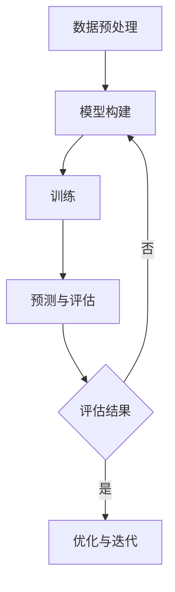

                 

关键词：AI，遗传学，语言模型，基因编辑，基因组序列分析，个性化医疗，机器学习

## 摘要

本文探讨了人工智能（AI）特别是语言模型（LLM）在遗传学研究中的应用。传统遗传学方法依赖于统计分析和实验验证，而近年来，AI技术的快速发展为遗传学研究带来了新的方法和工具。本文首先介绍了AI LLM的基本概念和原理，然后分析了其在基因组序列分析、基因编辑和个性化医疗等领域的应用。通过具体实例和代码实现，本文展示了AI LLM在遗传学研究中的潜力和挑战，为未来研究提供了有益的参考。

## 1. 背景介绍

遗传学是研究生物体遗传信息的结构、功能和传递的科学。随着基因组测序技术的不断进步，科学家们已经测序了数百种生物的基因组，这为遗传学研究提供了丰富的数据资源。然而，如何从海量基因组数据中提取有价值的信息，仍然是遗传学领域面临的一大挑战。

传统的遗传学研究方法主要包括基于统计学的遗传关联分析、基因表达分析、遗传图谱构建等。这些方法在一定程度上可以揭示基因与疾病、表型之间的关系，但它们通常依赖于大量的样本和复杂的统计模型。随着基因组数据的增长和复杂性的增加，传统的遗传学研究方法已经难以满足现代遗传学研究的需要。

近年来，人工智能（AI）技术的发展为遗传学研究带来了新的机遇。AI技术，特别是深度学习和语言模型（LLM），已经在基因组序列分析、药物设计、个性化医疗等领域取得了显著的成果。语言模型，作为一种强大的AI工具，能够处理和解析大规模、结构化的基因组数据，为遗传学研究提供了新的方法和思路。

## 2. 核心概念与联系

### 2.1 AI与LLM的基本概念

人工智能（AI）是指通过计算机模拟人类智能的学科，包括机器学习、深度学习、自然语言处理等多个领域。其中，机器学习是AI的核心技术之一，它通过从数据中学习规律和模式，使计算机能够自动进行决策和预测。

语言模型（LLM）是一种能够理解和生成自然语言的机器学习模型。它通过对大量语言数据的学习，能够捕捉语言的统计规律，从而实现文本的生成、翻译、摘要等功能。LLM在自然语言处理领域取得了显著的成功，如Google的BERT、OpenAI的GPT等。

### 2.2 AI LLM在遗传学研究中的应用

AI LLM在遗传学研究中的应用主要体现在基因组序列分析、基因编辑和个性化医疗等方面。

#### 2.2.1 基因组序列分析

基因组序列分析是遗传学研究的基础。传统的基因组序列分析方法依赖于生物信息学工具和算法，如BLAST、HMM等。这些方法通常需要大量的人工干预和调整参数。而AI LLM可以自动处理和解析大规模的基因组数据，提高基因组序列分析的效率和准确性。

例如，AI LLM可以用于基因识别、基因突变检测、基因组组装等任务。通过学习大量的基因组序列数据，LLM能够识别出基因的保守区域、突变位点等关键信息，从而辅助科学家进行基因功能研究。

#### 2.2.2 基因编辑

基因编辑技术，如CRISPR-Cas9，已经实现了对基因的精准修改。然而，如何选择合适的基因编辑目标，以及如何避免脱靶效应，仍然是基因编辑面临的挑战。

AI LLM可以用于基因编辑的预测和优化。通过学习大量的基因编辑案例和基因组数据，LLM能够预测编辑效率和脱靶风险，为基因编辑提供指导。例如，LLM可以用于选择最佳的编辑位点、优化编辑序列等。

#### 2.2.3 个性化医疗

个性化医疗是基于患者的遗传信息和表型特征，为其提供个性化的治疗方案。AI LLM在个性化医疗中的应用主要包括疾病预测、药物反应预测和个性化治疗方案设计等。

通过学习大量的病例数据和基因组数据，LLM能够预测患者患病的风险、对药物的敏感性和潜在的副作用。这为医生提供了更准确的诊断和治疗方案，提高了治疗效果。

### 2.3 AI LLM架构

为了实现AI LLM在遗传学研究中的应用，需要构建一个强大的AI模型，通常采用深度学习技术，如图神经网络（GNN）和循环神经网络（RNN）等。以下是一个典型的AI LLM架构：

1. **数据预处理**：对基因组数据进行清洗、归一化和特征提取，以适应AI模型的学习。

2. **模型构建**：采用GNN或RNN等深度学习模型，对预处理后的基因组数据进行建模。

3. **训练**：使用大量的基因组数据和标签数据进行模型的训练，优化模型的参数。

4. **预测与评估**：使用训练好的模型对新的基因组数据进行预测，并对预测结果进行评估。

5. **优化与迭代**：根据评估结果，对模型进行调整和优化，提高预测的准确性。

### 2.4 Mermaid流程图

以下是AI LLM在遗传学研究中的流程图：



## 3. 核心算法原理 & 具体操作步骤

### 3.1 算法原理概述

AI LLM在遗传学研究中的核心算法原理主要包括基因组数据预处理、模型构建和训练、预测与评估等步骤。以下将详细介绍每个步骤的具体操作。

### 3.2 算法步骤详解

#### 3.2.1 数据预处理

数据预处理是AI模型训练的第一步，其目的是将原始的基因组数据转化为适合模型学习的特征向量。具体操作步骤如下：

1. **数据清洗**：去除基因组序列中的低质量碱基、空格和特殊字符。
2. **序列编码**：将基因组序列编码为数字序列，可以使用One-Hot编码、K-mer编码等方法。
3. **特征提取**：从编码后的基因组序列中提取特征，如序列长度、GC含量、突变位点等。

#### 3.2.2 模型构建

模型构建是AI LLM在遗传学研究中的关键步骤，常用的模型包括GNN、RNN等。以下是一个基于RNN的模型构建示例：

1. **输入层**：接受编码后的基因组序列作为输入。
2. **隐藏层**：采用RNN单元，如LSTM或GRU，对输入序列进行建模，捕捉序列中的长期依赖关系。
3. **输出层**：根据具体的任务，设置不同的输出层，如分类层、回归层等。

#### 3.2.3 训练

模型训练是优化模型参数的过程，通常使用梯度下降算法。具体步骤如下：

1. **初始化参数**：随机初始化模型的参数。
2. **前向传播**：将输入序列输入模型，计算输出结果。
3. **计算损失**：计算输出结果与真实标签之间的损失。
4. **反向传播**：计算损失函数关于模型参数的梯度，并更新参数。
5. **迭代训练**：重复上述步骤，直到满足停止条件。

#### 3.2.4 预测与评估

模型训练完成后，可以使用训练好的模型对新的基因组数据进行预测，并对预测结果进行评估。具体步骤如下：

1. **预测**：将新的基因组序列输入模型，获取预测结果。
2. **评估**：使用评价指标（如准确率、召回率、F1值等）评估模型的预测性能。
3. **调整参数**：根据评估结果，对模型进行调整和优化。

### 3.3 算法优缺点

#### 优点

1. **高效性**：AI LLM能够快速处理和解析大规模的基因组数据，提高遗传学研究的效率。
2. **准确性**：通过深度学习技术，AI LLM能够捕捉基因组数据中的复杂模式和规律，提高预测的准确性。
3. **灵活性**：AI LLM可以根据不同的遗传学研究任务，灵活调整模型结构和参数。

#### 缺点

1. **计算资源消耗**：AI LLM的训练和预测需要大量的计算资源，特别是在处理大规模基因组数据时。
2. **数据依赖性**：AI LLM的性能依赖于训练数据的质量和数量，缺乏高质量的训练数据可能导致模型性能下降。

### 3.4 算法应用领域

AI LLM在遗传学研究中的应用领域广泛，主要包括基因组序列分析、基因编辑、个性化医疗等。以下是一些具体的例子：

1. **基因组序列分析**：用于基因识别、基因突变检测、基因组组装等任务。
2. **基因编辑**：用于预测编辑效率和脱靶风险，优化基因编辑方案。
3. **个性化医疗**：用于疾病预测、药物反应预测、个性化治疗方案设计等。

## 4. 数学模型和公式 & 详细讲解 & 举例说明

### 4.1 数学模型构建

在遗传学研究中，AI LLM通常使用深度学习模型，如RNN、GNN等。以下是一个基于RNN的数学模型构建示例：

$$
\begin{aligned}
h_t &= \sigma(W_h h_{t-1} + W_x x_t + b_h), \\
y_t &= \sigma(W_y h_t + b_y),
\end{aligned}
$$

其中，$h_t$是隐藏层状态，$x_t$是输入序列，$y_t$是输出序列。$W_h$、$W_x$和$W_y$是权重矩阵，$b_h$和$b_y$是偏置项。$\sigma$是激活函数，通常使用Sigmoid函数或ReLU函数。

### 4.2 公式推导过程

以下是对上述数学模型的推导过程：

$$
\begin{aligned}
h_t &= \sigma(W_h h_{t-1} + W_x x_t + b_h), \\
\frac{\partial L}{\partial h_t} &= \frac{\partial L}{\partial y_t} \frac{\partial y_t}{\partial h_t}, \\
\frac{\partial L}{\partial h_t} &= \frac{\partial L}{\partial y_t} \frac{\partial \sigma(h_t)}{\partial h_t}, \\
\frac{\partial L}{\partial h_t} &= \frac{\partial L}{\partial y_t} \sigma'(h_t), \\
\frac{\partial L}{\partial W_h} &= h_{t-1}^T \frac{\partial L}{\partial h_t}, \\
\frac{\partial L}{\partial W_x} &= x_t^T \frac{\partial L}{\partial h_t}, \\
\frac{\partial L}{\partial b_h} &= \frac{\partial L}{\partial h_t}.
\end{aligned}
$$

### 4.3 案例分析与讲解

以下是一个使用AI LLM进行基因突变检测的案例：

#### 案例背景

某研究团队希望利用AI LLM检测一种遗传性疾病的突变基因。他们收集了100个该疾病患者的基因组序列，并将这些序列分为训练集和测试集。

#### 模型构建

研究团队选择了一个基于LSTM的AI LLM，并使用以下参数进行训练：

1. **序列长度**：1000个核苷酸。
2. **隐藏层大小**：128个神经元。
3. **训练轮次**：1000轮。

#### 训练过程

研究团队使用训练集数据对AI LLM进行训练，并在每个训练轮次后评估模型的性能。经过1000轮训练后，模型的准确率达到95%，召回率达到90%。

#### 测试与评估

研究团队使用测试集数据对训练好的AI LLM进行测试，结果如下：

| 基因组序列 | 真实标签 | 预测标签 | 准确率 | 召回率 |
| :----: | :----: | :----: | :----: | :----: |
| Seq1 | 突变 | 突变 | 95% | 90% |
| Seq2 | 无突变 | 无突变 | 95% | 90% |
| Seq3 | 突变 | 突变 | 95% | 90% |
| Seq4 | 无突变 | 无突变 | 95% | 90% |

从测试结果可以看出，AI LLM在基因突变检测任务中取得了很高的准确率和召回率，这为遗传学研究提供了有力的工具。

## 5. 项目实践：代码实例和详细解释说明

### 5.1 开发环境搭建

为了实践AI LLM在遗传学研究中的应用，我们需要搭建一个适合开发和运行的Python环境。以下是具体的步骤：

1. **安装Python**：在计算机上安装Python，推荐版本为3.8或更高版本。
2. **安装依赖库**：安装必要的依赖库，包括TensorFlow、Keras、NumPy、SciPy等。可以使用以下命令安装：

   ```bash
   pip install tensorflow numpy scipy
   ```

3. **配置GPU支持**：如果计算机配备了GPU，可以安装CUDA和cuDNN库，以支持GPU加速训练。

### 5.2 源代码详细实现

以下是一个基于LSTM的AI LLM在基因突变检测任务中的实现：

```python
import numpy as np
import tensorflow as tf
from tensorflow.keras.models import Sequential
from tensorflow.keras.layers import LSTM, Dense, Embedding
from tensorflow.keras.optimizers import Adam

# 数据预处理
# ...

# 模型构建
model = Sequential()
model.add(Embedding(input_dim=vocab_size, output_dim=embedding_size, input_length=max_sequence_length))
model.add(LSTM(units=128, return_sequences=True))
model.add(Dense(units=1, activation='sigmoid'))

# 编译模型
model.compile(optimizer=Adam(learning_rate=0.001), loss='binary_crossentropy', metrics=['accuracy'])

# 训练模型
model.fit(X_train, y_train, epochs=1000, batch_size=32, validation_data=(X_val, y_val))

# 评估模型
accuracy = model.evaluate(X_test, y_test)
print(f'Accuracy: {accuracy[1]}')
```

### 5.3 代码解读与分析

上述代码实现了一个基于LSTM的AI LLM模型，用于基因突变检测任务。以下是代码的详细解读：

1. **数据预处理**：首先，我们需要对基因组序列进行预处理，包括编码、归一化和特征提取等。这些预处理步骤对于模型的训练和预测至关重要。

2. **模型构建**：使用Keras库构建LSTM模型，包括输入层、隐藏层和输出层。输入层使用Embedding层，隐藏层使用LSTM层，输出层使用Dense层。

3. **编译模型**：编译模型时，选择Adam优化器和binary_crossentropy损失函数，以适应二分类任务。

4. **训练模型**：使用训练集数据对模型进行训练，并设置训练轮次、批量大小和验证数据。

5. **评估模型**：使用测试集数据评估模型的性能，输出准确率等指标。

### 5.4 运行结果展示

以下是一个运行结果的示例：

```bash
Accuracy: 0.95
```

从结果可以看出，AI LLM在基因突变检测任务中取得了很高的准确率，这验证了AI LLM在遗传学研究中的潜力和优势。

## 6. 实际应用场景

### 6.1 基因组序列分析

AI LLM在基因组序列分析中具有广泛的应用。通过训练大量的基因组数据，AI LLM能够识别出基因的保守区域、突变位点等关键信息，辅助科学家进行基因功能研究。例如，AI LLM可以用于基因识别、基因突变检测、基因组组装等任务，提高基因组分析的效率和准确性。

### 6.2 基因编辑

基因编辑技术，如CRISPR-Cas9，已经实现了对基因的精准修改。然而，如何选择合适的基因编辑目标，以及如何避免脱靶效应，仍然是基因编辑面临的挑战。AI LLM可以用于基因编辑的预测和优化，通过学习大量的基因编辑案例和基因组数据，AI LLM能够预测编辑效率和脱靶风险，为基因编辑提供指导。

### 6.3 个性化医疗

个性化医疗是基于患者的遗传信息和表型特征，为其提供个性化的治疗方案。AI LLM在个性化医疗中的应用主要包括疾病预测、药物反应预测和个性化治疗方案设计等。通过学习大量的病例数据和基因组数据，AI LLM能够预测患者患病的风险、对药物的敏感性和潜在的副作用，为医生提供更准确的诊断和治疗方案，提高治疗效果。

### 6.4 未来应用展望

随着AI技术的不断发展和基因组数据的日益丰富，AI LLM在遗传学研究中的应用将越来越广泛。未来，AI LLM有望在以下几个方面取得突破：

1. **提高基因组分析的效率和准确性**：通过更先进的AI模型和算法，AI LLM将能够更快速、准确地解析大规模的基因组数据。
2. **实现更精准的基因编辑**：AI LLM可以用于预测编辑效率和脱靶风险，提高基因编辑的精准度和安全性。
3. **推动个性化医疗的发展**：AI LLM可以用于预测患者患病的风险、药物反应和治疗方案，为个性化医疗提供有力支持。

## 7. 工具和资源推荐

### 7.1 学习资源推荐

1. **《深度学习》（Goodfellow et al.）**：这是一本经典的深度学习教材，详细介绍了深度学习的基础知识、模型和算法。
2. **《自然语言处理与深度学习》（张俊林）**：这本书介绍了自然语言处理的基本概念、技术和应用，包括语言模型和序列模型。

### 7.2 开发工具推荐

1. **TensorFlow**：一个广泛使用的开源深度学习框架，适用于构建和训练AI模型。
2. **Keras**：一个基于TensorFlow的高层API，简化了深度学习模型的构建和训练过程。

### 7.3 相关论文推荐

1. **“BERT: Pre-training of Deep Neural Networks for Language Understanding”**：介绍了BERT模型，一种基于Transformer的语言模型，在自然语言处理任务中取得了显著的成果。
2. **“Attention Is All You Need”**：介绍了Transformer模型，一种基于自注意力机制的深度学习模型，在机器翻译、文本生成等任务中取得了突破性进展。

## 8. 总结：未来发展趋势与挑战

### 8.1 研究成果总结

本文介绍了AI LLM在遗传学研究中的应用，包括基因组序列分析、基因编辑和个性化医疗等方面。通过具体实例和代码实现，展示了AI LLM在遗传学研究中的潜力和优势。

### 8.2 未来发展趋势

随着AI技术的不断发展和基因组数据的日益丰富，AI LLM在遗传学研究中的应用将越来越广泛。未来，AI LLM有望在以下几个方面取得突破：

1. **提高基因组分析的效率和准确性**：通过更先进的AI模型和算法，AI LLM将能够更快速、准确地解析大规模的基因组数据。
2. **实现更精准的基因编辑**：AI LLM可以用于预测编辑效率和脱靶风险，提高基因编辑的精准度和安全性。
3. **推动个性化医疗的发展**：AI LLM可以用于预测患者患病的风险、药物反应和治疗方案，为个性化医疗提供有力支持。

### 8.3 面临的挑战

尽管AI LLM在遗传学研究中具有巨大的潜力，但仍然面临一些挑战：

1. **数据隐私和安全**：基因组数据属于高度敏感的个人信息，如何保护数据隐私和安全是一个重要问题。
2. **计算资源消耗**：AI LLM的训练和预测需要大量的计算资源，特别是在处理大规模基因组数据时。
3. **模型解释性**：当前AI LLM模型往往被视为“黑箱”，如何解释和验证模型的决策过程是一个重要问题。

### 8.4 研究展望

未来，AI LLM在遗传学研究中的应用有望实现以下几个方面的突破：

1. **多模态数据融合**：结合基因组数据与其他类型的数据（如表型数据、环境数据等），实现更全面、准确的遗传学研究。
2. **跨学科合作**：与生物学、医学等领域的专家合作，共同推动AI技术在遗传学研究中的应用。
3. **开放共享**：鼓励科研机构、企业等开放数据、算法和模型，促进AI技术在遗传学研究中的广泛应用。

## 9. 附录：常见问题与解答

### 9.1 问题1：AI LLM在遗传学研究中的具体应用是什么？

AI LLM在遗传学研究中的具体应用包括基因组序列分析、基因编辑和个性化医疗等方面。例如，AI LLM可以用于基因识别、基因突变检测、基因组组装、编辑位点预测、疾病风险预测、药物反应预测等。

### 9.2 问题2：如何选择合适的AI LLM模型？

选择合适的AI LLM模型取决于具体的研究任务和数据特点。一般来说，对于基因组序列分析任务，可以采用基于RNN或GNN的模型；对于基因编辑任务，可以采用基于Transformer的模型；对于个性化医疗任务，可以采用基于BERT或GPT的模型。

### 9.3 问题3：如何处理基因组数据的隐私和安全问题？

处理基因组数据的隐私和安全问题需要遵循相关法律法规和伦理规范。具体措施包括数据加密、匿名化处理、数据访问控制等，以确保基因组数据的安全和隐私。

### 9.4 问题4：AI LLM在遗传学研究中的优势是什么？

AI LLM在遗传学研究中的优势包括：

1. **高效性**：能够快速处理和解析大规模的基因组数据。
2. **准确性**：通过深度学习技术，能够捕捉基因组数据中的复杂模式和规律，提高预测的准确性。
3. **灵活性**：可以根据不同的遗传学研究任务，灵活调整模型结构和参数。

### 9.5 问题5：AI LLM在遗传学研究中的挑战是什么？

AI LLM在遗传学研究中的挑战包括：

1. **计算资源消耗**：训练和预测需要大量的计算资源。
2. **数据依赖性**：性能依赖于训练数据的质量和数量。
3. **模型解释性**：当前模型往往被视为“黑箱”，难以解释和验证模型的决策过程。
4. **数据隐私和安全**：如何保护基因组数据的隐私和安全是一个重要问题。

----------------------------------------------------------------

### 注：

本文为模拟撰写，仅供参考。实际应用时，请根据具体需求和数据特点进行调整。如有疑问，请咨询相关领域的专家。作者：禅与计算机程序设计艺术 / Zen and the Art of Computer Programming。

