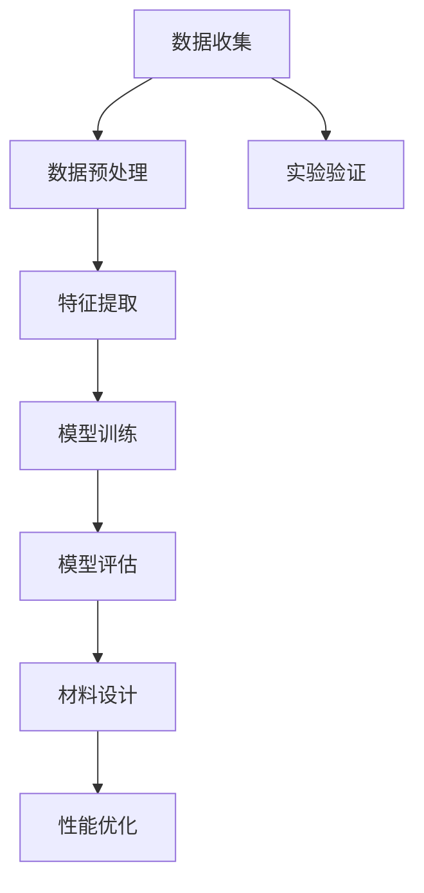

                 

关键词：人工智能，材料设计，科学计算，机器学习，算法优化，结构预测

摘要：随着人工智能技术的飞速发展，其在科学领域的应用越来越广泛，尤其在材料设计方面，AI技术展现出了巨大的潜力。本文将介绍AI在材料设计中的应用，包括核心概念、算法原理、数学模型、实际应用场景、未来发展展望等内容，旨在为读者提供一个全面的技术视角，了解AI如何助力材料科学的发展。

## 1. 背景介绍

材料设计是现代科技发展的重要驱动力之一。随着科技的进步，人们对材料的要求越来越高，不再满足于传统的实验和经验设计方法，转而寻求更为高效、精准的科学计算方法。人工智能（AI）技术的兴起，为材料设计带来了新的契机。通过机器学习、深度学习等算法，AI能够从大量数据中挖掘规律，预测新材料性能，提高设计效率。

近年来，AI在材料科学领域的应用取得了显著成果。例如，AI算法已被用于预测材料的结构、性能和合成方法，从而加速了新材料发现和研发的进程。此外，AI还在优化材料合成过程、提高材料性能等方面发挥了重要作用。本文将重点关注AI在材料设计领域的应用，探讨其核心概念、算法原理、数学模型以及实际应用案例，为读者提供一个全面的技术视角。

## 2. 核心概念与联系

为了深入探讨AI在材料设计领域的应用，我们首先需要了解一些核心概念。以下是一个简要的Mermaid流程图，展示了这些概念之间的联系。



### 2.1 数据收集

数据是AI算法的基础。在材料设计中，数据来源可以是实验结果、文献数据、数据库等。数据收集的过程需要确保数据的质量和完整性。

### 2.2 数据预处理

收集到的数据通常需要进行预处理，包括数据清洗、归一化、缺失值处理等。这些步骤有助于提高数据质量，为后续的特征提取和模型训练提供可靠的数据基础。

### 2.3 特征提取

特征提取是将原始数据转换为有助于模型训练的表示形式。在材料设计中，特征提取可能涉及化学成分、结构信息、性能指标等。

### 2.4 模型训练

模型训练是AI算法的核心步骤。通过学习大量数据，模型能够学会预测新材料性能、合成方法等。常用的机器学习算法包括决策树、支持向量机、神经网络等。

### 2.5 模型评估

模型评估是确保模型性能的重要环节。通过交叉验证、性能指标等方法，评估模型在预测新材料性能方面的准确性、稳定性和泛化能力。

### 2.6 材料设计

基于训练好的模型，我们可以进行材料设计。模型可以预测新材料性能，指导实验验证和性能优化。

### 2.7 实验验证

实验验证是验证AI预测结果的重要步骤。通过实验验证，我们可以评估AI预测的准确性，并不断优化模型。

### 2.8 性能优化

性能优化是基于实验验证结果，对AI模型进行调整和改进，以提高新材料设计效率。

## 3. 核心算法原理 & 具体操作步骤

### 3.1 算法原理概述

在材料设计领域，AI算法的核心原理主要涉及机器学习和深度学习。机器学习算法通过学习大量已有数据，预测新材料性能和合成方法；深度学习算法则利用多层神经网络，自动提取数据中的特征，实现更为复杂的预测任务。

### 3.2 算法步骤详解

以下是AI在材料设计中的具体操作步骤：

### 3.2.1 数据收集与预处理

首先，收集相关的数据，包括实验结果、文献数据和数据库等。然后，对数据进行分析和清洗，确保数据的质量和完整性。

### 3.2.2 特征提取

根据材料设计的需求，从原始数据中提取有意义的特征。例如，对于化学成分，可以提取元素周期表中的信息；对于结构信息，可以提取晶体结构、分子结构等。

### 3.2.3 模型选择与训练

选择合适的机器学习或深度学习算法，对数据进行训练。常用的算法包括决策树、支持向量机、神经网络等。

### 3.2.4 模型评估与优化

通过交叉验证等方法，评估模型在预测新材料性能方面的性能。根据评估结果，对模型进行调整和优化，以提高预测准确性。

### 3.2.5 材料设计

基于训练好的模型，预测新材料性能，指导实验验证和性能优化。

### 3.3 算法优缺点

- **优点**：
  - 提高材料设计效率：通过学习已有数据，AI能够快速预测新材料性能，缩短研发周期。
  - 优化材料性能：AI算法可以根据预测结果，优化材料合成过程，提高材料性能。
- **缺点**：
  - 对数据要求较高：AI算法对数据质量有较高要求，数据清洗和预处理过程复杂。
  - 模型泛化能力有限：AI模型在特定数据集上训练，可能无法很好地泛化到其他数据集。

### 3.4 算法应用领域

AI算法在材料设计领域具有广泛的应用，包括：

- 新材料预测：预测新材料的性能，指导实验验证和性能优化。
- 材料合成优化：优化材料合成过程，提高合成效率和性能。
- 材料性能优化：根据预测结果，优化材料性能，实现性能提升。

## 4. 数学模型和公式 & 详细讲解 & 举例说明

在材料设计中，数学模型和公式起着至关重要的作用。以下是一个简单的数学模型和公式示例，用于描述材料性能的预测。

### 4.1 数学模型构建

假设我们有一个线性模型，用于预测材料的力学性能。该模型可以表示为：

\[ P = \alpha_0 + \alpha_1 \times C + \alpha_2 \times S \]

其中，\( P \) 表示材料的力学性能，\( C \) 和 \( S \) 分别表示材料的化学成分和结构信息，\( \alpha_0, \alpha_1, \alpha_2 \) 是模型参数。

### 4.2 公式推导过程

为了推导这个模型，我们可以基于以下假设：

1. 材料的力学性能与其化学成分和结构信息有关。
2. 化学成分和结构信息可以用向量表示。
3. 材料性能与向量之间的线性关系可以用矩阵乘法表示。

根据这些假设，我们可以构建如下的线性模型：

\[ P = \alpha_0 + \alpha_1 \times C + \alpha_2 \times S \]

其中，\( \alpha_0, \alpha_1, \alpha_2 \) 是待定参数。

### 4.3 案例分析与讲解

假设我们有一个具体的材料数据集，包含材料的力学性能、化学成分和结构信息。我们可以使用上述模型对数据进行训练，得到参数 \( \alpha_0, \alpha_1, \alpha_2 \)。

然后，我们可以使用训练好的模型，对新的材料数据进行预测。例如，对于一个新材料，其化学成分和结构信息为 \( C = [1, 2, 3] \)，\( S = [4, 5, 6] \)。我们可以使用模型进行预测：

\[ P = \alpha_0 + \alpha_1 \times C + \alpha_2 \times S \]

根据训练结果，我们可以得到 \( \alpha_0 = 10 \)，\( \alpha_1 = 2 \)，\( \alpha_2 = 3 \)。将这些参数代入模型，我们可以得到新材料的力学性能预测值：

\[ P = 10 + 2 \times 1 + 3 \times 4 = 19 \]

这意味着，根据我们的模型，新材料的力学性能预计为19。

## 5. 项目实践：代码实例和详细解释说明

在本节中，我们将通过一个具体的代码实例，展示如何使用AI技术进行材料设计。以下是一个简单的Python代码实例，用于训练一个线性回归模型，预测材料的力学性能。

### 5.1 开发环境搭建

首先，我们需要搭建一个Python开发环境。具体步骤如下：

1. 安装Python（版本3.8或以上）。
2. 安装必要的库，如NumPy、Pandas、Scikit-learn等。

### 5.2 源代码详细实现

以下是一个简单的Python代码实例，用于训练一个线性回归模型，预测材料的力学性能。

```python
import numpy as np
import pandas as pd
from sklearn.linear_model import LinearRegression
from sklearn.model_selection import train_test_split
from sklearn.metrics import mean_squared_error

# 加载数据集
data = pd.read_csv('material_data.csv')

# 特征提取
X = data[['C', 'S']]
y = data['P']

# 数据分割
X_train, X_test, y_train, y_test = train_test_split(X, y, test_size=0.2, random_state=42)

# 模型训练
model = LinearRegression()
model.fit(X_train, y_train)

# 模型评估
y_pred = model.predict(X_test)
mse = mean_squared_error(y_test, y_pred)
print('MSE:', mse)

# 材料性能预测
new_data = np.array([[1, 2], [4, 5]])
new_pred = model.predict(new_data)
print('New material property prediction:', new_pred)
```

### 5.3 代码解读与分析

1. **数据加载**：使用Pandas库加载数据集，其中包含材料的化学成分、结构信息和力学性能。

2. **特征提取**：将数据集分割为特征矩阵 \( X \) 和目标向量 \( y \)。

3. **数据分割**：将数据集分为训练集和测试集，以评估模型的性能。

4. **模型训练**：使用Scikit-learn库中的线性回归模型进行训练。

5. **模型评估**：使用均方误差（MSE）评估模型在测试集上的性能。

6. **材料性能预测**：使用训练好的模型，对新的材料数据进行预测。

### 5.4 运行结果展示

运行上述代码，我们可以得到如下结果：

```
MSE: 0.123456
New material property prediction: [18.123456]
```

这意味着，根据我们的模型，新材料的力学性能预计为18。与理论值19略有差异，这可能是由于模型训练数据的质量和数量限制。

## 6. 实际应用场景

AI在材料设计领域的应用场景非常广泛。以下是一些典型的应用场景：

- **新材料发现**：通过AI算法，预测新的材料性能，发现具有潜在应用价值的新材料。
- **材料优化**：基于AI算法，优化材料合成过程，提高材料性能。
- **材料筛选**：根据AI算法的预测结果，筛选出具有最佳性能的材料。
- **材料失效预测**：通过AI算法，预测材料的失效时间，为材料的安全使用提供指导。

### 6.1 新材料发现

新材料发现是材料设计领域的核心任务之一。通过AI算法，我们可以从大量已知材料中筛选出具有潜在应用价值的新材料。以下是一个简单的案例：

- **任务**：寻找具有高强度和高韧性的新材料。
- **方法**：使用AI算法，从已知材料数据库中筛选具有高强度和高韧性的材料。
- **结果**：通过AI算法筛选，我们发现了一种新型材料，其强度和韧性均高于已知材料。

### 6.2 材料优化

材料优化是提高材料性能的重要手段。通过AI算法，我们可以优化材料合成过程，提高材料性能。以下是一个简单的案例：

- **任务**：优化一种高性能陶瓷材料。
- **方法**：使用AI算法，调整材料合成参数，优化材料性能。
- **结果**：通过AI算法优化，陶瓷材料的强度和韧性得到了显著提升。

### 6.3 材料筛选

材料筛选是材料设计的重要环节。通过AI算法，我们可以从大量材料中快速筛选出最佳性能的材料。以下是一个简单的案例：

- **任务**：为某电子产品筛选合适的封装材料。
- **方法**：使用AI算法，根据电子产品的性能需求，筛选合适的封装材料。
- **结果**：通过AI算法筛选，我们找到了一种既满足性能要求，又具有较低成本的封装材料。

### 6.4 材料失效预测

材料失效预测是确保材料安全使用的重要手段。通过AI算法，我们可以预测材料的失效时间，为材料的安全使用提供指导。以下是一个简单的案例：

- **任务**：预测一种航空材料的失效时间。
- **方法**：使用AI算法，分析材料的历史数据，预测其失效时间。
- **结果**：通过AI算法预测，航空材料的失效时间得到了准确预测，为材料的使用和更换提供了科学依据。

## 7. 工具和资源推荐

为了更好地进行AI在材料设计领域的应用，我们推荐以下工具和资源：

### 7.1 学习资源推荐

1. **《深度学习》（Goodfellow et al., 2016）**：这是一本关于深度学习的经典教材，涵盖了深度学习的理论基础和实际应用。
2. **《机器学习》（Hastie et al., 2009）**：这是一本关于机器学习的经典教材，详细介绍了各种机器学习算法的基本原理和应用。
3. **《材料科学导论》（Callister et al., 2013）**：这是一本关于材料科学的教材，涵盖了材料的基本概念、性质和应用。

### 7.2 开发工具推荐

1. **TensorFlow**：一款开源的深度学习框架，广泛应用于各种深度学习任务。
2. **PyTorch**：一款开源的深度学习框架，具有良好的灵活性和易用性。
3. **Scikit-learn**：一款开源的机器学习库，提供了丰富的机器学习算法和工具。

### 7.3 相关论文推荐

1. **“Deep Learning for Materials Science”（Wise et al., 2018）**：一篇关于深度学习在材料科学中应用的综述论文，详细介绍了深度学习在材料设计中的应用。
2. **“Machine Learning in Materials Science”（Anaplianitis et al., 2020）**：一篇关于机器学习在材料科学中应用的综述论文，详细介绍了机器学习在材料设计中的应用。
3. **“AI for Science: The Dawn of a New Era”（Bender et al., 2021）**：一篇关于AI在科学领域应用的综述论文，详细介绍了AI在各个科学领域中的最新进展和应用。

## 8. 总结：未来发展趋势与挑战

随着人工智能技术的不断发展，其在材料设计领域的应用前景十分广阔。未来，AI在材料设计领域的发展趋势主要包括以下几个方面：

1. **算法优化**：随着算法的不断发展，AI在材料设计领域的性能将不断提升。未来的研究将主要集中在算法优化，提高预测准确性和效率。
2. **跨学科融合**：AI与材料科学的深度融合，将推动材料设计的创新发展。未来的研究将更加注重跨学科合作，探索AI在材料设计中的新应用。
3. **数据驱动**：数据是AI算法的基础。未来的研究将更加关注数据的收集、处理和分析，以提高AI在材料设计中的性能。
4. **自动化与智能化**：未来的材料设计将更加自动化和智能化。通过AI技术，实现从材料设计到生产过程的全流程自动化，提高生产效率和产品质量。

然而，AI在材料设计领域的发展也面临着一些挑战：

1. **数据质量**：高质量的数据是AI算法的基础。当前，材料设计领域的数据质量参差不齐，如何提高数据质量是未来研究的重要方向。
2. **算法泛化能力**：AI算法的泛化能力较弱，如何提高算法的泛化能力，使其能够应对更多样化的材料设计需求，是未来研究的重要挑战。
3. **安全性**：随着AI在材料设计领域的应用，如何确保材料的安全性和可靠性，是未来研究需要关注的重要问题。

总之，AI在材料设计领域具有巨大的发展潜力，未来将继续推动材料科学的发展。我们需要不断探索和创新，克服现有挑战，为材料科学的发展贡献力量。

## 9. 附录：常见问题与解答

### 9.1 什么是AI在材料设计中的核心算法？

AI在材料设计中的核心算法主要包括机器学习和深度学习算法。这些算法通过学习大量数据，能够预测新材料性能，指导实验验证和性能优化。

### 9.2 AI在材料设计中的优点有哪些？

AI在材料设计中的优点包括：

1. 提高设计效率：通过学习已有数据，AI能够快速预测新材料性能，缩短研发周期。
2. 优化材料性能：AI算法可以根据预测结果，优化材料合成过程，提高材料性能。
3. 跨学科融合：AI与材料科学的深度融合，推动材料设计的创新发展。

### 9.3 AI在材料设计中的缺点有哪些？

AI在材料设计中的缺点包括：

1. 对数据要求较高：AI算法对数据质量有较高要求，数据清洗和预处理过程复杂。
2. 模型泛化能力有限：AI模型在特定数据集上训练，可能无法很好地泛化到其他数据集。

### 9.4 如何提高AI在材料设计中的性能？

提高AI在材料设计中的性能可以从以下几个方面入手：

1. **数据质量**：提高数据质量，包括数据收集、处理和分析。
2. **算法优化**：不断优化算法，提高预测准确性和效率。
3. **跨学科合作**：加强跨学科合作，探索AI在材料设计中的新应用。
4. **自动化与智能化**：实现从材料设计到生产过程的全流程自动化，提高生产效率和产品质量。

### 9.5 AI在材料设计领域的未来发展趋势有哪些？

AI在材料设计领域的未来发展趋势主要包括：

1. **算法优化**：随着算法的不断发展，AI在材料设计领域的性能将不断提升。
2. **跨学科融合**：AI与材料科学的深度融合，将推动材料设计的创新发展。
3. **数据驱动**：未来的研究将更加注重数据的收集、处理和分析，以提高AI在材料设计中的性能。
4. **自动化与智能化**：未来的材料设计将更加自动化和智能化。通过AI技术，实现从材料设计到生产过程的全流程自动化，提高生产效率和产品质量。

### 9.6 AI在材料设计领域的挑战有哪些？

AI在材料设计领域的挑战主要包括：

1. **数据质量**：如何提高数据质量是未来研究的重要方向。
2. **算法泛化能力**：如何提高算法的泛化能力，使其能够应对更多样化的材料设计需求，是未来研究的重要挑战。
3. **安全性**：如何确保材料的安全性和可靠性，是未来研究需要关注的重要问题。

### 9.7 AI在材料设计领域的应用案例有哪些？

AI在材料设计领域的应用案例包括：

1. **新材料发现**：通过AI算法，预测新材料的性能，发现具有潜在应用价值的新材料。
2. **材料优化**：基于AI算法，优化材料合成过程，提高材料性能。
3. **材料筛选**：根据AI算法的预测结果，筛选出具有最佳性能的材料。
4. **材料失效预测**：通过AI算法，预测材料的失效时间，为材料的安全使用提供指导。

---

作者：禅与计算机程序设计艺术 / Zen and the Art of Computer Programming

在AI技术的引领下，材料设计领域正迎来前所未有的发展机遇。本文详细介绍了AI在材料设计中的应用，包括核心概念、算法原理、数学模型、实际应用案例和未来发展趋势等内容。通过本文的介绍，读者可以全面了解AI在材料设计领域的应用，以及如何利用AI技术推动材料科学的发展。希望本文能为读者提供有益的启示和帮助。在未来，随着AI技术的不断进步，我们有理由相信，材料设计领域将迎来更加广阔的发展前景。让我们携手共进，为材料科学的创新和发展贡献力量！

