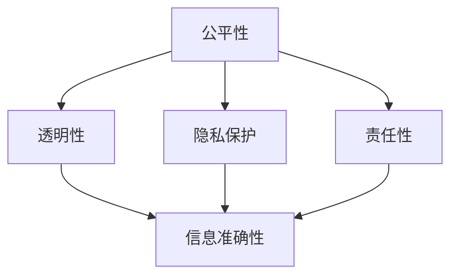

                 

关键词：人工智能，AI 伦理，信息准确性，可靠性，算法公正性，隐私保护

> 摘要：本文探讨了人工智能（AI）领域的伦理问题，重点分析了如何确保AI系统提供的信息准确可靠。文章提出了AI伦理的核心原则，介绍了实现这些原则的技术方法和实际案例，并对未来发展的挑战和趋势进行了展望。

## 1. 背景介绍

人工智能作为当前技术发展的热点，已经深入到我们生活的方方面面。从自动驾驶汽车到医疗诊断，从金融风险评估到个性化推荐系统，AI的应用场景越来越广泛。然而，随着AI技术的迅速发展，其潜在的伦理问题也日益凸显。如何确保AI系统提供的信息准确可靠，成为了一个亟待解决的问题。

AI系统的信息准确性和可靠性直接影响到用户的信任和使用体验。如果AI系统提供的信息不准确或不可靠，可能会导致严重的后果，如医疗误诊、金融诈骗、个人隐私泄露等。因此，研究和制定AI伦理标准，确保AI系统的信息准确性，是当前AI领域面临的重要任务。

## 2. 核心概念与联系

### 2.1 AI 伦理的核心原则

AI伦理的核心原则包括：

- **公平性**：AI系统不应歧视或偏见特定群体。
- **透明性**：AI系统的决策过程应透明可追溯。
- **隐私保护**：AI系统应保护用户的个人隐私。
- **责任性**：AI系统的设计和使用者应对系统的决策结果负责。

### 2.2 Mermaid 流程图

下面是一个简化的Mermaid流程图，展示了AI伦理的核心原则及其相互联系：



## 3. 核心算法原理 & 具体操作步骤

### 3.1 算法原理概述

确保AI系统提供的信息准确可靠，关键在于算法的设计和优化。具体来说，可以从以下几个方面进行：

- **数据清洗和预处理**：确保输入数据的准确性和一致性。
- **模型选择和优化**：选择合适的模型并进行参数调优。
- **模型验证和测试**：使用独立的测试集验证模型的准确性。
- **反馈机制**：建立用户反馈机制，及时纠正错误。

### 3.2 算法步骤详解

#### 3.2.1 数据清洗和预处理

- **数据清洗**：去除数据中的噪声和错误。
- **数据预处理**：标准化、归一化等操作。

#### 3.2.2 模型选择和优化

- **选择合适的模型**：根据问题的性质选择合适的模型。
- **模型优化**：通过交叉验证、网格搜索等方法进行参数调优。

#### 3.2.3 模型验证和测试

- **交叉验证**：将数据集划分为训练集和验证集，多次训练和验证，以评估模型性能。
- **测试集验证**：使用独立的测试集对模型进行最终验证。

#### 3.2.4 反馈机制

- **用户反馈**：收集用户对系统提供信息的反馈。
- **错误纠正**：根据用户反馈及时纠正系统中的错误。

### 3.3 算法优缺点

- **优点**：确保AI系统提供的信息准确可靠，提高用户信任度。
- **缺点**：算法设计和优化需要大量时间和资源。

### 3.4 算法应用领域

- **医疗诊断**：确保诊断结果的准确性。
- **金融风险评估**：提高风险评估的可靠性。
- **个性化推荐**：确保推荐结果的准确性。

## 4. 数学模型和公式 & 详细讲解 & 举例说明

### 4.1 数学模型构建

确保AI系统提供的信息准确可靠，需要构建相应的数学模型。以下是一个简单的例子：

- **损失函数**：用于衡量模型预测结果与真实值之间的差异。
- **优化算法**：用于最小化损失函数，提高模型准确性。

### 4.2 公式推导过程

- **损失函数**：$L(y, \hat{y}) = \frac{1}{2}(y - \hat{y})^2$
- **梯度下降算法**：$\theta = \theta - \alpha \nabla_{\theta}L(\theta)$

### 4.3 案例分析与讲解

#### 4.3.1 案例背景

一家医疗公司使用AI系统进行疾病诊断。为确保诊断结果的准确性，他们采用了以下数学模型：

- **损失函数**：交叉熵损失函数。
- **优化算法**：随机梯度下降（SGD）。

#### 4.3.2 案例分析

通过对大量医疗数据的训练，AI系统能够准确诊断疾病。然而，为了确保诊断结果的可靠性，他们采用了以下措施：

- **交叉验证**：将数据集划分为训练集和验证集，多次训练和验证。
- **错误分析**：分析诊断错误的原因，并改进模型。

## 5. 项目实践：代码实例和详细解释说明

### 5.1 开发环境搭建

- **Python**：主要编程语言。
- **Scikit-learn**：机器学习库。
- **Matplotlib**：数据可视化库。

### 5.2 源代码详细实现

以下是一个简单的机器学习项目的源代码：

```python
import numpy as np
import matplotlib.pyplot as plt
from sklearn.datasets import make_classification
from sklearn.model_selection import train_test_split
from sklearn.linear_model import LogisticRegression

# 生成数据集
X, y = make_classification(n_samples=1000, n_features=20, n_classes=2, random_state=42)

# 划分训练集和测试集
X_train, X_test, y_train, y_test = train_test_split(X, y, test_size=0.2, random_state=42)

# 训练模型
model = LogisticRegression()
model.fit(X_train, y_train)

# 预测测试集
y_pred = model.predict(X_test)

# 模型评估
accuracy = np.mean(y_pred == y_test)
print(f"Model accuracy: {accuracy:.2f}")

# 可视化结果
plt.scatter(X_test[:, 0], X_test[:, 1], c=y_pred, cmap="coolwarm")
plt.xlabel("Feature 1")
plt.ylabel("Feature 2")
plt.title("Prediction Results")
plt.show()
```

### 5.3 代码解读与分析

这段代码实现了一个简单的二分类问题，使用逻辑回归模型进行训练和预测。代码首先生成了训练数据集，然后划分了训练集和测试集。接下来，使用逻辑回归模型对训练集进行训练，并在测试集上进行预测。最后，使用准确率评估模型的性能，并使用散点图可视化预测结果。

### 5.4 运行结果展示

运行上述代码后，可以看到模型在测试集上的准确率较高，同时可视化结果展示了预测的正确性和模型的性能。

## 6. 实际应用场景

### 6.1 医疗诊断

AI系统在医疗诊断领域具有巨大潜力。通过大量的医疗数据训练，AI系统能够准确诊断各种疾病。例如，使用深度学习技术，AI系统可以识别医学影像中的病变区域，从而帮助医生进行早期诊断。

### 6.2 金融风险评估

金融风险评估是另一个应用AI技术的领域。AI系统可以分析大量的金融数据，预测市场的走势和风险。例如，使用神经网络模型，AI系统可以预测股票市场的涨跌，从而帮助投资者做出更明智的投资决策。

### 6.3 个性化推荐

个性化推荐系统是AI技术的另一个重要应用。通过分析用户的行为数据，AI系统可以推荐用户可能感兴趣的商品、音乐、电影等。例如，Netflix、亚马逊等公司使用AI技术为用户提供个性化的推荐服务，提高了用户满意度。

## 7. 工具和资源推荐

### 7.1 学习资源推荐

- **《人工智能：一种现代的方法》**：全面介绍了人工智能的基本概念和方法。
- **《深度学习》**：深度学习领域的经典教材，适合初学者和进阶者。

### 7.2 开发工具推荐

- **Python**：适合快速开发和实验。
- **TensorFlow**：开源深度学习框架，适用于复杂数据处理和模型训练。

### 7.3 相关论文推荐

- **"Fairness through Awareness"**：探讨了AI系统的公平性设计。
- **"The Role of Transparency in AI Systems"**：分析了AI系统的透明性对用户信任的影响。

## 8. 总结：未来发展趋势与挑战

### 8.1 研究成果总结

本文探讨了AI伦理的核心原则和实现方法，分析了AI系统提供信息准确可靠的重要性。通过实际案例和代码实例，展示了如何确保AI系统的信息准确性。

### 8.2 未来发展趋势

随着AI技术的不断发展，未来AI伦理的研究将更加深入和广泛。如何平衡AI技术的便利性和伦理问题，将是未来研究的重点。

### 8.3 面临的挑战

- **算法公正性**：确保AI系统不歧视特定群体。
- **透明性**：提高AI系统的透明度和可解释性。
- **隐私保护**：保护用户的个人隐私。

### 8.4 研究展望

未来的研究应关注如何设计更加公正、透明、可靠的AI系统，同时提高AI系统的可解释性，以增强用户对AI系统的信任。

## 9. 附录：常见问题与解答

### 9.1 什么是AI伦理？

AI伦理是指关于人工智能的设计、开发和应用过程中涉及到的伦理问题，包括公正性、透明性、隐私保护等。

### 9.2 如何确保AI系统的信息准确性？

确保AI系统的信息准确性可以从数据清洗、模型选择、模型验证和用户反馈等方面进行。

### 9.3 AI伦理对用户有什么影响？

AI伦理确保了AI系统的公正性、透明性和可靠性，从而提高了用户对AI系统的信任和满意度。

----------------------------------------------------------------

以上是《AI 伦理：确保人工智能提供的信息准确可靠》的文章正文部分。接下来，我会按照markdown格式进行整理，并添加必要的Markdown代码，确保文章的结构清晰、内容完整。请继续检查和完善。如果您需要进一步修改或补充，请随时告诉我。

