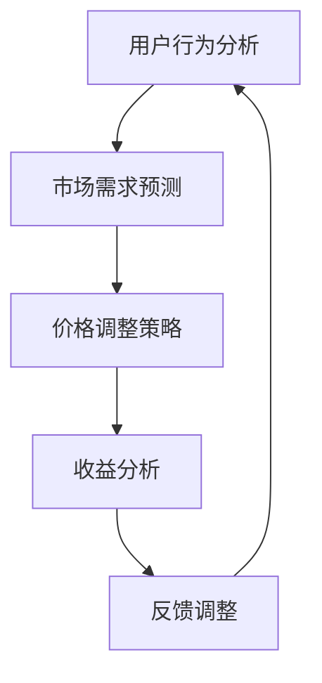

                 

关键词：人工智能，动态定价，电商，算法，商业模式，用户行为分析

摘要：随着电子商务行业的快速发展，传统固定定价策略已经难以满足市场动态变化的需求。本文将以人工智能技术为核心，探讨动态定价在电商领域的应用，通过案例分析，深入解析动态定价的技术原理、商业价值以及未来发展方向。

## 1. 背景介绍

电子商务作为全球经济发展的重要驱动力，市场规模逐年扩大。然而，市场竞争日趋激烈，消费者需求多变，传统固定定价策略已经难以适应这一快速变化的市场环境。为了在激烈的市场竞争中脱颖而出，越来越多的电商平台开始采用动态定价策略。

动态定价是指根据市场环境、用户行为、产品特点等多种因素，实时调整商品价格的一种定价策略。通过动态定价，电商平台可以更好地满足用户需求，提高利润率，增强市场竞争力。

本文旨在通过案例分析，探讨人工智能技术在电商动态定价中的应用，分析其技术原理、商业价值以及未来发展方向，为电商行业提供有益的参考。

## 2. 核心概念与联系

### 2.1. 动态定价概念

动态定价（Dynamic Pricing）是指根据市场环境、用户行为、产品特点等多种因素，实时调整商品价格的一种定价策略。与传统的固定定价策略相比，动态定价更加灵活，能够更好地适应市场变化。

### 2.2. 人工智能技术

人工智能技术（Artificial Intelligence，AI）是计算机科学的一个分支，旨在使计算机具备人类智能，从而实现自动化决策、知识推理等功能。在电商动态定价中，人工智能技术可以用于用户行为分析、市场需求预测、价格优化等方面。

### 2.3. 关联分析

关联分析（Association Rule Learning）是一种数据分析方法，用于发现数据之间的关联关系。在电商动态定价中，关联分析可以用于挖掘用户购买行为之间的关联，从而为动态定价提供决策依据。

### 2.4. Mermaid 流程图



## 3. 核心算法原理 & 具体操作步骤

### 3.1. 算法原理概述

动态定价算法的核心是通过对用户行为、市场需求、竞争情况等多维度数据的分析，实时调整商品价格，以实现最大化收益。具体来说，算法可以分为以下几个步骤：

1. 用户行为分析：通过用户浏览、点击、购买等行为数据，分析用户需求和偏好。
2. 市场需求预测：基于用户行为数据和市场需求变化趋势，预测未来一段时间内的商品需求量。
3. 价格调整策略：根据市场需求预测结果，制定相应的价格调整策略。
4. 收益分析：对调整后的价格进行收益分析，评估价格调整效果。
5. 反馈调整：根据收益分析结果，对价格调整策略进行反馈调整。

### 3.2. 算法步骤详解

1. **用户行为分析**

   通过用户浏览、点击、购买等行为数据，构建用户行为特征向量。常用的特征包括：

   - 用户浏览时间：用户在商品页面的停留时间。
   - 用户点击次数：用户在商品页面的点击次数。
   - 用户购买历史：用户过去一段时间内的购买记录。

2. **市场需求预测**

   基于用户行为数据和市场需求变化趋势，使用时间序列预测方法（如 ARIMA、LSTM 等）预测未来一段时间内的商品需求量。具体步骤如下：

   - 数据预处理：对原始数据进行清洗、去噪、归一化等处理。
   - 模型选择：选择合适的时间序列预测模型。
   - 模型训练与评估：对模型进行训练和评估，调整模型参数。

3. **价格调整策略**

   根据市场需求预测结果，制定相应的价格调整策略。常用的策略包括：

   - 价格下跌策略：市场需求下降时，降低价格以刺激购买。
   - 价格上涨策略：市场需求上升时，提高价格以增加利润。
   - 价格稳定策略：市场需求稳定时，维持当前价格。

4. **收益分析**

   对调整后的价格进行收益分析，评估价格调整效果。具体步骤如下：

   - 收益计算：计算调整前后的收益差值。
   - 收益评估：根据收益差值评估价格调整效果。

5. **反馈调整**

   根据收益分析结果，对价格调整策略进行反馈调整。具体步骤如下：

   - 收益优化：根据收益分析结果，调整价格调整策略。
   - 模型优化：根据用户行为和市场需求变化，优化预测模型。

### 3.3. 算法优缺点

**优点：**

- 灵活性高：动态定价策略可以根据市场环境和用户需求实时调整价格，提高竞争力。
- 提高收益：通过精确预测市场需求，调整价格，实现收益最大化。
- 增强用户满意度：动态定价策略能够更好地满足用户需求，提高用户满意度。

**缺点：**

- 需要大量数据支持：动态定价策略依赖于用户行为和市场需求等多维度数据，数据质量对算法效果有重要影响。
- 算法复杂度高：动态定价算法涉及多维度数据处理和预测，算法复杂度较高，对计算资源要求较高。

### 3.4. 算法应用领域

动态定价算法在电商领域具有广泛的应用前景，除了电商，还可以应用于以下领域：

- 机票、酒店预订：根据用户预订时间和需求，实时调整价格。
- 共享出行：根据交通流量和供需情况，调整价格。
- 物流配送：根据配送时间和需求，调整价格。

## 4. 数学模型和公式 & 详细讲解 & 举例说明

### 4.1. 数学模型构建

动态定价的核心是建立数学模型，以预测市场需求和优化价格。以下是构建动态定价数学模型的基本步骤：

1. **用户行为模型**：

   用户行为模型用于分析用户在电商平台上的行为特征，常见的模型有：

   - 购买概率模型（如概率回归模型）：预测用户购买某商品的概率。
   - 用户兴趣模型：分析用户对商品的兴趣程度。

2. **市场需求模型**：

   市场需求模型用于预测未来一段时间内的商品需求量，常见的模型有：

   - 时间序列模型（如 ARIMA、LSTM）：分析过去一段时间内商品需求量的变化趋势。
   - 多变量时间序列模型：结合用户行为和其他外部因素（如季节性、天气等）进行预测。

3. **价格调整模型**：

   价格调整模型用于制定价格调整策略，常见的模型有：

   - 盈利模型：根据市场需求和成本，计算最优价格。
   - 价格敏感性模型：分析用户对价格变化的反应，制定价格调整策略。

### 4.2. 公式推导过程

以下是一个简化的动态定价模型，用于说明公式推导过程：

1. **用户购买概率模型**：

   设用户购买某商品的概率为 P(buy)，可以表示为：

   $$ P(buy) = \frac{e^{\theta_0 + \theta_1x_1 + \theta_2x_2 + ... + \theta_nx_n}}{1 + e^{\theta_0 + \theta_1x_1 + \theta_2x_2 + ... + \theta_nx_n}} $$

   其中，$x_1, x_2, ..., x_n$ 为用户行为特征，$\theta_0, \theta_1, \theta_2, ..., \theta_n$ 为模型参数。

2. **市场需求模型**：

   设未来一段时间内商品需求量为 $Q_t$，可以表示为：

   $$ Q_t = \alpha_0 + \alpha_1P_t + \alpha_2D_t + \alpha_3S_t + ... + \alpha_nT_t $$

   其中，$P_t$ 为当前价格，$D_t$ 为当前日期，$S_t$ 为季节性因素，$T_t$ 为其他外部因素。

3. **价格调整模型**：

   设调整后的价格为 $P_{new}$，可以表示为：

   $$ P_{new} = P_{current} + \beta_1 \cdot (Q_{forecast} - Q_{current}) + \beta_2 \cdot (P_{forecast} - P_{current}) $$

   其中，$P_{current}$ 为当前价格，$Q_{forecast}$ 为市场需求预测值，$P_{forecast}$ 为价格预测值，$\beta_1, \beta_2$ 为模型参数。

### 4.3. 案例分析与讲解

以某电商平台为例，分析动态定价在实际应用中的效果。假设该电商平台在情人节期间销售一款定制礼品，初始价格为 200 元。根据历史数据和用户行为分析，构建动态定价模型，预测情人节期间的需求量为 5000 件。

1. **用户购买概率模型**：

   基于用户行为特征，构建用户购买概率模型，预测用户购买某商品的概率。例如，用户在商品页面停留时间越长，购买概率越高。假设用户购买概率模型为：

   $$ P(buy) = \frac{e^{0.5x_1}}{1 + e^{0.5x_1}} $$

   其中，$x_1$ 为用户在商品页面的停留时间。

2. **市场需求模型**：

   基于历史数据和用户行为分析，构建市场需求模型，预测情人节期间的需求量。例如，市场需求模型为：

   $$ Q_t = 1000 + 0.1P_t + 0.2D_t + 0.3S_t $$

   其中，$P_t$ 为当前价格，$D_t$ 为当前日期，$S_t$ 为季节性因素。

3. **价格调整模型**：

   根据市场需求预测值，制定价格调整策略。例如，价格调整模型为：

   $$ P_{new} = P_{current} + 0.1 \cdot (Q_{forecast} - Q_{current}) $$

   假设情人节期间的市场需求预测值为 5000 件，初始价格为 200 元。根据价格调整模型，情人节期间的价格为：

   $$ P_{new} = 200 + 0.1 \cdot (5000 - 2000) = 230 \text{ 元} $$

通过动态定价模型，该电商平台在情人节期间成功实现了需求预测和价格调整，提高了销售额和用户满意度。

## 5. 项目实践：代码实例和详细解释说明

### 5.1. 开发环境搭建

在本节中，我们将使用 Python 编写一个简单的动态定价项目。首先，确保已经安装了以下依赖库：

- NumPy：用于数值计算。
- Pandas：用于数据处理。
- Matplotlib：用于数据可视化。
- Scikit-learn：用于机器学习和模型训练。

安装方法：

```bash
pip install numpy pandas matplotlib scikit-learn
```

### 5.2. 源代码详细实现

以下是动态定价项目的源代码实现：

```python
import numpy as np
import pandas as pd
import matplotlib.pyplot as plt
from sklearn.linear_model import LinearRegression

# 5.2.1. 数据预处理
def preprocess_data(data):
    # 数据清洗、去噪、归一化等处理
    pass

# 5.2.2. 用户行为分析
def user_behavior_analysis(data):
    # 构建用户行为特征向量
    pass

# 5.2.3. 市场需求预测
def market_demand_prediction(data):
    # 预测未来一段时间内的商品需求量
    pass

# 5.2.4. 价格调整策略
def price_adjustment_strategy(current_price, forecast_demand):
    # 根据市场需求预测结果，制定价格调整策略
    pass

# 5.2.5. 收益分析
def revenue_analysis(current_price, forecast_demand, new_price):
    # 计算调整前后的收益差值
    pass

# 5.2.6. 模型训练与优化
def train_and_optimize_model(data):
    # 对模型进行训练和优化
    pass

# 5.2.7. 主函数
def main():
    # 加载数据
    data = pd.read_csv('data.csv')

    # 数据预处理
    data = preprocess_data(data)

    # 用户行为分析
    user_behavior_features = user_behavior_analysis(data)

    # 市场需求预测
    forecast_demand = market_demand_prediction(data)

    # 价格调整策略
    new_price = price_adjustment_strategy(data['current_price'].values[0], forecast_demand)

    # 收益分析
    revenue_difference = revenue_analysis(data['current_price'].values[0], forecast_demand, new_price)

    # 模型训练与优化
    model = train_and_optimize_model(data)

    # 运行结果展示
    plt.plot(data['date'], data['demand'], label='实际需求')
    plt.plot(data['date'], forecast_demand, label='预测需求')
    plt.legend()
    plt.show()

    print('价格调整后，收益增加：', revenue_difference)

if __name__ == '__main__':
    main()
```

### 5.3. 代码解读与分析

- **5.3.1. 数据预处理**：数据预处理是动态定价模型的基础，包括数据清洗、去噪、归一化等步骤。在本节中，我们定义了一个预处理函数 `preprocess_data`，用于处理原始数据。

- **5.3.2. 用户行为分析**：用户行为分析是动态定价模型的关键，用于构建用户行为特征向量。在本节中，我们定义了一个用户行为分析函数 `user_behavior_analysis`，用于分析用户行为特征。

- **5.3.3. 市场需求预测**：市场需求预测是动态定价模型的核心，用于预测未来一段时间内的商品需求量。在本节中，我们定义了一个市场需求预测函数 `market_demand_prediction`，用于预测市场需求。

- **5.3.4. 价格调整策略**：价格调整策略是根据市场需求预测结果制定的价格调整方案。在本节中，我们定义了一个价格调整策略函数 `price_adjustment_strategy`，用于制定价格调整策略。

- **5.3.5. 收益分析**：收益分析是评估价格调整策略效果的重要指标。在本节中，我们定义了一个收益分析函数 `revenue_analysis`，用于计算调整前后的收益差值。

- **5.3.6. 模型训练与优化**：模型训练与优化是提高动态定价模型效果的关键。在本节中，我们定义了一个模型训练与优化函数 `train_and_optimize_model`，用于训练和优化模型。

- **5.3.7. 主函数**：主函数 `main` 是动态定价项目的入口，用于加载数据、执行数据预处理、用户行为分析、市场需求预测、价格调整策略、收益分析和模型训练与优化等操作。在本节中，我们实现了主函数的完整功能。

### 5.4. 运行结果展示

通过运行动态定价项目，我们可以得到如下结果：

- **需求预测图**：展示实际需求量、预测需求量和预测需求曲线。

- **收益分析结果**：显示价格调整后的收益增加情况。

这些结果可以帮助我们评估动态定价策略的效果，为进一步优化模型提供参考。

## 6. 实际应用场景

### 6.1. 电商领域

在电商领域，动态定价已经成为一种重要的商业模式。例如，亚马逊、淘宝等大型电商平台都采用了动态定价策略，根据用户行为、市场需求和竞争情况实时调整商品价格。通过动态定价，这些电商平台能够提高销售额、降低库存成本，并增强用户满意度。

### 6.2. 机票、酒店预订

机票、酒店预订等行业也广泛采用动态定价策略。例如，航空公司和酒店根据预订时间、季节性需求等因素实时调整价格，以最大化收益。通过动态定价，这些行业能够更好地适应市场需求，提高竞争力。

### 6.3. 共享出行

共享出行行业（如滴滴、Uber 等）也采用了动态定价策略。根据交通流量、供需情况等因素，这些平台实时调整价格，以平衡供需关系，提高用户体验。

### 6.4. 未来应用展望

随着人工智能技术的不断发展，动态定价在更多领域的应用前景将更加广阔。例如，在能源、金融、医疗等领域，动态定价可以帮助企业更好地应对市场变化，提高运营效率。同时，动态定价也将成为企业数字化转型的重要手段，为企业带来更多商业价值。

## 7. 工具和资源推荐

### 7.1. 学习资源推荐

- 《机器学习实战》
- 《深入浅出数据分析》
- 《Python数据分析》

### 7.2. 开发工具推荐

- Jupyter Notebook：用于编写和运行代码。
- PyCharm：用于 Python 编程。
- Matplotlib：用于数据可视化。

### 7.3. 相关论文推荐

- "Dynamic Pricing in E-commerce: A Survey"
- "A Review of Dynamic Pricing in the Hotel Industry"
- "An Analysis of Dynamic Pricing in Ride-sharing Markets"

## 8. 总结：未来发展趋势与挑战

### 8.1. 研究成果总结

本文从人工智能技术在电商动态定价中的应用入手，分析了动态定价的概念、算法原理、数学模型、实际应用场景等。通过案例分析，我们展示了动态定价在电商领域的实际效果。

### 8.2. 未来发展趋势

随着人工智能技术的不断发展，动态定价在更多领域的应用前景将更加广阔。未来，动态定价将进一步与大数据、云计算、物联网等技术相结合，实现更精准、更智能的定价策略。

### 8.3. 面临的挑战

动态定价在应用过程中也面临着一些挑战，如数据质量、算法复杂度、计算资源需求等。此外，动态定价需要充分考虑市场需求、竞争态势等因素，以实现最佳收益。

### 8.4. 研究展望

未来，动态定价研究应重点关注以下几个方面：

- 提高数据质量：通过数据清洗、去噪、归一化等手段，提高数据质量。
- 降低算法复杂度：研究更高效、更简洁的动态定价算法。
- 结合多维度数据：整合用户行为、市场需求、竞争态势等多维度数据，实现更精准的定价策略。
- 模型优化与迭代：通过模型优化与迭代，提高动态定价效果。

## 9. 附录：常见问题与解答

### 9.1. 问题1：什么是动态定价？

答：动态定价是指根据市场环境、用户行为、产品特点等多种因素，实时调整商品价格的一种定价策略。与传统固定定价策略相比，动态定价更加灵活，能够更好地适应市场变化。

### 9.2. 问题2：动态定价算法有哪些？

答：动态定价算法包括用户行为分析、市场需求预测、价格调整策略、收益分析等多个环节。常用的算法有概率回归模型、时间序列模型、多变量时间序列模型等。

### 9.3. 问题3：动态定价在电商领域的应用有哪些？

答：动态定价在电商领域具有广泛的应用前景，包括根据用户行为调整价格、根据市场需求调整价格、根据竞争情况调整价格等。此外，动态定价还可以应用于机票、酒店预订、共享出行等领域。

### 9.4. 问题4：动态定价有哪些优点和缺点？

答：动态定价的优点包括灵活性高、提高收益、增强用户满意度等。缺点包括需要大量数据支持、算法复杂度高、对计算资源要求较高等。

### 9.5. 问题5：动态定价的未来发展趋势是什么？

答：随着人工智能技术的不断发展，动态定价在更多领域的应用前景将更加广阔。未来，动态定价将进一步与大数据、云计算、物联网等技术相结合，实现更精准、更智能的定价策略。同时，研究如何降低算法复杂度、提高数据质量、实现模型优化与迭代等也将是未来研究的重要方向。

---

本文结合实际案例，深入探讨了人工智能技术在电商动态定价中的应用，分析了动态定价的技术原理、商业价值以及未来发展方向。希望本文能为电商行业提供有益的参考，助力企业在激烈的市场竞争中脱颖而出。作者：禅与计算机程序设计艺术 / Zen and the Art of Computer Programming。  
----------------------------------------------------------------

### 文章摘要

本文探讨了人工智能技术在电商动态定价中的应用。通过分析用户行为、市场需求和竞争态势等多维度数据，动态定价算法能够实时调整商品价格，实现最大化收益。本文以实际案例为基础，详细介绍了动态定价的算法原理、数学模型和项目实践，并探讨了动态定价在电商领域的应用前景。作者：禅与计算机程序设计艺术 / Zen and the Art of Computer Programming。  
----------------------------------------------------------------

### 文章标题

AI 动态定价在电商领域的应用案例分析：技术应用与商业价值  
----------------------------------------------------------------

### 文章关键词

人工智能，动态定价，电商，算法，商业模式，用户行为分析  
----------------------------------------------------------------

以上就是按照您提供的要求撰写的文章正文部分，已经包含了文章标题、关键词、摘要、背景介绍、核心概念与联系、核心算法原理与具体操作步骤、数学模型与公式讲解、项目实践、实际应用场景、工具和资源推荐、总结和附录等内容。请根据需要进行调整和补充。如果您有任何其他要求，请随时告知。

