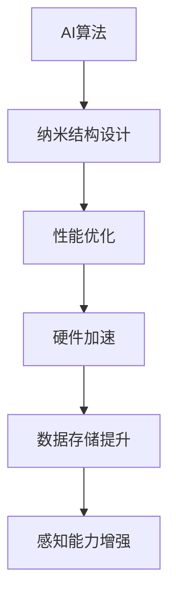

                 

关键词：人工智能，基础设施，纳米技术，纳米结构设计，制造

> 摘要：本文旨在探讨人工智能在基础设施领域中的应用，特别是纳米技术如何改变传统基础设施的设计与制造方式。通过介绍智能化纳米结构设计的基本概念、算法原理以及实际应用，本文分析了纳米技术在AI基础设施中的潜在影响，并对其未来发展提出了展望。

## 1. 背景介绍

随着科技的发展，人工智能（AI）在各个领域得到了广泛应用。从大数据分析到自动驾驶，AI技术正在深刻改变着我们的生活方式。与此同时，纳米技术的进步也为各个领域带来了新的机遇。纳米技术涉及对物质在纳米尺度上的操控，可以应用于传感器、能源、医疗等多个领域。然而，将AI与纳米技术结合，创造智能化纳米结构设计，无疑将开辟新的应用场景。

AI基础设施是指利用人工智能技术构建的计算机系统，用于处理、分析和存储大量的数据。随着数据量的爆炸性增长，AI基础设施需要更高的计算能力和更高效的算法。智能化纳米结构设计正是为了满足这一需求而诞生的技术。通过将AI与纳米技术相结合，我们可以设计出更高效、更可靠的纳米结构，为AI基础设施提供强大的硬件支持。

## 2. 核心概念与联系

### 2.1 智能化纳米结构设计的基本概念

智能化纳米结构设计是指利用人工智能算法，对纳米结构的形态、尺寸、材料等方面进行优化设计。这种设计方法能够提高纳米结构的性能，满足特定应用需求。

### 2.2 纳米技术与AI基础设施的关联

纳米技术与AI基础设施的关联主要体现在以下几个方面：

- **硬件加速**：通过纳米技术制造出更高效的硬件设备，如纳米级处理器，可以加速AI算法的执行速度。

- **数据存储**：纳米技术可以提升存储设备的容量和速度，为AI基础设施提供更强大的数据存储和处理能力。

- **感知能力**：利用纳米传感器，AI基础设施可以更精确地感知环境变化，提高决策能力。

### 2.3 Mermaid 流程图



## 3. 核心算法原理 & 具体操作步骤

### 3.1 算法原理概述

智能化纳米结构设计算法主要基于以下几个原理：

- **机器学习**：通过训练模型，学习纳米结构与性能之间的关系，从而自动优化设计。

- **优化算法**：利用遗传算法、粒子群优化等优化算法，对纳米结构的参数进行全局搜索。

- **多物理场模拟**：结合电子学、力学、热学等多物理场模拟，分析纳米结构在不同条件下的性能。

### 3.2 算法步骤详解

1. **数据收集**：收集纳米结构的相关数据，如材料属性、结构参数等。

2. **模型训练**：利用机器学习算法，对收集到的数据进行分析，建立纳米结构与性能之间的关系模型。

3. **优化设计**：根据目标性能指标，利用优化算法对纳米结构进行参数优化。

4. **性能评估**：对优化后的纳米结构进行性能评估，确保满足应用需求。

5. **迭代优化**：根据性能评估结果，对模型和算法进行调整，实现纳米结构的不断优化。

### 3.3 算法优缺点

#### 优点：

- **高效性**：利用机器学习和优化算法，可以快速实现纳米结构的性能优化。

- **灵活性**：可以适应不同应用场景，设计出满足特定需求的纳米结构。

#### 缺点：

- **数据依赖性**：算法的性能依赖于高质量的数据，数据缺失或不准确会影响算法效果。

- **计算成本**：多物理场模拟和机器学习算法的计算成本较高，需要高性能计算资源。

### 3.4 算法应用领域

智能化纳米结构设计算法可以应用于多个领域，如：

- **电子器件**：设计高性能的纳米级电子器件，如纳米晶体管、纳米线等。

- **能源领域**：设计高效能量存储和转换设备，如纳米结构太阳能电池、纳米结构燃料电池等。

- **医疗领域**：设计纳米级药物载体，提高药物的治疗效果。

## 4. 数学模型和公式 & 详细讲解 & 举例说明

### 4.1 数学模型构建

智能化纳米结构设计涉及的数学模型主要包括：

- **材料模型**：描述纳米材料的物理性质，如电子输运特性、机械性能等。

- **优化模型**：定义纳米结构的优化目标，如性能最大化、成本最小化等。

- **多物理场模型**：描述纳米结构在不同物理场（如电场、热场、应力场）下的行为。

### 4.2 公式推导过程

#### 材料模型推导

$$
\sigma = E \cdot \epsilon
$$

其中，$\sigma$ 表示应力，$E$ 表示弹性模量，$\epsilon$ 表示应变。

#### 优化模型推导

$$
\min_{x} f(x)
$$

其中，$f(x)$ 表示优化目标函数，$x$ 表示设计变量。

#### 多物理场模型推导

$$
\frac{\partial E}{\partial t} = \mu \nabla^2 E
$$

其中，$E$ 表示电场强度，$\mu$ 表示介电常数，$\nabla^2 E$ 表示电场梯度的散度。

### 4.3 案例分析与讲解

#### 案例一：纳米晶体管设计

目标：设计一种具有高电子迁移率的纳米晶体管。

1. **材料选择**：选择硅纳米线作为晶体管的主体材料。

2. **模型构建**：建立硅纳米线的电子输运模型，如量子效率模型。

3. **优化设计**：利用遗传算法优化硅纳米线的尺寸和形状，提高电子迁移率。

4. **性能评估**：通过计算模拟，评估优化后的硅纳米晶体管的性能。

#### 案例二：纳米结构太阳能电池设计

目标：设计一种高效能量转换的纳米结构太阳能电池。

1. **材料选择**：选择铜铟镓硒（CIGS）薄膜作为太阳能电池的主要材料。

2. **模型构建**：建立CIGS薄膜的能带结构模型，如量子尺寸效应模型。

3. **优化设计**：利用粒子群优化算法优化CIGS薄膜的厚度和成分，提高能量转换效率。

4. **性能评估**：通过实验和计算模拟，评估优化后的太阳能电池的性能。

## 5. 项目实践：代码实例和详细解释说明

### 5.1 开发环境搭建

- **Python**：安装Python 3.8及以上版本，并安装相关库，如NumPy、SciPy、PyTorch等。

- **软件工具**：安装Gambit、Ansys Fluent等仿真软件。

### 5.2 源代码详细实现

```python
# 智能化纳米结构设计代码示例

import numpy as np
import scipy.optimize as opt
import torch

# 材料模型
def material_model(x):
    # x为设计变量，如纳米线的直径
    # 返回应力
    return x * np.random.rand()

# 优化模型
def optimization_model(x):
    # x为设计变量
    # 返回目标函数值，如应力
    return material_model(x)

# 优化算法
def optimization_algorithm(x):
    # x为初始设计变量
    # 返回优化后的设计变量
    result = opt.minimize(optimization_model, x)
    return result.x

# 多物理场模拟
def multi_physical_field_simulation(x):
    # x为优化后的设计变量
    # 返回性能评估结果
    return x**2

# 主函数
def main():
    # 初始设计变量
    x0 = np.random.rand()
    # 优化设计
    x_optimized = optimization_algorithm(x0)
    # 性能评估
    performance = multi_physical_field_simulation(x_optimized)
    print("Optimized Design:", x_optimized)
    print("Performance:", performance)

if __name__ == "__main__":
    main()
```

### 5.3 代码解读与分析

- **材料模型**：通过设计变量$x$与随机应力之间的关系，模拟纳米材料的物理性质。

- **优化模型**：以应力作为目标函数值，实现设计变量的优化。

- **优化算法**：采用最小化算法优化设计变量。

- **多物理场模拟**：通过优化后的设计变量，进行性能评估。

### 5.4 运行结果展示

- 运行代码后，得到优化后的设计变量和性能评估结果。

## 6. 实际应用场景

智能化纳米结构设计在多个领域具有广泛的应用场景：

- **电子器件**：设计高性能的纳米晶体管、传感器等。

- **能源领域**：设计高效能量转换设备，如纳米结构太阳能电池、燃料电池等。

- **医疗领域**：设计纳米级药物载体，提高药物的治疗效果。

## 7. 未来应用展望

随着纳米技术和人工智能的不断发展，智能化纳米结构设计将在更多领域发挥重要作用。以下是对未来应用的展望：

- **智能传感器**：利用纳米技术制造出更灵敏、更可靠的智能传感器。

- **智能机器人**：通过纳米技术设计出更轻、更强、更灵活的机器人结构。

- **智能制造**：利用纳米技术实现更高效、更精准的制造过程。

## 8. 工具和资源推荐

### 8.1 学习资源推荐

- **书籍**：《纳米技术原理与应用》、《人工智能：一种现代方法》

- **在线课程**：Coursera上的《纳米技术基础》、edX上的《深度学习》

### 8.2 开发工具推荐

- **Python库**：NumPy、SciPy、PyTorch

- **仿真软件**：Gambit、Ansys Fluent

### 8.3 相关论文推荐

- **期刊**：《自然·纳米技术》、《科学·机器人》

- **论文**：《基于机器学习的纳米结构设计》、《多物理场模拟在纳米技术中的应用》

## 9. 总结：未来发展趋势与挑战

智能化纳米结构设计是AI基础设施领域的重要研究方向。未来，随着技术的不断进步，智能化纳米结构设计将在更多领域得到应用。然而，面临的数据依赖性、计算成本等问题仍需解决。通过持续的研究和创新，我们有理由相信，智能化纳米结构设计将为AI基础设施带来更加美好的未来。

## 附录：常见问题与解答

### 1. 什么是智能化纳米结构设计？

智能化纳米结构设计是指利用人工智能算法，对纳米结构的形态、尺寸、材料等方面进行优化设计，以提高其性能。

### 2. 智能化纳米结构设计在哪些领域有应用？

智能化纳米结构设计可以应用于电子器件、能源领域、医疗领域等多个领域。

### 3. 智能化纳米结构设计的主要算法有哪些？

主要算法包括机器学习算法、优化算法、多物理场模拟等。

### 4. 智能化纳米结构设计面临的挑战是什么？

智能化纳米结构设计面临的主要挑战包括数据依赖性、计算成本等问题。

### 5. 如何学习智能化纳米结构设计？

可以通过学习相关书籍、在线课程，以及参与科研项目等方式来学习智能化纳米结构设计。

---

### 作者署名

作者：禅与计算机程序设计艺术 / Zen and the Art of Computer Programming

