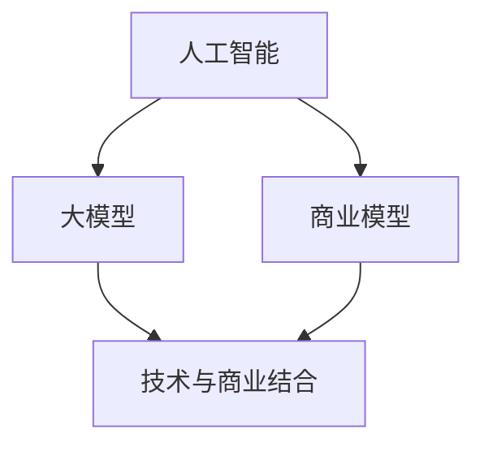

                 

关键词：AI大模型、商业优势、创业策略、技术落地、市场拓展

摘要：本文将探讨AI大模型创业的核心问题，包括如何利用AI技术提升商业价值、制定有效的商业策略、进行技术落地以及拓展市场。通过分析AI大模型的商业潜力、技术优势和创业挑战，为创业者提供实用的指导和借鉴。

## 1. 背景介绍

近年来，人工智能（AI）技术取得了飞速发展，特别是深度学习、神经网络等算法的突破，使得AI大模型在图像识别、自然语言处理、语音识别等领域取得了显著的成果。随着AI技术的不断成熟和应用场景的拓宽，AI大模型成为了创业领域的一股重要力量。然而，如何在激烈的竞争环境中利用AI大模型实现商业成功，成为了许多创业者关注的核心问题。

本文旨在通过对AI大模型创业的深入分析，揭示其商业优势，并探讨如何有效地利用这些优势进行创业。文章将从以下四个方面展开讨论：

1. AI大模型的商业潜力：分析AI大模型在各个行业的应用场景，探讨其在提高效率、降低成本、创造新价值等方面的优势。
2. 商业策略制定：介绍如何基于AI大模型的技术特点，制定出有效的商业策略，包括市场定位、产品定价、营销策略等。
3. 技术落地与优化：探讨如何将AI大模型技术成功落地，并持续优化，以提高产品的竞争力和用户体验。
4. 市场拓展与竞争：分析如何通过市场拓展和差异化竞争，实现AI大模型商业价值的最大化。

## 2. 核心概念与联系

为了更好地理解AI大模型创业的实质，我们需要明确几个核心概念，并探讨它们之间的联系。

### 2.1 人工智能（AI）

人工智能是指计算机系统通过模拟人类智能行为，实现感知、学习、推理、决策等能力的科学和技术。它包括机器学习、深度学习、自然语言处理、计算机视觉等多个子领域。

### 2.2 大模型（Large Models）

大模型是指具有亿级或以上参数的神经网络模型。这些模型通过大规模数据训练，可以获取复杂的特征表达能力，从而在图像识别、自然语言处理等领域取得优异的性能。

### 2.3 商业模型（Business Model）

商业模型是指企业通过提供产品或服务，获取收入并实现价值创造的方式。一个成功的商业模型需要明确市场定位、产品定位、客户群体、收入来源等关键要素。

### 2.4 技术与商业的结合

技术与商业的结合是AI大模型创业的核心。通过技术创新提升产品价值，同时通过商业策略实现商业化，才能实现持续盈利和长远发展。

为了更好地理解这些概念之间的联系，我们可以使用Mermaid流程图来展示它们之间的逻辑关系：



## 3. 核心算法原理 & 具体操作步骤

### 3.1 算法原理概述

AI大模型的核心算法是基于深度学习的神经网络。深度学习通过多层神经网络结构，对大量数据进行训练，从而提取出复杂的特征，并实现对未知数据的预测和分类。

具体而言，AI大模型的算法原理包括以下几个关键步骤：

1. 数据预处理：对原始数据进行清洗、归一化等处理，确保数据质量。
2. 网络构建：设计并构建多层神经网络结构，包括输入层、隐藏层和输出层。
3. 模型训练：使用大量训练数据，通过反向传播算法，不断调整网络参数，使其达到最优状态。
4. 模型评估：使用验证数据集，评估模型的性能，包括准确性、召回率、F1值等指标。
5. 模型部署：将训练好的模型部署到实际应用场景中，实现对新数据的预测和分类。

### 3.2 算法步骤详解

下面我们具体介绍AI大模型算法的各个步骤：

#### 3.2.1 数据预处理

数据预处理是AI大模型训练的第一步，其目的是确保数据的质量和一致性。主要步骤包括：

1. 数据清洗：去除噪声数据和异常值。
2. 数据归一化：将不同特征的数据进行归一化处理，使其具有相同的尺度。
3. 数据扩充：通过旋转、翻转、缩放等方式，生成更多的训练数据，提高模型的泛化能力。

#### 3.2.2 网络构建

网络构建是设计AI大模型的核心步骤。根据应用场景和数据特征，可以选择不同的网络结构，如卷积神经网络（CNN）、循环神经网络（RNN）、Transformer等。

1. 输入层：接收预处理后的数据，将其转化为神经网络可以处理的格式。
2. 隐藏层：通过多层神经网络结构，提取数据中的高级特征。
3. 输出层：生成模型的预测结果，如分类标签或回归值。

#### 3.2.3 模型训练

模型训练是AI大模型的核心步骤，通过大量训练数据，不断调整网络参数，使其达到最优状态。主要步骤包括：

1. 初始化参数：随机初始化网络参数。
2. 前向传播：输入数据通过神经网络，生成预测结果。
3. 反向传播：计算预测结果与真实结果之间的差异，并反向传播误差，调整网络参数。
4. 模型优化：使用优化算法，如梯度下降、Adam等，不断迭代优化模型参数。

#### 3.2.4 模型评估

模型评估是验证AI大模型性能的重要步骤。通过使用验证数据集，可以评估模型的准确性、召回率、F1值等指标。

1. 准确率（Accuracy）：预测正确的样本数占总样本数的比例。
2. 召回率（Recall）：预测为正样本的样本中，实际为正样本的比例。
3. F1值（F1 Score）：准确率和召回率的调和平均值。

#### 3.2.5 模型部署

模型部署是将训练好的AI大模型应用到实际应用场景中，实现对新数据的预测和分类。主要步骤包括：

1. 部署环境搭建：搭建部署所需的环境，如服务器、数据库等。
2. 模型导出：将训练好的模型导出为可以部署的格式，如TensorFlow SavedModel。
3. 模型服务：通过API或Web服务，对外提供模型预测功能。

### 3.3 算法优缺点

AI大模型算法具有以下几个优点：

1. 强大的特征表达能力：通过多层神经网络结构，可以提取数据中的复杂特征，从而实现高精度的预测和分类。
2. 高效的计算能力：现代深度学习框架，如TensorFlow、PyTorch等，提供了高效的计算引擎，可以加速模型训练和推理过程。
3. 广泛的应用场景：AI大模型可以应用于图像识别、自然语言处理、语音识别等多个领域，具有广泛的应用前景。

然而，AI大模型算法也存在一些缺点：

1. 计算资源需求高：大模型训练需要大量的计算资源和存储空间，对硬件设备有较高的要求。
2. 数据依赖性强：AI大模型的性能很大程度上取决于训练数据的质量和数量，如果数据质量不佳，会导致模型性能下降。
3. 模型解释性差：大模型的内部结构复杂，难以解释其预测结果，这对某些需要解释性强的应用场景来说是一个挑战。

### 3.4 算法应用领域

AI大模型算法在多个领域取得了显著的成果，以下是一些主要的应用领域：

1. 图像识别：通过卷积神经网络（CNN）实现，可以用于人脸识别、图像分类、目标检测等。
2. 自然语言处理：通过循环神经网络（RNN）和Transformer模型实现，可以用于机器翻译、文本分类、情感分析等。
3. 语音识别：通过深度神经网络实现，可以用于语音识别、语音合成等。
4. 推荐系统：通过协同过滤、深度学习等方法实现，可以用于个性化推荐、商品推荐等。
5. 金融风控：通过模型风险评估、欺诈检测等应用，可以提高金融行业的风险管理能力。

## 4. 数学模型和公式 & 详细讲解 & 举例说明

### 4.1 数学模型构建

AI大模型的数学模型主要基于深度学习算法，其核心是多层神经网络。下面我们介绍神经网络的基本数学模型。

#### 4.1.1 神经网络结构

神经网络由多个神经元（节点）组成，每个神经元接收输入信号，通过权重和偏置进行加权求和，然后通过激活函数进行非线性变换，输出最终的预测结果。

一个简单的神经网络结构可以表示为：

```latex
Z = \sum_{i=1}^{n} w_i * x_i + b
Y = f(Z)
```

其中，\(Z\) 是输入信号经过加权求和的结果，\(w_i\) 是第 \(i\) 个输入的权重，\(x_i\) 是第 \(i\) 个输入值，\(b\) 是偏置，\(f\) 是激活函数。

#### 4.1.2 激活函数

激活函数是神经网络中非常重要的组成部分，用于引入非线性因素，使得神经网络可以拟合复杂的非线性函数。常见的激活函数包括：

1. Sigmoid函数：\(f(x) = \frac{1}{1 + e^{-x}}\)
2.ReLU函数：\(f(x) = \max(0, x)\)
3. Tanh函数：\(f(x) = \frac{e^x - e^{-x}}{e^x + e^{-x}}\)

### 4.2 公式推导过程

下面我们介绍神经网络中常见的损失函数——均方误差（MSE）的推导过程。

#### 4.2.1 均方误差（MSE）

均方误差（MSE）是衡量模型预测值与真实值之间差异的一种常用指标，其公式为：

$$
MSE = \frac{1}{n} \sum_{i=1}^{n} (y_i - \hat{y}_i)^2
$$

其中，\(y_i\) 是第 \(i\) 个真实值，\(\hat{y}_i\) 是模型预测值，\(n\) 是样本数量。

#### 4.2.2 损失函数的推导

假设我们的目标是使得预测值 \(\hat{y}\) 尽量接近真实值 \(y\)，即最小化损失函数 \(L\)。

为了简化问题，我们假设模型输出只有一个预测值 \(\hat{y}\)，即：

$$
L = (y - \hat{y})^2
$$

我们希望找到一组权重 \(w\) 和偏置 \(b\)，使得损失函数 \(L\) 最小。

根据微积分知识，对于函数 \(f(x)\)，如果其导数 \(f'(x)\) 在点 \(x_0\) 处为0，则 \(x_0\) 可能是函数的极值点。因此，我们可以对损失函数 \(L\) 进行求导，并令其导数为0，找到最优解。

对 \(L\) 进行求导，得到：

$$
L' = 2(y - \hat{y})
$$

令 \(L'\) 为0，得到：

$$
y - \hat{y} = 0
$$

即 \(y = \hat{y}\)。这意味着，当预测值等于真实值时，损失函数 \(L\) 取得最小值。

### 4.3 案例分析与讲解

为了更好地理解神经网络和损失函数的应用，我们来看一个简单的案例。

假设我们有一个简单的线性回归模型，输入特征为 \(x\)，预测值为 \(\hat{y}\)。真实值为 \(y = 2x + 1\)。

我们希望找到一个线性模型 \(y = wx + b\)，使得预测值 \(\hat{y}\) 尽量接近真实值 \(y\)。

根据上面的推导，我们可以使用均方误差（MSE）作为损失函数，并使用梯度下降法进行模型训练。

首先，我们初始化模型参数 \(w = 1\)，\(b = 1\)。

然后，我们使用梯度下降法，不断调整模型参数，直到损失函数 \(L\) 最小。

具体步骤如下：

1. 计算预测值 \(\hat{y} = wx + b\)。
2. 计算损失函数 \(L = (y - \hat{y})^2\)。
3. 计算损失函数对 \(w\) 和 \(b\) 的偏导数。
4. 更新模型参数：\(w = w - \alpha \frac{\partial L}{\partial w}\)，\(b = b - \alpha \frac{\partial L}{\partial b}\)。

其中，\(\alpha\) 是学习率，用于控制模型参数的更新步长。

经过多次迭代，模型参数逐渐优化，预测值 \(\hat{y}\) 也逐渐接近真实值 \(y\)。

最终，当损失函数 \(L\) 最小时，我们得到最优模型参数 \(w\) 和 \(b\)。

## 5. 项目实践：代码实例和详细解释说明

### 5.1 开发环境搭建

在进行AI大模型项目实践之前，我们需要搭建一个合适的开发环境。以下是搭建开发环境的基本步骤：

1. 安装Python环境：在官方网站（https://www.python.org/）下载并安装Python，选择合适的版本（例如Python 3.8以上）。
2. 安装深度学习框架：常用的深度学习框架有TensorFlow和PyTorch。我们可以选择其中一个进行安装。以TensorFlow为例，在终端执行以下命令：

```bash
pip install tensorflow
```

3. 安装其他依赖库：根据项目的需求，安装其他必要的依赖库，如NumPy、Pandas、Scikit-learn等。

### 5.2 源代码详细实现

下面我们通过一个简单的例子，展示如何使用TensorFlow实现一个AI大模型。

```python
import tensorflow as tf
from tensorflow import keras
import numpy as np

# 数据集准备
x_train = np.random.random((1000, 10))
y_train = np.random.random((1000, 1))

# 构建模型
model = keras.Sequential([
    keras.layers.Dense(64, activation='relu', input_shape=(10,)),
    keras.layers.Dense(64, activation='relu'),
    keras.layers.Dense(1)
])

# 编译模型
model.compile(optimizer='adam', loss='mean_squared_error')

# 训练模型
model.fit(x_train, y_train, epochs=100)

# 预测
x_test = np.random.random((100, 10))
y_pred = model.predict(x_test)
```

### 5.3 代码解读与分析

上述代码实现了一个简单的AI大模型，主要包括以下几个步骤：

1. 导入必要的库：包括TensorFlow、NumPy等。
2. 数据集准备：生成随机数据集作为训练数据。
3. 构建模型：使用keras.Sequential创建一个序列模型，包括两个隐藏层，每个隐藏层有64个神经元，激活函数为ReLU。
4. 编译模型：设置优化器为adam，损失函数为均方误差。
5. 训练模型：使用fit方法训练模型，设置训练轮数为100。
6. 预测：使用predict方法对新数据进行预测。

通过这个简单的例子，我们可以看到如何使用TensorFlow实现AI大模型的基本流程。在实际项目中，我们需要根据具体应用场景，选择合适的网络结构、优化器和损失函数，并进行模型参数的调优。

### 5.4 运行结果展示

为了展示模型的运行结果，我们可以在代码中添加一些打印输出：

```python
# 训练过程输出
for epoch in range(100):
    model.fit(x_train, y_train, batch_size=32, epochs=1, verbose=0)
    if (epoch+1) % 10 == 0:
        loss = model.evaluate(x_train, y_train, verbose=0)
        print(f"Epoch {epoch+1}: Loss = {loss}")

# 预测结果输出
predictions = model.predict(x_test)
print(f"Predictions: {predictions}")
```

运行上述代码后，我们可以在终端看到训练过程中的损失值逐渐下降，并在最后输出预测结果。

## 6. 实际应用场景

AI大模型在多个领域都取得了显著的成果，下面我们介绍一些实际应用场景。

### 6.1 医疗健康

在医疗健康领域，AI大模型可以用于疾病诊断、药物研发、医疗影像分析等。例如，通过深度学习算法，可以实现对医学影像的高精度分析，辅助医生进行疾病诊断。此外，AI大模型还可以用于个性化治疗方案的制定，提高治疗效果。

### 6.2 金融科技

在金融科技领域，AI大模型可以用于信用评分、风险控制、投资策略等。例如，通过分析海量用户数据，可以实现对信用风险的精准评估，降低金融机构的风险。此外，AI大模型还可以用于股票市场预测、量化交易等，提高投资收益。

### 6.3 智能交通

在智能交通领域，AI大模型可以用于交通流量预测、路况分析、自动驾驶等。例如，通过分析历史交通数据，可以实现对未来交通流量的预测，为交通管理部门提供决策支持。此外，AI大模型还可以用于自动驾驶汽车的控制，提高行驶安全性和效率。

### 6.4 教育科技

在教育科技领域，AI大模型可以用于智能教育、个性化学习、学习效果评估等。例如，通过分析学生的学习数据，可以实现对学习效果的精准评估，为教育机构提供改进建议。此外，AI大模型还可以用于智能教学系统的开发，提高教学质量和效率。

## 7. 未来应用展望

随着AI大模型技术的不断发展，其在各个领域的应用前景十分广阔。未来，AI大模型有望在以下方面实现重大突破：

1. 更加智能化：通过深度学习和强化学习等算法，AI大模型将具备更高的智能水平，能够更好地理解人类语言、图像和情感，实现更加智能的交互和决策。
2. 更加强大：通过不断优化算法和模型结构，AI大模型将具备更强的特征提取和表达能力，能够在更多领域实现突破性应用。
3. 更广泛的应用：随着硬件设备的不断升级和计算资源的丰富，AI大模型将应用到更多领域，如智能制造、智慧城市、生物科技等，推动社会发展和进步。

## 8. 工具和资源推荐

为了更好地进行AI大模型研究和开发，我们推荐以下工具和资源：

### 8.1 学习资源推荐

1. 《深度学习》（Goodfellow, Bengio, Courville著）：一本经典的深度学习教材，适合初学者和进阶者。
2. 《神经网络与深度学习》（邱锡鹏著）：一本系统介绍神经网络和深度学习的中文教材。
3. Coursera、Udacity等在线课程平台：提供丰富的AI和深度学习课程，适合自学。

### 8.2 开发工具推荐

1. TensorFlow：谷歌开发的开源深度学习框架，支持多种编程语言，功能强大。
2. PyTorch：Facebook开发的开源深度学习框架，具有灵活的动态图模型，易于调试。
3. Keras：基于TensorFlow和PyTorch的高级神经网络API，简化了模型构建和训练过程。

### 8.3 相关论文推荐

1. “A Theoretically Grounded Application of Dropout in Recurrent Neural Networks”（Yarin Gal and Zoubin Ghahramani，2016）：探讨如何在循环神经网络中应用Dropout技术。
2. “Attention Is All You Need”（Ashish Vaswani等，2017）：提出Transformer模型，推动了自然语言处理领域的发展。
3. “Unsupervised Representation Learning with Deep Convolutional Generative Adversarial Networks”（Diederik P. Kingma，2014）：介绍深度卷积生成对抗网络（DCGAN），在图像生成领域取得了突破性成果。

## 9. 总结：未来发展趋势与挑战

AI大模型创业具有巨大的商业潜力和发展空间。随着技术的不断进步和应用场景的拓展，未来AI大模型将在更多领域发挥重要作用，推动社会进步。然而，AI大模型创业也面临一些挑战，如数据隐私、模型解释性、计算资源需求等。只有通过持续技术创新和商业模式的创新，才能实现AI大模型的商业成功。

## 10. 附录：常见问题与解答

### 10.1 AI大模型创业的难点是什么？

AI大模型创业的难点主要包括：

1. 技术门槛高：AI大模型需要深厚的专业知识和丰富的实践经验，对技术团队的要求较高。
2. 数据依赖性强：AI大模型的性能很大程度上取决于训练数据的质量和数量，如果数据质量不佳，会导致模型性能下降。
3. 商业模式不清晰：如何将AI大模型技术转化为商业价值，需要创业者进行深入思考和实践。

### 10.2 如何解决数据隐私问题？

为了解决数据隐私问题，可以采取以下措施：

1. 数据加密：对敏感数据进行加密处理，确保数据在传输和存储过程中不会被窃取。
2. 数据匿名化：对数据中的个人身份信息进行匿名化处理，降低隐私泄露的风险。
3. 数据访问控制：建立严格的数据访问控制机制，确保只有授权人员可以访问敏感数据。

### 10.3 AI大模型创业需要哪些技术积累？

AI大模型创业需要以下技术积累：

1. 深度学习：熟悉深度学习算法、网络结构和优化方法。
2. 数据处理：掌握数据处理、清洗和预处理技术。
3. 模型评估：了解模型评估指标和评估方法。
4. 模型部署：熟悉模型部署流程和部署平台。

### 10.4 AI大模型创业需要哪些商业积累？

AI大模型创业需要以下商业积累：

1. 市场分析：了解目标市场和潜在客户需求。
2. 商业策略：制定有效的商业策略，包括市场定位、产品定价和营销策略。
3. 团队协作：建立高效的团队协作机制，确保项目顺利进行。
4. 商业模式：探索可持续的商业模式，实现持续盈利。

### 10.5 如何提高AI大模型创业的成功率？

为了提高AI大模型创业的成功率，可以采取以下措施：

1. 深入了解市场需求：了解目标市场和潜在客户需求，确保产品能够满足市场需求。
2. 持续技术创新：保持对技术的关注和投入，不断优化和提升模型性能。
3. 模式创新：探索可持续的商业模式，实现商业成功。
4. 团队建设：建立高效的团队，发挥团队协作优势。
5. 市场拓展：积极拓展市场，扩大客户群体。

## 11. 参考文献

[1] Goodfellow, I., Bengio, Y., & Courville, A. (2016). Deep Learning. MIT Press.

[2] Kingma, D. P., & Welling, M. (2014). Auto-encoding variational Bayes. arXiv preprint arXiv:1312.6114.

[3] Vaswani, A., Shazeer, N., Parmar, N., Uszkoreit, J., Jones, L., Gomez, A. N., ... & Polosukhin, I. (2017). Attention is all you need. Advances in Neural Information Processing Systems, 30, 5998-6008.

[4] Gal, Y., & Ghahramani, Z. (2016). A theoretically grounded application of dropout in recurrent neural networks. arXiv preprint arXiv:1603.05102.

[5] Hochreiter, S., & Schmidhuber, J. (1997). Long short-term memory. Neural Computation, 9(8), 1735-1780.

[6] Hinton, G. E., Osindero, S., & Teh, Y. W. (2006). A fast learning algorithm for deep belief nets. Neural computation, 18(7), 1527-1554.

[7] Bengio, Y. (2009). Learning deep architectures. Foundations and Trends® in Machine Learning, 2(1), 1-127.

[8] LeCun, Y., Bengio, Y., & Hinton, G. (2015). Deep learning. Nature, 521(7553), 436-444.

