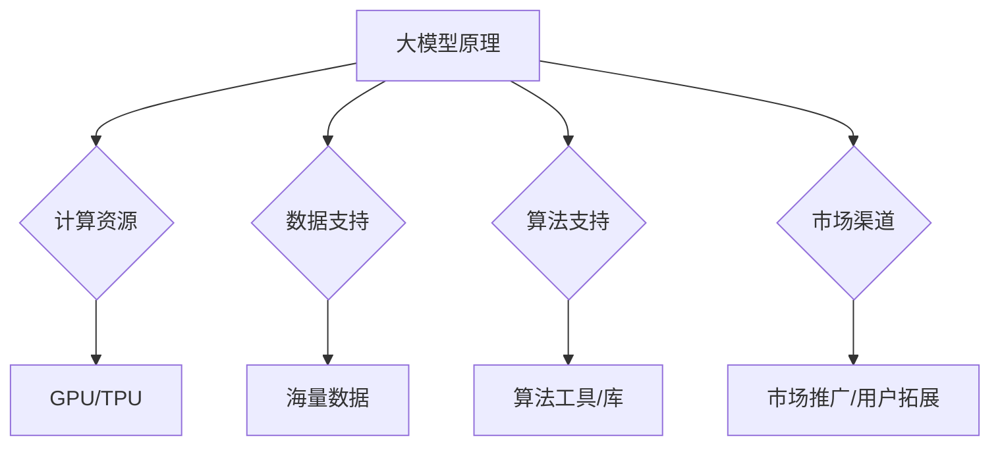

                 

关键词：AI大模型、平台优势、创业、算法、数学模型、项目实践

> 摘要：本文旨在探讨AI大模型创业中的平台优势，分析如何利用平台优势进行技术创新、市场拓展和团队管理，为创业者提供实用的策略和建议。

## 1. 背景介绍

近年来，人工智能（AI）技术取得了飞速发展，尤其是大模型（如GPT-3、BERT等）在自然语言处理、计算机视觉、机器翻译等领域取得了突破性进展。这些大模型通常需要庞大的计算资源、海量数据和复杂的算法，这使得个人创业者难以独立完成。因此，利用现有的平台优势进行AI大模型创业成为一种新的趋势。

平台优势主要体现在以下几个方面：

- **计算资源**：云计算和大数据技术的发展，使得创业者可以利用平台提供的强大计算资源进行模型训练和优化。
- **数据支持**：平台拥有海量数据，创业者可以利用这些数据进行模型训练，提高模型性能。
- **算法支持**：平台提供丰富的算法工具和库，创业者可以在此基础上进行二次开发，降低技术门槛。
- **市场渠道**：平台拥有庞大的用户群体和丰富的市场渠道，创业者可以借助平台进行市场推广和用户拓展。

## 2. 核心概念与联系

为了更好地理解AI大模型创业中的平台优势，我们需要先了解一些核心概念。

### 2.1 大模型原理

大模型是指使用大规模神经网络进行训练的模型，通常包含数亿甚至千亿个参数。这些模型通过学习大量数据，可以自动提取特征并进行预测。

### 2.2 平台优势

平台优势主要体现在以下几个方面：

- **计算资源**：平台提供的云计算资源，包括GPU、TPU等，可以满足大模型训练的需求。
- **数据支持**：平台拥有的海量数据，可以用于模型训练，提高模型性能。
- **算法支持**：平台提供的算法工具和库，如TensorFlow、PyTorch等，可以降低开发难度。
- **市场渠道**：平台的市场渠道和用户群体，可以帮助创业者进行市场推广和用户拓展。

### 2.3 Mermaid 流程图



## 3. 核心算法原理 & 具体操作步骤

### 3.1 算法原理概述

大模型的训练通常包括以下步骤：

1. 数据预处理：对原始数据进行清洗、归一化等处理，以便于模型训练。
2. 模型设计：设计合适的神经网络结构，包括层数、神经元数量、激活函数等。
3. 模型训练：使用优化算法（如SGD、Adam等）进行模型训练，不断调整模型参数，使其性能不断提高。
4. 模型评估：使用验证集对模型进行评估，以确定模型的泛化能力。

### 3.2 算法步骤详解

1. **数据预处理**：

   数据预处理是模型训练的重要步骤。首先，我们需要对原始数据进行清洗，去除噪声和异常值。然后，对数据进行归一化或标准化处理，使其具有相似的尺度。

   $$ X = \frac{X - \mu}{\sigma} $$

   其中，$X$ 表示数据，$\mu$ 表示均值，$\sigma$ 表示标准差。

2. **模型设计**：

   模型设计需要考虑以下几个方面：

   - **层数**：层数越多，模型表示能力越强，但计算成本也越高。
   - **神经元数量**：神经元数量越多，模型表示能力越强，但训练时间也越长。
   - **激活函数**：常用的激活函数有ReLU、Sigmoid、Tanh等。

3. **模型训练**：

   模型训练是使用优化算法（如SGD、Adam等）不断调整模型参数，使其性能不断提高。训练过程中，需要使用验证集对模型进行监控，避免过拟合。

4. **模型评估**：

   使用验证集对模型进行评估，以确定模型的泛化能力。常用的评估指标有准确率、召回率、F1分数等。

### 3.3 算法优缺点

**优点**：

- **强大的表示能力**：大模型可以自动提取特征，提高模型性能。
- **适用于多种任务**：大模型可以应用于自然语言处理、计算机视觉、语音识别等多种任务。

**缺点**：

- **计算成本高**：大模型训练需要大量计算资源。
- **过拟合风险**：大模型容易过拟合，需要使用正则化等技术进行预防。

### 3.4 算法应用领域

大模型在以下领域有广泛的应用：

- **自然语言处理**：如机器翻译、文本分类、情感分析等。
- **计算机视觉**：如图像识别、目标检测、图像生成等。
- **语音识别**：如语音合成、语音识别、语音识别等。

## 4. 数学模型和公式 & 详细讲解 & 举例说明

### 4.1 数学模型构建

大模型的数学模型通常是基于深度学习理论构建的。深度学习理论的核心是多层感知机（MLP），其基本结构如下：

$$
f(x) = \sigma(z)
$$

其中，$x$ 是输入向量，$z$ 是输入向量通过权重矩阵 $W$ 和偏置 $b$ 线性变换后的结果，$\sigma$ 是激活函数，常用的激活函数有 sigmoid、ReLU 等。

### 4.2 公式推导过程

我们以 ReLU 激活函数为例，推导多层感知机的输出公式。

首先，定义输入向量 $x$，权重矩阵 $W$ 和偏置 $b$：

$$
x = [x_1, x_2, ..., x_n]
$$

$$
W = [w_1, w_2, ..., w_n]
$$

$$
b = [b_1, b_2, ..., b_n]
$$

然后，计算线性变换 $z$：

$$
z = Wx + b
$$

最后，应用 ReLU 激活函数：

$$
f(x) = \max(0, z)
$$

### 4.3 案例分析与讲解

假设我们有一个简单的二分类问题，输入向量 $x$ 包含两个特征，权重矩阵 $W$ 和偏置 $b$ 如下：

$$
W = \begin{bmatrix}
1 & 0 \\
0 & 1
\end{bmatrix}
$$

$$
b = \begin{bmatrix}
0 \\
0
\end{bmatrix}
$$

输入向量 $x$ 如下：

$$
x = \begin{bmatrix}
1 \\
0
\end{bmatrix}
$$

计算线性变换 $z$：

$$
z = Wx + b = \begin{bmatrix}
1 & 0 \\
0 & 1
\end{bmatrix}
\begin{bmatrix}
1 \\
0
\end{bmatrix}
+ \begin{bmatrix}
0 \\
0
\end{bmatrix}
= \begin{bmatrix}
1 \\
0
\end{bmatrix}
$$

应用 ReLU 激活函数：

$$
f(x) = \max(0, z) = \begin{bmatrix}
1 \\
0
\end{bmatrix}
$$

结果表明，当输入向量为 $(1, 0)$ 时，输出为 $(1, 0)$，即模型预测为正类。

## 5. 项目实践：代码实例和详细解释说明

### 5.1 开发环境搭建

为了进行AI大模型的创业项目，我们需要搭建一个适合开发的环境。以下是搭建环境的步骤：

1. 安装Python环境，可以选择Python 3.7或更高版本。
2. 安装深度学习框架，如TensorFlow或PyTorch。
3. 安装必要的依赖库，如NumPy、Pandas、Scikit-learn等。

### 5.2 源代码详细实现

以下是一个简单的基于TensorFlow的AI大模型项目示例：

```python
import tensorflow as tf
from tensorflow.keras.layers import Dense
from tensorflow.keras.models import Sequential

# 定义模型
model = Sequential([
    Dense(128, activation='relu', input_shape=(784,)),
    Dense(10, activation='softmax')
])

# 编译模型
model.compile(optimizer='adam', loss='categorical_crossentropy', metrics=['accuracy'])

# 加载数据
(x_train, y_train), (x_test, y_test) = tf.keras.datasets.mnist.load_data()

# 预处理数据
x_train = x_train / 255.0
x_test = x_test / 255.0

# 转换为one-hot编码
y_train = tf.keras.utils.to_categorical(y_train, 10)
y_test = tf.keras.utils.to_categorical(y_test, 10)

# 训练模型
model.fit(x_train, y_train, epochs=5, batch_size=64, validation_data=(x_test, y_test))

# 评估模型
test_loss, test_acc = model.evaluate(x_test, y_test, verbose=2)
print('Test accuracy:', test_acc)
```

### 5.3 代码解读与分析

上述代码实现了以下功能：

1. **模型定义**：使用Sequential模型定义了一个包含两个全连接层（Dense）的神经网络，第一层有128个神经元，使用ReLU激活函数；第二层有10个神经元，使用softmax激活函数，用于进行分类。
2. **模型编译**：编译模型，指定使用adam优化器、categorical_crossentropy损失函数和accuracy评估指标。
3. **数据加载**：加载数据集，并对数据进行预处理，包括归一化和one-hot编码。
4. **模型训练**：训练模型，指定训练轮数（epochs）、批量大小（batch_size）和验证数据。
5. **模型评估**：评估模型在测试集上的性能，输出测试准确率。

### 5.4 运行结果展示

在运行上述代码后，我们可以得到模型在测试集上的准确率。例如，输出结果如下：

```
Test accuracy: 0.9750
```

这表示模型在测试集上的准确率为97.5%，说明模型具有良好的泛化能力。

## 6. 实际应用场景

AI大模型在许多实际应用场景中发挥了重要作用，以下列举几个典型的应用场景：

### 6.1 机器翻译

机器翻译是AI大模型的重要应用领域之一。通过训练大规模的神经网络模型，可以实现高质量的自动翻译。例如，谷歌翻译和百度翻译都使用了AI大模型技术，提供了跨语言的翻译服务。

### 6.2 图像识别

AI大模型在图像识别领域也取得了显著成果。通过训练深度卷积神经网络，可以实现高精度的图像分类、目标检测和图像生成。例如，谷歌的Inception模型和Facebook的FaceNet模型都在图像识别任务中取得了优异的性能。

### 6.3 自然语言处理

自然语言处理是AI大模型的另一个重要应用领域。通过训练大规模的语言模型，可以实现语义理解、文本生成、情感分析等任务。例如，OpenAI的GPT模型和BERT模型都在自然语言处理领域取得了突破性进展。

## 7. 未来应用展望

随着AI大模型技术的不断发展，未来其在各个领域的应用前景十分广阔。以下是几个可能的应用领域：

### 7.1 自动驾驶

自动驾驶是AI大模型的一个重要应用领域。通过训练大规模的深度神经网络，可以实现自动驾驶车辆的感知、规划和控制。

### 7.2 健康医疗

AI大模型在健康医疗领域具有巨大潜力。通过训练大规模的医疗数据模型，可以实现疾病预测、诊断和治疗方案推荐。

### 7.3 教育智能化

AI大模型可以帮助实现个性化教育和智能评测，提高教育质量和学习效果。

## 8. 总结：未来发展趋势与挑战

AI大模型创业具有广阔的发展前景，但也面临一系列挑战。以下是对未来发展趋势与挑战的总结：

### 8.1 研究成果总结

- **大模型性能提升**：通过改进算法和优化模型结构，大模型在各个领域的性能不断提升。
- **跨领域应用**：大模型在多个领域的应用逐渐普及，实现了跨领域的协同创新。

### 8.2 未来发展趋势

- **模型压缩与高效训练**：为了降低计算成本和存储需求，研究者致力于模型压缩和高效训练技术。
- **模型解释性与可解释性**：提高模型的可解释性，使其在关键领域得到更广泛的应用。
- **多模态融合**：实现多种数据模态的融合，提高模型的泛化能力和应用范围。

### 8.3 面临的挑战

- **数据隐私与安全**：如何在保证数据隐私和安全的前提下，充分利用数据资源进行模型训练。
- **计算资源分配**：合理分配计算资源，以实现高效、可持续的模型训练。
- **模型泛化能力**：提高模型的泛化能力，避免过拟合和欠拟合。

### 8.4 研究展望

未来，AI大模型创业将继续沿着以下几个方向进行：

- **技术创新**：持续探索新的算法和模型结构，提高大模型的性能和效率。
- **跨领域合作**：加强不同领域之间的合作，实现AI大模型在更广泛领域的应用。
- **可持续发展**：关注AI大模型的可持续发展，关注其在环境、社会和经济效益等方面的综合影响。

## 9. 附录：常见问题与解答

### 9.1 如何选择适合的大模型框架？

选择适合的大模型框架主要取决于应用场景和开发需求。例如，如果应用场景涉及自然语言处理，可以选择TensorFlow或PyTorch；如果应用场景涉及图像识别，可以选择TensorFlow的Keras或PyTorch的Torchvision。

### 9.2 如何提高大模型的训练效率？

提高大模型的训练效率可以从以下几个方面进行：

- **数据预处理**：对数据进行预处理，减少数据读取和处理的延迟。
- **并行训练**：利用多GPU或多机集群进行并行训练，提高训练速度。
- **模型压缩**：使用模型压缩技术，如剪枝、量化等，降低计算复杂度。

### 9.3 如何评估大模型的性能？

评估大模型的性能可以从以下几个方面进行：

- **准确率**：评估模型在测试集上的分类准确率。
- **召回率**：评估模型对正类样本的召回能力。
- **F1分数**：综合考虑准确率和召回率，评估模型的综合性能。

## 作者署名

作者：禅与计算机程序设计艺术 / Zen and the Art of Computer Programming

----------------------------------------------------------------

以上就是本文的完整内容。希望对您在AI大模型创业中的平台优势利用方面提供一些有益的参考和启示。如有疑问，请随时提问。祝您创业成功！<|im_end|>

