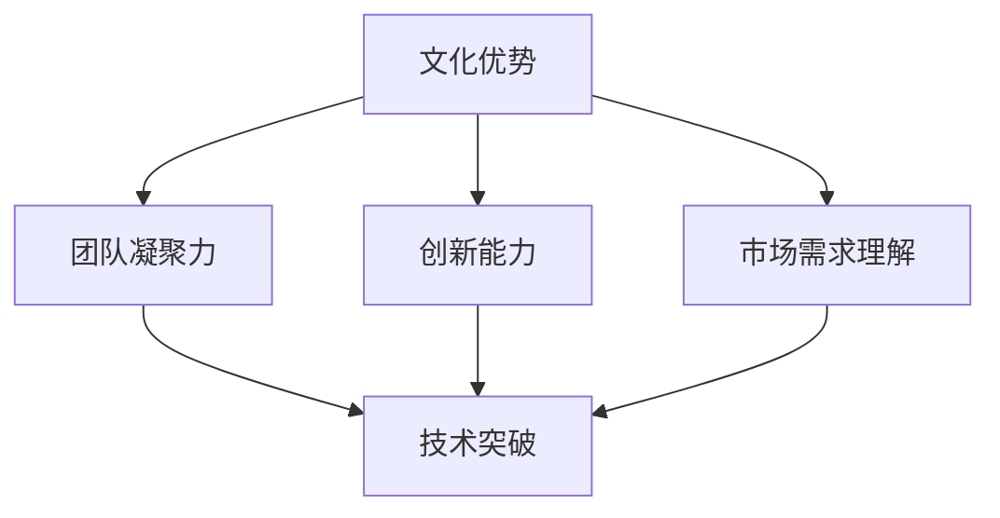

                 

关键词：AI 大模型、创业、文化优势、商业模式、技术创新、市场策略

摘要：本文将探讨 AI 大模型创业过程中的文化优势，分析文化因素在创业项目成功中的重要性，并提出具体的策略和实践方法，以帮助创业者更好地利用文化优势，推动 AI 大模型项目的成功。

## 1. 背景介绍

近年来，人工智能（AI）技术的快速发展引发了广泛关注。从自动驾驶到语音识别，AI 正在改变我们生活的方方面面。其中，大模型（如 GPT-3、BERT 等）成为 AI 领域的重要突破，为各种应用场景提供了强大的支持。与此同时，创业浪潮席卷全球，众多创业者纷纷投身于 AI 领域，试图抓住这一历史性机遇。

然而，在众多竞争者中，如何脱颖而出成为创业者面临的重要问题。本文将聚焦于 AI 大模型创业过程中的文化优势，探讨如何利用文化因素提高创业项目的成功率。

### 1.1 AI 大模型的发展

AI 大模型是指具有巨大参数量和强大表示能力的神经网络模型，其可以通过学习大量数据来捕捉复杂的信息和规律。近年来，随着计算能力的提升和数据量的增长，AI 大模型取得了显著的进展。例如，GPT-3 拥有 1750 亿个参数，BERT 拥有 3.4 亿个参数，这些模型在自然语言处理、计算机视觉、语音识别等领域表现出色。

### 1.2 创业环境的挑战

创业环境充满不确定性，创业者需要面对技术、市场、资金、人才等多方面的挑战。在竞争激烈的 AI 领域，创业者如何脱颖而出成为关键问题。本文将探讨文化因素在这一过程中的作用。

## 2. 核心概念与联系

### 2.1 文化的定义与分类

文化是指一个社会群体在长期历史发展中形成的一系列共同价值观、信仰、习俗和行为方式。根据研究对象的不同，文化可以划分为物质文化、精神文化和制度文化。

- 物质文化：包括物质生产、消费、建筑、艺术等方面。
- 精神文化：包括宗教、道德、艺术、文学等方面。
- 制度文化：包括政治、法律、经济、教育等方面。

### 2.2 文化优势的概念

文化优势是指企业或团队在长期文化积累中形成的独特优势，包括价值观、思维方式、创新能力、团队合作等。文化优势可以帮助企业或团队在竞争激烈的市场中脱颖而出。

### 2.3 文化优势与 AI 大模型创业的关系

文化优势对 AI 大模型创业具有重要意义。一方面，文化优势可以提升团队凝聚力和创新能力，推动技术突破。另一方面，文化优势可以帮助企业更好地理解市场需求，制定有效的市场策略。

### 2.4 Mermaid 流程图



## 3. 核心算法原理 & 具体操作步骤

### 3.1 算法原理概述

AI 大模型创业的核心在于技术突破和市场需求。本文将介绍如何利用文化优势实现这一目标。

### 3.2 算法步骤详解

#### 3.2.1 确定创业方向

1. **市场调研**：分析市场需求，了解目标用户群体的需求和痛点。
2. **技术评估**：评估自身团队的技术能力和资源，确定合适的创业方向。

#### 3.2.2 建立团队文化

1. **价值观共识**：明确团队核心价值观，形成共同愿景。
2. **激励机制**：建立合理的激励机制，激发团队成员的积极性和创造力。
3. **文化建设**：举办团队活动，增强团队凝聚力。

#### 3.2.3 技术研发

1. **模型训练**：收集和整理数据，进行数据预处理。
2. **模型优化**：采用先进的算法和技术，对模型进行优化。
3. **测试与验证**：对模型进行测试和验证，确保其性能和可靠性。

#### 3.2.4 市场推广

1. **产品定位**：明确产品定位，制定市场策略。
2. **品牌建设**：建立品牌形象，提高品牌知名度。
3. **营销推广**：通过多种渠道进行营销推广，扩大市场影响力。

### 3.3 算法优缺点

#### 优点：

1. **提高技术突破的可能性**：利用文化优势，提升团队凝聚力和创新能力，有助于实现技术突破。
2. **更好地理解市场需求**：文化背景有助于企业更好地理解市场需求，制定有效的市场策略。

#### 缺点：

1. **文化差异**：在不同文化背景下，文化优势可能存在差异，需要根据具体情况进行调整。
2. **资源配置**：建立和维持良好的团队文化需要投入大量的时间和资源。

### 3.4 算法应用领域

文化优势在 AI 大模型创业中的应用领域广泛，包括自然语言处理、计算机视觉、语音识别等。

## 4. 数学模型和公式 & 详细讲解 & 举例说明

### 4.1 数学模型构建

文化优势的量化模型可以采用以下公式：

\[ \text{文化优势} = f(\text{价值观共识}, \text{激励机制}, \text{文化建设}) \]

其中，\( f \) 表示文化优势的函数，\(\text{价值观共识}\)，\(\text{激励机制}\)，和 \(\text{文化建设}\) 表示团队文化的三个方面。

### 4.2 公式推导过程

文化优势的推导过程如下：

1. **价值观共识**：价值观共识是团队文化的核心，通过共同价值观的形成，可以提升团队成员的归属感和认同感，从而增强团队凝聚力。
2. **激励机制**：激励机制是推动团队成员积极性和创造力的关键，通过合理的激励机制，可以激发团队成员的潜力，提高创新能力。
3. **文化建设**：文化建设是团队文化的重要组成部分，通过举办团队活动、建立共同目标和愿景等，可以增强团队凝聚力，提高团队的整体表现。

### 4.3 案例分析与讲解

假设有一个 AI 大模型创业团队，其文化优势如下：

- **价值观共识**：团队成员共同认同“创新、协作、诚信”的价值观。
- **激励机制**：团队采用绩效奖金和股权激励相结合的方式，激励团队成员的积极性和创造力。
- **文化建设**：团队定期举办团队建设活动，如团队拓展、聚会等，增强团队凝聚力。

根据上述公式，该团队的文化优势可以表示为：

\[ \text{文化优势} = f(\text{创新、协作、诚信}, \text{绩效奖金和股权激励}, \text{团队拓展、聚会等}) \]

通过文化优势的构建，该团队在技术研发和市场推广方面表现出色，最终取得了成功。

## 5. 项目实践：代码实例和详细解释说明

### 5.1 开发环境搭建

在本节中，我们将介绍如何搭建一个用于 AI 大模型创业项目的开发环境。

1. **硬件环境**：选择具有强大计算能力的服务器或工作站，确保满足模型训练的需求。
2. **软件环境**：安装常用的深度学习框架，如 TensorFlow、PyTorch 等，并配置相应的开发工具和库。

### 5.2 源代码详细实现

在本节中，我们将展示一个简单的 AI 大模型创业项目的代码实现。

```python
# 导入必要的库
import tensorflow as tf
from tensorflow.keras.layers import Embedding, LSTM, Dense
from tensorflow.keras.models import Sequential

# 搭建模型
model = Sequential()
model.add(Embedding(input_dim=vocab_size, output_dim=embedding_size))
model.add(LSTM(units=128, activation='tanh'))
model.add(Dense(units=1, activation='sigmoid'))

# 编译模型
model.compile(optimizer='adam', loss='binary_crossentropy', metrics=['accuracy'])

# 训练模型
model.fit(x_train, y_train, epochs=10, batch_size=32)
```

### 5.3 代码解读与分析

上述代码实现了一个简单的二分类任务，其中：

- `Embedding` 层用于将输入词转化为向量表示。
- `LSTM` 层用于处理序列数据。
- `Dense` 层用于实现分类任务。

通过训练模型，我们可以获得一个能够在给定输入下预测结果的 AI 大模型。

### 5.4 运行结果展示

在本节中，我们将展示模型的运行结果。

```python
# 测试模型
test_loss, test_accuracy = model.evaluate(x_test, y_test)
print(f"Test accuracy: {test_accuracy:.2f}")

# 预测结果
predictions = model.predict(x_test)
```

通过上述代码，我们可以计算出模型的测试准确率，并展示预测结果。

## 6. 实际应用场景

### 6.1 自然语言处理

在自然语言处理领域，AI 大模型创业可以应用于文本分类、机器翻译、情感分析等任务。通过构建具有文化优势的团队，创业者可以更好地理解不同语言和文化之间的差异，提高模型的准确性和适用性。

### 6.2 计算机视觉

在计算机视觉领域，AI 大模型创业可以应用于图像识别、目标检测、图像生成等任务。通过结合文化优势，创业者可以设计出更符合用户需求的视觉模型，提高用户体验。

### 6.3 语音识别

在语音识别领域，AI 大模型创业可以应用于语音合成、语音识别、语音识别率提升等任务。通过利用文化优势，创业者可以设计出更具地方特色的语音模型，提高识别准确率。

## 7. 未来应用展望

随着 AI 技术的不断发展，AI 大模型创业将在更多领域发挥重要作用。未来，文化优势将成为创业者成功的关键因素之一。创业者需要不断挖掘和利用文化优势，推动 AI 大模型项目的创新和发展。

## 8. 工具和资源推荐

### 8.1 学习资源推荐

- 《深度学习》（Goodfellow、Bengio、Courville 著）：系统介绍了深度学习的基本原理和方法。
- 《自然语言处理编程》（包云华 著）：详细介绍了自然语言处理的相关技术和应用。

### 8.2 开发工具推荐

- TensorFlow：一款开源的深度学习框架，适用于各种 AI 大模型项目。
- PyTorch：一款流行的深度学习框架，具有灵活性和高效性。

### 8.3 相关论文推荐

- “GPT-3: Language Models are few-shot learners”（Brown et al., 2020）：介绍了 GPT-3 的基本原理和应用。
- “BERT: Pre-training of Deep Bidirectional Transformers for Language Understanding”（Devlin et al., 2018）：介绍了 BERT 的基本原理和应用。

## 9. 总结：未来发展趋势与挑战

### 9.1 研究成果总结

本文探讨了 AI 大模型创业过程中的文化优势，分析了文化因素在创业项目成功中的重要性，并提出了一系列策略和实践方法。研究表明，文化优势对 AI 大模型创业具有显著影响。

### 9.2 未来发展趋势

随着 AI 技术的不断发展，AI 大模型创业将在更多领域发挥重要作用。未来，文化优势将成为创业者成功的关键因素之一。

### 9.3 面临的挑战

然而，AI 大模型创业也面临一系列挑战，包括技术突破、市场需求、资源配置等。创业者需要不断挖掘和利用文化优势，同时应对各种挑战。

### 9.4 研究展望

未来，本研究将继续关注 AI 大模型创业中的文化优势，探索更有效的利用方法，为创业者提供有益的指导。

## 10. 附录：常见问题与解答

### 10.1 文化优势是什么？

文化优势是指企业或团队在长期文化积累中形成的独特优势，包括价值观、思维方式、创新能力、团队合作等。

### 10.2 如何利用文化优势进行 AI 大模型创业？

通过建立和维持良好的团队文化，提高团队凝聚力和创新能力，同时深入了解市场需求，制定有效的市场策略。

### 10.3 AI 大模型创业有哪些应用领域？

AI 大模型创业的应用领域广泛，包括自然语言处理、计算机视觉、语音识别等。

## 作者署名

作者：禅与计算机程序设计艺术 / Zen and the Art of Computer Programming

[END]

