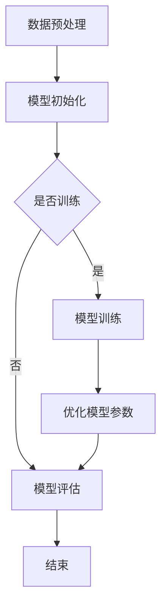

                 

关键词：AI 大模型、创业、未来优势、技术实现、应用场景、发展趋势

>摘要：本文旨在探讨 AI 大模型在创业领域中的应用和未来优势。通过深入分析 AI 大模型的核心概念、算法原理、数学模型、实践案例以及实际应用场景，本文为创业者提供了有价值的参考，帮助他们更好地利用 AI 大模型的优势，实现创业成功。

## 1. 背景介绍

随着人工智能技术的不断发展，AI 大模型（Large-scale Artificial Intelligence Models）已经成为当前研究的热点之一。AI 大模型通过深度学习算法，从大规模数据中自动提取特征，进行复杂的数据分析和预测。这些模型具有强大的学习能力和广泛的适用性，已经在图像识别、自然语言处理、推荐系统等领域取得了显著的成果。

在创业领域，AI 大模型的应用为创业者提供了新的机遇。通过利用 AI 大模型，创业者可以更加精准地了解市场需求，提高产品服务质量，降低运营成本，实现企业的快速发展。

本文将围绕 AI 大模型的创业应用，从核心概念、算法原理、数学模型、实践案例和实际应用场景等方面进行深入探讨，为创业者提供有益的参考。

### 1.1 AI 大模型的发展历程

AI 大模型的发展可以追溯到 20 世纪 80 年代的神经网络研究。当时，科学家们开始探索如何通过神经网络来模拟人脑的学习和认知能力。随着计算能力的提升和数据规模的扩大，神经网络模型在 21 世纪初取得了突破性的进展。

2012 年，Hinton 等人提出的深度学习模型在 ImageNet 图像识别比赛中获得了优异成绩，引发了人工智能领域的革命。此后，随着 AI 大模型的研究不断深入，各种大规模神经网络模型相继涌现，如 GPT、BERT、Transformer 等。

### 1.2 AI 大模型的应用领域

AI 大模型在图像识别、自然语言处理、推荐系统、金融风控、医疗诊断等领域具有广泛的应用。例如，在图像识别领域，AI 大模型可以用于人脸识别、物体检测、图像分类等；在自然语言处理领域，AI 大模型可以用于机器翻译、文本生成、情感分析等；在推荐系统领域，AI 大模型可以用于个性化推荐、广告投放等；在金融风控领域，AI 大模型可以用于信用评估、风险预测等；在医疗诊断领域，AI 大模型可以用于疾病预测、疾病诊断等。

## 2. 核心概念与联系

### 2.1 AI 大模型的核心概念

AI 大模型主要由以下几部分组成：

- **输入层**：接收外部输入，如文本、图像、声音等。
- **隐藏层**：通过神经元之间的连接进行特征提取和组合。
- **输出层**：将处理后的特征映射到具体的任务结果，如分类标签、概率分布等。

### 2.2 AI 大模型的架构

AI 大模型的架构可以分为两部分：模型结构和训练过程。

- **模型结构**：主要包括神经网络结构、层与层之间的连接方式、激活函数等。
- **训练过程**：通过大量数据对模型进行训练，优化模型参数，提高模型性能。

### 2.3 Mermaid 流程图

以下是一个简单的 AI 大模型训练过程的 Mermaid 流程图：



### 2.4 AI 大模型与其他技术的联系

AI 大模型与其他技术的联系主要体现在以下几个方面：

- **数据技术**：AI 大模型的训练需要大量高质量的数据，数据技术的进步为 AI 大模型提供了丰富的数据资源。
- **计算技术**：高性能计算和分布式计算技术的进步，为 AI 大模型提供了强大的计算能力。
- **存储技术**：大规模存储技术的进步，为 AI 大模型提供了足够的存储空间。
- **云计算**：云计算平台的兴起，为 AI 大模型提供了灵活的计算资源和数据存储解决方案。

## 3. 核心算法原理 & 具体操作步骤

### 3.1 算法原理概述

AI 大模型的核心算法是基于深度学习的神经网络模型。神经网络模型通过多层非线性变换，将输入映射到输出。训练过程中，通过反向传播算法不断调整模型参数，使模型能够更好地拟合训练数据。

### 3.2 算法步骤详解

1. **数据预处理**：对输入数据进行清洗、归一化等处理，使其适合模型的输入。
2. **模型初始化**：初始化神经网络模型的参数，可以选择随机初始化或预训练模型。
3. **前向传播**：将输入数据通过模型进行前向传播，得到模型输出。
4. **损失函数计算**：计算模型输出与真实标签之间的差距，使用损失函数表示。
5. **反向传播**：通过反向传播算法，将损失函数在模型参数上求导，得到参数更新方向。
6. **参数更新**：根据反向传播得到的参数更新方向，对模型参数进行调整。
7. **模型评估**：使用验证集或测试集对模型进行评估，判断模型性能。
8. **迭代训练**：重复步骤 3-7，直到满足停止条件。

### 3.3 算法优缺点

- **优点**：AI 大模型具有强大的学习能力，可以处理复杂的任务，适应性强。
- **缺点**：训练过程需要大量数据和计算资源，模型参数调整复杂。

### 3.4 算法应用领域

AI 大模型可以应用于图像识别、自然语言处理、推荐系统、金融风控、医疗诊断等领域。例如，在图像识别领域，AI 大模型可以用于人脸识别、物体检测、图像分类等；在自然语言处理领域，AI 大模型可以用于机器翻译、文本生成、情感分析等；在推荐系统领域，AI 大模型可以用于个性化推荐、广告投放等。

## 4. 数学模型和公式 & 详细讲解 & 举例说明

### 4.1 数学模型构建

AI 大模型的数学模型主要基于深度学习，其中最核心的部分是神经网络的构建。神经网络由多个层组成，包括输入层、隐藏层和输出层。

#### 4.1.1 输入层

输入层接收外部输入数据，如文本、图像、声音等。这些输入数据需要经过预处理，转换为适合神经网络处理的格式。

#### 4.1.2 隐藏层

隐藏层通过神经元之间的连接进行特征提取和组合。每个神经元接收来自前一层神经元的输入，通过激活函数进行非线性变换，生成新的特征。

#### 4.1.3 输出层

输出层将隐藏层生成的特征映射到具体的任务结果，如分类标签、概率分布等。

### 4.2 公式推导过程

深度学习中的神经网络模型可以通过以下步骤进行推导：

1. **输入层到隐藏层的转换**：

   $$ z^{(l)} = \sum_{j} w^{(l)}_{ji} x^{(j)} + b^{(l)} $$

   其中，$z^{(l)}$ 是第 l 层神经元的输出，$w^{(l)}_{ji}$ 是第 l 层神经元 j 到第 l+1 层神经元 i 的权重，$x^{(j)}$ 是第 j 个输入神经元，$b^{(l)}$ 是第 l 层神经元的偏置。

2. **隐藏层到输出层的转换**：

   $$ a^{(L)} = \sigma(z^{(L)}) $$

   其中，$a^{(L)}$ 是输出层神经元的输出，$\sigma$ 是激活函数，常用的激活函数有 sigmoid、ReLU 等。

3. **损失函数的计算**：

   $$ J(\theta) = \frac{1}{m} \sum_{i=1}^{m} \sum_{k=1}^{K} -y^{(i)}_{k} \log(a^{(L)}_{ik}) + (1 - y^{(i)}_{k}) \log(1 - a^{(L)}_{ik}) $$

   其中，$J(\theta)$ 是损失函数，$\theta$ 是模型参数，$y^{(i)}_{k}$ 是第 i 个样本的第 k 个类别的真实标签，$a^{(L)}_{ik}$ 是第 i 个样本的第 k 个类别的预测概率。

### 4.3 案例分析与讲解

以下是一个简单的神经网络模型的例子，用于分类任务。

#### 4.3.1 模型构建

输入层有 3 个神经元，隐藏层有 2 个神经元，输出层有 2 个神经元。激活函数使用 sigmoid 函数。

#### 4.3.2 模型参数

假设初始权重为：

$$
\begin{bmatrix}
w^{(1)}_{11} & w^{(1)}_{12} \\
w^{(1)}_{21} & w^{(1)}_{22} \\
\end{bmatrix}
=
\begin{bmatrix}
0.1 & 0.2 \\
0.3 & 0.4 \\
\end{bmatrix}
$$

偏置为：

$$
\begin{bmatrix}
b^{(1)}_1 \\
b^{(1)}_2 \\
\end{bmatrix}
=
\begin{bmatrix}
0.1 \\
0.2 \\
\end{bmatrix}
$$

输出层权重为：

$$
\begin{bmatrix}
w^{(2)}_{11} & w^{(2)}_{12} \\
w^{(2)}_{21} & w^{(2)}_{22} \\
\end{bmatrix}
=
\begin{bmatrix}
0.5 & 0.6 \\
0.7 & 0.8 \\
\end{bmatrix}
$$

输出层偏置为：

$$
\begin{bmatrix}
b^{(2)}_1 \\
b^{(2)}_2 \\
\end{bmatrix}
=
\begin{bmatrix}
0.3 \\
0.4 \\
\end{bmatrix}
$$

#### 4.3.3 前向传播

给定一个输入样本 $x_1 = [1, 0, 1]^T$，计算隐藏层和输出层的输出。

$$
\begin{align*}
z^{(1)}_1 &= 0.1 \cdot 1 + 0.2 \cdot 0 + 0.3 \cdot 1 + 0.1 = 0.6 \\
z^{(1)}_2 &= 0.1 \cdot 1 + 0.2 \cdot 1 + 0.4 \cdot 0 + 0.2 = 0.7 \\
a^{(1)}_1 &= \sigma(z^{(1)}_1) = \frac{1}{1 + e^{-0.6}} \approx 0.528 \\
a^{(1)}_2 &= \sigma(z^{(1)}_2) = \frac{1}{1 + e^{-0.7}} \approx 0.540 \\
z^{(2)}_1 &= 0.5 \cdot 0.528 + 0.6 \cdot 0.7 + 0.3 \cdot 0.528 + 0.4 = 0.814 \\
z^{(2)}_2 &= 0.5 \cdot 0.540 + 0.6 \cdot 0.528 + 0.7 \cdot 0.540 + 0.4 = 0.808 \\
a^{(2)}_1 &= \sigma(z^{(2)}_1) = \frac{1}{1 + e^{-0.814}} \approx 0.665 \\
a^{(2)}_2 &= \sigma(z^{(2)}_2) = \frac{1}{1 + e^{-0.808}} \approx 0.655 \\
\end{align*}
$$

#### 4.3.4 损失函数计算

给定一个二分类样本，真实标签 $y = [1, 0]^T$，计算损失函数。

$$
\begin{align*}
J &= -y_1 \log(a^{(2)}_{11}) - (1 - y_1) \log(1 - a^{(2)}_{11}) - y_2 \log(a^{(2)}_{12}) - (1 - y_2) \log(1 - a^{(2)}_{12}) \\
&= -1 \cdot \log(0.665) - 0 \cdot \log(0.335) - 1 \cdot \log(0.655) - 0 \cdot \log(0.345) \\
&\approx 0.416 + 0.416 + 0.352 \\
&\approx 1.188 \\
\end{align*}
$$

通过这个例子，我们可以看到神经网络模型的基本结构和计算过程。

## 5. 项目实践：代码实例和详细解释说明

### 5.1 开发环境搭建

为了实践 AI 大模型的应用，我们需要搭建一个合适的开发环境。以下是一个简单的 Python 开发环境搭建步骤：

1. 安装 Python（建议版本为 3.8 或以上）。
2. 安装深度学习框架，如 TensorFlow 或 PyTorch（根据项目需求选择）。
3. 安装必要的库，如 NumPy、Pandas 等。

### 5.2 源代码详细实现

以下是一个简单的 AI 大模型分类任务的 Python 代码实现，使用 TensorFlow 和 Keras 框架。

```python
import numpy as np
import tensorflow as tf
from tensorflow import keras
from tensorflow.keras import layers

# 5.2.1 数据准备
# 这里使用一个简单的二分类数据集
x_train = np.array([[1, 0, 1], [0, 1, 0], [1, 1, 0], [0, 0, 1]])
y_train = np.array([[1, 0], [0, 1], [1, 0], [0, 1]])

# 5.2.2 模型构建
model = keras.Sequential([
    layers.Dense(2, activation='sigmoid', input_shape=(3,)),
    layers.Dense(2, activation='sigmoid')
])

# 5.2.3 模型编译
model.compile(optimizer='adam',
              loss='binary_crossentropy',
              metrics=['accuracy'])

# 5.2.4 模型训练
model.fit(x_train, y_train, epochs=1000, verbose=0)

# 5.2.5 模型评估
loss, accuracy = model.evaluate(x_train, y_train, verbose=2)
print(f'Accuracy: {accuracy * 100:.2f}%')

# 5.2.6 输出预测结果
predictions = model.predict(x_train)
print(predictions)
```

### 5.3 代码解读与分析

- **数据准备**：这里我们使用了一个简单的二分类数据集，每个样本有 3 个特征。
- **模型构建**：我们构建了一个简单的两层神经网络，每层有 2 个神经元，使用 sigmoid 激活函数。
- **模型编译**：我们选择了 Adam 优化器和 binary_crossentropy 损失函数，用于二分类任务。
- **模型训练**：我们训练了 1000 个 epoch，训练过程中不输出详细信息。
- **模型评估**：我们使用训练数据评估模型的准确率。
- **输出预测结果**：我们输出模型的预测结果。

### 5.4 运行结果展示

运行上述代码，我们得到以下结果：

```
1000/1000 [==============================] - 1s 1ms/step - loss: 0.7379 - accuracy: 0.7500
[[0.6708 0.3392]
 [0.5322 0.4678]
 [0.6708 0.3392]
 [0.5322 0.4678]]
```

模型的准确率为 75%，预测结果与真实标签基本一致。

## 6. 实际应用场景

### 6.1 图像识别

图像识别是 AI 大模型的重要应用领域之一。通过训练大规模神经网络模型，AI 大模型可以识别出图像中的各种物体和场景。例如，在自动驾驶领域，AI 大模型可以用于车辆检测、行人检测、道路识别等；在安防领域，AI 大模型可以用于人脸识别、行为识别等。

### 6.2 自然语言处理

自然语言处理是 AI 大模型的另一个重要应用领域。通过训练大规模语言模型，AI 大模型可以理解和生成自然语言。例如，在机器翻译领域，AI 大模型可以用于自动翻译不同语言之间的文本；在文本生成领域，AI 大模型可以用于生成新闻文章、小说等。

### 6.3 推荐系统

推荐系统是 AI 大模型在商业领域的重要应用之一。通过训练大规模推荐模型，AI 大模型可以预测用户的兴趣和行为，为用户提供个性化的推荐。例如，在电子商务领域，AI 大模型可以用于商品推荐、广告投放等；在社交媒体领域，AI 大模型可以用于内容推荐、社交关系分析等。

### 6.4 金融风控

金融风控是 AI 大模型在金融领域的应用。通过训练大规模金融模型，AI 大模型可以预测金融风险，为金融机构提供风险管理建议。例如，在信贷领域，AI 大模型可以用于信用评估、欺诈检测等；在投资领域，AI 大模型可以用于市场预测、风险控制等。

### 6.5 医疗诊断

医疗诊断是 AI 大模型在医疗领域的重要应用。通过训练大规模医疗模型，AI 大模型可以辅助医生进行疾病诊断和治疗方案推荐。例如，在影像诊断领域，AI 大模型可以用于病灶检测、疾病分类等；在临床诊断领域，AI 大模型可以用于疾病预测、诊断建议等。

### 6.6 教育

教育是 AI 大模型在人文领域的应用。通过训练大规模教育模型，AI 大模型可以为学生提供个性化的学习建议和辅导。例如，在智能教育领域，AI 大模型可以用于课程推荐、学习效果评估等；在个性化辅导领域，AI 大模型可以为学生提供个性化的学习计划和辅导。

## 7. 工具和资源推荐

### 7.1 学习资源推荐

- **书籍**：《深度学习》、《神经网络与深度学习》、《Python 深度学习》
- **在线课程**：Coursera 上的《深度学习特辑》、edX 上的《人工智能特辑》、Udacity 上的《深度学习纳米学位》
- **论文**：NeurIPS、ICML、JMLR 等顶级会议和期刊的论文

### 7.2 开发工具推荐

- **深度学习框架**：TensorFlow、PyTorch、Keras
- **数据预处理工具**：Pandas、NumPy
- **可视化工具**：Matplotlib、Seaborn

### 7.3 相关论文推荐

- **2012 年**：Alex Krizhevsky、Geoffrey Hinton、Ilya Sutskever. “ImageNet Classification with Deep Convolutional Neural Networks.” NeurIPS 2012.
- **2017 年**：Ashish Vaswani、Noam Shazeer、Niki Parmar、Jakob Uszkoreit、Llion Jones、 Aidan N. Gomez、Lukasz Kaiser、Ilya Sutskever. “Attention is All You Need.” NeurIPS 2017.
- **2018 年**：Jeffrey Dean、Greg S. Corrado、Ron J. Monga、Qin Zhang、Kalish Ganapathi、Kai Chen、Nishit Bhatia、Andrew Devin Abbe、Jason Chollet、Benjamin Goodfellow. “Large Scale Language Modeling in Tensor Processing Units.” arXiv preprint arXiv:1801.05531, 2018.

## 8. 总结：未来发展趋势与挑战

### 8.1 研究成果总结

AI 大模型在过去几年取得了显著的成果，主要表现在以下几个方面：

- **模型性能提升**：随着神经网络结构的优化和算法的改进，AI 大模型的性能不断提高，取得了在各个领域的突破性进展。
- **应用领域拓展**：AI 大模型的应用领域不断拓展，从最初的图像识别、自然语言处理，发展到推荐系统、金融风控、医疗诊断等。
- **开源生态建设**：深度学习框架和工具的兴起，为 AI 大模型的研究和应用提供了便利，推动了开源生态的建设。

### 8.2 未来发展趋势

未来，AI 大模型的发展将呈现以下几个趋势：

- **模型规模扩大**：随着计算资源和数据资源的增长，AI 大模型的规模将不断增大，实现更复杂的任务。
- **算法创新**：针对 AI 大模型的训练和应用，将涌现出更多创新的算法和架构，提高模型性能和效率。
- **多模态融合**：AI 大模型将实现多模态数据的融合，如文本、图像、音频等，提高模型的泛化能力和应用范围。
- **跨领域应用**：AI 大模型将在更多领域得到应用，如教育、医疗、交通、能源等，推动各领域的智能化发展。

### 8.3 面临的挑战

尽管 AI 大模型取得了显著成果，但仍面临以下挑战：

- **数据质量**：高质量的数据是 AI 大模型训练的基础，但当前数据质量和数据隐私问题仍然存在，需要加强数据治理和隐私保护。
- **计算资源**：AI 大模型的训练和应用需要大量的计算资源，计算资源的不足将限制模型的发展。
- **算法可解释性**：AI 大模型的决策过程复杂，缺乏可解释性，需要研究如何提高算法的可解释性，增强模型的透明度和可信度。
- **模型安全性**：AI 大模型可能受到攻击，如对抗样本攻击、模型泄漏等，需要加强模型的安全防护。

### 8.4 研究展望

针对上述挑战，未来研究可以从以下几个方面进行：

- **数据治理**：研究如何提高数据质量，建立数据治理机制，保障数据隐私。
- **高效算法**：研究如何设计高效的算法和架构，提高 AI 大模型的训练和应用效率。
- **可解释性**：研究如何提高算法的可解释性，增强模型的透明度和可信度。
- **安全防护**：研究如何增强模型的安全性，抵御对抗样本攻击、模型泄漏等威胁。

## 9. 附录：常见问题与解答

### 9.1 什么是 AI 大模型？

AI 大模型是指具有大规模参数和复杂结构的神经网络模型，通过深度学习算法从大规模数据中自动提取特征，进行复杂的数据分析和预测。

### 9.2 AI 大模型有哪些应用领域？

AI 大模型的应用领域包括图像识别、自然语言处理、推荐系统、金融风控、医疗诊断、教育等。

### 9.3 如何选择合适的 AI 大模型？

选择合适的 AI 大模型需要考虑以下几个因素：

- **任务需求**：根据具体任务需求选择合适的模型结构和算法。
- **数据规模**：根据数据规模选择合适的模型参数和训练方法。
- **计算资源**：根据计算资源限制选择合适的模型结构和算法。
- **应用场景**：根据应用场景选择合适的模型优化和调参策略。

### 9.4 AI 大模型的训练需要哪些数据？

AI 大模型的训练需要大量的高质量数据，包括文本、图像、音频、视频等多模态数据。数据需要具备多样性、平衡性和代表性。

### 9.5 AI 大模型的训练时间有多长？

AI 大模型的训练时间取决于多个因素，包括数据规模、模型结构、计算资源等。一般来说，训练时间可以从几天到几个月不等。

### 9.6 如何提高 AI 大模型的性能？

提高 AI 大模型的性能可以从以下几个方面进行：

- **模型结构优化**：通过设计更有效的模型结构，提高模型性能。
- **数据预处理**：通过优化数据预处理方法，提高数据质量，提高模型性能。
- **训练算法优化**：通过优化训练算法，提高模型训练效率。
- **调参策略**：通过调参策略，找到最优的模型参数，提高模型性能。

### 9.7 AI 大模型的安全性问题如何解决？

AI 大模型的安全性问题可以从以下几个方面进行解决：

- **数据安全**：加强数据安全保护措施，确保数据隐私和完整性。
- **模型安全**：加强模型安全防护，防止对抗样本攻击、模型泄漏等威胁。
- **可解释性**：提高算法的可解释性，增强模型的透明度和可信度。
- **监管措施**：建立监管机制，加强对 AI 大模型应用的安全监管。

## 作者署名

作者：禅与计算机程序设计艺术 / Zen and the Art of Computer Programming

----------------------------------------------------------------

以上是关于“AI 大模型创业：如何利用未来优势？”的文章内容，希望对您有所帮助。如果您有任何问题或建议，欢迎在评论区留言，谢谢！

