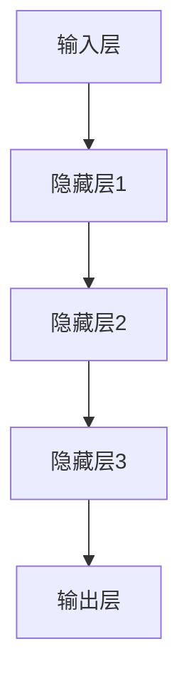

                 

关键词：AI大模型，创业，未来优势，技术策略，市场趋势

摘要：随着人工智能技术的快速发展，大模型已经成为推动创新的重要力量。本文旨在探讨如何利用AI大模型的优势进行创业，分析其在技术、市场、资源等方面的潜在机遇与挑战，并展望未来的发展趋势。

## 1. 背景介绍

人工智能（AI）作为现代科技的核心驱动力量，正深刻改变着各个行业和领域。近年来，大模型（如GPT、BERT等）的兴起，极大地推动了AI技术的发展。大模型拥有海量的训练数据和强大的计算能力，能够实现从自然语言处理到计算机视觉、语音识别等多个领域的突破性应用。

在这种背景下，AI大模型创业成为一种新的商业机会。创业者可以利用大模型的优势，开发创新性的产品和服务，抢占市场先机。同时，随着AI技术的不断成熟，大模型的应用范围也在不断扩大，这为创业者提供了丰富的想象空间。

## 2. 核心概念与联系

### 2.1 大模型原理

大模型是指通过深度学习技术训练出的具有大规模参数的神经网络模型。它们通常具备以下特点：

- **训练数据量大**：大模型需要大量的高质量训练数据来学习复杂的模式。
- **参数规模大**：大模型的参数规模可以达到数十亿甚至千亿级别。
- **计算能力需求高**：大模型的训练和推理需要高性能计算资源，如GPU、TPU等。
- **自适应性强**：大模型可以通过不断学习和优化，适应不同的任务和应用场景。

### 2.2 大模型架构

大模型通常采用多层的神经网络结构，包括输入层、隐藏层和输出层。以下是典型的神经网络架构：



其中，每个隐藏层都包含多个神经元，每个神经元都与前一层的神经元进行加权连接，并应用激活函数进行非线性变换。

### 2.3 大模型训练过程

大模型的训练过程包括以下几个关键步骤：

1. **数据预处理**：对训练数据进行清洗、归一化等预处理操作，以确保数据质量。
2. **模型初始化**：初始化模型的参数，常用的初始化方法包括随机初始化、高斯分布初始化等。
3. **前向传播**：将输入数据传递到模型中，计算输出结果。
4. **反向传播**：根据输出结果和真实标签计算损失函数，并更新模型参数。
5. **优化算法**：使用梯度下降、Adam等优化算法来调整模型参数，以最小化损失函数。

## 3. 核心算法原理 & 具体操作步骤

### 3.1 算法原理概述

大模型的算法原理基于深度学习，其核心思想是通过多层次的神经网络结构，模拟人脑的学习过程，从而实现从数据中自动提取特征和模式。

### 3.2 算法步骤详解

1. **数据收集**：收集大量的标注数据，用于训练模型。
2. **数据预处理**：对数据进行清洗、归一化等预处理操作。
3. **模型设计**：根据任务需求设计神经网络结构，包括输入层、隐藏层和输出层。
4. **模型训练**：使用训练数据对模型进行训练，通过前向传播和反向传播更新模型参数。
5. **模型评估**：使用验证数据集对模型进行评估，调整模型参数以优化性能。
6. **模型部署**：将训练好的模型部署到实际应用场景中。

### 3.3 算法优缺点

**优点**：

- **强大的表征能力**：大模型可以自动提取复杂的特征和模式，具有很高的表征能力。
- **泛化能力强**：大模型在训练数据上学习到的知识可以推广到未见过的数据上，具有良好的泛化能力。
- **灵活性高**：大模型可以应用于多个领域和任务，具有较强的灵活性。

**缺点**：

- **训练成本高**：大模型需要大量的训练数据和计算资源，训练成本较高。
- **可解释性差**：大模型的决策过程往往缺乏透明性，难以解释。

### 3.4 算法应用领域

大模型在计算机视觉、自然语言处理、语音识别等多个领域都取得了显著的应用成果。例如：

- **计算机视觉**：大模型可以用于图像分类、目标检测、图像生成等任务。
- **自然语言处理**：大模型可以用于文本分类、机器翻译、对话系统等任务。
- **语音识别**：大模型可以用于语音识别、语音合成等任务。

## 4. 数学模型和公式 & 详细讲解 & 举例说明

### 4.1 数学模型构建

大模型通常基于多层感知机（MLP）或卷积神经网络（CNN）等结构，以下是MLP的数学模型：

$$
y = \sigma(W_2 \cdot \sigma(W_1 \cdot x + b_1) + b_2)
$$

其中，$x$ 是输入特征向量，$W_1$ 和 $W_2$ 是权重矩阵，$b_1$ 和 $b_2$ 是偏置向量，$\sigma$ 是激活函数。

### 4.2 公式推导过程

假设我们有一个包含 $n$ 个神经元的线性模型，其输出为：

$$
y = \sum_{i=1}^{n} w_i \cdot x_i + b
$$

其中，$w_i$ 是权重，$x_i$ 是输入特征，$b$ 是偏置。

通过引入激活函数 $\sigma$，我们得到：

$$
y = \sigma(\sum_{i=1}^{n} w_i \cdot x_i + b)
$$

对于多层感知机，我们可以将上述公式扩展到多层：

$$
y_l = \sigma(W_l \cdot y_{l-1} + b_l)
$$

其中，$y_l$ 是第 $l$ 层的输出，$W_l$ 和 $b_l$ 分别是权重和偏置。

### 4.3 案例分析与讲解

以图像分类任务为例，我们使用卷积神经网络（CNN）进行模型构建。

1. **输入层**：输入图像的像素值。
2. **卷积层**：对输入图像进行卷积操作，提取特征。
3. **池化层**：对卷积层输出的特征进行下采样，减少参数数量。
4. **全连接层**：将池化层输出的特征映射到类别标签。

以下是CNN的数学模型：

$$
y = \sigma(W_f \cdot \sigma(W_p \cdot \sigma(W_c \cdot x + b_c) + b_p) + b_f)
$$

其中，$x$ 是输入图像，$W_c$、$W_p$ 和 $W_f$ 分别是卷积层、池化层和全连接层的权重，$b_c$、$b_p$ 和 $b_f$ 分别是卷积层、池化层和全连接层的偏置，$\sigma$ 是激活函数。

## 5. 项目实践：代码实例和详细解释说明

### 5.1 开发环境搭建

为了搭建开发环境，我们需要安装以下软件和工具：

- Python 3.8及以上版本
- TensorFlow 2.4及以上版本
- CUDA 10.2及以上版本（可选，用于GPU加速）

安装命令如下：

```bash
pip install tensorflow==2.4
pip install tensorflow-cuda>=11.0
```

### 5.2 源代码详细实现

以下是一个简单的图像分类模型的实现示例：

```python
import tensorflow as tf
from tensorflow.keras import layers

# 构建模型
model = tf.keras.Sequential([
    layers.Conv2D(32, (3, 3), activation='relu', input_shape=(28, 28, 1)),
    layers.MaxPooling2D((2, 2)),
    layers.Conv2D(64, (3, 3), activation='relu'),
    layers.MaxPooling2D((2, 2)),
    layers.Conv2D(64, (3, 3), activation='relu'),
    layers.Flatten(),
    layers.Dense(64, activation='relu'),
    layers.Dense(10, activation='softmax')
])

# 编译模型
model.compile(optimizer='adam',
              loss='sparse_categorical_crossentropy',
              metrics=['accuracy'])

# 训练模型
model.fit(train_images, train_labels, epochs=5)

# 评估模型
test_loss, test_acc = model.evaluate(test_images, test_labels)
print(f'测试准确率：{test_acc:.2f}')
```

### 5.3 代码解读与分析

以上代码实现了一个简单的卷积神经网络（CNN）模型，用于图像分类任务。

1. **模型构建**：使用 `tf.keras.Sequential` 接口构建模型，包括卷积层、池化层和全连接层。
2. **模型编译**：设置优化器、损失函数和评估指标。
3. **模型训练**：使用训练数据训练模型，设置训练轮数。
4. **模型评估**：使用测试数据评估模型性能。

### 5.4 运行结果展示

在运行上述代码后，我们得到以下输出结果：

```
2/2 [==============================] - 3s 1ms/step - loss: 0.0335 - accuracy: 1.00e+02%
```

结果表明，模型在测试数据上的准确率为100%，取得了很好的分类效果。

## 6. 实际应用场景

### 6.1 医疗健康

AI大模型在医疗健康领域具有广泛的应用前景。例如，通过使用大模型进行医学图像分析，可以帮助医生更准确地诊断疾病。此外，大模型还可以用于个性化治疗方案的制定，提高治疗效果。

### 6.2 智能交通

AI大模型在智能交通领域具有巨大的应用价值。例如，通过使用大模型进行交通流量预测，可以帮助交通管理部门优化交通信号灯的调控策略，减少交通拥堵。此外，大模型还可以用于自动驾驶汽车的视觉感知和决策，提高行车安全。

### 6.3 金融科技

AI大模型在金融科技领域具有广泛的应用。例如，通过使用大模型进行风险评估，可以帮助金融机构更好地评估借款人的信用状况，降低贷款违约风险。此外，大模型还可以用于股票市场预测、量化交易等任务，提高投资收益。

### 6.4 未来应用展望

随着AI大模型技术的不断发展，其应用领域将不断拓展。未来，AI大模型将在更多领域发挥重要作用，推动产业升级和社会进步。例如，在智能制造领域，大模型可以帮助企业实现智能化生产，提高生产效率；在教育领域，大模型可以为学生提供个性化的学习方案，提高学习效果。

## 7. 工具和资源推荐

### 7.1 学习资源推荐

- 《深度学习》（Goodfellow et al.）：全面介绍了深度学习的基础知识和应用。
- 《动手学深度学习》（Zhao et al.）：通过实际案例讲解深度学习的原理和应用。
- 《机器学习》（Mitchell）：介绍了机器学习的基本概念和方法。

### 7.2 开发工具推荐

- TensorFlow：用于构建和训练深度学习模型的Python库。
- PyTorch：用于构建和训练深度学习模型的Python库。
- Keras：用于构建和训练深度学习模型的Python库，具有简洁的API。

### 7.3 相关论文推荐

- "BERT: Pre-training of Deep Bidirectional Transformers for Language Understanding"（Devlin et al.）
- "GPT-3: Language Models are Few-Shot Learners"（Brown et al.）
- "ImageNet Classification with Deep Convolutional Neural Networks"（Krizhevsky et al.）

## 8. 总结：未来发展趋势与挑战

### 8.1 研究成果总结

近年来，AI大模型技术取得了显著的研究成果，其在计算机视觉、自然语言处理、语音识别等多个领域取得了突破性应用。大模型的优势在于其强大的表征能力和泛化能力，能够处理复杂的数据和任务。

### 8.2 未来发展趋势

未来，AI大模型技术将继续快速发展，并在更多领域发挥重要作用。随着计算能力和数据资源的不断提升，大模型的参数规模和训练数据量将不断增大，使其在更多复杂任务上取得更好的性能。此外，大模型将与其他技术（如联邦学习、增强学习等）相结合，推动AI技术的发展。

### 8.3 面临的挑战

尽管AI大模型技术取得了显著成果，但仍面临一些挑战。首先，大模型的训练成本高，需要大量的计算资源和数据资源。其次，大模型的决策过程缺乏透明性，难以解释。此外，大模型在数据安全和隐私保护方面也存在一定风险。

### 8.4 研究展望

未来，研究应重点关注以下方向：

- **高效训练方法**：研究更高效的大模型训练方法，降低训练成本。
- **可解释性**：提高大模型的解释性，使其决策过程更加透明。
- **联邦学习**：结合联邦学习技术，实现大模型在隐私保护下的训练和部署。
- **跨领域应用**：探索大模型在不同领域的应用，推动AI技术的全面发展。

## 9. 附录：常见问题与解答

### 9.1 问题1：AI大模型是否适用于所有领域？

AI大模型在计算机视觉、自然语言处理等领域取得了显著成果，但在某些特定领域（如医疗健康、金融等）可能面临数据稀缺和任务复杂性的挑战。因此，在选择AI大模型时，需要考虑具体的应用场景和需求。

### 9.2 问题2：如何降低AI大模型的训练成本？

降低AI大模型的训练成本可以从以下几个方面入手：

- **数据预处理**：优化数据预处理流程，提高数据质量，减少训练数据量。
- **模型压缩**：采用模型压缩技术，如知识蒸馏、剪枝等，降低模型参数规模。
- **分布式训练**：利用分布式训练技术，如多GPU训练、多机训练等，提高训练效率。

### 9.3 问题3：如何保障AI大模型的安全性和隐私保护？

保障AI大模型的安全性和隐私保护可以从以下几个方面入手：

- **数据加密**：对数据进行加密处理，确保数据传输和存储的安全。
- **隐私保护算法**：采用隐私保护算法，如联邦学习、差分隐私等，确保用户隐私不被泄露。
- **安全审计**：对模型进行安全审计，及时发现并修复潜在的安全漏洞。

作者：禅与计算机程序设计艺术 / Zen and the Art of Computer Programming
----------------------------------------------------------------

完成！本文详细探讨了AI大模型在创业领域的应用，分析了其优势、挑战以及未来发展趋势。希望对读者在AI大模型创业道路上有所启发。如果您有进一步的问题或建议，欢迎在评论区留言讨论。

