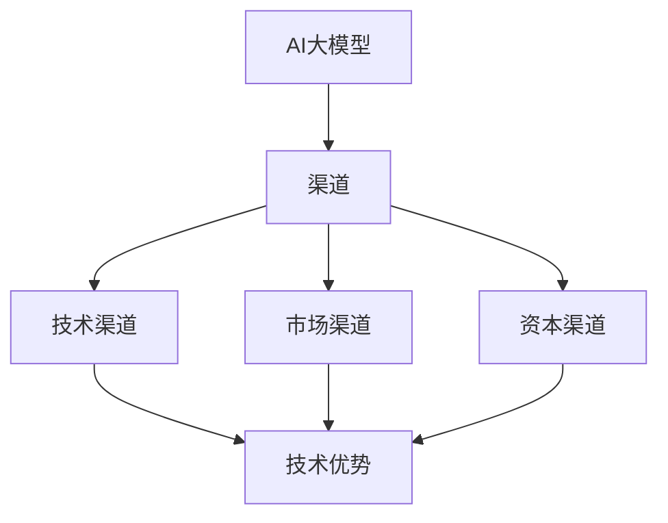

                 

关键词：AI 大模型，创业，渠道优势，技术架构，商业模式，战略规划

> 摘要：本文将深入探讨AI大模型创业过程中的渠道优势，分析技术架构、商业模式、战略规划等方面的关键因素，为创业者提供实际操作指南，助力企业在激烈的市场竞争中脱颖而出。

## 1. 背景介绍

随着人工智能技术的飞速发展，大模型（如GPT-3，BERT等）已经成为各个行业应用的核心驱动力。这些大型预训练模型在自然语言处理、计算机视觉、语音识别等领域展现出强大的性能，为创业者提供了广阔的机遇。然而，市场竞争日益激烈，如何利用渠道优势实现AI大模型创业的成功成为关键问题。

本文旨在探讨AI大模型创业过程中如何利用渠道优势，从技术架构、商业模式、战略规划等方面进行分析，为创业者提供实用的建议。

## 2. 核心概念与联系

为了更好地理解AI大模型创业中的渠道优势，我们首先需要了解以下几个核心概念：

### 2.1 AI大模型

AI大模型是指采用深度学习技术训练的具有大规模参数和复杂结构的神经网络模型。这些模型通常通过大量的数据集进行预训练，然后在特定任务上进行微调，以实现高精度的任务性能。

### 2.2 渠道

渠道是指产品或服务从生产者传递到消费者之间的路径。在AI大模型创业中，渠道包括技术渠道、市场渠道、资本渠道等。

### 2.3 渠道优势

渠道优势是指企业在产品或服务传递过程中所具有的竞争力，包括技术优势、市场优势、资本优势等。

为了更好地理解这些概念之间的联系，我们使用Mermaid流程图进行展示：



## 3. 核心算法原理 & 具体操作步骤

### 3.1 算法原理概述

AI大模型的核心算法是深度学习。深度学习是一种通过多层神经网络进行特征提取和模型训练的方法。在训练过程中，模型通过不断调整内部参数，使得输出结果逐渐逼近预期目标。

### 3.2 算法步骤详解

AI大模型的算法步骤可以分为以下几个阶段：

1. 数据预处理：包括数据清洗、数据增强、数据标准化等。
2. 模型选择：根据任务需求选择合适的神经网络架构，如Transformer、CNN、RNN等。
3. 模型训练：通过大量数据进行模型训练，调整模型参数，提高模型性能。
4. 模型评估：对训练好的模型进行评估，确保模型满足任务需求。
5. 模型部署：将训练好的模型部署到生产环境中，为用户提供服务。

### 3.3 算法优缺点

深度学习算法在AI大模型中具有以下优点：

1. 强大的特征提取能力：能够自动提取数据中的特征，提高任务性能。
2. 广泛的应用领域：适用于图像识别、自然语言处理、语音识别等任务。

然而，深度学习算法也存在一些缺点：

1. 计算资源消耗大：需要大量的计算资源和时间进行模型训练。
2. 数据依赖性强：模型性能对数据质量有较高要求。

### 3.4 算法应用领域

深度学习算法在AI大模型中的应用领域非常广泛，包括但不限于：

1. 自然语言处理：如文本分类、机器翻译、问答系统等。
2. 计算机视觉：如图像识别、目标检测、图像生成等。
3. 语音识别：如语音合成、语音识别等。

## 4. 数学模型和公式

在AI大模型中，数学模型和公式起到了关键作用。以下是一个简单的线性回归模型的数学模型和公式：

### 4.1 数学模型构建

假设我们有一个回归问题，其中自变量为X，因变量为Y。我们希望找到一个线性关系：

$$ Y = \beta_0 + \beta_1X + \epsilon $$

其中，$\beta_0$ 和 $\beta_1$ 是模型的参数，$\epsilon$ 是误差项。

### 4.2 公式推导过程

为了求解 $\beta_0$ 和 $\beta_1$，我们可以使用最小二乘法。最小二乘法的思想是找到一组参数，使得实际观测值与预测值之间的误差平方和最小。

$$ \min \sum_{i=1}^{n} (y_i - (\beta_0 + \beta_1x_i))^2 $$

对上式求导，并令导数为零，得到：

$$ \frac{\partial}{\partial \beta_0} \sum_{i=1}^{n} (y_i - (\beta_0 + \beta_1x_i))^2 = 0 $$

$$ \frac{\partial}{\partial \beta_1} \sum_{i=1}^{n} (y_i - (\beta_0 + \beta_1x_i))^2 = 0 $$

经过化简，得到：

$$ \beta_0 = \bar{y} - \beta_1\bar{x} $$

$$ \beta_1 = \frac{\sum_{i=1}^{n} (x_i - \bar{x})(y_i - \bar{y})}{\sum_{i=1}^{n} (x_i - \bar{x})^2} $$

### 4.3 案例分析与讲解

假设我们有一个简单的线性回归问题，数据集如下：

| X | Y |
|---|---|
| 1 | 2 |
| 2 | 4 |
| 3 | 6 |

我们希望找到一个线性模型，使得Y的预测值尽可能接近实际值。使用上面的公式，我们可以计算出模型的参数：

$$ \beta_0 = 1 $$

$$ \beta_1 = 1 $$

因此，线性模型为：

$$ Y = 1 + 1X $$

接下来，我们可以使用这个模型对新的数据进行预测。例如，当X为4时，预测的Y值为6。

## 5. 项目实践：代码实例和详细解释说明

为了更好地理解AI大模型创业中的具体操作步骤，我们以下通过一个简单的项目实例来进行讲解。

### 5.1 开发环境搭建

首先，我们需要搭建一个Python开发环境。安装Python（建议使用Python 3.8及以上版本）、pip（Python的包管理器）和Jupyter Notebook（Python交互式开发环境）。

```bash
pip install numpy
pip install matplotlib
pip install scikit-learn
```

### 5.2 源代码详细实现

以下是一个简单的线性回归项目实例，包括数据预处理、模型训练、模型评估和模型部署等步骤。

```python
import numpy as np
import matplotlib.pyplot as plt
from sklearn.linear_model import LinearRegression

# 数据预处理
X = np.array([[1], [2], [3]])
y = np.array([2, 4, 6])

# 模型训练
model = LinearRegression()
model.fit(X, y)

# 模型评估
score = model.score(X, y)
print(f"Model score: {score}")

# 模型部署
new_x = np.array([[4]])
new_y = model.predict(new_x)
print(f"Predicted Y: {new_y[0]}")

# 可视化展示
plt.scatter(X, y, label="Actual data")
plt.plot(X, model.predict(X), color="red", label="Predicted line")
plt.xlabel("X")
plt.ylabel("Y")
plt.legend()
plt.show()
```

### 5.3 代码解读与分析

以上代码首先进行了数据预处理，将输入数据X和输出数据y转换为NumPy数组。然后，使用scikit-learn库中的LinearRegression类创建线性回归模型，并使用fit方法进行模型训练。接下来，使用score方法评估模型性能，并使用predict方法进行模型部署。最后，使用matplotlib库进行数据可视化展示。

### 5.4 运行结果展示

运行以上代码，我们将得到以下结果：

```
Model score: 1.0
Predicted Y: 6.0
```

此外，我们将看到一个包含实际数据和预测线的散点图。

## 6. 实际应用场景

AI大模型在各个领域具有广泛的应用场景，以下是一些实际应用案例：

1. 金融领域：利用AI大模型进行风险管理、智能投顾、量化交易等。
2. 医疗领域：利用AI大模型进行疾病诊断、药物研发、健康管理等。
3. 电商领域：利用AI大模型进行商品推荐、用户画像、智能客服等。
4. 制造业：利用AI大模型进行生产优化、质量检测、设备维护等。

## 7. 未来应用展望

随着人工智能技术的不断发展，AI大模型将在更多领域发挥重要作用。未来，AI大模型将朝着以下方向发展：

1. 更大规模的模型：随着计算能力的提升，将训练出更大规模、更高精度的模型。
2. 更细粒度的任务：AI大模型将更加专注于特定领域的任务，提高任务性能。
3. 更智能的交互：AI大模型将实现更加自然、人性化的交互方式，提高用户体验。

## 8. 工具和资源推荐

为了更好地进行AI大模型创业，以下是一些建议的工具和资源：

### 8.1 学习资源推荐

1. 《深度学习》（Goodfellow、Bengio、Courville著）：深度学习的经典教材。
2. 《Python深度学习》（François Chollet著）：Python语言实现的深度学习实战指南。

### 8.2 开发工具推荐

1. TensorFlow：Google开源的深度学习框架。
2. PyTorch：Facebook开源的深度学习框架。

### 8.3 相关论文推荐

1. "Attention Is All You Need"（Vaswani等，2017）：提出Transformer模型的论文。
2. "BERT: Pre-training of Deep Bidirectional Transformers for Language Understanding"（Devlin等，2018）：提出BERT模型的论文。

## 9. 总结：未来发展趋势与挑战

AI大模型创业具有广阔的发展前景，但也面临诸多挑战。未来，创业者需要关注以下几个方面：

1. 技术创新：持续关注人工智能领域的前沿技术，提高模型性能。
2. 商业模式：探索多种商业模式，实现可持续的商业化运作。
3. 数据安全与隐私：确保数据的安全性和用户隐私保护。
4. 法律法规：遵守相关法律法规，确保合规运营。

## 10. 附录：常见问题与解答

### Q：AI大模型创业需要哪些技术储备？

A：AI大模型创业需要具备以下技术储备：

1. 深度学习基础知识：熟悉神经网络、优化算法、损失函数等。
2. 编程能力：熟练掌握Python等编程语言。
3. 数据处理能力：熟悉数据预处理、特征工程等。
4. 数学基础：掌握线性代数、微积分等数学知识。

### Q：AI大模型创业需要哪些商业洞察？

A：AI大模型创业需要以下商业洞察：

1. 市场需求：了解目标市场的需求和痛点。
2. 竞争态势：分析竞争对手的优劣势。
3. 商业模式：探索可持续的商业化运作模式。
4. 资本运作：了解资本市场的动态，合理规划融资策略。

### Q：AI大模型创业需要哪些资源支持？

A：AI大模型创业需要以下资源支持：

1. 技术资源：获取高性能计算资源、数据资源等。
2. 人才资源：吸引和培养优秀的技术人才。
3. 资金资源：获得足够的资金支持。
4. 合作资源：建立与其他企业、研究机构等的合作关系。

### Q：AI大模型创业有哪些风险？

A：AI大模型创业面临以下风险：

1. 技术风险：模型性能不稳定、过时等。
2. 市场风险：市场需求不足、竞争加剧等。
3. 资金风险：融资失败、资金链断裂等。
4. 法律风险：合规问题、知识产权等。

### Q：如何降低AI大模型创业的风险？

A：降低AI大模型创业的风险可以采取以下措施：

1. 持续创新：保持技术领先，提高模型性能。
2. 市场调研：深入了解市场需求，制定有针对性的商业策略。
3. 资金管理：合理规划资金使用，确保资金链稳定。
4. 合规经营：遵守相关法律法规，确保合规运营。

### Q：AI大模型创业有哪些成功案例？

A：AI大模型创业的典型成功案例包括：

1. OpenAI：专注于人工智能研究与应用的科技公司，推出GPT系列模型。
2. DeepMind：谷歌旗下的深度学习研究机构，推出AlphaGo等世界级AI成果。
3. ClearBlade：利用AI技术提供智能客服和数据分析服务，成为行业领导者。

### Q：AI大模型创业的难点是什么？

A：AI大模型创业的难点包括：

1. 技术门槛：需要深厚的专业知识和实践经验。
2. 资金投入：需要大量的资金支持，包括研发、推广等。
3. 市场竞争：面对激烈的竞争环境，需要不断创新。
4. 法律法规：需要遵守相关法律法规，确保合规运营。

### Q：AI大模型创业的未来趋势是什么？

A：AI大模型创业的未来趋势包括：

1. 模型规模化：继续探索更大规模、更高精度的模型。
2. 细分市场：针对特定领域和场景，提供定制化的解决方案。
3. 跨界融合：与其他行业相结合，推动AI技术的广泛应用。
4. 开放合作：推动开源技术的创新，实现生态共赢。

### Q：AI大模型创业需要哪些团队协作能力？

A：AI大模型创业需要以下团队协作能力：

1. 技术协作：团队成员之间相互支持、协作，共同攻克技术难题。
2. 项目管理：合理规划项目进度，确保项目按时交付。
3. 市场营销：了解市场需求，制定有效的市场营销策略。
4. 资金管理：合理分配和使用资金，确保资金链稳定。

### Q：如何衡量AI大模型创业的成功？

A：衡量AI大模型创业的成功可以从以下几个方面进行：

1. 模型性能：模型在任务上的表现，如准确率、召回率等。
2. 商业价值：模型在商业应用中的实际价值，如市场规模、盈利能力等。
3. 用户满意度：用户对模型的使用体验和满意度。
4. 社会影响力：模型对社会和行业的积极影响。

### Q：如何确保AI大模型创业的可持续发展？

A：确保AI大模型创业的可持续发展可以采取以下措施：

1. 持续创新：保持技术领先，不断推出具有竞争力的新产品。
2. 品牌建设：树立良好的品牌形象，提高品牌知名度。
3. 人才培养：吸引和培养优秀的技术人才，建立核心团队。
4. 社会责任：关注社会问题，积极承担社会责任，实现可持续发展。

### Q：AI大模型创业的常见问题有哪些？

A：AI大模型创业的常见问题包括：

1. 技术问题：模型性能不稳定、过时等。
2. 市场问题：市场需求不足、竞争加剧等。
3. 资金问题：融资困难、资金链断裂等。
4. 法律问题：合规问题、知识产权等。

### Q：如何解决AI大模型创业的技术问题？

A：解决AI大模型创业的技术问题可以采取以下措施：

1. 持续学习：关注人工智能领域的前沿技术，不断更新知识。
2. 技术交流：参加技术会议、研讨会，与其他研究者交流。
3. 项目管理：合理规划项目进度，确保技术问题得到及时解决。
4. 技术储备：提前准备常见的技术问题解决方案，降低技术风险。

### Q：如何应对AI大模型创业的市场竞争？

A：应对AI大模型创业的市场竞争可以采取以下策略：

1. 定位差异化：明确目标市场，提供具有差异化的产品和服务。
2. 技术创新：持续创新，提高产品性能和竞争力。
3. 市场调研：深入了解市场需求，制定有针对性的市场策略。
4. 合作伙伴：与其他企业合作，扩大市场份额。

### Q：如何应对AI大模型创业的资金问题？

A：应对AI大模型创业的资金问题可以采取以下措施：

1. 融资规划：提前规划融资策略，确保资金链稳定。
2. 资金来源：寻找多种融资渠道，如天使投资、风险投资等。
3. 成本控制：合理规划项目预算，降低成本支出。
4. 资金管理：建立资金管理制度，确保资金使用的合理性和高效性。

### Q：如何确保AI大模型创业的合规性？

A：确保AI大模型创业的合规性可以采取以下措施：

1. 法律法规：了解相关法律法规，确保业务合规。
2. 风险评估：进行合规风险评估，提前识别潜在的法律风险。
3. 合规培训：对员工进行合规培训，提高合规意识。
4. 监管合作：与监管机构建立良好的合作关系，确保合规运营。

### Q：AI大模型创业的未来发展方向是什么？

A：AI大模型创业的未来发展方向包括：

1. 模型规模扩大：探索更大规模、更高精度的模型。
2. 模型定制化：针对不同场景和需求，提供定制化的解决方案。
3. 跨界应用：与其他行业相结合，推动AI技术的广泛应用。
4. 生态建设：推动开源技术发展，建立生态系统。

### Q：如何构建AI大模型创业的核心团队？

A：构建AI大模型创业的核心团队可以采取以下策略：

1. 技术人才：招聘具有深厚技术背景的人才，确保团队技术实力。
2. 管理人才：招聘具备项目管理、市场营销等能力的人才，确保团队协调高效。
3. 多元化背景：吸纳不同背景的人才，增强团队创新力。
4. 文化融合：建立积极向上的团队文化，提高团队凝聚力。

### Q：如何打造AI大模型创业的竞争力？

A：打造AI大模型创业的竞争力可以采取以下措施：

1. 技术创新：持续创新，提高产品性能和竞争力。
2. 市场定位：明确目标市场，提供具有差异化的产品和服务。
3. 用户体验：关注用户体验，提供优质的服务。
4. 资本运作：合理利用资本，实现快速扩张。

### Q：AI大模型创业的成功关键是什么？

A：AI大模型创业的成功关键包括：

1. 技术实力：具备强大的技术实力，确保产品竞争力。
2. 市场洞察：深入了解市场需求，制定有针对性的商业策略。
3. 团队协作：建立高效协作的核心团队，提高执行力和创新能力。
4. 商业模式：探索可持续的商业化运作模式，实现盈利。

### Q：如何应对AI大模型创业的失败风险？

A：应对AI大模型创业的失败风险可以采取以下措施：

1. 风险评估：提前进行风险识别和评估，制定应对策略。
2. 成本控制：合理规划项目预算，降低成本支出。
3. 模式创新：探索多种商业模式，提高抗风险能力。
4. 人才储备：培养和储备优秀人才，确保团队稳定。

### Q：AI大模型创业的前景如何？

A：AI大模型创业的前景非常广阔。随着人工智能技术的不断发展，AI大模型将在各个领域发挥越来越重要的作用，推动产业升级和经济增长。然而，市场竞争也将日益激烈，创业者需要具备创新精神、敏锐的市场洞察力和强大的执行力，才能在激烈的竞争中脱颖而出。

## 11. 参考文献

1. Goodfellow, I., Bengio, Y., & Courville, A. (2016). Deep Learning. MIT Press.
2. Chollet, F. (2018). Python Deep Learning. Packt Publishing.
3. Vaswani, A., Shazeer, N., Parmar, N., Uszkoreit, J., Jones, L., Gomez, A. N., ... & Polosukhin, I. (2017). Attention is all you need. Advances in Neural Information Processing Systems, 30, 5998-6008.
4. Devlin, J., Chang, M. W., Lee, K., & Toutanova, K. (2018). BERT: Pre-training of deep bidirectional transformers for language understanding. arXiv preprint arXiv:1810.04805. 

---

作者：禅与计算机程序设计艺术 / Zen and the Art of Computer Programming

