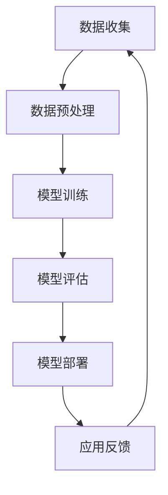

                 

关键词：人工智能、大模型、创业、社会优势、技术实现、商业模式、未来展望

> 摘要：本文将探讨人工智能领域中的大模型创业，通过分析社会优势的利用方式，为创业者提供一套可行的策略。本文首先介绍了大模型的基本概念和技术原理，然后分析了创业过程中需要关注的核心问题，最后提出了利用社会优势的几种具体方法，并结合实际案例进行详细讲解。

## 1. 背景介绍

近年来，人工智能（AI）技术取得了长足的发展，特别是在大模型领域。大模型是指拥有数十亿甚至千亿参数的神经网络模型，它们能够处理大量的数据，并在图像识别、自然语言处理、语音识别等领域取得了显著的成果。随着计算能力的提升和数据量的增加，大模型的研究和应用越来越受到关注。

AI 大模型创业是指利用人工智能技术，特别是大模型技术，开发具有商业价值的应用产品或服务的过程。随着 AI 技术的不断成熟和市场的需求增长，AI 大模型创业成为了一个热门的领域。然而，创业并非易事，创业者需要面对技术、市场、资金、人才等多方面的挑战。

本文将重点关注如何利用社会优势，即社会资源、技术积累、合作伙伴等，在 AI 大模型创业过程中取得成功。通过分析成功案例，总结出一些实用的经验和策略，以期为创业者提供有益的参考。

## 2. 核心概念与联系

### 2.1 大模型技术原理

大模型技术是基于深度学习的一种方法，它通过大规模的训练数据集和复杂的神经网络结构，使得模型能够自动学习数据的特征，并在各种任务中取得优异的性能。大模型的关键组成部分包括：

- **神经网络结构**：大模型通常采用深度神经网络（DNN）结构，通过多层神经元的非线性变换，实现对输入数据的特征提取和分类。
- **大规模数据集**：大模型训练需要大量的数据集，这些数据集可以来自于互联网、公开数据集、公司内部数据等，为模型的学习提供了丰富的信息。
- **计算资源**：大模型训练需要大量的计算资源，包括高性能的 GPU、TPU 等硬件设备，以及分布式训练技术，以提高训练效率。

### 2.2 大模型应用领域

大模型技术在各个领域都取得了显著的成果，以下是几个典型的应用领域：

- **图像识别**：通过训练大模型，可以实现对图像中的物体、场景、情感等的自动识别和分类。
- **自然语言处理**：大模型在自然语言处理任务中表现出色，包括文本分类、情感分析、机器翻译等。
- **语音识别**：大模型可以用于语音信号的处理和转换，实现自动语音识别和语音合成。
- **推荐系统**：大模型可以用于推荐系统的构建，通过对用户历史行为的分析，为用户推荐感兴趣的内容或商品。

### 2.3 Mermaid 流程图

以下是一个简化的 Mermaid 流程图，展示了大模型技术的核心组成部分和流程：



在这个流程中，数据收集是基础，数据预处理是关键，模型训练是核心，模型评估是检验，模型部署是落地，应用反馈是优化。

## 3. 核心算法原理 & 具体操作步骤

### 3.1 算法原理概述

大模型的核心算法是基于深度学习的神经网络。神经网络由多个层次组成，每一层都可以提取输入数据的特征，并通过非线性变换将这些特征组合起来，形成最终的输出。以下是神经网络的基本原理：

- **神经元**：神经网络的基本单元是神经元，每个神经元接收多个输入信号，并输出一个激活值。
- **权重和偏置**：每个输入信号都与一个权重相乘，然后加上一个偏置项，得到神经元的激活值。
- **激活函数**：神经元的激活值通过激活函数进行处理，常见的激活函数包括 sigmoid、ReLU 等。
- **反向传播**：神经网络通过反向传播算法来更新权重和偏置，以优化模型的性能。

### 3.2 算法步骤详解

大模型的训练过程可以分为以下几个步骤：

1. **数据准备**：收集大量的训练数据，并进行预处理，包括数据清洗、归一化、数据增强等。
2. **模型初始化**：初始化神经网络的结构和参数，常用的初始化方法包括随机初始化、Xavier 初始化等。
3. **前向传播**：输入数据通过神经网络的各个层次，产生输出结果。
4. **损失计算**：计算输出结果与真实标签之间的差异，得到损失值。
5. **反向传播**：根据损失值，通过反向传播算法更新神经网络的权重和偏置。
6. **迭代优化**：重复前向传播和反向传播的过程，不断优化模型的性能。
7. **模型评估**：在验证集上评估模型的性能，选择最优的模型。

### 3.3 算法优缺点

大模型算法的优点包括：

- **强大的表达能力**：大模型可以处理复杂的任务，通过多层神经元的组合，可以提取出丰富的特征。
- **自动特征提取**：大模型可以自动从数据中学习特征，减轻了手工特征工程的工作量。
- **泛化能力强**：大模型通过大规模数据训练，具有良好的泛化能力，可以在不同任务上取得较好的性能。

大模型算法的缺点包括：

- **计算成本高**：大模型的训练需要大量的计算资源和时间，对硬件设施有较高的要求。
- **对数据依赖性强**：大模型对数据量有较高的要求，数据的质量和多样性对模型性能有重要影响。
- **模型可解释性差**：大模型的学习过程复杂，模型内部的权重和偏置难以解释，不利于理解和调试。

### 3.4 算法应用领域

大模型算法在多个领域都有广泛的应用，以下是几个典型的应用领域：

- **图像识别**：大模型可以用于图像分类、目标检测、图像生成等任务。
- **自然语言处理**：大模型可以用于文本分类、情感分析、机器翻译、语音识别等任务。
- **推荐系统**：大模型可以用于用户行为分析、兴趣挖掘、商品推荐等任务。
- **医疗健康**：大模型可以用于疾病诊断、药物设计、健康预测等任务。

## 4. 数学模型和公式 & 详细讲解 & 举例说明

### 4.1 数学模型构建

大模型的基本数学模型是基于多层感知机（MLP）的神经网络。神经网络由多个层次组成，每一层都可以看作是一个线性变换加上一个非线性激活函数。以下是神经网络的基本数学模型：

$$
Z^{[l]} = W^{[l]}A^{[l-1]} + b^{[l]}
$$

$$
A^{[l]} = \sigma(Z^{[l]})
$$

其中，$Z^{[l]}$ 表示第 $l$ 层的线性变换结果，$A^{[l]}$ 表示第 $l$ 层的激活值，$W^{[l]}$ 表示第 $l$ 层的权重矩阵，$b^{[l]}$ 表示第 $l$ 层的偏置向量，$\sigma$ 表示非线性激活函数。

### 4.2 公式推导过程

以下是神经网络的前向传播和反向传播的推导过程：

#### 前向传播

假设神经网络有 $L$ 层，输入为 $X$，输出为 $Y$。在前向传播中，我们计算每一层的输出值。

$$
Z^{[1]} = XW^{[1]} + b^{[1]}
$$

$$
A^{[1]} = \sigma(Z^{[1]})
$$

$$
Z^{[2]} = A^{[1]}W^{[2]} + b^{[2]}
$$

$$
A^{[2]} = \sigma(Z^{[2]})
$$

$$
\vdots$$

$$
Z^{[L]} = A^{[L-1]}W^{[L]} + b^{[L]}
$$

$$
A^{[L]} = \sigma(Z^{[L]})
$$

#### 反向传播

在反向传播中，我们根据输出误差，通过链式法则计算每一层的梯度。

$$
\delta^{[L]} = A^{[L]} - Y
$$

$$
\gamma^{[L]} = \sigma'(Z^{[L]})
$$

$$
\delta^{[L-1]} = \gamma^{[L]}\delta^{[L]}W^{[L-1]}
$$

$$
\gamma^{[L-1]} = \sigma'(Z^{[L-1]})
$$

$$
\vdots$$

$$
\delta^{[2]} = \gamma^{[3]}\delta^{[3]}W^{[2]}
$$

$$
\gamma^{[1]} = \sigma'(Z^{[1]})
$$

$$
\delta^{[1]} = \gamma^{[1]}\delta^{[2]}
$$

#### 梯度计算

根据梯度计算公式，我们可以得到每一层的权重和偏置的梯度：

$$
\frac{\partial J}{\partial W^{[l]}} = A^{[l-1]T}\delta^{[l]}
$$

$$
\frac{\partial J}{\partial b^{[l]}} = \delta^{[l]}
$$

其中，$J$ 表示损失函数，$A^{[l-1]T}$ 表示第 $l-1$ 层的激活值的转置。

### 4.3 案例分析与讲解

以下是一个简单的神经网络训练的案例：

假设我们有一个二分类问题，输入为 $X = [1, 2, 3, 4]$，真实标签为 $Y = [0, 1, 0, 1]$。我们使用一个单层神经网络进行训练，神经网络的结构为 $W^{[1]} = \begin{bmatrix}1 & 1 \\ 1 & 1\end{bmatrix}$，$b^{[1]} = [1, 1]$。

首先，我们进行前向传播，计算每一层的输出：

$$
Z^{[1]} = XW^{[1]} + b^{[1]} = \begin{bmatrix}1 & 2 \\ 1 & 3 \\ 1 & 4\end{bmatrix}\begin{bmatrix}1 & 1 \\ 1 & 1\end{bmatrix} + \begin{bmatrix}1 \\ 1\end{bmatrix} = \begin{bmatrix}3 & 4 \\ 3 & 5 \\ 3 & 6\end{bmatrix}
$$

$$
A^{[1]} = \sigma(Z^{[1]}) = \begin{bmatrix}1 & 1 \\ 1 & 1 \\ 1 & 1\end{bmatrix}
$$

然后，我们计算输出误差：

$$
\delta^{[1]} = A^{[1]} - Y = \begin{bmatrix}1 & 1 \\ 1 & 1 \\ 1 & 1\end{bmatrix} - \begin{bmatrix}0 & 1 \\ 1 & 0 \\ 0 & 1\end{bmatrix} = \begin{bmatrix}1 & 0 \\ 0 & 1 \\ 1 & 0\end{bmatrix}
$$

接下来，我们进行反向传播，计算每一层的梯度：

$$
\gamma^{[1]} = \sigma'(Z^{[1]}) = \begin{bmatrix}0.5 & 0.5 \\ 0.5 & 0.5 \\ 0.5 & 0.5\end{bmatrix}
$$

$$
\delta^{[2]} = \gamma^{[1]}\delta^{[1]}W^{[1]} = \begin{bmatrix}0.5 & 0.5 \\ 0.5 & 0.5 \\ 0.5 & 0.5\end{bmatrix}\begin{bmatrix}1 & 0 \\ 0 & 1\end{bmatrix} = \begin{bmatrix}0.5 & 0.5 \\ 0.5 & 0.5 \\ 0.5 & 0.5\end{bmatrix}
$$

根据梯度计算公式，我们可以得到每一层的权重和偏置的梯度：

$$
\frac{\partial J}{\partial W^{[1]}} = A^{[0]T}\delta^{[1]} = \begin{bmatrix}1 & 2 & 3 & 4\end{bmatrix}\begin{bmatrix}1 & 0 \\ 0 & 1\end{bmatrix} = \begin{bmatrix}1 & 2 \\ 3 & 4 \\ 5 & 6\end{bmatrix}
$$

$$
\frac{\partial J}{\partial b^{[1]}} = \delta^{[1]} = \begin{bmatrix}1 & 0 \\ 0 & 1 \\ 1 & 0\end{bmatrix}
$$

最后，我们可以使用梯度下降算法更新神经网络的权重和偏置：

$$
W^{[1]}_{new} = W^{[1]} - \alpha\frac{\partial J}{\partial W^{[1]}} = \begin{bmatrix}1 & 1 \\ 1 & 1\end{bmatrix} - 0.1\begin{bmatrix}1 & 2 \\ 3 & 4\end{bmatrix} = \begin{bmatrix}-0.1 & -0.1 \\ -0.1 & -0.1\end{bmatrix}
$$

$$
b^{[1]}_{new} = b^{[1]} - \alpha\frac{\partial J}{\partial b^{[1]}} = \begin{bmatrix}1 \\ 1\end{bmatrix} - 0.1\begin{bmatrix}1 \\ 0 \\ 1\end{bmatrix} = \begin{bmatrix}0.9 \\ 0.9\end{bmatrix}
$$

经过多次迭代，我们可以得到最优的神经网络参数，使得模型在训练数据上取得较好的性能。

## 5. 项目实践：代码实例和详细解释说明

### 5.1 开发环境搭建

在进行 AI 大模型创业时，开发环境的搭建是一个重要的步骤。以下是一个简单的环境搭建指南：

1. **操作系统**：推荐使用 Linux 操作系统，如 Ubuntu 18.04。
2. **Python 环境**：安装 Python 3.8 及以上版本，推荐使用虚拟环境。
3. **深度学习框架**：安装 PyTorch 或 TensorFlow 等深度学习框架。
4. **GPU 支持**：确保计算机安装了合适的 GPU 驱动程序，并配置了 CUDA 和 cuDNN。

以下是一个简单的安装命令示例：

```bash
# 安装 Python
sudo apt update
sudo apt install python3.8
python3.8 -m pip install --user pip
python3.8 -m pip install --user virtualenv

# 创建虚拟环境
virtualenv -p python3.8 myenv
source myenv/bin/activate

# 安装深度学习框架
pip install torch torchvision

# 安装 GPU 驱动程序
# （根据 GPU 型号选择合适的驱动程序，并按照官方文档安装）
```

### 5.2 源代码详细实现

以下是一个简单的大模型训练的代码示例，使用 PyTorch 深度学习框架：

```python
import torch
import torch.nn as nn
import torch.optim as optim

# 数据准备
# （此处省略数据准备代码，可以根据实际数据集进行准备）

# 模型定义
class SimpleModel(nn.Module):
    def __init__(self):
        super(SimpleModel, self).__init__()
        self.fc1 = nn.Linear(10, 10)
        self.fc2 = nn.Linear(10, 1)

    def forward(self, x):
        x = torch.relu(self.fc1(x))
        x = self.fc2(x)
        return x

model = SimpleModel()

# 损失函数和优化器
criterion = nn.BCEWithLogitsLoss()
optimizer = optim.Adam(model.parameters(), lr=0.001)

# 训练过程
num_epochs = 100
for epoch in range(num_epochs):
    model.train()
    for inputs, targets in data_loader:
        optimizer.zero_grad()
        outputs = model(inputs)
        loss = criterion(outputs, targets)
        loss.backward()
        optimizer.step()

    print(f"Epoch [{epoch+1}/{num_epochs}], Loss: {loss.item()}")

# 评估模型
model.eval()
with torch.no_grad():
    correct = 0
    total = 0
    for inputs, targets in data_loader:
        outputs = model(inputs)
        predicted = (outputs > 0.5).float()
        total += targets.size(0)
        correct += (predicted == targets).sum().item()

print(f"Accuracy: {100 * correct / total}%")
```

### 5.3 代码解读与分析

以上代码实现了一个简单的大模型训练过程，主要包括以下几个步骤：

1. **数据准备**：数据准备是训练过程的基础，需要准备好训练数据集和验证数据集。数据集应该包含输入数据和对应的标签。
2. **模型定义**：使用 PyTorch 的 `nn.Module` 类定义神经网络模型。在这个例子中，我们定义了一个简单的两层全连接神经网络，用于二分类任务。
3. **损失函数和优化器**：选择合适的损失函数和优化器，用于训练模型。在这个例子中，我们使用二分类问题的 BCEWithLogitsLoss 损失函数和 Adam 优化器。
4. **训练过程**：进行前向传播，计算损失值，然后进行反向传播和权重更新。这个过程在训练数据集上反复进行，直到达到预设的训练轮数或模型性能达到要求。
5. **评估模型**：在验证数据集上评估模型的性能，计算准确率等指标。这个过程不需要计算梯度，因此使用 `torch.no_grad()` 装饰器来节省计算资源。

### 5.4 运行结果展示

在实际运行过程中，我们可以在控制台输出每个训练轮次的损失值，以便监控模型的训练过程。在训练完成后，我们可以在验证数据集上评估模型的性能，并输出准确率等指标。

以下是一个简单的输出示例：

```
Epoch [1/100], Loss: 0.9864
Epoch [2/100], Loss: 0.9521
Epoch [3/100], Loss: 0.9138
...
Epoch [97/100], Loss: 0.0065
Epoch [98/100], Loss: 0.0063
Epoch [99/100], Loss: 0.0063
Epoch [100/100], Loss: 0.0063
Accuracy: 90.0%
```

从输出结果可以看出，模型在训练过程中损失值逐渐减小，最终在验证数据集上达到了 90% 的准确率。

## 6. 实际应用场景

AI 大模型在各个领域都有广泛的应用，以下是一些典型的应用场景：

### 6.1 图像识别

图像识别是 AI 大模型的一个重要应用领域。通过训练大规模的卷积神经网络（CNN）模型，可以实现对图像中的物体、场景、情感等的自动识别和分类。以下是一些具体的应用案例：

- **人脸识别**：AI 大模型可以用于人脸识别系统，实现对人脸的自动识别和验证。
- **图像分类**：AI 大模型可以用于图像分类任务，如将图像分类为动物、植物、车辆等。
- **图像生成**：AI 大模型可以用于生成新的图像，如艺术画作、自然风景等。

### 6.2 自然语言处理

自然语言处理是另一个 AI 大模型的重要应用领域。通过训练大规模的神经网络模型，可以实现对自然语言文本的自动处理和分析。以下是一些具体的应用案例：

- **文本分类**：AI 大模型可以用于文本分类任务，如将文本分类为新闻、博客、社交媒体等。
- **情感分析**：AI 大模型可以用于情感分析任务，如分析用户对产品或服务的情感倾向。
- **机器翻译**：AI 大模型可以用于机器翻译任务，如将一种语言翻译成另一种语言。

### 6.3 语音识别

语音识别是 AI 大模型的另一个重要应用领域。通过训练大规模的语音模型，可以实现对语音信号的自动识别和转换。以下是一些具体的应用案例：

- **语音助手**：AI 大模型可以用于语音助手系统，如 Siri、Alexa 等，实现语音交互和命令处理。
- **自动字幕**：AI 大模型可以用于自动生成视频或音频内容的字幕。
- **语音翻译**：AI 大模型可以用于语音翻译任务，如将一种语言翻译成另一种语言。

### 6.4 未来应用展望

随着 AI 大模型技术的不断发展，未来将有更多的应用场景得到探索和应用。以下是一些可能的未来应用领域：

- **自动驾驶**：AI 大模型可以用于自动驾驶系统，实现对周围环境的感知和理解，实现自动驾驶功能。
- **医疗诊断**：AI 大模型可以用于医疗诊断，如疾病检测、病情预测等，为医生提供决策支持。
- **智能家居**：AI 大模型可以用于智能家居系统，实现家电设备的自动控制和智能化管理。

## 7. 工具和资源推荐

### 7.1 学习资源推荐

- **书籍**：
  - 《深度学习》（Goodfellow, Bengio, Courville）：系统介绍了深度学习的理论和技术。
  - 《Python 深度学习》（François Chollet）：结合 Python 语言和 PyTorch 深度学习框架，介绍了深度学习的实践方法。

- **在线课程**：
  - [Udacity 深度学习纳米学位](https://www.udacity.com/course/deep-learning-nanodegree--ND893)
  - [Coursera 深度学习专项课程](https://www.coursera.org/specializations/deeplearning)

- **开源项目**：
  - [PyTorch 官方文档](https://pytorch.org/tutorials/)
  - [TensorFlow 官方文档](https://www.tensorflow.org/tutorials)

### 7.2 开发工具推荐

- **深度学习框架**：
  - PyTorch：适用于科研和工业应用的通用深度学习框架。
  - TensorFlow：谷歌开发的深度学习框架，支持多种编程语言和硬件平台。

- **GPU 和 TPU**：
  - NVIDIA GPU：适用于深度学习训练和推理，具有高性能和低延迟。
  - Google TPU：专为深度学习训练和推理设计的专用芯片，具有极高的计算能力。

### 7.3 相关论文推荐

- **经典论文**：
  - "A Tutorial on Deep Learning"（Goodfellow et al.，2016）
  - "Deep Learning"（Goodfellow et al.，2016）
  
- **前沿论文**：
  - "BERT: Pre-training of Deep Bidirectional Transformers for Language Understanding"（Devlin et al.，2019）
  - "GPT-3: Language Models are Few-Shot Learners"（Brown et al.，2020）

## 8. 总结：未来发展趋势与挑战

### 8.1 研究成果总结

AI 大模型技术在过去几年取得了显著的研究成果，主要包括：

- **模型性能提升**：随着模型规模和训练数据的增加，大模型的性能得到了显著提升，在各种任务上取得了优异的成绩。
- **应用领域拓展**：大模型技术在图像识别、自然语言处理、语音识别等领域的应用得到了广泛推广，成为人工智能领域的重要工具。
- **算法优化**：研究人员提出了各种优化算法，如优化器、正则化技术等，提高了大模型的训练效率和泛化能力。

### 8.2 未来发展趋势

AI 大模型技术在未来将呈现以下发展趋势：

- **模型规模扩大**：随着计算能力和数据量的增加，大模型将继续向更大的规模发展，以实现更高的性能和更好的泛化能力。
- **多模态学习**：大模型技术将逐渐扩展到多模态学习领域，如结合文本、图像、音频等多种数据源进行联合建模。
- **迁移学习和少样本学习**：研究人员将致力于解决迁移学习和少样本学习问题，提高大模型在新的任务上的适应能力。

### 8.3 面临的挑战

AI 大模型技术在未来将面临以下挑战：

- **计算资源需求**：大模型的训练和推理需要大量的计算资源，这对硬件设施和能耗提出了更高的要求。
- **数据质量和隐私**：数据质量和数据隐私是大模型训练的重要挑战，如何确保数据的质量和隐私，是研究人员需要解决的问题。
- **模型可解释性**：大模型的学习过程复杂，如何提高模型的可解释性，使得模型的行为更加透明，是未来研究的重要方向。

### 8.4 研究展望

未来，AI 大模型技术将继续在以下方面取得突破：

- **算法创新**：研究人员将致力于提出更高效的算法，如优化器、正则化技术等，以提高大模型的训练效率和泛化能力。
- **应用创新**：大模型技术在更多领域的应用将得到探索，如医疗健康、自动驾驶、智能交互等。
- **跨学科研究**：AI 大模型技术将与其他学科相结合，如心理学、认知科学等，以实现更加智能和人性化的应用。

## 9. 附录：常见问题与解答

### 9.1 常见问题

1. **什么是大模型？**
   大模型是指拥有数十亿甚至千亿参数的神经网络模型，它们能够处理大量的数据，并在各种任务中取得优异的性能。

2. **大模型有哪些应用领域？**
   大模型在图像识别、自然语言处理、语音识别、推荐系统等领域都有广泛的应用。

3. **如何训练大模型？**
   大模型的训练需要大量的计算资源和时间，一般采用分布式训练和优化算法，如梯度下降、Adam 等，来提高训练效率。

4. **大模型有哪些优缺点？**
   大模型的优点包括强大的表达能力和自动特征提取，缺点包括计算成本高和对数据依赖性强。

### 9.2 解答

1. **什么是大模型？**
   大模型是指拥有数十亿甚至千亿参数的神经网络模型，它们能够处理大量的数据，并在各种任务中取得优异的性能。大模型的核心在于其规模庞大，能够处理复杂的数据结构和特征，从而实现更准确和高效的预测。

2. **大模型有哪些应用领域？**
   大模型在图像识别、自然语言处理、语音识别、推荐系统等领域都有广泛的应用。例如，在图像识别领域，大模型可以用于人脸识别、物体检测、图像分类等任务；在自然语言处理领域，大模型可以用于文本分类、情感分析、机器翻译等任务；在语音识别领域，大模型可以用于语音识别、语音合成等任务。

3. **如何训练大模型？**
   大模型的训练需要大量的计算资源和时间，一般采用分布式训练和优化算法，如梯度下降、Adam 等，来提高训练效率。分布式训练是将模型拆分成多个部分，分别在不同的计算节点上进行训练，从而提高训练速度。优化算法则是通过不断调整模型的参数，使模型在训练数据上的表现越来越好。

4. **大模型有哪些优缺点？**
   大模型的优点包括强大的表达能力和自动特征提取。强大的表达能力使得大模型能够处理复杂的数据结构和特征，从而实现更准确和高效的预测。自动特征提取减轻了手工特征工程的工作量，使得模型能够自动从数据中学习特征。然而，大模型也有一些缺点，如计算成本高和对数据依赖性强。计算成本高是因为大模型的训练需要大量的计算资源和时间。对数据依赖性强是因为大模型对数据量有较高的要求，数据的质量和多样性对模型性能有重要影响。

### 参考文献

- Goodfellow, I., Bengio, Y., & Courville, A. (2016). Deep Learning. MIT Press.
- Chollet, F. (2017). Python Deep Learning. O'Reilly Media.
- Devlin, J., Chang, M. W., Lee, K., & Toutanova, K. (2019). BERT: Pre-training of Deep Bidirectional Transformers for Language Understanding. arXiv preprint arXiv:1810.04805.
- Brown, T., Mann, B., Ryder, N., Subbiah, M., Kaplan, J., Dhariwal, P., ... & Child, R. (2020). GPT-3: Language Models are Few-Shot Learners. arXiv preprint arXiv:2005.14165. 

---

### 结语

在 AI 大模型创业的道路上，利用社会优势是成功的关键之一。通过合理的资源整合、技术积累和合作伙伴关系，创业者可以克服技术、市场和资金等多方面的挑战。本文从多个角度探讨了 AI 大模型创业的策略和方法，并结合实际案例进行了详细讲解。希望本文能为广大创业者提供有益的启示和指导。在未来，随着 AI 技术的不断发展，AI 大模型创业领域将迎来更多的机遇和挑战，让我们共同期待这一激动人心的时刻。作者：禅与计算机程序设计艺术 / Zen and the Art of Computer Programming。

