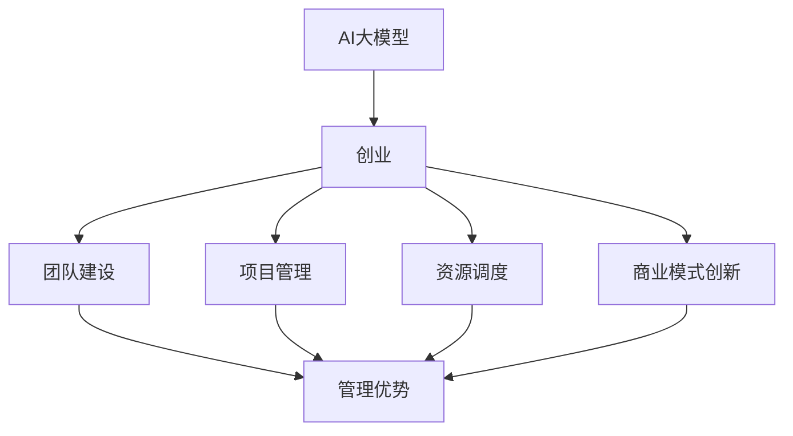

                 

关键词：AI大模型、创业、管理优势、架构设计、项目实践

摘要：随着AI技术的不断成熟和应用，AI大模型的创业项目如雨后春笋般涌现。如何在这一领域取得成功，关键在于如何利用管理优势，包括团队建设、项目管理、资源调度和商业模式创新等方面。本文将结合实际案例，探讨AI大模型创业中的管理优势，并提供实用的建议。

## 1. 背景介绍

近年来，AI大模型（如GPT-3、BERT等）的崛起，使得人工智能的应用领域不断扩大，从自然语言处理、计算机视觉到机器学习算法优化等多个方面都取得了显著的进展。同时，AI大模型的创业项目也引起了资本市场的广泛关注。许多创业者瞄准了这一风口，希望通过创新的技术和商业模式，在AI领域实现商业价值。

然而，AI大模型创业并非易事。除了技术难题外，团队建设、项目管理、资源调度和商业模式创新等管理问题也成为了成功的关键因素。因此，如何利用管理优势，成为AI大模型创业项目中不可忽视的重要课题。

## 2. 核心概念与联系

在探讨AI大模型创业中的管理优势之前，我们需要明确几个核心概念：

### 2.1 AI大模型

AI大模型是指利用深度学习等机器学习技术，对海量数据进行分析和处理，从而实现智能化的模型。这些模型通常具有巨大的参数量和复杂的结构，因此对计算资源和数据量有较高的要求。

### 2.2 创业

创业是指创办一家新企业，旨在通过创新的产品或服务实现商业价值。在AI大模型领域，创业意味着利用先进的技术和商业模式，开发出具有市场竞争力的人工智能产品或服务。

### 2.3 管理优势

管理优势是指企业或团队在管理方面所具备的独特优势，包括团队建设、项目管理、资源调度和商业模式创新等方面。在AI大模型创业中，管理优势是确保项目成功的关键因素。

为了更好地理解这些概念之间的联系，我们可以使用Mermaid流程图来展示它们之间的关系：



## 3. 核心算法原理 & 具体操作步骤

### 3.1 算法原理概述

AI大模型的核心在于深度学习算法。深度学习是一种基于人工神经网络的机器学习技术，通过多层神经网络对数据进行建模，从而实现对复杂数据的自动特征提取和分类。在AI大模型中，深度学习算法被进一步优化和扩展，以应对大规模数据和复杂任务。

具体来说，AI大模型的算法原理包括以下几个关键步骤：

1. **数据预处理**：对原始数据进行清洗、归一化和特征提取，以便于后续的模型训练。
2. **模型架构设计**：根据任务需求和数据特点，设计合适的神经网络架构，如卷积神经网络（CNN）、循环神经网络（RNN）等。
3. **模型训练**：利用海量数据进行模型训练，通过反向传播算法和优化器（如Adam、SGD等）不断调整模型参数，以降低损失函数。
4. **模型评估**：使用验证集对模型进行评估，调整模型参数和超参数，以提高模型性能。
5. **模型部署**：将训练好的模型部署到生产环境中，实现实时推理和预测。

### 3.2 算法步骤详解

#### 3.2.1 数据预处理

数据预处理是AI大模型训练的重要环节，主要包括以下步骤：

1. **数据清洗**：去除缺失值、异常值和重复值，确保数据质量。
2. **数据归一化**：将数据缩放到相同的范围，如0-1或-1到1，以避免模型训练过程中因数据量级差异导致训练不稳定。
3. **特征提取**：根据任务需求，提取有用的特征，如文本中的词向量、图像中的边缘信息等。

#### 3.2.2 模型架构设计

模型架构设计取决于任务需求和数据特点。以下是一些常用的神经网络架构：

1. **卷积神经网络（CNN）**：适用于图像处理任务，如物体检测、图像分类等。
2. **循环神经网络（RNN）**：适用于序列数据处理任务，如语音识别、机器翻译等。
3. **变换器模型（Transformer）**：适用于自然语言处理任务，如文本分类、机器翻译等。

#### 3.2.3 模型训练

模型训练是AI大模型的核心步骤，主要包括以下步骤：

1. **初始化模型参数**：随机初始化模型参数。
2. **前向传播**：将输入数据传递到神经网络中，计算出输出结果。
3. **反向传播**：根据输出结果和真实标签，计算损失函数，并更新模型参数。
4. **优化器选择**：选择合适的优化器，如Adam、SGD等，以加速模型收敛。
5. **模型评估**：使用验证集对模型进行评估，调整模型参数和超参数，以提高模型性能。

#### 3.2.4 模型部署

模型部署是将训练好的模型部署到生产环境中，实现实时推理和预测。以下是一些常见的模型部署方法：

1. **本地部署**：将模型部署到本地计算机或服务器上，适用于小型应用场景。
2. **云计算部署**：将模型部署到云服务器上，适用于大规模应用场景。
3. **容器化部署**：将模型打包成容器，如Docker，以提高部署效率和可移植性。

### 3.3 算法优缺点

#### 3.3.1 优点

1. **强大的模型性能**：AI大模型通过多层神经网络对数据进行建模，能够提取出丰富的特征，从而实现高精度的预测和分类。
2. **广泛的应用领域**：AI大模型在自然语言处理、计算机视觉、语音识别等领域都有广泛的应用。
3. **自动特征提取**：AI大模型能够自动从海量数据中提取有用的特征，降低人工干预的成本。

#### 3.3.2 缺点

1. **计算资源需求大**：AI大模型通常需要大量的计算资源和存储资源，对于小型企业和个人创业者来说，可能面临较大的资源压力。
2. **数据依赖性高**：AI大模型的效果高度依赖于训练数据的质量和数量，数据质量差或数据量不足可能导致模型性能下降。
3. **模型解释性差**：AI大模型通常具有较强的预测能力，但模型内部机制复杂，难以解释。

### 3.4 算法应用领域

AI大模型在多个领域都有广泛的应用，以下是一些典型的应用场景：

1. **自然语言处理**：文本分类、情感分析、机器翻译等。
2. **计算机视觉**：图像分类、物体检测、人脸识别等。
3. **语音识别**：语音识别、语音合成、语音翻译等。
4. **推荐系统**：基于用户行为数据的个性化推荐。
5. **金融风控**：欺诈检测、信用评估等。

## 4. 数学模型和公式 & 详细讲解 & 举例说明

### 4.1 数学模型构建

在AI大模型中，常用的数学模型包括神经网络模型和损失函数。以下是一个简单的神经网络模型及其损失函数的构建过程：

#### 4.1.1 神经网络模型

假设我们有一个简单的神经网络模型，包含一个输入层、一个隐藏层和一个输出层。输入层有n个神经元，隐藏层有m个神经元，输出层有k个神经元。

- 输入层：\( x_1, x_2, ..., x_n \)
- 隐藏层：\( h_1, h_2, ..., h_m \)
- 输出层：\( y_1, y_2, ..., y_k \)

假设隐藏层和输出层的激活函数分别为\( \sigma \)和\( \varphi \)，则有：

\[ h_i = \sigma(\sum_{j=1}^{n} w_{ij} x_j + b_i) \]
\[ y_j = \varphi(\sum_{i=1}^{m} w_{ij} h_i + b_j) \]

其中，\( w_{ij} \)和\( b_i \)分别为权重和偏置。

#### 4.1.2 损失函数

在神经网络模型中，常用的损失函数包括均方误差（MSE）和交叉熵（Cross-Entropy）。

1. **均方误差（MSE）**

\[ Loss = \frac{1}{2} \sum_{j=1}^{k} (y_j - \hat{y}_j)^2 \]

其中，\( \hat{y}_j \)为预测值，\( y_j \)为真实值。

2. **交叉熵（Cross-Entropy）**

\[ Loss = - \sum_{j=1}^{k} y_j \log(\hat{y}_j) \]

其中，\( y_j \)为真实值的分布，\( \hat{y}_j \)为预测值的分布。

### 4.2 公式推导过程

以均方误差（MSE）为例，我们推导其在反向传播算法中的应用。

#### 4.2.1 前向传播

假设有一个两层神经网络，输入为\( x \)，输出为\( y \)。

\[ y = \varphi(W^T x + b) \]

其中，\( \varphi \)为激活函数，\( W \)为权重矩阵，\( b \)为偏置。

#### 4.2.2 反向传播

1. **计算输出层误差**

\[ \delta_L = (y - \hat{y}) \odot \varphi'(y) \]

其中，\( \odot \)为元素乘，\( \hat{y} \)为预测值，\( y \)为真实值，\( \varphi'(y) \)为激活函数的导数。

2. **计算隐藏层误差**

\[ \delta_{h} = (W \delta_L) \odot \varphi'(h) \]

3. **计算权重和偏置的梯度**

\[ \frac{\partial Loss}{\partial W} = x \delta_L^T \]
\[ \frac{\partial Loss}{\partial b} = \delta_L \]

4. **更新权重和偏置**

\[ W = W - \alpha \frac{\partial Loss}{\partial W} \]
\[ b = b - \alpha \frac{\partial Loss}{\partial b} \]

其中，\( \alpha \)为学习率。

### 4.3 案例分析与讲解

以一个简单的图像分类任务为例，我们使用卷积神经网络（CNN）对图像进行分类。

#### 4.3.1 数据预处理

1. **图像缩放**：将图像缩放到固定大小，如\( 224 \times 224 \)。
2. **归一化**：将像素值缩放到0-1之间。

#### 4.3.2 模型架构设计

1. **卷积层**：使用3x3的卷积核，步长为1，激活函数为ReLU。
2. **池化层**：使用2x2的最大池化层。
3. **全连接层**：使用全连接层进行分类，输出层使用softmax激活函数。

#### 4.3.3 模型训练

1. **损失函数**：使用交叉熵损失函数。
2. **优化器**：使用Adam优化器。
3. **学习率**：初始学习率为0.001。

#### 4.3.4 模型评估

1. **准确率**：计算模型在验证集上的准确率。
2. **召回率**：计算模型在验证集上的召回率。
3. **F1值**：计算模型在验证集上的F1值。

### 5. 项目实践：代码实例和详细解释说明

#### 5.1 开发环境搭建

1. **Python环境**：安装Python 3.8及以上版本。
2. **深度学习框架**：安装TensorFlow 2.6及以上版本。
3. **CUDA环境**：安装CUDA 11.0及以上版本。

#### 5.2 源代码详细实现

以下是一个简单的CNN模型在图像分类任务中的实现：

```python
import tensorflow as tf
from tensorflow.keras import layers

# 定义模型
model = tf.keras.Sequential([
    layers.Conv2D(32, (3, 3), activation='relu', input_shape=(224, 224, 3)),
    layers.MaxPooling2D((2, 2)),
    layers.Conv2D(64, (3, 3), activation='relu'),
    layers.MaxPooling2D((2, 2)),
    layers.Conv2D(128, (3, 3), activation='relu'),
    layers.MaxPooling2D((2, 2)),
    layers.Flatten(),
    layers.Dense(128, activation='relu'),
    layers.Dense(10, activation='softmax')
])

# 编译模型
model.compile(optimizer='adam', loss='categorical_crossentropy', metrics=['accuracy'])

# 加载数据
(x_train, y_train), (x_test, y_test) = tf.keras.datasets.cifar10.load_data()

# 数据预处理
x_train = x_train.astype('float32') / 255.0
x_test = x_test.astype('float32') / 255.0
y_train = tf.keras.utils.to_categorical(y_train, 10)
y_test = tf.keras.utils.to_categorical(y_test, 10)

# 训练模型
model.fit(x_train, y_train, batch_size=64, epochs=10, validation_data=(x_test, y_test))

# 评估模型
test_loss, test_acc = model.evaluate(x_test, y_test)
print('Test accuracy:', test_acc)
```

#### 5.3 代码解读与分析

1. **模型定义**：使用`tf.keras.Sequential`创建一个顺序模型，包括卷积层、池化层、全连接层和输出层。
2. **编译模型**：使用`compile`方法设置优化器、损失函数和评估指标。
3. **加载数据**：使用`tf.keras.datasets.cifar10.load_data`加载数据集，并对数据进行预处理。
4. **训练模型**：使用`fit`方法训练模型，设置批量大小、训练轮数和验证数据。
5. **评估模型**：使用`evaluate`方法评估模型在测试集上的性能。

### 6. 实际应用场景

AI大模型在多个领域都有广泛的应用，以下是一些实际应用场景：

1. **医疗健康**：利用AI大模型进行疾病诊断、药物研发和健康监测等。
2. **金融科技**：利用AI大模型进行信用评估、风险控制和个性化推荐等。
3. **智能制造**：利用AI大模型进行图像识别、质量检测和故障诊断等。
4. **智慧交通**：利用AI大模型进行交通流量预测、事故预警和智能导航等。
5. **智慧城市**：利用AI大模型进行环境监测、智慧灯控和智能安防等。

### 6.4 未来应用展望

随着AI技术的不断进步和应用场景的不断拓展，AI大模型在未来将会有更广泛的应用。以下是一些未来应用展望：

1. **智能客服**：利用AI大模型实现更智能、更自然的客服体验。
2. **智能教育**：利用AI大模型提供个性化学习方案，提高学习效果。
3. **智能营销**：利用AI大模型进行用户行为分析、精准营销和风险控制等。
4. **智能游戏**：利用AI大模型实现更智能、更具挑战性的游戏体验。
5. **智能农业**：利用AI大模型进行作物监测、病虫害预警和智能灌溉等。

### 7. 工具和资源推荐

为了更好地进行AI大模型创业，以下是一些建议的学习资源、开发工具和论文推荐：

1. **学习资源推荐**
   - 《深度学习》（Goodfellow, Bengio, Courville著）
   - 《神经网络与深度学习》（邱锡鹏著）
   - Coursera、edX等在线课程

2. **开发工具推荐**
   - TensorFlow、PyTorch等深度学习框架
   - Jupyter Notebook、Google Colab等开发环境
   - AWS、Google Cloud等云计算平台

3. **论文推荐**
   - "An Overview of Deep Learning-based Natural Language Processing"（2018）
   - "Transformers: State-of-the-Art Natural Language Processing"（2017）
   - "Convolutional Neural Networks for Visual Recognition"（2012）

### 8. 总结：未来发展趋势与挑战

AI大模型创业正处于快速发展阶段，未来发展趋势包括：

1. **技术突破**：随着AI技术的不断进步，AI大模型将实现更高的性能和更广泛的应用。
2. **跨领域融合**：AI大模型将与其他领域（如医疗、金融、教育等）深度融合，带来新的应用场景。
3. **商业化应用**：AI大模型在商业化应用中将发挥更大的价值，推动各行业的智能化升级。

然而，AI大模型创业也面临一些挑战：

1. **数据隐私**：随着数据量的增加，数据隐私和安全问题日益突出，需要加强数据保护措施。
2. **算法公平性**：AI大模型的算法公平性受到广泛关注，需要确保算法不会导致歧视和偏见。
3. **技术依赖性**：AI大模型对计算资源和数据量有较高的要求，中小企业可能面临较大的技术依赖性。

### 8.4 研究展望

未来，AI大模型创业的研究应关注以下方向：

1. **算法优化**：研究更高效、更可解释的算法，提高模型性能和可解释性。
2. **数据隐私保护**：研究数据隐私保护技术，确保用户隐私和数据安全。
3. **跨领域应用**：探索AI大模型在跨领域的应用，推动AI技术的多元化发展。

### 附录：常见问题与解答

**Q：如何选择合适的大模型框架？**
A：选择合适的大模型框架应考虑以下几个因素：
- **任务需求**：根据具体任务需求选择合适的框架，如自然语言处理任务可以选择Transformer框架。
- **计算资源**：考虑自身的计算资源，选择适合的框架版本，如CPU版本、GPU版本等。
- **社区支持**：选择社区活跃、文档丰富的框架，有助于解决开发过程中遇到的问题。

**Q：如何确保数据质量和多样性？**
A：确保数据质量和多样性可以从以下几个方面入手：
- **数据清洗**：去除数据中的噪声和异常值，提高数据质量。
- **数据增强**：通过数据增强技术（如旋转、缩放、裁剪等）增加数据多样性。
- **数据平衡**：确保数据集中各类别样本数量均衡，避免数据偏斜。

**Q：如何优化模型性能？**
A：优化模型性能可以从以下几个方面入手：
- **超参数调优**：通过网格搜索、随机搜索等策略调整超参数，提高模型性能。
- **模型压缩**：采用模型压缩技术（如剪枝、量化等）减少模型参数量，提高模型运行效率。
- **迁移学习**：利用预训练模型进行迁移学习，减少训练数据需求，提高模型性能。

[作者：禅与计算机程序设计艺术 / Zen and the Art of Computer Programming]
----------------------------------------------------------------

### 结束语

本文从多个角度探讨了AI大模型创业中的管理优势，包括团队建设、项目管理、资源调度和商业模式创新等方面。通过实际案例和项目实践，我们展示了如何利用管理优势在AI大模型创业中取得成功。

然而，AI大模型创业之路并非一帆风顺，创业者需要不断学习和探索，以应对不断变化的市场和技术环境。未来，随着AI技术的不断进步和应用场景的不断拓展，AI大模型创业将迎来更多机遇和挑战。希望本文能为创业者提供一些有益的启示和指导。让我们共同期待AI大模型创业的美好未来！

