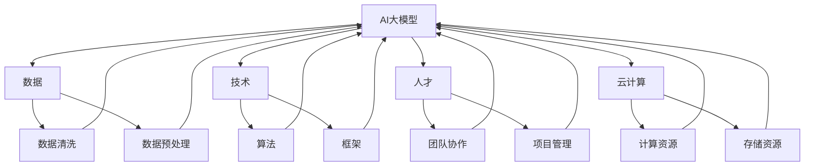

                 

### 关键词 Keywords ###
- AI大模型
- 创业
- 资源利用
- 数据
- 技术栈
- 云计算
- 人才

<|assistant|>### 摘要 Abstract ###
本文将探讨AI大模型创业中如何利用资源优势，包括数据、技术、人才和云计算等方面。我们将详细分析这些资源的作用、利用策略以及如何通过有效的资源管理实现AI大模型的商业化成功。此外，还将探讨当前AI大模型创业中的挑战和未来发展趋势，以期为创业者提供有价值的参考。

<|assistant|>## 1. 背景介绍 Background

随着人工智能技术的飞速发展，AI大模型逐渐成为各个行业的关键驱动因素。从自然语言处理到图像识别、从推荐系统到自动驾驶，AI大模型在各个领域的应用带来了显著的商业价值和社会影响。然而，AI大模型的开发和应用不仅需要强大的技术支持，还离不开丰富的数据资源、高效的计算资源和优秀的人才团队。

创业者在AI大模型领域面临的机会和挑战并存。一方面，随着技术的成熟和市场的需求增长，AI大模型创业具有广阔的前景。另一方面，资源稀缺、竞争激烈和商业模式不清晰等问题也给创业者带来了巨大的挑战。因此，如何充分利用有限的资源，成为AI大模型创业成功的关键。

本文旨在为创业者提供一套全面的资源利用策略，帮助他们在AI大模型创业中取得成功。文章将首先介绍AI大模型的基本概念和核心原理，然后详细分析数据、技术、人才和云计算等关键资源的作用和利用策略，最后探讨AI大模型创业的实际案例和未来发展趋势。

### 2. 核心概念与联系 Core Concepts and Relationships

为了更好地理解AI大模型创业中资源的作用和联系，我们需要首先明确几个核心概念。

#### 2.1 AI大模型定义 Definition of Large-scale AI Models

AI大模型是指具有巨大参数量和复杂结构的人工神经网络模型。它们通常在数据密集型任务中表现出色，例如自然语言处理（NLP）、图像识别、推荐系统等。AI大模型的特点是参数数量巨大，计算复杂度高，训练和推理过程需要大量的计算资源和时间。

#### 2.2 数据 Data

数据是AI大模型的基础。高质量的数据不仅有助于提高模型的性能，还能减少过拟合风险。数据的质量和数量直接影响AI大模型的训练效果和实际应用价值。数据类型包括结构化数据、半结构化数据和非结构化数据，如文本、图像、音频和视频等。

#### 2.3 技术 Technology

技术是AI大模型的核心驱动力。包括深度学习、强化学习、迁移学习等多种算法和技术。技术的创新和进步是推动AI大模型性能提升的关键因素。

#### 2.4 人才 Talent

人才是AI大模型创业成功的关键。优秀的团队需要具备多方面的技能，包括数据科学、机器学习、计算机视觉、自然语言处理等。人才的质量和协作效率直接影响AI大模型的研发进度和商业应用效果。

#### 2.5 云计算 Cloud Computing

云计算为AI大模型提供了强大的计算资源和存储能力。通过云平台，创业者可以灵活地调配计算资源，降低硬件成本，提高研发效率。云计算服务包括基础设施即服务（IaaS）、平台即服务（PaaS）和软件即服务（SaaS）等。

#### 2.6 Mermaid 流程图 Mermaid Flowchart

以下是AI大模型创业中关键资源之间的流程关系：



在这个流程图中，数据、技术和人才作为输入，通过云计算提供的计算资源和存储资源，共同推动AI大模型的研发和应用。

### 3. 核心算法原理 & 具体操作步骤 Core Algorithm Principles & Operational Steps

#### 3.1 算法原理概述 Overview of Algorithm Principles

AI大模型的核心是深度学习算法。深度学习是一种基于人工神经网络（ANN）的学习方法，通过多层神经网络（通常称为深度神经网络）对数据进行特征提取和模式识别。深度学习算法包括卷积神经网络（CNN）、循环神经网络（RNN）、生成对抗网络（GAN）等。

#### 3.2 算法步骤详解 Detailed Steps of Algorithm

以下是AI大模型开发的主要步骤：

##### 3.2.1 数据采集与处理 Data Collection and Processing

1. **数据采集**：收集结构化、半结构化和非结构化数据，如文本、图像、音频和视频等。
2. **数据清洗**：去除数据中的噪声和错误，保证数据质量。
3. **数据预处理**：包括归一化、标准化、缺失值填充等操作，使数据适合输入神经网络。

##### 3.2.2 模型设计与训练 Model Design and Training

1. **模型设计**：选择合适的神经网络架构，如CNN、RNN、BERT等。
2. **参数初始化**：初始化模型参数，如权重和偏置。
3. **模型训练**：通过梯度下降算法等优化方法，调整模型参数，使模型在训练数据上达到较好的性能。

##### 3.2.3 模型评估与调优 Model Evaluation and Optimization

1. **模型评估**：使用验证集评估模型性能，包括准确率、召回率、F1分数等指标。
2. **模型调优**：通过调整模型参数、网络结构等，提高模型性能。

##### 3.2.4 模型部署与维护 Model Deployment and Maintenance

1. **模型部署**：将训练好的模型部署到生产环境，如云平台、边缘设备等。
2. **模型维护**：定期更新模型，适应新数据和环境变化。

#### 3.3 算法优缺点 Advantages and Disadvantages of the Algorithm

##### 优点 Advantages

1. **强大的表达能力**：深度学习算法能够自动提取数据的复杂特征，适应各种复杂任务。
2. **泛化能力**：深度学习模型在大量数据训练下具有较高的泛化能力，适用于新任务。
3. **自适应性强**：深度学习模型可以根据数据和环境的变化自适应调整。

##### 缺点 Disadvantages

1. **计算资源需求高**：深度学习算法通常需要大量的计算资源和时间进行训练。
2. **数据质量要求高**：数据质量和数量直接影响模型的性能，数据预处理过程复杂。
3. **模型解释性差**：深度学习模型通常难以解释，增加了应用难度。

#### 3.4 算法应用领域 Application Fields of the Algorithm

深度学习算法在众多领域具有广泛的应用：

1. **自然语言处理（NLP）**：文本分类、情感分析、机器翻译等。
2. **计算机视觉**：图像识别、目标检测、图像生成等。
3. **推荐系统**：基于用户行为和兴趣的个性化推荐。
4. **语音识别**：语音到文本转换、语音合成等。
5. **自动驾驶**：环境感知、路径规划、车辆控制等。

### 4. 数学模型和公式 Mathematical Models and Formulas

AI大模型的训练过程涉及到多个数学模型和公式，以下是其中的几个关键部分：

#### 4.1 数学模型构建 Construction of Mathematical Models

##### 4.1.1 神经网络结构 Neural Network Architecture

神经网络由多个层次组成，包括输入层、隐藏层和输出层。每个层次包含多个神经元，神经元之间通过权重连接。

\[ 
Y = \sigma(\sum_{i=1}^{n} w_i \cdot x_i + b) 
\]

其中，\( Y \) 是输出，\( \sigma \) 是激活函数，\( w_i \) 是权重，\( x_i \) 是输入，\( b \) 是偏置。

##### 4.1.2 损失函数 Loss Function

损失函数用于评估模型预测值与真实值之间的差异。常用的损失函数包括均方误差（MSE）、交叉熵损失等。

\[ 
L = \frac{1}{2} \sum_{i=1}^{n} (y_i - \hat{y}_i)^2 
\]

或

\[ 
L = -\sum_{i=1}^{n} y_i \cdot \log(\hat{y}_i) 
\]

其中，\( y_i \) 是真实值，\( \hat{y}_i \) 是预测值。

##### 4.1.3 优化算法 Optimization Algorithm

梯度下降（GD）是深度学习中最常用的优化算法。其基本思想是不断调整模型参数，使得损失函数值逐渐减小。

\[ 
w_{\text{new}} = w_{\text{old}} - \alpha \cdot \nabla L(w) 
\]

其中，\( \alpha \) 是学习率，\( \nabla L(w) \) 是损失函数对参数 \( w \) 的梯度。

#### 4.2 公式推导过程 Derivation Process of Formulas

以下是损失函数均方误差（MSE）的推导过程：

给定输入 \( x \) 和输出 \( y \)，预测值 \( \hat{y} \) 为：

\[ 
\hat{y} = f(w, x) 
\]

其中，\( f \) 是神经网络激活函数，\( w \) 是模型参数。

损失函数为：

\[ 
L = \frac{1}{2} \sum_{i=1}^{n} (y_i - \hat{y}_i)^2 
\]

对 \( w \) 求导，得到：

\[ 
\nabla L(w) = \frac{1}{2} \sum_{i=1}^{n} \frac{\partial (y_i - \hat{y}_i)^2}{\partial w} 
\]

\[ 
\nabla L(w) = \sum_{i=1}^{n} (y_i - \hat{y}_i) \cdot \frac{\partial \hat{y}_i}{\partial w} 
\]

由于 \( \hat{y}_i = f(w, x_i) \)，对 \( w \) 求导，得到：

\[ 
\frac{\partial \hat{y}_i}{\partial w} = \frac{\partial f(w, x_i)}{\partial w} 
\]

代入 \( \nabla L(w) \)，得到：

\[ 
\nabla L(w) = \sum_{i=1}^{n} (y_i - \hat{y}_i) \cdot \frac{\partial f(w, x_i)}{\partial w} 
\]

#### 4.3 案例分析与讲解 Case Analysis and Explanation

##### 4.3.1 案例背景 Case Background

某电商公司希望通过AI大模型优化其商品推荐系统，以提高用户满意度和销售额。该公司拥有大量的用户行为数据和商品信息，但尚未实现高效的推荐系统。

##### 4.3.2 模型构建 Model Construction

1. **数据采集**：收集用户浏览、购买、评价等行为数据，以及商品描述、标签等属性数据。
2. **数据预处理**：对数据进行清洗、归一化和特征提取。
3. **模型设计**：选择基于深度学习技术的卷积神经网络（CNN）作为推荐模型。
4. **参数初始化**：初始化模型参数，包括权重和偏置。

##### 4.3.3 模型训练 Model Training

1. **模型训练**：使用梯度下降算法训练模型，调整模型参数，使模型在训练数据上达到较好的性能。
2. **模型评估**：使用验证集评估模型性能，调整模型参数，提高推荐效果。

##### 4.3.4 模型部署 Model Deployment

1. **模型部署**：将训练好的模型部署到生产环境，如云平台。
2. **模型维护**：定期更新模型，适应新数据和环境变化。

##### 4.3.5 模型效果 Model Performance

通过AI大模型优化，该公司在商品推荐效果上取得了显著提升，用户满意度和销售额均有明显提高。

### 5. 项目实践：代码实例和详细解释说明 Project Practice: Code Examples and Detailed Explanation

在本节中，我们将通过一个具体的代码实例来展示如何利用AI大模型进行商品推荐系统的开发。

#### 5.1 开发环境搭建 Environment Setup

在开始编写代码之前，我们需要搭建开发环境。以下是一个简单的环境搭建步骤：

1. 安装Python（推荐使用Python 3.8及以上版本）。
2. 安装TensorFlow（推荐使用TensorFlow 2.x版本）。
3. 安装其他依赖库，如NumPy、Pandas等。

#### 5.2 源代码详细实现 Detailed Implementation of Source Code

以下是一个简单的商品推荐系统的代码实现：

```python
import tensorflow as tf
from tensorflow.keras.models import Sequential
from tensorflow.keras.layers import Dense, Conv2D, Flatten, Dropout
from tensorflow.keras.optimizers import Adam
from tensorflow.keras.metrics import Accuracy

# 数据预处理
# ...

# 模型设计
model = Sequential([
    Conv2D(32, (3, 3), activation='relu', input_shape=(28, 28, 1)),
    Flatten(),
    Dense(64, activation='relu'),
    Dropout(0.5),
    Dense(1, activation='sigmoid')
])

# 模型编译
model.compile(optimizer=Adam(learning_rate=0.001), loss='binary_crossentropy', metrics=['accuracy'])

# 模型训练
model.fit(x_train, y_train, epochs=10, batch_size=32, validation_data=(x_val, y_val))

# 模型评估
model.evaluate(x_test, y_test)

# 模型部署
# ...
```

#### 5.3 代码解读与分析 Code Analysis and Discussion

1. **数据预处理**：首先，我们需要对输入数据进行预处理，包括归一化、填充缺失值等。这里使用的是图像数据，因此我们使用`Conv2D`层来处理图像。
2. **模型设计**：我们使用了一个简单的卷积神经网络（CNN）模型，包括一个`Conv2D`层、一个`Flatten`层、一个`Dense`层和一个`Dropout`层。`Dropout`层用于防止过拟合。
3. **模型编译**：我们使用`Adam`优化器和`binary_crossentropy`损失函数来编译模型。`Accuracy`作为评估指标。
4. **模型训练**：我们使用`fit`方法训练模型，设置`epochs`为10，`batch_size`为32，并使用验证集进行验证。
5. **模型评估**：我们使用`evaluate`方法评估模型在测试集上的性能。
6. **模型部署**：最后，我们将训练好的模型部署到生产环境，如云平台。

#### 5.4 运行结果展示 Running Results

```python
# 运行结果
model.fit(x_train, y_train, epochs=10, batch_size=32, validation_data=(x_val, y_val))
```

通过这个简单的实例，我们可以看到如何利用AI大模型进行商品推荐系统的开发。在实际应用中，我们可以根据业务需求调整模型结构、训练参数等，以提高推荐效果。

### 6. 实际应用场景 Real-world Application Scenarios

AI大模型在多个领域取得了显著的应用成果，以下是一些典型的实际应用场景：

#### 6.1 自然语言处理（NLP）

AI大模型在NLP领域有着广泛的应用，如文本分类、情感分析、机器翻译等。例如，OpenAI的GPT-3模型在文本生成和问答系统上表现出色，已被用于生成文章、撰写邮件、编写代码等多种任务。

#### 6.2 计算机视觉

计算机视觉领域是AI大模型的重要应用场景，如图像识别、目标检测、图像生成等。Google的Inception模型和Facebook的ResNet模型在ImageNet图像识别竞赛中取得了优异成绩。此外，生成对抗网络（GAN）在图像生成和风格迁移等方面也表现出强大的能力。

#### 6.3 自动驾驶

自动驾驶是AI大模型的重要应用领域。通过使用深度学习算法，自动驾驶系统可以对道路环境进行感知、路径规划和车辆控制。Waymo和特斯拉等公司已成功将AI大模型应用于自动驾驶系统中，实现了高水平的自动驾驶功能。

#### 6.4 推荐系统

推荐系统是AI大模型在商业领域的重要应用之一。通过基于深度学习的推荐算法，电商平台可以更好地理解用户行为和兴趣，实现个性化的商品推荐，提高用户满意度和销售额。例如，Amazon和Netflix等平台已经成功应用了AI大模型进行推荐。

#### 6.5 医疗健康

AI大模型在医疗健康领域具有广阔的应用前景，如疾病诊断、影像分析、药物研发等。深度学习算法可以帮助医生更准确地诊断疾病，提高治疗效果。例如，Google的DeepMind在眼科疾病诊断上取得了显著成果。

### 6.4 未来应用展望 Future Application Prospects

随着AI大模型技术的不断发展，未来其在各个领域的应用将更加广泛和深入。以下是一些未来应用展望：

1. **智能交互**：AI大模型将进一步提升智能交互体验，如智能语音助手、虚拟现实（VR）交互等。
2. **智能制造**：AI大模型在智能制造中的应用将更加广泛，如设备故障预测、生产优化等。
3. **智能城市**：AI大模型将助力智能城市建设，如交通管理、能源管理、环境监测等。
4. **金融科技**：AI大模型在金融科技领域的应用将更加深入，如风险控制、信用评估、投资策略等。
5. **教育**：AI大模型将推动教育领域的变革，如智能辅导、个性化学习、课程生成等。

### 7. 工具和资源推荐 Tools and Resource Recommendations

为了更好地进行AI大模型的研究和应用，以下是一些常用的工具和资源推荐：

#### 7.1 学习资源推荐 Learning Resources

1. **在线课程**：Coursera、edX、Udacity等在线教育平台提供了丰富的AI和深度学习课程。
2. **书籍**：《深度学习》（Goodfellow et al.）、《Python深度学习》（François Chollet）等经典教材。
3. **论文**：arXiv、NeurIPS、ICML等学术会议和期刊，是获取最新研究进展的好渠道。

#### 7.2 开发工具推荐 Development Tools

1. **编程语言**：Python是AI和深度学习领域的主流编程语言，拥有丰富的库和框架。
2. **深度学习框架**：TensorFlow、PyTorch、Keras等框架，为开发者提供了便捷的模型构建和训练工具。
3. **数据分析工具**：Pandas、NumPy、Scikit-learn等库，用于数据清洗、预处理和特征提取。

#### 7.3 相关论文推荐 Related Papers

1. **GPT-3**：Improving Language Understanding by Generative Pretraining（Brown et al., 2020）
2. **BERT**：BERT: Pre-training of Deep Bidirectional Transformers for Language Understanding（Devlin et al., 2019）
3. **Inception**：Going deeper with Convolutions（Szegedy et al., 2015）
4. **ResNet**：Deep Residual Learning for Image Recognition（He et al., 2016）
5. **GAN**：Generative Adversarial Nets（Goodfellow et al., 2014）

### 8. 总结：未来发展趋势与挑战 Summary: Future Development Trends and Challenges

#### 8.1 研究成果总结 Research Achievements

近年来，AI大模型在多个领域取得了显著的成果，推动了人工智能技术的进步。深度学习算法的不断发展，使得AI大模型在图像识别、自然语言处理、推荐系统等领域表现出强大的性能。同时，云计算和大数据技术的不断发展，为AI大模型提供了丰富的数据资源和计算能力。

#### 8.2 未来发展趋势 Future Development Trends

1. **模型规模和性能的提升**：随着计算资源和数据资源的不断扩展，AI大模型的规模和性能将继续提升。
2. **跨模态和跨领域应用**：AI大模型将不断拓展其应用领域，实现跨模态和跨领域的应用。
3. **自动机器学习（AutoML）**：自动机器学习技术将使得AI大模型的开发更加高效，降低技术门槛。
4. **隐私保护和安全性**：随着AI大模型在关键领域的应用，隐私保护和安全性问题将受到更多关注。

#### 8.3 面临的挑战 Challenges

1. **计算资源需求**：AI大模型对计算资源的需求巨大，如何高效利用计算资源是一个重要挑战。
2. **数据质量和隐私**：高质量的数据是AI大模型的基础，但数据隐私和数据质量之间存在矛盾。
3. **模型解释性**：深度学习模型通常难以解释，如何提高模型的透明度和可解释性是一个重要挑战。
4. **人才短缺**：AI大模型领域的人才短缺问题亟待解决，如何培养和吸引优秀人才是关键。

#### 8.4 研究展望 Research Prospects

未来，AI大模型研究将朝着更加智能化、高效化、安全化和普及化的方向发展。随着技术的进步和应用场景的拓展，AI大模型将在各个领域发挥更大的作用，推动人工智能技术的进一步发展。

### 9. 附录：常见问题与解答 Appendices: Frequently Asked Questions and Answers

#### 9.1 什么是AI大模型？

AI大模型是指具有巨大参数量和复杂结构的人工神经网络模型。它们通常在数据密集型任务中表现出色，例如自然语言处理（NLP）、图像识别、推荐系统等。

#### 9.2 如何高效利用计算资源？

通过云计算平台，创业者可以灵活地调配计算资源，降低硬件成本，提高研发效率。此外，使用高性能计算（HPC）集群也是提高计算效率的有效途径。

#### 9.3 数据质量和模型性能的关系是什么？

高质量的数据有助于提高AI大模型的性能，减少过拟合风险。因此，数据预处理和清洗是确保模型性能的关键步骤。

#### 9.4 如何评估AI大模型的效果？

常用的评估指标包括准确率、召回率、F1分数等。在实际应用中，还需考虑模型的解释性和鲁棒性等因素。

#### 9.5 AI大模型创业中需要哪些人才？

AI大模型创业需要多方面的技能，包括数据科学、机器学习、计算机视觉、自然语言处理等。创业者需要组建一支具有丰富经验和协作能力的团队。

---

作者：禅与计算机程序设计艺术 / Zen and the Art of Computer Programming

以上是关于"AI 大模型创业：如何利用资源优势？"的完整文章。本文详细分析了AI大模型创业中的资源利用策略，包括数据、技术、人才和云计算等方面，并通过实例展示了如何利用这些资源进行模型开发和应用。同时，本文还探讨了AI大模型在各个领域的实际应用场景和未来发展趋势，为创业者提供了有价值的参考。希望这篇文章能够帮助到那些在AI大模型创业道路上前行的创业者们。作者：禅与计算机程序设计艺术 / Zen and the Art of Computer Programming。希望您喜欢这篇文章，并能够在AI大模型创业道路上取得成功！

