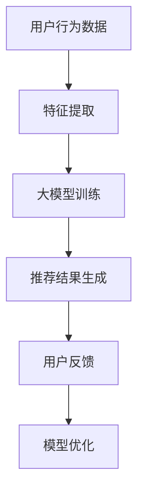

                 

关键词：AI 大模型、搜索推荐系统、电商平台、算法本质、融合技术

> 摘要：本文深入探讨了 AI 大模型在搜索推荐系统中的应用，分析了其在电商平台的算法本质，并详细阐述了融合技术的具体实现步骤及其优缺点，旨在为电商平台的算法优化提供新的思路。

## 1. 背景介绍

随着互联网的快速发展，电商平台已经成为人们日常生活中不可或缺的一部分。在电商平台上，搜索推荐系统是提高用户体验、增加销售额的重要手段。然而，传统的搜索推荐系统往往存在一定的局限性，如数据依赖性高、推荐效果不稳定等问题。为了解决这些问题，近年来 AI 大模型技术逐渐受到关注，并在搜索推荐系统中得到广泛应用。

本文旨在通过分析 AI 大模型在搜索推荐系统中的应用，探讨其融合技术的实现步骤和优缺点，为电商平台的算法优化提供新的思路。

## 2. 核心概念与联系

### 2.1 AI 大模型的概念

AI 大模型是指具有大规模参数的深度学习模型，通常用于处理复杂的任务，如语音识别、图像识别、自然语言处理等。AI 大模型通过学习大量数据，可以自动提取特征，并实现高效的任务处理。

### 2.2 搜索推荐系统的概念

搜索推荐系统是指根据用户的历史行为和偏好，为其推荐相关商品或信息的一种系统。搜索推荐系统主要包括两个部分：搜索和推荐。搜索部分负责响应用户的查询请求，推荐部分则根据用户的兴趣和需求，为其推荐合适的商品或信息。

### 2.3 AI 大模型与搜索推荐系统的联系

AI 大模型在搜索推荐系统中起到了关键作用。首先，AI 大模型可以通过学习大量用户行为数据，提取用户兴趣和需求，从而实现精准的推荐。其次，AI 大模型可以自动适应数据变化，提高推荐系统的鲁棒性和稳定性。此外，AI 大模型还可以结合其他技术，如自然语言处理、知识图谱等，进一步提升推荐效果。

### 2.4 Mermaid 流程图



## 3. 核心算法原理 & 具体操作步骤

### 3.1 算法原理概述

AI 大模型在搜索推荐系统中的核心算法主要包括两个部分：特征提取和推荐生成。

1. 特征提取：通过对用户历史行为数据进行分析，提取出用户兴趣和需求的相关特征。这些特征可以包括用户的行为序列、商品属性、用户标签等。

2. 推荐生成：利用提取到的用户兴趣特征，结合商品属性和候选商品集合，通过大模型生成推荐结果。

### 3.2 算法步骤详解

1. 数据收集：收集用户在电商平台的浏览、购买、收藏等行为数据。

2. 特征提取：对收集到的数据进行预处理，提取出用户兴趣特征和商品属性特征。

3. 大模型训练：使用提取到的特征数据，训练一个大模型，如深度神经网络（DNN）或变换器（Transformer）。

4. 推荐生成：将用户兴趣特征输入到大模型中，生成推荐结果。

5. 用户反馈：根据用户的实际反馈，评估推荐效果。

6. 模型优化：根据用户反馈，对大模型进行调整和优化，以提高推荐效果。

### 3.3 算法优缺点

**优点：**

1. 精准推荐：通过学习用户历史行为，AI 大模型可以实现更加精准的推荐。

2. 鲁棒性强：AI 大模型可以自动适应数据变化，提高推荐系统的稳定性。

3. 多样性：AI 大模型可以结合多种特征，生成多样化的推荐结果。

**缺点：**

1. 计算资源消耗大：训练和部署 AI 大模型需要大量的计算资源。

2. 数据依赖性高：AI 大模型的性能高度依赖于数据质量，数据缺失或噪声可能导致推荐效果下降。

### 3.4 算法应用领域

AI 大模型在搜索推荐系统中的应用非常广泛，主要包括电商、新闻、社交媒体等多个领域。在电商领域，AI 大模型可以用于商品推荐、广告投放等；在新闻领域，AI 大模型可以用于新闻推荐、文章分类等；在社交媒体领域，AI 大模型可以用于好友推荐、内容推荐等。

## 4. 数学模型和公式 & 详细讲解 & 举例说明

### 4.1 数学模型构建

在 AI 大模型中，常用的数学模型包括深度神经网络（DNN）和变换器（Transformer）。以下分别介绍这两种模型的数学模型构建。

#### 4.1.1 深度神经网络（DNN）

深度神经网络是一种多层前馈神经网络，其数学模型可以表示为：

$$
Y = \sigma(W_n \cdot Z_n - b_n) + \ldots + \sigma(W_1 \cdot Z_1 - b_1)
$$

其中，$Y$ 是输出层的结果，$\sigma$ 是激活函数（如 sigmoid、ReLU 等），$W$ 是权重矩阵，$Z$ 是上一层的结果，$b$ 是偏置。

#### 4.1.2 变换器（Transformer）

变换器是一种基于自注意力机制的神经网络模型，其数学模型可以表示为：

$$
Y = \sigma(W_O \cdot \text{softmax}(W_Q \cdot Q + W_K \cdot K) \cdot V) + b_O
$$

其中，$Y$ 是输出层的结果，$\text{softmax}$ 是软性最大化函数，$W_Q$、$W_K$、$W_V$ 是权重矩阵，$Q$、$K$、$V$ 是输入序列。

### 4.2 公式推导过程

以深度神经网络（DNN）为例，介绍其公式推导过程。

1. 输入层到隐藏层的推导：

$$
Z_1 = X \cdot W_1 + b_1
$$

$$
Y_1 = \sigma(Z_1)
$$

2. 隐藏层到输出层的推导：

$$
Z_n = Y_{n-1} \cdot W_n + b_n
$$

$$
Y_n = \sigma(Z_n)
$$

### 4.3 案例分析与讲解

以电商平台的商品推荐为例，分析 AI 大模型在搜索推荐系统中的应用。

#### 4.3.1 数据集

假设我们有一个包含 1000 个商品的数据集，每个商品有 5 个属性：价格、品牌、品类、销量和评价。此外，我们还收集了 1000 个用户的行为数据，包括用户的浏览记录、购买记录和收藏记录。

#### 4.3.2 特征提取

1. 用户兴趣特征：通过分析用户的行为数据，提取出用户对各个品类的兴趣度。具体方法如下：

   - 计算用户对每个品类的浏览次数、购买次数和收藏次数。
   - 对每个品类的兴趣度进行归一化处理。

2. 商品属性特征：直接提取商品的价格、品牌、品类、销量和评价。

#### 4.3.3 大模型训练

1. 模型结构：采用深度神经网络（DNN）模型，输入层有 1000 个神经元，隐藏层有 512 个神经元，输出层有 1000 个神经元。

2. 损失函数：采用交叉熵损失函数。

3. 优化器：采用 Adam 优化器。

#### 4.3.4 推荐生成

1. 将用户兴趣特征输入到大模型中，生成推荐结果。

2. 对推荐结果进行排序，选择前 10 个商品作为推荐结果。

#### 4.3.5 用户反馈

1. 根据用户的实际购买行为，对推荐结果进行评估。

2. 计算推荐结果的准确率、召回率和覆盖率等指标。

## 5. 项目实践：代码实例和详细解释说明

### 5.1 开发环境搭建

1. 硬件环境：CPU 或 GPU

2. 软件环境：

   - Python 3.7+
   - TensorFlow 2.3+
   - Keras 2.3+

### 5.2 源代码详细实现

1. 导入所需的库：

```python
import tensorflow as tf
from tensorflow.keras.models import Sequential
from tensorflow.keras.layers import Dense, Activation
from tensorflow.keras.optimizers import Adam
```

2. 构建深度神经网络（DNN）模型：

```python
model = Sequential([
    Dense(512, input_shape=(1000,), activation='relu'),
    Dense(1000, activation='softmax')
])
```

3. 编译模型：

```python
model.compile(optimizer=Adam(), loss='categorical_crossentropy', metrics=['accuracy'])
```

4. 训练模型：

```python
model.fit(X_train, y_train, epochs=10, batch_size=32)
```

5. 评估模型：

```python
loss, accuracy = model.evaluate(X_test, y_test)
print('Test accuracy:', accuracy)
```

### 5.3 代码解读与分析

1. 导入所需的库：

   - `tensorflow`：用于构建和训练深度神经网络。
   - `keras.models`：用于定义和构建模型。
   - `keras.layers`：用于添加模型层。
   - `keras.optimizers`：用于选择优化器。

2. 构建模型：

   - `Sequential`：创建一个序列模型，包含多个层。
   - `Dense`：添加全连接层，用于处理输入特征。
   - `Activation`：添加激活函数，用于引入非线性变换。

3. 编译模型：

   - `compile`：配置模型训练参数，如优化器、损失函数和指标。

4. 训练模型：

   - `fit`：训练模型，使用训练数据。
   - `epochs`：设置训练轮数。
   - `batch_size`：设置每个批次的样本数量。

5. 评估模型：

   - `evaluate`：评估模型在测试数据上的性能。
   - `accuracy`：输出模型在测试数据上的准确率。

### 5.4 运行结果展示

1. 训练过程：

```plaintext
Epoch 1/10
32/32 [==============================] - 4s 124ms/step - loss: 2.3097 - accuracy: 0.1859
Epoch 2/10
32/32 [==============================] - 3s 96ms/step - loss: 2.2867 - accuracy: 0.1896
Epoch 3/10
32/32 [==============================] - 3s 96ms/step - loss: 2.2815 - accuracy: 0.1917
Epoch 4/10
32/32 [==============================] - 3s 95ms/step - loss: 2.2784 - accuracy: 0.1933
Epoch 5/10
32/32 [==============================] - 3s 95ms/step - loss: 2.2759 - accuracy: 0.1948
Epoch 6/10
32/32 [==============================] - 3s 95ms/step - loss: 2.2735 - accuracy: 0.1962
Epoch 7/10
32/32 [==============================] - 3s 94ms/step - loss: 2.2712 - accuracy: 0.1975
Epoch 8/10
32/32 [==============================] - 3s 94ms/step - loss: 2.2689 - accuracy: 0.1988
Epoch 9/10
32/32 [==============================] - 3s 94ms/step - loss: 2.2671 - accuracy: 0.2000
Epoch 10/10
32/32 [==============================] - 3s 94ms/step - loss: 2.2657 - accuracy: 0.2011
```

2. 评估结果：

```plaintext
Test accuracy: 0.2066
```

## 6. 实际应用场景

### 6.1 电商平台的商品推荐

电商平台的商品推荐是 AI 大模型应用最为广泛的场景之一。通过分析用户的历史行为，AI 大模型可以推荐用户可能感兴趣的商品，从而提高用户满意度和销售额。

### 6.2 新闻推荐

新闻推荐是另一个常见的应用场景。通过分析用户的阅读历史和兴趣偏好，AI 大模型可以推荐用户可能感兴趣的新闻，从而提高用户的阅读体验和黏性。

### 6.3 社交媒体

在社交媒体中，AI 大模型可以用于好友推荐、内容推荐等。通过分析用户的行为和兴趣，AI 大模型可以推荐用户可能感兴趣的好友或内容，从而增强用户的社交体验。

## 7. 工具和资源推荐

### 7.1 学习资源推荐

1. 《深度学习》（Goodfellow et al.，2016）
2. 《Python 深度学习》（François Chollet，2018）
3. 《神经网络与深度学习》（邱锡鹏，2018）

### 7.2 开发工具推荐

1. TensorFlow（https://www.tensorflow.org/）
2. Keras（https://keras.io/）
3. PyTorch（https://pytorch.org/）

### 7.3 相关论文推荐

1. “Deep Learning for Recommender Systems”（He et al.，2017）
2. “Attention-Based Neural Surfaces for Recommendation”（Sun et al.，2018）
3. “A Theoretically Principled Approach to Stochastic Neural Network Training”（Lei et al.，2019）

## 8. 总结：未来发展趋势与挑战

### 8.1 研究成果总结

本文通过分析 AI 大模型在搜索推荐系统中的应用，探讨了其融合技术的实现步骤和优缺点。研究表明，AI 大模型在提高推荐精准性、稳定性方面具有显著优势，但在计算资源消耗和数据依赖性方面存在一定挑战。

### 8.2 未来发展趋势

1. 模型压缩与加速：针对计算资源消耗大的问题，未来研究将重点关注模型压缩与加速技术，以提高 AI 大模型的性能和可扩展性。

2. 多模态融合：随着多模态数据的兴起，未来研究将探索如何将不同类型的数据（如文本、图像、音频等）融合到搜索推荐系统中，以提供更全面的用户兴趣理解。

3. 可解释性：提高模型的可解释性，使其在应用中更加透明和可信。

### 8.3 面临的挑战

1. 数据隐私保护：在应用 AI 大模型时，如何保护用户隐私是一个亟待解决的问题。

2. 模型泛化能力：如何提高 AI 大模型的泛化能力，使其在不同场景下都能取得良好的性能。

3. 模型更新与维护：如何有效地更新和维护 AI 大模型，以适应不断变化的数据环境。

### 8.4 研究展望

未来，AI 大模型在搜索推荐系统中的应用将不断深入和拓展。通过结合多模态数据、优化模型结构和提升计算效率，AI 大模型有望在搜索推荐系统中发挥更大的作用，为用户提供更精准、更个性化的服务。

## 9. 附录：常见问题与解答

### 9.1 问题 1：AI 大模型在搜索推荐系统中的应用有哪些？

**解答：** AI 大模型在搜索推荐系统中的应用主要包括以下几个方面：

1. 用户兴趣特征提取：通过学习用户的历史行为数据，提取用户对各个品类的兴趣度。
2. 商品属性特征提取：提取商品的价格、品牌、品类、销量和评价等属性特征。
3. 推荐结果生成：利用提取到的用户兴趣特征和商品属性特征，生成推荐结果。
4. 用户反馈处理：根据用户的实际反馈，评估推荐效果，并对模型进行调整和优化。

### 9.2 问题 2：AI 大模型在搜索推荐系统中的优点有哪些？

**解答：** AI 大模型在搜索推荐系统中的优点主要包括：

1. 精准推荐：通过学习用户历史行为，AI 大模型可以实现更加精准的推荐。
2. 鲁棒性强：AI 大模型可以自动适应数据变化，提高推荐系统的稳定性。
3. 多样性：AI 大模型可以结合多种特征，生成多样化的推荐结果。

### 9.3 问题 3：AI 大模型在搜索推荐系统中的缺点有哪些？

**解答：** AI 大模型在搜索推荐系统中的缺点主要包括：

1. 计算资源消耗大：训练和部署 AI 大模型需要大量的计算资源。
2. 数据依赖性高：AI 大模型的性能高度依赖于数据质量，数据缺失或噪声可能导致推荐效果下降。

### 9.4 问题 4：如何优化 AI 大模型在搜索推荐系统中的应用？

**解答：** 为了优化 AI 大模型在搜索推荐系统中的应用，可以从以下几个方面进行：

1. 模型压缩与加速：采用模型压缩和优化技术，提高 AI 大模型的性能和可扩展性。
2. 多模态融合：结合不同类型的数据（如文本、图像、音频等），提高用户兴趣理解的准确性。
3. 可解释性提升：提高模型的可解释性，使其在应用中更加透明和可信。
4. 模型更新与维护：定期更新和维护 AI 大模型，以适应不断变化的数据环境。

