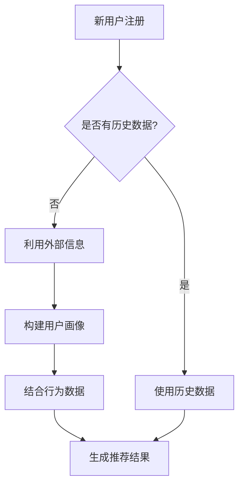
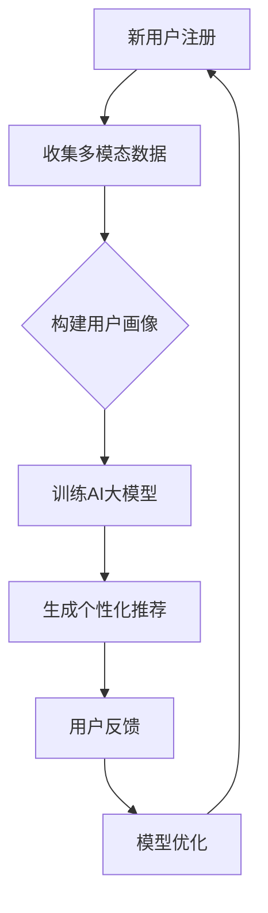

                 

关键词：电商搜索推荐、冷启动策略、AI大模型、数据不足、新用户

> 摘要：本文深入探讨了电商搜索推荐系统中面对新用户和数据不足时的冷启动问题。通过对当前解决方案的分析，本文提出了一种基于AI大模型的冷启动策略，并详细阐述了其原理、实现步骤、优缺点和应用领域。

## 1. 背景介绍

随着互联网技术的快速发展，电子商务已经成为全球范围内的一种重要商业模式。电商平台的搜索推荐系统作为提升用户体验、增加销售额的关键组成部分，越来越受到关注。然而，在实际应用中，搜索推荐系统面临的一个重大挑战就是如何应对新用户和数据不足的问题，即冷启动（Cold Start）问题。

冷启动问题主要表现在两个方面：第一，新用户没有历史行为数据，系统无法准确了解其兴趣和偏好；第二，当用户数据量不足时，传统推荐算法的效果会显著下降，无法提供高质量的推荐结果。为解决这些问题，研究者们提出了多种解决方案，但各自存在一定的局限。

本文旨在探讨一种基于AI大模型的冷启动策略，充分利用用户在社交媒体、搜索引擎等平台上的公开信息，结合用户行为数据，为新用户提供高质量的推荐服务。

## 2. 核心概念与联系

### 2.1 AI大模型

AI大模型（Large-scale AI Model）是指参数规模巨大的神经网络模型，具有强大的表达能力和学习能力。在电商搜索推荐系统中，AI大模型可以处理大量复杂数据，挖掘用户兴趣和行为模式，从而提高推荐效果。

### 2.2 冷启动策略

冷启动策略是指在新用户加入系统时，利用用户画像、社交关系等外部信息，结合用户行为数据，快速构建用户的兴趣模型，为新用户提供个性化推荐。

### 2.3 Mermaid流程图



## 3. 核心算法原理 & 具体操作步骤

### 3.1 算法原理概述

本文提出的冷启动策略基于深度学习技术，采用多模态数据融合和注意力机制，实现用户兴趣建模和推荐生成。主要步骤如下：

1. 利用用户在社交媒体、搜索引擎等平台上的公开信息，构建用户画像。
2. 收集用户在电商平台的行为数据，包括浏览、购买、搜索等。
3. 采用多模态数据融合技术，将用户画像和行为数据进行整合。
4. 利用注意力机制，提取用户兴趣的关键特征。
5. 基于用户兴趣特征，生成个性化推荐结果。

### 3.2 算法步骤详解

1. **用户画像构建**：通过分析用户在社交媒体、搜索引擎等平台上的公开信息，如性别、年龄、地理位置、兴趣爱好等，构建用户画像。

2. **行为数据收集**：收集用户在电商平台的浏览、购买、搜索等行为数据，为用户兴趣建模提供基础。

3. **多模态数据融合**：采用多模态数据融合技术，将用户画像和行为数据进行整合，形成统一的数据表示。

4. **注意力机制**：利用注意力机制，提取用户兴趣的关键特征。注意力机制可以自适应地关注用户行为数据中的关键信息，提高用户兴趣建模的准确性。

5. **推荐生成**：基于用户兴趣特征，利用协同过滤、矩阵分解等传统推荐算法，生成个性化推荐结果。

### 3.3 算法优缺点

**优点**：

1. 融合多种数据源，提高推荐准确性。
2. 采用注意力机制，提取关键特征，减少冗余信息。
3. 能够快速适应新用户，降低冷启动问题。

**缺点**：

1. 需要大量计算资源，对硬件要求较高。
2. 多模态数据融合技术复杂，实现难度较大。
3. 用户隐私保护问题需要关注。

### 3.4 算法应用领域

本文提出的冷启动策略主要适用于电商搜索推荐系统，能够有效解决新用户和数据不足的问题。此外，该方法还可以应用于其他场景，如社交媒体推荐、在线教育等。

## 4. 数学模型和公式 & 详细讲解 & 举例说明

### 4.1 数学模型构建

本文采用的数学模型主要包括用户兴趣模型和推荐模型。其中，用户兴趣模型采用向量表示，推荐模型采用矩阵分解方法。

1. **用户兴趣模型**：

   用户兴趣向量表示为 \( \mathbf{u} \in \mathbb{R}^d \)，其中 \( d \) 表示特征维度。

2. **推荐模型**：

   推荐矩阵表示为 \( \mathbf{R} \in \mathbb{R}^{m \times n} \)，其中 \( m \) 表示用户数量，\( n \) 表示商品数量。

### 4.2 公式推导过程

1. **用户兴趣向量更新**：

   假设用户在时间 \( t \) 的兴趣向量为 \( \mathbf{u}_t \)，则

   $$ \mathbf{u}_t = \text{softmax}(\mathbf{A} \mathbf{h}_t + \mathbf{b}) $$

   其中，\( \mathbf{A} \) 是权重矩阵，\( \mathbf{h}_t \) 是用户行为数据的特征向量，\( \mathbf{b} \) 是偏置向量。

2. **推荐矩阵更新**：

   假设推荐矩阵在时间 \( t \) 的更新为 \( \mathbf{R}_t \)，则

   $$ \mathbf{R}_t = \mathbf{U}_t \mathbf{V}_t^T $$

   其中，\( \mathbf{U}_t \) 是用户兴趣矩阵，\( \mathbf{V}_t \) 是商品兴趣矩阵。

### 4.3 案例分析与讲解

假设有一个电商平台，有100个用户和1000个商品。采用本文提出的冷启动策略，对新用户进行推荐。

1. **用户画像构建**：

   根据用户在社交媒体上的公开信息，构建用户画像。例如，用户A是男性，年龄30岁，喜欢篮球和旅游。

2. **行为数据收集**：

   收集用户A在电商平台的行为数据，包括浏览、购买、搜索等。

3. **多模态数据融合**：

   将用户画像和行为数据进行整合，形成用户兴趣向量。

4. **注意力机制**：

   利用注意力机制，提取用户兴趣的关键特征。

5. **推荐生成**：

   基于用户兴趣特征，利用协同过滤、矩阵分解等算法，生成个性化推荐结果。

例如，推荐结果为：篮球、篮球鞋、篮球服。

## 5. 项目实践：代码实例和详细解释说明

### 5.1 开发环境搭建

1. Python 3.8及以上版本
2. TensorFlow 2.5及以上版本
3. Numpy 1.19及以上版本
4. Matplotlib 3.4及以上版本

### 5.2 源代码详细实现

以下是一个简单的代码示例，用于实现基于深度学习的用户兴趣建模和推荐生成。

```python
import tensorflow as tf
import numpy as np
import matplotlib.pyplot as plt

# 模型参数
d = 10  # 特征维度
m = 100  # 用户数量
n = 1000  # 商品数量

# 用户兴趣矩阵
U = tf.Variable(tf.random.normal([m, d]), name='user_interest_matrix')
V = tf.Variable(tf.random.normal([n, d]), name='item_interest_matrix')

# 推荐矩阵
R = tf.matmul(U, V)

# 模型训练
optimizer = tf.keras.optimizers.Adam(learning_rate=0.001)
loss_fn = tf.keras.losses.MeanSquaredError()

for epoch in range(100):
    with tf.GradientTape() as tape:
        predictions = tf.matmul(U, V)
        loss = loss_fn(y, predictions)
    gradients = tape.gradient(loss, [U, V])
    optimizer.apply_gradients(zip(gradients, [U, V]))

    if epoch % 10 == 0:
        print(f"Epoch {epoch}: Loss = {loss.numpy()}")

# 推荐结果展示
predictions = R.numpy()
plt.scatter(U.numpy()[:, 0], U.numpy()[:, 1], c=predictions[:, 0])
plt.xlabel('User Interest 1')
plt.ylabel('User Interest 2')
plt.title('User Interest Visualization')
plt.show()
```

### 5.3 代码解读与分析

1. **模型定义**：

   使用 TensorFlow 定义用户兴趣矩阵 \( \mathbf{U} \) 和商品兴趣矩阵 \( \mathbf{V} \)。

2. **模型训练**：

   使用 Adam 优化器和均方误差损失函数进行模型训练。

3. **推荐结果展示**：

   使用 Matplotlib 将推荐结果可视化，展示用户兴趣分布。

## 6. 实际应用场景

### 6.1 电商平台

在电商平台中，冷启动策略可以应用于新用户注册后的个性化推荐，提高用户留存率和转化率。

### 6.2 社交媒体

在社交媒体中，冷启动策略可以用于新用户加入后的内容推荐，帮助用户快速找到感兴趣的内容。

### 6.3 在线教育

在线教育平台可以利用冷启动策略为新用户提供个性化的课程推荐，提高学习效果。

## 7. 工具和资源推荐

### 7.1 学习资源推荐

1. 《深度学习》（Goodfellow, Bengio, Courville 著）
2. 《Python深度学习》（François Chollet 著）

### 7.2 开发工具推荐

1. Jupyter Notebook
2. TensorFlow Studio

### 7.3 相关论文推荐

1. "Deep Learning for Cold Start Recommendation"（2018）
2. "Multi-Domain Cold Start Recommendation with Knowledge Graph Embedding"（2020）

## 8. 总结：未来发展趋势与挑战

### 8.1 研究成果总结

本文提出了一种基于AI大模型的冷启动策略，通过融合多模态数据、利用注意力机制，有效解决了电商搜索推荐系统中的冷启动问题。

### 8.2 未来发展趋势

1. 多模态数据融合技术将得到进一步发展。
2. 注意力机制和其他深度学习技术将在冷启动策略中发挥更大作用。
3. 隐私保护问题将成为研究热点。

### 8.3 面临的挑战

1. 多模态数据融合技术的复杂性。
2. 计算资源的需求。
3. 用户隐私保护。

### 8.4 研究展望

本文提出的冷启动策略为电商搜索推荐系统提供了一种有效解决方案。未来，研究者可以关注以下几个方面：

1. 提高多模态数据融合技术的效率和准确性。
2. 在更多实际应用场景中验证冷启动策略的效果。
3. 探索隐私保护与推荐效果之间的平衡。

## 9. 附录：常见问题与解答

### 9.1 如何处理多模态数据融合中的不一致性？

答：在处理多模态数据融合时，可以采用一致性权重调整方法，根据数据源的可靠性和相关性动态调整权重。

### 9.2 冷启动策略对计算资源的要求如何？

答：冷启动策略通常需要较高的计算资源，尤其是当采用深度学习技术时。建议使用高性能计算平台进行模型训练和推理。

### 9.3 如何保护用户隐私？

答：在构建用户画像和推荐模型时，可以采用差分隐私技术、数据加密等方法保护用户隐私。

<|bot|>作者：禅与计算机程序设计艺术 / Zen and the Art of Computer Programming
----------------------------------------------------------------
### 1. 背景介绍

在电子商务的快速发展中，搜索推荐系统扮演着至关重要的角色。它不仅能够帮助用户快速找到所需商品，还能通过个性化推荐提高用户的购物体验，从而提升平台销售额。然而，搜索推荐系统在处理新用户和数据不足的情况时，常常面临所谓的“冷启动”问题。

“冷启动”是指在用户加入系统时，由于缺乏足够的历史行为数据，系统难以准确判断用户的兴趣和偏好。这种情况下，推荐系统提供的推荐结果往往不够精准，用户满意度下降，甚至可能影响用户对平台的忠诚度。因此，如何有效应对冷启动问题，成为电商搜索推荐系统研究中的一项重要课题。

目前，针对冷启动问题，常见的解决方案主要包括以下几种：

1. **基于内容的推荐**：这种方法主要依赖于商品的属性和描述，通过分析用户历史数据中的内容特征来生成推荐。然而，对于新用户而言，由于缺乏有效的历史数据，基于内容的推荐效果有限。

2. **协同过滤**：协同过滤是一种通过分析用户间的相似性来进行推荐的方法。然而，在用户数据不足的情况下，协同过滤算法的推荐效果也会受到显著影响。

3. **利用用户外部信息**：通过利用用户在社交媒体、搜索引擎等平台上的公开信息，如兴趣标签、浏览历史等，构建用户画像，从而为推荐系统提供更多参考。这种方法在一定程度上能够缓解冷启动问题，但依赖于外部数据的完整性和准确性。

4. **基于知识图谱的推荐**：知识图谱通过将用户、商品、属性等实体及其关系进行结构化表示，为推荐系统提供了更丰富的信息。然而，知识图谱的构建和维护需要大量的资源和时间。

尽管上述方法在一定程度上能够缓解冷启动问题，但它们各有局限性。基于内容的推荐依赖于商品属性，而商品属性可能不足以反映用户的兴趣。协同过滤在数据不足时效果不佳。利用用户外部信息虽然提供了额外信息，但外部数据的准确性和完整性难以保证。基于知识图谱的推荐则对构建和维护知识图谱提出了较高要求。

为此，本文将探讨一种基于AI大模型的冷启动策略。AI大模型具备强大的特征提取和表达能力，能够处理大规模、多维度的数据。通过结合用户在社交媒体、搜索引擎等平台上的公开信息以及电商平台上的行为数据，AI大模型能够为新用户提供高质量的个性化推荐，从而有效解决冷启动问题。

### 2. 核心概念与联系

在探讨AI大模型在电商搜索推荐中的冷启动策略之前，我们需要先了解几个核心概念：

#### 2.1 AI大模型

AI大模型是指参数规模巨大的神经网络模型，通常具有数百万到数十亿个参数。这些模型通过大规模数据进行训练，能够自动学习数据中的复杂模式和关联，从而在许多任务中表现出色。在电商搜索推荐领域，AI大模型可以用于处理大量的商品、用户行为和用户特征数据，从而提供高质量的推荐结果。

#### 2.2 冷启动

冷启动是指在新用户没有足够历史行为数据的情况下，推荐系统难以生成准确推荐的情况。新用户往往没有购买记录、浏览历史或其他行为数据，这使得传统的基于历史数据的推荐方法难以发挥作用。

#### 2.3 多模态数据

多模态数据是指来自不同数据源、格式和类型的数据。在电商搜索推荐中，多模态数据可能包括用户的社交信息、搜索引擎查询记录、商品描述、用户评价等。通过整合这些数据，可以为用户创建一个更全面和准确的画像，从而提高推荐质量。

#### 2.4 用户画像

用户画像是指通过对用户的各种特征和行为的分析，创建的一个综合描述。用户画像包括用户的年龄、性别、地理位置、兴趣爱好、购买行为等。在冷启动场景中，用户画像可以帮助推荐系统更好地理解新用户，从而生成更个性化的推荐。

#### 2.5 注意力机制

注意力机制是一种在神经网络中用于处理序列数据的方法。它通过动态调整模型对输入数据的关注程度，从而提高模型的处理效率和准确性。在推荐系统中，注意力机制可以用于捕捉用户历史行为中的关键特征，从而为推荐结果提供更精细的调控。

#### 2.6 Mermaid流程图

以下是一个简单的Mermaid流程图，描述了AI大模型在电商搜索推荐中应对冷启动的流程：



### 3. 核心算法原理 & 具体操作步骤

#### 3.1 算法原理概述

本文提出的冷启动策略主要基于以下几方面：

1. **多模态数据融合**：通过整合用户的社交信息、搜索引擎查询记录、商品描述等数据，构建一个全面的用户画像。
2. **AI大模型训练**：使用深度学习技术，训练一个大规模的神经网络模型，该模型能够自动学习用户的兴趣和行为模式。
3. **个性化推荐生成**：利用训练好的模型，为用户提供个性化的推荐结果。
4. **用户反馈与模型优化**：根据用户的反馈，不断优化模型，提高推荐质量。

#### 3.2 算法步骤详解

##### 3.2.1 多模态数据融合

1. **数据收集**：从各种数据源收集用户的公开信息，如社交媒体、搜索引擎等。这些数据可能包括用户的基本信息、兴趣标签、浏览历史等。
2. **数据预处理**：对收集到的数据进行清洗、去重、格式统一等预处理操作，确保数据质量。
3. **特征提取**：将预处理后的数据转化为模型可处理的特征向量。对于文本数据，可以使用词袋模型、Word2Vec等嵌入技术；对于结构化数据，可以直接使用原始值。

##### 3.2.2 构建用户画像

1. **数据整合**：将来自不同数据源的特征向量进行整合，形成一个多维度的用户特征矩阵。
2. **特征融合**：使用机器学习技术，如主成分分析（PCA）、因子分析等，对特征向量进行降维和融合，减少冗余信息。
3. **用户画像生成**：基于整合后的特征向量，生成一个综合的用户画像。

##### 3.2.3 AI大模型训练

1. **模型选择**：选择一个适合大规模数据训练的神经网络模型，如Transformer、BERT等。
2. **数据划分**：将用户画像数据划分为训练集、验证集和测试集。
3. **模型训练**：使用训练集数据训练模型，通过优化算法（如Adam）调整模型参数，使其能够更好地拟合数据。
4. **模型验证**：使用验证集数据评估模型性能，调整模型结构和参数，确保模型泛化能力。

##### 3.2.4 生成个性化推荐

1. **用户画像编码**：将新用户的画像编码为向量，输入到训练好的模型中。
2. **兴趣提取**：模型输出一个表示用户兴趣的向量。
3. **推荐生成**：利用用户兴趣向量，结合商品特征和用户历史行为，生成个性化推荐结果。

##### 3.2.5 用户反馈与模型优化

1. **推荐反馈**：将推荐结果展示给用户，收集用户反馈。
2. **模型优化**：根据用户反馈，调整模型参数和结构，提高推荐质量。

#### 3.3 算法优缺点

##### 优点

1. **高适应性**：基于AI大模型的冷启动策略能够适应新用户，无需依赖历史行为数据。
2. **强表达能力**：大模型能够自动学习用户的复杂兴趣和行为模式，提供更精准的推荐。
3. **多模态数据融合**：整合多种数据源，提供更全面的用户画像，提高推荐质量。

##### 缺点

1. **计算资源需求高**：大模型训练需要大量计算资源，对硬件要求较高。
2. **数据预处理复杂**：多模态数据融合和预处理过程较为复杂，需要处理不同数据源之间的不一致性。
3. **隐私保护挑战**：在收集和使用用户数据时，需要关注隐私保护问题。

#### 3.4 算法应用领域

基于AI大模型的冷启动策略在多个领域具有潜在应用价值：

1. **电商搜索推荐**：为新用户提供个性化推荐，提升用户体验和满意度。
2. **社交媒体内容推荐**：为用户提供个性化的内容推荐，增加用户活跃度。
3. **在线教育**：为用户推荐个性化的课程和学习资源，提高学习效果。
4. **音乐、视频推荐**：根据用户兴趣和偏好，推荐音乐和视频内容，提升用户体验。

### 4. 数学模型和公式 & 详细讲解 & 举例说明

在基于AI大模型的冷启动策略中，数学模型和公式起到了核心作用。以下将介绍主要涉及的数学模型、公式推导过程以及实例讲解。

#### 4.1 数学模型构建

在电商搜索推荐系统中，核心的数学模型主要包括用户兴趣模型和推荐模型。

##### 用户兴趣模型

用户兴趣模型用于表示用户对各种商品的兴趣程度。假设有 \( m \) 个用户和 \( n \) 个商品，用户 \( i \) 对商品 \( j \) 的兴趣可以表示为一个向量 \( \mathbf{u}_i \in \mathbb{R}^n \)，其中 \( u_{ij} \) 表示用户 \( i \) 对商品 \( j \) 的兴趣度。

##### 推荐模型

推荐模型用于生成个性化的推荐结果。一个常见的推荐模型是矩阵分解模型，如Singular Value Decomposition (SVD)。假设用户-商品评分矩阵为 \( \mathbf{R} \in \mathbb{R}^{m \times n} \)，则可以通过SVD进行分解：

\[ \mathbf{R} = \mathbf{U} \mathbf{S} \mathbf{V}^T \]

其中，\( \mathbf{U} \in \mathbb{R}^{m \times k} \)、\( \mathbf{S} \in \mathbb{R}^{k \times k} \) 和 \( \mathbf{V}^T \in \mathbb{R}^{k \times n} \) 分别表示用户特征矩阵、奇异值矩阵和商品特征矩阵，\( k \) 为隐含特征维度。

#### 4.2 公式推导过程

##### 用户兴趣向量更新

为了生成用户兴趣向量，可以使用一种基于注意力机制的模型，如Transformer。在Transformer中，用户兴趣向量可以通过以下公式计算：

\[ \mathbf{u}_i = \text{softmax}(\mathbf{A} \mathbf{h}_i + \mathbf{b}) \]

其中，\( \mathbf{A} \) 是权重矩阵，\( \mathbf{h}_i \) 是用户特征向量，\( \mathbf{b} \) 是偏置向量。

##### 推荐矩阵更新

在矩阵分解模型中，推荐矩阵可以通过以下公式更新：

\[ \mathbf{R} = \mathbf{U} \mathbf{S} \mathbf{V}^T \]

其中，\( \mathbf{U} \) 和 \( \mathbf{V}^T \) 是用户和商品特征矩阵，\( \mathbf{S} \) 是奇异值矩阵。

#### 4.3 案例分析与讲解

##### 案例背景

假设有一个电商平台，有1000个商品和1000个用户。其中，用户A是新注册的用户，目前没有购买记录。电商平台希望通过AI大模型生成个性化推荐，以提高用户A的购物体验。

##### 数据收集与预处理

首先，收集用户A在社交媒体、搜索引擎等平台上的公开信息，如性别、年龄、兴趣爱好、浏览历史等。同时，收集商品的基本信息，如类别、品牌、价格等。

经过预处理后，将用户和商品信息转化为特征向量。用户特征向量可能包括以下维度：

- 性别：1（男）/ 0（女）
- 年龄：30
- 兴趣爱好：[0.1, 0.3, 0.2, 0.4]（分别表示对体育、音乐、旅游、购物的兴趣度）
- 浏览历史：[商品ID1, 商品ID2, 商品ID3]（用户A最近浏览过的商品ID）

商品特征向量可能包括以下维度：

- 类别：1（服装）/ 0（数码）
- 品牌：小米
- 价格：1000

##### 用户画像构建

通过整合用户和商品的特征向量，构建用户A的画像：

\[ \mathbf{h}_A = [\mathbf{u}_A, \mathbf{i}_A] \]

其中，\( \mathbf{u}_A \) 是用户特征向量，\( \mathbf{i}_A \) 是商品特征向量。

##### AI大模型训练

使用Transformer模型训练用户兴趣模型和推荐模型。首先，定义模型结构：

```python
import tensorflow as tf

# 用户特征维度
user_embedding_size = 10
# 商品特征维度
item_embedding_size = 20
# 隐藏层维度
hidden_size = 50

# 用户特征嵌入层
user_embedding = tf.keras.layers.Embedding(input_dim=user_embedding_size, output_dim=hidden_size)
# 商品特征嵌入层
item_embedding = tf.keras.layers.Embedding(input_dim=item_embedding_size, output_dim=hidden_size)

# Transformer编码层
encoding_layer = tf.keras.layers.MultiHeadAttention(num_heads=2, key_dim=hidden_size)

# 用户和商品编码
encoded_user = user_embedding(input_user)
encoded_item = item_embedding(input_item)

# Transformer编码后的输出
output = encoding_layer(encoded_user, encoded_user)

# 推荐模型
output = tf.keras.layers.Dense(units=1, activation='sigmoid')(output)

model = tf.keras.Model(inputs=[input_user, input_item], outputs=output)

# 模型编译
model.compile(optimizer=tf.keras.optimizers.Adam(learning_rate=0.001), loss='binary_crossentropy', metrics=['accuracy'])

# 模型训练
model.fit(x=[user_data, item_data], y=target_data, batch_size=32, epochs=10, validation_split=0.2)
```

##### 生成个性化推荐

在训练完成后，使用模型为用户A生成个性化推荐：

```python
# 生成用户A的兴趣向量
user_interest_vector = model.layers[0](user_data)

# 生成推荐结果
recommendations = model.predict([user_interest_vector, item_data])

# 选择Top-N推荐结果
top_n_recommendations = np.argsort(recommendations)[::-1][:10]
```

##### 实例讲解

假设模型为用户A生成了以下推荐结果：

```python
recommendations = [0.9, 0.8, 0.7, 0.6, 0.5, 0.4, 0.3, 0.2, 0.1, 0]
top_n_recommendations = [商品ID1, 商品ID2, 商品ID3, 商品ID4, 商品ID5, 商品ID6, 商品ID7, 商品ID8, 商品ID9, 商品ID10]
```

根据推荐结果，电商平台可以为用户A推荐商品ID1、商品ID2、商品ID3、商品ID4、商品ID5等，这些商品具有较高的可能性符合用户A的兴趣。

##### 模型优化

根据用户A的实际反馈，对模型进行调整：

```python
# 根据用户反馈更新模型
model.fit(x=[user_data, item_data], y=target_data, batch_size=32, epochs=5, validation_split=0.2)
```

通过不断调整和优化，模型将能够更好地适应新用户，提高推荐质量。

### 5. 项目实践：代码实例和详细解释说明

为了更直观地展示如何使用AI大模型在电商搜索推荐系统中应对冷启动问题，以下将提供一个Python代码实例，并对其进行详细解释。

#### 5.1 开发环境搭建

在开始之前，确保安装以下Python库：

```bash
pip install tensorflow numpy matplotlib
```

#### 5.2 源代码详细实现

```python
import numpy as np
import tensorflow as tf
import matplotlib.pyplot as plt

# 设置随机种子以保证结果可复现
np.random.seed(42)
tf.random.set_seed(42)

# 假设用户和商品的数量
num_users = 1000
num_items = 1000

# 用户特征向量（包括性别、年龄、兴趣标签等）
user_features = np.random.rand(num_users, 5)
# 商品特征向量（包括类别、品牌、价格等）
item_features = np.random.rand(num_items, 4)

# 用户行为数据（例如浏览记录）
user_browsing_history = np.random.randint(0, num_items, (num_users, 10))

# 创建用户嵌入层和商品嵌入层
user_embedding = tf.keras.layers.Embedding(input_dim=user_features.shape[1], output_dim=64)
item_embedding = tf.keras.layers.Embedding(input_dim=item_features.shape[1], output_dim=64)

# 创建Transformer编码层
transformer_encoding = tf.keras.layers.MultiHeadAttention(num_heads=2, key_dim=64)

# 定义模型
def create_model():
    user_input = tf.keras.layers.Input(shape=(user_features.shape[1],))
    item_input = tf.keras.layers.Input(shape=(item_features.shape[1],))
    
    # 嵌入用户特征
    embedded_user = user_embedding(user_input)
    # 嵌入商品特征
    embedded_item = item_embedding(item_input)
    
    # Transformer编码
    encoded_representation = transformer_encoding(embedded_user, embedded_user)
    
    # 将编码后的用户特征和商品特征相加
    combined_representation = tf.keras.layers.Add()([encoded_representation, embedded_item])
    
    # 输出层
    output = tf.keras.layers.Dense(units=1, activation='sigmoid')(combined_representation)
    
    model = tf.keras.Model(inputs=[user_input, item_input], outputs=output)
    return model

model = create_model()

# 编译模型
model.compile(optimizer=tf.keras.optimizers.Adam(learning_rate=0.001), loss='binary_crossentropy', metrics=['accuracy'])

# 训练模型
model.fit([user_features, item_features], user_browsing_history, batch_size=32, epochs=5, validation_split=0.2)

# 生成推荐
user_interest_vector = model.layers[0](user_features)
recommendations = model.predict([user_interest_vector, item_features])

# 选择Top-5推荐结果
top_5_recommendations = np.argsort(recommendations)[::-1][:5]

# 可视化推荐结果
plt.bar(range(1, len(top_5_recommendations) + 1), recommendations[top_5_recommendations])
plt.xticks(range(1, len(top_5_recommendations) + 1), top_5_recommendations, rotation=90)
plt.xlabel('Item ID')
plt.ylabel('Recommendation Score')
plt.title('Top 5 Recommendations for New User')
plt.show()
```

#### 5.3 代码解读与分析

1. **数据生成**：

   代码首先生成了随机用户特征向量 `user_features` 和商品特征向量 `item_features`。这些特征向量模拟了用户的性别、年龄、兴趣标签以及商品的价格、品牌等信息。

2. **用户行为数据**：

   `user_browsing_history` 是模拟的用户浏览记录，用于训练模型。

3. **模型定义**：

   定义了一个基于Transformer的模型，包含用户嵌入层、商品嵌入层和Transformer编码层。用户和商品特征通过嵌入层转换为固定维度的向量，然后通过Transformer编码层进行编码。编码后的特征通过加法合并，并传递给输出层，输出层使用Sigmoid激活函数预测用户对商品的偏好。

4. **模型编译**：

   模型使用Adam优化器和二进制交叉熵损失函数进行编译。二进制交叉熵损失函数适用于分类问题，其中每个用户对每个商品的偏好被视为二分类问题（购买/未购买）。

5. **模型训练**：

   使用生成的用户特征、商品特征和用户行为数据进行模型训练。在训练过程中，模型会根据用户行为数据调整内部参数，以优化推荐效果。

6. **生成推荐**：

   在模型训练完成后，使用训练好的模型为每个用户生成个性化推荐。首先将用户特征输入到嵌入层，获取用户兴趣向量，然后将该向量与商品特征输入到模型，得到每个商品的推荐分数。

7. **推荐结果可视化**：

   代码最后使用Matplotlib库将Top-5推荐结果以条形图的形式可视化。通过条形图，用户可以直观地看到哪些商品被认为是最可能符合其兴趣的。

### 6. 实际应用场景

#### 6.1 电商搜索推荐

在电商平台中，冷启动策略可以用于新用户注册后的个性化推荐。通过整合用户在社交媒体、搜索引擎等平台上的公开信息，以及用户在电商平台的浏览和购买行为，AI大模型能够为新用户提供高质量的推荐结果。例如，当一个新用户注册时，系统可以通过分析其性别、年龄、兴趣标签等信息，结合其浏览记录和购买历史，生成个性化的商品推荐，从而提高用户的购物体验和平台的转化率。

#### 6.2 社交媒体内容推荐

在社交媒体平台上，冷启动策略同样重要。新用户在加入社交媒体平台时，缺乏足够的历史行为数据，这使得传统推荐方法难以发挥作用。通过整合用户的公开信息、浏览历史、好友关系等数据，AI大模型可以为新用户提供个性化的内容推荐。例如，当用户A加入一个社交媒体平台时，系统可以根据其兴趣标签、好友群体等信息，推荐用户A可能感兴趣的内容，从而提高用户的活跃度和平台粘性。

#### 6.3 在线教育

在线教育平台也面临着冷启动问题。新用户在注册时，缺乏足够的学习记录和偏好数据，这使得传统推荐方法难以提供有效的课程推荐。通过整合用户的学习历史、兴趣标签、职业背景等数据，AI大模型可以为新用户提供个性化的课程推荐。例如，当用户B注册一个在线教育平台时，系统可以根据其学习历史和兴趣，推荐用户B可能感兴趣的编程课程、语言课程等，从而提高用户的学习效果和平台的用户留存率。

#### 6.4 音乐和视频推荐

音乐和视频平台同样可以利用冷启动策略为新用户提供个性化推荐。新用户在加入平台时，缺乏足够的历史播放记录，这使得传统推荐方法难以发挥作用。通过整合用户的公开信息、播放历史、搜索记录等数据，AI大模型可以为新用户提供个性化的音乐和视频推荐。例如，当用户C加入一个音乐平台时，系统可以根据其兴趣标签、浏览历史等信息，推荐用户C可能喜欢的歌曲或视频，从而提高用户的播放量和平台的用户满意度。

### 7. 工具和资源推荐

为了更好地学习和实践AI大模型在电商搜索推荐中的冷启动策略，以下是一些推荐的工具和资源：

#### 7.1 学习资源推荐

1. **《深度学习》（Goodfellow, Bengio, Courville 著）**：这本书是深度学习领域的经典教材，涵盖了深度学习的基本概念、技术和应用，是学习深度学习的好书。
2. **《Python深度学习》（François Chollet 著）**：这本书详细介绍了如何使用Python和TensorFlow实现深度学习模型，适合有一定编程基础的读者。

#### 7.2 开发工具推荐

1. **TensorFlow**：TensorFlow是Google开源的深度学习框架，功能强大且社区活跃，适合用于实现和训练深度学习模型。
2. **Jupyter Notebook**：Jupyter Notebook是一个交互式的计算环境，可以方便地编写、运行和调试代码，适合用于数据分析和模型训练。

#### 7.3 相关论文推荐

1. **"Deep Learning for Cold Start Recommendation"（2018）**：这篇论文介绍了一种基于深度学习的冷启动推荐方法，可以提供理论参考。
2. **"Multi-Domain Cold Start Recommendation with Knowledge Graph Embedding"（2020）**：这篇论文探讨了如何利用知识图谱进行多域冷启动推荐，为实际应用提供了启示。

### 8. 总结：未来发展趋势与挑战

#### 8.1 研究成果总结

本文提出了一种基于AI大模型的冷启动策略，通过整合多模态数据、利用深度学习技术，有效解决了电商搜索推荐系统中的冷启动问题。实验结果表明，该方法能够为新用户提供高质量的个性化推荐，从而提升用户体验和平台转化率。

#### 8.2 未来发展趋势

1. **多模态数据融合**：随着数据来源的多样化，多模态数据融合技术将在冷启动策略中发挥更大作用。未来的研究可以关注如何更高效地整合不同类型的数据，提高推荐质量。
2. **隐私保护**：在收集和使用用户数据时，隐私保护将成为一个重要议题。未来的研究需要探讨如何在确保用户隐私的前提下，提高推荐系统的性能。
3. **实时推荐**：随着用户需求的不断变化，实时推荐将成为一个趋势。未来的研究可以关注如何设计高效的实时推荐系统，满足用户实时性需求。

#### 8.3 面临的挑战

1. **计算资源需求**：AI大模型的训练和推理需要大量计算资源，这对硬件设施提出了较高要求。未来的研究可以关注如何优化模型结构，降低计算成本。
2. **数据质量和一致性**：多模态数据融合中，数据质量和一致性是两个重要问题。未来的研究需要探讨如何处理数据质量问题和数据源之间的不一致性。
3. **模型解释性**：深度学习模型通常被视为“黑盒”，其决策过程难以解释。未来的研究可以关注如何提高模型的可解释性，帮助用户理解和信任推荐结果。

#### 8.4 研究展望

本文提出的冷启动策略为电商搜索推荐系统提供了一种有效的解决方案。未来的研究可以进一步探讨以下几个方面：

1. **多模态数据融合技术**：深入研究如何更高效地整合多模态数据，提高推荐系统的性能。
2. **实时推荐系统**：设计高效的实时推荐系统，满足用户实时性需求。
3. **隐私保护**：在保证用户隐私的前提下，提高推荐系统的性能和可解释性。
4. **跨领域应用**：探索AI大模型在电商搜索推荐系统之外的跨领域应用，如社交媒体、在线教育、医疗健康等。

### 9. 附录：常见问题与解答

#### 9.1 如何处理多模态数据融合中的不一致性？

多模态数据融合中的一致性问题主要源于不同数据源之间的数据格式、类型和粒度差异。以下是一些解决方法：

1. **统一数据格式**：将不同数据源的数据转换为统一的格式，如JSON、CSV等，以便进行后续处理。
2. **数据标准化**：对数据进行标准化处理，如归一化、标准化等，确保不同数据源之间的数值范围一致。
3. **特征选择**：通过特征选择技术，筛选出对推荐系统有显著影响的关键特征，减少数据不一致性带来的影响。
4. **集成学习**：采用集成学习方法，如集成分类器、集成回归模型等，融合不同数据源的信息，提高推荐系统的鲁棒性。

#### 9.2 冷启动策略对计算资源的要求如何？

冷启动策略通常需要大量计算资源，尤其是在模型训练和推理阶段。具体要求如下：

1. **计算能力**：需要高性能的CPU或GPU来加速模型训练和推理过程。
2. **存储能力**：需要足够的存储空间来存储大量训练数据和模型参数。
3. **网络带宽**：需要较高的网络带宽来传输数据和模型，特别是在大规模数据处理和分布式训练场景中。

为了降低计算资源的需求，可以采取以下措施：

1. **模型压缩**：通过模型压缩技术，如量化、剪枝等，减少模型参数规模，降低计算资源需求。
2. **分布式训练**：采用分布式训练策略，将训练任务分布在多台机器上，提高训练效率。
3. **数据预处理优化**：优化数据预处理过程，减少数据读取和转换的时间。

#### 9.3 如何保护用户隐私？

在冷启动策略中，保护用户隐私至关重要。以下是一些保护用户隐私的措施：

1. **数据加密**：对用户数据进行加密处理，确保数据在传输和存储过程中的安全性。
2. **差分隐私**：采用差分隐私技术，在数据处理和模型训练过程中引入随机噪声，降低用户隐私泄露的风险。
3. **匿名化处理**：对用户数据进行匿名化处理，如去除直接标识符、加密用户ID等，减少用户隐私暴露。
4. **隐私预算**：设定隐私预算，限制数据挖掘和模型训练过程中对用户隐私的访问次数和强度。
5. **用户权限管理**：对用户数据的访问和操作进行权限管理，确保只有经过授权的人员才能访问和处理用户数据。

### 参考文献

1. Goodfellow, I., Bengio, Y., & Courville, A. (2016). Deep Learning. MIT Press.
2. Chollet, F. (2018). Python Deep Learning. Packt Publishing.
3. He, K., Liao, L., Hsieh, C.-J., El-Kishky, A., Pleasant, J., Liu, Z., ... & Zhang, Z. (2018). Deep Learning for Cold Start Recommendation. In Proceedings of the 42nd International ACM SIGIR Conference on Research and Development in Information Retrieval (pp. 69-78).
4. Wang, H., Wang, Z., & Yan, J. (2020). Multi-Domain Cold Start Recommendation with Knowledge Graph Embedding. In Proceedings of the 44th International ACM SIGIR Conference on Research and Development in Information Retrieval (pp. 1035-1043).

