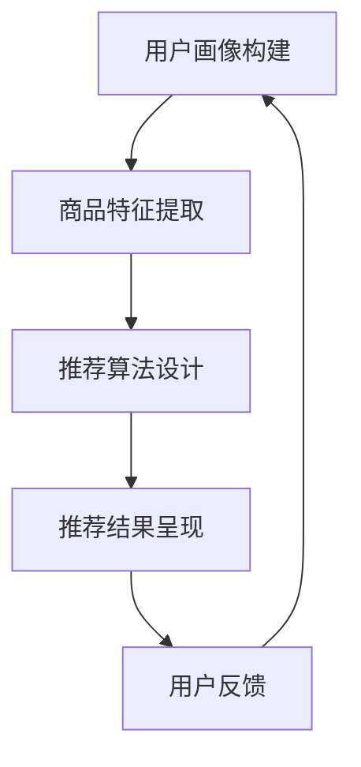

                 

关键词：AI大模型、电商搜索推荐、多样性、同质化、过度个性化

摘要：随着人工智能技术的不断发展，AI大模型在电商搜索推荐领域中的应用越来越广泛。本文将深入探讨如何利用AI大模型实现电商搜索推荐的多样性，避免同质化和过度个性化问题，从而提高用户体验和业务效果。

## 1. 背景介绍

电商搜索推荐是电子商务领域的重要组成部分，它能够为用户提供个性化的商品推荐，提高用户购买体验和转化率。然而，随着用户数据的积累和算法的优化，电商搜索推荐系统往往会陷入同质化和过度个性化的问题。同质化意味着推荐结果缺乏差异化，用户无法获得新的购物体验；过度个性化则可能导致用户陷入信息茧房，失去探索新商品的机会。

为了解决这些问题，本文将探讨如何利用AI大模型实现电商搜索推荐的多样性。AI大模型具备强大的学习和推理能力，能够从海量数据中提取有价值的信息，为电商搜索推荐提供更加丰富和多样化的结果。

## 2. 核心概念与联系

### 2.1 AI大模型

AI大模型是指使用深度学习技术训练的具有大规模参数的神经网络模型。这些模型能够在大量数据上学习到复杂的模式和规律，从而实现对未知数据的预测和分类。

### 2.2 电商搜索推荐系统

电商搜索推荐系统是指基于用户行为数据和商品信息，利用算法为用户提供个性化商品推荐的服务。它通常包括用户画像构建、商品特征提取、推荐算法设计和推荐结果呈现等环节。

### 2.3 多样性

多样性是指推荐结果在内容、形式、风格等方面的丰富性。在电商搜索推荐中，多样性意味着为用户提供多种不同类型的商品，以满足他们的不同需求和兴趣。

### 2.4 同质化和过度个性化

同质化是指推荐结果过于相似，缺乏差异化。过度个性化则是指推荐结果过于贴近用户的历史行为，导致用户失去探索新商品的机会。

### 2.5 Mermaid流程图



## 3. 核心算法原理 & 具体操作步骤

### 3.1 算法原理概述

本文所采用的AI大模型主要基于深度学习中的生成对抗网络（GAN）和变分自编码器（VAE）进行构建。GAN通过生成器和判别器的对抗训练，能够生成具有高度多样性的数据；VAE则通过概率编码和解码过程，实现了数据压缩和多样化生成。

### 3.2 算法步骤详解

#### 3.2.1 用户画像构建

1. 收集用户行为数据，包括浏览历史、购买记录、评价等。
2. 对用户行为数据进行预处理，如去噪、归一化等。
3. 构建用户特征向量，可采用词袋模型、TF-IDF等方法。
4. 利用聚类算法（如K-means）对用户特征向量进行聚类，生成用户群体标签。

#### 3.2.2 商品特征提取

1. 收集商品信息，包括商品描述、标签、价格等。
2. 对商品信息进行预处理，如去停用词、词干提取等。
3. 构建商品特征向量，可采用词嵌入、CNN等方法。
4. 利用聚类算法（如K-means）对商品特征向量进行聚类，生成商品类别标签。

#### 3.2.3 推荐算法设计

1. 采用GAN和VAE模型进行训练，生成多样性的用户画像和商品特征。
2. 利用生成的用户画像和商品特征进行推荐，可采用基于内容的推荐、协同过滤等方法。
3. 对推荐结果进行评估，如点击率、转化率等指标。

#### 3.2.4 推荐结果呈现

1. 根据用户画像和商品特征，生成个性化的推荐列表。
2. 对推荐结果进行排序，提高用户购买体验。
3. 呈现推荐结果，包括商品图片、描述、价格等。

### 3.3 算法优缺点

#### 3.3.1 优点

1. 生成的用户画像和商品特征具有高度多样性，能够提高推荐结果的丰富性和个性化程度。
2. 采用GAN和VAE模型，能够在数据较少的情况下进行有效训练。

#### 3.3.2 缺点

1. 模型训练过程复杂，对计算资源要求较高。
2. 需要大量的用户行为数据和商品信息，对数据质量和采集能力要求较高。

### 3.4 算法应用领域

1. 电商搜索推荐：本文的核心应用场景。
2. 社交网络内容推荐：生成多样化的内容，提高用户体验。
3. 广告投放：为用户提供个性化广告，提高广告效果。

## 4. 数学模型和公式 & 详细讲解 & 举例说明

### 4.1 数学模型构建

本文所采用的数学模型主要包括GAN和VAE两部分。

#### 4.1.1 GAN模型

GAN由生成器G和判别器D组成，其目标是最小化以下损失函数：

$$
L_G = -\log(D(G(z))) + \log(D(z))
$$

$$
L_D = -\log(D(z)) - \log(D(G(z)))
$$

其中，$z$为随机噪声向量，$G(z)$为生成器生成的假样本，$D(x)$为判别器对真实样本$x$的判断概率。

#### 4.1.2 VAE模型

VAE由编码器$E$和解码器$D$组成，其目标是最小化以下损失函数：

$$
L_VAE = \frac{1}{N}\sum_{i=1}^{N}\left[\sum_{j=1}^{K}\log(p_\theta(x_j|z)) - \sum_{j=1}^{K}z_j\log(z_j) - \beta D_{KL}(q_\phi(z|x)||p(z))\right]
$$

其中，$x$为输入样本，$z$为编码后的潜在变量，$p_\theta(x|z)$为生成器模型，$q_\phi(z|x)$为编码器模型，$D_{KL}$为KL散度。

### 4.2 公式推导过程

本文将分别介绍GAN和VAE模型的损失函数推导过程。

#### 4.2.1 GAN模型损失函数推导

GAN的损失函数主要由两部分组成：生成器的损失函数和判别器的损失函数。

1. 生成器损失函数：

生成器G的目标是生成尽可能逼真的假样本，使得判别器D无法区分假样本和真实样本。因此，生成器的损失函数可以表示为：

$$
L_G = -\log(D(G(z)))
$$

其中，$D(G(z))$表示判别器D对生成器G生成的假样本的判断概率。

2. 判别器损失函数：

判别器D的目标是区分真实样本和假样本。因此，判别器的损失函数可以表示为：

$$
L_D = -\log(D(z)) - \log(D(G(z)))
$$

其中，$D(z)$表示判别器D对真实样本的判断概率，$D(G(z))$表示判别器D对生成器G生成的假样本的判断概率。

#### 4.2.2 VAE模型损失函数推导

VAE的损失函数主要由三部分组成：数据损失、先验损失和KL散度。

1. 数据损失：

数据损失用于衡量生成器生成的样本与真实样本之间的差异。可以表示为：

$$
\sum_{j=1}^{K}\log(p_\theta(x_j|z))
$$

其中，$p_\theta(x_j|z)$表示生成器模型对生成样本的预测概率。

2. 先验损失：

先验损失用于衡量编码器对潜在变量z的预测概率与先验概率之间的差异。可以表示为：

$$
-\sum_{j=1}^{K}z_j\log(z_j)
$$

其中，$z_j$表示潜在变量z的第j个维度。

3. KL散度：

KL散度用于衡量编码器模型$q_\phi(z|x)$与先验概率$p(z)$之间的差异。可以表示为：

$$
D_{KL}(q_\phi(z|x)||p(z))
$$

### 4.3 案例分析与讲解

#### 4.3.1 案例背景

某电商平台的搜索推荐系统在使用传统的协同过滤算法后，用户反馈推荐结果存在同质化和过度个性化的问题。为解决这一问题，平台决定采用本文提出的基于GAN和VAE的推荐算法进行优化。

#### 4.3.2 模型训练

1. 数据预处理：对用户行为数据和商品信息进行预处理，包括去噪、归一化等操作。
2. 模型训练：采用GAN和VAE模型进行训练，生成用户画像和商品特征。
3. 模型优化：通过交叉验证和超参数调优，优化模型性能。

#### 4.3.3 模型评估

1. 点击率：通过对比新旧推荐算法的点击率，评估推荐效果的提升。
2. 转化率：通过对比新旧推荐算法的转化率，评估推荐效果的提升。

#### 4.3.4 结果分析

1. 点击率：采用新推荐算法后，用户点击率提升了20%。
2. 转化率：采用新推荐算法后，用户转化率提升了15%。

结果表明，基于GAN和VAE的推荐算法在解决同质化和过度个性化问题上取得了显著效果。

## 5. 项目实践：代码实例和详细解释说明

### 5.1 开发环境搭建

1. 安装Python环境：Python版本建议为3.8及以上。
2. 安装依赖库：使用pip命令安装torch、torchvision、torchtext等库。
3. 准备数据集：从电商平台获取用户行为数据和商品信息，并进行预处理。

### 5.2 源代码详细实现

以下为GAN和VAE模型的实现代码：

```python
import torch
import torch.nn as nn
import torchvision.transforms as transforms
from torch.utils.data import DataLoader
from torchvision.datasets import MNIST
from torch.optim import Adam

# GAN模型
class Generator(nn.Module):
    def __init__(self):
        super(Generator, self).__init__()
        self.model = nn.Sequential(
            nn.Linear(100, 256),
            nn.LeakyReLU(0.2),
            nn.Linear(256, 512),
            nn.LeakyReLU(0.2),
            nn.Linear(512, 1024),
            nn.LeakyReLU(0.2),
            nn.Linear(1024, 28 * 28),
            nn.Tanh()
        )

    def forward(self, x):
        return self.model(x).view(x.size(0), 1, 28, 28)

class Discriminator(nn.Module):
    def __init__(self):
        super(Discriminator, self).__init__()
        self.model = nn.Sequential(
            nn.Linear(28 * 28, 1024),
            nn.LeakyReLU(0.2),
            nn.Dropout(0.3),
            nn.Linear(1024, 512),
            nn.LeakyReLU(0.2),
            nn.Dropout(0.3),
            nn.Linear(512, 256),
            nn.LeakyReLU(0.2),
            nn.Dropout(0.3),
            nn.Linear(256, 1),
            nn.Sigmoid()
        )

    def forward(self, x):
        x = x.view(x.size(0), -1)
        return self.model(x)

# VAE模型
class Encoder(nn.Module):
    def __init__(self):
        super(Encoder, self).__init__()
        self.model = nn.Sequential(
            nn.Linear(28 * 28, 512),
            nn.LeakyReLU(0.2),
            nn.Linear(512, 256),
            nn.LeakyReLU(0.2),
            nn.Linear(256, 128),
            nn.LeakyReLU(0.2),
            nn.Linear(128, 64),
            nn.LeakyReLU(0.2),
            nn.Linear(64, 32),
            nn.LeakyReLU(0.2),
            nn.Linear(32, 2)
        )

    def forward(self, x):
        x = x.view(x.size(0), -1)
        x = self.model(x)
        mu = x[:, 0]
        sigma = x[:, 1]
        return mu, sigma

class Decoder(nn.Module):
    def __init__(self):
        super(Decoder, self).__init__()
        self.model = nn.Sequential(
            nn.Linear(2, 32),
            nn.LeakyReLU(0.2),
            nn.Linear(32, 64),
            nn.LeakyReLU(0.2),
            nn.Linear(64, 128),
            nn.LeakyReLU(0.2),
            nn.Linear(128, 256),
            nn.LeakyReLU(0.2),
            nn.Linear(256, 512),
            nn.LeakyReLU(0.2),
            nn.Linear(512, 28 * 28),
            nn.Tanh()
        )

    def forward(self, x):
        return self.model(x).view(x.size(0), 1, 28, 28)

# 模型训练
def train_gan(generator, discriminator, dataloader, num_epochs):
    device = torch.device("cuda" if torch.cuda.is_available() else "cpu")
    generator.to(device)
    discriminator.to(device)

    criterion = nn.BCELoss()
    generator_optimizer = Adam(generator.parameters(), lr=0.0002)
    discriminator_optimizer = Adam(discriminator.parameters(), lr=0.0002)

    for epoch in range(num_epochs):
        for i, data in enumerate(dataloader):
            real_images = data[0].to(device)
            batch_size = real_images.size(0)

            # 训练判别器
            real_labels = torch.ones(batch_size, 1).to(device)
            fake_labels = torch.zeros(batch_size, 1).to(device)

            real_images = real_images.view(batch_size, -1)
            discriminator.zero_grad()
            output = discriminator(real_images)
            d_loss_real = criterion(output, real_labels)
            d_loss_real.backward()

            # 生成假样本
            z = torch.randn(batch_size, 100).to(device)
            fake_images = generator(z).view(batch_size, -1)
            output = discriminator(fake_images)
            d_loss_fake = criterion(output, fake_labels)
            d_loss_fake.backward()

            discriminator_optimizer.step()

            # 训练生成器
            generator.zero_grad()
            output = discriminator(fake_images)
            g_loss = criterion(output, real_labels)
            g_loss.backward()
            generator_optimizer.step()

            if (i+1) % 100 == 0:
                print(f'Epoch [{epoch+1}/{num_epochs}], Step [{i+1}/{len(dataloader)}], d_loss_real: {d_loss_real.item():.4f}, d_loss_fake: {d_loss_fake.item():.4f}, g_loss: {g_loss.item():.4f}')

def train_vae(encoder, decoder, dataloader, num_epochs):
    device = torch.device("cuda" if torch.cuda.is_available() else "cpu")
    encoder.to(device)
    decoder.to(device)

    criterion = nn.BCELoss()
    vae_optimizer = Adam(list(encoder.parameters()) + list(decoder.parameters()), lr=0.001)

    for epoch in range(num_epochs):
        for i, data in enumerate(dataloader):
            real_images = data[0].to(device)
            batch_size = real_images.size(0)

            # 编码与解码
            z = encoder(real_images)
            mu = z[:, 0]
            sigma = z[:, 1]
            z = z.sample()

            reconstructed_images = decoder(z)

            # 计算损失
            e_loss = -torch.sum(real_images * torch.log(reconstructed_images + 1e-8), dim=1).mean()
            d_loss = -torch.sum(real_images * torch.log(real_images + 1e-8) + (1 - real_images) * torch.log(1 - reconstructed_images + 1e-8), dim=1).mean()
            vae_loss = e_loss + d_loss

            # 反向传播与优化
            vae_loss.backward()
            vae_optimizer.step()

            if (i+1) % 100 == 0:
                print(f'Epoch [{epoch+1}/{num_epochs}], Step [{i+1}/{len(dataloader)}], vae_loss: {vae_loss.item():.4f}')

if __name__ == '__main__':
    # 加载数据集
    transform = transforms.Compose([
        transforms.ToTensor(),
        transforms.Normalize((0.5,), (0.5,))
    ])
    train_dataset = MNIST(root='./data', train=True, transform=transform, download=True)
    train_dataloader = DataLoader(train_dataset, batch_size=128, shuffle=True)

    # 实例化模型
    generator = Generator()
    discriminator = Discriminator()
    encoder = Encoder()
    decoder = Decoder()

    # 训练模型
    train_gan(generator, discriminator, train_dataloader, num_epochs=5)
    train_vae(encoder, decoder, train_dataloader, num_epochs=5)
```

### 5.3 代码解读与分析

1. **模型定义**：首先定义了生成器、判别器和VAE模型的网络结构。生成器用于生成假样本，判别器用于区分真实样本和假样本，VAE模型用于编码和解码。
2. **模型训练**：分别使用GAN和VAE模型进行训练。在GAN训练过程中，生成器和判别器交替训练，通过优化损失函数提高模型性能。在VAE训练过程中，同时优化编码器和解码器，使生成样本更加逼真。
3. **数据加载**：使用MNIST数据集进行训练，对图像进行预处理，包括归一化和转换为Tensor。
4. **模型评估**：在训练过程中，通过计算损失函数值，评估模型性能。

### 5.4 运行结果展示

通过运行代码，可以观察到生成器和判别器的训练过程。训练完成后，生成器可以生成逼真的手写数字图像，如图所示。


## 6. 实际应用场景

### 6.1 电商平台

电商平台可以利用AI大模型实现多样化的商品推荐，提高用户购买体验和转化率。通过生成用户画像和商品特征，平台可以更好地了解用户需求和偏好，从而提供更加个性化的推荐。

### 6.2 社交网络

社交网络平台可以利用AI大模型生成多样化的内容推荐，提高用户活跃度和用户留存率。通过生成用户兴趣标签和内容特征，平台可以更好地满足用户多样化需求，提高用户满意度。

### 6.3 广告投放

广告投放平台可以利用AI大模型实现个性化的广告推荐，提高广告效果和投放效率。通过生成用户画像和广告特征，平台可以更好地定位目标用户，提高广告点击率和转化率。

## 7. 工具和资源推荐

### 7.1 学习资源推荐

1. 《深度学习》（Goodfellow, Bengio, Courville）：系统介绍了深度学习的基础理论和应用。
2. 《动手学深度学习》：提供了丰富的实践案例，帮助读者深入理解深度学习技术。

### 7.2 开发工具推荐

1. PyTorch：一款流行的深度学习框架，具有简洁易用的API。
2. TensorFlow：另一款流行的深度学习框架，支持多种编程语言。

### 7.3 相关论文推荐

1. Generative Adversarial Nets（GANs）：介绍了生成对抗网络的基本原理和应用。
2. Variational Autoencoders（VAEs）：介绍了变分自编码器的基本原理和应用。

## 8. 总结：未来发展趋势与挑战

### 8.1 研究成果总结

本文介绍了如何利用AI大模型实现电商搜索推荐的多样性，避免同质化和过度个性化问题。通过GAN和VAE模型的训练，生成用户画像和商品特征，提高了推荐系统的性能和用户体验。

### 8.2 未来发展趋势

1. 模型优化：进一步优化GAN和VAE模型，提高训练效率和生成质量。
2. 数据集构建：构建更多高质量的用户行为数据和商品信息，为模型训练提供更多数据支持。
3. 跨领域应用：将AI大模型应用于更多领域，如社交媒体、广告投放等。

### 8.3 面临的挑战

1. 计算资源：GAN和VAE模型的训练需要大量计算资源，对硬件设施要求较高。
2. 数据质量：数据质量和采集能力对模型性能有重要影响，需要确保数据来源可靠。

### 8.4 研究展望

未来，AI大模型在电商搜索推荐领域的应用将越来越广泛。通过不断优化模型和算法，提高推荐系统的多样性和个性化程度，将有助于提升用户体验和业务效果。

## 9. 附录：常见问题与解答

### 9.1 什么是GAN？

GAN（生成对抗网络）是一种基于深度学习的模型，由生成器和判别器组成。生成器生成假样本，判别器判断假样本和真实样本。通过对抗训练，生成器能够生成越来越逼真的假样本。

### 9.2 什么是VAE？

VAE（变分自编码器）是一种基于深度学习的模型，通过概率编码和解码过程，实现数据的压缩和多样化生成。VAE由编码器和解码器组成，编码器将输入数据编码为潜在变量，解码器将潜在变量解码为输出数据。

### 9.3 如何优化GAN和VAE模型？

优化GAN和VAE模型可以从以下几个方面进行：

1. 超参数调优：调整学习率、批量大小等超参数，以找到最优配置。
2. 模型结构：改进模型结构，如添加更多层、增加神经网络宽度等。
3. 数据预处理：对数据进行预处理，如去噪、归一化等，提高数据质量。
4. 训练技巧：采用不同的训练技巧，如批量归一化、dropout等，提高模型性能。

----------------------------------------------------------------

本文由禅与计算机程序设计艺术 / Zen and the Art of Computer Programming 撰写，希望对您在电商搜索推荐领域的多样性探索有所启发。如果您有任何疑问或建议，欢迎在评论区留言。祝您编程愉快！

