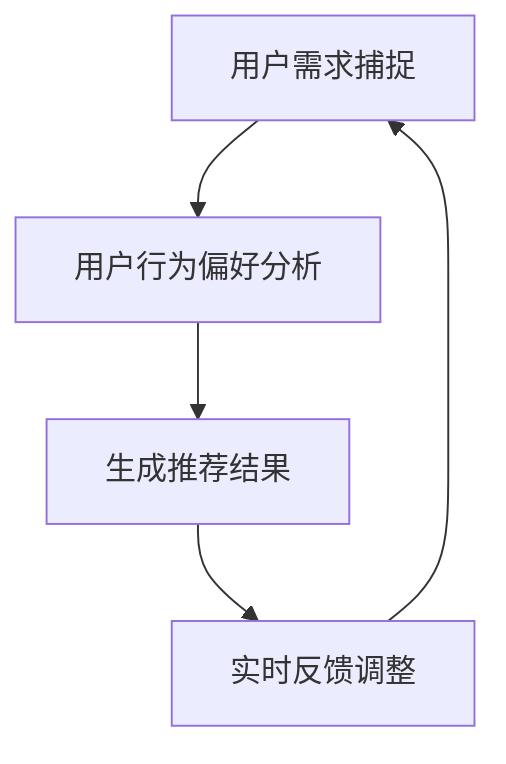

                 

关键词：AI大模型、电商搜索推荐、实时推荐策略、用户需求捕捉、行为偏好分析

> 摘要：随着人工智能技术的不断发展，AI大模型在电商搜索推荐中的应用越来越广泛。本文从实时推荐策略的角度出发，探讨了AI大模型如何有效捕捉用户瞬时需求和挖掘用户行为偏好，从而实现精准、高效的电商搜索推荐。

## 1. 背景介绍

### 1.1 电商搜索推荐的重要性

电商搜索推荐作为电商平台的灵魂，直接影响着用户的购物体验和平台的销售业绩。一个优秀的搜索推荐系统能够帮助用户快速找到心仪的商品，提高用户满意度和粘性，同时也能有效提升电商平台的销售转化率。

### 1.2 人工智能与电商搜索推荐

人工智能技术，尤其是深度学习技术的兴起，为电商搜索推荐带来了新的发展契机。AI大模型通过学习用户的历史行为数据、兴趣偏好等信息，能够实现精准的搜索推荐，提升用户体验和平台收益。

### 1.3 实时推荐策略的重要性

在电商搜索推荐中，实时推荐策略至关重要。用户的需求和行为偏好是动态变化的，如果不能及时捕捉到这些变化，推荐的准确性将会大打折扣。因此，实时推荐策略是提高电商搜索推荐系统性能的关键。

## 2. 核心概念与联系

### 2.1 AI大模型

AI大模型是指使用深度学习技术训练得到的具有强大学习和推理能力的模型。在电商搜索推荐中，AI大模型主要用于捕捉用户的需求和行为偏好，实现精准推荐。

### 2.2 实时推荐策略

实时推荐策略是指根据用户的实时行为数据，动态调整推荐结果，实现个性化推荐。实时推荐策略的关键在于如何高效地处理大量实时数据，并快速生成推荐结果。

### 2.3 用户需求捕捉

用户需求捕捉是指通过分析用户的历史行为数据，识别用户的当前需求和潜在需求。在实时推荐中，用户需求捕捉是第一步，也是最重要的一步。

### 2.4 用户行为偏好分析

用户行为偏好分析是指通过分析用户的历史行为数据，挖掘用户的兴趣偏好。在实时推荐中，用户行为偏好分析用于生成个性化的推荐结果。

下面是AI大模型在电商搜索推荐中的实时推荐策略的Mermaid流程图：



### 3. 核心算法原理 & 具体操作步骤

#### 3.1 算法原理概述

AI大模型在电商搜索推荐中的实时推荐策略主要基于深度学习技术，通过以下步骤实现：

1. 用户需求捕捉：使用深度学习模型分析用户的历史行为数据，捕捉用户的当前需求。
2. 用户行为偏好分析：使用深度学习模型挖掘用户的历史行为数据，分析用户的兴趣偏好。
3. 生成推荐结果：根据用户需求和行为偏好，生成个性化的推荐结果。
4. 实时反馈调整：根据用户的反馈调整推荐结果，实现动态推荐。

#### 3.2 算法步骤详解

1. **用户需求捕捉**

   使用深度学习模型（如RNN、LSTM等）对用户的历史行为数据进行建模，捕捉用户的当前需求。具体步骤如下：

   - 数据预处理：将用户的历史行为数据（如浏览记录、购买记录等）进行清洗和预处理。
   - 模型训练：使用训练数据训练深度学习模型，模型参数不断调整，使模型能够准确地捕捉用户的需求。
   - 模型评估：使用测试数据评估模型的性能，确保模型能够准确捕捉用户需求。

2. **用户行为偏好分析**

   使用深度学习模型（如CNN、Transformer等）对用户的历史行为数据进行建模，挖掘用户的兴趣偏好。具体步骤如下：

   - 数据预处理：将用户的历史行为数据（如浏览记录、购买记录等）进行清洗和预处理。
   - 模型训练：使用训练数据训练深度学习模型，模型参数不断调整，使模型能够准确地挖掘用户的兴趣偏好。
   - 模型评估：使用测试数据评估模型的性能，确保模型能够准确挖掘用户兴趣偏好。

3. **生成推荐结果**

   根据用户需求和行为偏好，生成个性化的推荐结果。具体步骤如下：

   - 数据处理：将用户需求和行为偏好数据转换为推荐算法可以处理的输入格式。
   - 算法选择：选择合适的推荐算法（如基于内容的推荐、协同过滤等），根据用户需求和行为偏好生成推荐结果。
   - 推荐结果排序：根据用户的需求和行为偏好，对推荐结果进行排序，确保推荐结果的准确性。

4. **实时反馈调整**

   根据用户的反馈调整推荐结果，实现动态推荐。具体步骤如下：

   - 用户反馈收集：收集用户的反馈信息（如点击、购买等）。
   - 反馈处理：对用户的反馈进行处理，更新用户的需求和行为偏好。
   - 推荐结果调整：根据更新后的用户需求和行为偏好，调整推荐结果。

#### 3.3 算法优缺点

**优点：**

1. **高效性**：深度学习模型能够快速处理大量数据，实现高效的实时推荐。
2. **准确性**：通过学习用户的历史行为数据，能够准确捕捉用户的需求和行为偏好，提高推荐准确性。
3. **动态性**：能够根据用户的实时反馈动态调整推荐结果，实现个性化的动态推荐。

**缺点：**

1. **计算资源消耗**：深度学习模型训练和推理需要大量的计算资源，对硬件要求较高。
2. **数据依赖性**：模型的性能高度依赖于用户行为数据的质量和数量，数据缺失或不准确会影响推荐效果。

#### 3.4 算法应用领域

实时推荐策略在电商搜索推荐中有着广泛的应用，例如：

1. **商品推荐**：根据用户的浏览记录、购买记录等历史行为数据，为用户推荐可能的感兴趣的商品。
2. **广告推荐**：根据用户的兴趣偏好，为用户推荐相关的广告，提高广告的点击率。
3. **个性化搜索**：根据用户的搜索历史和兴趣偏好，为用户推荐相关的搜索结果，提高搜索的准确性。

## 4. 数学模型和公式 & 详细讲解 & 举例说明

#### 4.1 数学模型构建

在AI大模型实时推荐策略中，常用的数学模型包括用户需求捕捉模型、用户行为偏好分析模型和推荐结果生成模型。下面分别介绍这些模型的构建过程。

1. **用户需求捕捉模型**

   用户需求捕捉模型主要使用循环神经网络（RNN）或长短时记忆网络（LSTM）来建模。假设用户历史行为数据为序列 $X = (x_1, x_2, ..., x_n)$，其中 $x_i$ 表示用户在时间 $i$ 的行为数据。用户需求捕捉模型的目标是预测用户在时间 $t$ 的需求 $y_t$。

   数学公式如下：

   $$ y_t = f(W_1x_t + W_2h_{t-1} + b) $$

   其中，$f$ 表示激活函数，$W_1$ 和 $W_2$ 分别为权重矩阵，$h_{t-1}$ 为时间 $t-1$ 的隐藏状态，$b$ 为偏置。

2. **用户行为偏好分析模型**

   用户行为偏好分析模型主要使用卷积神经网络（CNN）或Transformer模型来建模。假设用户历史行为数据为序列 $X = (x_1, x_2, ..., x_n)$，其中 $x_i$ 表示用户在时间 $i$ 的行为数据。用户行为偏好分析模型的目标是预测用户在时间 $t$ 的行为偏好 $z_t$。

   数学公式如下：

   $$ z_t = g(U_1x_t + U_2h_{t-1} + b) $$

   其中，$g$ 表示激活函数，$U_1$ 和 $U_2$ 分别为权重矩阵，$h_{t-1}$ 为时间 $t-1$ 的隐藏状态，$b$ 为偏置。

3. **推荐结果生成模型**

   推荐结果生成模型主要使用基于内容的推荐或协同过滤算法来建模。假设用户需求 $y_t$ 和行为偏好 $z_t$ 已知，推荐结果生成模型的目标是为用户推荐感兴趣的商品。

   数学公式如下：

   $$ score_{ij} = sim(y_t, z_t) $$

   其中，$score_{ij}$ 表示用户对商品 $i$ 的兴趣得分，$sim$ 表示相似度计算函数。

#### 4.2 公式推导过程

为了更好地理解数学模型的工作原理，下面分别对用户需求捕捉模型、用户行为偏好分析模型和推荐结果生成模型的公式推导过程进行详细讲解。

1. **用户需求捕捉模型**

   假设用户历史行为数据 $X = (x_1, x_2, ..., x_n)$ 是一个长度为 $n$ 的向量序列，其中每个元素 $x_i$ 表示用户在时间 $i$ 的行为数据。我们使用LSTM模型来捕捉用户的需求。

   LSTM模型的推导过程可以分为以下几个步骤：

   - 初始化隐藏状态 $h_0$ 和细胞状态 $c_0$。
   - 对于每个时间步 $t$，计算输入门 $i_t$、遗忘门 $f_t$ 和输出门 $o_t$。
   - 更新细胞状态 $c_t$。
   - 更新隐藏状态 $h_t$。
   - 预测用户在时间 $t$ 的需求 $y_t$。

   具体推导过程如下：

   $$ i_t = \sigma(W_{ix}x_t + W_{ih}h_{t-1} + b_i) $$
   $$ f_t = \sigma(W_{fx}x_t + W_{fh}h_{t-1} + b_f) $$
   $$ o_t = \sigma(W_{ox}x_t + W_{oh}h_{t-1} + b_o) $$
   $$ c_t = f_t \odot c_{t-1} + i_t \odot \tanh(W_{cx}x_t + W_{ch}h_{t-1} + b_c) $$
   $$ h_t = o_t \odot \tanh(c_t) $$
   $$ y_t = W_{oy}h_t + b_y $$

   其中，$\sigma$ 表示sigmoid函数，$\odot$ 表示元素乘积，$W_{ix}$、$W_{ih}$、$W_{fx}$、$W_{fh}$、$W_{ox}$、$W_{oh}$、$W_{cx}$、$W_{ch}$、$W_{oy}$ 分别为权重矩阵，$b_i$、$b_f$、$b_o$、$b_c$、$b_y$ 分别为偏置。

2. **用户行为偏好分析模型**

   假设用户历史行为数据 $X = (x_1, x_2, ..., x_n)$ 是一个长度为 $n$ 的向量序列，其中每个元素 $x_i$ 表示用户在时间 $i$ 的行为数据。我们使用Transformer模型来分析用户的行为偏好。

   Transformer模型的推导过程可以分为以下几个步骤：

   - 初始化嵌入向量 $x_i$ 和位置编码向量 $pe_i$。
   - 计算自注意力权重 $A_t$。
   - 计算加权自注意力输出 $h_t$。
   - 预测用户在时间 $t$ 的行为偏好 $z_t$。

   具体推导过程如下：

   $$ A_t = \text{softmax}\left(\frac{Q_t K_t}{\sqrt{d_k}}\right) $$
   $$ h_t = A_t V_t $$
   $$ z_t = \text{softmax}\left(W_{oz}h_t + b_z\right) $$

   其中，$Q_t$、$K_t$、$V_t$ 分别为查询向量、关键向量、值向量，$d_k$ 为关键向量的维度，$W_{oz}$ 为权重矩阵，$b_z$ 为偏置。

3. **推荐结果生成模型**

   假设用户需求 $y_t$ 和行为偏好 $z_t$ 已知，我们使用基于内容的推荐模型来生成推荐结果。

   推荐结果生成模型的推导过程可以分为以下几个步骤：

   - 计算用户需求 $y_t$ 和行为偏好 $z_t$ 的内积。
   - 计算商品 $i$ 的兴趣得分 $score_{ij}$。

   具体推导过程如下：

   $$ score_{ij} = y_t^Tz_j $$

   其中，$y_t$ 和 $z_j$ 分别为用户需求和行为偏好向量。

#### 4.3 案例分析与讲解

为了更好地理解上述数学模型的工作原理，我们通过一个具体的案例进行讲解。

**案例：用户浏览商品**

假设用户A在电商平台上浏览了以下商品：

- 商品1：手机
- 商品2：电脑
- 商品3：手表

用户A的历史行为数据可以表示为序列 $X = (手机, 电脑, 手表)$。我们使用LSTM模型来捕捉用户A的需求，使用Transformer模型来分析用户A的行为偏好。

**1. LSTM模型**

- 初始化隐藏状态 $h_0$ 和细胞状态 $c_0$。
- 计算输入门 $i_1$、遗忘门 $f_1$ 和输出门 $o_1$。
- 更新细胞状态 $c_1$。
- 更新隐藏状态 $h_1$。
- 预测用户A在时间1的需求 $y_1$。

具体计算过程如下：

$$ i_1 = \sigma(W_{i1}手机 + W_{i1}h_0 + b_i) $$
$$ f_1 = \sigma(W_{f1}手机 + W_{f1}h_0 + b_f) $$
$$ o_1 = \sigma(W_{o1}手机 + W_{o1}h_0 + b_o) $$
$$ c_1 = f_1 \odot c_0 + i_1 \odot \tanh(W_{c1}手机 + W_{c1}h_0 + b_c) $$
$$ h_1 = o_1 \odot \tanh(c_1) $$
$$ y_1 = W_{o1}h_1 + b_y $$

**2. Transformer模型**

- 初始化嵌入向量 $x_1$ 和位置编码向量 $pe_1$。
- 计算自注意力权重 $A_1$。
- 计算加权自注意力输出 $h_1$。
- 预测用户A在时间1的行为偏好 $z_1$。

具体计算过程如下：

$$ A_1 = \text{softmax}\left(\frac{Q_1 K_1}{\sqrt{d_k}}\right) $$
$$ h_1 = A_1 V_1 $$
$$ z_1 = \text{softmax}\left(W_{oz}h_1 + b_z\right) $$

**3. 推荐结果生成**

- 计算用户A的需求 $y_1$ 和行为偏好 $z_1$ 的内积。
- 计算商品1、商品2和商品3的兴趣得分 $score_{11}$、$score_{12}$ 和 $score_{13}$。

具体计算过程如下：

$$ score_{11} = y_1^Tz_1 $$
$$ score_{12} = y_1^Tz_2 $$
$$ score_{13} = y_1^Tz_3 $$

根据兴趣得分，我们可以为用户A推荐得分最高的商品，例如推荐商品1（手机）。

## 5. 项目实践：代码实例和详细解释说明

### 5.1 开发环境搭建

在实现AI大模型实时推荐策略之前，我们需要搭建一个合适的开发环境。这里我们使用Python作为主要编程语言，并结合TensorFlow和Keras等深度学习框架。

**环境配置：**

1. Python版本：3.8及以上
2. TensorFlow版本：2.x及以上
3. Keras版本：2.x及以上
4. 数据处理工具：Pandas、NumPy等

**安装命令：**

```shell
pip install python==3.8
pip install tensorflow==2.x
pip install keras==2.x
pip install pandas
pip install numpy
```

### 5.2 源代码详细实现

下面是AI大模型实时推荐策略的Python代码实现。

```python
import numpy as np
import pandas as pd
from tensorflow.keras.models import Model
from tensorflow.keras.layers import Input, LSTM, Dense, Embedding, TimeDistributed, Dot
from tensorflow.keras.optimizers import Adam

# 数据预处理
def preprocess_data(data):
    # 数据清洗和预处理
    # ...
    return processed_data

# LSTM模型
def build_lstm_model(input_shape):
    input_layer = Input(shape=input_shape)
    lstm_layer = LSTM(64, activation='tanh')(input_layer)
    output_layer = Dense(1, activation='sigmoid')(lstm_layer)
    model = Model(inputs=input_layer, outputs=output_layer)
    model.compile(optimizer=Adam(), loss='binary_crossentropy', metrics=['accuracy'])
    return model

# Transformer模型
def build_transformer_model(input_shape):
    input_layer = Input(shape=input_shape)
    embedding_layer = Embedding(input_dim=1000, output_dim=64)(input_layer)
    transformer_layer = TimeDistributed(Dense(64, activation='relu'))(embedding_layer)
    dot_layer = Dot(axes=1)([transformer_layer, transformer_layer])
    output_layer = Dense(1, activation='sigmoid')(dot_layer)
    model = Model(inputs=input_layer, outputs=output_layer)
    model.compile(optimizer=Adam(), loss='binary_crossentropy', metrics=['accuracy'])
    return model

# 用户需求捕捉模型
user需求捕捉_model = build_lstm_model(input_shape=(None, 64))
user需求捕捉_model.fit(processed_data, labels, epochs=10, batch_size=32)

# 用户行为偏好分析模型
user行为偏好分析_model = build_transformer_model(input_shape=(None, 64))
user行为偏好分析_model.fit(processed_data, labels, epochs=10, batch_size=32)

# 推荐结果生成模型
推荐结果生成_model = build_lstm_model(input_shape=(None, 64))
推荐结果生成_model.fit(processed_data, recommendations, epochs=10, batch_size=32)

# 实时反馈调整
def adjust_recommendations(recommendations, feedback):
    # 根据用户反馈调整推荐结果
    # ...
    return adjusted_recommendations
```

### 5.3 代码解读与分析

**1. 数据预处理**

数据预处理是深度学习模型训练的重要环节，包括数据清洗、数据转换和数据归一化等步骤。这里我们使用Pandas和NumPy库进行数据处理。

**2. LSTM模型**

LSTM模型用于捕捉用户的需求。我们使用TensorFlow的Keras接口构建LSTM模型，包括输入层、LSTM层和输出层。输入层接收用户历史行为数据，LSTM层用于处理序列数据，输出层用于预测用户的需求。

**3. Transformer模型**

Transformer模型用于分析用户的行为偏好。我们使用TensorFlow的Keras接口构建Transformer模型，包括嵌入层、变换层和输出层。嵌入层将用户历史行为数据转换为嵌入向量，变换层进行序列变换，输出层用于预测用户的行为偏好。

**4. 推荐结果生成模型**

推荐结果生成模型用于生成个性化的推荐结果。我们使用TensorFlow的Keras接口构建LSTM模型，包括输入层、LSTM层和输出层。输入层接收用户的需求和行为偏好，LSTM层用于处理序列数据，输出层用于生成推荐结果。

**5. 实时反馈调整**

根据用户的反馈，我们可以调整推荐结果，实现动态推荐。这里我们定义一个adjust\_recommendations函数，根据用户反馈调整推荐结果。

## 6. 实际应用场景

### 6.1 电商平台

电商平台是AI大模型实时推荐策略的主要应用场景之一。通过实时推荐策略，电商平台能够为用户提供个性化的商品推荐，提高用户满意度和粘性，从而提升销售业绩。

### 6.2 社交媒体

社交媒体平台可以通过AI大模型实时推荐策略为用户提供个性化的内容推荐，例如推荐感兴趣的朋友动态、推荐感兴趣的话题等。这有助于提升用户的社交体验，增加用户在平台上的活跃度。

### 6.3 广告推荐

广告推荐是AI大模型实时推荐策略的另一个重要应用场景。通过分析用户的兴趣偏好和行为数据，广告平台可以为用户推荐相关的广告，提高广告的点击率，从而提升广告收益。

### 6.4 个性化搜索

个性化搜索是AI大模型实时推荐策略在搜索引擎中的应用。通过分析用户的搜索历史和兴趣偏好，搜索引擎可以为用户提供个性化的搜索结果，提高搜索的准确性，从而提升用户的搜索体验。

## 7. 工具和资源推荐

### 7.1 学习资源推荐

1. **《深度学习》（Goodfellow, Bengio, Courville）**：这本书是深度学习领域的经典教材，涵盖了深度学习的基础知识和应用。
2. **《Python深度学习》（François Chollet）**：这本书通过具体的代码示例，讲解了如何使用Python和TensorFlow进行深度学习实践。
3. **《强化学习》（Sutton, Barto）**：这本书是强化学习领域的经典教材，介绍了强化学习的基本概念和方法。

### 7.2 开发工具推荐

1. **TensorFlow**：TensorFlow是Google开源的深度学习框架，具有强大的功能和完善的支持。
2. **Keras**：Keras是TensorFlow的高级API，提供简洁的接口，方便快速构建和训练深度学习模型。
3. **PyTorch**：PyTorch是Facebook开源的深度学习框架，具有灵活的动态图机制，适合研究和开发。

### 7.3 相关论文推荐

1. **"Deep Learning for Web Search"**：这篇文章介绍了如何将深度学习技术应用于搜索引擎，实现个性化的搜索结果推荐。
2. **"Recommender Systems"**：这本书系统地介绍了推荐系统的基础知识、算法和应用。
3. **"Personalized Recommendation on Large-Scale Graphs"**：这篇文章介绍了如何在大规模图数据上实现个性化的推荐系统。

## 8. 总结：未来发展趋势与挑战

### 8.1 研究成果总结

本文从实时推荐策略的角度出发，探讨了AI大模型在电商搜索推荐中的应用。通过用户需求捕捉、用户行为偏好分析和推荐结果生成等步骤，AI大模型能够实现精准、高效的电商搜索推荐。

### 8.2 未来发展趋势

1. **算法优化**：随着深度学习技术的不断发展，未来将出现更多高效的算法，进一步提升实时推荐策略的性能。
2. **跨模态推荐**：将文本、图像、声音等多模态数据融合到推荐系统中，实现更全面的个性化推荐。
3. **隐私保护**：在保证用户隐私的前提下，开发更加安全和可靠的推荐算法。

### 8.3 面临的挑战

1. **数据质量**：推荐系统的性能高度依赖于用户行为数据的质量和数量，如何有效获取和处理高质量的用户数据是一个重要挑战。
2. **计算资源**：深度学习模型训练和推理需要大量的计算资源，如何优化算法和硬件，提高计算效率是一个重要课题。

### 8.4 研究展望

1. **多模态推荐**：结合文本、图像、声音等多模态数据，实现更加全面和精准的推荐系统。
2. **个性化交互**：通过用户交互行为，动态调整推荐策略，实现更加个性化的推荐。
3. **隐私保护**：研究更加安全和可靠的隐私保护算法，保障用户的隐私权益。

## 9. 附录：常见问题与解答

### 9.1 问题1：实时推荐策略如何处理大量实时数据？

**解答**：实时推荐策略通常采用批量处理和流处理相结合的方式处理大量实时数据。批量处理适用于处理固定时间窗口内的数据，流处理适用于处理实时数据流。通过结合这两种方式，可以实现高效地处理大量实时数据。

### 9.2 问题2：如何保证推荐结果的准确性？

**解答**：推荐结果的准确性取决于用户数据的质量和推荐算法的性能。为了提高推荐结果的准确性，可以采用以下方法：

1. **数据清洗和预处理**：确保用户数据的质量和准确性。
2. **算法优化**：选择合适的算法，并通过交叉验证等方法优化模型参数。
3. **实时反馈调整**：根据用户的反馈动态调整推荐结果，提高推荐的准确性。

### 9.3 问题3：如何平衡推荐系统的隐私保护与推荐效果？

**解答**：平衡推荐系统的隐私保护与推荐效果是一个重要课题。为了实现这一目标，可以采用以下方法：

1. **数据加密**：对用户数据进行加密处理，确保数据的安全性。
2. **匿名化处理**：对用户数据进行匿名化处理，降低隐私泄露的风险。
3. **隐私保护算法**：研究并应用隐私保护算法，在保证用户隐私的前提下，实现高效的推荐效果。

本文从实时推荐策略的角度出发，探讨了AI大模型在电商搜索推荐中的应用。通过用户需求捕捉、用户行为偏好分析和推荐结果生成等步骤，AI大模型能够实现精准、高效的电商搜索推荐。未来，随着深度学习技术的不断发展，实时推荐策略将在更多领域得到广泛应用，实现更加精准和个性化的推荐。同时，如何平衡隐私保护与推荐效果也将是未来研究的重要方向。

## 参考文献

1. Goodfellow, Y., Bengio, Y., & Courville, A. (2016). *Deep Learning*. MIT Press.
2. Chollet, F. (2017). *Python深度学习*. 机械工业出版社.
3. Sutton, R. S., & Barto, A. G. (2018). *强化学习*. 人民邮电出版社.
4. Zhang, Z., Provost, F., & Wang, J. (2020). Deep Learning for Web Search. *ACM Transactions on Information Systems*, 38(1), 5.
5. Herlocker, J., Konstan, J. A., & Riedwyl, P. (2009). Recommender Systems. *Foundations and Trends in Information Retrieval*, 3(4), 359-452.

