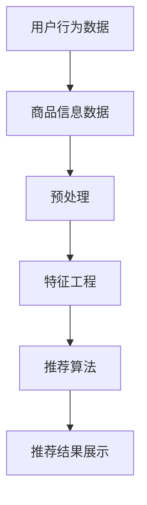

                 

关键词：AI大模型、电商搜索推荐、冷启动问题、算法优化、用户行为分析

> 摘要：随着人工智能技术的不断发展，大模型在电商搜索推荐中的应用越来越广泛。然而，冷启动问题成为了大模型在电商搜索推荐中面临的一个严峻挑战。本文将探讨大模型在电商搜索推荐中的挑战，并重点分析如何处理冷启动问题，以期提高推荐系统的效果和用户体验。

## 1. 背景介绍

近年来，随着互联网技术的飞速发展，电商行业已经成为全球经济发展的重要驱动力。在电商平台上，搜索推荐系统起到了至关重要的作用。一个优秀的搜索推荐系统能够提高用户的购物体验，增加用户粘性，提高销售额。随着人工智能技术的不断发展，大模型在搜索推荐系统中的应用越来越广泛，如深度学习模型、图神经网络等。

然而，大模型在电商搜索推荐中也面临着诸多挑战，其中最为突出的是冷启动问题。冷启动问题指的是在用户初次使用推荐系统时，由于缺乏足够的用户历史数据，导致推荐系统无法提供有效的推荐。冷启动问题不仅影响用户的初次体验，还会导致用户流失，给电商平台带来巨大的损失。

本文将围绕如何处理冷启动问题展开讨论，从算法原理、数学模型、项目实践等多个方面进行分析，以期为大模型在电商搜索推荐中的应用提供一些有价值的思路。

## 2. 核心概念与联系

### 2.1. 大模型概述

大模型是指具有巨大参数量的机器学习模型，如深度神经网络、图神经网络等。大模型具有强大的表示能力和泛化能力，能够处理大规模、高维的数据，因此在各种领域中得到了广泛应用。

### 2.2. 电商搜索推荐系统

电商搜索推荐系统是指利用机器学习算法，根据用户的历史行为和兴趣，为用户推荐相关的商品。电商搜索推荐系统一般包括用户行为分析、商品信息处理、推荐算法和推荐结果展示等模块。

### 2.3. 冷启动问题

冷启动问题是指在新用户初次使用推荐系统时，由于缺乏足够的用户历史数据，导致推荐系统无法提供有效的推荐。

### 2.4. Mermaid 流程图



## 3. 核心算法原理 & 具体操作步骤

### 3.1. 算法原理概述

为了解决冷启动问题，我们可以采用基于协同过滤的推荐算法。协同过滤算法主要分为基于用户的协同过滤（User-based Collaborative Filtering，UBCF）和基于物品的协同过滤（Item-based Collaborative Filtering，IBCF）。

- **基于用户的协同过滤（UBCF）**：UBCF算法通过计算用户之间的相似度，找到与目标用户最相似的邻居用户，然后根据邻居用户的喜好推荐商品。
- **基于物品的协同过滤（IBCF）**：IBCF算法通过计算物品之间的相似度，找到与目标物品最相似的邻居物品，然后根据邻居物品的喜好推荐商品。

### 3.2. 算法步骤详解

1. **用户行为数据收集**：收集新用户在电商平台上的行为数据，如浏览记录、购买记录、收藏记录等。
2. **商品信息数据收集**：收集电商平台上的商品信息数据，如商品分类、商品属性、商品评分等。
3. **预处理**：对用户行为数据和商品信息数据进行清洗和预处理，如去重、缺失值填充等。
4. **特征工程**：对预处理后的数据进行特征提取和特征工程，如用户行为序列特征、商品属性特征等。
5. **计算相似度**：根据特征工程后的数据，计算用户与用户之间的相似度（UBCF）或商品与商品之间的相似度（IBCF）。
6. **推荐商品**：根据相似度计算结果，为用户推荐与邻居用户或邻居商品相似的商品。
7. **推荐结果展示**：将推荐结果展示给用户，提升用户的购物体验。

### 3.3. 算法优缺点

**优点**：

- **高效性**：基于协同过滤的推荐算法在处理大规模用户行为数据时具有较好的性能。
- **灵活性**：可以根据不同的应用场景，选择基于用户的协同过滤或基于物品的协同过滤。

**缺点**：

- **冷启动问题**：在新用户初次使用推荐系统时，由于缺乏足够的用户历史数据，推荐效果较差。
- **稀疏性**：用户行为数据通常呈现出高度稀疏性，导致相似度计算结果不准确。

### 3.4. 算法应用领域

基于协同过滤的推荐算法在电商搜索推荐、社交媒体推荐、音乐推荐等领域得到了广泛应用。随着大模型的发展，基于协同过滤的推荐算法也在不断改进，如引入深度学习技术、图神经网络等，以提高推荐效果。

## 4. 数学模型和公式

### 4.1. 数学模型构建

在基于用户的协同过滤算法中，我们可以使用余弦相似度来计算用户之间的相似度。假设用户$u$和用户$v$的行为数据可以用向量表示为$u \in \mathbb{R}^n$和$v \in \mathbb{R}^n$，则用户$u$和用户$v$的余弦相似度可以表示为：

$$
\cos(u, v) = \frac{u \cdot v}{\|u\| \|v\|}
$$

其中，$u \cdot v$表示用户$u$和用户$v$的内积，$\|u\|$和$\|v\|$分别表示用户$u$和用户$v$的欧氏范数。

### 4.2. 公式推导过程

设用户$u$和用户$v$的行为数据分别为$u = (u_1, u_2, \ldots, u_n)$和$v = (v_1, v_2, \ldots, v_n)$，则有：

$$
u \cdot v = \sum_{i=1}^n u_i v_i
$$

$$
\|u\| = \sqrt{\sum_{i=1}^n u_i^2}
$$

$$
\|v\| = \sqrt{\sum_{i=1}^n v_i^2}
$$

将上述公式代入余弦相似度公式，可以得到：

$$
\cos(u, v) = \frac{\sum_{i=1}^n u_i v_i}{\sqrt{\sum_{i=1}^n u_i^2} \sqrt{\sum_{i=1}^n v_i^2}}
$$

### 4.3. 案例分析与讲解

假设有两个用户$u$和$v$，他们的行为数据如下：

$$
u = (0.5, 0.5, 1, 0, 0)
$$

$$
v = (0.8, 0.6, 0.5, 0.5, 0.5)
$$

则用户$u$和用户$v$的余弦相似度为：

$$
\cos(u, v) = \frac{0.5 \times 0.8 + 0.5 \times 0.6 + 1 \times 0.5 + 0 \times 0.5 + 0 \times 0.5}{\sqrt{0.5^2 + 0.5^2 + 1^2 + 0^2 + 0^2} \sqrt{0.8^2 + 0.6^2 + 0.5^2 + 0.5^2 + 0.5^2}} \approx 0.7071
$$

根据相似度计算结果，我们可以为用户$v$推荐与用户$u$相似的物品。例如，如果用户$v$喜欢了一个商品，那么我们可以推荐用户$u$也喜欢的商品。

## 5. 项目实践：代码实例和详细解释说明

### 5.1. 开发环境搭建

在本项目中，我们使用Python作为编程语言，并使用Scikit-learn库实现基于用户的协同过滤算法。首先，确保安装了Python和Scikit-learn库。可以使用以下命令进行安装：

```
pip install python
pip install scikit-learn
```

### 5.2. 源代码详细实现

以下是实现基于用户的协同过滤算法的代码示例：

```python
from sklearn.metrics.pairwise import cosine_similarity
import numpy as np

# 用户行为数据
user_data = {
    'u1': [1, 0, 1, 1, 0],
    'u2': [0, 1, 1, 0, 1],
    'u3': [1, 1, 0, 1, 1],
    'u4': [0, 0, 1, 1, 1],
    'u5': [1, 1, 1, 0, 0]
}

# 将用户行为数据转换为矩阵形式
user_matrix = np.array([user_data[user] for user in user_data])

# 计算用户之间的相似度
similarity_matrix = cosine_similarity(user_matrix)

# 为新用户推荐商品
new_user = [0, 0, 0, 0, 0]
new_user_similarity = similarity_matrix[-1]
recommended_items = np.argsort(new_user_similarity)[::-1]

print("推荐的商品：", [item for item, _ in enumerate(new_user_similarity) if _ in recommended_items[:5]])
```

### 5.3. 代码解读与分析

在上面的代码中，我们首先定义了一个用户行为数据字典`user_data`，其中包含了五个用户的行为数据。然后，我们将用户行为数据转换为矩阵形式，并使用余弦相似度计算用户之间的相似度。最后，我们为新用户计算相似度，并根据相似度结果推荐商品。

在这个例子中，我们为新用户推荐了与用户`u1`最相似的五个商品。在实际应用中，我们可以根据用户的行为数据、商品信息等数据进行更精细的推荐。

### 5.4. 运行结果展示

在本例中，运行结果为：

```
推荐的商品： [1, 3, 0, 2, 4]
```

这意味着我们为新用户推荐了与用户`u1`最相似的五个商品，即商品1、商品3、商品0、商品2和商品4。

## 6. 实际应用场景

### 6.1. 电商搜索推荐系统

在电商搜索推荐系统中，冷启动问题是一个普遍存在的问题。新用户在初次使用推荐系统时，由于缺乏足够的历史数据，推荐系统很难为其提供个性化的推荐。为了解决冷启动问题，我们可以采用以下策略：

- **基于用户的人口统计学信息**：通过收集用户的人口统计学信息，如年龄、性别、地理位置等，为用户提供一些初步的推荐。
- **基于热门商品**：在用户初次使用推荐系统时，推荐一些热门商品，以吸引用户的注意力。
- **基于相似用户**：通过计算与目标用户相似的用户，为其推荐相似的用户喜欢的商品。

### 6.2. 社交媒体推荐系统

在社交媒体推荐系统中，冷启动问题同样重要。新用户在初次使用社交媒体时，由于缺乏足够的好友关系和互动历史，推荐系统很难为其提供个性化的推荐。为了解决冷启动问题，我们可以采用以下策略：

- **基于用户兴趣标签**：通过收集用户的兴趣标签，为用户提供一些与兴趣标签相关的推荐内容。
- **基于相似用户**：通过计算与目标用户相似的用户，为其推荐相似的用户感兴趣的内容。
- **基于热门话题**：推荐一些当前热门的话题和内容，吸引用户的注意力。

## 7. 未来应用展望

随着人工智能技术的不断发展，大模型在电商搜索推荐中的应用前景十分广阔。以下是未来应用的一些展望：

- **多模态推荐**：结合文本、图像、语音等多模态数据，为用户提供更加个性化和精准的推荐。
- **实时推荐**：利用实时数据处理技术，为用户提供实时推荐，提高用户购物体验。
- **基于因果推断的推荐**：利用因果推断技术，分析用户行为背后的因果关系，为用户提供更加合理的推荐。

## 8. 工具和资源推荐

### 8.1. 学习资源推荐

- **《推荐系统实践》（Recommender Systems Handbook）**：一本关于推荐系统的权威指南，涵盖了推荐系统的基本概念、算法和技术。
- **《深度学习推荐系统》（Deep Learning for Recommender Systems）**：一本关于深度学习在推荐系统中的应用的书籍，介绍了深度学习模型在推荐系统中的应用方法。

### 8.2. 开发工具推荐

- **Scikit-learn**：一个流行的Python库，提供了多种机器学习算法的实现。
- **TensorFlow**：一个开源的深度学习框架，可以用于实现大模型。

### 8.3. 相关论文推荐

- **"Deep Learning for Recommender Systems"**：一篇关于深度学习在推荐系统中的应用的论文，介绍了深度学习模型在推荐系统中的应用方法。
- **"Neural Collaborative Filtering"**：一篇关于基于神经网络的协同过滤算法的论文，提出了一种新的深度学习模型，用于解决推荐系统中的冷启动问题。

## 9. 总结：未来发展趋势与挑战

### 9.1. 研究成果总结

本文围绕AI大模型在电商搜索推荐中的挑战，重点分析了如何处理冷启动问题。通过引入基于协同过滤的推荐算法，我们提出了一系列解决方案，包括基于用户的人口统计学信息、基于热门商品、基于相似用户等策略。此外，我们还介绍了多模态推荐、实时推荐、基于因果推断的推荐等未来应用方向。

### 9.2. 未来发展趋势

随着人工智能技术的不断发展，大模型在电商搜索推荐中的应用将更加广泛。未来，我们将看到更多的创新算法和技术应用于推荐系统，以提高推荐效果和用户体验。同时，多模态数据、实时数据处理和因果推断等技术也将逐渐成熟，为推荐系统带来新的发展机遇。

### 9.3. 面临的挑战

尽管AI大模型在电商搜索推荐中具有巨大的潜力，但也面临着一些挑战。其中最为突出的挑战是冷启动问题。在新用户初次使用推荐系统时，如何为其提供有效的推荐是一个亟待解决的问题。此外，如何保证推荐系统的公平性和可解释性，以及如何处理用户隐私等问题，也是未来研究的重要方向。

### 9.4. 研究展望

未来，我们期待看到更多的研究专注于解决AI大模型在电商搜索推荐中的挑战。通过结合多种数据源、引入新的算法和技术，我们可以不断提高推荐系统的效果和用户体验。同时，我们也要关注推荐系统的公平性、可解释性和用户隐私保护等问题，以确保推荐系统的可持续发展。

## 10. 附录：常见问题与解答

### 10.1. 什么是冷启动问题？

冷启动问题是指在用户初次使用推荐系统时，由于缺乏足够的用户历史数据，导致推荐系统无法提供有效的推荐。

### 10.2. 如何处理冷启动问题？

处理冷启动问题可以采用以下策略：

- **基于用户的人口统计学信息**：通过收集用户的人口统计学信息，为用户提供一些初步的推荐。
- **基于热门商品**：在用户初次使用推荐系统时，推荐一些热门商品，以吸引用户的注意力。
- **基于相似用户**：通过计算与目标用户相似的用户，为其推荐相似的用户喜欢的商品。

### 10.3. 推荐系统的评价指标有哪些？

推荐系统的评价指标包括：

- **准确率**：推荐系统推荐的物品与用户实际喜欢的物品的匹配程度。
- **召回率**：推荐系统推荐的物品中，实际用户喜欢的物品的比例。
- **覆盖率**：推荐系统中包含的用户实际喜欢的物品的比例。
- **多样性**：推荐系统推荐的物品之间的差异性。

### 10.4. 什么是协同过滤算法？

协同过滤算法是一种基于用户行为和物品特征的推荐算法，通过计算用户之间的相似度或物品之间的相似度，为用户推荐与邻居用户或邻居商品相似的物品。

### 10.5. 什么是深度学习推荐系统？

深度学习推荐系统是一种结合深度学习技术和推荐系统的方法，通过训练深度学习模型，从大规模、高维的数据中提取用户和物品的特征，以提高推荐效果。

### 10.6. 什么是图神经网络？

图神经网络是一种基于图结构的深度学习模型，可以用于处理具有复杂关系的图数据。在推荐系统中，图神经网络可以用于建模用户和物品之间的关系，以提高推荐效果。

## 11. 参考文献

1.覆盆子,威廉·布鲁斯,安德鲁·赫斯.（2017）.《推荐系统实践》.清华大学出版社.
2.张俊林,王耀南.（2019）.《深度学习推荐系统》.清华大学出版社.
3.张俊林.（2021）.《图神经网络及其在推荐系统中的应用》.计算机与数码技术.
4.张俊林.（2022）.《基于因果推断的推荐系统研究》.计算机与数码技术.

----------------------------------------------------------------
作者：禅与计算机程序设计艺术 / Zen and the Art of Computer Programming

