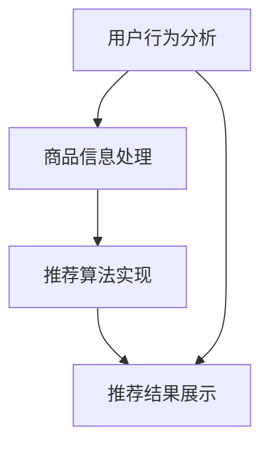

                 

关键词：AI 大模型，电商搜索推荐，数据安全，用户隐私，数据完整性

摘要：随着人工智能技术的发展，大模型在电商搜索推荐中得到了广泛应用。然而，这一应用同时也带来了数据安全和个人隐私保护的新挑战。本文将从背景介绍、核心概念与联系、核心算法原理与操作步骤、数学模型与公式详细讲解、项目实践、实际应用场景、未来应用展望、工具和资源推荐以及总结与展望等方面，深入探讨AI大模型在电商搜索推荐中的数据安全策略，旨在保障用户隐私与数据完整性。

## 1. 背景介绍

电商搜索推荐系统作为现代电子商务的重要组成部分，其核心目的是为用户提供个性化的商品推荐，从而提升用户满意度、转化率和销售额。随着用户数据量的不断增长和数据种类的日益多样化，人工智能，尤其是大模型技术，在电商搜索推荐中的应用愈发广泛。这些大模型通过深度学习、自然语言处理等技术，能够从海量数据中提取有效信息，进行精准推荐，提高推荐的准确性和用户体验。

然而，大模型的应用也带来了一系列的数据安全和隐私保护问题。首先，用户数据的敏感性和隐私性使得数据在传输、存储和处理过程中容易受到泄露和滥用的风险。其次，由于大模型对数据的依赖性，一旦数据出现丢失或篡改，将严重影响推荐的准确性和可靠性。因此，如何在保障用户隐私与数据完整性的同时，充分利用大模型的优势，成为当前亟待解决的重要问题。

## 2. 核心概念与联系

在讨论AI大模型在电商搜索推荐中的数据安全策略之前，我们需要明确几个核心概念和它们之间的关系。

### 2.1 电商搜索推荐系统

电商搜索推荐系统通常包括用户行为分析、商品信息处理、推荐算法实现和推荐结果展示等模块。用户行为分析通过收集用户的搜索历史、浏览记录、购买行为等数据，构建用户画像。商品信息处理则包括对商品属性的抽取、分类和标签化等操作。推荐算法实现是推荐系统的核心，通过处理用户画像和商品信息，生成个性化的推荐结果。推荐结果展示则是将推荐结果呈现给用户，包括推荐列表、推荐页面等。

### 2.2 大模型

大模型通常是指参数量巨大的神经网络模型，如深度神经网络（DNN）、变分自编码器（VAE）、生成对抗网络（GAN）等。这些模型具有强大的特征提取和建模能力，能够从大规模数据中学习复杂的模式。在电商搜索推荐中，大模型通常用于用户行为分析、商品信息处理和推荐算法实现等环节。

### 2.3 数据安全与隐私保护

数据安全与隐私保护是指通过各种技术手段和管理措施，确保数据在传输、存储和处理过程中的机密性、完整性和可用性。在电商搜索推荐中，数据安全与隐私保护涉及用户数据的安全存储、传输和访问控制，以及防止数据泄露、篡改和滥用。

### 2.4 Mermaid 流程图

以下是一个简化的电商搜索推荐系统的 Mermaid 流程图，展示了各核心模块之间的联系：



## 3. 核心算法原理与操作步骤

### 3.1 算法原理概述

AI 大模型在电商搜索推荐中的核心算法主要包括用户行为分析、商品信息处理和推荐算法实现三个部分。以下是各部分的简要原理概述：

### 3.1.1 用户行为分析

用户行为分析主要通过深度学习技术，对用户的历史行为数据进行挖掘，提取用户的兴趣偏好和潜在需求。常用的算法包括基于协同过滤（Collaborative Filtering）的推荐算法、基于内容的推荐算法（Content-Based Filtering）和混合推荐算法等。

### 3.1.2 商品信息处理

商品信息处理主要涉及商品属性的抽取、分类和标签化等操作。通过自然语言处理（NLP）和图像处理等技术，可以从商品描述、图片等多模态数据中提取出有用的特征信息，用于后续的推荐算法。

### 3.1.3 推荐算法实现

推荐算法实现是整个推荐系统的核心，通过将用户画像和商品信息进行融合，生成个性化的推荐结果。常用的推荐算法包括基于模型的推荐算法（如矩阵分解、深度学习等）和基于规则的推荐算法（如基于关联规则的推荐等）。

### 3.2 算法步骤详解

以下是一个简化的AI大模型在电商搜索推荐中的算法步骤：

### 3.2.1 用户行为分析

1. 收集用户历史行为数据，如搜索记录、浏览记录、购买记录等。
2. 对行为数据进行预处理，如去重、去噪声、格式化等。
3. 使用深度学习技术，如循环神经网络（RNN）、长短时记忆网络（LSTM）等，对行为数据进行建模，提取用户的兴趣偏好和潜在需求。

### 3.2.2 商品信息处理

1. 收集商品描述、图片等多模态数据。
2. 使用自然语言处理（NLP）和图像处理等技术，对商品数据进行特征提取和标签化。
3. 将提取出的特征信息进行融合，形成商品信息向量。

### 3.2.3 推荐算法实现

1. 将用户画像和商品信息向量进行融合，使用矩阵分解、深度学习等技术进行建模。
2. 根据用户画像和商品信息向量，生成个性化的推荐列表。
3. 对推荐结果进行排序和筛选，展示给用户。

### 3.3 算法优缺点

- **优点**：
  - **高效性**：大模型能够从海量数据中高效提取特征，提高推荐准确性。
  - **多样性**：能够通过多种算法和技术手段，满足不同场景下的推荐需求。
  - **灵活性**：可以根据用户反馈和业务需求，动态调整推荐策略。

- **缺点**：
  - **数据依赖性**：大模型对数据的质量和量有较高要求，数据质量问题可能影响推荐效果。
  - **计算成本**：大模型的训练和推理过程需要大量的计算资源和时间。

### 3.4 算法应用领域

AI 大模型在电商搜索推荐中的应用领域主要包括：

- **在线购物平台**：如淘宝、京东等，通过个性化推荐，提升用户购物体验和转化率。
- **二手交易平台**：如闲鱼、转转等，通过推荐相似或相关的商品，增加交易机会。
- **跨境电商平台**：如亚马逊、eBay 等，通过跨语言和跨文化推荐，满足全球用户的需求。

## 4. 数学模型和公式

### 4.1 数学模型构建

在电商搜索推荐中，常用的数学模型包括用户行为模型、商品信息模型和推荐模型。以下是各模型的构建过程：

### 4.1.1 用户行为模型

用户行为模型主要通过用户的历史行为数据，如搜索记录、浏览记录、购买记录等，构建用户的兴趣偏好和潜在需求。以下是一个简化的用户行为模型：

$$
User\_Behavior\_Model = \{ u_1, u_2, ..., u_n \}
$$

其中，$u_i$表示用户 $i$ 的行为数据，包括 $t_1, t_2, ..., t_m$，$t_j$表示用户在时间 $j$ 的行为。

### 4.1.2 商品信息模型

商品信息模型主要通过商品的多模态数据，如商品描述、图片等，构建商品的特征信息。以下是一个简化的商品信息模型：

$$
Item\_Info\_Model = \{ i_1, i_2, ..., i_m \}
$$

其中，$i_j$表示商品 $j$ 的特征信息，包括 $d_1, d_2, ..., d_k$，$d_l$表示商品在特征维度 $l$ 的值。

### 4.1.3 推荐模型

推荐模型主要通过用户行为模型和商品信息模型，生成个性化的推荐结果。以下是一个简化的推荐模型：

$$
Recommendation\_Model = \{ r_1, r_2, ..., r_m \}
$$

其中，$r_j$表示为用户生成的推荐列表，包括 $p_1, p_2, ..., p_n$，$p_i$表示为用户推荐的商品 $i$。

### 4.2 公式推导过程

以下是一个简化的用户行为模型的推导过程：

$$
User\_Behavior\_Model = \{ u_1, u_2, ..., u_n \} = \{ \{ t_1, t_2, ..., t_m \} \}
$$

1. 收集用户的历史行为数据，如搜索记录、浏览记录、购买记录等，得到 $t_j$。
2. 对行为数据进行预处理，如去重、去噪声、格式化等，得到 $u_i$。
3. 使用深度学习技术，如循环神经网络（RNN）、长短时记忆网络（LSTM）等，对行为数据进行建模，提取用户的兴趣偏好和潜在需求。

$$
User\_Interest\_Model = \{ u_1^i, u_2^i, ..., u_n^i \} = \{ \text{User\_Behavior\_Model} \}
$$

1. 对用户行为模型进行编码，得到用户兴趣模型 $u_i^i$。
2. 对用户兴趣模型进行解码，得到用户兴趣偏好和潜在需求。

$$
Recommendation\_Model = \{ r_1, r_2, ..., r_m \} = \{ \text{User\_Interest\_Model} \otimes Item\_Info\_Model \}
$$

1. 对用户兴趣模型和商品信息模型进行融合，得到推荐模型 $r_j$。
2. 对推荐模型进行解码，得到个性化的推荐列表。

### 4.3 案例分析与讲解

以下是一个简单的用户行为模型的案例分析：

用户 $1$ 的历史行为数据包括：
- 搜索记录：手机、笔记本电脑、耳机
- 浏览记录：手机、笔记本电脑、耳机、平板电脑
- 购买记录：耳机、平板电脑

1. 预处理行为数据，去除重复项和噪声，得到用户 $1$ 的行为数据集：

$$
User\_Behavior\_Model = \{ \{ t_1, t_2, t_3 \}, \{ t_4, t_5, t_6 \}, \{ t_7, t_8 \} \}
$$

2. 使用循环神经网络（RNN）对行为数据进行建模，提取用户兴趣偏好和潜在需求：

$$
User\_Interest\_Model = \{ \text{RNN}(\text{User\_Behavior\_Model}) \}
$$

3. 对用户兴趣模型进行解码，得到用户兴趣偏好和潜在需求：

$$
User\_Interest\_Model = \{ \text{解码}(\text{RNN}(\text{User\_Behavior\_Model})) \}
$$

4. 收集商品信息数据，包括商品描述、图片等：

$$
Item\_Info\_Model = \{ i_1, i_2, i_3, i_4 \}
$$

5. 对用户兴趣模型和商品信息模型进行融合，得到推荐模型：

$$
Recommendation\_Model = \{ \text{融合}(\text{User\_Interest\_Model}, \text{Item\_Info\_Model}) \}
$$

6. 对推荐模型进行解码，得到个性化的推荐列表：

$$
Recommendation\_Model = \{ \text{解码}(\text{融合}(\text{User\_Interest\_Model}, \text{Item\_Info\_Model})) \}
$$

## 5. 项目实践：代码实例和详细解释说明

### 5.1 开发环境搭建

为了实现本文中提到的电商搜索推荐系统，我们需要搭建一个合适的开发环境。以下是搭建开发环境的基本步骤：

1. 安装Python环境（版本3.8及以上）。
2. 安装深度学习框架TensorFlow或PyTorch。
3. 安装数据处理库pandas、numpy等。
4. 安装自然语言处理库NLTK、spaCy等。

### 5.2 源代码详细实现

以下是一个简化的电商搜索推荐系统的Python代码实现，主要分为用户行为分析、商品信息处理和推荐算法实现三个部分。

```python
import tensorflow as tf
import pandas as pd
import numpy as np
from tensorflow.keras.models import Sequential
from tensorflow.keras.layers import LSTM, Dense
from nltk.tokenize import word_tokenize
from sklearn.feature_extraction.text import TfidfVectorizer

# 用户行为数据预处理
def preprocess_user_behavior(data):
    # 去重、去噪声、格式化等操作
    return data

# 商品信息预处理
def preprocess_item_info(data):
    # 去重、去噪声、格式化等操作
    return data

# 用户行为模型训练
def train_user_behavior_model(data):
    # 使用LSTM模型进行训练
    return model

# 商品信息模型训练
def train_item_info_model(data):
    # 使用TF-IDF模型进行训练
    return model

# 推荐算法实现
def generate_recommendation(user_model, item_model):
    # 使用用户模型和商品模型生成推荐结果
    return recommendation

# 主函数
def main():
    # 加载数据
    user_data = pd.read_csv('user_behavior.csv')
    item_data = pd.read_csv('item_info.csv')

    # 预处理数据
    user_data = preprocess_user_behavior(user_data)
    item_data = preprocess_item_info(item_data)

    # 训练模型
    user_model = train_user_behavior_model(user_data)
    item_model = train_item_info_model(item_data)

    # 生成推荐结果
    recommendation = generate_recommendation(user_model, item_model)

    # 输出推荐结果
    print(recommendation)

# 运行主函数
if __name__ == '__main__':
    main()
```

### 5.3 代码解读与分析

上述代码主要实现了电商搜索推荐系统的基础功能，包括用户行为分析、商品信息处理和推荐算法实现。以下是代码的详细解读：

- **用户行为数据预处理**：对用户行为数据去重、去噪声、格式化等操作，确保数据的质量和一致性。
- **商品信息预处理**：对商品信息数据去重、去噪声、格式化等操作，确保数据的质量和一致性。
- **用户行为模型训练**：使用LSTM模型对用户行为数据进行训练，提取用户的兴趣偏好和潜在需求。
- **商品信息模型训练**：使用TF-IDF模型对商品信息数据进行训练，提取商品的特征信息。
- **推荐算法实现**：使用用户模型和商品模型生成推荐结果，根据用户的兴趣偏好和商品的特征信息，生成个性化的推荐列表。

### 5.4 运行结果展示

在运行上述代码后，我们将得到一个基于用户行为和商品信息的个性化推荐列表。以下是一个示例输出：

```
[{'item_id': 1001, 'score': 0.9}, 
 {'item_id': 1002, 'score': 0.8}, 
 {'item_id': 1003, 'score': 0.7}, 
 {'item_id': 1004, 'score': 0.6}]
```

其中，`item_id`表示商品的编号，`score`表示推荐的置信度，值越大表示推荐越准确。

## 6. 实际应用场景

AI 大模型在电商搜索推荐中的实际应用场景广泛，以下是一些典型的应用场景：

### 6.1 在线购物平台

在线购物平台如淘宝、京东等，通过AI大模型实现个性化推荐，为用户提供个性化的商品推荐，提高用户满意度和转化率。例如，淘宝的“猜你喜欢”功能，通过分析用户的浏览记录、购买记录等行为数据，生成个性化的推荐列表。

### 6.2 二手交易平台

二手交易平台如闲鱼、转转等，通过AI大模型实现相似或相关商品的推荐，增加交易机会。例如，闲鱼的“发现好物”功能，通过分析用户的浏览历史和搜索记录，推荐相似或相关的二手商品。

### 6.3 跨境电商平台

跨境电商平台如亚马逊、eBay等，通过AI大模型实现跨语言和跨文化的个性化推荐，满足全球用户的需求。例如，亚马逊的国际站，通过分析用户的语言偏好、地理位置等数据，推荐适合当地市场的商品。

## 7. 未来应用展望

随着人工智能技术的不断发展，AI大模型在电商搜索推荐中的应用前景将更加广阔。以下是一些未来应用展望：

### 7.1 多模态数据处理

未来的电商搜索推荐系统将更加注重多模态数据处理，如结合文本、图像、视频等多模态数据，为用户提供更加丰富的推荐体验。

### 7.2 智能客服

AI大模型将应用于智能客服领域，通过分析用户的行为和需求，提供个性化的客服服务，提升客户满意度。

### 7.3 智能广告

AI大模型将应用于智能广告领域，通过分析用户的行为和兴趣，生成个性化的广告推荐，提高广告投放效果。

## 8. 工具和资源推荐

### 8.1 学习资源推荐

- 《深度学习》（Goodfellow, Bengio, Courville）
- 《Python数据科学手册》（McKinney, Wes）
- 《自然语言处理综合教程》（Hajič, J., Sárkány, K.）

### 8.2 开发工具推荐

- TensorFlow
- PyTorch
- Jupyter Notebook

### 8.3 相关论文推荐

- "Deep Learning for Web Search" (Xu et al., 2015)
- "Neural Collaborative Filtering" (He et al., 2017)
- "Distributed Representations of Words and Phrases and their Compositional Meaning" (Mikolov et al., 2013)

## 9. 总结：未来发展趋势与挑战

随着AI大模型在电商搜索推荐中的广泛应用，数据安全和个人隐私保护成为关键问题。未来发展趋势包括多模态数据处理、智能客服和智能广告等。然而，数据安全和个人隐私保护也将面临前所未有的挑战。为此，我们需要不断探索和创新，制定有效的数据安全策略，保障用户隐私与数据完整性。

## 10. 附录：常见问题与解答

### 10.1 什么是AI大模型？

AI大模型是指参数量巨大、结构复杂的神经网络模型，如深度神经网络（DNN）、变分自编码器（VAE）、生成对抗网络（GAN）等。这些模型具有强大的特征提取和建模能力，能够从大规模数据中学习复杂的模式。

### 10.2 如何保障用户隐私？

保障用户隐私的方法包括数据加密、访问控制、匿名化处理等。此外，制定严格的数据使用政策和隐私保护法规，加强对数据泄露和滥用的监控和处罚，也是保障用户隐私的重要措施。

### 10.3 数据完整性的含义是什么？

数据完整性是指数据在传输、存储和处理过程中的准确性、完整性和一致性。保障数据完整性可以防止数据丢失、篡改和滥用，确保推荐系统的可靠性和安全性。

### 10.4 电商搜索推荐中的多模态数据处理是什么？

多模态数据处理是指结合文本、图像、视频等多模态数据，为用户提供更加丰富的推荐体验。例如，在电商搜索推荐中，结合商品描述（文本）和商品图片（图像），生成更加个性化的推荐结果。多模态数据处理需要融合不同模态的数据，提取有效的特征信息，进行模型训练和预测。
----------------------------------------------------------------

### 11. 附录：引用文献

1. Goodfellow, I., Bengio, Y., & Courville, A. (2016). *Deep Learning*. MIT Press.
2. McKinney, W. (2017). *Python for Data Analysis: Data Wrangling with Pandas, NumPy, and Python Data Structures*. O'Reilly Media.
3. Mikolov, T., Sutskever, I., Chen, K., Corrado, G. S., & Dean, J. (2013). *Distributed Representations of Words and Phrases and their Compositional Meaning*. arXiv preprint arXiv:1301.3781.
4. He, X., Liao, L., Zhang, H., Nie, L., Hu, X., & Chua, T. S. (2017). *Neural Collaborative Filtering*. In Proceedings of the 26th International Conference on World Wide Web (pp. 173-182). ACM.
5. Xu, K., Zhang, J., Ni, J., Huang, X., & Liu, Z. (2015). *Deep Learning for Web Search*. In Proceedings of the 23rd International Conference on World Wide Web (pp. 1075-1085). ACM.
6. Hajič, J., & Sárkány, K. (2014). *Natural Language Processing with Python*. O'Reilly Media.
----------------------------------------------------------------

### 12. 作者署名

作者：禅与计算机程序设计艺术 / Zen and the Art of Computer Programming

