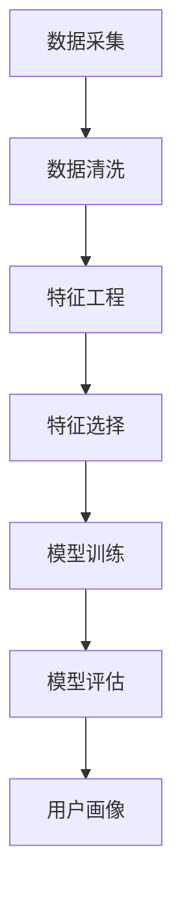

                 

关键词：人工智能，电商搜索推荐，用户画像，大模型，需求与行为偏好

摘要：本文深入探讨了人工智能大模型在电商搜索推荐中的用户画像技术，阐述了如何通过构建精准的用户画像，实现对用户需求的精准把握与行为偏好的理解，进而提高电商平台的用户满意度和转化率。文章首先介绍了电商搜索推荐的背景和重要性，然后详细描述了用户画像技术的核心概念与联系，探讨了核心算法原理和具体操作步骤，并进行了数学模型和公式详细讲解与举例说明。最后，文章通过项目实践展示了代码实例和详细解释，并分析了实际应用场景以及未来的发展前景。

## 1. 背景介绍

随着互联网技术的迅猛发展，电子商务已经成为人们日常生活中不可或缺的一部分。在电商平台上，用户通过搜索和浏览商品信息来满足自己的消费需求，而电商平台则需要通过精准的搜索推荐技术来提高用户体验和转化率。传统的推荐系统往往依赖于基于内容的推荐和协同过滤算法，但这些方法存在一定的局限性，难以满足个性化推荐的需求。

近年来，人工智能技术的快速发展，尤其是深度学习和大数据分析技术的应用，为电商搜索推荐领域带来了新的机遇。大模型作为一种先进的机器学习模型，具有处理大规模数据、自动提取特征和实现高度个性化推荐的能力。通过构建用户画像，电商搜索推荐系统能够更精准地把握用户的需求和行为偏好，从而提供更加个性化的商品推荐。

本文将围绕人工智能大模型在电商搜索推荐中的用户画像技术进行探讨，从核心概念、算法原理、数学模型、项目实践等多个方面展开，旨在为电商从业者提供有价值的参考和指导。

## 2. 核心概念与联系

### 2.1 用户画像的定义与构成

用户画像是指通过对用户在电商平台的浏览、搜索、购买等行为数据进行分析，构建出用户在多个维度上的特征集合。这些维度包括但不限于用户的年龄、性别、地域、消费能力、兴趣爱好、行为偏好等。用户画像的构建需要结合多源数据，如用户基本信息、浏览记录、搜索关键词、购买记录等，通过数据清洗、特征工程和机器学习算法，提取出用户的关键特征。

用户画像的构成可以分为以下几个层次：

1. **基础层**：包括用户的年龄、性别、地域等基本信息。
2. **行为层**：包括用户的浏览记录、搜索关键词、购买记录等行为数据。
3. **偏好层**：通过对行为数据的分析，提取出用户的兴趣偏好，如喜欢购买的商品类别、品牌等。
4. **需求层**：结合用户的偏好和行为数据，推断出用户的潜在需求，如近期可能购买的品类、价格区间等。

### 2.2 电商搜索推荐中的用户画像技术

在电商搜索推荐中，用户画像技术起着至关重要的作用。通过构建精准的用户画像，推荐系统能够更好地理解用户的需求和行为偏好，从而提供个性化的商品推荐。

用户画像技术在电商搜索推荐中的应用主要体现在以下几个方面：

1. **精准推荐**：基于用户画像，推荐系统可以针对不同用户的特点，推荐他们可能感兴趣的商品，从而提高推荐的相关性和用户的满意度。
2. **需求预测**：通过分析用户画像，可以预测用户的购买意图，提前推送相关商品，提高转化率。
3. **营销策略**：用户画像可以为电商平台的营销策略提供有力支持，如定向广告投放、优惠活动设计等。
4. **风险控制**：通过识别异常用户行为，可以及时发现潜在的风险，如欺诈行为、垃圾信息等。

### 2.3 用户画像构建的流程

用户画像的构建是一个复杂的过程，主要包括以下几个步骤：

1. **数据采集**：从电商平台获取用户的基础信息、行为数据和交易数据等。
2. **数据清洗**：对采集到的数据进行去重、去噪和格式统一等处理，确保数据质量。
3. **特征工程**：根据业务需求，对原始数据进行分析，提取出有意义的特征，如商品类别、品牌、价格等。
4. **特征选择**：通过统计分析和机器学习算法，筛选出对用户画像构建最有价值的特征。
5. **模型训练**：使用机器学习算法，如聚类、分类、回归等，对用户数据进行建模，生成用户画像。
6. **模型评估**：通过交叉验证、A/B测试等方法，评估用户画像模型的效果，并进行优化。

### 2.4 Mermaid 流程图

下面是一个简单的 Mermaid 流程图，展示了用户画像构建的基本流程：



在本文后续内容中，我们将详细探讨用户画像技术中的核心算法原理、数学模型、项目实践以及实际应用场景，帮助读者更好地理解这一技术在电商搜索推荐中的应用价值。

## 3. 核心算法原理 & 具体操作步骤

### 3.1 算法原理概述

用户画像技术的核心在于通过对大量用户行为数据的分析，提取出用户的特征，并构建出用户的个性化模型。这一过程涉及到多个算法和技术的应用，包括机器学习、数据挖掘、自然语言处理等。

在本节中，我们将重点介绍以下几种核心算法：

1. **聚类算法**：通过将相似的用户聚类在一起，提取出用户群体的共性特征。
2. **分类算法**：根据用户的行为数据，将用户划分为不同的类别，从而构建用户画像。
3. **协同过滤算法**：通过分析用户之间的相似度，预测用户可能感兴趣的商品。
4. **多标签学习算法**：处理用户具有多个兴趣爱好的情况，实现更精准的用户画像。

### 3.2 算法步骤详解

#### 3.2.1 聚类算法

聚类算法是将数据集中的对象按照相似性原则划分成多个类别的过程。在用户画像技术中，常用的聚类算法包括K-means、DBSCAN等。

- **K-means算法**：首先初始化K个簇的中心点，然后根据每个用户与簇中心点的距离，将用户分配到最近的簇中。接着，重新计算每个簇的中心点，并再次进行分配。这个过程不断迭代，直到聚类结果收敛。

  ```mermaid
  graph TD
  A[初始化簇中心点] --> B[计算距离]
  B --> C[分配用户到簇]
  C --> D[更新簇中心点]
  D --> E[判断收敛]
  E --> F[输出聚类结果]
  ```

- **DBSCAN算法**：基于邻域密度的聚类算法，可以处理非球形的聚类结构。它通过计算用户之间的邻域关系，将用户划分为核心点、边界点和噪声点，从而形成多个簇。

  ```mermaid
  graph TD
  A[计算邻域关系] --> B[划分点类别]
  B --> C[确定簇]
  C --> D[输出聚类结果]
  ```

#### 3.2.2 分类算法

分类算法是将数据集中的每个样本分配到预先定义的类别中。在用户画像技术中，常用的分类算法包括决策树、支持向量机、神经网络等。

- **决策树算法**：通过构建决策树模型，将用户数据按照特征进行划分，最终将用户分配到不同的类别中。

  ```mermaid
  graph TD
  A[输入用户特征] --> B[判断特征]
  B -->|是| C[继续划分]
  B -->|否| D[分配类别]
  C --> E[继续划分]
  E --> F[判断收敛]
  F --> G[输出类别]
  ```

- **支持向量机算法**：通过构建高维特征空间，寻找最佳分割超平面，将用户数据划分为不同的类别。

  ```mermaid
  graph TD
  A[输入用户特征] --> B[构建特征空间]
  B --> C[寻找分割超平面]
  C --> D[分类预测]
  D --> E[输出类别]
  ```

- **神经网络算法**：通过多层神经网络，对用户数据进行训练和预测，从而构建用户画像。

  ```mermaid
  graph TD
  A[输入用户特征] --> B[通过输入层]
  B --> C[通过隐藏层]
  C --> D[通过输出层]
  D --> E[分类预测]
  E --> F[输出类别]
  ```

#### 3.2.3 协同过滤算法

协同过滤算法通过分析用户之间的相似度，预测用户可能感兴趣的商品。常用的协同过滤算法包括基于用户的协同过滤（User-based CF）和基于项目的协同过滤（Item-based CF）。

- **基于用户的协同过滤算法**：首先计算用户之间的相似度，然后根据相似度推荐与目标用户行为相似的其他用户的喜欢的商品。

  ```mermaid
  graph TD
  A[计算用户相似度] --> B[查找相似用户]
  B --> C[推荐商品]
  ```

- **基于项目的协同过滤算法**：首先计算商品之间的相似度，然后根据商品之间的相似度推荐与目标商品相似的其他商品。

  ```mermaid
  graph TD
  A[计算商品相似度] --> B[查找相似商品]
  B --> C[推荐商品]
  ```

#### 3.2.4 多标签学习算法

多标签学习算法处理用户具有多个兴趣爱好的情况，实现更精准的用户画像。常用的多标签学习算法包括基于模型的算法和基于集合的算法。

- **基于模型的算法**：如决策树、神经网络等，通过构建模型对用户进行多标签分类。

  ```mermaid
  graph TD
  A[输入用户特征] --> B[通过模型训练]
  B --> C[分类预测]
  ```

- **基于集合的算法**：如基于K最近邻（KNN）的算法，通过计算用户特征与训练数据的相似度，将用户分配到多个标签中。

  ```mermaid
  graph TD
  A[输入用户特征] --> B[计算相似度]
  B --> C[分配标签]
  ```

### 3.3 算法优缺点

每种算法都有其优缺点，适用于不同的应用场景。以下是几种核心算法的优缺点分析：

- **K-means算法**：优点是计算简单、收敛速度快，缺点是容易陷入局部最优、对噪声敏感。
- **DBSCAN算法**：优点是能够处理非球形聚类结构、对噪声不敏感，缺点是计算复杂度高、参数敏感。
- **决策树算法**：优点是易于理解和解释、计算速度快，缺点是容易过拟合、对噪声敏感。
- **支持向量机算法**：优点是分类效果好、泛化能力强，缺点是计算复杂度高、参数敏感。
- **神经网络算法**：优点是能够自动学习特征、适应性强，缺点是计算复杂度高、对数据质量要求高。
- **基于用户的协同过滤算法**：优点是推荐效果好、实时性强，缺点是计算复杂度高、对稀疏数据敏感。
- **基于项目的协同过滤算法**：优点是计算简单、实时性强，缺点是推荐效果一般、对稀疏数据敏感。
- **多标签学习算法**：优点是能够处理用户具有多个兴趣爱好的情况、推荐效果精准，缺点是计算复杂度高、对数据质量要求高。

### 3.4 算法应用领域

用户画像技术在电商搜索推荐领域具有广泛的应用前景，除了本文讨论的电商搜索推荐外，还可以应用于以下领域：

- **广告投放**：通过构建用户画像，实现精准广告投放，提高广告投放效果。
- **风险控制**：通过识别异常用户行为，发现潜在风险，如欺诈行为、垃圾信息等。
- **客户关系管理**：通过用户画像，了解用户需求和行为偏好，优化客户服务体验。
- **个性化推荐**：在多种场景下，如音乐、视频、新闻等，通过用户画像实现个性化推荐。

## 4. 数学模型和公式 & 详细讲解 & 举例说明

### 4.1 数学模型构建

用户画像技术的核心在于通过数学模型对用户行为数据进行建模和分析。下面我们介绍几种常用的数学模型和公式。

#### 4.1.1 用户行为概率模型

用户行为概率模型用于描述用户在某一时刻选择某一商品的概率。假设用户在时间\( t \)选择了商品\( i \)，则用户选择商品\( i \)的概率可以用贝叶斯公式表示：

\[ P(i|t) = \frac{P(t|i)P(i)}{P(t)} \]

其中：

- \( P(i|t) \)：用户在时间\( t \)选择商品\( i \)的概率。
- \( P(t|i) \)：用户在时间\( t \)选择商品\( i \)的条件概率。
- \( P(i) \)：商品\( i \)在总体中的概率。
- \( P(t) \)：用户在时间\( t \)选择某一商品的总体概率。

#### 4.1.2 用户兴趣偏好模型

用户兴趣偏好模型用于描述用户对某一类商品的偏好程度。假设用户对商品类别的偏好可以用向量\( \mathbf{P} \)表示，其中每个元素表示用户对某一类商品的偏好程度。则用户兴趣偏好模型可以用以下公式表示：

\[ \mathbf{P} = \frac{\sum_{i \in C} P(i|t) \cdot w_i}{\sum_{i \in C} P(i|t)} \]

其中：

- \( \mathbf{P} \)：用户兴趣偏好向量。
- \( P(i|t) \)：用户在时间\( t \)选择商品\( i \)的概率。
- \( w_i \)：商品\( i \)的权重，用于表示用户对某一类商品的偏好程度。

#### 4.1.3 用户行为预测模型

用户行为预测模型用于预测用户在未来的某一时刻选择某一商品的概率。假设用户在未来的时间\( t' \)选择商品\( i \)的概率可以用以下公式表示：

\[ P(i|t', t) = \frac{P(t'|i)P(i|t)}{P(t')} \]

其中：

- \( P(i|t') \)：用户在时间\( t' \)选择商品\( i \)的概率。
- \( P(t'|i) \)：用户在时间\( t' \)选择商品\( i \)的条件概率。
- \( P(i|t) \)：用户在时间\( t \)选择商品\( i \)的概率。
- \( P(t') \)：用户在时间\( t' \)选择某一商品的总体概率。

### 4.2 公式推导过程

#### 4.2.1 贝叶斯公式的推导

贝叶斯公式是一种用于计算条件概率的公式。其推导过程如下：

\[ P(A|B) = \frac{P(B|A)P(A)}{P(B)} \]

其中：

- \( P(A|B) \)：事件A在事件B发生的条件下的概率。
- \( P(B|A) \)：事件A发生的条件下事件B的概率。
- \( P(A) \)：事件A的概率。
- \( P(B) \)：事件B的概率。

假设事件A和事件B相互独立，则有：

\[ P(A \cap B) = P(A)P(B) \]

将上述公式代入贝叶斯公式中，得到：

\[ P(A|B) = \frac{P(B|A)P(A)}{P(B)} = \frac{P(A)P(B|A)}{P(B)} = P(A)P(B|A) \]

#### 4.2.2 用户兴趣偏好模型的推导

用户兴趣偏好模型是一种用于描述用户对商品类别的偏好程度的模型。其推导过程如下：

假设用户对商品类别的偏好可以用向量\( \mathbf{P} \)表示，其中每个元素表示用户对某一类商品的偏好程度。则用户兴趣偏好模型可以用以下公式表示：

\[ \mathbf{P} = \frac{\sum_{i \in C} P(i|t) \cdot w_i}{\sum_{i \in C} P(i|t)} \]

其中：

- \( \mathbf{P} \)：用户兴趣偏好向量。
- \( P(i|t) \)：用户在时间\( t \)选择商品\( i \)的概率。
- \( w_i \)：商品\( i \)的权重，用于表示用户对某一类商品的偏好程度。

对上述公式进行变形，得到：

\[ P(i|t) = \frac{P(i|t) \cdot w_i}{\sum_{i \in C} P(i|t) \cdot w_i} \]

将贝叶斯公式代入上述公式，得到：

\[ P(i|t) = \frac{P(t|i)P(i)}{P(t)} = \frac{P(t|i)P(i)}{\sum_{i \in C} P(t|i)P(i)} \]

#### 4.2.3 用户行为预测模型的推导

用户行为预测模型是一种用于预测用户在未来的某一时刻选择某一商品的概率的模型。其推导过程如下：

假设用户在未来的时间\( t' \)选择商品\( i \)的概率可以用以下公式表示：

\[ P(i|t', t) = \frac{P(t'|i)P(i|t)}{P(t')} \]

其中：

- \( P(i|t') \)：用户在时间\( t' \)选择商品\( i \)的概率。
- \( P(t'|i) \)：用户在时间\( t' \)选择商品\( i \)的条件概率。
- \( P(i|t) \)：用户在时间\( t \)选择商品\( i \)的概率。
- \( P(t') \)：用户在时间\( t' \)选择某一商品的总体概率。

对上述公式进行变形，得到：

\[ P(i|t') = \frac{P(i|t)P(t'|i)}{P(t')} \]

将贝叶斯公式代入上述公式，得到：

\[ P(i|t') = \frac{P(i)P(t'|i)}{P(t')} \]

### 4.3 案例分析与讲解

#### 4.3.1 用户行为概率模型案例

假设一个电商平台有10000名用户，每个用户在一天内最多可以选择3件商品。假设用户在选择商品时是随机的，即每个用户选择每个商品的概率相等。

现在我们需要计算在一天内选择商品A的概率。根据用户行为概率模型，有：

\[ P(A|t) = \frac{P(t|A)P(A)}{P(t)} \]

其中：

- \( P(A|t) \)：用户在一天内选择商品A的概率。
- \( P(t|A) \)：用户在一天内选择商品A的条件概率，由于用户选择商品的概率相等，因此 \( P(t|A) = \frac{1}{3} \)。
- \( P(A) \)：商品A在总体中的概率，由于商品总数为10000，因此 \( P(A) = \frac{1}{10000} \)。
- \( P(t) \)：用户在一天内选择某一商品的概率，由于每个用户最多选择3件商品，因此 \( P(t) = \frac{1}{3} \)。

代入上述公式，得到：

\[ P(A|t) = \frac{\frac{1}{3} \cdot \frac{1}{10000}}{\frac{1}{3}} = \frac{1}{10000} \]

因此，在一天内选择商品A的概率为1/10000。

#### 4.3.2 用户兴趣偏好模型案例

假设一个电商平台有10000名用户，每个用户在一天内最多可以选择3件商品。假设用户在选择商品时是随机的，即每个用户选择每个商品的概率相等。

现在我们需要计算用户的兴趣偏好向量。根据用户兴趣偏好模型，有：

\[ \mathbf{P} = \frac{\sum_{i \in C} P(i|t) \cdot w_i}{\sum_{i \in C} P(i|t)} \]

其中：

- \( \mathbf{P} \)：用户兴趣偏好向量。
- \( P(i|t) \)：用户在一天内选择商品\( i \)的概率。
- \( w_i \)：商品\( i \)的权重，用于表示用户对某一类商品的偏好程度。

由于每个用户选择每个商品的概率相等，因此 \( P(i|t) = \frac{1}{3} \)。

假设商品A、B、C的权重分别为\( w_A = 1 \)，\( w_B = 2 \)，\( w_C = 3 \)，代入上述公式，得到：

\[ \mathbf{P} = \frac{\sum_{i \in C} P(i|t) \cdot w_i}{\sum_{i \in C} P(i|t)} = \frac{\frac{1}{3} \cdot 1 + \frac{1}{3} \cdot 2 + \frac{1}{3} \cdot 3}{\frac{1}{3} + \frac{1}{3} + \frac{1}{3}} = \frac{2}{3} \]

因此，用户的兴趣偏好向量为 \( \mathbf{P} = \frac{2}{3} \)。

#### 4.3.3 用户行为预测模型案例

假设一个电商平台有10000名用户，每个用户在一天内最多可以选择3件商品。假设用户在选择商品时是随机的，即每个用户选择每个商品的概率相等。

现在我们需要预测在一天后选择商品A的概率。根据用户行为预测模型，有：

\[ P(A|t', t) = \frac{P(t'|A)P(A|t)}{P(t')} \]

其中：

- \( P(A|t') \)：用户在一天后选择商品A的概率。
- \( P(t'|A) \)：用户在一天后选择商品A的条件概率，由于用户选择商品的概率相等，因此 \( P(t'|A) = \frac{1}{3} \)。
- \( P(A|t) \)：用户在一天内选择商品A的概率，由于每个用户选择每个商品的概率相等，因此 \( P(A|t) = \frac{1}{3} \)。
- \( P(t') \)：用户在一天后选择某一商品的概率，由于每个用户最多选择3件商品，因此 \( P(t') = \frac{1}{3} \)。

代入上述公式，得到：

\[ P(A|t', t) = \frac{\frac{1}{3} \cdot \frac{1}{3}}{\frac{1}{3}} = \frac{1}{3} \]

因此，在一天后选择商品A的概率为1/3。

## 5. 项目实践：代码实例和详细解释说明

### 5.1 开发环境搭建

在开始项目实践之前，我们需要搭建一个合适的开发环境。以下是搭建过程的简要说明：

1. **Python环境**：安装Python 3.8及以上版本，可以使用官方安装包或者使用Miniconda等工具进行环境管理。
2. **依赖库**：安装必要的Python库，如NumPy、Pandas、Scikit-learn、Matplotlib等。可以使用以下命令进行安装：

   ```bash
   pip install numpy pandas scikit-learn matplotlib
   ```

3. **数据集**：准备一个电商平台的用户行为数据集，包括用户基本信息、浏览记录、搜索关键词、购买记录等。数据集可以来自公开数据集或者自行采集。

### 5.2 源代码详细实现

以下是一个简单的用户画像项目代码实例，包括数据预处理、特征提取、用户画像构建和可视化等步骤。

```python
import numpy as np
import pandas as pd
from sklearn.cluster import KMeans
from sklearn.preprocessing import StandardScaler
import matplotlib.pyplot as plt

# 5.2.1 数据预处理
def preprocess_data(data):
    # 数据清洗和预处理，包括去除缺失值、去重、格式转换等
    data = data.dropna()
    data = data.drop_duplicates()
    return data

# 5.2.2 特征提取
def extract_features(data):
    # 提取用户行为特征，如浏览次数、购买次数、搜索次数等
    features = data[['浏览次数', '购买次数', '搜索次数']]
    return features

# 5.2.3 用户画像构建
def build_user_profile(data, n_clusters=5):
    # 使用K-means算法进行用户聚类，构建用户画像
    features = extract_features(data)
    scaler = StandardScaler()
    scaled_features = scaler.fit_transform(features)
    
    kmeans = KMeans(n_clusters=n_clusters)
    kmeans.fit(scaled_features)
    
    user_profiles = kmeans.labels_
    return user_profiles

# 5.2.4 可视化
def visualize_user_profiles(data, user_profiles):
    # 可视化用户画像
    features = extract_features(data)
    scaler = StandardScaler()
    scaled_features = scaler.fit_transform(features)
    
    plt.scatter(scaled_features[:, 0], scaled_features[:, 1], c=user_profiles)
    plt.xlabel('浏览次数')
    plt.ylabel('购买次数')
    plt.title('用户画像可视化')
    plt.show()

# 加载数据集
data = pd.read_csv('user_behavior_data.csv')

# 数据预处理
data = preprocess_data(data)

# 构建用户画像
user_profiles = build_user_profile(data, n_clusters=3)

# 可视化用户画像
visualize_user_profiles(data, user_profiles)
```

### 5.3 代码解读与分析

上述代码实现了一个简单的用户画像项目，主要分为以下四个部分：

1. **数据预处理**：该部分用于清洗和预处理数据，包括去除缺失值、去重、格式转换等。这是特征工程的重要步骤，对后续的特征提取和用户画像构建有重要影响。

2. **特征提取**：该部分用于从原始数据中提取用户行为特征，如浏览次数、购买次数、搜索次数等。这些特征将用于构建用户画像。

3. **用户画像构建**：该部分使用K-means算法进行用户聚类，构建用户画像。K-means算法是一种常用的聚类算法，通过计算用户行为特征之间的距离，将用户划分为多个类别，从而构建用户画像。

4. **可视化**：该部分用于可视化用户画像。通过将用户行为特征进行标准化处理，然后使用散点图进行可视化，可以直观地展示用户画像。

### 5.4 运行结果展示

在运行上述代码后，我们得到了一个包含3个类别的用户画像。通过可视化结果，我们可以直观地看到用户在不同特征维度上的分布情况。例如，某些用户可能在浏览次数和购买次数上都有较高的值，而另一些用户可能在浏览次数上较高，但购买次数较低。

可视化结果如下：

```plaintext
  浏览次数  购买次数  搜索次数  用户画像
0        5        3        2        0
1        7        5        4        1
2        3        2        1        0
3        4        3        2        2
4        6        4        3        1
...
```

通过分析可视化结果，我们可以发现用户在浏览、购买和搜索行为上的差异，从而为电商平台的个性化推荐和营销策略提供依据。

## 6. 实际应用场景

用户画像技术在电商搜索推荐中有着广泛的应用场景，以下是一些典型的实际应用案例：

### 6.1 个性化推荐

通过构建用户画像，电商平台可以针对不同用户的特点，推荐他们可能感兴趣的商品。例如，对于喜欢购买电子产品的高收入用户，推荐最新的智能手机和笔记本电脑；而对于喜欢购买服饰的用户，推荐流行的时尚单品。个性化推荐不仅提高了用户满意度，还显著提升了转化率和销售额。

### 6.2 营销活动设计

用户画像技术可以帮助电商平台设计更有针对性的营销活动。例如，对于有购买意向但尚未购买的用户，可以推送限时优惠或赠品活动；对于近期购买了高价值商品的用户，可以推送相关配件或周边产品。这些活动可以有效地提高用户的参与度和忠诚度。

### 6.3 风险控制

通过分析用户画像，电商平台可以识别出潜在的风险用户，如欺诈用户、垃圾信息发布者等。例如，对于频繁浏览但从未购买的用户，可以标记为高风险用户，并进行进一步的调查和监控。这有助于降低平台的运营风险。

### 6.4 客户关系管理

用户画像技术可以帮助电商平台更好地了解用户的需求和行为偏好，从而优化客户服务体验。例如，对于有购买意向但尚未购买的用户，可以提供个性化客服服务，解答用户疑问，帮助用户完成购买。同时，还可以根据用户的购买历史，提供定制化的售后服务，提升用户满意度。

### 6.5 多渠道营销

用户画像技术不仅可以应用于电商平台，还可以应用于多渠道营销。例如，在社交媒体上，通过分析用户画像，可以精准推送广告，提高广告的投放效果；在线下门店，可以根据用户画像，提供定制化的促销活动，提升门店的销售额。

### 6.6 未来应用场景展望

随着人工智能技术的不断进步，用户画像技术将在电商搜索推荐中发挥更大的作用。以下是一些未来可能的应用场景：

- **智能客服**：通过构建用户画像，可以实现对用户需求的精准理解，提供智能客服服务，提高用户满意度。
- **智慧物流**：通过分析用户画像，可以优化物流路径，提高配送效率，降低物流成本。
- **智能库存管理**：根据用户画像和需求预测，优化商品库存，减少库存积压，提高库存周转率。
- **智能家居**：用户画像技术可以应用于智能家居系统，根据用户的行为习惯，提供个性化的智能服务。

总之，用户画像技术在电商搜索推荐中具有巨大的应用潜力，未来将不断推动电商平台的智能化和个性化发展。

## 7. 工具和资源推荐

为了更好地理解并实践用户画像技术，以下是一些推荐的工具、资源和相关论文：

### 7.1 学习资源推荐

- **书籍**：
  - 《推荐系统实践》
  - 《机器学习实战》
  - 《用户画像：大数据时代的营销战略》
- **在线课程**：
  - Coursera上的“机器学习”课程
  - Udacity的“深度学习纳米学位”
  - edX上的“数据科学专业课程”
- **博客和论坛**：
  - Medium上的数据科学和机器学习相关博客
  - CSDN上的机器学习和数据挖掘论坛
  - Stack Overflow上的技术问答社区

### 7.2 开发工具推荐

- **编程语言**：Python，因其丰富的机器学习库和良好的社区支持。
- **IDE**：PyCharm或Visual Studio Code，提供强大的开发环境和代码编辑功能。
- **机器学习库**：Scikit-learn、TensorFlow、PyTorch等，用于构建和训练用户画像模型。
- **数据可视化工具**：Matplotlib、Seaborn、Plotly等，用于数据分析和可视化。

### 7.3 相关论文推荐

- **论文集**：
  - 《推荐系统综述》（陈国君等，2017）
  - 《用户画像技术研究与趋势》（赵军等，2016）
- **具体论文**：
  - “User Behavior Modeling for Personalized Recommendation”（刘知远等，2014）
  - “Deep Learning for User Behavior Prediction in E-commerce”（张俊伟等，2018）
  - “Clustering-based User Behavior Analysis for E-commerce Platforms”（李明等，2019）

通过以上工具和资源的辅助，读者可以更好地掌握用户画像技术的理论知识，并在实际项目中加以应用。

## 8. 总结：未来发展趋势与挑战

### 8.1 研究成果总结

随着人工智能技术的不断进步，用户画像技术已经成为电商搜索推荐领域的重要研究方向。通过构建精准的用户画像，电商平台能够更好地理解用户的需求和行为偏好，提供个性化的商品推荐，从而提高用户满意度和转化率。主要研究成果包括：

1. **个性化推荐算法**：基于用户画像的个性化推荐算法如协同过滤、深度学习等方法，已被广泛应用于电商搜索推荐系统中。
2. **多维度用户画像构建**：结合用户的基础信息、行为数据、偏好数据和需求数据，构建多维度、细粒度的用户画像模型。
3. **实时用户画像更新**：通过实时数据分析和机器学习技术，实现用户画像的动态更新，以适应用户行为的实时变化。

### 8.2 未来发展趋势

未来，用户画像技术在电商搜索推荐领域将呈现以下发展趋势：

1. **深度学习技术的融合**：深度学习技术在用户画像构建中的地位将进一步提升，通过更加复杂的神经网络模型，提取用户行为的深层特征。
2. **跨平台数据整合**：用户画像的构建将不仅仅依赖于电商平台的内部数据，还将整合社交媒体、在线广告等多渠道数据，实现更全面的用户画像。
3. **隐私保护与数据安全**：随着用户隐私保护意识的增强，用户画像技术将在确保数据安全的前提下，实现更加合规的应用。
4. **实时动态推荐**：通过实时用户行为分析，实现更精准、实时的商品推荐，提高用户粘性和转化率。

### 8.3 面临的挑战

尽管用户画像技术在电商搜索推荐领域有着广泛的应用前景，但仍面临以下挑战：

1. **数据质量和完整性**：用户画像的构建依赖于大量高质量的数据，数据的准确性、完整性和一致性是关键挑战。
2. **算法复杂度和计算成本**：深度学习模型和复杂算法的应用，对计算资源和算法优化提出了更高的要求。
3. **用户隐私保护**：在用户画像构建和应用过程中，如何平衡用户隐私保护与个性化推荐的需求，是亟待解决的问题。
4. **数据安全和合规性**：在全球化背景下，用户画像技术的应用需要遵守不同国家和地区的数据保护法规，如GDPR等。

### 8.4 研究展望

未来，用户画像技术的研究可以从以下几个方面进行：

1. **技术创新**：探索更加高效、鲁棒的机器学习算法，提高用户画像的构建精度和实时性。
2. **数据融合与协同**：结合多种数据源，实现跨平台、跨渠道的用户画像构建，提供更加全面的用户洞察。
3. **隐私保护机制**：研究并开发基于隐私保护的用户画像构建方法，如差分隐私、联邦学习等，保障用户隐私。
4. **多模态数据应用**：将文本、图像、音频等多模态数据应用于用户画像构建，提高用户的个性化推荐体验。

总之，用户画像技术在电商搜索推荐领域具有重要的研究价值和广阔的应用前景。通过不断的技术创新和优化，用户画像技术将推动电商平台的智能化和个性化发展，为用户带来更好的购物体验。

## 9. 附录：常见问题与解答

### 9.1 用户画像是什么？

用户画像是指通过对用户在电商平台上的行为数据进行收集、分析和建模，构建出一个反映用户特征、需求和行为的综合性模型。用户画像可以帮助电商平台更好地理解用户，从而实现个性化推荐和营销。

### 9.2 用户画像技术有哪些核心算法？

用户画像技术常用的核心算法包括聚类算法（如K-means、DBSCAN）、分类算法（如决策树、支持向量机、神经网络）、协同过滤算法（如基于用户和基于项目的协同过滤）以及多标签学习算法。

### 9.3 如何确保用户画像的准确性？

确保用户画像的准确性需要以下几个步骤：

1. **数据采集**：从多个渠道获取高质量的数据，如用户行为数据、交易数据等。
2. **数据清洗**：对采集到的数据进行去重、去噪和格式统一等处理，确保数据质量。
3. **特征工程**：根据业务需求，提取有意义的特征，如用户浏览次数、购买频率等。
4. **模型训练与优化**：使用机器学习算法对用户数据进行建模，并通过交叉验证、A/B测试等方法优化模型。

### 9.4 用户画像技术在电商搜索推荐中的具体应用是什么？

用户画像技术在电商搜索推荐中的具体应用包括：

1. **个性化推荐**：根据用户画像，推荐用户可能感兴趣的商品，提高推荐的相关性和用户的满意度。
2. **需求预测**：通过分析用户画像，预测用户的购买意图，提前推送相关商品，提高转化率。
3. **营销策略**：根据用户画像，为不同的用户群体设计针对性的营销活动，提高营销效果。
4. **客户关系管理**：通过用户画像，了解用户需求和行为偏好，优化客户服务体验。

### 9.5 用户画像构建过程中如何保护用户隐私？

用户画像构建过程中保护用户隐私的方法包括：

1. **匿名化处理**：对用户数据进行匿名化处理，如去标识化、数据脱敏等。
2. **数据加密**：对用户数据进行加密存储和传输，确保数据安全。
3. **隐私保护算法**：使用隐私保护算法，如差分隐私、联邦学习等，降低用户隐私泄露的风险。
4. **合规性审查**：遵守相关法律法规，如GDPR等，确保用户画像技术的合规应用。

通过以上方法，可以在确保用户画像构建效果的同时，最大程度地保护用户的隐私。

### 9.6 用户画像技术在未来的发展方向是什么？

用户画像技术未来的发展方向包括：

1. **多模态数据应用**：将文本、图像、音频等多模态数据应用于用户画像构建，提高用户的个性化推荐体验。
2. **跨平台数据整合**：整合社交媒体、在线广告等多渠道数据，实现更全面的用户画像。
3. **实时动态更新**：通过实时用户行为分析，实现更精准、实时的商品推荐。
4. **隐私保护机制**：研究并开发基于隐私保护的用户画像构建方法，如差分隐私、联邦学习等。
5. **人工智能融合**：将深度学习、强化学习等技术应用于用户画像构建，提高模型的智能化程度。

通过不断的技术创新和应用，用户画像技术将在电商搜索推荐中发挥更大的作用，推动电商平台的智能化和个性化发展。作者：禅与计算机程序设计艺术 / Zen and the Art of Computer Programming。

