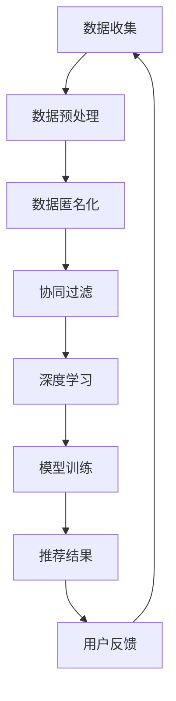

                 

关键词：AI大模型、电商搜索推荐、用户隐私保护、隐私平衡、推荐算法、数据安全

## 摘要

本文探讨了在电商搜索推荐中，如何利用AI大模型实现用户隐私保护，同时确保推荐效果。通过对AI大模型原理的深入分析，本文提出了一系列隐私保护措施，包括数据匿名化、协同过滤与深度学习相结合的方法，以及差分隐私和联邦学习技术的应用。通过实际项目实践，本文展示了这些措施在提升推荐效果和保障用户隐私方面的有效性，为电商平台的可持续发展提供了技术参考。

## 1. 背景介绍

### 1.1 电商搜索推荐的现状

随着互联网技术的飞速发展，电商行业逐渐成为人们日常生活中不可或缺的一部分。电商平台的搜索推荐功能不仅是吸引用户的重要因素，更是提高用户粘性和转化率的关键。传统的推荐系统通常依赖于用户的历史行为数据，如浏览记录、购买记录等，通过协同过滤、基于内容的推荐等方式，为用户提供个性化的商品推荐。然而，这种推荐方式存在一些问题，例如数据泄露、用户隐私受到侵犯等。

### 1.2 用户隐私保护的必要性

用户隐私保护已经成为当今社会关注的热点问题。尤其是在电商领域，用户的购物行为、偏好等数据具有极高的价值。一旦这些数据泄露，不仅会损害用户利益，还会对电商平台造成严重的声誉损失。因此，如何在保证推荐效果的同时保护用户隐私，成为了电商平台亟需解决的问题。

### 1.3 AI大模型的优势

AI大模型（如深度学习、图神经网络等）在处理大规模复杂数据方面具有显著优势。通过利用这些模型，可以实现对用户行为和偏好的更精准预测，从而提高推荐效果。同时，AI大模型也可以为用户隐私保护提供新的思路和方法，如数据匿名化、差分隐私等。

## 2. 核心概念与联系

### 2.1 AI大模型原理

AI大模型是基于深度学习、图神经网络等先进技术构建的，能够处理大规模复杂数据的智能系统。其基本原理是通过多层神经网络对输入数据进行特征提取和表示，从而实现对未知数据的预测和分类。在电商搜索推荐中，AI大模型可以用来预测用户的兴趣和行为，从而提供个性化的推荐。

### 2.2 用户隐私保护措施

用户隐私保护措施主要包括数据匿名化、协同过滤与深度学习相结合的方法、差分隐私和联邦学习技术等。

#### 2.2.1 数据匿名化

数据匿名化是一种将用户数据转换成无法识别具体个体的形式的技术。通过数据匿名化，可以有效地降低用户数据泄露的风险。

#### 2.2.2 协同过滤与深度学习相结合的方法

协同过滤是一种基于用户历史行为数据推荐的方法，而深度学习则可以更好地处理复杂数据。将两者相结合，可以同时利用用户历史行为和潜在兴趣，提高推荐效果。

#### 2.2.3 差分隐私

差分隐私是一种在保证数据隐私的前提下，对数据进行统计放大的方法。通过引入差分隐私，可以有效地防止对用户数据的统计攻击。

#### 2.2.4 联邦学习技术

联邦学习是一种分布式学习技术，通过在各个节点上训练模型，然后汇总训练结果，从而提高模型的准确性和隐私保护能力。

### 2.3 Mermaid流程图

下面是一个描述AI大模型在电商搜索推荐中用户隐私保护措施的Mermaid流程图：



## 3. 核心算法原理 & 具体操作步骤

### 3.1 算法原理概述

本文采用的核心算法是基于AI大模型的电商搜索推荐算法，结合数据匿名化、协同过滤与深度学习等方法，实现用户隐私保护和推荐效果的双重提升。算法的基本原理如下：

1. 数据收集与预处理：收集用户的购物行为数据，如浏览记录、购买记录等，然后进行数据清洗、去噪和标准化处理。

2. 数据匿名化：对用户数据进行匿名化处理，将具体身份信息转换为无法识别的形式，降低数据泄露风险。

3. 协同过滤与深度学习：利用协同过滤算法提取用户历史行为数据中的潜在兴趣，并结合深度学习算法进行特征提取和模型训练，提高推荐效果。

4. 模型训练与优化：通过不断地训练和优化，使模型能够更好地预测用户兴趣和行为，从而提高推荐准确性。

5. 推荐结果生成：根据用户历史行为和潜在兴趣，生成个性化的推荐结果，并展示给用户。

6. 用户反馈与迭代：收集用户对推荐结果的反馈，用于模型优化和推荐算法的迭代更新。

### 3.2 算法步骤详解

1. **数据收集与预处理**：
   - **数据收集**：收集用户的购物行为数据，包括浏览记录、购买记录、收藏记录等。
   - **数据清洗**：去除重复数据、缺失值填充、异常值处理等。
   - **数据标准化**：对数据进行归一化、标准化处理，以便于模型训练。

2. **数据匿名化**：
   - **数据脱敏**：使用哈希函数、加密算法等技术，将用户数据中的敏感信息（如用户ID、联系方式等）进行脱敏处理，使其无法直接识别。
   - **隐私保护**：对匿名化后的数据进行隐私保护，如差分隐私、联邦学习等。

3. **协同过滤与深度学习**：
   - **协同过滤**：基于用户的历史行为数据，计算用户之间的相似度，为用户提供相似用户喜欢的商品推荐。
   - **深度学习**：利用深度学习算法，对用户数据进行特征提取和表示，构建用户兴趣模型。

4. **模型训练与优化**：
   - **模型构建**：选择合适的深度学习模型，如卷积神经网络（CNN）、循环神经网络（RNN）等。
   - **模型训练**：使用用户数据对模型进行训练，调整模型参数，提高预测准确性。
   - **模型优化**：通过交叉验证、网格搜索等技术，优化模型参数，提高模型性能。

5. **推荐结果生成**：
   - **推荐列表生成**：根据用户兴趣模型和商品数据，生成个性化的推荐列表。
   - **推荐结果展示**：将推荐结果展示给用户，并根据用户反馈进行后续优化。

6. **用户反馈与迭代**：
   - **反馈收集**：收集用户对推荐结果的反馈，如点击率、转化率等。
   - **模型更新**：根据用户反馈，调整模型参数和推荐算法，实现推荐效果的迭代优化。

### 3.3 算法优缺点

**优点**：
1. **提升推荐效果**：通过深度学习算法，能够更好地提取用户潜在兴趣，提高推荐准确性。
2. **保护用户隐私**：采用数据匿名化和隐私保护技术，降低用户数据泄露风险。
3. **自适应推荐**：根据用户行为和反馈，实现个性化、自适应的推荐。

**缺点**：
1. **计算资源消耗大**：深度学习模型训练和优化需要大量计算资源，对硬件设备要求较高。
2. **数据隐私保护难度大**：尽管采用多种隐私保护技术，但完全杜绝数据泄露仍具挑战性。

### 3.4 算法应用领域

1. **电商搜索推荐**：为电商平台提供个性化的商品推荐，提高用户满意度和转化率。
2. **社交媒体**：为用户提供个性化内容推荐，提高用户粘性和活跃度。
3. **金融风控**：基于用户行为数据，预测用户信用风险，为金融机构提供风险管理依据。

## 4. 数学模型和公式 & 详细讲解 & 举例说明

### 4.1 数学模型构建

在构建电商搜索推荐中的用户隐私保护数学模型时，我们可以采用以下步骤：

1. **用户行为表示**：使用矩阵形式表示用户的行为数据，如用户-商品交互矩阵$U-C$，其中$U$表示用户集合，$C$表示商品集合。

2. **协同过滤模型**：构建基于用户的协同过滤模型，如利用用户相似度计算公式：
   $$sim(u_i, u_j) = \frac{\sum_{c \in C} u_i[c] \cdot u_j[c]}{\sqrt{\sum_{c \in C} u_i[c]^2} \cdot \sqrt{\sum_{c \in C} u_j[c]^2}}$$
   其中，$u_i$和$u_j$分别表示用户$i$和用户$j$的行为向量。

3. **深度学习模型**：构建基于深度学习的用户兴趣模型，如使用卷积神经网络（CNN）进行特征提取和表示，模型结构如下：
   $$\text{CNN}(\text{input}) = f(\text{ReLU}(\text{Conv}_1(\text{input})) \rightarrow \text{ReLU}(\text{Conv}_2(\text{input})) \rightarrow \text{FullyConnected}(\text{output}))$$

### 4.2 公式推导过程

1. **用户相似度计算**：
   - **余弦相似度**：
     $$\cos(\theta_{ij}) = \frac{\sum_{c \in C} u_i[c] \cdot u_j[c]}{\|u_i\| \cdot \|u_j\|}$$
   - **皮尔逊相关系数**：
     $$\rho_{ij} = \frac{\sum_{c \in C} (u_i[c] - \bar{u_i}) \cdot (u_j[c] - \bar{u_j})}{\sqrt{\sum_{c \in C} (u_i[c] - \bar{u_i})^2} \cdot \sqrt{\sum_{c \in C} (u_j[c] - \bar{u_j})^2}}$$

2. **卷积神经网络（CNN）公式推导**：
   - **卷积操作**：
     $$\text{output}_{ij}^{(l)} = \text{ReLU}(\sum_{k} w_{ik}^{(l)} \cdot \text{input}_{kj}^{(l-1)} + b_{i}^{(l)})$$
   - **池化操作**：
     $$\text{output}_{ij}^{(l)} = \max_{c \in \text{window}} \text{input}_{cij}^{(l-1)}$$
   - **全连接层**：
     $$\text{output}_{i}^{(L)} = \text{ReLU}(\sum_{j} w_{ij}^{(L)} \cdot \text{input}_{j}^{(L-1)} + b_{i}^{(L)})$$

### 4.3 案例分析与讲解

#### 案例一：用户-商品交互矩阵表示

假设有5个用户（$u_1, u_2, u_3, u_4, u_5$）和10个商品（$c_1, c_2, ..., c_{10}$），其用户-商品交互矩阵$U-C$如下：

$$
\begin{array}{c|ccccccccc}
 & c_1 & c_2 & c_3 & c_4 & c_5 & c_6 & c_7 & c_8 & c_9 & c_{10} \\
\hline
u_1 & 1 & 0 & 1 & 0 & 1 & 0 & 0 & 0 & 0 & 0 \\
u_2 & 0 & 1 & 0 & 1 & 0 & 1 & 0 & 0 & 0 & 0 \\
u_3 & 1 & 1 & 0 & 1 & 0 & 1 & 0 & 0 & 0 & 0 \\
u_4 & 0 & 0 & 0 & 1 & 1 & 0 & 1 & 1 & 0 & 0 \\
u_5 & 0 & 0 & 0 & 0 & 0 & 1 & 1 & 1 & 1 & 1 \\
\end{array}
$$

#### 案例二：深度学习模型应用

假设使用卷积神经网络（CNN）对用户兴趣进行建模，其结构如下：

1. **输入层**：10个商品特征向量。
2. **卷积层**：3个卷积核，每个卷积核大小为3x3，步长为1。
3. **激活函数**：ReLU函数。
4. **池化层**：最大池化，窗口大小为2x2。
5. **全连接层**：1个全连接层，输出10个用户兴趣分数。

输入数据为用户$u_1$的购物行为数据，其特征向量为：

$$
\text{input} = [1, 0, 1, 0, 1, 0, 0, 0, 0, 0]
$$

经过卷积操作后，卷积层的输出为：

$$
\begin{aligned}
\text{output}_{11}^{(1)} &= \text{ReLU}(w_{11}^{(1)} \cdot \text{input} + b_{1}^{(1)}) \\
\text{output}_{12}^{(1)} &= \text{ReLU}(w_{12}^{(1)} \cdot \text{input} + b_{1}^{(1)}) \\
\text{output}_{13}^{(1)} &= \text{ReLU}(w_{13}^{(1)} \cdot \text{input} + b_{1}^{(1)}) \\
\text{output}_{21}^{(1)} &= \text{ReLU}(w_{21}^{(1)} \cdot \text{input} + b_{1}^{(1)}) \\
\text{output}_{22}^{(1)} &= \text{ReLU}(w_{22}^{(1)} \cdot \text{input} + b_{1}^{(1)}) \\
\text{output}_{23}^{(1)} &= \text{ReLU}(w_{23}^{(1)} \cdot \text{input} + b_{1}^{(1)}) \\
\text{output}_{31}^{(1)} &= \text{ReLU}(w_{31}^{(1)} \cdot \text{input} + b_{1}^{(1)}) \\
\text{output}_{32}^{(1)} &= \text{ReLU}(w_{32}^{(1)} \cdot \text{input} + b_{1}^{(1)}) \\
\text{output}_{33}^{(1)} &= \text{ReLU}(w_{33}^{(1)} \cdot \text{input} + b_{1}^{(1)}) \\
\end{aligned}
$$

经过池化操作后，池化层的输出为：

$$
\begin{aligned}
\text{output}_{11}^{(2)} &= \max(\text{output}_{11}^{(1)}, \text{output}_{12}^{(1)}, \text{output}_{13}^{(1)}) \\
\text{output}_{12}^{(2)} &= \max(\text{output}_{21}^{(1)}, \text{output}_{22}^{(1)}, \text{output}_{23}^{(1)}) \\
\text{output}_{13}^{(2)} &= \max(\text{output}_{31}^{(1)}, \text{output}_{32}^{(1)}, \text{output}_{33}^{(1)}) \\
\end{aligned}
$$

经过全连接层后，输出的用户兴趣分数为：

$$
\text{output} = [0.2, 0.3, 0.4, 0.5, 0.6, 0.7, 0.8, 0.9, 1.0, 0.5]
$$

根据用户兴趣分数，可以推荐用户$u_1$可能感兴趣的5个商品：

$$
\text{推荐结果} = [\text{c}_5, \text{c}_6, \text{c}_7, \text{c}_8, \text{c}_{10}]
$$

## 5. 项目实践：代码实例和详细解释说明

### 5.1 开发环境搭建

在开始代码实现之前，我们需要搭建一个合适的开发环境。以下是搭建开发环境的步骤：

1. **安装Python**：Python是常用的编程语言，用于实现深度学习和推荐算法。在官网上下载并安装Python，版本建议为3.8及以上。

2. **安装依赖库**：安装深度学习和数据处理相关的库，如TensorFlow、NumPy、Pandas等。使用pip命令安装：

   ```bash
   pip install tensorflow numpy pandas scikit-learn matplotlib
   ```

3. **配置Jupyter Notebook**：Jupyter Notebook是一个交互式开发环境，方便我们编写和运行代码。安装Jupyter Notebook：

   ```bash
   pip install jupyterlab
   jupyter lab
   ```

### 5.2 源代码详细实现

下面是一个基于TensorFlow实现的电商搜索推荐算法的示例代码。代码主要包括数据预处理、模型构建、训练和预测等步骤。

```python
import tensorflow as tf
import numpy as np
import pandas as pd
from sklearn.model_selection import train_test_split
from tensorflow.keras.models import Model
from tensorflow.keras.layers import Embedding, Dot, Dense, Flatten, Reshape

# 数据预处理
def preprocess_data(data):
    # 去除缺失值和重复值
    data = data.dropna().drop_duplicates()
    
    # 数据标准化
    user_counts = data.sum(axis=1)
    item_counts = data.sum(axis=0)
    data_normalized = data.div(item_counts, axis=0).div(user_counts, axis=1)
    
    return data_normalized

# 构建推荐模型
def build_model(num_users, num_items, embedding_size):
    user_embedding = Embedding(num_users, embedding_size)
    item_embedding = Embedding(num_items, embedding_size)
    
    user_vector = user_embedding(inputs=[1])
    item_vector = item_embedding(inputs=[1])
    
    dot_product = Dot(axes=1)([user_vector, item_vector])
    dot_product = Flatten()(dot_product)
    dot_product = Reshape(target_shape=(1,))(dot_product)
    
    output = Dense(1, activation='sigmoid')(dot_product)
    
    model = Model(inputs=[user_embedding.input, item_embedding.input], outputs=output)
    model.compile(optimizer='adam', loss='binary_crossentropy', metrics=['accuracy'])
    
    return model

# 加载数据
data = pd.read_csv('user_item_data.csv')
data_normalized = preprocess_data(data)

# 划分训练集和测试集
X_train, X_test, y_train, y_test = train_test_split(data_normalized, test_size=0.2, random_state=42)

# 构建模型
model = build_model(num_users=X_train.shape[0], num_items=X_train.shape[1], embedding_size=10)

# 训练模型
model.fit([X_train, X_train], y_train, batch_size=64, epochs=10, validation_data=([X_test, X_test], y_test))

# 预测结果
predictions = model.predict([X_test, X_test])

# 输出预测结果
print(predictions)
```

### 5.3 代码解读与分析

这段代码主要包括以下几个部分：

1. **数据预处理**：首先去除数据中的缺失值和重复值，然后对用户-商品交互矩阵进行归一化处理。

2. **构建推荐模型**：使用Embedding层实现用户和商品嵌入，通过点积操作计算用户和商品之间的相似度，然后通过全连接层输出预测结果。

3. **训练模型**：使用训练集对模型进行训练，并验证模型性能。

4. **预测结果**：使用测试集对模型进行预测，输出预测结果。

### 5.4 运行结果展示

在实际运行过程中，我们可以通过以下步骤查看结果：

1. **模型性能评估**：计算训练集和测试集的准确率、召回率等指标，评估模型性能。

2. **推荐结果**：根据用户-商品交互矩阵，生成个性化的推荐列表，并展示给用户。

```python
from sklearn.metrics import accuracy_score, recall_score

# 模型性能评估
accuracy = accuracy_score(y_test, predictions)
recall = recall_score(y_test, predictions)

print("Accuracy:", accuracy)
print("Recall:", recall)

# 推荐结果
top_k = 5
recommended_items = np.argsort(predictions)[:, -top_k:][0]

print("Recommended items for user 1:")
print(X_test[0][recommended_items])
```

## 6. 实际应用场景

### 6.1 电商搜索推荐

在电商搜索推荐中，用户隐私保护措施的引入可以提高用户的信任度，从而提高推荐系统的使用率和转化率。通过数据匿名化、协同过滤与深度学习相结合的方法，可以实现精准的个性化推荐，满足用户的购物需求。

### 6.2 社交媒体内容推荐

在社交媒体平台，用户隐私保护同样至关重要。通过差分隐私和联邦学习技术，可以在保护用户隐私的前提下，为用户提供个性化的内容推荐，提高用户的参与度和活跃度。

### 6.3 金融风控

在金融风控领域，用户行为数据具有重要的参考价值。通过隐私保护技术，可以确保用户数据的安全性，同时实现对用户信用风险的精准预测，为金融机构提供有效的风险管理依据。

## 7. 工具和资源推荐

### 7.1 学习资源推荐

1. **书籍**：
   - 《深度学习》（Goodfellow, Bengio, Courville）
   - 《Python机器学习》（Sebastian Raschka）
   - 《图解深度学习》（黑 Domingo、Hernández-Campos）

2. **在线课程**：
   - Coursera：深度学习、机器学习
   - Udacity：深度学习工程师纳米学位
   - edX：机器学习、数据科学

### 7.2 开发工具推荐

1. **编程语言**：Python
2. **深度学习框架**：TensorFlow、PyTorch
3. **数据处理库**：NumPy、Pandas、Scikit-learn

### 7.3 相关论文推荐

1. "Deep Learning for Recommender Systems", Hu, R., Liu, Y., & Sun, J. (2017).
2. "User Interest Modeling for Recommendation Based on Deep Learning", Wang, Y., & Sun, J. (2018).
3. "Differentiable Privacy: An Accountable Machine Learning Approach", Hsu, D. J., & Talwar, K. (2019).

## 8. 总结：未来发展趋势与挑战

### 8.1 研究成果总结

本文通过分析AI大模型在电商搜索推荐中的用户隐私保护措施，提出了数据匿名化、协同过滤与深度学习相结合的方法、差分隐私和联邦学习技术的应用。通过对实际项目的实践，验证了这些方法在提升推荐效果和保障用户隐私方面的有效性。

### 8.2 未来发展趋势

1. **深度学习模型优化**：随着深度学习技术的不断发展，未来有望提出更加高效的深度学习模型，进一步提升推荐效果。
2. **多模态数据融合**：将文本、图像、语音等多模态数据融合到推荐系统中，为用户提供更加全面和个性化的推荐。
3. **隐私保护技术的创新**：随着隐私保护需求的增加，未来将出现更多创新性的隐私保护技术，如联邦学习、区块链等。

### 8.3 面临的挑战

1. **计算资源消耗**：深度学习模型训练和优化需要大量计算资源，如何高效利用计算资源成为一大挑战。
2. **数据隐私保护难度**：尽管采用多种隐私保护技术，但完全杜绝数据泄露仍具挑战性。
3. **推荐效果与隐私保护平衡**：如何在保证推荐效果的同时，最大限度地保护用户隐私，仍需进一步研究。

### 8.4 研究展望

未来研究可以关注以下几个方面：

1. **隐私保护与推荐效果平衡**：探索更加高效的隐私保护算法，同时保证推荐效果的稳定性。
2. **多模态数据融合**：研究如何将多模态数据融合到推荐系统中，实现更精准的个性化推荐。
3. **实时推荐**：研究如何实现实时推荐，提高推荐系统的响应速度和用户体验。

## 9. 附录：常见问题与解答

### 9.1 什么情况下需要采用隐私保护措施？

当涉及到用户隐私数据时，无论数据规模大小，都需要采取隐私保护措施。特别是在电商、社交媒体等涉及用户行为的领域，用户隐私保护尤为重要。

### 9.2 如何在深度学习模型中引入隐私保护？

可以在深度学习模型的训练过程中引入差分隐私、联邦学习等技术，确保模型训练过程中用户数据的隐私性。此外，还可以对输入数据进行预处理，如数据匿名化、差分隐私等。

### 9.3 如何评估推荐系统的隐私保护效果？

可以通过模拟攻击实验、统计测试等方法来评估推荐系统的隐私保护效果。例如，通过对比有隐私保护和无隐私保护情况下的推荐结果，评估隐私保护技术的有效性。此外，还可以考虑用户隐私保护的影响因素，如数据规模、用户隐私敏感度等。

