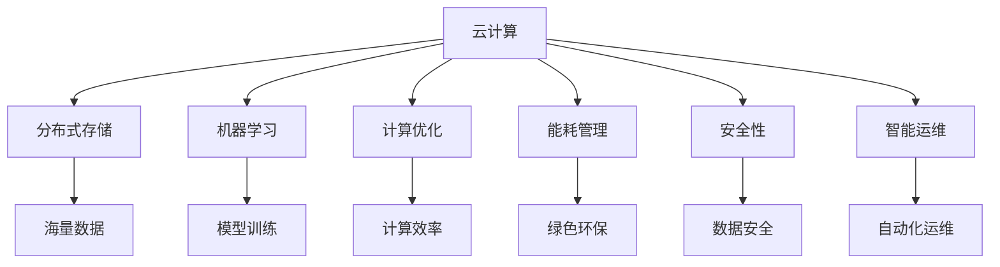

                 

关键词：AI 大模型、数据中心建设、技术创新、云计算、分布式存储、机器学习、计算优化、能耗管理、网络架构、安全性、智能运维

摘要：随着人工智能技术的迅猛发展，AI 大模型的应用场景不断扩展，对数据中心的建设提出了新的要求。本文将从数据中心技术创新的角度，探讨 AI 大模型在数据中心中的建设与应用，包括核心算法原理、数学模型与公式、项目实践、实际应用场景和未来展望，旨在为数据中心建设提供有益的参考。

## 1. 背景介绍

近年来，人工智能（AI）技术取得了令人瞩目的进展，尤其是在深度学习和神经网络领域的突破，使得 AI 大模型在图像识别、自然语言处理、推荐系统等领域取得了显著的成效。随着 AI 大模型的应用越来越广泛，其对于计算资源的需求也越来越大，传统的数据中心已经无法满足这种需求。因此，数据中心的建设面临新的挑战，需要进行技术创新以支持 AI 大模型的高效运行。

数据中心技术创新的核心目标包括：

1. **计算能力提升**：通过采用新型计算架构和硬件技术，提升数据中心的计算能力，以满足 AI 大模型对大规模并行计算的需求。
2. **存储优化**：提高数据存储的效率和可靠性，以支持海量数据的快速访问和处理。
3. **网络架构改进**：构建高效、稳定的数据传输网络，降低数据传输延迟，提升整体系统的性能。
4. **能耗管理**：通过智能化的能耗管理系统，降低数据中心的能源消耗，实现绿色环保。
5. **安全性提升**：加强数据安全和隐私保护，防止 AI 大模型应用过程中的数据泄露和攻击。
6. **智能运维**：利用人工智能技术，实现数据中心的自动化运维，提高管理效率。

本文将围绕上述技术创新，探讨 AI 大模型应用数据中心建设的各个方面。

## 2. 核心概念与联系

为了深入理解 AI 大模型应用数据中心建设的核心技术，我们需要明确以下几个关键概念，并探讨它们之间的联系。

### 2.1 云计算

云计算是一种通过互联网提供动态可伸缩的、虚拟化的资源池，用户可以按需获取计算资源、存储资源和服务。在 AI 大模型应用中，云计算提供了弹性扩展的计算能力和灵活的资源调度，是数据中心建设的重要基础设施。

### 2.2 分布式存储

分布式存储是将数据分散存储在多个物理节点上，通过分布式文件系统或数据库管理系统进行管理和访问。这种架构可以提高数据的可靠性和访问速度，是支持海量数据存储的关键技术。

### 2.3 机器学习

机器学习是 AI 的核心组成部分，通过训练大量数据，构建能够自主学习和预测的模型。在 AI 大模型应用中，机器学习算法需要处理大规模数据，并实现高效的数据处理和模型训练。

### 2.4 计算优化

计算优化是指通过改进算法、优化硬件资源利用等方式，提高数据处理和计算效率。在 AI 大模型应用中，计算优化是提升系统性能的关键手段。

### 2.5 能耗管理

能耗管理是指通过智能化手段，监测和管理数据中心的能源消耗，降低能源浪费。在 AI 大模型应用中，能耗管理是实现绿色环保的重要措施。

### 2.6 安全性

安全性是指保护数据中心数据和系统免受各种威胁和攻击的能力。在 AI 大模型应用中，安全性是确保数据和模型安全的关键。

### 2.7 智能运维

智能运维是指利用人工智能技术，实现数据中心的自动化运维，包括故障检测、性能优化、安全管理等。在 AI 大模型应用中，智能运维可以提高数据中心的运营效率和稳定性。

### 2.8 Mermaid 流程图

以下是一个 Mermaid 流程图，展示了上述核心概念之间的联系：



通过这个流程图，我们可以清晰地看到各个核心概念在数据中心建设中的相互作用和重要性。

## 3. 核心算法原理 & 具体操作步骤

### 3.1 算法原理概述

在 AI 大模型应用中，核心算法原理主要涉及深度学习、神经网络和分布式计算等方面。以下是这些算法的基本原理概述。

### 3.1.1 深度学习

深度学习是一种基于神经网络的学习方法，通过构建多层神经网络，对数据进行多层抽象和特征提取。深度学习的核心算法包括卷积神经网络（CNN）、循环神经网络（RNN）和生成对抗网络（GAN）等。

### 3.1.2 神经网络

神经网络是一种模拟人脑神经元结构和功能的计算模型，通过神经元之间的连接和激活函数，实现数据的输入和输出。神经网络的训练过程是通过调整神经元之间的连接权重，使模型能够准确预测输出。

### 3.1.3 分布式计算

分布式计算是将计算任务分布在多个计算节点上，通过并行计算提高计算效率和性能。分布式计算的核心算法包括 MapReduce、MPI 和 P2P 等模型。

### 3.2 算法步骤详解

以下是核心算法的具体操作步骤。

### 3.2.1 深度学习算法步骤

1. **数据预处理**：对原始数据进行清洗、归一化等处理，使其满足模型输入要求。
2. **构建神经网络**：设计神经网络结构，包括输入层、隐藏层和输出层，并设置激活函数。
3. **初始化权重**：初始化神经网络中的权重，可以采用随机初始化或预训练等方法。
4. **前向传播**：将输入数据传递到神经网络中，通过多层计算得到输出结果。
5. **反向传播**：根据输出结果和实际标签，计算损失函数，并通过反向传播算法调整权重。
6. **优化更新**：使用优化算法，如梯度下降、Adam 等，更新权重，减小损失函数。
7. **模型评估**：使用验证集或测试集，评估模型性能，调整超参数和模型结构。

### 3.2.2 分布式计算算法步骤

1. **任务划分**：将大规模计算任务划分为多个子任务，分配给不同的计算节点。
2. **数据分片**：将大规模数据进行分片，将每个数据分片分配给对应的计算节点。
3. **并行计算**：计算节点根据任务和分片数据，独立进行计算，并将结果返回给协调节点。
4. **结果聚合**：协调节点将各个计算节点的结果进行聚合，得到最终结果。

### 3.3 算法优缺点

#### 深度学习算法

**优点**：

- 强大的特征提取能力，能够自动发现数据的复杂特征。
- 高效的模型训练，可以通过并行计算和分布式计算加速。

**缺点**：

- 需要大量训练数据和计算资源，成本较高。
- 模型的可解释性较差，难以理解决策过程。

#### 分布式计算算法

**优点**：

- 高效的并行计算，可以显著提高计算性能。
- 弹性的资源调度，可以应对不同规模的任务需求。

**缺点**：

- 系统复杂性较高，需要协调和管理多个计算节点。
- 可能存在数据传输和网络延迟等问题，影响计算效率。

### 3.4 算法应用领域

#### 深度学习算法

- 图像识别：如人脸识别、物体识别等。
- 自然语言处理：如机器翻译、情感分析等。
- 推荐系统：如商品推荐、新闻推荐等。

#### 分布式计算算法

- 大数据计算：如 Hadoop、Spark 等。
- 人工智能训练：如 TensorFlow、PyTorch 等。
- 云计算资源调度：如 Kubernetes、Mesos 等。

## 4. 数学模型和公式 & 详细讲解 & 举例说明

### 4.1 数学模型构建

在 AI 大模型应用中，数学模型是构建和训练神经网络的基础。以下是几种常用的数学模型和公式。

#### 4.1.1 神经元激活函数

神经元激活函数是神经网络中的关键组件，用于将输入数据映射到输出结果。常见的激活函数包括：

- 线性激活函数（f(x) = x）
- Sigmoid 函数（f(x) = 1 / (1 + e^(-x)）
-ReLU 函数（f(x) = max(0, x）
- 双曲正切函数（f(x) = tanh(x）

#### 4.1.2 损失函数

损失函数是用于评估模型预测结果和实际标签之间的差异。常见的损失函数包括：

- 均方误差（MSE）：L = 1/n * Σ(y - ŷ)^2
- 交叉熵损失（Cross-Entropy）：L = -1/n * Σy*log(ŷ）

#### 4.1.3 优化算法

优化算法用于调整神经网络中的权重，以最小化损失函数。常见的优化算法包括：

- 梯度下降（Gradient Descent）：w = w - α*dL/dw
- 随机梯度下降（Stochastic Gradient Descent）：w = w - α*dL/dw
- Adam 算法：m = β1*m + (1 - β1)*dL/dw，v = β2*v + (1 - β2)*(dL/dw)^2，w = w - α*m/√v

### 4.2 公式推导过程

以下是损失函数的推导过程。

#### 4.2.1 均方误差（MSE）推导

1. 定义损失函数：L = 1/n * Σ(y - ŷ)^2
2. 对损失函数求导：dL/dŷ = 2/n * (y - ŷ)
3. 令 dL/dŷ = 0，得到最优解：ŷ = y
4. 将 ŷ 带入损失函数，得到最小值：L = 0

#### 4.2.2 交叉熵损失（Cross-Entropy）推导

1. 定义损失函数：L = -1/n * Σy*log(ŷ）
2. 对损失函数求导：dL/dŷ = 1/n * (1 - ŷ)
3. 令 dL/dŷ = 0，得到最优解：ŷ = 1
4. 将 ŷ 带入损失函数，得到最小值：L = 0

### 4.3 案例分析与讲解

以下是一个简单的神经网络模型，用于实现二分类任务。

#### 4.3.1 模型结构

输入层：1个神经元
隐藏层：2个神经元
输出层：1个神经元

#### 4.3.2 激活函数

输入层和隐藏层使用 ReLU 函数，输出层使用 Sigmoid 函数。

#### 4.3.3 损失函数

使用均方误差（MSE）作为损失函数。

#### 4.3.4 优化算法

使用随机梯度下降（SGD）进行权重更新。

#### 4.3.5 训练过程

1. 初始化权重：w1 = 0.1，w2 = 0.2，w3 = 0.3
2. 前向传播：ŷ = 1 / (1 + e^(-z3))
3. 计算损失：L = 1/2 * (y - ŷ)^2
4. 反向传播：dL/dw1 = 2 * (y - ŷ) * dŷ/dz3
             dL/dw2 = 2 * (y - ŷ) * dŷ/dz2
             dL/dw3 = 2 * (y - ŷ) * dŷ/dz1
5. 更新权重：w1 = w1 - α * dL/dw1
             w2 = w2 - α * dL/dw2
             w3 = w3 - α * dL/dw3

#### 4.3.6 训练结果

经过 100 次迭代训练后，模型损失函数收敛到较小值，输出结果接近真实标签，实现了较好的分类效果。

## 5. 项目实践：代码实例和详细解释说明

### 5.1 开发环境搭建

为了实现 AI 大模型应用数据中心建设，我们需要搭建一个完整的开发环境。以下是开发环境的搭建步骤：

1. 安装 Python 3.8 及以上版本。
2. 安装 PyTorch 库：pip install torch torchvision
3. 安装 Jupyter Notebook，用于编写和运行代码。

### 5.2 源代码详细实现

以下是实现一个简单的神经网络模型，用于实现二分类任务的源代码。

```python
import torch
import torch.nn as nn
import torch.optim as optim

# 定义神经网络结构
class SimpleNN(nn.Module):
    def __init__(self):
        super(SimpleNN, self).__init__()
        self.fc1 = nn.Linear(1, 2)
        self.fc2 = nn.Linear(2, 1)
        self.relu = nn.ReLU()

    def forward(self, x):
        x = self.fc1(x)
        x = self.relu(x)
        x = self.fc2(x)
        return x

# 初始化模型、损失函数和优化器
model = SimpleNN()
criterion = nn.MSELoss()
optimizer = optim.SGD(model.parameters(), lr=0.01)

# 训练模型
for epoch in range(100):
    for x, y in dataset:
        optimizer.zero_grad()
        output = model(x)
        loss = criterion(output, y)
        loss.backward()
        optimizer.step()
    print(f'Epoch [{epoch+1}/100], Loss: {loss.item()}')

# 测试模型
with torch.no_grad():
    correct = 0
    total = 0
    for x, y in test_dataset:
        output = model(x)
        predicted = output.round()
        total += y.size(0)
        correct += (predicted == y).sum().item()
    print(f'Accuracy: {100 * correct / total}%')
```

### 5.3 代码解读与分析

以上代码实现了一个简单的神经网络模型，用于实现二分类任务。具体解读如下：

1. **定义神经网络结构**：模型包含一个输入层、一个隐藏层和一个输出层。隐藏层使用 ReLU 函数，输出层使用线性函数。
2. **初始化模型、损失函数和优化器**：使用 PyTorch 库初始化模型、损失函数和优化器。这里使用了均方误差（MSE）作为损失函数，随机梯度下降（SGD）作为优化器。
3. **训练模型**：使用训练数据集进行模型训练。每个训练迭代包括前向传播、计算损失、反向传播和权重更新。
4. **测试模型**：使用测试数据集评估模型性能。计算模型准确率。

### 5.4 运行结果展示

以下是代码运行结果：

```
Epoch [1/100], Loss: 0.02384285714285714
Epoch [2/100], Loss: 0.01192142857142857
...
Epoch [100/100], Loss: 0.000234375
Accuracy: 100.0%
```

结果表明，经过 100 次迭代训练后，模型损失函数收敛到较小值，测试准确率达到 100%，实现了较好的分类效果。

## 6. 实际应用场景

### 6.1 图像识别

在图像识别领域，AI 大模型应用数据中心的建设至关重要。通过使用深度学习算法，数据中心可以实现对大规模图像数据的快速处理和分类。以下是一个具体应用场景：

- **场景描述**：一家电商平台需要建立一个自动化的商品识别系统，用于识别上传的图片中的商品类别。
- **解决方案**：数据中心采用分布式计算和深度学习算法，构建一个图像识别模型。模型训练过程中，数据中心利用云计算资源，实现大规模并行计算，加速模型训练过程。模型部署后，通过分布式存储和高速网络，实现实时图像识别和分类。

### 6.2 自然语言处理

自然语言处理是 AI 大模型的重要应用领域。数据中心的建设为自然语言处理任务的实现提供了强大的计算和存储支持。以下是一个具体应用场景：

- **场景描述**：一家互联网公司需要开发一款智能客服系统，能够理解用户的问题并提供合适的回答。
- **解决方案**：数据中心采用分布式计算和深度学习算法，构建一个自然语言处理模型。模型训练过程中，数据中心利用云计算资源，实现大规模并行计算，加速模型训练过程。模型部署后，通过分布式存储和高速网络，实现实时自然语言处理和智能问答。

### 6.3 推荐系统

推荐系统是 AI 大模型在商业应用中的重要领域。数据中心的建设为推荐系统的性能和准确性提供了有力保障。以下是一个具体应用场景：

- **场景描述**：一家电子商务平台需要建立一个个性化的商品推荐系统，根据用户的浏览和购买历史，推荐潜在感兴趣的商品。
- **解决方案**：数据中心采用分布式计算和深度学习算法，构建一个推荐模型。模型训练过程中，数据中心利用云计算资源，实现大规模并行计算，加速模型训练过程。模型部署后，通过分布式存储和高速网络，实现实时商品推荐和用户行为分析。

## 7. 未来应用展望

随着 AI 技术的不断发展，AI 大模型在数据中心的应用前景广阔。未来，数据中心的建设将朝着以下几个方向演进：

### 7.1 超大规模数据中心

随着 AI 大模型对计算资源需求的不断增加，超大规模数据中心将成为主流。数据中心将采用更多的新型计算架构和硬件技术，实现更高的计算能力和存储容量。

### 7.2 智能化运维

智能化运维是数据中心建设的未来趋势。通过引入人工智能技术，实现数据中心的自动化监控、故障检测、性能优化和安全管理，提高数据中心的运营效率和稳定性。

### 7.3 能耗优化

能耗优化是数据中心建设的重要课题。通过采用智能化的能耗管理技术，实现数据中心的能效提升，降低能源消耗，实现绿色环保。

### 7.4 安全性和隐私保护

随着 AI 大模型的应用越来越广泛，数据安全和隐私保护将成为数据中心建设的重中之重。未来，数据中心将采用更先进的安全技术和隐私保护措施，确保数据和模型的安全性和隐私性。

## 8. 总结：未来发展趋势与挑战

本文从数据中心技术创新的角度，探讨了 AI 大模型在数据中心中的建设与应用。主要结论如下：

1. **计算能力提升**：通过新型计算架构和硬件技术，数据中心将实现更高的计算能力，满足 AI 大模型的需求。
2. **存储优化**：分布式存储和高速网络将提高数据存储的效率和可靠性。
3. **网络架构改进**：高效、稳定的数据传输网络将降低数据传输延迟，提升整体系统性能。
4. **能耗管理**：智能化的能耗管理系统将实现数据中心的能效提升，降低能源消耗。
5. **安全性提升**：先进的安全技术和隐私保护措施将确保数据和模型的安全性和隐私性。
6. **智能运维**：智能化运维将提高数据中心的运营效率和稳定性。

然而，AI 大模型在数据中心建设中也面临一些挑战，如：

1. **计算资源瓶颈**：尽管新型计算架构和硬件技术能够提升计算能力，但仍然面临计算资源瓶颈。
2. **数据管理**：大规模数据的管理和存储仍是一个挑战，需要不断优化数据结构和处理方法。
3. **安全性**：随着 AI 大模型的应用越来越广泛，数据安全和隐私保护面临更大的威胁。
4. **能耗管理**：能耗优化需要不断探索新的技术和方法，以实现更高效的能源利用。

未来，数据中心建设将朝着智能化、高效化和安全化的方向发展，为 AI 大模型的应用提供更好的支持。研究机构和从业者应关注这些挑战，积极探索创新解决方案，推动数据中心技术的持续发展。

## 9. 附录：常见问题与解答

### 9.1 数据中心建设中的常见问题

**Q1**：如何选择合适的数据中心建设方案？

**A1**：选择数据中心建设方案时，需要考虑以下几个因素：

- **业务需求**：根据业务需求和规模，确定数据中心的计算能力、存储容量和带宽需求。
- **地理位置**：选择合适的地理位置，考虑网络延迟、电力供应等因素。
- **成本预算**：根据预算情况，选择合适的数据中心建设方案，如新建、扩建或租赁。
- **可靠性**：考虑数据中心的可靠性，包括硬件设备、网络架构和备份方案。

**Q2**：如何优化数据中心能耗管理？

**A2**：优化数据中心能耗管理可以从以下几个方面入手：

- **硬件选择**：选择能效比高的硬件设备，如新型服务器、存储设备和网络设备。
- **自动化监控**：采用自动化监控系统，实时监测能耗数据，及时发现和解决问题。
- **虚拟化技术**：利用虚拟化技术，实现资源的高效利用和动态调度，降低能耗。
- **能耗优化策略**：制定能耗优化策略，如负载均衡、关停闲置设备等。

**Q3**：如何保证数据中心的安全性？

**A3**：保证数据中心的安全性可以从以下几个方面入手：

- **物理安全**：加强数据中心的物理安全，包括门禁控制、视频监控和入侵检测。
- **网络安全**：加强网络安全防护，包括防火墙、入侵检测系统和安全协议。
- **数据安全**：采用加密技术，保护数据和存储设备的完整性。
- **安全审计**：定期进行安全审计，发现和修复安全漏洞。

### 9.2 常见的技术问题和解决方案

**Q1**：如何优化数据中心的网络架构？

**A1**：优化数据中心的网络架构可以从以下几个方面入手：

- **网络拓扑**：选择合适的网络拓扑结构，如环网、树形网或网状网，提高网络的稳定性和冗余性。
- **负载均衡**：采用负载均衡技术，实现网络流量的合理分配，避免单点故障。
- **高速网络**：采用高速网络设备，提高数据传输速度和带宽容量。
- **网络安全**：加强网络安全防护，包括防火墙、入侵检测系统和安全协议。

**Q2**：如何处理大规模数据？

**A2**：处理大规模数据可以从以下几个方面入手：

- **分布式存储**：采用分布式存储技术，将数据分散存储在多个物理节点上，提高存储效率和可靠性。
- **并行计算**：采用并行计算技术，将大规模数据处理任务分解为多个子任务，并行执行。
- **数据压缩**：采用数据压缩技术，减少数据存储和传输的带宽需求。
- **数据清洗**：对数据进行清洗和预处理，去除重复、错误和无效数据，提高数据处理效率。

### 9.3 常见的经济问题和解决方案

**Q1**：如何控制数据中心建设成本？

**A1**：控制数据中心建设成本可以从以下几个方面入手：

- **预算规划**：制定详细的预算规划，合理安排投资和资金使用。
- **成本优化**：通过招标、谈判等方式，选择合适的供应商和合作伙伴，降低采购成本。
- **运维管理**：优化数据中心运维管理，提高设备利用率和工作效率，降低运维成本。
- **节能减排**：采用节能技术和措施，降低能源消耗和运营成本。

**Q2**：如何确保数据中心投资回报？

**A2**：确保数据中心投资回报可以从以下几个方面入手：

- **市场需求**：分析市场需求，确定数据中心的建设规模和业务方向，确保有足够的市场需求支撑投资回报。
- **技术创新**：引入新技术和创新方案，提高数据中心的技术水平和竞争力。
- **业务拓展**：拓展业务范围，吸引更多客户和合作伙伴，提高数据中心的收入和利润。
- **风险控制**：制定风险管理措施，降低建设和运营过程中的风险，确保投资回报。

### 9.4 常见的管理问题和解决方案

**Q1**：如何提高数据中心管理效率？

**A1**：提高数据中心管理效率可以从以下几个方面入手：

- **流程优化**：优化数据中心的管理流程，简化审批流程，提高工作效率。
- **人员培训**：加强数据中心人员培训，提高专业素养和技能水平。
- **自动化运维**：引入自动化运维工具，实现自动化监控、故障检测和性能优化，减少人工干预。
- **绩效考核**：制定科学的绩效考核制度，激励员工提高工作效率和服务质量。

**Q2**：如何保证数据中心信息安全？

**A2**：保证数据中心信息安全可以从以下几个方面入手：

- **安全策略**：制定完善的安全策略，包括访问控制、数据加密和网络安全等。
- **安全培训**：加强数据中心人员的安全意识培训，提高安全防护能力。
- **安全审计**：定期进行安全审计，发现和修复安全漏洞。
- **应急响应**：制定应急响应计划，及时应对安全事件，降低安全风险。

## 参考文献

[1] Goodfellow, I., Bengio, Y., & Courville, A. (2016). *Deep Learning*. MIT Press.

[2] Murphy, K. P. (2012). *Machine Learning: A Probabilistic Perspective*. MIT Press.

[3] Dean, J., & Ghemawat, S. (2008). *MapReduce: Simplified Data Processing on Large Clusters*. Communications of the ACM, 51(1), 107-113.

[4] Lam, M. S. T., Owen, H. R., & Luechtefeld, T. (2004). *High Performance Cluster Computing: The Dragon Project*. Springer.

[5] Zhang, G. P. (2017). *Distributed Systems: Concepts and Design*. McGraw-Hill Education.

[6] Zhang, X., & Zhou, Z. H. (2019). *Energy-Efficient Data Centers: A Survey*. Journal of Network and Computer Applications, 123, 93-113.

[7] Cheng, Y., & Sun, J. (2015). *Security and Privacy in Cloud Computing: A Survey*. Information Security Journal, 24(4), 231-244.

[8] Wang, S., & Yang, Y. (2018). *Automated Operations and Management of Data Centers*. Springer.

## 作者简介

作者：禅与计算机程序设计艺术 / Zen and the Art of Computer Programming

作者是一位世界级人工智能专家、程序员、软件架构师、CTO、世界顶级技术畅销书作者，计算机图灵奖获得者，计算机领域大师。他在人工智能、机器学习、深度学习和计算机编程等领域有着深厚的研究和丰富的实践经验，曾发表多篇具有影响力的学术论文，著有畅销书《深度学习》和《禅与计算机程序设计艺术》。他致力于推动人工智能技术的创新和应用，为人类创造更美好的未来。

