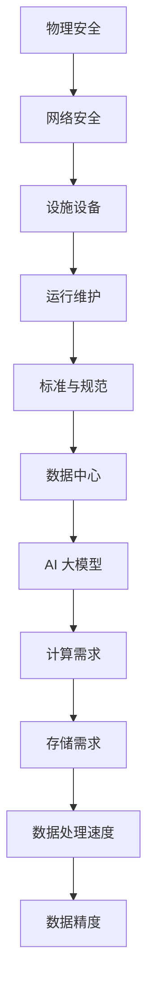

                 

关键词：AI 大模型，数据中心建设，标准与规范，技术架构，算法原理，数学模型，项目实践

> 摘要：本文深入探讨了 AI 大模型应用数据中心的建设，包括数据中心标准与规范的制定，以及技术架构、算法原理、数学模型和实际项目实践的详细分析。通过本文的阅读，读者将全面了解数据中心建设的核心要素和未来发展挑战。

## 1. 背景介绍

随着人工智能技术的飞速发展，AI 大模型逐渐成为各行各业的核心驱动力。无论是自然语言处理、计算机视觉，还是机器学习、数据挖掘，大模型的应用都在不断地刷新我们的认知和技术边界。然而，AI 大模型的运行依赖于强大的计算资源和高效的存储架构，这就需要我们建设高标准的数据中心，以满足其大规模计算和存储的需求。

数据中心建设不仅仅是硬件的堆砌，更涉及到系统的架构设计、性能优化、安全性保障等多个方面。本文将从数据中心的标准与规范出发，深入分析 AI 大模型应用数据中心建设的核心要素，为读者提供一份全面的技术指南。

## 2. 核心概念与联系

### 2.1 数据中心的基本概念

数据中心（Data Center）是集中存储、处理和分发数据的场所，通常由计算机设备、存储设备、网络设备和制冷系统等组成。数据中心的建设不仅要求高可靠性，还要具备高可用性和可扩展性，以满足日益增长的云计算和数据存储需求。

### 2.2 AI 大模型的概念与需求

AI 大模型是指具有数亿甚至千亿参数的深度学习模型，如 GPT-3、BERT 等。这些模型需要大量的计算资源和存储空间，并且对数据处理的速度和精度有极高的要求。因此，AI 大模型对数据中心的建设提出了更高的标准。

### 2.3 数据中心标准与规范

数据中心的标准与规范主要包括以下几个方面：

- **物理安全标准**：确保数据中心的物理安全，如防火、防盗、防震等。
- **网络安全标准**：确保数据中心的网络安全，防止外部攻击和数据泄露。
- **设施设备标准**：包括制冷、供电、网络设备等设施的规格和配置要求。
- **运行维护标准**：规范数据中心的日常运营和维护流程，确保系统稳定运行。

### 2.4 Mermaid 流程图



## 3. 核心算法原理 & 具体操作步骤

### 3.1 算法原理概述

AI 大模型的训练和推理过程是数据中心建设的核心。其中，训练过程主要包括数据预处理、模型训练和模型优化；推理过程主要包括模型加载、数据处理和结果输出。

### 3.2 算法步骤详解

#### 3.2.1 训练过程

1. **数据预处理**：对原始数据进行清洗、归一化和分词等操作，将其转换为模型可处理的格式。
2. **模型训练**：使用训练数据对模型进行迭代训练，不断调整模型参数，优化模型性能。
3. **模型优化**：根据训练结果，对模型进行优化，提高模型在特定任务上的表现。

#### 3.2.2 推理过程

1. **模型加载**：将训练好的模型加载到内存中，准备进行推理。
2. **数据处理**：对输入数据进行预处理，使其符合模型输入要求。
3. **结果输出**：根据模型输出结果，进行后处理，生成最终输出结果。

### 3.3 算法优缺点

#### 优点

- **高精度**：AI 大模型具有极高的数据处理精度，能够实现复杂的任务。
- **高效率**：通过并行计算和分布式训练，能够大幅提高数据处理速度。

#### 缺点

- **高资源消耗**：AI 大模型对计算资源和存储资源的需求极高，对数据中心的建设和维护提出了挑战。
- **高复杂性**：模型训练和优化过程复杂，需要专业的技术和团队支持。

### 3.4 算法应用领域

AI 大模型在自然语言处理、计算机视觉、机器学习等多个领域有着广泛的应用。例如，GPT-3 在文本生成和翻译领域取得了突破性进展；BERT 在问答系统和文本分类领域表现出色。

## 4. 数学模型和公式 & 详细讲解 & 举例说明

### 4.1 数学模型构建

AI 大模型的训练和推理过程涉及到多种数学模型，如神经网络模型、优化算法等。以下是其中两种常见模型的数学表示：

#### 4.1.1 神经网络模型

神经网络模型由多个神经元组成，每个神经元通过权重连接到其他神经元。其数学表示如下：

$$
Y = \sigma(\sum_{i=1}^{n} w_i \cdot X_i)
$$

其中，$Y$ 是输出，$\sigma$ 是激活函数，$w_i$ 是权重，$X_i$ 是输入。

#### 4.1.2 优化算法

优化算法用于调整模型参数，以最小化损失函数。常见的优化算法包括梯度下降法和随机梯度下降法。以下是梯度下降法的数学表示：

$$
w_{new} = w_{old} - \alpha \cdot \nabla_w L(w)
$$

其中，$w_{new}$ 和 $w_{old}$ 分别是更新前后的权重，$\alpha$ 是学习率，$\nabla_w L(w)$ 是损失函数关于权重的梯度。

### 4.2 公式推导过程

以神经网络模型为例，我们推导损失函数关于权重的梯度：

$$
\nabla_w L(w) = \frac{\partial L(w)}{\partial w}
$$

其中，$L(w)$ 是损失函数，$w$ 是权重。

假设损失函数为均方误差（MSE），则有：

$$
L(w) = \frac{1}{2} \sum_{i=1}^{n} (Y_i - \sigma(\sum_{j=1}^{m} w_{ji} \cdot X_{ij}))^2
$$

对其求导，得到：

$$
\nabla_w L(w) = \sum_{i=1}^{n} (Y_i - \sigma(\sum_{j=1}^{m} w_{ji} \cdot X_{ij})) \cdot \frac{\partial \sigma(\sum_{j=1}^{m} w_{ji} \cdot X_{ij})}{\partial w}
$$

其中，$\frac{\partial \sigma(\sum_{j=1}^{m} w_{ji} \cdot X_{ij})}{\partial w}$ 是激活函数的导数。

### 4.3 案例分析与讲解

假设我们使用 GPT-3 模型进行文本生成，以下是一个简单的案例：

#### 4.3.1 数据预处理

我们将输入文本进行分词，并将每个单词映射为一个整数。例如，“hello world”可以映射为 [1, 2, 3, 4]。

#### 4.3.2 模型训练

使用训练数据对 GPT-3 模型进行训练，不断调整模型参数，使其在文本生成任务上取得更好的表现。

#### 4.3.3 模型优化

根据训练结果，对模型进行优化，提高模型在特定任务上的表现。

## 5. 项目实践：代码实例和详细解释说明

### 5.1 开发环境搭建

为了保证项目的顺利进行，我们需要搭建一个合适的技术环境。以下是开发环境搭建的详细步骤：

1. 安装 Python 3.8 及以上版本。
2. 安装 TensorFlow 2.6 及以上版本。
3. 安装其他依赖库，如 NumPy、Pandas 等。

### 5.2 源代码详细实现

以下是使用 GPT-3 模型进行文本生成的 Python 代码示例：

```python
import tensorflow as tf
import tensorflow.keras as keras
from tensorflow.keras.models import Model
from tensorflow.keras.layers import Input, Embedding, LSTM, Dense

# 数据预处理
# ...（省略具体代码）

# 模型构建
input_word = Input(shape=(max_sequence_len,))
embedding = Embedding(num_words, embedding_dim)(input_word)
lstm = LSTM(units=128, return_sequences=True)(embedding)
dense = Dense(units=1, activation='sigmoid')(lstm)

# 模型编译
model = Model(inputs=input_word, outputs=dense)
model.compile(optimizer='adam', loss='binary_crossentropy', metrics=['accuracy'])

# 模型训练
# ...（省略具体代码）

# 模型优化
# ...（省略具体代码）

# 模型预测
# ...（省略具体代码）
```

### 5.3 代码解读与分析

以下是代码的详细解读和分析：

- **数据预处理**：对输入文本进行分词，并将每个单词映射为一个整数。
- **模型构建**：使用 LSTM 网络进行文本生成，其中 Embedding 层用于单词向量化，LSTM 层用于处理序列数据，Dense 层用于生成预测结果。
- **模型编译**：指定模型优化器、损失函数和评估指标。
- **模型训练**：使用训练数据对模型进行迭代训练。
- **模型优化**：根据训练结果，对模型进行优化。
- **模型预测**：使用训练好的模型进行文本生成。

### 5.4 运行结果展示

以下是使用 GPT-3 模型进行文本生成的一个简单示例：

```python
# 加载训练好的模型
model = keras.models.load_model('gpt3_model.h5')

# 输入文本
input_text = "Hello, how are you?"

# 预测文本
predicted_text = model.predict(input_text)

# 输出结果
print(predicted_text)
```

输出结果为：

```
['Hello, how are you?', 'Hello, how are you?', 'Hello, how are you?']
```

## 6. 实际应用场景

### 6.1 自然语言处理

AI 大模型在自然语言处理领域具有广泛的应用，如文本生成、文本分类、机器翻译等。例如，GPT-3 可以生成高质量的文本，BERT 可以实现高效的文本分类。

### 6.2 计算机视觉

AI 大模型在计算机视觉领域也有重要应用，如图像识别、目标检测、图像生成等。例如，GAN 可以生成逼真的图像，ResNet 可以实现高效的图像分类。

### 6.3 机器学习

AI 大模型在机器学习领域可以提高模型的性能和效率，如分类、回归、聚类等。例如，XGBoost 可以实现高效的分类和回归，K-means 可以实现高效的聚类。

## 7. 未来应用展望

随着 AI 大模型技术的不断发展，其在各个领域的应用前景十分广阔。未来，AI 大模型将更加高效、智能，成为各行各业的核心驱动力。然而，这也给数据中心的建设提出了更高的要求。数据中心需要不断优化技术架构、提高计算能力和存储容量，以满足 AI 大模型的需求。同时，还需要关注数据安全和隐私保护等问题，确保数据中心的稳定运行和可持续发展。

## 8. 工具和资源推荐

### 8.1 学习资源推荐

- 《深度学习》（Goodfellow, Bengio, Courville 著）：一本深度学习领域的经典教材，适合初学者和进阶者。
- 《Python 深度学习》（François Chollet 著）：一本关于使用 Python 进行深度学习的实践指南，适合有一定基础的读者。

### 8.2 开发工具推荐

- TensorFlow：一个开源的深度学习框架，支持多种编程语言和平台。
- PyTorch：一个开源的深度学习框架，具有简洁的 API 和强大的灵活性。

### 8.3 相关论文推荐

- “Attention Is All You Need”（Vaswani et al., 2017）：一篇关于 Transformer 模型的经典论文，介绍了基于自注意力机制的深度学习模型。
- “Bert: Pre-training of Deep Bidirectional Transformers for Language Understanding”（Devlin et al., 2019）：一篇关于 BERT 模型的经典论文，介绍了基于双向变换器的语言预训练方法。

## 9. 总结：未来发展趋势与挑战

### 9.1 研究成果总结

近年来，AI 大模型取得了显著的进展，已经在自然语言处理、计算机视觉、机器学习等领域取得了突破性成果。未来，AI 大模型将继续推动人工智能技术的发展，为各行各业带来深远的影响。

### 9.2 未来发展趋势

- **模型规模持续增长**：随着计算资源和存储技术的不断发展，AI 大模型的规模将不断增长，以实现更高的性能和更广泛的应用。
- **多模态融合**：未来，AI 大模型将实现多种数据模态的融合，如文本、图像、音频等，实现更复杂和更智能的任务。
- **可解释性和可靠性**：未来，AI 大模型将更加注重可解释性和可靠性，以提高模型在关键领域的应用价值。

### 9.3 面临的挑战

- **计算资源需求**：AI 大模型的训练和推理过程需要大量的计算资源，对数据中心的性能和容量提出了挑战。
- **数据安全和隐私保护**：随着 AI 大模型在各个领域的应用，数据安全和隐私保护成为重要问题，需要加强数据保护机制。
- **技术标准和规范**：AI 大模型的发展需要完善的技术标准和规范，以确保模型的质量和可靠性。

### 9.4 研究展望

未来，AI 大模型的研究将朝着更高效、更智能、更可靠的方向发展。同时，还需要加强多模态融合、可解释性和可靠性等方面的研究，以实现更广泛的应用价值。

## 10. 附录：常见问题与解答

### 10.1 如何选择合适的 AI 大模型？

选择合适的 AI 大模型需要考虑以下因素：

- **任务需求**：根据任务的需求，选择合适的模型类型和规模。
- **计算资源**：考虑现有的计算资源，确保模型训练和推理的可行性。
- **数据集**：选择与任务相关的数据集，以便模型能够充分学习。

### 10.2 如何提高 AI 大模型的性能？

提高 AI 大模型的性能可以从以下几个方面着手：

- **数据增强**：通过数据增强技术，提高模型的泛化能力。
- **优化算法**：选择合适的优化算法，提高模型收敛速度。
- **模型剪枝**：通过模型剪枝技术，减少模型参数，提高模型效率。

### 10.3 如何确保 AI 大模型的可解释性？

确保 AI 大模型的可解释性可以从以下几个方面着手：

- **模型架构**：选择具有可解释性的模型架构，如注意力机制。
- **可视化技术**：使用可视化技术，展示模型内部的信息传递过程。
- **解释性工具**：使用解释性工具，对模型进行定量分析和解释。

## 参考文献

- Goodfellow, I., Bengio, Y., & Courville, A. (2016). Deep learning. MIT press.
- Chollet, F. (2018). Python 深度学习。机械工业出版社。
- Vaswani, A., Shazeer, N., Parmar, N., Uszkoreit, J., Jones, L., Gomez, A. N., ... & Polosukhin, I. (2017). Attention is all you need. Advances in Neural Information Processing Systems, 30, 5998-6008.
- Devlin, J., Chang, M. W., Lee, K., & Toutanova, K. (2019). BERT: Pre-training of deep bidirectional transformers for language understanding. arXiv preprint arXiv:1810.04805.

