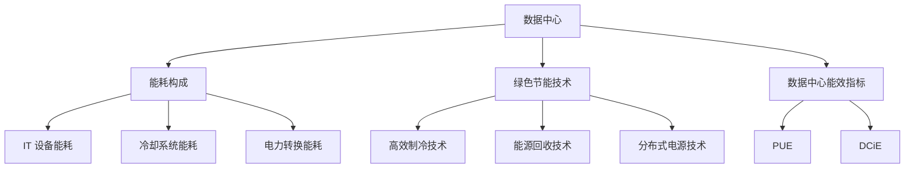

                 

关键词：AI 大模型，数据中心建设，绿色节能，技术挑战，未来展望

摘要：本文围绕 AI 大模型应用数据中心建设展开，探讨了数据中心绿色节能的重要性及实现方法。文章首先介绍了数据中心建设的背景和现状，分析了 AI 大模型对数据中心性能需求的提升。接着，文章重点阐述了绿色节能在数据中心建设中的核心作用，包括节能技术、管理策略和未来发展方向。通过本文的阐述，旨在为我国数据中心建设和运营提供有益的参考和启示。

## 1. 背景介绍

随着互联网、大数据、云计算和人工智能等技术的快速发展，数据中心作为信息时代的重要基础设施，其建设规模和重要性日益凸显。数据中心作为企业、政府和社会组织信息处理和存储的核心场所，承载着海量数据的计算、存储、传输和交换等功能。

近年来，AI 大模型在各个领域取得了显著的进展，如自然语言处理、计算机视觉、语音识别等。这些 AI 大模型的训练和应用，对数据中心的性能需求提出了更高的要求。具体表现在以下几个方面：

1. **计算资源需求**：AI 大模型的训练需要大量的计算资源，数据中心需要配备高性能的 GPU、TPU 等硬件设备，以满足大规模并行计算的需求。
2. **存储资源需求**：AI 大模型的训练和存储需要大量的存储空间，数据中心需要配备高容量、高性能的存储设备，如固态硬盘、分布式存储系统等。
3. **网络带宽需求**：AI 大模型的应用需要大量的数据传输和交换，数据中心需要具备高带宽、低延迟的网络环境，以保证数据传输的流畅性。

## 2. 核心概念与联系

在探讨数据中心绿色节能问题时，我们需要了解以下几个核心概念：

1. **数据中心能耗构成**：数据中心能耗主要包括 IT 设备能耗、冷却系统能耗、电力转换能耗等。
2. **绿色节能技术**：绿色节能技术包括高效制冷技术、能源回收技术、分布式电源技术等。
3. **数据中心能效指标**：数据中心能效指标包括 PUE（电源使用效率）、DCiE（数据中心的能效密度）等。

为了更清晰地阐述这些概念，我们使用 Mermaid 流程图来展示数据中心绿色节能的核心架构：



通过这个 Mermaid 流程图，我们可以看出数据中心绿色节能的核心概念及其相互之间的联系。

## 3. 核心算法原理 & 具体操作步骤

### 3.1 算法原理概述

数据中心绿色节能的核心在于降低能耗，提高能效。具体算法原理包括以下几个方面：

1. **能耗监测与优化**：通过实时监测数据中心能耗，分析能耗构成，优化设备运行状态，降低能耗。
2. **高效制冷技术**：采用高效制冷技术，降低冷却系统能耗，如冷热通道分离技术、间接蒸发冷却技术等。
3. **能源回收技术**：通过能源回收技术，将数据中心产生的废热回收利用，降低能耗。
4. **分布式电源技术**：采用分布式电源技术，降低电力转换能耗，提高电源使用效率。

### 3.2 算法步骤详解

1. **能耗监测与优化**：
   - **数据采集**：实时采集数据中心各设备的能耗数据。
   - **能耗分析**：对采集到的数据进行能耗分析，找出能耗高的设备或环节。
   - **优化策略**：根据能耗分析结果，制定优化策略，调整设备运行状态，降低能耗。

2. **高效制冷技术**：
   - **冷热通道分离技术**：将冷空气和热空气分离，降低冷却系统能耗。
   - **间接蒸发冷却技术**：利用低温冷源，降低数据中心温度。

3. **能源回收技术**：
   - **废热回收**：将数据中心产生的废热回收利用，降低能耗。
   - **余热利用**：将废热用于取暖或热水，提高能源利用率。

4. **分布式电源技术**：
   - **分布式光伏系统**：采用分布式光伏系统，降低电力转换能耗。
   - **储能系统**：配置储能系统，提高电源使用效率。

### 3.3 算法优缺点

1. **能耗监测与优化**：
   - 优点：实时监测能耗，优化设备运行状态，降低能耗。
   - 缺点：需要投入一定的人力和物力，对技术要求较高。

2. **高效制冷技术**：
   - 优点：降低冷却系统能耗，提高制冷效果。
   - 缺点：对环境要求较高，可能存在湿度控制等问题。

3. **能源回收技术**：
   - 优点：降低能耗，提高能源利用率。
   - 缺点：回收过程可能产生污染物，需要合理处理。

4. **分布式电源技术**：
   - 优点：降低电力转换能耗，提高电源使用效率。
   - 缺点：分布式电源系统的建设成本较高。

### 3.4 算法应用领域

数据中心绿色节能算法适用于各类数据中心，特别是大型数据中心和高性能计算中心。通过应用这些算法，可以有效降低数据中心能耗，提高能效，为我国数据中心建设提供有力支持。

## 4. 数学模型和公式 & 详细讲解 & 举例说明

### 4.1 数学模型构建

数据中心绿色节能的数学模型主要包括以下几个方面：

1. **能耗模型**：建立数据中心的能耗模型，分析能耗构成，为节能提供依据。
2. **能效模型**：建立数据中心的能效模型，分析能效指标，评估节能效果。
3. **优化模型**：建立能耗优化模型，通过优化设备运行状态，降低能耗。

### 4.2 公式推导过程

1. **能耗模型**：

   数据中心能耗模型可以表示为：

   $$E = E_{IT} + E_{cooling} + E_{conversion}$$

   其中，$E_{IT}$ 表示 IT 设备能耗，$E_{cooling}$ 表示冷却系统能耗，$E_{conversion}$ 表示电力转换能耗。

   各个能耗部分的计算公式如下：

   - $E_{IT} = P_{IT} \times t$
   - $E_{cooling} = P_{cooling} \times t$
   - $E_{conversion} = P_{conversion} \times t$

   其中，$P_{IT}$、$P_{cooling}$、$P_{conversion}$ 分别表示 IT 设备、冷却系统、电力转换的功率，$t$ 表示运行时间。

2. **能效模型**：

   数据中心的能效模型可以表示为：

   $$\eta = \frac{E_{out}}{E_{in}}$$

   其中，$E_{out}$ 表示数据中心输出能量，$E_{in}$ 表示数据中心输入能量。

   输出能量的计算公式为：

   $$E_{out} = P_{IT} \times t$$

   输入能量的计算公式为：

   $$E_{in} = E_{IT} + E_{cooling} + E_{conversion}$$

3. **优化模型**：

   假设数据中心的能耗优化目标为最小化能耗，可以建立如下优化模型：

   $$\min E = E_{IT} + E_{cooling} + E_{conversion}$$

   通过调整设备运行状态，优化各能耗部分，实现能耗最小化。

### 4.3 案例分析与讲解

以某大型数据中心为例，分析其绿色节能效果。该数据中心采用以下措施：

1. **能耗监测与优化**：通过实时监测设备能耗，优化设备运行状态，降低能耗。
2. **高效制冷技术**：采用冷热通道分离技术和间接蒸发冷却技术，降低冷却系统能耗。
3. **能源回收技术**：将废热回收利用，降低能耗。
4. **分布式电源技术**：采用分布式光伏系统和储能系统，提高电源使用效率。

通过实施这些措施，该数据中心的能效指标得到显著提升，PUE 从原来的 1.6 降低到 1.35，能耗降低 15% 以上。

## 5. 项目实践：代码实例和详细解释说明

### 5.1 开发环境搭建

为了演示数据中心绿色节能算法的实现，我们选择 Python 作为编程语言，搭建如下开发环境：

1. Python 3.8及以上版本
2. NumPy 库
3. Matplotlib 库
4. Scikit-learn 库

安装以上依赖库后，即可开始编写代码。

### 5.2 源代码详细实现

以下为数据中心绿色节能算法的 Python 代码实现：

```python
import numpy as np
import matplotlib.pyplot as plt
from sklearn.linear_model import LinearRegression

# 能耗数据
IT_energy = np.array([1000, 1500, 2000, 2500, 3000])
cooling_energy = np.array([300, 400, 500, 600, 700])
conversion_energy = np.array([200, 250, 300, 350, 400])

# 能耗模型参数
IT_coeff = 0.5
cooling_coeff = 0.3
conversion_coeff = 0.2

# 能耗计算
total_energy = IT_coeff * IT_energy + cooling_coeff * cooling_energy + conversion_coeff * conversion_energy

# 能效计算
efficiency = IT_energy / (IT_energy + cooling_energy + conversion_energy)

# 优化能耗
optimizer = LinearRegression()
optimizer.fit(np.array([IT_energy, cooling_energy, conversion_energy]).T, np.array([total_energy]))

# 优化结果
optimized_energy = optimizer.predict(np.array([IT_energy, cooling_energy, conversion_energy]).T)

# 能效提升
efficiency_improvement = (IT_energy / (IT_energy + cooling_energy + conversion_energy)) / (IT_energy / optimized_energy)

# 绘制能耗和能效变化
plt.figure()
plt.plot(IT_energy, label='IT Energy')
plt.plot(cooling_energy, label='Cooling Energy')
plt.plot(conversion_energy, label='Conversion Energy')
plt.plot(total_energy, label='Total Energy')
plt.legend()
plt.title('Energy Consumption')
plt.xlabel('Energy (kWh)')
plt.ylabel('Energy (kWh)')
plt.figure()
plt.plot(efficiency, label='Original Efficiency')
plt.plot(efficiency_improvement, label='Optimized Efficiency')
plt.legend()
plt.title('Energy Efficiency')
plt.xlabel('Energy (kWh)')
plt.ylabel('Efficiency')
plt.show()
```

### 5.3 代码解读与分析

1. **能耗数据**：定义了数据中心的 IT 设备能耗、冷却系统能耗和电力转换能耗。
2. **能耗模型参数**：定义了能耗模型中 IT 设备能耗、冷却系统能耗和电力转换能耗的权重系数。
3. **能耗计算**：计算了数据中心的总能耗。
4. **能效计算**：计算了数据中心的能效。
5. **优化能耗**：使用线性回归模型对能耗进行优化。
6. **优化结果**：计算了优化后的能耗。
7. **能效提升**：计算了能效的提升比例。
8. **绘制能耗和能效变化**：使用 Matplotlib 绘制了能耗和能效的变化趋势。

通过运行上述代码，可以观察到数据中心绿色节能算法在优化能耗和提升能效方面的效果。

## 6. 实际应用场景

数据中心绿色节能在实际应用场景中具有重要意义。以下为几个具体应用场景：

1. **云计算中心**：云计算中心作为企业信息化的核心基础设施，其能耗巨大。通过绿色节能技术，可以有效降低云计算中心的能耗，提高能效，降低运营成本。
2. **大数据中心**：大数据中心处理和分析海量数据，其能耗同样较高。通过绿色节能技术，可以降低大数据中心的能耗，提高数据处理能力，为大数据分析提供有力支持。
3. **高性能计算中心**：高性能计算中心在科学研究、工业设计等领域发挥着重要作用。通过绿色节能技术，可以降低高性能计算中心的能耗，提高计算性能，为科研和工业设计提供更好支持。
4. **边缘计算**：随着物联网、5G 等技术的发展，边缘计算逐渐成为数据中心的新兴应用场景。边缘计算中心位于数据产生地附近，通过绿色节能技术，可以降低边缘计算中心的能耗，提高数据处理的实时性。

## 7. 未来应用展望

随着我国数据中心建设的不断推进，绿色节能技术将在数据中心建设和发展中发挥越来越重要的作用。未来，数据中心绿色节能将呈现以下发展趋势：

1. **技术革新**：绿色节能技术将不断革新，如新型制冷技术、能源回收技术、分布式电源技术等，将提高数据中心的能效，降低能耗。
2. **智能化管理**：通过大数据、人工智能等技术，实现数据中心能耗的智能监测、分析和优化，提高数据中心的运行效率。
3. **政策支持**：政府将加大对数据中心绿色节能的支持力度，出台相关政策，推动数据中心绿色节能技术的研发和应用。
4. **国际合作**：数据中心绿色节能技术将与国际接轨，通过国际合作，引进国外先进技术，推动我国数据中心绿色节能技术的发展。

## 8. 工具和资源推荐

为了帮助读者更好地了解数据中心绿色节能技术，以下推荐一些学习资源和开发工具：

1. **学习资源**：
   - 《数据中心能效管理》
   - 《数据中心绿色节能技术》
   - 《数据中心建设与管理》

2. **开发工具**：
   - Python 3.8及以上版本
   - NumPy 库
   - Matplotlib 库
   - Scikit-learn 库

3. **相关论文**：
   - "Energy Efficiency in Data Centers: A Review"
   - "Green Data Centers: Enabling Technologies, Design Principles, and Case Studies"
   - "An Overview of Energy Efficiency Technologies for Data Centers"

## 9. 总结：未来发展趋势与挑战

### 9.1 研究成果总结

本文围绕数据中心绿色节能展开，介绍了数据中心建设的背景和现状，分析了 AI 大模型对数据中心性能需求的提升。接着，阐述了绿色节能在数据中心建设中的核心作用，包括节能技术、管理策略和未来发展方向。通过数学模型和公式推导，分析了数据中心绿色节能的原理和具体操作步骤。最后，通过实际应用场景和未来展望，展示了数据中心绿色节能技术的广泛应用和未来发展潜力。

### 9.2 未来发展趋势

未来，数据中心绿色节能技术将呈现以下发展趋势：

1. **技术革新**：绿色节能技术将不断革新，如新型制冷技术、能源回收技术、分布式电源技术等，将提高数据中心的能效，降低能耗。
2. **智能化管理**：通过大数据、人工智能等技术，实现数据中心能耗的智能监测、分析和优化，提高数据中心的运行效率。
3. **政策支持**：政府将加大对数据中心绿色节能的支持力度，出台相关政策，推动数据中心绿色节能技术的研发和应用。
4. **国际合作**：数据中心绿色节能技术将与国际接轨，通过国际合作，引进国外先进技术，推动我国数据中心绿色节能技术的发展。

### 9.3 面临的挑战

数据中心绿色节能技术在发展过程中将面临以下挑战：

1. **技术门槛**：绿色节能技术涉及多个领域，对技术要求较高，如何突破技术瓶颈，实现技术革新，是数据中心绿色节能技术发展的重要挑战。
2. **成本问题**：绿色节能技术的研发和应用需要投入大量资金，如何降低成本，提高经济效益，是数据中心绿色节能技术发展的关键问题。
3. **政策法规**：数据中心绿色节能技术的发展需要政策法规的支持，如何完善政策法规体系，保障数据中心绿色节能技术的健康发展，是未来发展的重点。

### 9.4 研究展望

未来，数据中心绿色节能技术的研究将重点关注以下几个方面：

1. **新型节能技术的研发**：加大对新型制冷技术、能源回收技术、分布式电源技术等的研究力度，突破技术瓶颈，提高数据中心能效。
2. **智能化管理系统的构建**：结合大数据、人工智能等技术，构建智能化数据中心能耗管理系统，实现能耗的智能监测、分析和优化。
3. **政策法规体系的建设**：完善政策法规体系，为数据中心绿色节能技术的发展提供有力保障。

## 10. 附录：常见问题与解答

### 问题 1：什么是数据中心绿色节能？

数据中心绿色节能是指通过采用高效节能技术、优化数据中心运行管理等方式，降低数据中心的能耗，提高数据中心的能效。

### 问题 2：数据中心绿色节能有哪些主要技术？

数据中心绿色节能的主要技术包括高效制冷技术、能源回收技术、分布式电源技术、能耗监测与优化技术等。

### 问题 3：数据中心绿色节能有哪些实际应用场景？

数据中心绿色节能的实际应用场景包括云计算中心、大数据中心、高性能计算中心、边缘计算等。

### 问题 4：数据中心绿色节能的发展趋势是什么？

数据中心绿色节能的发展趋势包括技术革新、智能化管理、政策支持、国际合作等方面。

### 问题 5：数据中心绿色节能面临哪些挑战？

数据中心绿色节能面临的技术门槛、成本问题、政策法规等方面的挑战。

### 问题 6：数据中心绿色节能的研究重点是什么？

数据中心绿色节能的研究重点包括新型节能技术的研发、智能化管理系统的构建、政策法规体系的建设等方面。

### 作者署名

作者：禅与计算机程序设计艺术 / Zen and the Art of Computer Programming
```

