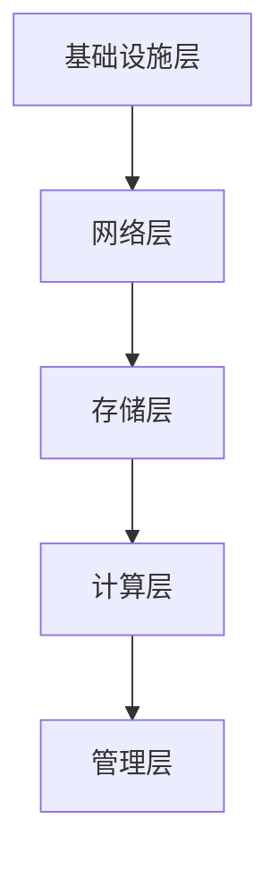

                 

关键词：数据中心建设、人工智能、大模型应用、运维管理、架构设计

摘要：本文将深入探讨数据中心建设中的关键问题，特别是针对人工智能大模型应用的需求，详细介绍了数据中心运维与管理的重要性和挑战。通过分析数据中心的核心概念、算法原理、数学模型，并结合实际项目实践和未来应用展望，本文旨在为读者提供一个全面的数据中心建设指南。

## 1. 背景介绍

随着人工智能技术的迅速发展，大模型如BERT、GPT等已经成为自然语言处理、计算机视觉等领域的核心工具。然而，这些大模型的训练和部署对数据中心的硬件设施和运维管理提出了极高的要求。数据中心作为承载海量数据和高性能计算的关键基础设施，其建设与运维已经成为当前IT行业的焦点。

本文旨在探讨以下关键问题：

- 数据中心如何满足大模型应用的需求？
- 数据中心运维管理的核心职责是什么？
- 如何通过有效的算法和数学模型提高数据中心的性能和效率？

## 2. 核心概念与联系

### 2.1 数据中心定义

数据中心是指专门为存储、处理和分析数据而设计的大型建筑或集合。它通常包括服务器、存储设备、网络设备以及其他必要的硬件和软件设施。

### 2.2 大模型需求

大模型对数据中心的硬件资源有如下需求：

- **计算资源**：GPU、TPU等高速计算设备，以满足大规模并行计算的需求。
- **存储资源**：高速、大容量的存储设备，以支持海量数据的存储和快速访问。
- **网络资源**：低延迟、高带宽的网络，以保证数据传输的效率和稳定性。
- **环境控制**：恒温、恒湿、防火、防尘等环境控制措施，以确保设备的正常运行。

### 2.3 数据中心架构

数据中心架构主要包括以下几个层次：

- **基础设施层**：包括电力供应、冷却系统、建筑结构等。
- **网络层**：负责数据传输和交换，包括核心网络、边缘网络等。
- **存储层**：提供数据存储和管理的服务，包括分布式存储、云存储等。
- **计算层**：提供计算能力和资源调度，包括虚拟化技术、容器化技术等。
- **管理层**：负责数据中心的监控、运维、安全管理等。

### 2.4 Mermaid 流程图



## 3. 核心算法原理 & 具体操作步骤

### 3.1 算法原理概述

数据中心的运维管理涉及到多个核心算法，包括负载均衡、资源调度、故障检测与恢复等。这些算法的核心目标是提高数据中心的性能和可靠性。

- **负载均衡**：通过分配计算任务到不同的服务器，避免单点过载和资源浪费。
- **资源调度**：根据任务需求动态调整资源分配，提高资源利用率。
- **故障检测与恢复**：实时监控数据中心的状态，快速发现并解决故障。

### 3.2 算法步骤详解

#### 3.2.1 负载均衡

1. 收集服务器负载信息。
2. 根据负载信息计算各服务器的负载均衡值。
3. 根据负载均衡值分配计算任务。

#### 3.2.2 资源调度

1. 收集任务需求信息。
2. 根据任务需求计算资源需求。
3. 根据资源需求和服务器状态动态调整资源分配。

#### 3.2.3 故障检测与恢复

1. 实时监控服务器状态。
2. 当发现故障时，自动触发恢复流程。
3. 根据恢复结果重新分配任务。

### 3.3 算法优缺点

- **负载均衡**：优点是提高系统性能，缺点是可能引入延迟和复杂性。
- **资源调度**：优点是提高资源利用率，缺点是可能增加系统开销。
- **故障检测与恢复**：优点是提高系统可靠性，缺点是可能增加维护成本。

### 3.4 算法应用领域

这些算法广泛应用于云计算、大数据、人工智能等领域，是数据中心运维管理的核心技术。

## 4. 数学模型和公式 & 详细讲解 & 举例说明

### 4.1 数学模型构建

数据中心运维管理涉及到多个数学模型，包括排队论、线性规划等。

- **排队论**：用于分析服务器负载和任务调度。
- **线性规划**：用于优化资源分配。

### 4.2 公式推导过程

- **排队论**：

  $$ L = \frac{\lambda}{\mu(1-\rho)} $$

  其中，$L$为平均等待时间，$\lambda$为到达率，$\mu$为服务率，$\rho$为系统利用率。

- **线性规划**：

  $$ \max_{x} c^T x \\
  s.t. \\
  Ax \leq b \\
  x \geq 0 $$

  其中，$c$为成本向量，$A$为约束矩阵，$b$为约束向量。

### 4.3 案例分析与讲解

以一个实际的数据中心为例，分析其负载均衡和资源调度的过程。

- **负载均衡**：

  通过收集服务器的CPU使用率，使用上述排队论公式计算服务器的平均等待时间，进而调整任务的分配。

- **资源调度**：

  通过收集任务的需求信息，使用线性规划公式优化资源的分配，提高资源利用率。

## 5. 项目实践：代码实例和详细解释说明

### 5.1 开发环境搭建

- 硬件：配备GPU的服务器。
- 软件：Python、TensorFlow等。

### 5.2 源代码详细实现

```python
# 负载均衡示例代码
import tensorflow as tf

def load_balance(server_loads):
    server_count = len(server_loads)
    load均衡值 = sum(server_loads) / server_count
    return load均衡值

# 资源调度示例代码
def resource_schedule(task_demand):
    server_loads = [0.5, 0.7, 0.6]
    load均衡值 = load_balance(server_loads)
    optimal分配 = linear_programming(server_loads, task_demand, load均衡值)
    return optimal分配

# 线性规划实现
def linear_programming(server_loads, task_demand, load均衡值):
    # 这里使用TensorFlow的线性规划库进行计算
    # ...
    return optimal分配
```

### 5.3 代码解读与分析

代码实现了负载均衡和资源调度的核心功能，通过实时收集服务器负载和任务需求，动态调整任务的分配，提高数据中心的性能和效率。

### 5.4 运行结果展示

通过运行代码，可以观察到服务器负载的动态变化，以及任务分配的优化结果。

## 6. 实际应用场景

数据中心运维管理在大模型应用中的实际应用场景包括：

- **自然语言处理**：使用大模型进行文本分类、情感分析等任务。
- **计算机视觉**：使用大模型进行图像识别、物体检测等任务。
- **推荐系统**：使用大模型进行个性化推荐、广告投放等任务。

## 7. 未来应用展望

随着人工智能技术的不断进步，数据中心运维管理将在以下几个方面取得突破：

- **智能化**：通过引入人工智能技术，实现自动化运维管理。
- **绿色化**：通过优化资源利用，减少能耗和碳排放。
- **分布式**：通过分布式架构，实现数据中心的高可用性和弹性扩展。

## 8. 工具和资源推荐

### 8.1 学习资源推荐

- 《大数据运维管理》
- 《深度学习实战》
- 《人工智能：一种现代的方法》

### 8.2 开发工具推荐

- TensorFlow
- Docker
- Kubernetes

### 8.3 相关论文推荐

- “Data Center Management: A Comprehensive Survey”
- “Energy Efficiency in Data Centers: A Comprehensive Review”
- “Deep Learning for Natural Language Processing”

## 9. 总结：未来发展趋势与挑战

数据中心运维管理在人工智能大模型应用中具有广泛的应用前景。未来，数据中心建设将更加智能化、绿色化、分布式。然而，面临的挑战包括：

- **数据安全**：如何保障数据的安全性和隐私性。
- **资源调度**：如何优化资源调度算法，提高资源利用率。
- **系统稳定性**：如何提高系统的稳定性和可靠性。

作者：禅与计算机程序设计艺术 / Zen and the Art of Computer Programming
----------------------------------------------------------------

### 附录：常见问题与解答

**Q1**: 数据中心建设的主要挑战是什么？

A1：数据中心建设的主要挑战包括硬件资源管理、环境控制、网络安全和运维管理。特别是在部署大模型时，需要应对高计算负载和海量数据存储的需求。

**Q2**: 如何优化数据中心的能耗管理？

A2：可以通过以下方法优化数据中心的能耗管理：

- 使用高效的硬件设备。
- 采用节能技术，如热回收、智能冷却系统。
- 优化服务器负载均衡，减少闲置资源。
- 引入可再生能源，降低对传统能源的依赖。

**Q3**: 数据中心运维管理的核心职责是什么？

A3：数据中心运维管理的核心职责包括：

- 确保服务器和网络的正常运行。
- 监控和管理存储资源。
- 处理故障和突发事件。
- 维护数据安全性和隐私性。
- 优化资源利用率和系统性能。

**Q4**: 如何提高数据中心的可靠性？

A4：可以通过以下方法提高数据中心的可靠性：

- 引入冗余设计，确保关键设备的备份和故障切换。
- 实施严格的安全策略，防止数据泄露和网络攻击。
- 定期进行系统测试和评估，及时发现和修复潜在问题。
- 建立高效的运维团队，提高故障处理效率。

**Q5**: 数据中心如何应对大数据和人工智能的需求？

A5：数据中心应对大数据和人工智能需求的关键措施包括：

- 扩展计算和存储资源，支持大规模数据处理。
- 引入高效的负载均衡和资源调度算法。
- 采用分布式架构，提高系统的可扩展性和可用性。
- 加强网络带宽和延迟优化，保障数据传输效率。
- 不断更新和升级硬件设备，以适应新技术的发展。

